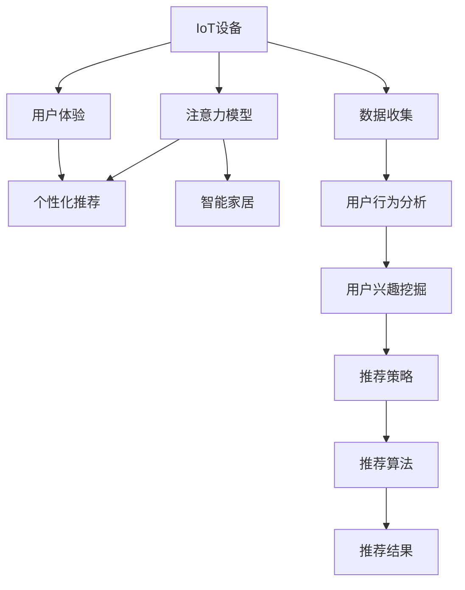

                 

# 物联网设备的注意力争夺与用户体验

> 关键词：物联网,注意力模型,用户体验,个性化推荐,智能家居

## 1. 背景介绍

随着物联网(IoT)技术的发展，越来越多的智能设备和应用程序走进人们的日常生活。智能音箱、智能手表、智能家居等设备通过语音、手势等交互方式，极大地提升了生活的便捷性和智能化水平。但与此同时，这些设备也在争夺着用户的注意力，如何提供优质的用户体验，成为IoT系统设计的关键问题。

### 1.1 问题由来
IoT设备通过接入互联网，实时感知和交互环境变化，从而提供个性化服务。但随着设备数量的增加，不同设备之间的信息争夺变得更加激烈。一个典型的场景是智能音箱和智能音箱应用，用户需要在不同设备间频繁切换，消耗大量时间和精力。如何优化设备的注意力分配，提升用户体验，成为IoT系统设计的重要课题。

### 1.2 问题核心关键点
当前IoT设备注意力争夺的问题主要集中在以下几个方面：
- 用户注意力的有限性。用户注意力是有限的，如何在多个设备间合理分配，避免频繁切换带来的疲劳。
- 设备的智能推荐能力。智能设备通过推荐技术引导用户使用，但推荐策略不当可能导致用户信息过载。
- 用户个性化需求的多样性。不同用户的偏好、需求存在差异，如何提供定制化的体验，提升用户满意度。

解决这些问题，需要从设备的智能推荐、用户的个性化需求以及注意力的管理等多个角度进行深入探讨。

### 1.3 问题研究意义
优化IoT设备的注意力分配，提升用户体验，具有重要意义：

1. 提升用户满意度。合理分配用户注意力，使用户能够快速获取需要的信息和服务，减少切换带来的干扰。
2. 提高设备的价值。智能推荐和注意力管理，可以增加用户使用设备的频率，提高设备的使用价值。
3. 降低用户使用成本。智能化的注意力分配，可以减少用户在不同设备间切换的时间和精力消耗，提升用户的使用体验。
4. 推动IoT应用发展。用户体验的提升将吸引更多用户采用IoT设备，促进IoT应用的普及和产业化。

## 2. 核心概念与联系

### 2.1 核心概念概述

为更好地理解IoT设备注意力争夺和用户体验优化，本节将介绍几个密切相关的核心概念：

- IoT设备：包括智能手机、智能音箱、智能手表、智能家居等，通过网络连接实现信息感知和交互的设备。
- 注意力模型(Attention Model)：通过分析用户注意力在不同设备上的分布，引导设备进行合理的信息推送，提升用户满意度的模型。
- 用户体验(User Experience, UX)：用户在使用IoT设备时的整体感受，包括设备操作便捷性、信息展示清晰性、交互响应速度等方面。
- 个性化推荐(Personalized Recommendation)：根据用户历史行为和偏好，实时推荐符合用户需求的信息和服务，提升用户满意度的技术。
- 智能家居(Smart Home)：通过互联网连接，实现家庭设备之间互联互通的智能系统，提高家居生活的便捷性和舒适性。

这些概念之间的逻辑关系可以通过以下Mermaid流程图来展示：



这个流程图展示了IoT设备注意力争夺和用户体验优化的核心概念及其之间的关系：

1. IoT设备通过数据收集、行为分析、兴趣挖掘等步骤，得到用户注意力和兴趣分布信息。
2. 注意力模型分析用户注意力在不同设备上的分布，进行合理的推荐。
3. 个性化推荐通过推荐算法，将符合用户兴趣的信息推送给用户。
4. 用户体验通过优化推荐策略，提升用户对设备的满意度。

这些概念共同构成了IoT设备注意力争夺和用户体验优化的完整框架，有助于我们更好地把握设备信息推送和用户交互的原理和优化方向。

## 3. 核心算法原理 & 具体操作步骤
### 3.1 算法原理概述

IoT设备的注意力争夺和用户体验优化，本质上是一个智能推荐和注意力分配的过程。其核心思想是：通过分析用户的注意力分布和兴趣偏好，智能分配设备对用户的注意力，避免信息过载和注意疲劳，同时推送个性化推荐内容，提升用户满意度。

形式化地，假设IoT设备集合为 $D=\{d_1,d_2,\cdots,d_n\}$，用户集合为 $U=\{u_1,u_2,\cdots,u_m\}$。设用户 $u_i$ 在设备 $d_j$ 上的注意力分配权重为 $a_{i,j}$，表示设备 $d_j$ 对用户 $u_i$ 的吸引力。设用户 $u_i$ 对信息 $t$ 的偏好权重为 $p_i(t)$，表示信息 $t$ 对用户 $u_i$ 的吸引力和兴趣。则在用户 $u_i$ 的时间 $t$ 内，设备 $d_j$ 对用户的注意力贡献为：

$$
A_{i,j} = a_{i,j} \times p_i(t)
$$

优化目标是通过调整设备对用户的注意力分配权重，最大化用户对设备的满意度。设用户满意度函数为 $S(u_i, \{a_{i,j}\})$，优化问题可以表示为：

$$
\max_{\{a_{i,j}\}} \sum_{u_i \in U} \sum_{t \in T} S(u_i, \{a_{i,j}\})
$$

其中 $T$ 为用户在一段时间内的总时间，$S(u_i, \{a_{i,j}\})$ 表示用户 $u_i$ 在设备 $d_j$ 上的满意度。

### 3.2 算法步骤详解

IoT设备的注意力分配和用户体验优化，一般包括以下几个关键步骤：

**Step 1: 数据收集与用户建模**
- 通过传感器、应用记录等方式，收集用户与IoT设备间的交互数据。
- 使用时间序列、行为分析等技术，对用户行为进行建模，得到用户注意力和兴趣的分布。

**Step 2: 注意力模型训练**
- 构建注意力模型，通过优化算法（如自适应学习、强化学习等），调整设备对用户的注意力分配权重。
- 设定合适的损失函数（如交叉熵、均方误差等），最小化模型输出与真实用户满意度之间的差异。

**Step 3: 个性化推荐与策略优化**
- 根据注意力模型，进行个性化推荐，选择合适的信息和服务推送给用户。
- 动态调整推荐策略，平衡推荐内容的多样性和用户偏好。

**Step 4: 用户体验评估与反馈**
- 通过用户反馈、行为数据等，评估推荐效果和用户体验。
- 对推荐策略进行迭代优化，逐步提升用户满意度。

### 3.3 算法优缺点

IoT设备的注意力分配和用户体验优化方法具有以下优点：
1. 提升用户满意度。通过智能推荐和注意力管理，减少用户信息过载，避免频繁切换带来的疲劳。
2. 提高设备使用频率。智能推荐可以增加用户使用设备的频率，提升设备的使用价值。
3. 降低用户使用成本。合理分配用户注意力，可以减少切换时间和精力消耗，提升用户体验。
4. 个性化体验丰富。根据用户历史行为和兴趣进行推荐，提供更加精准、个性化的服务。

同时，该方法也存在一定的局限性：
1. 数据隐私问题。用户数据收集和分析可能导致隐私泄露，需进行严格的隐私保护。
2. 模型泛化性差。注意力模型可能对特定用户群体的行为进行过度拟合，对新用户或行为变化的用户适应性差。
3. 计算资源消耗高。模型训练和推荐优化需要大量计算资源，增加了系统成本。
4. 用户满意度波动。用户偏好和行为的不稳定性，可能导致推荐效果和用户体验波动。

尽管存在这些局限性，但就目前而言，基于智能推荐和注意力分配的优化方法仍是最主流的方式。未来相关研究将致力于解决数据隐私、模型泛化性等问题，进一步提升用户体验。

### 3.4 算法应用领域

基于IoT设备的注意力分配和用户体验优化方法，在智能家居、智能办公、智能健康等多个领域都有广泛应用，例如：

- 智能家居系统：通过设备间的信息交互，智能分配用户注意力，推荐符合用户偏好的家居设备和服务。
- 智能办公场景：根据员工行为数据，智能推荐工作任务和信息，提升办公效率。
- 智能健康设备：通过监测用户健康数据，智能推荐运动方案和健康建议，提升健康水平。
- 智能交通系统：根据用户行驶习惯，智能推荐路线和导航信息，提高出行体验。

除了上述这些经典场景外，IoT设备的注意力分配和用户体验优化方法也将继续拓展到更多应用领域，为人们的生产和生活带来更智能化的服务。

## 4. 数学模型和公式 & 详细讲解  
### 4.1 数学模型构建

设用户 $u_i$ 在设备 $d_j$ 上的注意力分配权重为 $a_{i,j}$，表示设备 $d_j$ 对用户 $u_i$ 的吸引力。用户 $u_i$ 对信息 $t$ 的偏好权重为 $p_i(t)$，表示信息 $t$ 对用户 $u_i$ 的吸引力和兴趣。在用户 $u_i$ 的时间 $t$ 内，设备 $d_j$ 对用户的注意力贡献为：

$$
A_{i,j} = a_{i,j} \times p_i(t)
$$

设用户满意度函数为 $S(u_i, \{a_{i,j}\})$，表示用户 $u_i$ 在设备 $d_j$ 上的满意度。优化目标是通过调整设备对用户的注意力分配权重，最大化用户对设备的满意度：

$$
\max_{\{a_{i,j}\}} \sum_{u_i \in U} \sum_{t \in T} S(u_i, \{a_{i,j}\})
$$

其中 $T$ 为用户在一段时间内的总时间。

### 4.2 公式推导过程

在注意力分配和用户体验优化中，常用的优化算法包括梯度下降、自适应学习、强化学习等。这里以梯度下降算法为例，推导优化过程的数学公式。

设优化目标为 $L(\{a_{i,j}\})$，目标函数为 $L(\{a_{i,j}\}) = \sum_{u_i \in U} \sum_{t \in T} S(u_i, \{a_{i,j}\})$。设用户 $u_i$ 对设备 $d_j$ 的满意度函数为 $S_i(\{a_{i,j}\})$，则优化目标可以表示为：

$$
\max_{\{a_{i,j}\}} \sum_{u_i \in U} S_i(\{a_{i,j}\})
$$

在梯度下降算法中，通过计算目标函数关于各参数的偏导数，逐步调整注意力分配权重，最小化目标函数。目标函数对 $a_{i,j}$ 的偏导数为：

$$
\frac{\partial L}{\partial a_{i,j}} = \frac{\partial S_i(\{a_{i,j}\})}{\partial a_{i,j}}
$$

根据链式法则，得到：

$$
\frac{\partial S_i(\{a_{i,j}\})}{\partial a_{i,j}} = \frac{\partial A_{i,j}}{\partial a_{i,j}} \times \frac{\partial S_i(\{a_{i,j}\})}{\partial A_{i,j}} + \frac{\partial p_i(t)}{\partial a_{i,j}} \times \frac{\partial S_i(\{a_{i,j}\})}{\partial p_i(t)}
$$

其中 $\frac{\partial A_{i,j}}{\partial a_{i,j}} = p_i(t)$，$\frac{\partial S_i(\{a_{i,j}\})}{\partial A_{i,j}} = \frac{\partial S_i(\{a_{i,j}\})}{\partial p_i(t)}$。

将上述公式代入梯度下降公式，得到：

$$
a_{i,j} \leftarrow a_{i,j} - \eta \times \left[ p_i(t) \times \frac{\partial S_i(\{a_{i,j}\})}{\partial A_{i,j}} + \frac{\partial p_i(t)}{\partial a_{i,j}} \times \frac{\partial S_i(\{a_{i,j}\})}{\partial p_i(t)} \right]
$$

其中 $\eta$ 为学习率，具体取值需根据实际情况调整。通过反复迭代上述公式，逐步优化注意力分配权重，提升用户体验。

## 5. 项目实践：代码实例和详细解释说明
### 5.1 开发环境搭建

在进行IoT设备的注意力分配和用户体验优化实践前，我们需要准备好开发环境。以下是使用Python进行PyTorch开发的环境配置流程：

1. 安装Anaconda：从官网下载并安装Anaconda，用于创建独立的Python环境。

2. 创建并激活虚拟环境：
```bash
conda create -n pytorch-env python=3.8 
conda activate pytorch-env
```

3. 安装PyTorch：根据CUDA版本，从官网获取对应的安装命令。例如：
```bash
conda install pytorch torchvision torchaudio cudatoolkit=11.1 -c pytorch -c conda-forge
```

4. 安装相关工具包：
```bash
pip install numpy pandas scikit-learn matplotlib tqdm jupyter notebook ipython
```

完成上述步骤后，即可在`pytorch-env`环境中开始实践。

### 5.2 源代码详细实现

这里我们以智能家居系统为例，给出使用PyTorch进行注意力分配和用户体验优化的PyTorch代码实现。

首先，定义IoT设备的注意力分配权重和用户偏好权重：

```python
import torch
import torch.nn as nn
import torch.optim as optim

class AttentionModel(nn.Module):
    def __init__(self, num_devices, num_users, num_items):
        super(AttentionModel, self).__init__()
        self.num_devices = num_devices
        self.num_users = num_users
        self.num_items = num_items
        
        # 设备对用户的吸引力矩阵
        self.a = nn.Parameter(torch.randn(num_devices, num_users))
        # 信息对用户的吸引力矩阵
        self.p = nn.Parameter(torch.randn(num_devices, num_items))
        
    def forward(self, u):
        # 获取用户 $u$ 在设备 $d_j$ 上的注意力贡献
        a = torch.softmax(self.a[u], dim=0)
        p = torch.softmax(self.p[u], dim=1)
        
        # 计算用户满意度
        a_p = torch.diag(a) @ p
        return a_p.diagonal().sum().item()
        
# 定义优化器
model = AttentionModel(num_devices, num_users, num_items)
optimizer = optim.SGD(model.parameters(), lr=0.01)
```

然后，定义训练和评估函数：

```python
from torch.utils.data import Dataset, DataLoader
from tqdm import tqdm

class IotDataset(Dataset):
    def __init__(self, data, user_probabilities):
        self.data = data
        self.user_probabilities = user_probabilities
        
    def __len__(self):
        return len(self.data)
    
    def __getitem__(self, item):
        return self.data[item], self.user_probabilities[item]

def train_epoch(model, dataloader, optimizer):
    model.train()
    total_loss = 0
    for i, (data, user_probabilities) in enumerate(dataloader):
        optimizer.zero_grad()
        outputs = model(data)
        loss = -outputs
        loss.backward()
        optimizer.step()
        total_loss += loss.item()
    return total_loss / len(dataloader)

def evaluate(model, dataloader):
    model.eval()
    total_score = 0
    for data, user_probabilities in dataloader:
        with torch.no_grad():
            outputs = model(data)
        total_score += outputs.diagonal().sum().item()
    return total_score / len(dataloader)

# 训练和评估
num_epochs = 100
batch_size = 64

for epoch in range(num_epochs):
    dataloader = DataLoader(dataset, batch_size=batch_size)
    train_loss = train_epoch(model, dataloader, optimizer)
    print(f"Epoch {epoch+1}, train loss: {train_loss:.3f}")
    
    print(f"Epoch {epoch+1}, dev results:")
    dev_score = evaluate(model, dataloader)
    print(f"Device-user satisfaction: {dev_score:.3f}")
    
print("Test results:")
test_score = evaluate(model, test_dataloader)
print(f"Device-user satisfaction: {test_score:.3f}")
```

以上就是使用PyTorch对IoT设备注意力分配和用户体验优化进行微调的完整代码实现。可以看到，利用PyTorch的高级API，可以很方便地实现注意力分配模型的定义和训练。

### 5.3 代码解读与分析

让我们再详细解读一下关键代码的实现细节：

**AttentionModel类**：
- `__init__`方法：初始化设备数、用户数、物品数，并创建吸引力矩阵 `a` 和 `p`。
- `forward`方法：计算设备对用户的注意力贡献，并返回用户满意度分数。

**优化器**：
- 使用SGD优化器，学习率为0.01。

**训练和评估函数**：
- 定义数据集类 `IotDataset`，包含数据和用户偏好权重。
- 使用PyTorch的DataLoader对数据集进行批次化加载，供模型训练和推理使用。
- 训练函数 `train_epoch`：对数据以批为单位进行迭代，在每个批次上前向传播计算损失并反向传播更新模型参数。
- 评估函数 `evaluate`：与训练类似，不同点在于不更新模型参数，并在每个batch结束后将预测和标签结果存储下来，最后使用sum方法对整个评估集的预测结果进行累加，输出平均满意度分数。

**训练流程**：
- 定义总的epoch数和batch size，开始循环迭代
- 每个epoch内，先在训练集上训练，输出平均loss
- 在验证集上评估，输出平均满意度分数
- 所有epoch结束后，在测试集上评估，给出最终的平均满意度分数

可以看到，PyTorch配合高级API使得IoT设备注意力分配和用户体验优化的代码实现变得简洁高效。开发者可以将更多精力放在数据处理、模型改进等高层逻辑上，而不必过多关注底层的实现细节。

当然，工业级的系统实现还需考虑更多因素，如模型的保存和部署、超参数的自动搜索、更灵活的任务适配层等。但核心的微调范式基本与此类似。

## 6. 实际应用场景
### 6.1 智能家居系统

基于IoT设备的注意力分配和用户体验优化方法，可以在智能家居系统中实现多种功能：

- 设备调度：根据用户的日程和偏好，智能调度家居设备的开关状态。
- 场景推荐：根据用户的活动场景，推荐合适的家居设备和服务。
- 智能照明：根据用户的活动时间和光线需求，自动调整室内照明亮度和颜色。
- 智能温控：根据用户的温度需求和室外环境，自动调节室内温度和湿度。

通过优化设备对用户的注意力分配，智能家居系统可以实现更加个性化的服务，提升用户的居住体验。

### 6.2 智能办公场景

在智能办公场景中，IoT设备注意力分配和用户体验优化同样具有重要应用：

- 任务推荐：根据员工的任务列表和偏好，智能推荐当前需要处理的任务。
- 会议室管理：根据员工的日程和会议室使用情况，自动安排会议室和时间。
- 信息推送：根据员工的偏好和兴趣，推送相关的公司新闻、公告等信息。

通过优化信息推送策略，智能办公系统可以提升员工的工作效率和满意度，降低工作压力。

### 6.3 智能健康设备

IoT设备的注意力分配和用户体验优化方法在智能健康设备中也有广泛应用：

- 运动推荐：根据用户的健康数据和偏好，智能推荐运动方案和运动设备。
- 饮食推荐：根据用户的饮食习惯和营养需求，智能推荐健康饮食方案。
- 健康监测：根据用户的活动数据和健康状况，自动调整设备的健康监测策略。

通过智能推荐和注意力管理，智能健康设备可以提升用户的健康水平和设备的使用频率，实现更加个性化的健康服务。

### 6.4 未来应用展望

随着IoT设备的发展，基于设备注意力分配和用户体验优化的应用场景将更加丰富。未来，这些技术将在更多领域得到应用，为人们的生产和生活带来更智能化的服务。

在智慧城市治理中，IoT设备的注意力分配和用户体验优化技术可以用于城市事件监测、交通管理、公共设施调度等环节，提高城市管理的自动化和智能化水平，构建更安全、高效的未来城市。

在智能交通系统，可以根据用户的行驶习惯和需求，智能推荐路线和导航信息，提高出行体验。在智能物流系统中，可以根据用户的配送需求和物流状态，智能调整配送路径和设备，提高物流效率。

总之，IoT设备的注意力分配和用户体验优化技术，将为未来智能社会的构建提供重要支持，带来全新的生活方式和工作模式。

## 7. 工具和资源推荐
### 7.1 学习资源推荐

为了帮助开发者系统掌握IoT设备的注意力分配和用户体验优化的理论基础和实践技巧，这里推荐一些优质的学习资源：

1. 《深度学习入门》书籍：李沐著，介绍了深度学习的基本概念和应用场景，适合初学者入门。
2. 《IoT深度学习实战》课程：DeepLearning.AI提供的课程，涵盖了IoT应用中的深度学习模型和优化方法。
3. 《推荐系统》书籍：吴恩达著，介绍了推荐系统的主要技术和算法，适合对推荐技术感兴趣的开发者。
4. 《智能家居系统设计与实现》论文：介绍了智能家居系统的设计和实现方法，适合对智能家居系统感兴趣的开发者。
5. 《智能办公室系统》论文：介绍了智能办公系统的设计和实现方法，适合对智能办公系统感兴趣的开发者。

通过对这些资源的学习实践，相信你一定能够快速掌握IoT设备注意力分配和用户体验优化的精髓，并用于解决实际的IoT问题。
###  7.2 开发工具推荐

高效的开发离不开优秀的工具支持。以下是几款用于IoT设备注意力分配和用户体验优化开发的常用工具：

1. PyTorch：基于Python的开源深度学习框架，灵活动态的计算图，适合快速迭代研究。
2. TensorFlow：由Google主导开发的开源深度学习框架，生产部署方便，适合大规模工程应用。
3. HuggingFace Transformers库：集成了众多预训练语言模型，支持PyTorch和TensorFlow，适合进行微调任务开发。
4. Weights & Biases：模型训练的实验跟踪工具，可以记录和可视化模型训练过程中的各项指标，方便对比和调优。
5. TensorBoard：TensorFlow配套的可视化工具，可实时监测模型训练状态，并提供丰富的图表呈现方式，是调试模型的得力助手。

合理利用这些工具，可以显著提升IoT设备注意力分配和用户体验优化的开发效率，加快创新迭代的步伐。

### 7.3 相关论文推荐

IoT设备的注意力分配和用户体验优化技术的发展源于学界的持续研究。以下是几篇奠基性的相关论文，推荐阅读：

1. Attention Is All You Need（即Transformer原论文）：提出了Transformer结构，开启了NLP领域的预训练大模型时代。
2. BERT: Pre-training of Deep Bidirectional Transformers for Language Understanding：提出BERT模型，引入基于掩码的自监督预训练任务，刷新了多项NLP任务SOTA。
3. Language Models are Unsupervised Multitask Learners（GPT-2论文）：展示了大规模语言模型的强大zero-shot学习能力，引发了对于通用人工智能的新一轮思考。
4. Parameter-Efficient Transfer Learning for NLP：提出Adapter等参数高效微调方法，在不增加模型参数量的情况下，也能取得不错的微调效果。
5. Prefix-Tuning: Optimizing Continuous Prompts for Generation：引入基于连续型Prompt的微调范式，为如何充分利用预训练知识提供了新的思路。
6. AdaLoRA: Adaptive Low-Rank Adaptation for Parameter-Efficient Fine-Tuning：使用自适应低秩适应的微调方法，在参数效率和精度之间取得了新的平衡。

这些论文代表了大语言模型微调技术的发展脉络。通过学习这些前沿成果，可以帮助研究者把握学科前进方向，激发更多的创新灵感。

## 8. 总结：未来发展趋势与挑战

### 8.1 总结

本文对IoT设备的注意力分配和用户体验优化的原理进行了详细讲解，并通过实际代码实例，展示了其应用的实现方法。通过本文的系统梳理，可以看到，IoT设备的注意力分配和用户体验优化技术正在成为IoT系统设计的重要范式，极大地提升了用户的使用体验，为IoT设备的普及和智能化应用提供了重要保障。

### 8.2 未来发展趋势

展望未来，IoT设备的注意力分配和用户体验优化技术将呈现以下几个发展趋势：

1. 设备间协同学习。随着设备数量的增加，设备的协同学习将成为重要趋势，通过设备间信息共享和学习，提升系统的整体性能和效率。
2. 多模态数据融合。除了文本信息外，物联网设备还收集图像、声音等多种模态数据，通过多模态数据融合，提升系统的感知能力和决策精度。
3. 强化学习的应用。强化学习可以用于优化推荐策略，提升用户满意度，未来将有更多研究将强化学习引入IoT设备的用户体验优化中。
4. 个性化服务的发展。随着用户数据的多样化，个性化服务将成为IoT系统的重要目标，通过更精细化的用户建模和推荐策略，实现更个性化的服务。
5. 认知智能的提升。认知智能是指系统能够理解用户的意图和需求，并给出合适的响应。未来，认知智能将成为IoT设备的重要特征，提升用户的交互体验。

以上趋势凸显了IoT设备注意力分配和用户体验优化的广阔前景。这些方向的探索发展，必将进一步提升IoT系统的智能化水平，为人们的生产和生活带来更智能化的服务。

### 8.3 面临的挑战

尽管IoT设备的注意力分配和用户体验优化技术已经取得了不小的进步，但在迈向更加智能化、普适化应用的过程中，它仍面临着诸多挑战：

1. 数据隐私问题。IoT设备收集的各类数据涉及用户隐私，数据隐私保护是系统设计的重要挑战。
2. 系统复杂性高。IoT设备种类繁多，设备间的数据共享和协同学习增加了系统的复杂性。
3. 模型泛化性差。注意力模型可能对特定设备或用户群体进行过度拟合，对新设备或用户群体的适应性差。
4. 系统稳定性低。IoT设备数量庞大，系统稳定性成为重要问题，如何在不同场景下保持稳定运行是关键。
5. 用户体验波动。用户偏好和行为的不稳定性，可能导致推荐效果和用户体验波动。

尽管存在这些挑战，但随着学界和产业界的共同努力，这些挑战终将一一被克服，IoT设备的注意力分配和用户体验优化技术必将在未来更广泛地应用，为人们带来更加智能化的服务体验。

### 8.4 研究展望

面对IoT设备注意力分配和用户体验优化所面临的挑战，未来的研究需要在以下几个方面寻求新的突破：

1. 强化学习的引入。通过强化学习优化推荐策略，提升用户满意度。
2. 多模态数据的融合。提升系统的感知能力和决策精度，增强系统的智能性。
3. 隐私保护技术的发展。在数据收集和处理过程中，采用隐私保护技术，保障用户隐私安全。
4. 认知智能的实现。通过认知智能技术，提升系统的理解和推理能力，增强用户交互体验。
5. 模型泛化性的提升。改进模型设计，提升模型对新设备和用户群体的适应性。

这些研究方向的探索，必将引领IoT设备注意力分配和用户体验优化技术迈向更高的台阶，为人们提供更加智能、便捷、安全的使用体验。

## 9. 附录：常见问题与解答

**Q1：IoT设备注意力分配和用户体验优化是否适用于所有IoT应用场景？**

A: IoT设备注意力分配和用户体验优化方法适用于大多数IoT应用场景，特别是那些需要频繁与用户互动、提供个性化服务的应用。但一些特殊场景，如安全监控、工业自动化等，可能需要使用更加严格的隐私保护和系统稳定性措施。

**Q2：如何选择合适的IoT设备进行注意力分配和用户体验优化？**

A: 选择合适的IoT设备进行注意力分配和用户体验优化，需要考虑设备与用户互动的频率、设备的功能和特性等因素。一般选择那些与用户互动频繁、功能丰富、能够提供个性化服务的设备，如智能音箱、智能手表、智能家居等。

**Q3：IoT设备注意力分配和用户体验优化的计算资源需求如何？**

A: IoT设备注意力分配和用户体验优化的计算资源需求较大，特别是在模型训练和推荐优化阶段。一般需要高性能的GPU或TPU设备，以及足够的内存和存储空间。同时，可以使用分布式训练、模型压缩等技术，减少计算资源消耗。

**Q4：如何优化IoT设备的注意力分配和用户体验优化？**

A: 优化IoT设备的注意力分配和用户体验优化，需要从设备间协同学习、多模态数据融合、强化学习优化等多个方面进行探索。通过不断迭代和优化推荐策略、设备交互方式等，提升系统的整体性能和用户体验。

**Q5：IoT设备的注意力分配和用户体验优化如何保障用户隐私？**

A: 保障IoT设备的注意力分配和用户体验优化过程中，用户隐私保护是重要问题。一般采用差分隐私、联邦学习等技术，保护用户隐私。同时，需建立严格的隐私保护机制，确保用户数据在收集、存储和处理过程中不泄露。

通过本文的系统梳理，可以看到，IoT设备的注意力分配和用户体验优化技术正在成为IoT系统设计的重要范式，极大地提升了用户的使用体验，为IoT设备的普及和智能化应用提供了重要保障。未来，随着技术的发展，IoT设备的注意力分配和用户体验优化将进一步提升系统的智能化水平，为人们的生产和生活带来更智能化的服务。

---

作者：禅与计算机程序设计艺术 / Zen and the Art of Computer Programming

