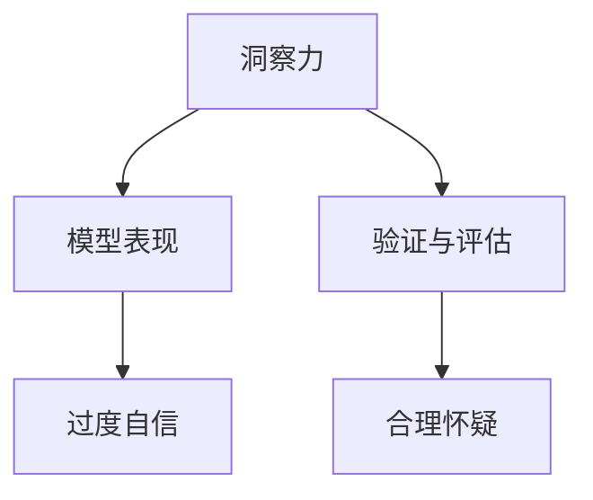

                 

# 理解洞察力的局限性：避免过度自信

在人工智能(AI)领域，洞察力往往被视为一种宝贵的资产。但正如任何科学研究的成果一样，洞察力的局限性也常常被忽视或误解。本文将深入探讨洞察力的局限性，并通过一系列的案例和分析，指导读者如何避免过度自信，以及如何在AI项目中保持合理的怀疑精神。

## 1. 背景介绍

### 1.1 问题由来

人工智能，尤其是深度学习和机器学习技术，已经广泛应用于各行各业。这背后，离不开大量数据和强大算力的支持。然而，尽管人工智能系统在许多领域取得了显著成就，它们仍然存在局限性。这些局限性有时被视作技术的不足，但实际上，更多的是源于人类对于人工智能能力、工作原理和自身洞察力的误解。

### 1.2 问题核心关键点

过度自信（Overconfidence）是影响人工智能项目的一个关键问题。人类常常高估自己的洞察力和模型的预测能力，这可能导致错误决策和不切实际的期望。为了避免过度自信，需要在整个项目生命周期中保持对人工智能系统的合理怀疑，并不断对模型的表现进行评估和验证。

## 2. 核心概念与联系

### 2.1 核心概念概述

在探讨人工智能项目的洞察力局限性时，需要理解以下几个关键概念：

- **洞察力（Insight）**：指对复杂现象或问题的理解、识别和解释能力。在AI领域，洞察力通常来自于对数据的分析、模型的训练和推理，以及对结果的解释和理解。
- **过度自信（Overconfidence）**：指在面对复杂问题时，过高估计自己的能力，倾向于做出不切实际的判断。在AI项目中，过度自信可能导致对模型效果的误解，甚至引发错误的决策。
- **模型表现（Model Performance）**：指模型在特定任务上的准确性、鲁棒性和泛化能力。模型表现需要持续监测和评估，以确保其在实际应用中的有效性。
- **验证与评估（Validation & Evaluation）**：指通过一系列的测试和实验，对模型性能进行评估和验证。验证与评估是避免过度自信的关键步骤。

这些概念之间的逻辑关系可以通过以下Mermaid流程图来展示：



这个流程图展示了一系列的逻辑流程：

1. 洞察力来源于对数据和模型的分析。
2. 洞察力用于指导模型训练和表现评估。
3. 验证与评估对模型表现进行全面评估，以发现过度自信的迹象。
4. 合理怀疑通过验证与评估结果来维持，以避免过度自信。

## 3. 核心算法原理 & 具体操作步骤

### 3.1 算法原理概述

避免过度自信的核心在于保持对模型的合理怀疑，这需要基于数据的验证和评估。具体步骤如下：

1. **数据划分**：将数据集划分为训练集、验证集和测试集。
2. **模型训练**：使用训练集对模型进行训练。
3. **验证与评估**：在验证集上评估模型表现，发现问题并进行调整。
4. **模型部署**：将模型部署到实际应用中，并持续监测和评估。

### 3.2 算法步骤详解

1. **数据预处理**：
    - 收集数据并清洗，去除噪声和异常值。
    - 将数据分为训练集、验证集和测试集。

2. **模型选择**：
    - 选择合适的模型架构和算法。
    - 在数据预处理的基础上进行模型训练。

3. **验证与评估**：
    - 在验证集上评估模型表现，如准确率、召回率、F1分数等。
    - 根据评估结果，调整模型参数或选择更合适的模型。

4. **模型部署**：
    - 将训练好的模型部署到实际应用中。
    - 在部署后持续监测模型表现，并根据实际情况进行调整。

### 3.3 算法优缺点

**优点**：
- 通过验证和评估，可以确保模型在实际应用中的有效性和泛化能力。
- 合理怀疑机制有助于避免过度自信，提高决策的准确性。
- 分阶段的数据划分有助于防止过拟合，提升模型的泛化能力。

**缺点**：
- 验证集和测试集的选择可能影响模型评估的准确性。
- 模型调整和优化需要大量时间和计算资源。
- 模型部署后的持续监测和评估需要投入人力和技术资源。

### 3.4 算法应用领域

基于数据的验证和评估方法在多个领域中都有广泛应用，如金融风险评估、医疗诊断、自动驾驶等。例如，在金融风险评估中，模型需要在历史数据上训练，并通过验证集评估其预测效果，以确保其能准确预测未来的风险。

## 4. 数学模型和公式 & 详细讲解 & 举例说明

### 4.1 数学模型构建

我们以二分类任务为例，构建一个简单的逻辑回归模型，并探讨其验证与评估过程。

假设模型输入为 $x$，输出为 $y$，目标函数为 $L$。逻辑回归模型的损失函数为：

$$ L(y, \theta) = -\frac{1}{N}\sum_{i=1}^{N}(y_i \log \hat{y_i} + (1-y_i) \log (1-\hat{y_i})) $$

其中 $N$ 为样本数量，$y_i$ 为真实标签，$\hat{y_i}$ 为模型预测的概率。

### 4.2 公式推导过程

对于上述逻辑回归模型，我们需要进行以下步骤：

1. **数据划分**：将数据集划分为训练集和验证集。
2. **模型训练**：使用训练集对模型进行训练，计算梯度并更新参数 $\theta$。
3. **验证与评估**：在验证集上计算损失函数，评估模型表现。
4. **模型调整**：根据验证集评估结果，调整模型参数或选择更合适的模型。

### 4.3 案例分析与讲解

假设我们有一个数据集，用于预测是否存在信用风险。模型在训练集上训练后，在验证集上评估如下：

| 样本编号 | 真实标签 $y$ | 模型预测 $\hat{y}$ | 损失 $L$ |
|----------|--------------|------------------|----------|
| 1        | 0            | 0.95             | 0.3      |
| 2        | 1            | 0.2              | 0.6      |
| ...      | ...          | ...              | ...      |

根据验证集的评估结果，我们可以发现模型对第一个样本的预测准确，但第二个样本预测错误。此时，我们需要进一步调整模型参数或选择其他模型，以提高整体性能。

## 5. 项目实践：代码实例和详细解释说明

### 5.1 开发环境搭建

在进行验证与评估实践前，我们需要准备好开发环境。以下是使用Python进行Scikit-learn开发的环境配置流程：

1. 安装Anaconda：从官网下载并安装Anaconda，用于创建独立的Python环境。
2. 创建并激活虚拟环境：
```bash
conda create -n sklearn-env python=3.8 
conda activate sklearn-env
```
3. 安装Scikit-learn：
```bash
pip install scikit-learn
```
4. 安装其他工具包：
```bash
pip install numpy pandas matplotlib seaborn joblib
```
完成上述步骤后，即可在`sklearn-env`环境中开始验证与评估实践。

### 5.2 源代码详细实现

以下是使用Scikit-learn进行二分类任务验证与评估的PyTorch代码实现：

```python
from sklearn.datasets import make_classification
from sklearn.model_selection import train_test_split
from sklearn.linear_model import LogisticRegression
from sklearn.metrics import accuracy_score, classification_report
import torch
import torch.nn as nn
import torch.optim as optim

# 生成数据集
X, y = make_classification(n_samples=1000, n_features=20, random_state=42)

# 数据划分
X_train, X_test, y_train, y_test = train_test_split(X, y, test_size=0.3, random_state=42)

# 定义逻辑回归模型
class LogisticRegression(nn.Module):
    def __init__(self, input_dim):
        super(LogisticRegression, self).__init__()
        self.linear = nn.Linear(input_dim, 1)
        self.sigmoid = nn.Sigmoid()
        
    def forward(self, x):
        x = self.linear(x)
        x = self.sigmoid(x)
        return x
    
# 训练模型
model = LogisticRegression(input_dim=20)
optimizer = optim.SGD(model.parameters(), lr=0.01)
criterion = nn.BCELoss()

for epoch in range(100):
    optimizer.zero_grad()
    output = model(X_train)
    loss = criterion(output, y_train)
    loss.backward()
    optimizer.step()
    print(f"Epoch {epoch+1}, loss: {loss:.4f}")

# 验证模型
output = model(X_test)
y_pred = (output > 0.5).float()
accuracy = accuracy_score(y_test, y_pred)
print(f"Validation accuracy: {accuracy:.4f}")
```

### 5.3 代码解读与分析

让我们再详细解读一下关键代码的实现细节：

**make_classification函数**：
- 生成一个简单的二分类数据集，用于训练和评估。

**train_test_split函数**：
- 将数据集划分为训练集和测试集，方便模型训练和评估。

**LogisticRegression模型**：
- 定义一个简单的逻辑回归模型，用于二分类任务。

**训练过程**：
- 使用训练集对模型进行前向传播和反向传播，更新模型参数。
- 使用BCELoss损失函数计算损失，指导模型训练。

**验证过程**：
- 在测试集上使用模型进行预测，计算准确率和分类报告。

可以看到，使用Scikit-learn进行逻辑回归模型的验证与评估，代码实现简洁高效。开发者可以将更多精力放在模型设计和超参数调优上，而不必过多关注底层的实现细节。

## 6. 实际应用场景

### 6.1 金融风险评估

金融行业中的风险评估需要高精度的模型。传统的手动评估方法不仅耗时耗力，且容易出错。使用逻辑回归等简单模型，通过验证与评估过程，可以快速、准确地评估金融产品的风险，提高决策效率和准确性。

### 6.2 医疗诊断

在医疗领域，疾病的诊断和治疗需要高精度和低误判。基于验证与评估的逻辑回归模型可以用于预测患者是否患有某种疾病，从而提高医生的诊断效率和患者的治疗效果。

### 6.3 自动驾驶

自动驾驶中，模型需要实时评估周围环境，做出正确的决策。通过验证与评估过程，可以确保模型在复杂环境中仍然保持高精度和低误判。

### 6.4 未来应用展望

随着技术的发展，验证与评估方法将更加全面和高效。未来的AI项目将越来越多地采用复杂模型和深度学习技术，如神经网络和深度学习网络。这些模型需要更复杂的验证与评估方法，如交叉验证、网格搜索等，以确保其有效性和可靠性。

## 7. 工具和资源推荐

### 7.1 学习资源推荐

为了帮助开发者掌握验证与评估的方法，以下是一些优质的学习资源：

1. 《机器学习实战》系列博文：详细介绍了机器学习模型训练和验证的流程，适用于初学者入门。
2. CS229《机器学习》课程：斯坦福大学开设的机器学习课程，涵盖了验证与评估等核心内容，适合深入学习。
3. 《Python机器学习》书籍：全面介绍了机器学习模型的训练、验证和评估，提供了丰富的代码示例。
4. Kaggle竞赛平台：通过参与Kaggle竞赛，学习各种验证与评估方法和模型优化技巧。
5. GitHub代码仓库：搜索和查看其他开发者分享的验证与评估代码，学习最佳实践。

通过对这些资源的学习实践，相信你一定能够掌握验证与评估的方法，并用于解决实际的AI问题。

### 7.2 开发工具推荐

高效的开发离不开优秀的工具支持。以下是几款用于验证与评估开发的常用工具：

1. Jupyter Notebook：开源的交互式笔记本环境，适合进行模型训练和验证。
2. TensorBoard：TensorFlow配套的可视化工具，可实时监测模型训练状态，并提供丰富的图表呈现方式。
3. PyTorch：基于Python的开源深度学习框架，支持动态图和静态图，适合进行模型训练和验证。
4. Keras：高层神经网络API，简单易用，适合快速搭建和验证模型。
5. Scikit-learn：Python的机器学习库，支持各种模型训练和验证方法，使用便捷。

合理利用这些工具，可以显著提升验证与评估任务的开发效率，加快创新迭代的步伐。

### 7.3 相关论文推荐

验证与评估技术的发展源于学界的持续研究。以下是几篇奠基性的相关论文，推荐阅读：

1. Logistic Regression: A Statistical Learning Method for Classification Task: 详细介绍了逻辑回归模型及其验证与评估方法。
2. Bagging: A Technique for Improving Prediction Accuracy: 介绍了随机森林等集成学习技术，增强模型的泛化能力。
3. Deep Learning: A Tutorial (with Python Example)：通过具体代码实例，介绍了深度学习模型的训练和验证过程。
4. Ensemble Methods for Machine Learning: 系统介绍了集成学习技术，如Boosting和Bagging，提升模型性能。
5. Predictive Modeling: Procedures and Assessments: 介绍了模型评估的多种方法和技术，确保模型的高精度和鲁棒性。

这些论文代表了大模型微调技术的发展脉络。通过学习这些前沿成果，可以帮助研究者把握学科前进方向，激发更多的创新灵感。

## 8. 总结：未来发展趋势与挑战

### 8.1 总结

本文对基于数据的验证与评估方法进行了全面系统的介绍。首先阐述了过度自信的局限性，明确了验证与评估在避免过度自信中的重要作用。其次，从原理到实践，详细讲解了验证与评估的数学原理和关键步骤，给出了验证与评估任务开发的完整代码实例。同时，本文还广泛探讨了验证与评估方法在金融、医疗、自动驾驶等多个行业领域的应用前景，展示了验证与评估范式的巨大潜力。

通过本文的系统梳理，可以看到，验证与评估技术正在成为AI项目的重要范式，极大地提升了模型的有效性和可靠性。未来，伴随验证与评估方法的不断演进，相信AI技术将在更广泛的领域得到应用，为各个行业带来显著的效率和精度提升。

### 8.2 未来发展趋势

展望未来，验证与评估技术将呈现以下几个发展趋势：

1. 验证与评估技术将更加自动化和智能化。随着机器学习工具的普及，更多的开发者将能够轻松进行模型验证与评估。
2. 模型验证与评估将更加全面和深入。未来的模型评估将不仅关注精度，还将关注模型的鲁棒性、公平性和可解释性。
3. 验证与评估技术将与数据预处理和模型训练紧密结合。通过数据增强和模型优化，提升模型的泛化能力和鲁棒性。
4. 验证与评估方法将更加多样化。除了传统的交叉验证和网格搜索，未来还将涌现更多新的评估方法，如贝叶斯优化、元学习等。

以上趋势凸显了验证与评估技术在AI项目中的重要性和广泛应用前景。这些方向的探索发展，必将进一步提升模型的性能和应用范围，为人工智能技术的普及和发展提供坚实基础。

### 8.3 面临的挑战

尽管验证与评估技术已经取得了显著成就，但在迈向更加智能化、普适化应用的过程中，它仍面临着诸多挑战：

1. 数据质量问题。数据的不平衡、噪声和异常值可能影响模型的评估结果。如何在数据预处理中发现并处理这些问题，仍需进一步研究。
2. 模型复杂度问题。随着模型复杂度的增加，验证与评估的难度和复杂度也随之增加。如何高效地进行模型评估，特别是深度学习模型，将是未来的研究方向。
3. 模型鲁棒性问题。在复杂和多变的环境中，模型的泛化能力和鲁棒性常常不足。如何提高模型的鲁棒性，确保其在实际应用中的稳定性，还需要更多理论和实践的积累。
4. 模型公平性问题。过度自信可能使模型在特定群体上产生偏见。如何确保模型的公平性，避免偏见和歧视，将是未来的一个重要课题。

### 8.4 研究展望

面对验证与评估面临的挑战，未来的研究需要在以下几个方面寻求新的突破：

1. 探索更多的数据增强和预处理方法。通过数据增强和预处理，提升模型对异常数据的鲁棒性和泛化能力。
2. 开发更加高效的模型评估方法。引入新的评估方法，如贝叶斯优化和元学习，提升模型评估的效率和准确性。
3. 融合因果分析和博弈论工具。将因果分析方法引入模型评估，识别出模型决策的关键特征，增强输出解释的因果性和逻辑性。
4. 引入伦理和公平性约束。在模型训练和评估中引入伦理和公平性导向的指标，确保模型的输出符合人类的价值观和伦理道德。
5. 开发更多的模型验证与评估工具。提供更多便捷的验证与评估工具，如Scikit-learn、TensorBoard等，加速模型开发和评估流程。

这些研究方向的探索，必将引领验证与评估技术迈向更高的台阶，为构建安全、可靠、可解释、可控的智能系统铺平道路。面向未来，验证与评估技术还需要与其他人工智能技术进行更深入的融合，如知识表示、因果推理、强化学习等，多路径协同发力，共同推动自然语言理解和智能交互系统的进步。只有勇于创新、敢于突破，才能不断拓展模型的边界，让智能技术更好地造福人类社会。

## 9. 附录：常见问题与解答

**Q1：数据质量问题如何应对？**

A: 数据质量问题可以通过以下方法应对：
1. 数据清洗：去除噪声和异常值，处理缺失值。
2. 数据增强：通过数据增强技术，生成更多的训练样本，提升模型的泛化能力。
3. 数据采样：采用随机采样或分层采样，确保数据集的代表性和多样性。

**Q2：如何处理模型复杂度问题？**

A: 处理模型复杂度问题可以通过以下方法：
1. 简化模型架构：采用更简单的模型结构，如线性模型、决策树等。
2. 正则化方法：使用L1、L2正则化，防止过拟合。
3. 集成学习：通过集成多个模型，提升整体性能和鲁棒性。
4. 剪枝和压缩：使用剪枝和压缩技术，减少模型的参数量和计算复杂度。

**Q3：如何提高模型的鲁棒性？**

A: 提高模型鲁棒性可以通过以下方法：
1. 数据增强：通过数据增强技术，生成更多的训练样本，提升模型的泛化能力。
2. 对抗训练：引入对抗样本，提高模型对攻击的鲁棒性。
3. 多模态学习：将多个模态的数据结合起来，提升模型的鲁棒性。
4. 交叉验证：使用交叉验证方法，评估模型的性能和鲁棒性。

**Q4：如何确保模型的公平性？**

A: 确保模型公平性可以通过以下方法：
1. 数据公平性：确保训练数据集的代表性和多样性，避免数据偏见。
2. 模型公平性：使用公平性导向的评估指标，如均衡误差、差异误差等，评估模型的公平性。
3. 监督训练：在训练过程中引入监督机制，确保模型在各个群体上的公平性。
4. 反偏见技术：使用反偏见技术，如重加权、重采样等，纠正模型偏见。

**Q5：如何提高模型的可解释性？**

A: 提高模型可解释性可以通过以下方法：
1. 特征选择：通过特征选择技术，突出重要特征，提高模型的可解释性。
2. 模型可视化：使用可视化工具，展示模型的决策过程和特征重要性。
3. 模型解释：使用模型解释技术，如SHAP值、LIME等，解释模型的输出和决策。
4. 解释性训练：在训练过程中引入解释性约束，提升模型的可解释性。

通过对这些问题的探讨和回答，相信你一定能够更好地掌握验证与评估技术的核心原理和应用方法，并在AI项目中发挥重要作用。

