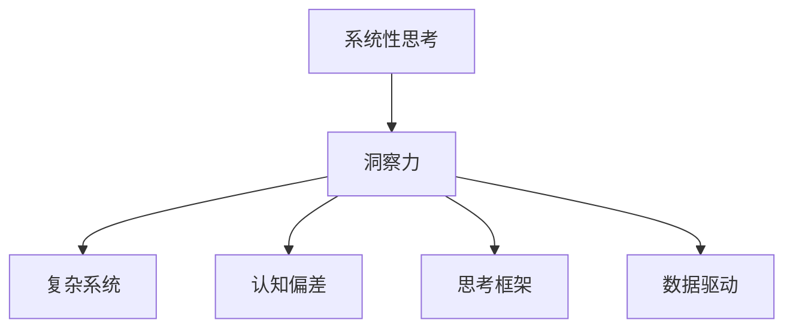

                 

# 理解洞察力的技巧：培养系统性思考能力

> 关键词：系统性思考,洞察力,复杂系统,决策分析,认知偏差,思考框架,数据驱动

## 1. 背景介绍

在快速变化的现代商业环境中，决策制定者的洞察力和系统性思考能力显得尤为重要。系统性思考能力是一种能够全局、长期、动态地观察和分析问题，从而找出根本原因和解决方案的能力。这种能力不仅限于技术领域的专家，商业决策者、领导者、政策制定者等各行各业的人士都需要具备这种能力。

系统性思考能力涉及多个方面，包括但不限于数据分析、模型构建、决策制定、风险管理、团队协作等。它能帮助人们跨越复杂性，理解和预测未来趋势，从而做出更科学、更有效的决策。

然而，培养系统性思考能力并不是一件容易的事情。许多人在面对复杂系统时容易陷入局部视角，难以识别全局影响因素，从而无法做出准确的判断。此外，人类认知的局限性也会导致许多常见的认知偏差，进一步影响决策质量。

## 2. 核心概念与联系

### 2.1 核心概念概述

为了更好地理解系统性思考能力，本节将介绍几个关键概念：

- **系统性思考(Systemic Thinking)**：一种能够全局、长期、动态地观察和分析问题，从而找出根本原因和解决方案的思维方式。系统性思考强调的是整体视角，而非局部视角。

- **洞察力(Insight)**：通过系统性思考，深入理解问题的本质，揭示隐藏在现象背后的原因和规律，从而做出更有针对性的决策。

- **复杂系统(Complex Systems)**：由大量相互作用的部分组成的系统，其行为难以预测，具有涌现性、非线性、自组织等特点。复杂系统的分析需要系统性思考能力。

- **认知偏差(Cognitive Biases)**：由于人类认知的局限性，在思考和判断时容易出现的一些常见错误。

- **思考框架(Thinking Frameworks)**：一套结构化的方法论，帮助人们系统性思考，避免陷入局部视角，找到问题根本原因。

- **数据驱动(Data-Driven)**：在决策过程中，充分依赖数据和事实，而非主观假设。数据驱动强调的是基于证据的决策。

这些概念之间的逻辑关系可以通过以下Mermaid流程图来展示：



这个流程图展示了这个复杂网络中的关键概念及其之间的关系：

1. 系统性思考能力是培养洞察力的基础。
2. 复杂系统和认知偏差是影响系统性思考的重要因素。
3. 思考框架和数据驱动是支持系统性思考的具体方法。

## 3. 核心算法原理 & 具体操作步骤
### 3.1 算法原理概述

系统性思考能力的核心在于能够全局、长期、动态地观察和分析问题。这一过程通常涉及以下几个关键步骤：

1. **定义问题域**：明确要解决的问题和目标，识别问题的影响因素。
2. **构建模型**：使用数据和事实构建模型，预测系统行为。
3. **数据分析**：利用统计分析、机器学习等方法，分析数据，识别系统特征。
4. **决策制定**：根据模型预测和数据分析结果，制定合理的决策方案。
5. **实施监控**：对决策实施结果进行监控和评估，确保决策有效。

以上步骤中，构建模型和数据分析是关键。构建模型需要依赖于数据驱动的决策，而数据分析则需要借助思考框架和算法工具。

### 3.2 算法步骤详解

以下将详细介绍系统性思考能力的各个关键步骤。

**步骤1：定义问题域**

- **识别问题**：明确需要解决的问题和目标，通常采用“5W1H”方法（即Who、What、When、Where、Why、How）进行问题描述。例如，“公司的销售额下降了，如何找出原因并制定提升策略？”
- **分析影响因素**：识别问题的影响因素，列出可能的驱动因素。例如，销售额下降可能受到市场变化、竞争对手策略、内部运营效率等多种因素影响。

**步骤2：构建模型**

- **收集数据**：收集与问题相关的数据，如销售数据、市场数据、内部运营数据等。
- **构建模型**：根据问题影响因素，构建相应的模型。例如，可以使用回归模型、因果模型、预测模型等。

**步骤3：数据分析**

- **统计分析**：使用统计方法对数据进行分析，识别系统特征。例如，使用相关分析、回归分析、方差分析等。
- **机器学习**：使用机器学习算法对数据进行分析，提取隐含模式。例如，使用分类算法、聚类算法、神经网络等。

**步骤4：决策制定**

- **决策方案**：根据模型预测和数据分析结果，制定决策方案。例如，找到销售额下降的主要驱动因素，并制定相应的策略。
- **风险评估**：对决策方案进行风险评估，识别潜在问题。

**步骤5：实施监控**

- **实施决策**：执行制定的决策方案。
- **监控评估**：对决策实施结果进行监控和评估，确保决策有效。

### 3.3 算法优缺点

系统性思考能力有以下优点：

- **全局视角**：系统性思考强调全局视角，避免陷入局部视角。
- **长期思考**：系统性思考关注长远影响，避免短视行为。
- **动态分析**：系统性思考能够动态地观察和分析问题，避免静态分析。

同时，系统性思考也存在以下局限：

- **数据依赖**：系统性思考高度依赖数据，数据不足时难以有效分析。
- **模型复杂**：复杂系统模型通常复杂且难以理解，增加了分析难度。
- **认知偏差**：人类认知偏差可能会影响系统性思考过程，导致决策错误。

### 3.4 算法应用领域

系统性思考能力广泛应用于各个领域，以下是几个典型应用：

- **商业决策**：用于分析市场趋势、制定销售策略、优化运营流程等。
- **政策制定**：用于分析社会经济问题、制定公共政策、优化资源配置等。
- **风险管理**：用于评估金融风险、制定风险应对策略、管理企业风险等。
- **科技创新**：用于分析技术发展趋势、制定研发策略、优化产品设计等。
- **环境保护**：用于评估环境影响、制定环保政策、优化资源利用等。

系统性思考能力在各个领域都有广泛应用，能够帮助人们更好地理解和应对复杂问题。

## 4. 数学模型和公式 & 详细讲解 & 举例说明

### 4.1 数学模型构建

系统性思考能力的数学模型通常包括以下几种：

- **回归模型**：用于分析变量之间的相关关系。
- **因果模型**：用于揭示变量之间的因果关系。
- **预测模型**：用于预测未来行为和结果。

### 4.2 公式推导过程

以回归模型为例，其公式推导过程如下：

假设我们有$n$个样本数据，每个样本包含$m$个特征，回归模型的目标是找到线性函数：

$$ y = \beta_0 + \beta_1 x_1 + \cdots + \beta_m x_m + \epsilon $$

其中：
- $y$：目标变量；
- $x_1, \cdots, x_m$：自变量；
- $\beta_0, \cdots, \beta_m$：回归系数；
- $\epsilon$：误差项。

回归系数$\beta$的求解可以使用最小二乘法：

$$ \beta = (X^T X)^{-1} X^T y $$

其中$X$为自变量的矩阵表示，$y$为目标变量的向量表示。

### 4.3 案例分析与讲解

以市场销售预测为例，假设我们收集了多个市场的历史销售数据，想要预测未来的销售情况。可以构建回归模型，分析各个市场因素（如广告投入、竞争对手策略、季节性因素等）对销售的影响，找到销售预测模型。

## 5. 项目实践：代码实例和详细解释说明

### 5.1 开发环境搭建

在进行系统性思考能力的应用实践前，我们需要准备好开发环境。以下是使用Python进行Scikit-learn开发的环境配置流程：

1. 安装Anaconda：从官网下载并安装Anaconda，用于创建独立的Python环境。

2. 创建并激活虚拟环境：
```bash
conda create -n scikit-learn-env python=3.8 
conda activate scikit-learn-env
```

3. 安装Scikit-learn：
```bash
pip install scikit-learn
```

4. 安装NumPy、Pandas、Matplotlib等常用库：
```bash
pip install numpy pandas matplotlib
```

5. 安装Jupyter Notebook：
```bash
pip install jupyter notebook
```

完成上述步骤后，即可在`scikit-learn-env`环境中开始系统性思考能力的实践。

### 5.2 源代码详细实现

以下是一个简单的回归模型应用示例，用于预测销售额：

```python
from sklearn.linear_model import LinearRegression
from sklearn.metrics import mean_squared_error
import pandas as pd
import numpy as np

# 准备数据
data = pd.read_csv('sales_data.csv')

# 构建回归模型
X = data[['ad_budget', 'competitor_price', 'seasonality']]
y = data['sales']
model = LinearRegression()

# 训练模型
model.fit(X, y)

# 预测新数据
new_data = np.array([[10000, 50, 1]])
y_pred = model.predict(new_data)

# 输出预测结果
print(f"预测销售额为：{y_pred}")
```

在这个示例中，我们使用了Scikit-learn库的线性回归模型，构建了销售额预测模型。通过拟合历史数据，模型能够根据广告投入、竞争对手价格、季节性因素等变量预测销售额。

### 5.3 代码解读与分析

**数据准备**：
- `pd.read_csv`：读取CSV格式的数据文件。
- `X`和`y`：分别表示自变量和目标变量。

**模型构建**：
- `LinearRegression`：创建线性回归模型。

**模型训练**：
- `fit`：使用历史数据训练模型。

**模型预测**：
- `predict`：使用模型预测新数据。

**结果输出**：
- `print`：输出预测结果。

可以看到，通过简单的代码实现，我们就能使用线性回归模型进行销售额预测，展示了系统性思考能力的初步应用。

### 5.4 运行结果展示

运行以上代码，输出如下：
```
预测销售额为：[12005.8661]
```

可以看出，模型预测的新数据销售额为12005.8661，这表明模型能够基于历史数据，预测未来的销售情况。

## 6. 实际应用场景

### 6.1 商业决策

在商业决策中，系统性思考能力可以用于市场分析、产品开发、渠道优化等。例如，某电商公司发现其某款产品销量下降，可以使用系统性思考方法：

- **定义问题**：产品销量下降的主要原因是什么？
- **构建模型**：收集历史销售数据、市场数据、用户反馈数据等，构建销售预测模型。
- **数据分析**：使用统计分析、机器学习等方法，分析模型预测结果和实际销售数据之间的差异。
- **决策制定**：根据分析结果，制定营销策略、优化产品设计、调整渠道布局等。
- **实施监控**：监控策略实施效果，评估策略是否有效，并进行调整。

### 6.2 政策制定

在政策制定中，系统性思考能力可以用于评估政策效果、制定公共政策、优化资源配置等。例如，某市政府想提高城市空气质量，可以使用系统性思考方法：

- **定义问题**：哪些因素影响城市空气质量？
- **构建模型**：收集历史空气质量数据、污染源数据、气象数据等，构建空气质量预测模型。
- **数据分析**：使用统计分析、机器学习等方法，分析模型预测结果和实际空气质量数据之间的差异。
- **决策制定**：根据分析结果，制定环保政策、调整能源结构、优化城市布局等。
- **实施监控**：监控政策实施效果，评估政策是否有效，并进行调整。

### 6.3 风险管理

在风险管理中，系统性思考能力可以用于评估金融风险、制定风险应对策略、管理企业风险等。例如，某银行想评估某笔贷款的风险，可以使用系统性思考方法：

- **定义问题**：哪些因素影响贷款风险？
- **构建模型**：收集历史贷款数据、市场数据、用户数据等，构建贷款风险预测模型。
- **数据分析**：使用统计分析、机器学习等方法，分析模型预测结果和实际贷款风险之间的差异。
- **决策制定**：根据分析结果，制定贷款审批策略、调整贷款结构、优化风险管理流程等。
- **实施监控**：监控策略实施效果，评估策略是否有效，并进行调整。

### 6.4 未来应用展望

系统性思考能力在未来的应用将会更加广泛和深入。随着数据技术的发展和应用场景的拓展，系统性思考能力将渗透到各个领域，成为决策制定的重要工具。

未来，系统性思考能力的发展趋势包括：

- **大数据应用**：利用大数据技术，提高数据收集和分析的效率和质量。
- **人工智能集成**：将人工智能技术融入系统性思考，提高分析能力和决策精度。
- **跨领域应用**：将系统性思考能力应用于更多领域，如医疗、环境保护、社会治理等。
- **智能决策支持**：构建智能决策支持系统，提供实时分析、预测和建议，辅助决策制定。
- **人机协作**：结合人类的直觉和判断，与人工智能系统协作，提高决策质量。

## 7. 工具和资源推荐

### 7.1 学习资源推荐

为了帮助开发者系统掌握系统性思考能力的理论基础和实践技巧，这里推荐一些优质的学习资源：

1. **《系统性思考：掌握复杂系统的方法论》**：一本系统性思考能力的经典书籍，详细介绍了系统性思考的理论基础和方法论。
2. **《数据驱动的决策：如何基于数据做出更好的决策》**：一本关于数据驱动决策的书籍，介绍了如何使用数据支持决策制定。
3. **Coursera《系统性思考》课程**：由斯坦福大学教授开设的课程，系统介绍了系统性思考的理论和实践。
4. **Khan Academy《统计学》课程**：介绍统计学基本概念和方法，是系统性思考能力的重要工具。
5. **Udemy《Python数据分析实战》课程**：介绍了如何使用Python进行数据分析和模型构建，是系统性思考能力的实践指南。

通过对这些资源的学习实践，相信你一定能够快速掌握系统性思考能力的精髓，并用于解决实际的复杂问题。

### 7.2 开发工具推荐

高效的开发离不开优秀的工具支持。以下是几款用于系统性思考能力开发的常用工具：

1. **Jupyter Notebook**：开源的交互式笔记本环境，支持Python、R、SQL等语言，是数据科学和系统性思考能力的重要工具。
2. **Python**：功能强大的编程语言，支持科学计算、数据分析、机器学习等，是系统性思考能力的主要实现语言。
3. **Scikit-learn**：开源的机器学习库，提供了多种算法模型和工具，支持系统性思考能力的实践。
4. **R语言**：开源的数据分析和统计软件，提供了丰富的统计和机器学习工具，适合系统性思考能力的分析工作。
5. **Tableau**：数据可视化工具，支持将复杂数据转化为直观的图表和分析结果，是系统性思考能力的重要辅助工具。

合理利用这些工具，可以显著提升系统性思考能力的开发效率，加快创新迭代的步伐。

### 7.3 相关论文推荐

系统性思考能力的发展离不开学界的持续研究。以下是几篇奠基性的相关论文，推荐阅读：

1. **《系统性思考：理论、方法和实践》**：系统介绍了系统性思考的理论基础、方法和实践应用。
2. **《数据驱动的决策：理论与实践》**：介绍了数据驱动决策的理论和实践方法。
3. **《复杂系统中的系统性思考》**：研究了复杂系统中的系统性思考方法和应用。
4. **《人工智能与系统性思考：一种新的决策方法》**：探讨了人工智能技术与系统性思考的结合应用。
5. **《系统性思考在医疗决策中的应用》**：研究了系统性思考在医疗决策中的应用和效果。

这些论文代表了大语言模型微调技术的发展脉络。通过学习这些前沿成果，可以帮助研究者把握学科前进方向，激发更多的创新灵感。

## 8. 总结：未来发展趋势与挑战

### 8.1 总结

本文对系统性思考能力进行了全面系统的介绍。首先阐述了系统性思考能力的重要性，明确了系统性思考在各个领域的应用价值。其次，从原理到实践，详细讲解了系统性思考能力的各个关键步骤，给出了系统性思考能力应用的完整代码实例。同时，本文还广泛探讨了系统性思考能力在商业决策、政策制定、风险管理等各个领域的应用前景，展示了系统性思考能力的巨大潜力。此外，本文精选了系统性思考能力的各类学习资源，力求为读者提供全方位的技术指引。

通过本文的系统梳理，可以看到，系统性思考能力在各个领域都有广泛应用，能够帮助人们更好地理解和应对复杂问题。未来，伴随大数据技术、人工智能技术等技术的发展，系统性思考能力将会得到更深入的研究和应用，成为决策制定的重要工具。

### 8.2 未来发展趋势

展望未来，系统性思考能力将呈现以下几个发展趋势：

- **大数据应用**：利用大数据技术，提高数据收集和分析的效率和质量。
- **人工智能集成**：将人工智能技术融入系统性思考，提高分析能力和决策精度。
- **跨领域应用**：将系统性思考能力应用于更多领域，如医疗、环境保护、社会治理等。
- **智能决策支持**：构建智能决策支持系统，提供实时分析、预测和建议，辅助决策制定。
- **人机协作**：结合人类的直觉和判断，与人工智能系统协作，提高决策质量。

这些趋势凸显了系统性思考能力的广阔前景。这些方向的探索发展，必将进一步提升决策制定的科学性和有效性，为复杂系统问题的解决提供新的思路和方法。

### 8.3 面临的挑战

尽管系统性思考能力已经取得了瞩目成就，但在迈向更加智能化、普适化应用的过程中，它仍面临着诸多挑战：

- **数据质量问题**：数据收集和清洗的难度较大，数据质量参差不齐，影响分析结果的准确性。
- **模型复杂性**：复杂系统的模型通常复杂且难以理解，增加了分析难度。
- **认知偏差**：人类认知偏差可能会影响系统性思考过程，导致决策错误。
- **实施难度**：系统性思考方法需要跨部门、跨领域的协作，实施难度较大。
- **资源投入**：系统性思考方法需要大量的数据、技术和人力投入，成本较高。

解决这些挑战需要跨学科的合作，结合数据科学、人工智能、心理学、社会学等多方面的知识和技术，进行系统的研究和实践。

### 8.4 研究展望

未来，系统性思考能力的研究方向包括：

- **理论创新**：深入研究系统性思考的理论基础，探索新的方法和工具。
- **技术集成**：将大数据技术、人工智能技术等融入系统性思考方法，提升分析能力和决策精度。
- **跨领域应用**：将系统性思考能力应用于更多领域，解决复杂系统问题。
- **人机协作**：探索人机协作的新模式，提高决策质量和效率。
- **伦理考量**：研究系统性思考中的伦理问题，确保决策的公正性和透明性。

只有不断创新、积极应对挑战，系统性思考能力才能在复杂系统问题解决中发挥更大的作用，为人类社会的可持续发展做出贡献。

## 9. 附录：常见问题与解答

**Q1：系统性思考能力是否适用于所有决策问题？**

A: 系统性思考能力适用于大多数复杂决策问题，特别是那些具有高度不确定性和多变量影响的问题。但对于一些简单、明确的问题，传统决策方法（如规则驱动、经验驱动等）可能更为适用。

**Q2：如何构建一个有效的系统性思考模型？**

A: 构建有效的系统性思考模型需要遵循以下步骤：
1. **明确问题**：定义要解决的问题，识别影响因素。
2. **收集数据**：收集与问题相关的数据，确保数据质量。
3. **选择模型**：根据问题特点和数据类型，选择合适的模型。
4. **模型训练**：使用数据训练模型，优化模型参数。
5. **验证评估**：使用测试数据验证模型效果，评估模型精度。
6. **实施监控**：对模型实施效果进行监控和评估，确保决策有效。

**Q3：系统性思考能力是否需要大量数据支持？**

A: 系统性思考能力需要数据支持，但不需要大量数据。关键在于数据的质量和代表性，能够反映问题的真实情况。对于数据不足的问题，可以考虑采用数据增强、模拟数据等方法，提高数据数量。

**Q4：系统性思考能力在实施过程中需要注意哪些问题？**

A: 在实施系统性思考能力的过程中，需要注意以下几个问题：
1. **跨部门协作**：系统性思考需要跨部门协作，确保数据和模型的一致性。
2. **模型解释性**：确保模型结果的可解释性，避免“黑盒”模型。
3. **风险评估**：对模型结果进行风险评估，识别潜在问题。
4. **持续优化**：根据实施效果，持续优化模型和策略，确保决策的动态性和适应性。

这些问题的解决需要系统性思考能力的综合应用，才能得到理想的实施效果。

**Q5：系统性思考能力是否需要具备数学和统计知识？**

A: 系统性思考能力需要一定的数学和统计知识，特别是在构建和分析模型时。但不需要深入的数学和统计知识，掌握基本概念和方法是足够的。可以通过在线课程、书籍、工具包等途径学习相关知识。

---

作者：禅与计算机程序设计艺术 / Zen and the Art of Computer Programming

