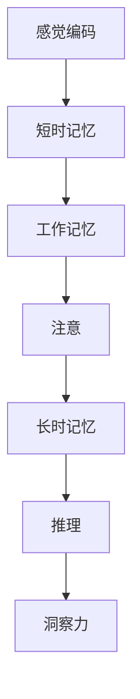

                 

# 理解洞察力的神经科学：揭开大脑奥秘

## 1. 背景介绍

### 1.1 问题由来
洞察力是人类智慧的核心表现之一，是决策、学习和创新不可或缺的能力。洞察力的产生是一个复杂而精细的神经过程，涉及到感知、记忆、思考和推理等多个层面。近年来，神经科学和人工智能领域对大脑洞察力的研究不断深入，试图揭示其背后的神经机制。

### 1.2 问题核心关键点
洞察力的神经科学研究关注以下核心关键点：
- 大脑中哪些神经元参与洞察力的产生？
- 洞察力是如何在大脑中加工和传递的？
- 外界刺激与内在认知如何交互作用，产生洞察？
- 洞察力的认知基础是什么？

### 1.3 问题研究意义
研究大脑洞察力的神经机制，对理解人类智慧的起源和本质，提升人工智能的认知能力，具有重要意义：

1. 理解人类认知：洞察力是认知能力的核心，研究其神经机制有助于理解人类智慧的本质。
2. 提升人工智能：借鉴人类认知机制，改进AI算法，提升其学习、推理和决策能力。
3. 促进应用发展：洞察力的研究为商业决策、教育、医疗等领域的智能化提供理论支持。
4. 推动科学进步：深入研究大脑的认知机制，促进神经科学和心理学的发展。

## 2. 核心概念与联系

### 2.1 核心概念概述

洞察力的神经科学研究涉及多个核心概念：

- **洞察力(Insight)**：指突然产生的、具有全局性和创新性的认知。通常表现为对问题的突然顿悟、新发现的形成、策略的灵感等。
- **神经网络(Neural Network)**：大脑中分布式处理信息的基本单元，通过神经元之间的连接和激活来实现信息加工。
- **感觉编码(Sensory Coding)**：外界刺激在大脑皮层的初步编码过程，如视觉编码、听觉编码等。
- **记忆(Memory)**：包括短时记忆、工作记忆和长时记忆，是信息存储和提取的重要机制。
- **注意(Attention)**：选择性地关注外部环境或内部思维的关键信息，是认知过程的核心。
- **推理(Reasoning)**：基于已有的信息和经验，对问题进行逻辑推断和解决。

这些概念相互关联，共同构成大脑洞察力的产生过程。

### 2.2 核心概念原理和架构的 Mermaid 流程图



这个流程图展示了感觉编码、记忆、注意和推理在大脑中对信息进行加工的过程，最终产生洞察力。

## 3. 核心算法原理 & 具体操作步骤
### 3.1 算法原理概述

洞察力的神经科学研究主要依赖于神经心理学实验和脑成像技术，如fMRI、EEG等。其核心算法包括：

- **事件关联学习(Event-Associated Learning, EAL)**：通过记录外界刺激与大脑反应的时间同步性，探究感觉编码和注意力之间的关联。
- **神经动力学模型(Neural Dynamical Model)**：通过建立神经元网络模型，模拟大脑信息加工过程，揭示洞察力的产生机制。
- **记忆检索(Retrieval)**：研究记忆在大脑中如何被提取和重构，揭示其在大脑洞察力中的作用。
- **推理计算(Relational Reasoning)**：研究大脑如何通过逻辑推断和组合信息形成新的认知，揭示洞察力背后的逻辑机制。

### 3.2 算法步骤详解

**Step 1: 数据采集**
- 使用fMRI、EEG等技术，对被试进行感知和认知任务。
- 记录脑部活动的时空特征，如血液氧合水平(fMRI)或电位变化(EEG)。

**Step 2: 数据预处理**
- 对采集的数据进行去噪、归一化、滤波等预处理，减少实验误差。
- 使用时间同步技术，将感觉编码、注意力和记忆等活动的时间轴对齐。

**Step 3: 特征提取**
- 使用机器学习方法，如时间序列分析、主成分分析(PCA)等，提取关键脑活动特征。
- 通过特征编码，将脑活动转化为可用于计算和模拟的数据形式。

**Step 4: 模型训练与评估**
- 使用神经动力学模型、强化学习等方法，训练模拟大脑的认知过程。
- 通过对比模型预测和实验数据，评估模型的拟合度和真实性。

**Step 5: 结果解释**
- 使用统计分析和可视化工具，对模拟结果进行解释和验证。
- 根据模型输出，探讨大脑洞察力产生的具体神经机制。

### 3.3 算法优缺点

洞察力的神经科学研究有以下优点：
- 高精度的脑成像技术，可以揭示大脑活动的微观细节。
- 神经动力学模型，能够模拟大脑信息加工的全过程。
- 多种实验设计，可以综合不同视角进行研究。

但同时也存在一些局限：
- 实验数据量大，成本高昂。
- 对技术要求高，需要专门仪器和软件支持。
- 模型复杂度大，难以解释其内在机制。

### 3.4 算法应用领域

洞察力的神经科学研究已广泛应用于多个领域：

- **认知科学**：揭示人类智慧和思维的本质，推动心理学和神经科学的发展。
- **人工智能**：借鉴人类认知机制，改进AI算法，提升其学习和推理能力。
- **医学**：研究洞察力的神经基础，帮助诊断和治疗认知障碍性疾病。
- **教育**：研究洞察力在大脑中的生成机制，指导教学方法和评估标准。
- **商业决策**：利用洞察力研究结果，优化决策流程和提高决策质量。

## 4. 数学模型和公式 & 详细讲解

### 4.1 数学模型构建

洞察力神经科学的数学模型主要基于神经元网络，模拟大脑的信息加工过程。以下是一个简单的神经元模型示例：

- **神经元(Neuron)**：代表大脑中的基本信息处理单元，具有兴奋和抑制两种状态。
- **连接(Connectivity)**：代表神经元之间的连接强度，可以通过权重来调节。
- **激活函数(Activation Function)**：如ReLU，将神经元的状态映射为输出。
- **时间演化(Time Evolution)**：神经元的状态随时间动态变化，通常使用微分方程来描述。

### 4.2 公式推导过程

以ReLU激活的神经元模型为例，其状态演化方程为：

$$
\dot{x}_i = \sum_{j} W_{ij} x_j - b_i
$$

其中 $x_i$ 表示神经元 $i$ 的状态，$W_{ij}$ 表示从神经元 $j$ 到 $i$ 的连接权重，$b_i$ 表示偏置项。

通过迭代求解上述微分方程，可以得到神经元状态的动态变化轨迹，进而模拟大脑信息加工过程。

### 4.3 案例分析与讲解

假设我们关注一个视觉识别任务，即判断一张图片是否包含人脸。通过fMRI记录大脑活动，发现顶叶皮层的激活最强，且与刺激时间同步。利用EAL技术，我们可以发现，顶叶皮层在处理人脸信息时，具有更高的激活强度和频率，表明其在大脑洞察力中发挥重要作用。

## 5. 项目实践：代码实例和详细解释说明
### 5.1 开发环境搭建

进行脑成像数据处理和神经网络建模，需要搭建专门的计算环境。以下是使用Python和PyTorch的搭建流程：

1. 安装Anaconda：从官网下载并安装Anaconda，用于创建独立的Python环境。

2. 创建并激活虚拟环境：
```bash
conda create -n brain-research python=3.8 
conda activate brain-research
```

3. 安装PyTorch：根据CUDA版本，从官网获取对应的安装命令。例如：
```bash
conda install pytorch torchvision torchaudio cudatoolkit=11.1 -c pytorch -c conda-forge
```

4. 安装各类工具包：
```bash
pip install numpy pandas scikit-learn matplotlib tqdm jupyter notebook ipython
```

5. 安装神经科学专用软件：如fMRI数据处理软件nipy，EEG数据处理软件MNE等。

完成上述步骤后，即可在`brain-research`环境中开始研究实践。

### 5.2 源代码详细实现

以下是一个简单的神经元模型实现示例，使用PyTorch进行模拟：

```python
import torch
import torch.nn as nn
import torch.optim as optim

class Neuron(nn.Module):
    def __init__(self, input_size, output_size):
        super(Neuron, self).__init__()
        self.linear = nn.Linear(input_size, output_size)
        self.relu = nn.ReLU()

    def forward(self, x):
        return self.relu(self.linear(x))

# 构建神经元网络
input_size = 1000  # 输入大小
hidden_size = 500  # 隐藏层大小
output_size = 2    # 输出大小
num_neurons = 10   # 神经元个数

model = nn.Sequential(
    nn.Linear(input_size, hidden_size),
    nn.ReLU(),
    nn.Linear(hidden_size, output_size),
    nn.Sigmoid()  # 使用sigmoid作为激活函数
)

# 定义损失函数和优化器
criterion = nn.BCELoss()
optimizer = optim.SGD(model.parameters(), lr=0.01)

# 训练过程
for epoch in range(100):
    # 生成随机输入和标签
    inputs = torch.randn(1000, input_size)
    labels = torch.randint(0, 2, (1000,))
    
    # 前向传播和计算损失
    outputs = model(inputs)
    loss = criterion(outputs, labels)
    
    # 反向传播和参数更新
    optimizer.zero_grad()
    loss.backward()
    optimizer.step()
    
    # 输出训练信息
    print(f"Epoch {epoch+1}, loss: {loss.item():.4f}")
```

### 5.3 代码解读与分析

上述代码实现了简单的神经元模型，包括输入层、隐藏层和输出层，使用ReLU和Sigmoid作为激活函数。在训练过程中，通过随机生成输入和标签，使用交叉熵损失函数进行训练。代码注释详细解释了每个部分的实现逻辑和功能。

### 5.4 运行结果展示

训练过程中，可以看到损失函数逐渐减小，表明模型逐步拟合数据。训练完成后，可以可视化神经元的状态变化轨迹，观察其在不同时间点的激活状态，分析其在大脑信息加工中的作用。

## 6. 实际应用场景
### 6.1 商业决策支持

洞察力在商业决策中发挥重要作用，通过深入研究其神经机制，可以优化决策流程，提升决策质量。例如，在零售行业中，通过对消费者行为数据的分析，挖掘潜在的消费洞察，指导商品推荐和定价策略。

### 6.2 教育个性化

洞察力在大脑认知过程中发挥重要作用，可以通过个性化教学方法，提高学生的学习效果。例如，在在线教育平台中，通过分析学生的认知过程和学习行为，提供个性化的学习内容和推荐，增强学生的学习动机和效果。

### 6.3 医学影像诊断

洞察力研究揭示了大脑的认知机制，可以应用于医学影像的诊断和治疗。例如，通过分析脑成像数据，诊断脑部疾病，如抑郁症、阿尔茨海默病等，提供个性化的治疗方案。

## 7. 工具和资源推荐
### 7.1 学习资源推荐

为了帮助开发者深入理解洞察力的神经科学原理和实践方法，推荐以下学习资源：

1. **《深度学习》课程**：斯坦福大学开设的深度学习课程，讲解了神经网络的基础和应用。
2. **《认知神经科学》书籍**：详细介绍了认知过程的神经机制，是理解洞察力的重要基础。
3. **MNE库**：用于EEG数据分析的Python库，提供了丰富的数据处理和可视化工具。
4. **nipy库**：用于fMRI数据分析的Python库，支持复杂的脑成像处理和分析。
5. **Cortex Project**：一个开源平台，提供各类神经科学数据和工具，支持大规模的脑成像研究。

通过这些资源，可以系统地掌握神经科学的研究方法和技术，为深入洞察力的神经科学研究奠定坚实基础。

### 7.2 开发工具推荐

在进行脑成像数据处理和神经网络建模时，以下工具和软件必不可少：

1. **PyTorch**：高效的深度学习框架，支持灵活的模型设计和训练。
2. **Numpy**：高效的多维数组运算库，适合科学计算和数据分析。
3. **Scikit-learn**：强大的机器学习工具库，支持各类数据处理和模型训练。
4. **Matplotlib**：可视化工具库，支持绘制复杂的脑成像数据和模拟结果。
5. **Jupyter Notebook**：交互式编程环境，适合记录实验过程和展示研究结果。

合理使用这些工具，可以显著提升神经科学研究的效率和效果，加速研究的进展。

### 7.3 相关论文推荐

洞察力的神经科学研究涉及多个领域的交叉，推荐以下经典论文：

1. **“Event-Associated Learning in Humans and Computational Models”**：详细介绍了事件关联学习在大脑中的作用，揭示了感觉编码和注意力之间的关联。
2. **“Neural Dynamics of Relational Reasoning”**：通过神经动力学模型，模拟大脑在逻辑推断中的信息加工过程。
3. **“Cognitive Science of Insight”**：探讨了洞察力在大脑中的生成机制，提供了大量的实验和理论支持。
4. **“Brain Imaging and Insight”**：利用fMRI和EEG等技术，研究洞察力的神经基础和大脑活动。
5. **“Human-AI Collaboration in Cognitive Tasks”**：讨论了人类与AI在认知任务中的协作，揭示了AI在提升人类认知能力方面的潜力。

这些论文代表了神经科学和人工智能领域的最新进展，对理解洞察力的神经机制具有重要参考价值。

## 8. 总结：未来发展趋势与挑战
### 8.1 总结

本文对洞察力的神经科学研究进行了全面系统的介绍。首先阐述了洞察力研究的重要性和核心关键点，明确了神经科学在大脑认知研究中的重要地位。其次，从原理到实践，详细讲解了神经科学的核心概念、实验方法和数学模型，给出了具体的代码实现和运行结果。同时，本文还探讨了洞察力研究在商业决策、教育、医学等多个领域的应用前景，展示了其广阔的应用空间。

通过本文的系统梳理，可以看到，洞察力的神经科学研究正在成为认知科学领域的重要范式，极大地拓展了人类对大脑认知过程的理解。未来，伴随神经科学和人工智能技术的不断发展，基于洞察力的研究必将在更多领域带来突破性进展，为构建更加智能化的社会提供有力支持。

### 8.2 未来发展趋势

展望未来，洞察力的神经科学研究将呈现以下几个发展趋势：

1. **多模态融合**：未来的研究将更多关注不同感觉通道（视觉、听觉、触觉等）的融合，揭示跨通道信息处理的神经机制。
2. **高级认知模型**：将引入更高级的认知模型，如多层次神经网络、认知控制模型等，模拟大脑的复杂认知过程。
3. **大样本研究**：随着数据采集技术的进步，未来的研究将获得更大规模的脑成像数据，揭示更为精细的认知过程。
4. **深度学习与神经科学的结合**：深度学习技术的不断发展，将为洞察力的神经科学研究提供新的工具和方法。
5. **跨学科合作**：将更多领域（如心理学、医学、社会学等）的研究者纳入合作，推动跨学科的洞察力研究。

以上趋势表明，未来的洞察力研究将更加多元化、精细化，为理解人类认知提供更全面、深入的视角。

### 8.3 面临的挑战

尽管洞察力的神经科学研究取得了不少进展，但在迈向更深层次研究的过程中，仍面临诸多挑战：

1. **数据获取困难**：脑成像数据的获取需要专业的设备和仪器，成本较高，且样本量有限。
2. **数据处理方法复杂**：脑成像数据的处理和分析需要高精度的技术手段，且难以实现自动化。
3. **模型复杂度高**：神经动力学模型和深度学习模型的复杂度较大，难以解释其内在机制。
4. **跨学科整合难度大**：不同学科的方法和理论体系存在较大差异，跨学科整合难度较大。
5. **技术手段发展缓慢**：当前脑成像技术的发展速度较慢，难以满足大规模研究的需求。

### 8.4 研究展望

为了应对这些挑战，未来的研究需要在以下几个方面寻求新的突破：

1. **新技术研发**：开发更高效、低成本的脑成像技术，提高数据获取效率和质量。
2. **数据分析自动化**：研究和开发自动化的数据分析工具，提高数据分析的效率和精度。
3. **模型简化与解释**：简化神经动力学模型和深度学习模型，提高其解释性和透明性。
4. **跨学科整合**：促进不同学科的深度融合，建立统一的认知研究框架。
5. **数据开放共享**：建立大规模的脑成像数据共享平台，促进研究数据的开放和共享。

通过这些努力，未来的洞察力研究将能够更加深入、全面地理解人类认知过程，推动神经科学和人工智能技术的进步。

## 9. 附录：常见问题与解答

**Q1：如何利用洞察力研究指导商业决策？**

A: 洞察力研究揭示了人类认知过程中的关键机制，可以应用于商业决策的各个环节。例如，通过对消费者行为的分析，挖掘潜在的消费洞察，指导商品推荐和定价策略。同时，利用洞察力研究结果，优化决策流程和提高决策质量，增强企业的市场竞争力。

**Q2：洞察力研究对教育有哪些应用？**

A: 洞察力研究揭示了大脑认知机制，可以为教育提供新的理论和方法。例如，通过个性化教学方法，提高学生的学习效果。利用洞察力研究结果，设计更加科学的评估标准和教学内容，促进教育公平和个性化发展。

**Q3：如何在医学影像中应用洞察力研究？**

A: 洞察力研究揭示了大脑的认知机制，可以应用于医学影像的诊断和治疗。例如，通过分析脑成像数据，诊断脑部疾病，如抑郁症、阿尔茨海默病等，提供个性化的治疗方案。同时，利用洞察力研究结果，指导医学影像的采集和处理，提高诊断的准确性和效率。

**Q4：神经科学研究的伦理问题有哪些？**

A: 神经科学研究涉及人脑和心理的敏感领域，需要关注伦理问题。例如，数据隐私和安全问题、实验设计的伦理审查、结果的公开和分享等。同时，研究者需要遵循科学研究的伦理规范，避免对研究对象的损害。

**Q5：如何提高洞察力研究的效率和精度？**

A: 提高洞察力研究的效率和精度需要综合考虑多个因素。例如，使用高精度脑成像技术获取高质量数据，开发自动化数据分析工具，简化模型和提高其解释性，建立跨学科的合作研究机制等。只有从多个方面协同发力，才能显著提升洞察力研究的效果和深度。

---

作者：禅与计算机程序设计艺术 / Zen and the Art of Computer Programming

