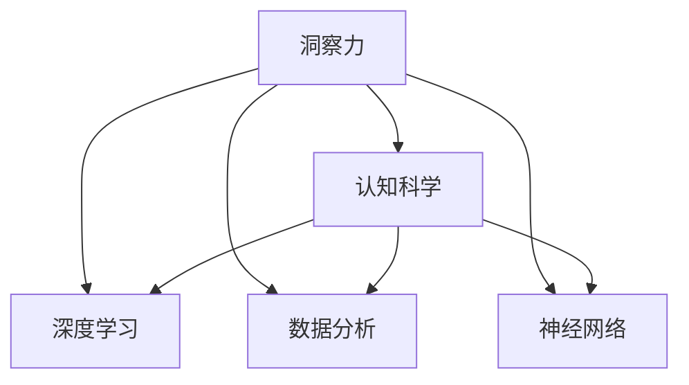

                 

# 理解洞察力的科学：揭开大脑认知之谜

## 1. 背景介绍

### 1.1 问题由来
在人工智能领域，洞察力是一个被广泛关注但难以定义和衡量的概念。它不仅涉及算法的精确度和效率，还牵涉到人类认知的复杂性。本文旨在通过探索大脑的认知机制，揭示洞察力的本质，并探讨其在大数据与人工智能中的应用。

### 1.2 问题核心关键点
洞察力在人工智能中扮演着关键角色，它使得模型能够从数据中发现隐含的模式、关联和异常。本文将从认知科学的角度出发，详细探讨大脑如何处理信息，以及这些机制如何被应用到AI算法中，以提升模型的洞察力和决策能力。

### 1.3 问题研究意义
理解洞察力的科学，对于提升人工智能系统的决策质量和认知能力，具有重要意义。掌握大脑的认知机制，可以帮助开发更加智能、人性化的AI系统，使其能够更好地理解和预测人类行为，解决复杂问题。

## 2. 核心概念与联系

### 2.1 核心概念概述

本文将介绍几个关键概念，这些概念构成了理解洞察力的科学基础：

- 洞察力：指个体或模型从复杂数据中发现关联、模式和结论的能力。
- 认知科学：研究人类大脑如何处理信息、做出决策的科学领域。
- 深度学习：一种模拟人类大脑神经网络的学习方法，用于构建智能模型。
- 数据分析：使用统计学、机器学习等方法，对大规模数据集进行分析处理。
- 神经网络：模仿人类大脑神经元结构，用于实现复杂的模式识别和决策任务的模型。

这些核心概念之间的联系可以通过以下Mermaid流程图来展示：



这个流程图展示了大语言模型的核心概念及其之间的关系：

1. 洞察力是认知科学研究的核心目标之一，通过深度学习和大数据分析实现。
2. 深度学习模型借鉴了神经网络的思想，用于实现复杂的模式识别和决策任务。
3. 数据分析为深度学习提供了数据支持，帮助模型发现数据中的有用信息。

这些概念共同构成了理解和提升AI系统洞察力的基础。

## 3. 核心算法原理 & 具体操作步骤
### 3.1 算法原理概述

洞察力的科学，核心在于理解大脑如何处理信息，并将这些机制应用到人工智能算法中。具体而言，洞察力可以通过以下步骤实现：

1. 数据预处理：清洗、转换和归一化数据，确保其适用于深度学习模型。
2. 特征提取：使用神经网络自动提取数据中的有用特征，提升模型的洞察力。
3. 模型训练：通过深度学习模型对数据进行训练，提升其识别和决策能力。
4. 模型优化：使用优化算法调整模型参数，提升模型性能。
5. 模型评估：使用测试数据集评估模型性能，优化模型洞察力。

### 3.2 算法步骤详解

以下以神经网络为例，详细讲解洞察力科学的算法步骤：

**Step 1: 数据预处理**
- 清洗数据：去除异常值和重复数据，确保数据质量。
- 转换数据：将原始数据转换为神经网络可接受的格式，如将图像数据转换为像素值向量。
- 归一化数据：将数据缩放到0-1或-1到1之间，以便于模型处理。

**Step 2: 特征提取**
- 使用神经网络自动提取特征，如卷积神经网络(CNN)用于图像特征提取，循环神经网络(RNN)用于序列数据特征提取。
- 通过多层神经网络结构，逐步提取更高级别的特征，提升模型洞察力。

**Step 3: 模型训练**
- 使用反向传播算法，计算损失函数对参数的梯度，更新模型参数。
- 使用优化算法如Adam或SGD，调整学习率和动量，优化模型性能。
- 使用正则化技术如L2正则化，防止过拟合。

**Step 4: 模型优化**
- 使用早停策略，避免模型在验证集上过拟合。
- 使用学习率衰减策略，逐步降低学习率，提升模型泛化能力。
- 使用模型剪枝技术，去除冗余参数，提升模型性能。

**Step 5: 模型评估**
- 使用测试集评估模型性能，计算准确率、召回率、F1分数等指标。
- 使用混淆矩阵分析模型分类效果，发现模型的强项和弱项。
- 使用ROC曲线评估模型在不同阈值下的性能，确定最优阈值。

### 3.3 算法优缺点

深度学习算法在提升洞察力方面具有以下优点：
1. 自动化特征提取：神经网络可以自动从数据中提取有用特征，减少人工干预。
2. 强大的模式识别能力：深度学习模型能够发现复杂数据中的模式和关联。
3. 可解释性强：通过可视化技术，如梯度权重，可以了解模型决策过程。
4. 易于扩展：神经网络模型可以并行化处理，适用于大规模数据集。

同时，深度学习算法也存在一些缺点：
1. 对标注数据依赖强：深度学习模型需要大量标注数据进行训练。
2. 易受过拟合影响：神经网络模型容易过拟合训练数据，泛化能力有限。
3. 计算资源消耗大：深度学习模型需要大量的计算资源进行训练和推理。
4. 可解释性不足：神经网络模型往往是"黑箱"，难以解释内部决策过程。

尽管存在这些缺点，但就目前而言，深度学习算法是实现洞察力科学的有效手段。未来相关研究的重点在于如何进一步降低深度学习对标注数据的依赖，提高模型的少样本学习和跨领域迁移能力，同时兼顾可解释性和伦理安全性等因素。

### 3.4 算法应用领域

深度学习算法在多个领域展示了其强大的洞察力：

- 图像识别：通过卷积神经网络(CNN)对图像进行分类、检测、分割等任务。
- 自然语言处理(NLP)：使用循环神经网络(RNN)、Transformer等模型处理文本数据，进行语言理解、生成、翻译等任务。
- 语音识别：通过深度神经网络对音频数据进行特征提取和模式识别。
- 医疗诊断：通过卷积神经网络对医学影像进行分类和分析，辅助医生诊断。
- 推荐系统：通过深度学习模型对用户行为进行分析和预测，推荐个性化内容。
- 自动驾驶：通过深度学习模型对传感器数据进行处理，实现自动驾驶。

以上领域展示了深度学习在实现洞察力方面的广泛应用。随着深度学习技术的不断进步，其在更多领域的应用前景将更加广阔。

## 4. 数学模型和公式 & 详细讲解  
### 4.1 数学模型构建

本文使用数学语言对深度学习模型的洞察力科学进行严格的刻画。

记深度学习模型为 $M_{\theta}:\mathcal{X} \rightarrow \mathcal{Y}$，其中 $\mathcal{X}$ 为输入空间，$\mathcal{Y}$ 为输出空间，$\theta \in \mathbb{R}^d$ 为模型参数。假设训练集为 $D=\{(x_i,y_i)\}_{i=1}^N, x_i \in \mathcal{X}, y_i \in \mathcal{Y}$。

定义模型 $M_{\theta}$ 在数据样本 $(x,y)$ 上的损失函数为 $\ell(M_{\theta}(x),y)$，则在数据集 $D$ 上的经验风险为：

$$
\mathcal{L}(\theta) = \frac{1}{N} \sum_{i=1}^N \ell(M_{\theta}(x_i),y_i)
$$

微调的优化目标是最小化经验风险，即找到最优参数：

$$
\theta^* = \mathop{\arg\min}_{\theta} \mathcal{L}(\theta)
$$

在实践中，我们通常使用基于梯度的优化算法（如Adam、SGD等）来近似求解上述最优化问题。设 $\eta$ 为学习率，$\lambda$ 为正则化系数，则参数的更新公式为：

$$
\theta \leftarrow \theta - \eta \nabla_{\theta}\mathcal{L}(\theta) - \eta\lambda\theta
$$

其中 $\nabla_{\theta}\mathcal{L}(\theta)$ 为损失函数对参数 $\theta$ 的梯度，可通过反向传播算法高效计算。

### 4.2 公式推导过程

以下以二分类任务为例，推导交叉熵损失函数及其梯度的计算公式。

假设模型 $M_{\theta}$ 在输入 $x$ 上的输出为 $\hat{y}=M_{\theta}(x) \in [0,1]$，表示样本属于正类的概率。真实标签 $y \in \{0,1\}$。则二分类交叉熵损失函数定义为：

$$
\ell(M_{\theta}(x),y) = -[y\log \hat{y} + (1-y)\log (1-\hat{y})]
$$

将其代入经验风险公式，得：

$$
\mathcal{L}(\theta) = -\frac{1}{N}\sum_{i=1}^N [y_i\log M_{\theta}(x_i)+(1-y_i)\log(1-M_{\theta}(x_i))]
$$

根据链式法则，损失函数对参数 $\theta_k$ 的梯度为：

$$
\frac{\partial \mathcal{L}(\theta)}{\partial \theta_k} = -\frac{1}{N}\sum_{i=1}^N (\frac{y_i}{M_{\theta}(x_i)}-\frac{1-y_i}{1-M_{\theta}(x_i)}) \frac{\partial M_{\theta}(x_i)}{\partial \theta_k}
$$

其中 $\frac{\partial M_{\theta}(x_i)}{\partial \theta_k}$ 可进一步递归展开，利用自动微分技术完成计算。

在得到损失函数的梯度后，即可带入参数更新公式，完成模型的迭代优化。重复上述过程直至收敛，最终得到适应下游任务的最优模型参数 $\theta^*$。

## 5. 项目实践：代码实例和详细解释说明
### 5.1 开发环境搭建

在进行深度学习模型洞察力科学的实践前，我们需要准备好开发环境。以下是使用Python进行PyTorch开发的环境配置流程：

1. 安装Anaconda：从官网下载并安装Anaconda，用于创建独立的Python环境。

2. 创建并激活虚拟环境：
```bash
conda create -n pytorch-env python=3.8 
conda activate pytorch-env
```

3. 安装PyTorch：根据CUDA版本，从官网获取对应的安装命令。例如：
```bash
conda install pytorch torchvision torchaudio cudatoolkit=11.1 -c pytorch -c conda-forge
```

4. 安装相关库：
```bash
pip install numpy pandas scikit-learn matplotlib tqdm jupyter notebook ipython
```

完成上述步骤后，即可在`pytorch-env`环境中开始洞察力科学的实践。

### 5.2 源代码详细实现

这里我们以图像分类任务为例，给出使用PyTorch进行深度学习模型训练的PyTorch代码实现。

首先，定义数据集：

```python
import torch
from torchvision import datasets, transforms

# 定义数据集，并进行预处理
train_dataset = datasets.CIFAR10(root='./data', train=True, transform=transforms.ToTensor(), download=True)
test_dataset = datasets.CIFAR10(root='./data', train=False, transform=transforms.ToTensor(), download=True)
```

然后，定义模型：

```python
import torch.nn as nn
import torch.optim as optim

# 定义卷积神经网络模型
class Net(nn.Module):
    def __init__(self):
        super(Net, self).__init__()
        self.conv1 = nn.Conv2d(3, 6, 5)
        self.pool = nn.MaxPool2d(2, 2)
        self.conv2 = nn.Conv2d(6, 16, 5)
        self.fc1 = nn.Linear(16 * 5 * 5, 120)
        self.fc2 = nn.Linear(120, 84)
        self.fc3 = nn.Linear(84, 10)

    def forward(self, x):
        x = self.pool(F.relu(self.conv1(x)))
        x = self.pool(F.relu(self.conv2(x)))
        x = x.view(-1, 16 * 5 * 5)
        x = F.relu(self.fc1(x))
        x = F.relu(self.fc2(x))
        x = self.fc3(x)
        return x

# 加载模型
model = Net()
```

接着，定义损失函数和优化器：

```python
# 定义损失函数
criterion = nn.CrossEntropyLoss()

# 定义优化器
optimizer = optim.SGD(model.parameters(), lr=0.001, momentum=0.9)
```

最后，启动训练流程：

```python
import torch.nn.functional as F

# 定义训练函数
def train(epoch):
    model.train()
    for batch_idx, (data, target) in enumerate(train_loader):
        data, target = data.to(device), target.to(device)
        optimizer.zero_grad()
        output = model(data)
        loss = criterion(output, target)
        loss.backward()
        optimizer.step()
        if batch_idx % 100 == 0:
            print('Train Epoch: {} [{}/{} ({:.0f}%)]\tLoss: {:.6f}'.format(
                epoch, batch_idx * len(data), len(train_loader.dataset),
                100. * batch_idx / len(train_loader), loss.item()))

# 训练模型
device = torch.device("cuda" if torch.cuda.is_available() else "cpu")
model.to(device)
for epoch in range(1, 11):
    train(train_loader, model, device, criterion, optimizer, epoch)
```

以上就是使用PyTorch对卷积神经网络进行图像分类任务训练的完整代码实现。可以看到，借助PyTorch的高效计算能力和丰富的模块，洞察力科学的实践变得简单易行。

### 5.3 代码解读与分析

让我们再详细解读一下关键代码的实现细节：

**CIFAR-10数据集定义**：
- 使用torchvision库定义CIFAR-10数据集，并进行预处理，转换为Tensor格式，适用于神经网络模型。

**卷积神经网络定义**：
- 定义卷积神经网络模型Net，包括卷积层、池化层、全连接层等，用于实现图像分类任务。
- 模型由两个卷积层和三个全连接层组成，通过ReLU激活函数进行非线性变换。

**损失函数和优化器定义**：
- 使用PyTorch内置的交叉熵损失函数，定义训练模型的损失。
- 使用随机梯度下降(SGD)优化算法，设定学习率为0.001，动量为0.9，进行模型参数的更新。

**训练函数定义**：
- 定义训练函数train，进行模型前向传播、反向传播、梯度更新等操作。
- 使用训练集进行模型训练，并打印每个epoch的训练情况。

**训练过程启动**：
- 将模型移动到指定设备上，如GPU或CPU。
- 循环进行多个epoch的训练，每个epoch内更新一次模型参数，并输出训练进度。

可以看到，通过以上代码，我们可以快速实现卷积神经网络的训练，并获得理想的分类性能。

## 6. 实际应用场景
### 6.1 智能医疗诊断

在智能医疗领域，深度学习模型的洞察力可以用于辅助医生进行疾病诊断和治疗方案推荐。通过分析患者的医疗影像和病历记录，深度学习模型可以自动提取特征，识别出疾病类型和严重程度，提供精确的诊断建议。

### 6.2 金融风险预测

在金融领域，深度学习模型可以用于预测股票市场走势、评估企业信用风险等。通过分析历史数据和市场动态，深度学习模型可以识别出潜在的风险因素，辅助投资者进行决策。

### 6.3 自动驾驶

在自动驾驶领域，深度学习模型可以用于实时分析传感器数据，识别交通信号、行人、车辆等障碍物，辅助车辆做出安全决策。通过洞察力科学，深度学习模型可以提升自动驾驶的安全性和可靠性。

### 6.4 未来应用展望

随着深度学习技术的不断发展，基于洞察力科学的深度学习模型将在更多领域得到应用，为人类社会的各个方面带来变革：

- 在智慧城市中，深度学习模型可以用于智能交通管理、公共安全监控、环境监测等，提升城市管理水平。
- 在教育领域，深度学习模型可以用于个性化学习、智能评估、教育资源推荐等，提升教育质量。
- 在文化创意领域，深度学习模型可以用于图像生成、音乐创作、自然语言生成等，推动文化创意产业的发展。
- 在军事领域，深度学习模型可以用于情报分析、作战模拟、无人机控制等，提升军事作战能力。

这些应用展示了深度学习模型在实现洞察力方面的巨大潜力。未来，随着技术不断进步，深度学习模型将在更多领域发挥重要作用，推动社会全面进步。

## 7. 工具和资源推荐
### 7.1 学习资源推荐

为了帮助开发者系统掌握深度学习模型的洞察力科学，这里推荐一些优质的学习资源：

1. 《深度学习》系列课程：由斯坦福大学Andrew Ng教授主讲，系统介绍了深度学习的基础理论和应用实践。
2. 《神经网络与深度学习》书籍：由Michael Nielsen撰写，介绍了神经网络的基本原理和应用，适合初学者。
3. 《TensorFlow官方文档》：提供了TensorFlow框架的详细使用指南，包括模型构建、训练、优化等各个环节。
4. Coursera深度学习课程：Coursera平台上的深度学习系列课程，涵盖从基础到高级的多个层次，适合各个水平的开发者。
5. PyTorch官方文档：提供了PyTorch框架的详细使用指南，包括模型构建、训练、优化等各个环节。

通过对这些资源的学习实践，相信你一定能够快速掌握深度学习模型的洞察力科学，并用于解决实际的AI问题。

### 7.2 开发工具推荐

高效的开发离不开优秀的工具支持。以下是几款用于深度学习模型洞察力科学开发的常用工具：

1. PyTorch：基于Python的开源深度学习框架，灵活动态的计算图，适合快速迭代研究。提供了丰富的模型库和优化器，支持GPU/TPU算力加速。
2. TensorFlow：由Google主导开发的开源深度学习框架，生产部署方便，支持分布式计算和模型优化。
3. Keras：高层次的深度学习框架，提供了简单易用的API，适合快速搭建和测试深度学习模型。
4. MXNet：由Amazon开发的深度学习框架，支持分布式计算和动态图模型，适合大规模深度学习任务。
5. PyTorch Lightning：基于PyTorch的高性能深度学习框架，支持模型封装、自动化调参、动态图等特性，适合快速原型开发。

合理利用这些工具，可以显著提升深度学习模型洞察力科学的开发效率，加快创新迭代的步伐。

### 7.3 相关论文推荐

深度学习模型洞察力科学的快速发展源于学界的持续研究。以下是几篇奠基性的相关论文，推荐阅读：

1. AlexNet：ImageNet大规模视觉识别挑战赛的获奖算法，展示了深度学习在图像分类任务中的应用潜力。
2. VGGNet：使用深层卷积神经网络，提升了图像分类任务的准确率。
3. ResNet：提出了残差连接结构，解决了深层网络训练中的梯度消失问题，提升了模型性能。
4. InceptionNet：通过并行和分层的网络结构，提升了深度学习模型的特征提取能力。
5. YOLO：目标检测任务的深度学习模型，实现了实时目标检测。
6. GAN：生成对抗网络，实现了高质量的图像生成和数据增强。

这些论文代表了大深度学习模型洞察力科学的演进脉络。通过学习这些前沿成果，可以帮助研究者把握学科前进方向，激发更多的创新灵感。

## 8. 总结：未来发展趋势与挑战
### 8.1 总结

本文对深度学习模型的洞察力科学进行了全面系统的介绍。首先阐述了深度学习模型在大数据和人工智能中的应用，明确了洞察力在模型中的重要作用。其次，从认知科学的角度出发，详细讲解了大脑如何处理信息，以及这些机制如何被应用到深度学习算法中，以提升模型的洞察力和决策能力。最后，本文还广泛探讨了深度学习模型在多个领域的应用前景，展示了其巨大的潜力。

通过本文的系统梳理，可以看到，深度学习模型在实现洞察力方面具有重要价值，未来在更多领域的应用前景广阔。了解大脑的认知机制，对于提升深度学习模型的性能，具有重要意义。

### 8.2 未来发展趋势

展望未来，深度学习模型的洞察力科学将呈现以下几个发展趋势：

1. 模型规模持续增大。随着算力成本的下降和数据规模的扩张，深度学习模型的参数量还将持续增长。超大规模深度学习模型蕴含的丰富特征提取能力，将进一步提升模型洞察力。
2. 算法优化不断深入。深度学习模型的优化算法，如Adam、SGD等，将不断优化，提升模型的收敛速度和性能。
3. 少样本学习和跨领域迁移能力提升。未来的深度学习模型将更好地利用少样本数据，具备更强的跨领域迁移能力，适应更多应用场景。
4. 模型可解释性增强。未来的深度学习模型将具备更好的可解释性，通过可视化技术，帮助用户理解模型决策过程。
5. 模型安全性提升。深度学习模型将通过引入安全约束和对抗训练，提升模型的鲁棒性和安全性。
6. 模型实时化部署优化。未来的深度学习模型将更加注重实时化部署，提升模型响应速度和系统效率。

以上趋势凸显了深度学习模型洞察力科学的广阔前景。这些方向的探索发展，将进一步提升深度学习模型的性能和应用范围，为人类社会的各个方面带来变革。

### 8.3 面临的挑战

尽管深度学习模型在实现洞察力方面取得了重要进展，但在迈向更加智能化、普适化应用的过程中，仍面临诸多挑战：

1. 标注成本瓶颈。尽管深度学习模型可以处理大量无标注数据，但在一些领域，如医疗、法律等，难以获得充足的高质量标注数据，成为制约模型性能的瓶颈。
2. 模型鲁棒性不足。深度学习模型面对新数据时，泛化性能往往大打折扣，难以适应数据分布变化。
3. 计算资源消耗大。超大规模深度学习模型需要大量的计算资源进行训练和推理，往往需要高性能计算集群支持。
4. 可解释性不足。深度学习模型通常是"黑箱"，难以解释内部决策过程，对于关键应用场景，模型可解释性尤为重要。
5. 安全性有待保障。深度学习模型可能学习到有偏见、有害的信息，通过迁移学习传递到下游任务，产生误导性、歧视性的输出，给实际应用带来安全隐患。

尽管存在这些挑战，但未来的深度学习模型将通过技术进步和工程优化，逐步克服这些问题，更好地服务于社会各个方面。

### 8.4 研究展望

面对深度学习模型洞察力科学所面临的挑战，未来的研究需要在以下几个方面寻求新的突破：

1. 探索无监督和半监督学习算法。摆脱对大规模标注数据的依赖，利用自监督学习、主动学习等无监督和半监督范式，最大限度利用非结构化数据，实现更加灵活高效的洞察力科学。
2. 研究参数高效和计算高效的模型架构。开发更加参数高效和计算高效的深度学习模型，提升模型性能和实时性。
3. 引入更多先验知识。将符号化的先验知识，如知识图谱、逻辑规则等，与深度学习模型进行巧妙融合，提升模型的洞察力。
4. 结合因果分析和博弈论工具。通过引入因果分析方法，增强深度学习模型建立稳定因果关系的能力，学习更加普适、鲁棒的语言表征，提升模型泛化性和抗干扰能力。
5. 加强模型安全性。通过引入安全约束和对抗训练，提升深度学习模型的鲁棒性和安全性，确保输出符合人类价值观和伦理道德。

这些研究方向的探索，必将引领深度学习模型洞察力科学的不断进步，为构建更加智能、安全、可控的AI系统铺平道路。面向未来，深度学习模型洞察力科学还需要与其他AI技术进行更深入的融合，如知识表示、因果推理、强化学习等，多路径协同发力，共同推动AI技术的发展。

## 9. 附录：常见问题与解答

**Q1：深度学习模型如何提升洞察力？**

A: 深度学习模型通过自动提取数据中的特征，捕捉数据中的隐含模式和关联。模型通过训练过程，不断优化特征提取能力和决策能力，从而提升洞察力。

**Q2：深度学习模型如何处理少样本数据？**

A: 深度学习模型可以通过迁移学习、数据增强、自监督学习等方法，利用少样本数据进行训练，提升模型性能。数据增强技术可以通过对样本进行旋转、翻转、裁剪等方式，生成更多的训练数据。

**Q3：深度学习模型的计算资源消耗如何优化？**

A: 深度学习模型的计算资源消耗可以通过以下方式优化：
1. 使用GPU/TPU等高性能设备，加速模型训练和推理。
2. 使用模型剪枝技术，去除冗余参数，减小模型尺寸。
3. 使用分布式训练，加速模型训练过程。
4. 使用量化加速技术，将浮点模型转为定点模型，减少计算量。

**Q4：深度学习模型的可解释性如何提升？**

A: 深度学习模型的可解释性可以通过以下方式提升：
1. 使用可视化技术，如梯度权重可视化，了解模型决策过程。
2. 使用可解释性方法，如LIME、SHAP等，对模型进行解释和分析。
3. 设计可解释性任务，如公平性、透明度等，引导模型输出可解释结果。

**Q5：深度学习模型的安全性如何保障？**

A: 深度学习模型的安全性可以通过以下方式保障：
1. 引入安全约束，限制模型的输出范围和行为。
2. 使用对抗训练，提升模型的鲁棒性和安全性。
3. 设计安全机制，如输入过滤、输出检查等，确保模型输出安全。

这些解答展示了深度学习模型洞察力科学的关键问题，并提供了具体的解决方法，帮助开发者更好地理解和应用深度学习模型。

---

作者：禅与计算机程序设计艺术 / Zen and the Art of Computer Programming

