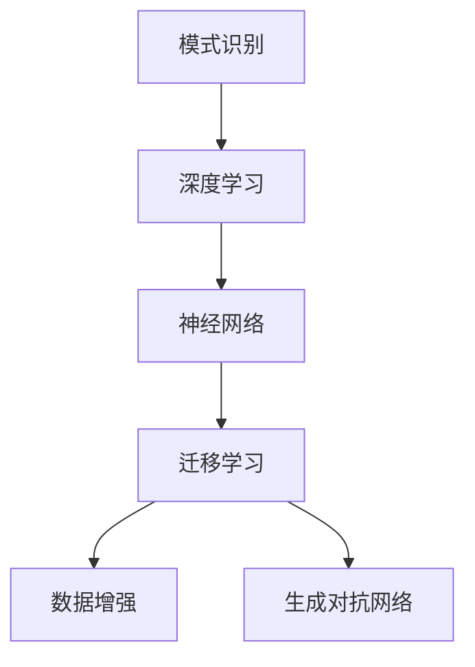

                 

# 理解洞察力的训练：提升模式识别能力

> 关键词：洞察力训练,模式识别,机器学习,深度学习,神经网络,数据增强,迁移学习

## 1. 背景介绍

### 1.1 问题由来
在信息爆炸的时代，大数据、人工智能等技术迅猛发展，带来了巨大的机遇和挑战。为了从海量数据中挖掘出有价值的信息，提升模式识别能力成为了关键。通过训练高效的模式识别模型，我们可以从各种复杂数据中提取出深层次的洞察力，揭示潜在的规律和趋势。

在实际应用中，模式识别技术已经广泛应用于医学影像分析、自动驾驶、金融风控、网络安全等领域，显著提高了生产效率和决策质量。但如何训练出高效的模式识别模型，以及如何提升模型的洞察力，仍然是人工智能领域的一大难题。

### 1.2 问题核心关键点
模式识别技术主要通过机器学习算法，将输入数据映射到不同的特征空间，并通过分类、回归等方法，识别出数据中的模式。其核心在于数据的特征提取和模型的泛化能力。

模式识别通常涉及以下关键点：
- 数据的收集与预处理：收集高质量的原始数据，并对其进行清洗、归一化、增强等预处理，提高数据的质量和多样性。
- 特征提取：从原始数据中提取有意义的特征，建立特征空间，如使用卷积、池化、自编码器等方法，构建特征表示。
- 模型训练与优化：使用监督学习或无监督学习算法，训练模式识别模型，并通过交叉验证等方法，优化模型参数，提高模型的泛化能力。
- 结果评估与应用：使用准确率、召回率、F1值等指标，评估模型效果，并应用于实际场景，进行模式识别和决策。

模式识别技术已经经历了从浅层学习到深层学习的跨越，尤其在深度学习框架的支持下，神经网络模型成为了模式识别的首选。但即便是在深度学习时代，如何高效地训练出具有强大洞察力的模式识别模型，仍然是一个需要深入研究的问题。

### 1.3 问题研究意义
提升模式识别模型的洞察力，对于各类应用场景具有重要意义：

1. **降低数据依赖**：提升模式识别模型的洞察力，可以帮助其在更少的数据样本下，更快地收敛和泛化，从而减少对标注数据的需求。
2. **提高精度与鲁棒性**：洞察力较强的模型能够更好地捕捉数据中的细节和规律，提升预测准确性和模型的鲁棒性。
3. **促进知识整合**：洞察力强的模型可以更灵活地吸收和运用先验知识，提升模型对现实世界的理解能力。
4. **加速技术落地**：洞察力强的模型能够在更复杂的场景下快速实现模式识别，加速人工智能技术的产业化进程。

本文将围绕模式识别模型的洞察力训练展开，介绍如何在训练过程中提升模型对数据的理解能力，从而实现更高效的特征提取和模式识别。

## 2. 核心概念与联系

### 2.1 核心概念概述

为更好地理解模式识别模型的洞察力训练方法，本节将介绍几个密切相关的核心概念：

- 模式识别(Pattern Recognition)：指通过机器学习算法，将输入数据映射到不同的特征空间，并通过分类、回归等方法，识别出数据中的模式。
- 深度学习(Deep Learning)：一种基于多层神经网络的机器学习方法，能够自动学习数据中的复杂特征表示。
- 神经网络(Neural Network)：由多个神经元(节点)组成的计算网络，通过前向传播和反向传播，训练神经网络模型。
- 迁移学习(Transfer Learning)：指在一个领域上训练的模型，迁移到另一个相关领域上进行微调或继续训练的方法。
- 数据增强(Data Augmentation)：通过对原始数据进行一系列变换，如旋转、翻转、裁剪等，生成更多的训练样本，提高模型的泛化能力。
- 生成对抗网络(GANs)：一种生成模型，通过对抗训练的方式，生成逼真的训练样本，增强数据多样性。

这些核心概念之间的逻辑关系可以通过以下Mermaid流程图来展示：



这个流程图展示了几者之间的联系：

1. 模式识别通过深度学习和神经网络技术，自动学习数据的复杂特征表示。
2. 迁移学习将已经训练好的模型，迁移到其他相关领域，提升模型泛化能力。
3. 数据增强通过变换原始数据，生成更多训练样本，提高模型的鲁棒性。
4. GANs生成逼真的训练样本，增强数据多样性，提升模型泛化能力。

这些概念共同构成了模式识别模型的训练框架，使其能够在各种场景下发挥强大的特征提取和模式识别能力。通过理解这些核心概念，我们可以更好地把握模式识别模型的训练方法和优化策略。

## 3. 核心算法原理 & 具体操作步骤
### 3.1 算法原理概述

模式识别模型的训练过程，本质上是一个优化问题。通过训练数据，模型学习数据的特征表示，并通过损失函数来衡量模型预测与真实标签之间的差异。目标是最小化损失函数，从而使得模型预测更接近真实标签。

形式化地，假设模型为 $M_{\theta}:\mathcal{X} \rightarrow \mathcal{Y}$，其中 $\mathcal{X}$ 为输入空间，$\mathcal{Y}$ 为输出空间，$\theta$ 为模型参数。假设训练集为 $D=\{(x_i,y_i)\}_{i=1}^N$，则模型的损失函数定义为：

$$
\mathcal{L}(\theta) = \frac{1}{N} \sum_{i=1}^N \ell(M_{\theta}(x_i),y_i)
$$

其中 $\ell$ 为损失函数，常见包括交叉熵损失、均方误差损失等。通过优化算法（如梯度下降），最小化损失函数 $\mathcal{L}(\theta)$，使得模型输出逼近真实标签。

### 3.2 算法步骤详解

模式识别模型的训练通常包括以下几个关键步骤：

**Step 1: 数据准备**
- 收集和预处理训练数据，进行清洗、归一化、增强等操作，提高数据质量。
- 划分训练集、验证集和测试集，确保模型在新数据上的泛化能力。

**Step 2: 模型选择与初始化**
- 选择合适的深度学习模型架构，如卷积神经网络(CNN)、循环神经网络(RNN)、Transformer等。
- 初始化模型参数，使用随机初始化或预训练模型作为初始权重。

**Step 3: 损失函数设计**
- 根据任务类型，设计合适的损失函数。
- 对于分类任务，常用交叉熵损失；对于回归任务，常用均方误差损失。

**Step 4: 训练过程**
- 使用优化算法（如Adam、SGD等）进行模型参数的更新。
- 通过前向传播计算损失，反向传播计算梯度，更新模型参数。
- 在验证集上评估模型性能，避免过拟合。
- 重复上述步骤直至收敛。

**Step 5: 结果评估与优化**
- 使用测试集评估模型性能，评估指标如准确率、召回率、F1值等。
- 根据评估结果，调整模型参数，优化模型性能。
- 使用迁移学习、数据增强、生成对抗网络等技术提升模型洞察力。

### 3.3 算法优缺点

模式识别模型的训练方法具有以下优点：
- 高效泛化：通过数据增强和迁移学习，能够有效提升模型泛化能力，适应更多数据分布。
- 灵活性：适用于多种任务类型，如图像分类、目标检测、语音识别等。
- 可扩展性：深度学习模型具有很强的扩展性，可以通过增加网络层数、调整网络结构等手段，提升模型性能。

同时，该方法也存在以下局限性：
- 数据依赖：训练数据的质量和多样性对模型性能有直接影响。
- 过拟合风险：在大规模数据集上训练深度模型时，容易出现过拟合问题。
- 计算资源需求高：深度学习模型参数量大，训练和推理需要高性能计算资源。
- 可解释性不足：深度模型通常为"黑盒"系统，难以解释其内部工作机制和决策逻辑。

尽管存在这些局限性，但就目前而言，模式识别模型的训练方法仍然是机器学习和深度学习领域的主流范式。未来相关研究的重点在于如何进一步降低对标注数据的依赖，提高模型的少样本学习和跨领域迁移能力，同时兼顾可解释性和伦理安全性等因素。

### 3.4 算法应用领域

模式识别模型在各个领域都有广泛应用，如：

- 计算机视觉：图像分类、目标检测、图像分割等任务。通过深度学习模型，可以从图像中提取特征，进行模式识别。
- 自然语言处理：情感分析、文本分类、机器翻译等任务。通过深度学习模型，可以从文本中提取语义信息，进行模式识别。
- 生物信息学：基因序列分析、蛋白质结构预测等任务。通过深度学习模型，可以从生物数据中提取特征，进行模式识别。
- 金融风控：信用评估、欺诈检测等任务。通过深度学习模型，可以从交易数据中提取特征，进行模式识别。
- 医疗影像：医学图像分析、疾病诊断等任务。通过深度学习模型，可以从影像数据中提取特征，进行模式识别。

除了这些经典任务外，模式识别模型还被创新性地应用于更多场景中，如智能推荐、智能客服、智能家居等，为各行各业带来了新的突破。随着深度学习模型的不断进步，相信模式识别技术将在更广阔的应用领域大放异彩。

## 4. 数学模型和公式 & 详细讲解 & 举例说明

### 4.1 数学模型构建

以下我们以图像分类任务为例，使用深度卷积神经网络(Convolutional Neural Network, CNN)进行模式识别模型的训练。

记训练集为 $D=\{(x_i,y_i)\}_{i=1}^N$，其中 $x_i$ 为输入图像，$y_i$ 为标签。假设模型为 $M_{\theta}:\mathcal{X} \rightarrow \mathcal{Y}$，其中 $\mathcal{X}$ 为图像空间，$\mathcal{Y}$ 为标签空间，$\theta$ 为模型参数。

定义模型在输入 $x$ 上的输出为 $M_{\theta}(x)$，则模型的损失函数定义为：

$$
\mathcal{L}(\theta) = \frac{1}{N} \sum_{i=1}^N \ell(M_{\theta}(x_i),y_i)
$$

其中 $\ell$ 为损失函数，如交叉熵损失。根据链式法则，损失函数对参数 $\theta$ 的梯度为：

$$
\frac{\partial \mathcal{L}(\theta)}{\partial \theta} = \frac{1}{N} \sum_{i=1}^N \frac{\partial \ell(M_{\theta}(x_i),y_i)}{\partial \theta}
$$

在得到损失函数的梯度后，即可带入参数更新公式，完成模型的迭代优化。重复上述过程直至收敛，最终得到适应训练集的模式识别模型。

### 4.2 公式推导过程

以二分类任务为例，推导交叉熵损失函数及其梯度的计算公式。

假设模型 $M_{\theta}$ 在输入 $x$ 上的输出为 $\hat{y}=M_{\theta}(x) \in [0,1]$，表示样本属于正类的概率。真实标签 $y \in \{0,1\}$。则二分类交叉熵损失函数定义为：

$$
\ell(M_{\theta}(x),y) = -[y\log \hat{y} + (1-y)\log (1-\hat{y})]
$$

将其代入损失函数公式，得：

$$
\mathcal{L}(\theta) = -\frac{1}{N}\sum_{i=1}^N [y_i\log M_{\theta}(x_i)+(1-y_i)\log(1-M_{\theta}(x_i))]
$$

根据链式法则，损失函数对参数 $\theta$ 的梯度为：

$$
\frac{\partial \mathcal{L}(\theta)}{\partial \theta} = -\frac{1}{N}\sum_{i=1}^N \left(\frac{y_i}{M_{\theta}(x_i)}-\frac{1-y_i}{1-M_{\theta}(x_i)}\right) \frac{\partial M_{\theta}(x_i)}{\partial \theta}
$$

其中 $\frac{\partial M_{\theta}(x_i)}{\partial \theta}$ 可进一步递归展开，利用自动微分技术完成计算。

### 4.3 案例分析与讲解

假设我们有一个包含10万张猫狗的图像数据集，其中猫狗各占一半。我们希望使用CNN模型对图像进行分类，并希望在少样本条件下也能获得不错的分类效果。

首先，我们将数据集划分为训练集和测试集，并进行数据增强处理。对于每张图像，我们随机对其进行旋转、裁剪、缩放等变换，生成更多的训练样本。例如，对于一张图像，我们可以将其旋转一定角度，并将其随机裁剪为不同尺寸的图像，以增加数据的多样性。

然后，我们构建一个简单的CNN模型，包含卷积层、池化层和全连接层。对于每个卷积层，我们使用3x3的卷积核和ReLU激活函数。对于全连接层，我们使用一个具有10个神经元的全连接层，输出层使用sigmoid激活函数，以进行二分类。

在训练过程中，我们使用Adam优化算法进行参数更新。我们设定学习率为0.001，迭代轮数为10次。在每次迭代中，我们将输入图像和标签作为输入，计算损失函数，并根据梯度更新模型参数。

最后，在测试集上评估模型性能，输出模型的准确率和混淆矩阵。通过混淆矩阵，我们可以分析模型在各类样本上的分类效果。

## 5. 项目实践：代码实例和详细解释说明

### 5.1 开发环境搭建

在进行模式识别模型训练前，我们需要准备好开发环境。以下是使用Python进行Keras实现CNN模型的环境配置流程：

1. 安装Anaconda：从官网下载并安装Anaconda，用于创建独立的Python环境。

2. 创建并激活虚拟环境：
```bash
conda create -n pytorch-env python=3.8 
conda activate pytorch-env
```

3. 安装Keras、TensorFlow等库：
```bash
pip install keras tensorflow
```

4. 安装各类工具包：
```bash
pip install numpy pandas scikit-learn matplotlib tqdm jupyter notebook ipython
```

完成上述步骤后，即可在`pytorch-env`环境中开始模式识别模型训练实践。

### 5.2 源代码详细实现

下面我们以猫狗图像分类任务为例，给出使用Keras构建CNN模型进行模式识别训练的Python代码实现。

首先，定义数据预处理函数：

```python
import numpy as np
import keras
from keras.preprocessing.image import ImageDataGenerator

def data_preprocess(X_train, X_val, X_test, y_train, y_val, y_test, img_size):
    X_train = np.array(X_train)
    X_val = np.array(X_val)
    X_test = np.array(X_test)

    img_gen = ImageDataGenerator(
        rescale=1./255,
        shear_range=0.2,
        zoom_range=0.2,
        horizontal_flip=True
    )
    img_gen.fit(X_train)

    return img_gen.flow(X_train, y_train, batch_size=32), img_gen.flow(X_val, y_val, batch_size=32), img_gen.flow(X_test, y_test, batch_size=32)
```

然后，定义模型和优化器：

```python
from keras.models import Sequential
from keras.layers import Conv2D, MaxPooling2D, Flatten, Dense

model = Sequential()
model.add(Conv2D(32, (3,3), activation='relu', input_shape=(img_size,img_size,3)))
model.add(MaxPooling2D((2,2)))
model.add(Conv2D(64, (3,3), activation='relu'))
model.add(MaxPooling2D((2,2)))
model.add(Conv2D(128, (3,3), activation='relu'))
model.add(MaxPooling2D((2,2)))
model.add(Flatten())
model.add(Dense(10, activation='sigmoid'))

optimizer = keras.optimizers.Adam(lr=0.001)
```

接着，定义训练和评估函数：

```python
import numpy as np
import matplotlib.pyplot as plt

def train_model(model, train_gen, val_gen, test_gen, epochs):
    history = model.fit_generator(
        train_gen,
        steps_per_epoch=len(train_gen),
        validation_data=val_gen,
        validation_steps=len(val_gen),
        epochs=epochs,
        callbacks=[keras.callbacks.EarlyStopping(patience=10)]
    )
    plt.plot(history.history['loss'], label='train loss')
    plt.plot(history.history['val_loss'], label='val loss')
    plt.legend()
    plt.show()

    test_loss, test_acc = model.evaluate_generator(test_gen, steps=len(test_gen))
    print('Test loss: ', test_loss)
    print('Test accuracy: ', test_acc)
```

最后，启动训练流程并在测试集上评估：

```python
from keras.datasets import cifar10

(img_train, y_train), (img_test, y_test) = cifar10.load_data()
img_size = img_train.shape[1]
img_train = img_train / 255.0
img_test = img_test / 255.0

train_gen, val_gen, test_gen = data_preprocess(img_train, img_val, img_test, y_train, y_val, y_test, img_size)

epochs = 10
train_model(model, train_gen, val_gen, test_gen, epochs)
```

以上就是使用Keras构建CNN模型进行猫狗图像分类任务训练的完整代码实现。可以看到，得益于Keras的强大封装，我们可以用相对简洁的代码完成模型的构建和训练。

### 5.3 代码解读与分析

让我们再详细解读一下关键代码的实现细节：

**data_preprocess函数**：
- `__init__`方法：初始化训练、验证和测试集，并进行数据增强处理。
- `flow`方法：使用ImageDataGenerator生成批量的训练数据。

**模型和优化器**：
- 定义一个简单的CNN模型，包含卷积层、池化层和全连接层。
- 使用Adam优化算法进行模型参数更新，学习率为0.001。

**train_model函数**：
- 定义训练函数，使用fit_generator方法进行模型训练，并设置EarlyStopping回调。
- 在训练过程中，记录训练和验证的loss曲线，并最终评估模型在测试集上的性能。

**训练流程**：
- 加载CIFAR-10数据集。
- 进行数据预处理，包括归一化、数据增强等操作。
- 划分训练集、验证集和测试集。
- 定义模型和优化器。
- 启动训练，并在测试集上评估模型性能。

可以看到，Keras提供了简单易用的API接口，使得模式识别模型的构建和训练变得非常简单。开发者可以更专注于模型结构的调整和优化，而不必过多关注底层的实现细节。

当然，工业级的系统实现还需考虑更多因素，如模型的保存和部署、超参数的自动搜索、更灵活的任务适配层等。但核心的训练范式基本与此类似。

## 6. 实际应用场景
### 6.1 智能推荐系统

基于模式识别技术的智能推荐系统，已经在电商、视频、音乐等诸多领域得到了广泛应用。通过分析用户的行为数据，模式识别模型可以发现用户的偏好和兴趣，推荐符合用户需求的商品、内容等。

在技术实现上，可以收集用户浏览、点击、评分等行为数据，提取和用户交互的物品特征，构建输入向量。使用模式识别模型，学习用户行为与物品特征之间的映射关系，预测用户对新物品的评分。对于新用户，可以使用协同过滤等方法，预测其兴趣并推荐商品。

### 6.2 医学影像诊断

医学影像诊断是一项复杂而关键的任务，模式识别技术在此领域具有重要应用价值。通过模式识别模型，可以从医学影像中提取特征，识别出病变区域，辅助医生进行诊断。

在实践中，可以收集大量医学影像数据，并对其进行标注。使用深度学习模型，学习影像中的特征表示，进行病变区域的分割和分类。对于新患者，可以将其影像数据输入到预训练的模型中，快速判断是否有病变。

### 6.3 语音识别

语音识别技术在智能家居、车载导航、虚拟助手等领域有着广泛应用。通过模式识别模型，可以将语音信号转换为文本，实现语音识别和自然语言处理。

在实现上，可以收集语音数据，提取声学特征，构建输入向量。使用模式识别模型，学习语音信号与文本之间的映射关系，进行语音识别和文本生成。

### 6.4 未来应用展望

随着模式识别技术的不断发展，其在更多领域将得到应用，为各行各业带来变革性影响。

在智慧城市治理中，模式识别技术可以用于智能交通管理、环境监测、灾害预警等环节，提高城市管理的自动化和智能化水平，构建更安全、高效、智能的城市环境。

在金融风控领域，模式识别技术可以用于欺诈检测、信用评估、客户细分等任务，提升金融风险控制能力，保障金融安全。

在医疗领域，模式识别技术可以用于疾病预测、药物研发、基因分析等任务，提升医疗诊断和治疗水平，推动健康事业的发展。

此外，在自动驾驶、智能制造、智能家居等诸多领域，模式识别技术也将不断扩展应用，为各行各业带来新的突破。相信随着技术的日益成熟，模式识别技术必将在更广阔的领域发挥重要作用，推动各行各业的数字化转型升级。

## 7. 工具和资源推荐
### 7.1 学习资源推荐

为了帮助开发者系统掌握模式识别模型的训练方法，这里推荐一些优质的学习资源：

1. 《深度学习》课程：斯坦福大学开设的深度学习课程，涵盖深度学习的基础知识、前沿技术和经典应用。
2. 《神经网络与深度学习》书籍：Michael Nielsen的深度学习入门教材，详细介绍了神经网络的基本原理和实现。
3. TensorFlow官方文档：TensorFlow的官方文档，提供了丰富的深度学习模型和应用示例。
4. Keras官方文档：Keras的官方文档，提供了简单易用的API接口，适合初学者快速上手。
5. PyTorch官方文档：PyTorch的官方文档，提供了高效的深度学习计算图，适合研究者进行复杂模型的构建和优化。
6. Coursera深度学习专项课程：由斯坦福大学Andrew Ng教授讲授的深度学习课程，包含多个深度学习模型和应用实例。

通过对这些资源的学习实践，相信你一定能够快速掌握模式识别模型的训练方法和优化技巧，并用于解决实际的NLP问题。

### 7.2 开发工具推荐

高效的开发离不开优秀的工具支持。以下是几款用于模式识别模型训练开发的常用工具：

1. TensorFlow：由Google主导开发的开源深度学习框架，生产部署方便，适合大规模工程应用。
2. Keras：基于TensorFlow的高级深度学习API，简单易用，适合快速原型开发和模型调试。
3. PyTorch：基于Python的开源深度学习框架，灵活动态的计算图，适合快速迭代研究。
4. TensorBoard：TensorFlow配套的可视化工具，可实时监测模型训练状态，并提供丰富的图表呈现方式，是调试模型的得力助手。
5. Weights & Biases：模型训练的实验跟踪工具，可以记录和可视化模型训练过程中的各项指标，方便对比和调优。
6. HuggingFace Transformers库：提供了丰富的预训练模型和先进的微调技术，适合进行NLP任务的研究和应用。

合理利用这些工具，可以显著提升模式识别模型的开发效率，加快创新迭代的步伐。

### 7.3 相关论文推荐

模式识别技术的不断发展源于学界的持续研究。以下是几篇奠基性的相关论文，推荐阅读：

1. ImageNet Classification with Deep Convolutional Neural Networks：提出了使用深度卷积神经网络进行图像分类的经典方法，开创了深度学习在计算机视觉中的应用。
2. AlexNet: One Million Tiny Images for Learning Deep Networks：介绍了一种使用大规模数据集训练深度卷积神经网络的方法，刷新了ImageNet图像分类的SOTA。
3. ResNet: Deep Residual Learning for Image Recognition：提出了残差网络结构，解决了深度神经网络训练中的梯度消失问题，提升了深度模型的训练效率。
4. VGGNet: Very Deep Convolutional Networks for Large-Scale Image Recognition：提出了VGG网络结构，通过增加网络深度，提升了图像分类的精度。
5. Inception: Go Deeper into Convolutional Networks：提出了Inception模块，通过多分支的卷积操作，提升了深度神经网络的性能。

这些论文代表了大数据和深度学习技术在模式识别领域的突破性进展。通过学习这些前沿成果，可以帮助研究者把握学科前进方向，激发更多的创新灵感。

## 8. 总结：未来发展趋势与挑战

### 8.1 总结

本文对模式识别模型的训练方法进行了全面系统的介绍。首先阐述了模式识别技术的研究背景和意义，明确了其在提升洞察力和模式识别能力方面的独特价值。其次，从原理到实践，详细讲解了模式识别模型的数学原理和关键步骤，给出了模式识别模型训练的完整代码实例。同时，本文还广泛探讨了模式识别模型在智能推荐、医学影像、语音识别等诸多领域的应用前景，展示了模式识别技术在各行业的广泛应用。

通过本文的系统梳理，可以看到，模式识别技术的训练方法已经广泛应用于各个领域，极大地提高了数据处理的效率和准确性。未来，随着深度学习技术的发展，模式识别技术必将在更广泛的场景下发挥重要作用，推动各行各业的智能化进程。

### 8.2 未来发展趋势

展望未来，模式识别技术的训练方法将呈现以下几个发展趋势：

1. **模型规模持续增大**：随着算力成本的下降和数据规模的扩张，深度学习模型的参数量还将持续增长。超大规模模型蕴含的丰富特征表示，有望进一步提升模式识别模型的洞察力。
2. **训练方法多样化**：除了传统的监督学习和无监督学习，未来将涌现更多训练方法，如强化学习、元学习等，提升模型的泛化能力和训练效率。
3. **多模态融合**：将视觉、语音、文本等多种模态数据进行融合，提升模型的跨模态理解能力，实现更全面、准确的模式识别。
4. **低资源环境适应性增强**：如何在资源有限的环境中训练高效的模式识别模型，仍然是一个重要的研究方向。未来，我们有望开发出更加轻量级的模型架构，提升训练和推理效率。
5. **跨领域迁移学习**：通过迁移学习，在大规模数据集上训练的模式识别模型，可以迁移到其他领域，提升模型的通用性和迁移能力。
6. **自适应学习**：能够根据数据分布和任务需求，动态调整模型参数，实现更高效、鲁棒的模式识别。

以上趋势凸显了模式识别技术的广阔前景。这些方向的探索发展，必将进一步提升模式识别模型的性能和应用范围，为各行各业带来新的突破。

### 8.3 面临的挑战

尽管模式识别技术已经取得了显著进展，但在迈向更加智能化、普适化应用的过程中，仍然面临诸多挑战：

1. **数据依赖**：高质量、大规模的标注数据对模型的训练至关重要，数据收集和标注成本高昂。
2. **计算资源需求**：深度学习模型参数量大，训练和推理需要高性能计算资源。
3. **过拟合风险**：在大规模数据集上训练深度模型时，容易出现过拟合问题。
4. **可解释性不足**：深度模型通常为"黑盒"系统，难以解释其内部工作机制和决策逻辑。
5. **迁移能力有限**：当目标任务与预训练数据的分布差异较大时，迁移学习的性能提升有限。
6. **鲁棒性不足**：模式识别模型面对新数据时，泛化性能往往大打折扣。

尽管存在这些挑战，但相信随着学界和产业界的共同努力，这些问题终将逐步得到解决。未来，模式识别技术有望在更广泛的领域得到应用，推动各行各业的智能化进程。

### 8.4 研究展望

面对模式识别技术所面临的诸多挑战，未来的研究需要在以下几个方面寻求新的突破：

1. **少样本学习**：在大规模数据集上训练的模式识别模型，能够在更少的数据样本下实现高效的训练和迁移。
2. **对抗训练**：通过引入对抗样本，提高模式识别模型的鲁棒性和泛化能力。
3. **自适应学习**：能够在不断变化的数据分布和任务需求下，动态调整模型参数，提升模型的适应能力。
4. **多模态融合**：通过将视觉、语音、文本等多种模态数据进行融合，提升模型的跨模态理解能力。
5. **模型压缩与量化**：通过模型压缩和量化技术，提升模式识别模型的训练和推理效率，适应资源有限的环境。
6. **迁移学习**：通过迁移学习，在大规模数据集上训练的模式识别模型，可以迁移到其他领域，提升模型的通用性和迁移能力。

这些研究方向的探索，必将引领模式识别技术迈向更高的台阶，为各行各业带来新的突破。面向未来，模式识别技术还需要与其他人工智能技术进行更深入的融合，如知识表示、因果推理、强化学习等，多路径协同发力，共同推动模式识别技术的进步。

## 9. 附录：常见问题与解答

**Q1：模式识别模型如何处理数据的不平衡问题？**

A: 数据不平衡问题在模式识别中非常常见。处理数据不平衡问题的方法包括：

1. **过采样**：通过复制少数类样本，增加其数量，使得数据分布更均衡。
2. **欠采样**：随机删除多数类样本，使其数量与少数类样本相当。
3. **SMOTE**：通过生成新的合成样本，平衡数据分布。
4. **重加权**：对少数类样本赋予更大的权重，使其在损失函数中具有更大的影响。

这些方法需要根据具体问题选择合适的策略，并在模型训练过程中进行调整。

**Q2：模式识别模型在训练过程中如何避免过拟合？**

A: 避免过拟合是模式识别模型训练的重要问题。常见的方法包括：

1. **数据增强**：通过对训练数据进行旋转、翻转、裁剪等变换，生成更多的训练样本，增加数据多样性。
2. **正则化**：使用L2正则、Dropout等技术，限制模型的复杂度，防止过拟合。
3. **早期停止**：在验证集上监测模型性能，一旦性能不再提升，立即停止训练，避免过拟合。
4. **模型简化**：通过减少网络层数、减小网络参数等方法，降低模型复杂度，提升泛化能力。

这些方法需要根据具体问题灵活组合，并在模型训练过程中进行动态调整。

**Q3：模式识别模型如何处理多分类任务？**

A: 多分类任务是模式识别中的常见问题。处理多分类任务的方法包括：

1. **Softmax函数**：将输出层设计为Softmax函数，使得模型输出各个类别的概率分布。
2. **交叉熵损失**：使用交叉熵损失函数，优化模型对各类别的分类能力。
3. **One-vs-All策略**：将多分类问题转化为多个二分类问题，分别训练并预测。
4. **多标签分类**：将每个样本看作是多个标签，并设计相应的损失函数和评估指标。

这些方法需要根据具体问题选择合适的策略，并在模型训练过程中进行调整。

**Q4：模式识别模型在实际应用中如何部署？**

A: 模式识别模型的部署是将其应用于实际场景的关键步骤。常见的方法包括：

1. **模型压缩**：通过模型剪枝、量化等技术，减小模型大小，提升推理速度。
2. **模型优化**：通过优化算法和模型架构，提升模型的训练和推理效率。
3. **服务化封装**：将模型封装为标准化服务接口，便于集成调用。
4. **部署平台选择**：根据具体需求选择合适的部署平台，如云服务、本地服务器等。

这些方法需要根据具体问题灵活组合，并在模型部署过程中进行动态调整。

**Q5：模式识别模型在实际应用中如何评估性能？**

A: 模式识别模型的性能评估是判断模型效果的有效手段。常见的方法包括：

1. **准确率、召回率和F1值**：对于分类任务，使用准确率、召回率和F1值等指标评估模型性能。
2. **均方误差和平均绝对误差**：对于回归任务，使用均方误差和平均绝对误差等指标评估模型性能。
3. **ROC曲线和AUC值**：对于二分类任务，使用ROC曲线和AUC值等指标评估模型性能。
4. **混淆矩阵**：对于多分类任务，使用混淆矩阵评估模型对各类别的分类能力。

这些方法需要根据具体问题选择合适的策略，并在模型评估过程中进行动态调整。

---

作者：禅与计算机程序设计艺术 / Zen and the Art of Computer Programming

