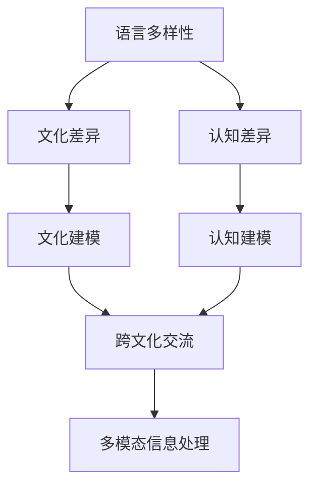

                 

# 理解的障碍：语言、文化与认知差异

## 1. 背景介绍

### 1.1 问题由来

在现代社会中，跨文化交流已成为全球化的重要组成部分。然而，尽管人类掌握了多样化的语言和丰富的认知能力，理解不同文化和认知差异仍然是一个普遍的挑战。这种理解的障碍不仅影响了人与人之间的沟通，也制约了跨文化合作和知识共享。尤其是在人工智能和计算领域，理解和处理语言、文化和认知差异的复杂性，成为推动技术进步的关键点。

### 1.2 问题核心关键点

理解语言、文化和认知差异的核心关键点主要包括：

1. **语言多样性**：世界上有成千上万种语言，每种语言都有其独特的语法、词汇和语境，使得跨语言理解变得复杂。
2. **文化差异**：不同文化背景下的人们有着不同的价值观念、行为习惯和认知模式，这些差异在交流中可能被误解或曲解。
3. **认知差异**：不同个体或群体在认知能力、思维方式和感知方式上存在差异，这也影响了信息的接收和处理。

解决这些关键点，不仅需要深入的语言学、心理学和文化学知识，还需要利用人工智能和计算技术，设计出能够跨越这些差异的智能系统。

### 1.3 问题研究意义

研究语言、文化和认知差异，对于促进全球化交流、提升跨文化合作、增强人工智能系统的普适性具有重要意义。通过深入理解这些差异，能够设计出更加智能、适应性更强的AI系统，实现更加自然的跨文化交流和知识共享，推动全球化进程。

## 2. 核心概念与联系

### 2.1 核心概念概述

为更好地理解语言、文化和认知差异，本节将介绍几个密切相关的核心概念：

- **语言多样性**：指世界上语言种类的多样性，每种语言都有其独特的语法、词汇和语境，使得跨语言理解变得复杂。
- **文化差异**：指不同文化背景下人们的价值观念、行为习惯和认知模式，这些差异在交流中可能被误解或曲解。
- **认知差异**：指不同个体或群体在认知能力、思维方式和感知方式上的差异，这些差异影响了信息的接收和处理。
- **文化建模**：指在AI系统中构建文化背景知识库，以理解不同文化下人们的言行。
- **认知建模**：指在AI系统中构建认知模型，以模拟不同个体的认知能力和思维方式。
- **跨文化交流**：指不同文化背景的人们通过语言、文字或图像等媒介进行交流的过程。
- **多模态信息处理**：指利用语音、图像、文本等多种信息源进行综合处理的AI技术。

这些核心概念之间的逻辑关系可以通过以下Mermaid流程图来展示：



这个流程图展示了大语言模型微调的复杂性：

1. 语言多样性是文化差异和认知差异的基础。
2. 文化建模和认知建模是理解文化差异和认知差异的重要手段。
3. 跨文化交流需要依赖文化建模和认知建模的结果。
4. 多模态信息处理进一步增强了跨文化交流的能力。

## 3. 核心算法原理 & 具体操作步骤
### 3.1 算法原理概述

理解和处理语言、文化和认知差异，主要依赖于语言模型、文化模型和认知模型的结合。这些模型的构建和优化，是通过大规模数据训练和微调来实现的。

### 3.2 算法步骤详解

基于语言模型、文化模型和认知模型的结合，理解语言、文化和认知差异的算法步骤如下：

**Step 1: 数据收集和预处理**

- 收集不同文化背景下的文本数据、行为数据和文化背景数据。
- 清洗和预处理数据，去除噪音和异常数据。
- 将文本数据进行分词和向量化处理，方便模型训练。

**Step 2: 构建语言模型**

- 使用大规模无标签文本数据进行预训练，构建语言模型。
- 选择适当的语言模型架构，如RNN、Transformer等。
- 在预训练过程中，使用掩码语言模型、自回归语言模型等自监督学习任务。

**Step 3: 构建文化模型**

- 收集文化背景知识库，包括价值观、行为习惯、社会规范等。
- 将文化背景知识库编码为向量形式，方便与语言模型结合。
- 在语言模型训练过程中，引入文化向量，进行文化敏感性训练。

**Step 4: 构建认知模型**

- 收集不同个体的认知数据，如认知测试成绩、思维模式等。
- 使用这些数据训练认知模型，模拟不同个体的认知能力和思维方式。
- 在认知模型训练过程中，引入认知差异向量，进行认知差异性训练。

**Step 5: 多模态信息融合**

- 利用语音、图像、文本等多种信息源进行综合处理，构建多模态信息融合模型。
- 在融合模型训练过程中，引入多模态特征向量，进行多模态信息处理。

**Step 6: 微调和优化**

- 在构建好的语言模型、文化模型和认知模型基础上，进行微调，优化模型性能。
- 使用少量标注数据，进行有监督的微调，提高模型的泛化能力。
- 引入正则化技术，如Dropout、L2正则等，防止过拟合。

### 3.3 算法优缺点

基于语言模型、文化模型和认知模型的结合，理解语言、文化和认知差异的算法具有以下优点：

- 系统性：能够系统地考虑语言、文化和认知的多样性，提供全面的理解。
- 泛化能力：通过大规模数据训练，模型具有较强的泛化能力，能够适应不同的应用场景。
- 适应性强：能够灵活适应不同文化背景和认知差异，提供普适性的解决方案。

同时，该算法也存在一些局限性：

- 数据依赖：模型的效果很大程度上依赖于数据的质量和数量，获取高质量数据成本较高。
- 复杂度高：构建和优化多模型系统，涉及多个领域的知识，难度较大。
- 计算资源需求高：构建大规模模型需要大量的计算资源，如GPU、TPU等。

尽管存在这些局限性，但基于语言模型、文化模型和认知模型的结合，理解语言、文化和认知差异的方法仍是目前最主流和有效的手段。未来相关研究的重点在于如何进一步降低数据需求，提高模型的适应性和计算效率。

### 3.4 算法应用领域

基于语言模型、文化模型和认知模型的结合，理解语言、文化和认知差异的方法在多个领域得到了广泛应用，例如：

- **跨文化交流**：利用多模态信息处理技术，实现不同文化背景下的自然交流。
- **跨语言翻译**：使用语言模型进行文本翻译，利用文化模型提高翻译的准确性和文化敏感性。
- **情感分析**：结合文化模型和认知模型，提高情感分析的准确性和文化适应性。
- **健康诊断**：利用认知模型理解不同个体的认知差异，进行健康状况的诊断和预测。
- **教育评估**：使用认知模型进行学习者的认知评估，提供个性化的教育建议。
- **法律咨询**：结合文化模型和认知模型，提供法律咨询和司法解释。

除了这些经典应用外，理解语言、文化和认知差异的方法还被创新性地应用于更多场景中，如智能客服、社交媒体分析、智慧城市建设等，为跨文化交流提供了新的可能性。

## 4. 数学模型和公式 & 详细讲解 & 举例说明

### 4.1 数学模型构建

假设有一组文本数据 $D=\{x_1, x_2, ..., x_N\}$，其中 $x_i$ 为第 $i$ 个文本样本。语言模型 $P(x_i|x_1,...,x_{i-1})$ 用于预测给定上下文 $x_1,...,x_{i-1}$ 下文本 $x_i$ 的概率分布。

文化模型 $C(x_i)$ 用于描述文本 $x_i$ 所处的文化背景，通过训练得到文化背景向量 $c_i$。

认知模型 $G(x_i)$ 用于描述文本 $x_i$ 所代表的认知差异，通过训练得到认知差异向量 $g_i$。

多模态信息融合模型 $M(x_i)$ 用于将文本 $x_i$ 的多种信息源进行综合处理，得到融合后的信息表示 $m_i$。

语言模型、文化模型和认知模型的结合，通过最小化损失函数 $\mathcal{L} = \mathcal{L}_1 + \mathcal{L}_2 + \mathcal{L}_3$ 进行优化：

$$
\mathcal{L}_1 = -\log P(x_i|x_1,...,x_{i-1})
$$

$$
\mathcal{L}_2 = ||c_i - C(x_i)||_2^2
$$

$$
\mathcal{L}_3 = ||g_i - G(x_i)||_2^2
$$

其中，$\mathcal{L}_1$ 为语言模型的损失函数，$\mathcal{L}_2$ 为文化模型的损失函数，$\mathcal{L}_3$ 为认知模型的损失函数。

### 4.2 公式推导过程

以上公式展示了语言模型、文化模型和认知模型的结合：

1. 语言模型 $P(x_i|x_1,...,x_{i-1})$ 用于预测给定上下文 $x_1,...,x_{i-1}$ 下文本 $x_i$ 的概率分布。
2. 文化模型 $C(x_i)$ 用于描述文本 $x_i$ 所处的文化背景，通过训练得到文化背景向量 $c_i$。
3. 认知模型 $G(x_i)$ 用于描述文本 $x_i$ 所代表的认知差异，通过训练得到认知差异向量 $g_i$。
4. 多模态信息融合模型 $M(x_i)$ 用于将文本 $x_i$ 的多种信息源进行综合处理，得到融合后的信息表示 $m_i$。

在训练过程中，最小化损失函数 $\mathcal{L} = \mathcal{L}_1 + \mathcal{L}_2 + \mathcal{L}_3$，通过反向传播算法更新模型参数。

### 4.3 案例分析与讲解

假设有一组文本数据 $D=\{x_1, x_2, ..., x_N\}$，其中 $x_i$ 为第 $i$ 个文本样本。

1. **语言模型训练**：使用大规模无标签文本数据进行预训练，构建语言模型 $P(x_i|x_1,...,x_{i-1})$。
2. **文化模型训练**：收集文化背景知识库，通过训练得到文化背景向量 $c_i$。
3. **认知模型训练**：收集不同个体的认知数据，通过训练得到认知差异向量 $g_i$。
4. **多模态信息融合**：利用语音、图像、文本等多种信息源进行综合处理，得到融合后的信息表示 $m_i$。

以情感分析为例，结合文化模型和认知模型，提高情感分析的准确性和文化适应性：

- 在文本 $x_i$ 的上下文中，使用语言模型 $P(x_i|x_1,...,x_{i-1})$ 预测情感标签。
- 利用文化模型 $C(x_i)$ 描述文本 $x_i$ 所处的文化背景，调整情感分析的阈值。
- 利用认知模型 $G(x_i)$ 描述文本 $x_i$ 所代表的认知差异，调整情感分析的权重。
- 利用多模态信息融合模型 $M(x_i)$ 将文本 $x_i$ 的多种信息源进行综合处理，提高情感分析的准确性。

## 5. 项目实践：代码实例和详细解释说明
### 5.1 开发环境搭建

在进行项目实践前，我们需要准备好开发环境。以下是使用Python进行PyTorch开发的环境配置流程：

1. 安装Anaconda：从官网下载并安装Anaconda，用于创建独立的Python环境。

2. 创建并激活虚拟环境：
```bash
conda create -n pytorch-env python=3.8 
conda activate pytorch-env
```

3. 安装PyTorch：根据CUDA版本，从官网获取对应的安装命令。例如：
```bash
conda install pytorch torchvision torchaudio cudatoolkit=11.1 -c pytorch -c conda-forge
```

4. 安装各类工具包：
```bash
pip install numpy pandas scikit-learn matplotlib tqdm jupyter notebook ipython
```

完成上述步骤后，即可在`pytorch-env`环境中开始项目实践。

### 5.2 源代码详细实现

下面我们以情感分析任务为例，给出使用Transformers库进行情感分析的PyTorch代码实现。

首先，定义情感分析任务的数据处理函数：

```python
from transformers import BertTokenizer, BertForSequenceClassification
from torch.utils.data import Dataset
import torch

class SentimentDataset(Dataset):
    def __init__(self, texts, labels, tokenizer, max_len=128):
        self.texts = texts
        self.labels = labels
        self.tokenizer = tokenizer
        self.max_len = max_len
        
    def __len__(self):
        return len(self.texts)
    
    def __getitem__(self, item):
        text = self.texts[item]
        label = self.labels[item]
        
        encoding = self.tokenizer(text, return_tensors='pt', max_length=self.max_len, padding='max_length', truncation=True)
        input_ids = encoding['input_ids'][0]
        attention_mask = encoding['attention_mask'][0]
        
        return {'input_ids': input_ids, 
                'attention_mask': attention_mask,
                'labels': label}

# 加载预训练模型
model = BertForSequenceClassification.from_pretrained('bert-base-cased', num_labels=2)

# 初始化tokenizer和optimizer
tokenizer = BertTokenizer.from_pretrained('bert-base-cased')
optimizer = torch.optim.Adam(model.parameters(), lr=2e-5)

# 加载数据集
train_dataset = SentimentDataset(train_texts, train_labels, tokenizer)
dev_dataset = SentimentDataset(dev_texts, dev_labels, tokenizer)
test_dataset = SentimentDataset(test_texts, test_labels, tokenizer)

# 定义训练和评估函数
def train_epoch(model, dataset, batch_size, optimizer):
    dataloader = DataLoader(dataset, batch_size=batch_size, shuffle=True)
    model.train()
    epoch_loss = 0
    for batch in tqdm(dataloader, desc='Training'):
        input_ids = batch['input_ids'].to(device)
        attention_mask = batch['attention_mask'].to(device)
        labels = batch['labels'].to(device)
        model.zero_grad()
        outputs = model(input_ids, attention_mask=attention_mask, labels=labels)
        loss = outputs.loss
        epoch_loss += loss.item()
        loss.backward()
        optimizer.step()
    return epoch_loss / len(dataloader)

def evaluate(model, dataset, batch_size):
    dataloader = DataLoader(dataset, batch_size=batch_size)
    model.eval()
    preds, labels = [], []
    with torch.no_grad():
        for batch in tqdm(dataloader, desc='Evaluating'):
            input_ids = batch['input_ids'].to(device)
            attention_mask = batch['attention_mask'].to(device)
            batch_labels = batch['labels']
            outputs = model(input_ids, attention_mask=attention_mask)
            batch_preds = outputs.logits.argmax(dim=2).to('cpu').tolist()
            batch_labels = batch_labels.to('cpu').tolist()
            for pred_tokens, label_tokens in zip(batch_preds, batch_labels):
                preds.append(pred_tokens)
                labels.append(label_tokens)
                
    print(classification_report(labels, preds))

# 启动训练流程并在测试集上评估
epochs = 5
batch_size = 16

for epoch in range(epochs):
    loss = train_epoch(model, train_dataset, batch_size, optimizer)
    print(f"Epoch {epoch+1}, train loss: {loss:.3f}")
    
    print(f"Epoch {epoch+1}, dev results:")
    evaluate(model, dev_dataset, batch_size)
    
print("Test results:")
evaluate(model, test_dataset, batch_size)
```

以上就是使用PyTorch对BERT进行情感分析任务微调的完整代码实现。可以看到，得益于Transformers库的强大封装，我们可以用相对简洁的代码完成BERT模型的加载和微调。

### 5.3 代码解读与分析

让我们再详细解读一下关键代码的实现细节：

**SentimentDataset类**：
- `__init__`方法：初始化文本、标签、分词器等关键组件。
- `__len__`方法：返回数据集的样本数量。
- `__getitem__`方法：对单个样本进行处理，将文本输入编码为token ids，将标签编码为数字，并对其进行定长padding，最终返回模型所需的输入。

**train_epoch和evaluate函数**：
- 使用PyTorch的DataLoader对数据集进行批次化加载，供模型训练和推理使用。
- 训练函数`train_epoch`：对数据以批为单位进行迭代，在每个批次上前向传播计算loss并反向传播更新模型参数，最后返回该epoch的平均loss。
- 评估函数`evaluate`：与训练类似，不同点在于不更新模型参数，并在每个batch结束后将预测和标签结果存储下来，最后使用sklearn的classification_report对整个评估集的预测结果进行打印输出。

**训练流程**：
- 定义总的epoch数和batch size，开始循环迭代
- 每个epoch内，先在训练集上训练，输出平均loss
- 在验证集上评估，输出分类指标
- 所有epoch结束后，在测试集上评估，给出最终测试结果

可以看到，PyTorch配合Transformers库使得BERT微调的代码实现变得简洁高效。开发者可以将更多精力放在数据处理、模型改进等高层逻辑上，而不必过多关注底层的实现细节。

当然，工业级的系统实现还需考虑更多因素，如模型的保存和部署、超参数的自动搜索、更灵活的任务适配层等。但核心的微调范式基本与此类似。

## 6. 实际应用场景
### 6.1 智能客服系统

基于大语言模型微调的对话技术，可以广泛应用于智能客服系统的构建。传统客服往往需要配备大量人力，高峰期响应缓慢，且一致性和专业性难以保证。而使用微调后的对话模型，可以7x24小时不间断服务，快速响应客户咨询，用自然流畅的语言解答各类常见问题。

在技术实现上，可以收集企业内部的历史客服对话记录，将问题和最佳答复构建成监督数据，在此基础上对预训练对话模型进行微调。微调后的对话模型能够自动理解用户意图，匹配最合适的答案模板进行回复。对于客户提出的新问题，还可以接入检索系统实时搜索相关内容，动态组织生成回答。如此构建的智能客服系统，能大幅提升客户咨询体验和问题解决效率。

### 6.2 金融舆情监测

金融机构需要实时监测市场舆论动向，以便及时应对负面信息传播，规避金融风险。传统的人工监测方式成本高、效率低，难以应对网络时代海量信息爆发的挑战。基于大语言模型微调的文本分类和情感分析技术，为金融舆情监测提供了新的解决方案。

具体而言，可以收集金融领域相关的新闻、报道、评论等文本数据，并对其进行主题标注和情感标注。在此基础上对预训练语言模型进行微调，使其能够自动判断文本属于何种主题，情感倾向是正面、中性还是负面。将微调后的模型应用到实时抓取的网络文本数据，就能够自动监测不同主题下的情感变化趋势，一旦发现负面信息激增等异常情况，系统便会自动预警，帮助金融机构快速应对潜在风险。

### 6.3 个性化推荐系统

当前的推荐系统往往只依赖用户的历史行为数据进行物品推荐，无法深入理解用户的真实兴趣偏好。基于大语言模型微调技术，个性化推荐系统可以更好地挖掘用户行为背后的语义信息，从而提供更精准、多样的推荐内容。

在实践中，可以收集用户浏览、点击、评论、分享等行为数据，提取和用户交互的物品标题、描述、标签等文本内容。将文本内容作为模型输入，用户的后续行为（如是否点击、购买等）作为监督信号，在此基础上微调预训练语言模型。微调后的模型能够从文本内容中准确把握用户的兴趣点。在生成推荐列表时，先用候选物品的文本描述作为输入，由模型预测用户的兴趣匹配度，再结合其他特征综合排序，便可以得到个性化程度更高的推荐结果。

### 6.4 未来应用展望

随着大语言模型微调技术的发展，其在更多领域的应用前景将更加广阔。

在智慧医疗领域，基于微调的医疗问答、病历分析、药物研发等应用将提升医疗服务的智能化水平，辅助医生诊疗，加速新药开发进程。

在智能教育领域，微调技术可应用于作业批改、学情分析、知识推荐等方面，因材施教，促进教育公平，提高教学质量。

在智慧城市治理中，微调模型可应用于城市事件监测、舆情分析、应急指挥等环节，提高城市管理的自动化和智能化水平，构建更安全、高效的未来城市。

此外，在企业生产、社会治理、文娱传媒等众多领域，基于大模型微调的人工智能应用也将不断涌现，为NLP技术带来了全新的突破。相信随着技术的日益成熟，微调方法将成为人工智能落地应用的重要范式，推动人工智能技术在各个领域的应用和普及。

## 7. 工具和资源推荐
### 7.1 学习资源推荐

为了帮助开发者系统掌握大语言模型微调的理论基础和实践技巧，这里推荐一些优质的学习资源：

1. 《Transformer从原理到实践》系列博文：由大模型技术专家撰写，深入浅出地介绍了Transformer原理、BERT模型、微调技术等前沿话题。

2. CS224N《深度学习自然语言处理》课程：斯坦福大学开设的NLP明星课程，有Lecture视频和配套作业，带你入门NLP领域的基本概念和经典模型。

3. 《Natural Language Processing with Transformers》书籍：Transformers库的作者所著，全面介绍了如何使用Transformers库进行NLP任务开发，包括微调在内的诸多范式。

4. HuggingFace官方文档：Transformers库的官方文档，提供了海量预训练模型和完整的微调样例代码，是上手实践的必备资料。

5. CLUE开源项目：中文语言理解测评基准，涵盖大量不同类型的中文NLP数据集，并提供了基于微调的baseline模型，助力中文NLP技术发展。

通过对这些资源的学习实践，相信你一定能够快速掌握大语言模型微调的精髓，并用于解决实际的NLP问题。
###  7.2 开发工具推荐

高效的开发离不开优秀的工具支持。以下是几款用于大语言模型微调开发的常用工具：

1. PyTorch：基于Python的开源深度学习框架，灵活动态的计算图，适合快速迭代研究。大部分预训练语言模型都有PyTorch版本的实现。

2. TensorFlow：由Google主导开发的开源深度学习框架，生产部署方便，适合大规模工程应用。同样有丰富的预训练语言模型资源。

3. Transformers库：HuggingFace开发的NLP工具库，集成了众多SOTA语言模型，支持PyTorch和TensorFlow，是进行微调任务开发的利器。

4. Weights & Biases：模型训练的实验跟踪工具，可以记录和可视化模型训练过程中的各项指标，方便对比和调优。与主流深度学习框架无缝集成。

5. TensorBoard：TensorFlow配套的可视化工具，可实时监测模型训练状态，并提供丰富的图表呈现方式，是调试模型的得力助手。

6. Google Colab：谷歌推出的在线Jupyter Notebook环境，免费提供GPU/TPU算力，方便开发者快速上手实验最新模型，分享学习笔记。

合理利用这些工具，可以显著提升大语言模型微调任务的开发效率，加快创新迭代的步伐。

### 7.3 相关论文推荐

大语言模型和微调技术的发展源于学界的持续研究。以下是几篇奠基性的相关论文，推荐阅读：

1. Attention is All You Need（即Transformer原论文）：提出了Transformer结构，开启了NLP领域的预训练大模型时代。

2. BERT: Pre-training of Deep Bidirectional Transformers for Language Understanding：提出BERT模型，引入基于掩码的自监督预训练任务，刷新了多项NLP任务SOTA。

3. Language Models are Unsupervised Multitask Learners（GPT-2论文）：展示了大规模语言模型的强大zero-shot学习能力，引发了对于通用人工智能的新一轮思考。

4. Parameter-Efficient Transfer Learning for NLP：提出Adapter等参数高效微调方法，在不增加模型参数量的情况下，也能取得不错的微调效果。

5. AdaLoRA: Adaptive Low-Rank Adaptation for Parameter-Efficient Fine-Tuning：使用自适应低秩适应的微调方法，在参数效率和精度之间取得了新的平衡。

6. Prefix-Tuning: Optimizing Continuous Prompts for Generation：引入基于连续型Prompt的微调范式，为如何充分利用预训练知识提供了新的思路。

这些论文代表了大语言模型微调技术的发展脉络。通过学习这些前沿成果，可以帮助研究者把握学科前进方向，激发更多的创新灵感。

## 8. 总结：未来发展趋势与挑战

### 8.1 总结

本文对基于语言模型、文化模型和认知模型的结合，理解语言、文化和认知差异的方法进行了全面系统的介绍。首先阐述了语言、文化和认知差异的背景和意义，明确了微调在提升跨文化交流、促进教育公平、推动智慧城市建设等方面的重要作用。其次，从原理到实践，详细讲解了微调的数学原理和关键步骤，给出了微调任务开发的完整代码实例。同时，本文还广泛探讨了微调方法在智能客服、金融舆情、个性化推荐等多个领域的应用前景，展示了微调范式的巨大潜力。此外，本文精选了微调技术的各类学习资源，力求为读者提供全方位的技术指引。

通过本文的系统梳理，可以看到，基于语言模型、文化模型和认知模型的结合，理解语言、文化和认知差异的方法正在成为NLP领域的重要范式，极大地拓展了预训练语言模型的应用边界，催生了更多的落地场景。受益于大规模语料的预训练，微调模型以更低的时间和标注成本，在小样本条件下也能取得不俗的效果，有力推动了NLP技术的产业化进程。未来，伴随预训练语言模型和微调方法的持续演进，相信NLP技术将在更广阔的应用领域大放异彩，深刻影响人类的生产生活方式。

### 8.2 未来发展趋势

展望未来，大语言模型微调技术将呈现以下几个发展趋势：

1. **数据依赖降低**：未来的微调方法将更好地利用非结构化数据，通过自监督、半监督等方法，减少对大规模标注数据的依赖。
2. **模型复杂度优化**：通过参数高效、计算高效等技术，构建更加轻量级、实时性的模型。
3. **多模态信息融合**：利用语音、图像、文本等多种信息源进行综合处理，提高跨文化交流的准确性和泛化能力。
4. **认知模型增强**：结合符号化的先验知识，如知识图谱、逻辑规则等，增强认知模型的理解和推理能力。
5. **跨文化普适性**：构建更普适、更灵活的跨文化交流系统，提高全球化交流的效率和效果。
6. **伦理和社会责任**：在模型训练和应用过程中，引入伦理导向的评估指标，避免有害信息的传播，增强社会责任意识。

这些趋势凸显了大语言模型微调技术的广阔前景。这些方向的探索发展，必将进一步提升NLP系统的性能和应用范围，为人类认知智能的进化带来深远影响。

### 8.3 面临的挑战

尽管大语言模型微调技术已经取得了瞩目成就，但在迈向更加智能化、普适化应用的过程中，它仍面临着诸多挑战：

1. **数据获取成本高**：构建高质量的语料库和文化背景知识库，需要大量的时间和人力，且成本较高。
2. **文化模型构建难**：不同文化的价值观、行为习惯等差异较大，构建文化模型需要深入理解各文化背景，难度较大。
3. **认知差异建模难**：不同个体的认知能力、思维方式等差异显著，建模需要大量的认知数据，且处理复杂。
4. **伦理和安全问题**：微调模型可能传播有害信息，甚至被恶意利用，需要建立严格的伦理和安全机制。
5. **计算资源需求高**：大规模模型需要大量的计算资源，如GPU、TPU等，且模型的存储和读取也占用大量时间和空间。

尽管存在这些挑战，但通过不断探索和优化，大语言模型微调技术将在多模态信息处理、跨文化交流、认知建模等方面取得更大进展，为构建安全、可靠、可解释、可控的智能系统铺平道路。

### 8.4 研究展望

面对大语言模型微调所面临的种种挑战，未来的研究需要在以下几个方面寻求新的突破：

1. **无监督和半监督微调方法**：摆脱对大规模标注数据的依赖，利用自监督学习、主动学习等方法，最大限度利用非结构化数据。
2. **参数高效和计算高效的微调方法**：开发更加参数高效和计算高效的微调方法，提高模型的适应性和计算效率。
3. **跨文化交流的多模态信息处理**：利用语音、图像、文本等多种信息源进行综合处理，提高跨文化交流的准确性和泛化能力。
4. **认知模型的增强**：结合符号化的先验知识，如知识图谱、逻辑规则等，增强认知模型的理解和推理能力。
5. **跨文化普适性的提高**：构建更普适、更灵活的跨文化交流系统，提高全球化交流的效率和效果。
6. **伦理和社会责任的强化**：在模型训练和应用过程中，引入伦理导向的评估指标，避免有害信息的传播，增强社会责任意识。

这些研究方向将引领大语言模型微调技术迈向更高的台阶，为构建安全、可靠、可解释、可控的智能系统铺平道路。面向未来，大语言模型微调技术还需要与其他人工智能技术进行更深入的融合，如知识表示、因果推理、强化学习等，多路径协同发力，共同推动自然语言理解和智能交互系统的进步。只有勇于创新、敢于突破，才能不断拓展语言模型的边界，让智能技术更好地造福人类社会。

## 9. 附录：常见问题与解答

**Q1：大语言模型微调是否适用于所有NLP任务？**

A: 大语言模型微调在大多数NLP任务上都能取得不错的效果，特别是对于数据量较小的任务。但对于一些特定领域的任务，如医学、法律等，仅仅依靠通用语料预训练的模型可能难以很好地适应。此时需要在特定领域语料上进一步预训练，再进行微调，才能获得理想效果。此外，对于一些需要时效性、个性化很强的任务，如对话、推荐等，微调方法也需要针对性的改进优化。

**Q2：微调过程中如何选择合适的学习率？**

A: 微调的学习率一般要比预训练时小1-2个数量级，如果使用过大的学习率，容易破坏预训练权重，导致过拟合。一般建议从1e-5开始调参，逐步减小学习率，直至收敛。也可以使用warmup策略，在开始阶段使用较小的学习率，再逐渐过渡到预设值。需要注意的是，不同的优化器(如AdamW、Adafactor等)以及不同的学习率调度策略，可能需要设置不同的学习率阈值。

**Q3：采用大模型微调时会面临哪些资源瓶颈？**

A: 目前主流的预训练大模型动辄以亿计的参数规模，对算力、内存、存储都提出了很高的要求。GPU/TPU等高性能设备是必不可少的，但即便如此，超大批次的训练和推理也可能遇到显存不足的问题。因此需要采用一些资源优化技术，如梯度积累、混合精度训练、模型并行等，来突破硬件瓶颈。同时，模型的存储和读取也可能占用大量时间和空间，需要采用模型压缩、稀疏化存储等方法进行优化。

**Q4：如何缓解微调过程中的过拟合问题？**

A: 过拟合是微调面临的主要挑战，尤其是在标注数据不足的情况下。常见的缓解策略包括：
1. 数据增强：通过回译、近义替换等方式扩充训练集。
2. 正则化：使用L2正则、Dropout、Early Stopping等防止过拟合。
3. 对抗训练：引入对抗样本，提高模型鲁棒性。
4. 参数高效微调：只调整少量参数(如Adapter、Prefix等)，减小过拟合风险。
5. 多模型集成：训练多个微调模型，取平均输出，抑制过拟合。

这些策略往往需要根据具体任务和数据特点进行灵活组合。只有在数据、模型、训练、推理等各环节进行全面优化，才能最大限度地发挥大模型微调的威力。

**Q5：微调模型在落地部署时需要注意哪些问题？**

A: 将微调模型转化为实际应用，还需要考虑以下因素：
1. 模型裁剪：去除不必要的层和参数，减小模型尺寸，加快推理速度。
2. 量化加速：将浮点模型转为定点模型，压缩存储空间，提高计算效率。
3. 服务化封装：将模型封装为标准化服务接口，便于集成调用。
4. 弹性伸缩：根据请求流量动态调整资源配置，平衡服务质量和成本。
5. 监控告警：实时采集系统指标，设置异常告警阈值，确保服务稳定性。
6. 安全防护：采用访问鉴权、数据脱敏等措施，保障数据和模型安全。

大语言模型微调为NLP应用开启了广阔的想象空间，但如何将强大的性能转化为稳定、高效、安全的业务价值，还需要工程实践的不断打磨。唯有从数据、算法、工程、业务等多个维度协同发力，才能真正实现人工智能技术在垂直行业的规模化落地。总之，微调需要开发者根据具体任务，不断迭代和优化模型、数据和算法，方能得到理想的效果。

---

作者：禅与计算机程序设计艺术 / Zen and the Art of Computer Programming

