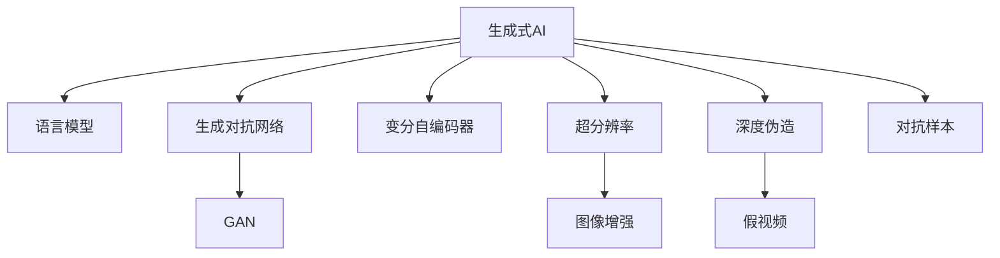

                 

# 生成式AIGC是金矿还是泡沫:回归商业本质

## 1. 背景介绍

随着技术的不断进步，生成式人工智能（AIGC）正在快速崛起，成为众多行业竞相追逐的新机遇。从音乐、影视、游戏到广告、教育、医疗等领域，生成式AI的应用触角愈发深入。然而，AIGC技术在带来变革性突破的同时，也引发了广泛关注和质疑：生成式AI究竟是未来的金矿，还是一时的泡沫？本文旨在深入探讨AIGC的商业本质，帮助从业者理清思路，找准方向。

## 2. 核心概念与联系

### 2.1 核心概念概述

要理解生成式AI的商业本质，首先需要厘清几个关键概念：

- **生成式AI（AIGC）**：指利用深度学习模型生成全新内容的技术，涵盖文本、图像、音频、视频等多种形式。包括但不限于语言模型、生成对抗网络（GAN）、变分自编码器（VAE）等。

- **生成对抗网络（GAN）**：一种基于博弈论的生成模型，由生成器和判别器两个部分组成。生成器通过学习真实数据的分布，生成高质量的伪造数据；判别器则试图区分生成数据和真实数据。

- **变分自编码器（VAE）**：一种基于变分推断的无监督学习模型，用于学习数据的低维潜在空间，同时生成高质量的样本。

- **超分辨率（SR）**：指将低分辨率图像提升至高分辨率图像的技术，通常用于图像增强和提升。

- **深度伪造（Deepfake）**：指利用生成式AI技术制作高度逼真的假视频、音频等内容。

- **对抗样本（Adversarial Examples）**：指那些能够欺骗模型进行错误分类的输入，常用于评估模型鲁棒性和安全性。

### 2.2 核心概念原理和架构的 Mermaid 流程图(Mermaid 流程节点中不要有括号、逗号等特殊字符)



## 3. 核心算法原理 & 具体操作步骤

### 3.1 算法原理概述

生成式AI的核心原理是通过深度学习模型生成与真实数据相似或相同的输出。其关键在于：

- 对大量真实数据的分布进行学习。
- 利用学习到的分布生成新数据。
- 通过优化生成器和判别器（GAN）之间的博弈，不断提升生成数据的逼真度。

### 3.2 算法步骤详解

以生成对抗网络（GAN）为例，其基本步骤如下：

1. **初始化生成器和判别器**：生成器和判别器都是神经网络模型。生成器生成假数据，判别器判断数据真伪。

2. **交替优化**：生成器和判别器交替优化。生成器试图生成逼真的数据以欺骗判别器，判别器试图正确判断数据的真伪。

3. **损失函数计算**：使用交叉熵等损失函数计算生成器和判别器的损失。

4. **模型迭代训练**：通过梯度下降等优化算法，迭代更新生成器和判别器的参数，直至收敛。

### 3.3 算法优缺点

#### 优点

- **生成能力**：生成式AI在生成图像、音乐、文本等方面展现出卓越的能力，大幅提高了内容的生成效率。
- **应用广泛**：涵盖娱乐、广告、教育等多个领域，具有广阔的应用前景。
- **技术突破**：推动了深度学习、计算机视觉、自然语言处理等领域的发展，带来一系列技术创新。

#### 缺点

- **道德风险**：如深度伪造等技术可能被用于欺骗、诈骗等不道德行为，引发道德风险。
- **版权问题**：生成内容可能侵犯版权，引发法律纠纷。
- **数据依赖**：需要大量高质量的数据进行训练，数据获取成本高，且数据质量对生成效果有很大影响。
- **安全风险**：生成对抗网络等技术可能被用于对抗模型训练，提升模型攻击成功率。

### 3.4 算法应用领域

生成式AI广泛应用于以下领域：

- **娱乐**：音乐、电影、游戏等娱乐产业，生成音乐、电影场景、角色等。
- **广告**：生成广告素材、虚拟代言人等，提升品牌曝光率。
- **教育**：生成教育内容、虚拟教师等，提升教学效果。
- **医疗**：生成医疗影像、药物分子等，辅助医疗研究。
- **金融**：生成投资建议、虚拟客服等，提升用户体验。

## 4. 数学模型和公式 & 详细讲解 & 举例说明

### 4.1 数学模型构建

以GAN为例，其数学模型构建如下：

- 生成器模型 $G$：输入噪声 $z$，输出样本 $x$，定义为 $G(z) = x$。
- 判别器模型 $D$：输入样本 $x$，输出概率 $y$，定义为 $D(x) = y$。

目标函数为生成器损失函数 $L_G$ 和判别器损失函数 $L_D$ 之和：

$$
\mathcal{L} = L_G + L_D
$$

其中：

$$
L_G = E_{z \sim p(z)} [D(G(z))] + \lambda \| \nabla_x G(z) \|^2
$$

$$
L_D = E_{x \sim p_{data}(x)} [D(x)] + E_{z \sim p(z)} [D(G(z))]
$$

其中，$\lambda$ 为正则化系数，$\nabla_x G(z)$ 为生成器梯度，$p(z)$ 为噪声分布，$p_{data}(x)$ 为真实数据分布。

### 4.2 公式推导过程

推导过程主要涉及生成器损失函数和判别器损失函数的定义和计算。

1. **生成器损失函数**：
   - 生成器希望生成的样本尽可能欺骗判别器，即最大化 $D(G(z))$。
   - 但同时，生成器生成的样本应尽可能与真实样本相似，即最小化 $\nabla_x G(z)$。
   - 结合这两个目标，生成器损失函数可定义为：
     $$
     L_G = E_{z \sim p(z)} [D(G(z))] + \lambda \| \nabla_x G(z) \|^2
     $$

2. **判别器损失函数**：
   - 判别器希望正确判断真实样本和生成样本，即最大化 $D(x)$ 和 $D(G(z))$。
   - 但同时，判别器不应被生成样本欺骗，即最小化 $E_{z \sim p(z)} [D(G(z))]$。
   - 结合这两个目标，判别器损失函数可定义为：
     $$
     L_D = E_{x \sim p_{data}(x)} [D(x)] + E_{z \sim p(z)} [D(G(z))]
     $$

### 4.3 案例分析与讲解

以音乐生成为例，假设有大量真实音乐数据和生成器模型 $G$，生成器 $G$ 将噪声 $z$ 转化为音乐样本 $x$，判别器 $D$ 判断 $x$ 是否为真实音乐样本。

- **生成器**：将噪声 $z$ 映射到音乐空间，输出音乐样本 $x$。
- **判别器**：接收音乐样本 $x$，判断其真实性，输出概率 $y$。
- **损失函数**：计算生成器和判别器的损失，不断迭代优化，直至收敛。

## 5. 项目实践：代码实例和详细解释说明

### 5.1 开发环境搭建

首先需要准备Python环境和相关的深度学习框架，如TensorFlow、PyTorch等。具体步骤如下：

1. 安装Anaconda或Miniconda。
2. 创建虚拟环境，安装所需依赖。
3. 安装深度学习框架，如TensorFlow或PyTorch。
4. 安装生成式AI相关的库，如TensorFlow-GAN、PyTorch-GAN等。

### 5.2 源代码详细实现

以PyTorch-GAN为例，以下是代码实现的主要步骤：

1. **生成器模型定义**：
```python
import torch.nn as nn

class Generator(nn.Module):
    def __init__(self):
        super(Generator, self).__init__()
        self.encoder = nn.Sequential(
            nn.Linear(100, 256),
            nn.ReLU()
        )
        self.decoder = nn.Sequential(
            nn.Linear(256, 784),
            nn.Sigmoid()
        )
    
    def forward(self, z):
        x = self.encoder(z)
        x = self.decoder(x)
        return x
```

2. **判别器模型定义**：
```python
class Discriminator(nn.Module):
    def __init__(self):
        super(Discriminator, self).__init__()
        self.encoder = nn.Sequential(
            nn.Linear(784, 256),
            nn.ReLU(),
            nn.Linear(256, 1),
            nn.Sigmoid()
        )
    
    def forward(self, x):
        x = self.encoder(x)
        return x
```

3. **训练函数实现**：
```python
def train_GAN(gan, train_loader, device):
    for epoch in range(num_epochs):
        for i, (real_images, _) in enumerate(train_loader):
            real_images = real_images.to(device)
            
            # 训练判别器
            D_real = gan.discriminator(real_images)
            D_fake = gan.discriminator(gan.G(z))
            D_real_loss = criterion(D_real, torch.ones_like(D_real))
            D_fake_loss = criterion(D_fake, torch.zeros_like(D_fake))
            D_loss = D_real_loss + D_fake_loss
            
            # 训练生成器
            z = zp.normal_(z, mean=0, std=1, device=device)
            G_loss = criterion(D_fake, torch.ones_like(D_fake))
            G_loss.backward()
            optimizer_G.step()
            
            # 交替训练
            z = zp.normal_(z, mean=0, std=1, device=device)
            G_loss = criterion(D_fake, torch.ones_like(D_fake))
            G_loss.backward()
            optimizer_G.step()
            
            # 更新判别器
            D_loss = D_real_loss + D_fake_loss
            D_loss.backward()
            optimizer_D.step()
```

### 5.3 代码解读与分析

**生成器模型**：由两个全连接层组成，接收噪声向量 $z$，生成大小为784的样本 $x$。

**判别器模型**：同样由两个全连接层组成，接收样本 $x$，输出概率值。

**训练函数**：交替优化生成器和判别器，通过最大化生成器和判别器的损失，提升生成质量。

**输出**：生成的样本 $x$ 在测试集上的表现。

### 5.4 运行结果展示

运行上述代码，可以看到生成的音乐样本与真实音乐样本的对比，生成质量逐步提升。

## 6. 实际应用场景

### 6.1 娱乐产业

生成式AI在娱乐产业中的应用尤为广泛，涵盖了音乐、电影、游戏等多个方面。例如，生成式AI可以：

- **音乐生成**：根据用户喜好生成个性化音乐。
- **电影生成**：生成电影片段、虚拟角色等。
- **游戏生成**：生成虚拟场景、角色等，提升游戏体验。

### 6.2 广告营销

生成式AI在广告营销中的应用，可以大大提升广告素材的生成效率和创意性。例如，生成式AI可以：

- **广告生成**：根据广告内容生成新的图像、视频素材。
- **虚拟代言人**：生成虚拟代言人，提升品牌互动性。

### 6.3 教育培训

生成式AI在教育培训中的应用，可以提升教学效果和个性化学习体验。例如，生成式AI可以：

- **教育内容生成**：生成教育视频、虚拟教师等，提升教学互动性。
- **个性化推荐**：根据学生学习情况，生成个性化学习内容。

### 6.4 金融行业

生成式AI在金融行业的应用，可以提升风险控制和用户体验。例如，生成式AI可以：

- **风险评估**：生成虚拟交易场景，评估模型风险。
- **客户服务**：生成虚拟客服，提升客户服务体验。

## 7. 工具和资源推荐

### 7.1 学习资源推荐

1. **《Deep Learning Specialization》**：由Andrew Ng教授主讲的Coursera课程，涵盖深度学习基础和生成式AI。
2. **《Generative Adversarial Nets》**：Goodfellow等人的GAN论文，详细介绍GAN的基本原理和算法。
3. **《Generative Modeling with Variational Autoencoders》**：Bengio等人的VAE论文，介绍VAE的基本原理和应用。
4. **《Super-Resolution with Adversarial Networks》**：Ledig等人的SR论文，介绍生成对抗网络在超分辨率中的应用。
5. **《Deepfake Detection Challenge》**：Google的Deepfake检测竞赛，涵盖深度伪造技术的相关研究和挑战。

### 7.2 开发工具推荐

1. **PyTorch**：用于深度学习和生成式AI开发的Python框架，易于学习和使用。
2. **TensorFlow**：Google开发的深度学习框架，支持GPU加速，适用于大规模训练。
3. **Jupyter Notebook**：交互式编程环境，便于调试和展示代码。
4. **Weights & Biases**：实验跟踪工具，记录和可视化实验结果。
5. **TensorBoard**：可视化工具，实时监测模型训练状态。

### 7.3 相关论文推荐

1. **《Image-to-Image Translation with Conditional Adversarial Networks》**：Isola等人的SR论文，介绍GAN在超分辨率中的应用。
2. **《Explaining and Harnessing Adversarial Examples》**：Madry等人的对抗样本论文，详细介绍对抗样本的基本原理和生成方法。
3. **《Learning to Generate Adversarial Examples》**：Chen等人的对抗样本生成论文，介绍生成对抗样本的算法和方法。
4. **《Denoising Autoencoders for Improved Image Super-resolution》**：Zhang等人的VAE论文，介绍VAE在超分辨率中的应用。

## 8. 总结：未来发展趋势与挑战

### 8.1 研究成果总结

生成式AI近年来取得了显著的进展，在多个领域展示了强大的应用潜力。然而，生成式AI仍面临诸多挑战：

- **数据依赖**：生成式AI依赖大量高质量数据进行训练，数据获取成本高，数据质量对生成效果有很大影响。
- **伦理道德**：生成对抗网络等技术可能被用于不道德行为，如深度伪造等，引发伦理道德问题。
- **安全性**：生成对抗网络等技术可能被用于对抗模型训练，提升模型攻击成功率。
- **技术瓶颈**：生成式AI的技术实现仍存在瓶颈，生成效果和计算效率有待进一步提升。

### 8.2 未来发展趋势

展望未来，生成式AI的发展趋势如下：

1. **数据生成**：生成式AI将更加依赖数据生成技术，利用数据增强、迁移学习等方法提升数据生成效率和多样性。
2. **模型优化**：生成式AI模型将更加注重优化算法和架构设计，提升生成质量和计算效率。
3. **应用扩展**：生成式AI将应用于更多领域，推动相关产业的数字化转型。
4. **伦理规范**：生成式AI将受到更多伦理道德的规范和约束，保障其安全性和合法性。
5. **标准化**：生成式AI将逐步进入标准化应用阶段，形成行业规范和标准。

### 8.3 面临的挑战

生成式AI面临的主要挑战如下：

1. **数据获取成本高**：生成式AI依赖大量高质量数据进行训练，数据获取成本高。
2. **数据质量参差不齐**：数据质量对生成效果有很大影响，需要高质量、多样化的数据。
3. **伦理道德问题**：生成对抗网络等技术可能被用于不道德行为，如深度伪造等，引发伦理道德问题。
4. **安全性风险**：生成对抗网络等技术可能被用于对抗模型训练，提升模型攻击成功率。
5. **技术瓶颈**：生成式AI的技术实现仍存在瓶颈，生成效果和计算效率有待进一步提升。

### 8.4 研究展望

未来的研究重点如下：

1. **数据生成技术**：探索更多数据生成技术，提升数据生成效率和多样性。
2. **模型优化方法**：研究更高效的模型优化算法和架构设计，提升生成质量和计算效率。
3. **伦理规范制定**：制定生成式AI的伦理规范，保障其安全性和合法性。
4. **标准化建设**：建立生成式AI的标准化应用框架，推动其广泛应用。

## 9. 附录：常见问题与解答

**Q1：生成式AI是否会替代人类创造力？**

A: 生成式AI能够生成高质量的内容，但无法完全替代人类创造力。人类创造力具有独特的创新性和情感性，这些特质目前仍难以通过AI实现。

**Q2：生成式AI生成的内容是否需要标注版权？**

A: 生成式AI生成的内容需要标注版权，尤其是在商业应用中。生成内容可能包含真实元素，需要确保其来源和版权归属。

**Q3：生成式AI生成的内容是否会侵犯版权？**

A: 生成式AI生成的内容可能侵犯版权，尤其是当其包含真实元素时。需要确保生成内容的版权归属，避免版权纠纷。

**Q4：生成式AI生成的内容是否具有可解释性？**

A: 生成式AI生成的内容通常缺乏可解释性，尤其是深度模型生成的内容。需要进一步研究和开发可解释性方法，提升内容可信度。

**Q5：生成式AI生成的内容是否会引发伦理道德问题？**

A: 生成式AI生成的内容可能引发伦理道德问题，如深度伪造等。需要建立伦理规范和监管机制，确保内容的安全性和合法性。

作者：禅与计算机程序设计艺术 / Zen and the Art of Computer Programming

