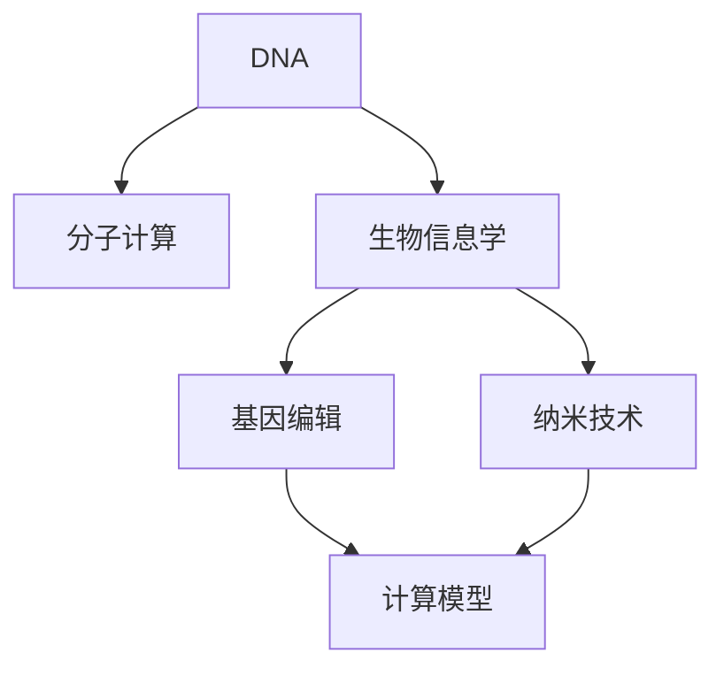

                 

# 生物计算：利用DNA存储和处理信息

> 关键词：DNA存储, 分子计算, 生物信息学, 基因编辑, CRISPR, 纳米技术, 计算模型

## 1. 背景介绍

### 1.1 问题由来

在信息化爆炸的今天，数据存储和处理能力面临着前所未有的挑战。传统的基于电子元件的计算方法已经难以满足日益增长的数据需求。生物计算作为新兴的研究方向，通过利用自然界的生物分子，特别是DNA，来存储和处理信息，为数据存储和处理带来了全新的可能性。DNA因其独特的物理和化学性质，使得其成为生物计算的重要基础。

### 1.2 问题核心关键点

1. **DNA的特性**：DNA分子具有长寿命、高密度、低能耗等特性，可以用于大规模信息的存储。
2. **分子计算**：利用DNA分子的碱基配对原则，可以实现复杂的计算和信息处理。
3. **生物信息学**：通过生物信息学的算法和工具，可以对DNA进行高效的处理和分析。
4. **基因编辑技术**：如CRISPR等基因编辑技术，可以精确修改DNA序列，实现信息的写入和读取。
5. **纳米技术**：纳米级操作技术使得对DNA分子进行精确操作成为可能。

这些核心概念构成了生物计算的基本框架，使得利用DNA进行信息存储和处理成为可能。

### 1.3 问题研究意义

研究生物计算技术，对于拓展数据存储和处理的新途径，实现更高效、更环保的数据管理方式，具有重要意义：

1. **高效存储**：DNA的高密度存储能力，可以大幅降低数据存储成本。
2. **长期保存**：DNA分子的稳定性，使得信息可以长期保存，不受环境因素影响。
3. **低能耗**：DNA计算的生物电子机制，可以在低能耗条件下运行。
4. **新型计算模型**：生物计算提供了一种全新的计算模型，有望解决现有计算方法的不足。
5. **环境友好**：生物计算的环保特性，可以减少对环境的影响。
6. **科学前沿**：生物计算是交叉学科的前沿领域，涉及分子生物学、纳米技术、计算机科学等多个领域，具有广阔的研究前景。

## 2. 核心概念与联系

### 2.1 核心概念概述

为更好地理解生物计算的基础和应用，本节将介绍几个关键概念及其相互联系：

1. **DNA**：脱氧核糖核酸，作为生物分子的基本组成单位，具有存储信息的能力。
2. **分子计算**：利用分子之间的化学反应，进行逻辑运算和信息处理。
3. **生物信息学**：研究生物信息的获取、处理、存储和应用。
4. **基因编辑**：通过修改DNA序列，实现生物分子的精确操作。
5. **纳米技术**：在纳米尺度上进行操作，实现对DNA分子的精确控制。

这些概念之间的逻辑关系可以通过以下Mermaid流程图来展示：



这个流程图展示了DNA存储和处理的各个环节：

1. DNA分子的基本特性，使其适合作为信息存储的介质。
2. 分子计算利用DNA的碱基配对原则，实现信息处理和计算。
3. 生物信息学提供对DNA序列进行分析的算法和工具。
4. 基因编辑技术可以实现对DNA序列的精确修改。
5. 纳米技术提供了对DNA进行精确操作的手段。

这些概念共同构成了生物计算的基础框架，为利用DNA进行信息存储和处理提供了理论和技术支持。

## 3. 核心算法原理 & 具体操作步骤

### 3.1 算法原理概述

生物计算的核心算法原理基于DNA分子的物理和化学特性，特别是其碱基配对和复制机制。DNA分子由四种核苷酸组成，通过碱基之间的氢键配对（A-T、C-G）进行信息的存储和编码。利用这些特性，可以实现数据的存储和计算。

### 3.2 算法步骤详解

1. **数据编码**：将需要存储的数据转化为二进制序列，每个二进制位对应一种核苷酸（A、C、G、T）。例如，0对应A，1对应T。
   
2. **DNA合成**：利用合成技术，根据编码规则将二进制序列转化为DNA分子。这个过程通常通过化学合成或酶促合成完成。
   
3. **DNA存储**：将合成的DNA分子存储于特定的环境中，如玻璃管、微流体芯片等。
   
4. **DNA提取和读取**：当需要读取数据时，利用PCR等技术将DNA分子复制，然后进行序列分析，恢复原始二进制数据。
   
5. **数据解码**：将读取到的二进制数据解码为原始数据。

### 3.3 算法优缺点

利用DNA存储和处理信息的优点包括：

- **高密度存储**：DNA分子密度高，可以在有限的空间内存储大量信息。
- **长期保存**：DNA分子的稳定性，使得信息可以长期保存，不受环境因素影响。
- **低能耗**：DNA计算的生物电子机制，可以在低能耗条件下运行。

同时，DNA计算也存在一些局限性：

- **操作复杂**：DNA的操作需要精密的化学和生物技术，成本较高。
- **读取速度慢**：DNA的读取过程相对较慢，不适合实时数据处理。
- **精确性问题**：DNA操作存在误差，可能影响数据的准确性。

### 3.4 算法应用领域

生物计算技术在多个领域展现了其独特优势：

1. **数据存储**：利用DNA的高密度存储特性，可以大规模存储数据，用于科学数据档案、基因组数据存储等。
2. **生物信息学**：通过DNA分子进行数据编码和计算，可以加速生物信息的处理和分析，如基因测序、基因组编辑等。
3. **医学诊断**：利用DNA分子进行疾病诊断和治疗，如基因检测、个性化医疗等。
4. **环境监测**：通过DNA分子存储环境数据，实现长期监测和数据恢复。
5. **计算模型**：探索基于DNA的计算模型，推动新计算范式的研究。

## 4. 数学模型和公式 & 详细讲解 & 举例说明

### 4.1 数学模型构建

假设我们需要存储二进制序列$S$，其中每个二进制位对应一种核苷酸。设$S = (s_1, s_2, \ldots, s_n)$，$s_i \in \{0, 1\}$。对应的DNA序列为$D = (d_1, d_2, \ldots, d_n)$，$d_i \in \{A, C, G, T\}$。编码规则为$s_i = 0$时，$d_i = A$；$s_i = 1$时，$d_i = T$。

### 4.2 公式推导过程

根据编码规则，可以推导出DNA序列$D$与二进制序列$S$的映射关系：

$$
d_i = \begin{cases}
A & \text{if } s_i = 0 \\
T & \text{if } s_i = 1
\end{cases}
$$

DNA的复制和读取过程可以表示为：

- **复制**：假设初始DNA分子为$D$，复制$k$次，得到$D_k$，则$D_k$中每个位上的核苷酸与$D$相同，即$D_k = D$。
- **读取**：从$D_k$中提取DNA序列，转化为二进制序列$S$，再解码为原始数据。

### 4.3 案例分析与讲解

假设要存储二进制序列$S = (0, 1, 1, 0, 1)$，对应的DNA序列为$D = (A, T, T, A, T)$。若要进行复制和读取，步骤如下：

1. **复制**：将$D$复制$k$次，得到$D_k = D = (A, T, T, A, T)$。
2. **读取**：提取$D_k$的DNA序列$D = (A, T, T, A, T)$，转化为二进制序列$S = (0, 1, 1, 0, 1)$。
3. **解码**：将二进制序列$S$解码为原始数据，即$S = (0, 1, 1, 0, 1)$。

## 5. 项目实践：代码实例和详细解释说明

### 5.1 开发环境搭建

要进行DNA存储和处理的代码实现，需要安装相应的软件工具。以下是Python环境下需要的开发环境搭建步骤：

1. **安装Python**：选择并安装Python版本，建议使用3.8或更高版本。
2. **安装PyCUDA**：使用以下命令安装PyCUDA库，用于GPU加速DNA操作。
   ```bash
   pip install py-cuda
   ```
3. **安装BioPython**：用于DNA序列的编码和解码。
   ```bash
   pip install biopython
   ```
4. **安装Numpy**：用于数据处理和计算。
   ```bash
   pip install numpy
   ```

### 5.2 源代码详细实现

以下是Python代码实现，将二进制序列转化为DNA序列，并进行读取和解码的示例：

```python
from Bio.Seq import Seq
import numpy as np

# 二进制序列
binary_sequence = np.array([0, 1, 1, 0, 1])

# 编码规则
coding_dict = {0: 'A', 1: 'T'}

# 将二进制序列转化为DNA序列
dna_sequence = np.array([coding_dict[s] for s in binary_sequence])

# 读取DNA序列并解码为二进制序列
decoded_sequence = np.array([Seq(dna_seq).translate(to_stop=True) for dna_seq in dna_sequence])

print("原始二进制序列：", binary_sequence)
print("编码后的DNA序列：", dna_sequence)
print("解码后的二进制序列：", decoded_sequence)
```

### 5.3 代码解读与分析

**代码解读**：

1. **引入库**：从BioPython库中引入Seq类，用于DNA序列的编码和解码；从Numpy库中引入数组操作。
2. **二进制序列的转换**：将二进制序列转化为DNA序列，使用Numpy数组操作和编码字典。
3. **DNA序列的读取**：使用Seq类的translate方法，将DNA序列解码为二进制序列。
4. **输出结果**：打印原始二进制序列、编码后的DNA序列和解码后的二进制序列。

**代码分析**：

1. **编码规则**：通过字典定义编码规则，将0映射为A，1映射为T。
2. **Numpy操作**：使用Numpy数组操作，实现二进制序列和DNA序列的转换。
3. **Seq类的使用**：利用BioPython库中的Seq类，实现DNA序列的读取和解码。
4. **输出格式**：通过打印输出，展示原始二进制序列、编码后的DNA序列和解码后的二进制序列。

## 6. 实际应用场景

### 6.1 医疗诊断

在医疗领域，生物计算技术可以用于基因诊断和个性化医疗。利用DNA存储和处理信息，可以实现基因序列的长期保存和快速读取，加速基因组分析、基因编辑等过程。例如，通过CRISPR-Cas9技术，可以在短时间内实现对基因组的精确编辑，为遗传病的治疗提供新的途径。

### 6.2 环境监测

生物计算技术可以用于环境数据的长期存储和恢复。例如，通过DNA分子存储空气、土壤、水质等环境数据，可以在未来需要时进行恢复和分析，了解环境变化趋势，为环境保护提供数据支持。

### 6.3 科学数据管理

在科学数据管理领域，生物计算技术可以实现数据的长期保存和高效存储。例如，利用DNA存储大规模科学数据，如基因组数据、气象数据等，可以在未来需要时进行恢复和分析，推动科学研究的持续发展。

### 6.4 未来应用展望

随着技术的不断进步，生物计算技术将在更多领域得到应用，为人类生活和社会发展带来深远影响。未来，生物计算将与AI、物联网等技术相结合，构建智能化的生态系统，推动社会进步。

## 7. 工具和资源推荐

### 7.1 学习资源推荐

为了帮助开发者系统掌握生物计算技术，这里推荐一些优质的学习资源：

1. **《生物计算导论》**：一本全面介绍生物计算的教材，涵盖DNA存储、分子计算、生物信息学等基础概念和技术。
2. **Bioinformatics Specialization**：由Coursera提供的生物信息学课程，系统讲解生物信息学的算法和工具。
3. **CRISPR-Cas9技术手册**：由CRISPR-Cas9研究团队编写，详细介绍了基因编辑技术的应用。
4. **BioPython官方文档**：BioPython库的官方文档，提供了DNA序列处理和分析的完整教程和示例代码。
5. **Nanotechnology Review**：专注于纳米技术的研究和应用，介绍了纳米技术在生物计算中的应用前景。

通过对这些资源的学习实践，相信你一定能够快速掌握生物计算的核心技术和应用场景。

### 7.2 开发工具推荐

高效的开发离不开优秀的工具支持。以下是几款用于生物计算开发的常用工具：

1. **PyCUDA**：Python与CUDA的接口，用于GPU加速DNA操作，提高计算效率。
2. **BioPython**：用于DNA序列的编码和解码，提供丰富的生物信息学算法和工具。
3. **Bioconductor**：R语言中的生物信息学分析工具，提供了大量的基因组数据分析工具。
4. **COMBOS**：Python中的生物计算框架，支持多种生物计算算法和数据结构。

合理利用这些工具，可以显著提升生物计算任务的开发效率，加速技术创新的步伐。

### 7.3 相关论文推荐

生物计算技术的发展离不开学界的持续研究。以下是几篇奠基性的相关论文，推荐阅读：

1. **《DNA存储：原理、技术和应用》**：详细介绍了DNA存储的基本原理、技术和应用场景。
2. **《CRISPR-Cas9基因编辑技术》**：介绍了CRISPR-Cas9技术的原理、应用和最新进展。
3. **《纳米技术在DNA操作中的应用》**：探讨了纳米技术在DNA分子操作中的应用，如DNA合成、PCR等。
4. **《生物信息学中的计算模型》**：介绍了生物信息学中的计算模型，包括DNA编码、分子计算等。
5. **《分子计算的计算模型和算法》**：深入分析了分子计算的计算模型和算法，提供了新的计算范式。

这些论文代表了大生物计算技术的发展脉络。通过学习这些前沿成果，可以帮助研究者把握学科前进方向，激发更多的创新灵感。

## 8. 总结：未来发展趋势与挑战

### 8.1 总结

本文对生物计算的基本原理和技术进行了全面系统的介绍。首先阐述了DNA存储和处理的基本特性，明确了分子计算在生物计算中的核心地位。其次，从原理到实践，详细讲解了生物计算的数学模型和操作步骤，给出了具体的代码实现。同时，本文还广泛探讨了生物计算在医疗诊断、环境监测、科学数据管理等众多领域的应用前景，展示了其巨大的潜力和价值。此外，本文精选了生物计算技术的各类学习资源，力求为读者提供全方位的技术指引。

通过本文的系统梳理，可以看到，生物计算技术为数据存储和处理带来了新的思路，有望在多个领域实现突破，为人类社会带来深远影响。

### 8.2 未来发展趋势

展望未来，生物计算技术将呈现以下几个发展趋势：

1. **高密度存储**：随着DNA存储技术的进步，大规模数据的存储将变得更加高效和可靠。
2. **精确编辑**：基因编辑技术将不断完善，实现对DNA分子的精确操作，加速基因组学研究。
3. **跨领域应用**：生物计算将与其他技术领域（如AI、物联网）相结合，推动跨学科发展。
4. **新计算模型**：基于DNA的计算模型将不断演进，推动新计算范式的研究。
5. **环境友好**：生物计算的环保特性，将使其在环境监测等领域具有更广泛的应用。
6. **纳米技术结合**：纳米技术与生物计算的结合，将使得DNA操作更加精准和高效。

这些趋势凸显了生物计算技术的广阔前景，将推动其在更多领域的应用和发展。

### 8.3 面临的挑战

尽管生物计算技术已经取得了一定的进展，但在实际应用中仍面临诸多挑战：

1. **操作复杂**：DNA操作需要精密的化学和生物技术，成本较高。
2. **读取速度慢**：DNA的读取过程相对较慢，不适合实时数据处理。
3. **精确性问题**：DNA操作存在误差，可能影响数据的准确性。
4. **技术壁垒**：需要掌握复杂的生物和化学技术，对研究者提出了较高的要求。
5. **环境因素**：环境因素（如温度、湿度等）可能影响DNA的稳定性和操作效率。

克服这些挑战，需要研究者不断探索和创新，才能使生物计算技术真正发挥其潜力。

### 8.4 研究展望

面对生物计算技术所面临的挑战，未来的研究需要在以下几个方面寻求新的突破：

1. **简化操作**：开发更加简便易行的DNA操作技术，降低操作复杂度和成本。
2. **提高读取速度**：研究快速读取DNA分子的方法，提高读取效率。
3. **提高精确性**：优化DNA操作流程，减少误差，提高数据的准确性。
4. **跨学科融合**：与其他技术领域进行深度融合，推动生物计算技术的全面发展。
5. **环境适应性**：研究环境友好型生物计算技术，提高其在不同环境下的适应性。
6. **人工智能结合**：结合人工智能技术，实现更加高效的数据分析和处理。

这些研究方向将引领生物计算技术迈向更高的台阶，为构建智能化的生态系统提供新的可能性。总之，生物计算技术需要在技术、应用和伦理等多个方面进行全面优化，方能实现其在各领域的广泛应用。

## 9. 附录：常见问题与解答

**Q1：生物计算是否适用于所有数据存储需求？**

A: 生物计算在数据存储方面具有独特的优势，如高密度存储和长期保存，但在实际应用中仍需根据具体需求进行评估。对于某些高实时性、高交互性的数据，如社交网络数据，可能不适合生物计算。

**Q2：生物计算的读取速度能否满足实时需求？**

A: 当前生物计算的读取速度相对较慢，不适合实时数据处理。但对于需要长期保存和未来恢复的数据，生物计算能够提供可靠的存储和读取保障。

**Q3：生物计算的精确性问题如何解决？**

A: 生物计算操作存在误差，需要通过优化操作流程、引入多重校验和纠错机制等方式，提高数据的精确性。此外，结合人工智能技术，可以实现更加精准的数据分析和处理。

**Q4：生物计算技术的成本如何？**

A: 生物计算技术涉及复杂的化学和生物操作，成本较高。但随着技术的进步和规模化应用，成本有望逐渐降低。

**Q5：生物计算技术的环境适应性如何？**

A: 生物计算技术在自然环境中的稳定性和操作效率需要进一步研究。如何应对不同环境条件下的变化，将是未来的研究方向。

---

作者：禅与计算机程序设计艺术 / Zen and the Art of Computer Programming

