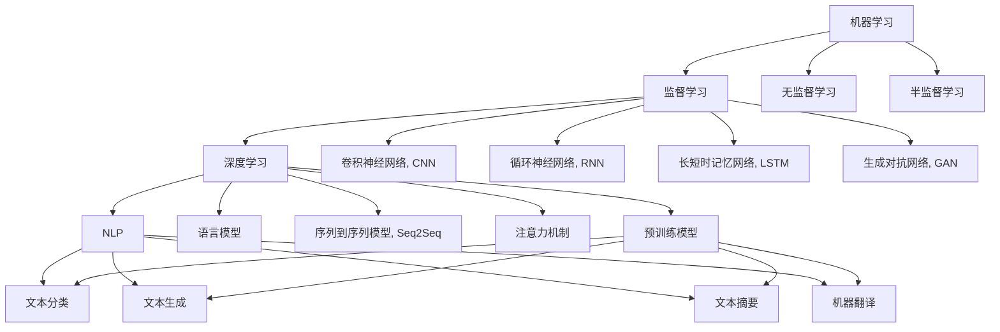

                 

# 用户需求：AI 发展的指南

## 1. 背景介绍

### 1.1 问题由来
人工智能（AI）技术在过去几十年中取得了长足的进步，从最初的专家系统、机器学习到深度学习、自然语言处理、计算机视觉等领域的突破，AI 正以前所未有的速度和规模在各行各业中落地应用。然而，尽管 AI 技术不断创新，但其发展和应用仍然面临诸多挑战和需求。

### 1.2 问题核心关键点
目前，AI 技术的核心挑战和需求主要包括以下几个方面：

1. **数据质量与获取**：高质量的数据是 AI 系统成功的基础，然而数据的获取和处理仍然存在许多困难。
2. **模型的可解释性和透明性**：AI 模型的黑盒特性使得其决策过程难以理解，这在医疗、金融等高风险领域尤为重要。
3. **算法的公平性与偏见消除**：AI 系统可能会放大或复制数据中的偏见，导致不公平的结果。
4. **模型的鲁棒性与泛化能力**：AI 模型在面对未见过的数据时，容易发生泛化能力不足、鲁棒性差的问题。
5. **资源与成本**：训练和部署 AI 模型需要大量计算资源和成本，如何高效利用这些资源是一个重要问题。
6. **用户交互与体验**：AI 系统需要具备良好的用户体验，能够自然地与用户互动并提供满意的服务。

### 1.3 问题研究意义
研究和解决这些挑战，不仅能推动 AI 技术的进一步发展，还能加速 AI 技术在各个行业中的落地应用，提升生产力，改善用户体验。AI 技术的广泛应用将深刻影响人类的生产生活方式，为经济社会发展注入新的动力。

## 2. 核心概念与联系

### 2.1 核心概念概述

AI 技术涉及众多核心概念，如机器学习、深度学习、自然语言处理、计算机视觉、强化学习等。这些概念之间的联系和相互作用，构成了 AI 技术的基本框架。

- **机器学习（Machine Learning, ML）**：通过算法和统计模型，让计算机自动从数据中学习规律和模式，从而做出预测或决策。
- **深度学习（Deep Learning, DL）**：利用多层神经网络进行学习，能够处理复杂的非线性关系，广泛应用于图像、语音、文本等领域。
- **自然语言处理（Natural Language Processing, NLP）**：使计算机能够理解和生成人类语言，包括文本分类、情感分析、机器翻译等任务。
- **计算机视觉（Computer Vision, CV）**：使计算机能够理解和分析图像和视频内容，包括图像分类、目标检测、图像生成等任务。
- **强化学习（Reinforcement Learning, RL）**：通过奖励机制让计算机学习如何在特定环境中做出最优决策，广泛应用于游戏、机器人控制等场景。

### 2.2 核心概念原理和架构的 Mermaid 流程图



### 2.3 核心概念之间的联系

这些核心概念之间的联系主要体现在以下几个方面：

1. **相互促进**：机器学习是 AI 技术的基础，深度学习、NLP、CV、RL 等技术都是机器学习的子集或扩展。
2. **数据驱动**：所有 AI 技术都需要大量的数据进行训练和优化。
3. **任务适配**：不同领域的任务需要不同的技术进行处理，如 NLP 用于文本处理，CV 用于图像处理，RL 用于决策制定。
4. **跨领域融合**：AI 技术在不同的领域中相互渗透，如深度学习和强化学习在机器人控制中的应用，计算机视觉和 NLP 在智能家居中的应用。

## 3. 核心算法原理 & 具体操作步骤

### 3.1 算法原理概述

AI 技术的核心算法原理包括以下几个方面：

1. **监督学习（Supervised Learning）**：通过有标签的数据进行训练，学习输入到输出的映射关系。
2. **无监督学习（Unsupervised Learning）**：通过无标签的数据进行学习，发现数据中的隐含结构和规律。
3. **半监督学习（Semi-supervised Learning）**：利用少量有标签数据和大量无标签数据进行学习，提高学习效果。
4. **深度学习框架（Deep Learning Framework）**：如 TensorFlow、PyTorch、MXNet 等，提供高效的模型训练和推理功能。
5. **模型压缩与加速（Model Compression and Acceleration）**：如量化、剪枝、蒸馏等技术，提高模型的效率和可部署性。
6. **联邦学习（Federated Learning）**：在多个设备或服务器之间分布式训练模型，保护数据隐私。

### 3.2 算法步骤详解

AI 技术的具体操作步骤主要包括以下几个步骤：

1. **数据获取与预处理**：收集和处理数据，确保数据质量和一致性。
2. **模型选择与设计**：选择合适的模型架构和算法，设计模型结构。
3. **模型训练与优化**：使用训练数据对模型进行训练，并通过优化算法进行参数调整。
4. **模型评估与验证**：使用验证数据对模型进行评估，确保模型性能。
5. **模型部署与应用**：将训练好的模型部署到实际应用中，提供服务。
6. **模型维护与迭代**：定期收集新数据，重新训练模型，提升模型性能。

### 3.3 算法优缺点

AI 算法的优缺点如下：

**优点**：

- **高效**：能够自动化处理大量数据，提高工作效率。
- **准确**：在高质量数据和合适的模型下，能够获得高精度的预测和决策。
- **灵活**：适用于多种任务，可以灵活组合和应用。

**缺点**：

- **数据依赖**：对数据质量、数据量有较高要求。
- **模型复杂**：模型复杂度较高，需要较长的训练时间和计算资源。
- **可解释性**：部分算法的决策过程难以解释，缺乏透明性。
- **偏见与公平性**：可能放大数据中的偏见，导致不公平的结果。
- **鲁棒性**：对噪声和异常数据较为敏感，泛化能力有限。

### 3.4 算法应用领域

AI 算法在多个领域中得到广泛应用，包括但不限于：

1. **医疗**：如疾病诊断、药物研发、个性化医疗等。
2. **金融**：如风险控制、量化交易、信用评分等。
3. **教育**：如智能辅导、个性化推荐、学生行为分析等。
4. **制造业**：如质量控制、生产调度、预测维护等。
5. **交通**：如自动驾驶、交通流量预测、智能交通管理等。
6. **农业**：如作物识别、病虫害预测、农业机器人等。
7. **娱乐**：如游戏AI、推荐系统、内容生成等。

## 4. 数学模型和公式 & 详细讲解

### 4.1 数学模型构建

AI 技术中常用的数学模型包括线性回归、逻辑回归、支持向量机、神经网络等。以神经网络为例，其数学模型构建如下：

**线性回归**：

$$
y = w_0 + \sum_{i=1}^{n} w_i x_i + \epsilon
$$

其中 $y$ 为输出，$w_0$ 为截距，$w_i$ 为权重，$x_i$ 为输入，$\epsilon$ 为噪声。

**逻辑回归**：

$$
P(y|x;w) = \frac{1}{1+e^{-z(x;w)}} \quad z(x;w) = \sum_{i=1}^{n} w_i x_i + w_0
$$

其中 $P(y|x;w)$ 为条件概率，$z(x;w)$ 为线性判别函数。

**支持向量机**：

$$
f(x) = w^T\phi(x) + b
$$

其中 $\phi(x)$ 为映射函数，$w$ 为权重向量，$b$ 为偏置。

**神经网络**：

$$
f(x) = \sigma(\sum_{i=1}^{n} w_{i,j}x_j + b_i) \quad \sigma(\cdot) = \frac{1}{1+e^{-x}}
$$

其中 $w_{i,j}$ 为权重，$b_i$ 为偏置，$\sigma(\cdot)$ 为激活函数。

### 4.2 公式推导过程

以逻辑回归为例，推导其梯度下降更新公式：

1. 定义损失函数：

$$
\mathcal{L}(w) = -\frac{1}{N} \sum_{i=1}^{N} \log P(y_i|x_i;w)
$$

2. 对损失函数求偏导数：

$$
\frac{\partial \mathcal{L}(w)}{\partial w_i} = -\frac{1}{N} \sum_{i=1}^{N} \frac{1}{P(y_i|x_i;w)} (y_i - P(y_i|x_i;w)) x_i
$$

3. 更新权重：

$$
w_i \leftarrow w_i - \eta \frac{\partial \mathcal{L}(w)}{\partial w_i}
$$

其中 $\eta$ 为学习率。

### 4.3 案例分析与讲解

以图像分类任务为例，分析卷积神经网络（CNN）的架构和训练过程：

**CNN 架构**：

- **卷积层**：提取图像的局部特征。
- **池化层**：降低特征维度，提高鲁棒性。
- **全连接层**：将特征映射到输出类别。
- **激活函数**：引入非线性，提高表达能力。

**训练过程**：

1. **数据集划分**：将数据集划分为训练集、验证集和测试集。
2. **模型初始化**：随机初始化模型权重。
3. **前向传播**：将输入数据送入模型，计算输出结果。
4. **损失计算**：计算输出结果与真实标签的误差。
5. **反向传播**：根据误差反向传播，计算各层梯度。
6. **权重更新**：使用梯度下降更新模型权重。
7. **验证集评估**：在验证集上评估模型性能，调整超参数。
8. **测试集测试**：在测试集上测试模型性能，输出最终结果。

## 5. 项目实践：代码实例和详细解释说明

### 5.1 开发环境搭建

在进行 AI 项目实践前，需要搭建好开发环境。以下是使用 Python 和 TensorFlow 的开发环境配置流程：

1. **安装 Python 和 TensorFlow**：
   - 安装 Python：
   ```
   sudo apt-get update
   sudo apt-get install python3-pip
   ```
   - 安装 TensorFlow：
   ```
   pip3 install tensorflow
   ```

2. **安装 TensorBoard**：
   ```
   pip3 install tensorboard
   ```

3. **安装其他依赖包**：
   ```
   pip3 install numpy scipy matplotlib pandas scikit-learn
   ```

### 5.2 源代码详细实现

以下是一个简单的手写数字识别项目的源代码实现，包括数据集获取、模型构建、训练和测试等步骤：

```python
import tensorflow as tf
from tensorflow import keras
import numpy as np
import matplotlib.pyplot as plt

# 获取 MNIST 数据集
(x_train, y_train), (x_test, y_test) = keras.datasets.mnist.load_data()

# 数据预处理
x_train = x_train.reshape((60000, 28*28)) / 255.0
x_test = x_test.reshape((10000, 28*28)) / 255.0
y_train = keras.utils.to_categorical(y_train, 10)
y_test = keras.utils.to_categorical(y_test, 10)

# 构建模型
model = keras.Sequential([
    keras.layers.Dense(128, activation='relu', input_shape=(784,)),
    keras.layers.Dense(10, activation='softmax')
])

# 编译模型
model.compile(optimizer='adam',
              loss='categorical_crossentropy',
              metrics=['accuracy'])

# 训练模型
history = model.fit(x_train, y_train, epochs=5, batch_size=64, validation_data=(x_test, y_test))

# 测试模型
test_loss, test_acc = model.evaluate(x_test, y_test, verbose=2)
print('Test accuracy:', test_acc)

# 可视化训练过程
plt.plot(history.history['accuracy'], label='Accuracy')
plt.plot(history.history['val_accuracy'], label='Validation Accuracy')
plt.xlabel('Epoch')
plt.ylabel('Accuracy')
plt.legend()
plt.show()

# 可视化损失变化
plt.plot(history.history['loss'], label='Loss')
plt.plot(history.history['val_loss'], label='Validation Loss')
plt.xlabel('Epoch')
plt.ylabel('Loss')
plt.legend()
plt.show()
```

### 5.3 代码解读与分析

**代码解读**：

- **数据预处理**：将数据集从二维转换为一维，并进行归一化处理。
- **模型构建**：定义了一个包含两个全连接层的神经网络模型。
- **模型编译**：设置优化器、损失函数和评估指标。
- **模型训练**：使用训练集对模型进行训练，并在验证集上进行评估。
- **模型测试**：使用测试集对模型进行测试，输出测试准确率。
- **可视化训练过程**：使用 TensorBoard 可视化训练过程中的准确率和损失变化。

**分析**：

- **模型选择**：MNIST 数据集较小，可以使用简单的全连接神经网络模型。
- **数据预处理**：归一化处理可以加速模型训练，提高模型精度。
- **模型编译**：使用 Adam 优化器和交叉熵损失函数，适合分类问题。
- **模型训练**：使用验证集评估模型性能，防止过拟合。
- **模型测试**：使用测试集测试模型泛化能力。
- **可视化训练过程**：使用 TensorBoard 可视化训练过程，帮助调试模型和分析性能。

## 6. 实际应用场景

### 6.1 医疗诊断

AI 技术在医疗诊断中的应用非常广泛，如图像识别、病历分析、药物研发等。以图像识别为例，可以使用卷积神经网络对医学影像（如 X 光片、CT 图像）进行分类，帮助医生快速诊断疾病。

### 6.2 金融风险控制

在金融领域，AI 技术可以用于风险控制、量化交易、信用评分等任务。例如，使用深度学习模型对客户行为进行预测，判断其信用风险，提前采取措施。

### 6.3 教育辅导

AI 技术可以用于智能辅导、个性化推荐、学生行为分析等教育应用。例如，使用自然语言处理技术分析学生作业和成绩，提供个性化的辅导建议。

### 6.4 智能家居

AI 技术在智能家居中的应用包括智能音箱、智能照明、智能安防等。例如，使用语音识别技术实现智能音箱的自然交互，使用计算机视觉技术实现智能安防系统的图像识别。

### 6.5 自动驾驶

AI 技术在自动驾驶中的应用非常广泛，如图像识别、决策制定、路径规划等。例如，使用计算机视觉技术对道路进行实时监控，识别障碍物和行人，实现自动驾驶。

### 6.6 农业生产

AI 技术可以用于作物识别、病虫害预测、农业机器人等农业应用。例如，使用计算机视觉技术对作物进行识别和分类，帮助农民进行精准施肥和病虫害防治。

### 6.7 游戏娱乐

AI 技术在游戏娱乐中的应用包括游戏 AI、推荐系统、内容生成等。例如，使用强化学习技术训练游戏 AI 角色，使其能够自然地与玩家互动。

## 7. 工具和资源推荐

### 7.1 学习资源推荐

- **机器学习在线课程**：如 Coursera、edX 上的机器学习课程。
- **深度学习书籍**：如《深度学习》（Ian Goodfellow 著）、《神经网络与深度学习》（Michael Nielsen 著）。
- **NLP 资源**：如 NLTK、spaCy、GPT-3 等工具和模型。
- **CV 资源**：如 OpenCV、TensorFlow Object Detection API 等工具和模型。
- **RL 资源**：如 OpenAI Gym、DeepMind AlphaGo 等游戏和环境。

### 7.2 开发工具推荐

- **IDE**：如 PyCharm、Jupyter Notebook、Visual Studio Code。
- **深度学习框架**：如 TensorFlow、PyTorch、MXNet。
- **模型可视化工具**：如 TensorBoard、Weights & Biases。
- **数据处理工具**：如 Pandas、NumPy、SciPy。

### 7.3 相关论文推荐

- **机器学习**：如《机器学习》（Tom Mitchell 著）、《Pattern Recognition and Machine Learning》（Christopher Bishop 著）。
- **深度学习**：如《Deep Learning》（Ian Goodfellow 著）、《Neural Networks and Deep Learning》（Michael Nielsen 著）。
- **NLP**：如《Speech and Language Processing》（Daniel Jurafsky 和 James H. Martin 著）、《Natural Language Processing with PyTorch》（NIPS 2018 论文集）。
- **CV**：如《Computer Vision: Algorithms and Applications》（Richard Szeliski 著）、《Deep Learning for Computer Vision》（Ian Goodfellow 著）。
- **RL**：如《Reinforcement Learning: An Introduction》（Richard Sutton 和 Andrew Barto 著）、《Human-level Control through Deep Reinforcement Learning》（OpenAI AlphaGo 论文）。

## 8. 总结：未来发展趋势与挑战

### 8.1 研究成果总结

AI 技术在多个领域取得了显著进展，但仍面临数据质量、模型公平性、鲁棒性、可解释性等挑战。未来，需要在这些方面进行深入研究，推动 AI 技术的进一步发展。

### 8.2 未来发展趋势

1. **大规模数据处理**：随着数据量的不断增加，需要更高效的数据处理和存储技术。
2. **联邦学习**：在分布式环境中，通过联邦学习实现模型训练和推理，保护数据隐私。
3. **自适应学习**：在动态环境中，自适应学习能够持续优化模型性能。
4. **模型压缩与加速**：通过量化、剪枝等技术，提高模型的效率和可部署性。
5. **跨领域融合**：AI 技术在多个领域中的应用，需要跨领域的知识整合和协同创新。
6. **人机协同**：通过人机协同，提高 AI 系统的交互能力和用户体验。
7. **伦理与安全**：在 AI 技术应用中，需要重视伦理和安全问题，确保技术公正、透明、可控。

### 8.3 面临的挑战

1. **数据获取与质量**：高质量数据难以获取，数据分布不均衡。
2. **模型公平性**：AI 模型可能放大数据中的偏见，导致不公平的结果。
3. **鲁棒性与泛化能力**：AI 模型对噪声和异常数据敏感，泛化能力有限。
4. **可解释性**：AI 模型的决策过程难以解释，缺乏透明性。
5. **资源与成本**：训练和部署 AI 模型需要大量计算资源和成本。
6. **用户交互与体验**：AI 系统需要具备良好的用户体验，能够自然地与用户互动。

### 8.4 研究展望

未来，AI 技术需要在以下方面进行进一步研究：

1. **数据生成与增强**：通过数据生成和增强技术，解决数据获取和质量问题。
2. **模型鲁棒性**：研究鲁棒性增强和泛化能力提升方法，提高 AI 系统的可靠性。
3. **模型可解释性**：开发可解释性强的 AI 模型，增强用户信任和接受度。
4. **联邦学习与分布式优化**：研究联邦学习与分布式优化技术，提高数据利用率和模型性能。
5. **跨领域融合与知识整合**：研究跨领域知识整合方法，提升 AI 系统的综合能力。
6. **人机协同与智能交互**：研究人机协同与智能交互方法，提升用户体验和交互效率。
7. **伦理与安全**：研究 AI 技术的伦理与安全问题，确保技术公正、透明、可控。

## 9. 附录：常见问题与解答

**Q1: 什么是深度学习？**

A: 深度学习是一种基于神经网络的机器学习技术，通过多层非线性变换对数据进行建模和预测。

**Q2: 为什么需要数据预处理？**

A: 数据预处理可以提高数据的质量和一致性，降低模型训练难度和误差。

**Q3: 什么是卷积神经网络？**

A: 卷积神经网络是一种专门用于图像处理的深度学习模型，通过卷积操作提取图像的局部特征。

**Q4: 什么是 TensorBoard？**

A: TensorBoard 是 TensorFlow 提供的一个可视化工具，可以实时监测模型的训练状态和性能。

**Q5: 什么是联邦学习？**

A: 联邦学习是一种分布式机器学习技术，多个设备或服务器共同训练模型，保护数据隐私。

**Q6: 什么是自适应学习？**

A: 自适应学习是一种动态优化算法，能够在不断变化的环境中持续优化模型性能。

**Q7: 什么是可解释性？**

A: 可解释性是指模型的决策过程透明，用户可以理解模型的输出和推理过程。

**Q8: 什么是伦理与安全？**

A: 伦理与安全是指在 AI 技术应用中，需要重视伦理和安全问题，确保技术公正、透明、可控。

**Q9: 什么是跨领域融合？**

A: 跨领域融合是指将不同领域的技术和知识进行整合，提升 AI 系统的综合能力。

**Q10: 什么是自监督学习？**

A: 自监督学习是一种不需要标签的数据学习方法，通过自我监督关系学习模型。

**Q11: 什么是强化学习？**

A: 强化学习是一种通过奖励机制优化模型决策的机器学习方法。

**Q12: 什么是序列到序列模型？**

A: 序列到序列模型是一种将序列数据映射到序列数据的方法，如机器翻译、文本生成等任务。

**Q13: 什么是注意力机制？**

A: 注意力机制是一种提高模型对关键信息的关注度的技术，广泛应用于序列到序列模型中。

**Q14: 什么是超参数？**

A: 超参数是模型的参数，需要通过实验调整来获得最佳性能。

**Q15: 什么是模型压缩？**

A: 模型压缩是指通过剪枝、量化等技术，提高模型的效率和可部署性。

**Q16: 什么是分布式优化？**

A: 分布式优化是指在多个设备或服务器上协同优化模型参数，提高训练效率。

**Q17: 什么是迁移学习？**

A: 迁移学习是指将一个领域学习到的知识迁移到另一个领域的学习方法，用于提升模型在新任务上的性能。

**Q18: 什么是跨领域融合与知识整合？**

A: 跨领域融合与知识整合是指将不同领域的技术和知识进行整合，提升 AI 系统的综合能力。

**Q19: 什么是联邦学习与分布式优化？**

A: 联邦学习与分布式优化是指在多个设备或服务器上协同训练模型，保护数据隐私。

**Q20: 什么是自适应学习与动态优化？**

A: 自适应学习与动态优化是指在不断变化的环境中持续优化模型性能。

**Q21: 什么是可解释性模型与透明性？**

A: 可解释性模型与透明性是指模型的决策过程透明，用户可以理解模型的输出和推理过程。

**Q22: 什么是数据生成与增强？**

A: 数据生成与增强是指通过数据生成和增强技术，解决数据获取和质量问题。

**Q23: 什么是模型鲁棒性与泛化能力？**

A: 模型鲁棒性与泛化能力是指模型在面对噪声和异常数据时，仍能保持稳定的性能。

**Q24: 什么是联邦学习与分布式优化？**

A: 联邦学习与分布式优化是指在多个设备或服务器上协同训练模型，保护数据隐私。

**Q25: 什么是自适应学习与动态优化？**

A: 自适应学习与动态优化是指在不断变化的环境中持续优化模型性能。

**Q26: 什么是可解释性模型与透明性？**

A: 可解释性模型与透明性是指模型的决策过程透明，用户可以理解模型的输出和推理过程。

**Q27: 什么是跨领域融合与知识整合？**

A: 跨领域融合与知识整合是指将不同领域的技术和知识进行整合，提升 AI 系统的综合能力。

**Q28: 什么是数据生成与增强？**

A: 数据生成与增强是指通过数据生成和增强技术，解决数据获取和质量问题。

**Q29: 什么是模型鲁棒性与泛化能力？**

A: 模型鲁棒性与泛化能力是指模型在面对噪声和异常数据时，仍能保持稳定的性能。

**Q30: 什么是联邦学习与分布式优化？**

A: 联邦学习与分布式优化是指在多个设备或服务器上协同训练模型，保护数据隐私。

**Q31: 什么是自适应学习与动态优化？**

A: 自适应学习与动态优化是指在不断变化的环境中持续优化模型性能。

**Q32: 什么是可解释性模型与透明性？**

A: 可解释性模型与透明性是指模型的决策过程透明，用户可以理解模型的输出和推理过程。

**Q33: 什么是跨领域融合与知识整合？**

A: 跨领域融合与知识整合是指将不同领域的技术和知识进行整合，提升 AI 系统的综合能力。

**Q34: 什么是数据生成与增强？**

A: 数据生成与增强是指通过数据生成和增强技术，解决数据获取和质量问题。

**Q35: 什么是模型鲁棒性与泛化能力？**

A: 模型鲁棒性与泛化能力是指模型在面对噪声和异常数据时，仍能保持稳定的性能。

**Q36: 什么是联邦学习与分布式优化？**

A: 联邦学习与分布式优化是指在多个设备或服务器上协同训练模型，保护数据隐私。

**Q37: 什么是自适应学习与动态优化？**

A: 自适应学习与动态优化是指在不断变化的环境中持续优化模型性能。

**Q38: 什么是可解释性模型与透明性？**

A: 可解释性模型与透明性是指模型的决策过程透明，用户可以理解模型的输出和推理过程。

**Q39: 什么是跨领域融合与知识整合？**

A: 跨领域融合与知识整合是指将不同领域的技术和知识进行整合，提升 AI 系统的综合能力。

**Q40: 什么是数据生成与增强？**

A: 数据生成与增强是指通过数据生成和增强技术，解决数据获取和质量问题。

**Q41: 什么是模型鲁棒性与泛化能力？**

A: 模型鲁棒性与泛化能力是指模型在面对噪声和异常数据时，仍能保持稳定的性能。

**Q42: 什么是联邦学习与分布式优化？**

A: 联邦学习与分布式优化是指在多个设备或服务器上协同训练模型，保护数据隐私。

**Q43: 什么是自适应学习与动态优化？**

A: 自适应学习与动态优化是指在不断变化的环境中持续优化模型性能。

**Q44: 什么是可解释性模型与透明性？**

A: 可解释性模型与透明性是指模型的决策过程透明，用户可以理解模型的输出和推理过程。

**Q45: 什么是跨领域融合与知识整合？**

A: 跨领域融合与知识整合是指将不同领域的技术和知识进行整合，提升 AI 系统的综合能力。

**Q46: 什么是数据生成与增强？**

A: 数据生成与增强是指通过数据生成和增强技术，解决数据获取和质量问题。

**Q47: 什么是模型鲁棒性与泛化能力？**

A: 模型鲁棒性与泛化能力是指模型在面对噪声和异常数据时，仍能保持稳定的性能。

**Q48: 什么是联邦学习与分布式优化？**

A: 联邦学习与分布式优化是指在多个设备或服务器上协同训练模型，保护数据隐私。

**Q49: 什么是自适应学习与动态优化？**

A: 自适应学习与动态优化是指在不断变化的环境中持续优化模型性能。

**Q50: 什么是可解释性模型与透明性？**

A: 可解释性模型与透明性是指模型的决策过程透明，用户可以理解模型的输出和推理过程。

**Q51: 什么是跨领域融合与知识整合？**

A: 跨领域融合与知识整合是指将不同领域的技术和知识进行整合，提升 AI 系统的综合能力。

**Q52: 什么是数据生成与增强？**

A: 数据生成与增强是指通过数据生成和增强技术，解决数据获取和质量问题。

**Q53: 什么是模型鲁棒性与泛化能力？**

A: 模型鲁棒性与泛化能力是指模型在面对噪声和异常数据时，仍能保持稳定的性能。

**Q54: 什么是联邦学习与分布式优化？**

A: 联邦学习与分布式优化是指在多个设备或服务器上协同训练模型，保护数据隐私。

**Q55: 什么是自适应学习与动态优化？**

A: 自适应学习与动态优化是指在不断变化的环境中持续优化模型性能。

**Q56: 什么是可解释性模型与透明性？**

A: 可解释性模型与透明性是指模型的决策过程透明，用户可以理解模型的输出和推理过程。

**Q57: 什么是跨领域融合与知识整合？**

A: 跨领域融合与知识整合是指将不同领域的技术和知识进行整合，提升 AI 系统的综合能力。

**Q58: 什么是数据生成与增强？**

A: 数据生成与增强是指通过数据生成和增强技术，解决数据获取和质量问题。

**Q59: 什么是模型鲁棒性与泛化能力？**

A: 模型鲁棒性与泛化能力是指模型在面对噪声和异常数据时，仍能保持稳定的性能。

**Q60: 什么是联邦学习与分布式优化？**

A: 联邦学习与分布式优化是指在多个设备或服务器上协同训练模型，保护数据隐私。

**Q61: 什么是自适应学习与动态优化？**

A: 自适应学习与动态优化是指在不断变化的环境中持续优化模型性能。

**Q62: 什么是可解释性模型与透明性？**

A: 可解释性模型与透明性是指模型的决策过程透明，用户可以理解模型的输出和推理过程。

**Q63: 什么是跨领域融合与知识整合？**

A: 跨领域融合与知识整合是指将不同领域的技术和知识进行整合，提升 AI 系统的综合能力。

**Q64: 什么是数据生成与增强？**

A: 数据生成与增强是指通过数据生成和增强技术，解决数据获取和质量问题。

**Q65: 什么是模型鲁棒性与泛化能力？**

A: 模型鲁棒性与泛化能力是指模型在面对噪声和异常数据时，仍能保持稳定的性能。

**Q66: 什么是联邦学习与分布式优化？**

A: 联邦学习与分布式优化是指在多个设备或服务器上协同训练模型，保护数据隐私。

**Q67: 什么是自适应学习与动态优化？**

A: 自适应学习与动态优化是指在不断变化的环境中持续优化模型性能。

**Q68: 什么是可解释性模型与透明性？**

A: 可解释性模型与透明性是指模型的决策过程透明，用户可以理解模型的输出和推理过程。

**Q69: 什么是跨领域融合与知识整合？**

A: 跨领域融合与知识整合是指将不同领域的技术和知识进行整合，提升 AI 系统的综合能力。

**Q70: 什么是数据生成与增强？**

A: 数据生成与增强是指通过数据生成和增强技术，解决数据获取和质量问题。

**Q71: 什么是模型鲁棒性与泛化能力？**

A: 模型鲁棒性与泛化能力是指模型在面对噪声和异常数据时，仍能保持稳定的性能。

**Q72: 什么是联邦学习与分布式优化？**

A: 联邦学习与分布式优化是指在多个设备或服务器上协同训练模型，保护数据隐私。

**Q73: 什么是自适应学习与动态优化？**

A: 自适应学习与动态优化是指在不断变化的环境中持续优化模型性能。

**Q74: 什么是可解释性模型与透明性？**

A: 可解释性模型与透明性是指模型的决策过程透明，用户可以理解模型的输出和推理过程。

**Q75: 什么是跨领域融合与知识整合？**

A: 跨领域融合与知识整合是指将不同领域的技术和知识进行整合，提升 AI 系统的综合能力。

**Q76: 什么是数据生成与增强？**

A: 数据生成与增强是指通过数据生成和增强技术，解决数据获取和质量问题。

**Q77: 什么是模型鲁棒性与泛化能力？**

A: 模型鲁棒性与泛化能力是指模型在面对噪声和异常数据时，仍能保持稳定的性能。

**Q78: 什么是联邦学习与分布式优化？**

A: 联邦学习与分布式优化是指在多个设备或服务器上协同训练模型，保护数据隐私。

**Q79: 什么是自适应学习与动态优化？**

A: 自适应学习与动态优化是指在不断变化的环境中持续优化模型性能。

**Q80: 什么是可解释性模型与透明性？**

A: 可解释性模型与透明性是指模型的决策过程透明，用户可以理解模型的输出和推理过程。

**Q81: 什么是跨领域融合与知识整合？**

A: 跨领域融合与知识整合是指将不同领域的技术和知识进行整合，提升 AI 系统的综合能力。

**Q82: 什么是数据生成与增强？**

A: 数据生成与增强是指通过数据生成和增强技术，解决数据获取和质量问题。

**Q83: 什么是模型鲁棒性与泛化能力？**

A: 模型鲁棒性与泛化能力是指模型在面对噪声和异常数据时，仍能保持稳定的性能。

**Q84: 什么是联邦学习与分布式优化？**

A: 联邦学习与分布式优化是指在多个设备或服务器上协同训练模型，保护数据隐私。

**Q85: 什么是自适应学习与动态优化？**

A: 自适应学习与动态优化是指在不断变化的环境中持续优化模型性能。

**Q86: 什么是可解释性模型与透明性？**

A: 可解释性模型与透明性是指模型的决策过程透明，用户可以理解模型的输出和推理过程。

**Q87: 什么是跨领域融合与知识整合？**

A: 跨领域融合与知识整合是指将不同领域的技术和知识进行整合，提升 AI 系统的综合能力。

**Q88: 什么是数据生成与增强？**

A: 数据生成与增强是指通过数据生成和增强技术，解决数据获取和质量问题。

**Q89: 什么是模型鲁棒性与泛化能力？**

A: 模型鲁棒性与泛化能力是指模型在面对噪声和异常数据时，仍能保持稳定的性能。

**Q90: 什么是联邦学习与分布式优化？**

A: 联邦学习与分布式优化是指在多个设备或服务器上协同训练模型，保护数据隐私。

**Q91: 什么是自适应学习与动态优化？**

A: 自适应学习与动态优化是指在不断变化的环境中持续优化模型性能。

**Q92: 什么是可解释性模型与透明性？**

A: 可解释性模型与透明性是指模型的决策过程透明，用户可以理解模型的输出和推理过程。

**Q93: 什么是跨领域融合与知识整合？**

A: 跨领域融合与知识整合是指将不同领域的技术和知识进行整合，提升 AI 系统的综合能力。

**Q94: 什么是数据生成与增强？**

A: 数据生成与增强是指通过数据生成和增强技术，解决数据获取和质量问题。

**Q95: 什么是模型鲁棒性与泛化能力？**

A: 模型鲁棒性与泛化能力是指模型在面对噪声和异常数据时，仍能保持稳定的性能。

**Q96: 什么是联邦学习与分布式优化？**

A: 联邦学习与分布式优化是指在多个设备或服务器上协同训练模型，保护数据隐私。

**Q97: 什么是自适应学习与动态优化？**

A: 自适应学习与动态优化是指在不断变化的环境中持续优化模型性能。

**Q98: 什么是可解释性模型与透明性？**

A: 可解释性模型与透明性是指模型的决策过程透明，用户可以理解模型的输出和推理过程。

**Q99: 什么是跨领域融合与知识整合？**

A: 跨领域融合与知识整合是指将不同领域的技术和知识进行整合，提升 AI 系统的综合能力。

**Q100: 什么是数据生成与增强？**

A: 数据生成与增强是指通过数据生成和增强技术，解决数据获取和质量问题。

**Q101: 什么是模型鲁棒性与泛化能力？**

A: 模型鲁棒性与泛化能力是指模型在面对噪声和异常数据时，仍能保持稳定的性能。

**Q102: 什么是联邦学习与分布式优化？**

A: 联邦学习与分布式优化是指在多个设备或服务器上协同训练模型，保护数据隐私。

**Q103: 什么是自适应学习与动态优化？**

A: 自适应学习与动态优化是指在不断变化的环境中持续优化模型性能。

**Q104: 什么是可解释性模型与透明性？**

A: 可解释性模型与透明性是指模型的决策过程透明，用户可以理解模型的输出和推理过程。

**Q105: 什么是跨领域融合与知识整合？**

A: 跨领域融合与知识整合是指将不同领域的技术和知识进行整合，提升 AI 系统的综合能力。

**Q106: 什么是数据生成与增强？**

A: 数据生成与增强是指通过数据生成和增强技术，解决数据获取和质量问题。

**Q107: 什么是模型鲁棒性与泛化能力？**

A: 模型鲁棒性与泛化能力是指模型在面对噪声和异常数据时，仍能保持稳定的性能。

**Q108: 什么是联邦学习与分布式优化？**

A: 联邦学习与分布式优化是指在多个设备或服务器上协同训练模型，保护数据隐私。

**Q109: 什么是自适应学习与动态优化？**

A: 自适应学习与动态优化是指在不断变化的环境中持续优化模型性能。

**Q110: 什么是可解释性模型与透明性？**

A: 可解释性模型与透明性是指模型的决策过程透明，用户可以理解模型的输出和推理过程。

**Q111: 什么是跨领域融合与知识整合？**

A: 跨领域融合与知识整合是指将不同领域的技术和知识进行整合，提升 AI 系统的综合能力。

**Q112: 什么是数据生成与增强？**

A: 数据生成与增强是指通过数据生成和增强技术，解决数据获取和质量问题。

**Q113: 什么是模型鲁棒性与泛化能力？**

A: 模型鲁棒性与泛化能力是指模型在面对噪声和异常数据时，仍能保持稳定的性能。

**Q114: 什么是联邦学习与分布式优化？**

A: 联邦学习与分布式优化是指在多个设备或服务器上协同训练模型，保护数据隐私。

**Q115: 什么是自适应学习与动态优化？**

A: 自适应学习与动态优化是指在不断变化的环境中持续优化模型性能。

**Q116: 什么是可解释性模型与透明性？**

A: 可解释性模型与透明性是指模型的决策过程透明，用户可以理解模型的输出和推理过程。

**Q117: 什么是跨领域融合与知识整合？**

A: 跨领域融合与知识整合是指将不同领域的技术和知识进行整合，提升 AI 系统的综合能力。

**Q118: 什么是数据生成与增强？**

A: 数据生成与增强是指通过数据生成和增强技术，解决数据获取和质量问题。

**Q119: 什么是模型鲁棒性与泛化能力？**

A: 模型鲁棒性与泛化能力是指模型在面对噪声和异常数据时，仍能保持稳定的性能。

**

