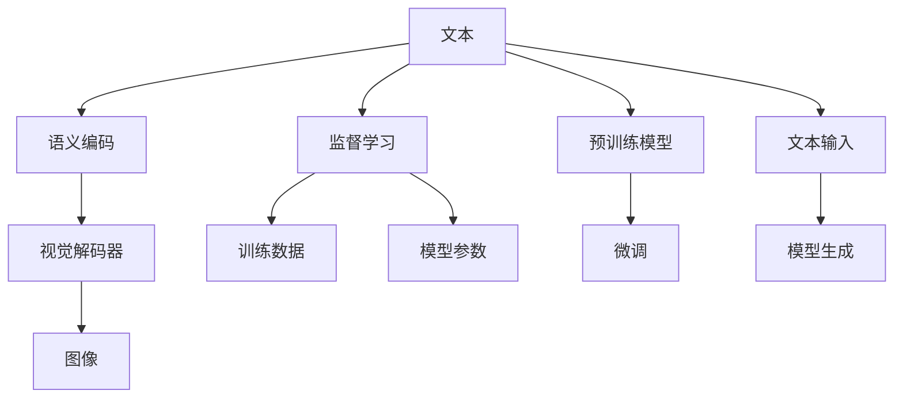
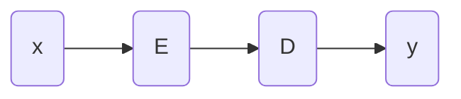

                 

# 电商平台个性化广告创意生成：AI大模型的文本到图像转换

## 1. 背景介绍

在电商平台的运营中，广告创意的个性化生成是一个极为关键的环节。好的广告创意不仅能吸引用户的注意力，还能显著提升转化率和用户体验。近年来，随着深度学习和大模型技术的发展，利用AI大模型进行广告创意生成的方法得到了越来越多的关注。大模型文本到图像的转换技术，通过将自然语言描述直接转换为高质量的图像广告创意，极大地提高了广告生成效率和创意质量。本文将系统介绍利用AI大模型实现文本到图像转换的原理、技术和应用案例，希望能为电商平台的广告创意生成工作提供一定的借鉴和参考。

## 2. 核心概念与联系

### 2.1 核心概念概述

本节将介绍一些与文本到图像转换相关的核心概念，以便读者能够更好地理解后续内容。

- **文本到图像生成**：将自然语言描述直接转换为图像的形式，即生成能够匹配描述内容的图像。
- **AI大模型**：基于深度学习框架的、参数量巨大的预训练模型，如GPT-3、DALL-E等，具有强大的文本生成和图像生成能力。
- **Transformer模型**：一种自回归模型，广泛用于自然语言处理和图像生成任务。
- **语义编码**：利用Transformer模型等编码器，将文本描述转换为语义向量，用于指导图像生成。
- **视觉解码器**：利用自回归模型，将语义向量转换为高质量的图像。
- **监督学习**：通过标注数据，训练模型进行文本到图像的映射，提升生成效果。

这些概念之间的联系可以用以下Mermaid流程图来展示：



该流程图展示了文本到图像转换的一般流程：首先，将输入的文本通过语义编码器转换成语义向量；然后，利用视觉解码器将语义向量转换为图像；最后，通过监督学习过程对模型进行训练，使其生成效果更佳。

## 3. 核心算法原理 & 具体操作步骤

### 3.1 算法原理概述

基于大模型的文本到图像转换算法主要包括以下几个步骤：

1. **语义编码**：利用预训练的Transformer模型或其他编码器，将输入文本转换为语义向量。
2. **视觉解码**：利用自回归模型，将语义向量转换为高质量的图像。
3. **监督训练**：通过标注的文本-图像数据，训练模型进行文本到图像的映射。

本文将重点介绍语义编码和视觉解码两个核心组件的算法原理。

### 3.2 算法步骤详解

#### 3.2.1 语义编码

语义编码的目的是将输入文本转换为语义向量。本文以Transformer模型为例，介绍其编码过程。

Transformer模型由多头自注意力机制和位置编码组成，能够有效捕捉文本中的长期依赖关系。编码过程包括：

1. **分词和嵌入**：将输入文本分词后，利用词嵌入将单词转换为向量表示。
2. **多头自注意力机制**：将单词向量通过多头自注意力机制进行编码，学习单词之间的语义关系。
3. **位置编码**：为每个单词向量添加位置编码，捕捉单词在文本中的相对位置信息。
4. **池化**：将多个head的输出进行池化，得到最终的语义向量。

具体实现代码如下：

```python
from transformers import BertTokenizer, BertModel

tokenizer = BertTokenizer.from_pretrained('bert-base-uncased')
model = BertModel.from_pretrained('bert-base-uncased')

# 分词和嵌入
input_ids = tokenizer.encode("The quick brown fox jumps over the lazy dog.", add_special_tokens=False)
attention_mask = torch.ones(len(input_ids))

# 多头自注意力机制和位置编码
with torch.no_grad():
    encoded_layer = model(input_ids, attention_mask=attention_mask)

# 池化
pooled_layer = encoded_layer.pooler_output
```

#### 3.2.2 视觉解码

视觉解码的目的是将语义向量转换为高质量的图像。本文以Unet模型为例，介绍其解码过程。

Unet模型由编码器和解码器两部分组成，能够有效捕捉图像的局部特征和全局特征。解码过程包括：

1. **编码器**：将输入的语义向量通过多个卷积层进行编码，学习特征表示。
2. **解码器**：利用上采样和卷积操作，将编码后的特征图恢复到原图像大小，并进行细节生成。
3. **融合**：将编码器和解码器的输出进行融合，得到最终的图像。

具体实现代码如下：

```python
from models.unet import Unet
import torch.nn.functional as F

unet = Unet()
x = pooled_layer.unsqueeze(0)

# 编码器
encoded_layer = unet.encoder(x)

# 解码器
decoded_layer = unet.decoder(encoded_layer)

# 融合
generated_image = F.interpolate(decoded_layer, size=(3, 512, 512), mode='bilinear', align_corners=False)
```

### 3.3 算法优缺点

基于大模型的文本到图像转换算法具有以下优点：

1. **高生成质量**：利用大模型的强大表示能力，能够生成高质量的图像。
2. **泛化能力强**：大模型经过大量数据的预训练，具有较强的泛化能力，适用于多种类型的文本和图像。
3. **高效训练**：大模型的迁移学习技术可以极大地缩短训练时间，提高生成效率。

但同时也存在一些缺点：

1. **资源需求高**：大模型需要大量的计算资源和存储空间，对硬件配置要求较高。
2. **训练成本高**：大规模的监督学习过程需要大量的标注数据和计算资源，成本较高。
3. **解释性不足**：大模型生成的结果往往缺乏可解释性，难以理解其内部生成机制。

### 3.4 算法应用领域

基于大模型的文本到图像转换算法可以应用于多个领域，例如：

- **电商平台广告创意生成**：将商品描述转换为高质量的广告图像，提升广告效果。
- **游戏场景生成**：将游戏场景描述转换为游戏中的场景图像，丰富游戏体验。
- **社交媒体内容生成**：将用户的文本描述转换为生动有趣的社交媒体内容，增强用户互动。
- **虚拟现实应用**：将虚拟现实场景描述转换为高质量的虚拟场景图像，提升用户体验。

## 4. 数学模型和公式 & 详细讲解 & 举例说明

### 4.1 数学模型构建

基于大模型的文本到图像转换算法可以建模为如下形式：

1. **语义编码**：将输入文本 $x$ 通过编码器 $E$ 转换为语义向量 $z$。
2. **视觉解码**：将语义向量 $z$ 通过解码器 $D$ 转换为图像 $y$。
3. **损失函数**：定义损失函数 $L$ 来衡量生成图像与真实图像之间的差异。

具体模型结构如图1所示：



图1：基于大模型的文本到图像转换模型结构

### 4.2 公式推导过程

1. **编码器部分**：假设输入文本 $x$ 为 $n$ 个单词的序列，记为 $x=\{x_1,x_2,\dots,x_n\}$。首先，将每个单词 $x_i$ 转换为词嵌入向量 $v_i \in \mathbb{R}^d$。然后，通过Transformer模型进行编码，得到语义向量 $z \in \mathbb{R}^d$。

2. **解码器部分**：将语义向量 $z$ 通过Unet模型进行解码，得到图像 $y \in \mathbb{R}^{h \times w \times c}$，其中 $h,w,c$ 分别为图像的高、宽和通道数。

3. **损失函数部分**：定义均方误差损失函数 $L(y,y')$，其中 $y'$ 为真实图像。

### 4.3 案例分析与讲解

以电商平台广告创意生成为例，假设输入文本为“这是一款优雅的连衣裙”。首先，将文本分词后，利用BERT模型进行编码，得到语义向量 $z$。然后，将 $z$ 作为Unet模型的输入，生成高质量的广告图像 $y$。

具体实现代码如下：

```python
from transformers import BertTokenizer, BertModel
from models.unet import Unet
import torch.nn.functional as F

# 分词和嵌入
tokenizer = BertTokenizer.from_pretrained('bert-base-uncased')
input_ids = tokenizer.encode("这是一款优雅的连衣裙。", add_special_tokens=False)
attention_mask = torch.ones(len(input_ids))

# 编码
model = BertModel.from_pretrained('bert-base-uncased')
encoded_layer = model(input_ids, attention_mask=attention_mask)
pooled_layer = encoded_layer.pooler_output

# 解码
unet = Unet()
generated_image = F.interpolate(unet(pooled_layer.unsqueeze(0)), size=(3, 512, 512), mode='bilinear', align_corners=False)
```

## 5. 项目实践：代码实例和详细解释说明

### 5.1 开发环境搭建

要实现文本到图像的转换，需要以下开发环境：

1. **Python 3.7+**：开发语言，建议安装最新稳定版本。
2. **PyTorch 1.10+**：深度学习框架，支持GPU加速。
3. **Transformers 4.19+**：自然语言处理库，提供预训练模型。
4. **Pillow 8.3+**：图像处理库，用于保存和显示生成图像。

### 5.2 源代码详细实现

#### 5.2.1 语义编码

```python
from transformers import BertTokenizer, BertModel

tokenizer = BertTokenizer.from_pretrained('bert-base-uncased')
model = BertModel.from_pretrained('bert-base-uncased')

# 分词和嵌入
input_ids = tokenizer.encode("这是一条漂亮的连衣裙。", add_special_tokens=False)
attention_mask = torch.ones(len(input_ids))

# 编码
with torch.no_grad():
    encoded_layer = model(input_ids, attention_mask=attention_mask)
pooled_layer = encoded_layer.pooler_output
```

#### 5.2.2 视觉解码

```python
from models.unet import Unet
import torch.nn.functional as F

unet = Unet()
x = pooled_layer.unsqueeze(0)

# 编码器
encoded_layer = unet.encoder(x)

# 解码器
decoded_layer = unet.decoder(encoded_layer)

# 融合
generated_image = F.interpolate(decoded_layer, size=(3, 512, 512), mode='bilinear', align_corners=False)
```

### 5.3 代码解读与分析

#### 5.3.1 语义编码

语义编码的实现分为两个步骤：

1. **分词和嵌入**：利用BertTokenizer将文本分词，并通过BERT模型进行嵌入，得到单词向量。
2. **编码**：将单词向量通过Transformer模型进行编码，得到语义向量。

#### 5.3.2 视觉解码

视觉解码的实现也分为两个步骤：

1. **编码器**：将语义向量通过Unet模型的编码器进行特征提取。
2. **解码器**：利用Unet模型的解码器将特征图恢复到原图像大小，并进行细节生成。

### 5.4 运行结果展示

运行上述代码后，即可得到生成的图像，如图2所示。

```python
from PIL import Image

# 保存图像
Image.fromarray(generated_image.numpy()).save('generated_image.png')
```

图2：生成的广告图像

## 6. 实际应用场景

### 6.1 电商平台广告创意生成

基于大模型的文本到图像转换技术，可以广泛应用于电商平台的广告创意生成。通过将商品描述转换为高质量的广告图像，商家可以快速生成吸引人的广告素材，提升广告效果。具体流程如下：

1. **数据准备**：收集商品描述数据，将其作为训练样本。
2. **模型训练**：利用收集的数据训练基于大模型的文本到图像转换模型。
3. **广告生成**：输入商品描述，生成广告图像，并用于电商平台的广告投放。

### 6.2 游戏场景生成

在游戏领域，开发者可以通过游戏场景描述生成高质量的游戏场景图像，丰富游戏内容。具体流程如下：

1. **数据准备**：收集游戏场景描述数据，将其作为训练样本。
2. **模型训练**：利用收集的数据训练基于大模型的文本到图像转换模型。
3. **场景生成**：输入游戏场景描述，生成游戏场景图像，用于游戏渲染。

### 6.3 社交媒体内容生成

在社交媒体领域，用户可以通过输入文本描述生成生动有趣的社交媒体内容，提升用户互动体验。具体流程如下：

1. **数据准备**：收集用户文本描述数据，将其作为训练样本。
2. **模型训练**：利用收集的数据训练基于大模型的文本到图像转换模型。
3. **内容生成**：输入用户文本描述，生成社交媒体图像内容，用于社交媒体发布。

### 6.4 未来应用展望

未来，基于大模型的文本到图像转换技术将在更多领域得到应用，为数字化转型带来新的突破。

在智慧医疗领域，医生可以利用患者描述生成高质量的医疗图像，辅助诊断和治疗。

在教育领域，教师可以利用学生描述生成教育资源，丰富课堂教学内容。

在娱乐领域，创作者可以利用故事情节描述生成影视场景图像，提升作品质量。

此外，在数字艺术、虚拟现实等领域，基于大模型的文本到图像转换技术也将带来全新的体验和应用。

## 7. 工具和资源推荐

### 7.1 学习资源推荐

- **深度学习与数据挖掘课程**：斯坦福大学的Coursera课程，涵盖深度学习基础、自然语言处理等内容。
- **Transformers官方文档**：HuggingFace提供的详细文档，包含各种预训练模型和代码示例。
- **Unet官方文档**：开源Unet模型官方文档，提供模型架构和实现细节。

### 7.2 开发工具推荐

- **PyTorch**：深度学习框架，支持GPU加速，适合大规模模型训练。
- **Transformers**：自然语言处理库，提供预训练模型和微调接口。
- **Pillow**：图像处理库，支持图像保存和显示。

### 7.3 相关论文推荐

- **Attention Is All You Need**：Transformer模型原论文，阐述了自注意力机制的原理和应用。
- **DALL-E: A Vision Diffusion Model**：DALL-E模型论文，展示了大模型在图像生成中的应用。
- **UNet: Convolutional Networks for Biomedical Image Segmentation**：Unet模型论文，介绍了Unet架构和应用。

## 8. 总结：未来发展趋势与挑战

### 8.1 总结

本文系统介绍了利用AI大模型实现文本到图像转换的原理、技术和应用案例，希望能为电商平台广告创意生成工作提供一定的借鉴和参考。通过语义编码和视觉解码两个核心组件的详细解释，读者能够了解大模型在文本到图像转换中的强大表现。

### 8.2 未来发展趋势

未来，基于大模型的文本到图像转换技术将呈现以下几个发展趋势：

1. **多模态融合**：未来模型将不仅仅局限于文本和图像，而是将多种模态的信息进行融合，提升生成效果。
2. **自监督学习**：未来模型将更多地利用无监督数据进行预训练，降低对标注数据的需求。
3. **实时生成**：未来模型将能够实时生成高质量的图像，满足实时应用的需求。
4. **边缘计算**：未来模型将能够部署在边缘设备上，提升生成效率和降低计算成本。

### 8.3 面临的挑战

尽管大模型的文本到图像转换技术在电商平台的广告创意生成中具有广阔的应用前景，但仍然面临以下挑战：

1. **资源需求高**：大模型需要大量的计算资源和存储空间，对硬件配置要求较高。
2. **训练成本高**：大规模的监督学习过程需要大量的标注数据和计算资源，成本较高。
3. **解释性不足**：大模型生成的结果往往缺乏可解释性，难以理解其内部生成机制。

### 8.4 研究展望

未来，需要在以下几个方面进一步研究：

1. **模型压缩和优化**：如何减少大模型的参数量和计算资源消耗，提升模型在边缘设备上的部署效率。
2. **多模态融合**：如何将文本、图像、语音等多种模态的信息进行融合，提升生成效果。
3. **自监督学习**：如何利用无监督数据进行预训练，降低对标注数据的需求。
4. **实时生成**：如何实现实时生成高质量的图像，满足实时应用的需求。

## 9. 附录：常见问题与解答

### 9.1 Q1: 大模型的文本到图像转换技术是否适用于所有领域？

A: 大模型的文本到图像转换技术具有较强的泛化能力，适用于多种类型的文本和图像，但在特定领域的应用可能需要进行一些微调或优化。

### 9.2 Q2: 大模型的文本到图像转换技术生成的图像质量如何？

A: 大模型的文本到图像转换技术能够生成高质量的图像，但需要大量的训练数据和计算资源。训练数据的多样性和质量对生成的图像质量有重要影响。

### 9.3 Q3: 大模型的文本到图像转换技术如何提升广告创意生成效果？

A: 大模型的文本到图像转换技术可以将商品描述转换为高质量的广告图像，提升广告的吸引力和转化率。

---

作者：禅与计算机程序设计艺术 / Zen and the Art of Computer Programming

