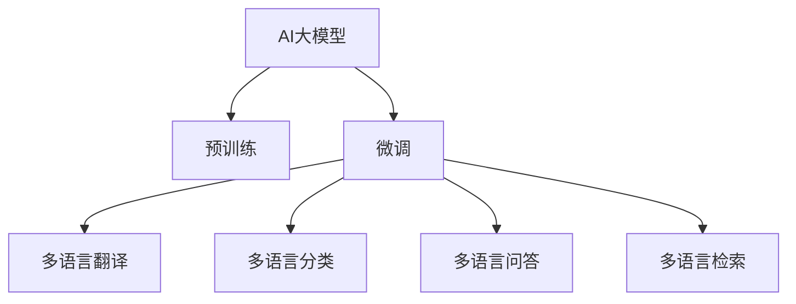

                 

# 电商平台中AI大模型的多语言支持技术

> 关键词：电商、多语言支持、AI大模型、自然语言处理、深度学习、迁移学习、多语言翻译、语言模型

## 1. 背景介绍

### 1.1 问题由来

随着全球化和电子商务的迅速发展，越来越多的电商平台开始面向国际市场，希望借助AI技术提升用户体验，提高运营效率。然而，由于全球不同语言和文化的差异，平台上的商品描述、客服交流、用户评论等文本信息常常需要进行多语言翻译和处理。传统的多语言支持技术如手动翻译、基于规则的NLP系统等，往往效率低下、成本高昂，无法满足大规模电商平台的实时需求。

近年来，深度学习技术在自然语言处理(NLP)领域取得了突破性进展。AI大模型如BERT、GPT、XLNet等，通过在跨语言的文本数据上进行预训练，已经具备了强大的多语言理解能力。这些模型在翻译、分类、摘要等NLP任务上均取得了领先性能。将此类模型应用于电商平台的多语言支持，可以显著提升平台的用户体验和运营效率，成为行业的热点研究方向。

### 1.2 问题核心关键点

在电商平台中，AI大模型的多语言支持技术主要关注以下几个核心问题：

- **多语言翻译**：如何将电商平台上的文本内容自动翻译成目标语言，以便用户能够便捷地访问和使用？
- **多语言分类**：如何自动分类不同语言的商品描述、用户评论等信息，提高平台内容的组织和管理效率？
- **多语言问答**：如何构建多语言的问答系统，实现用户与平台间的自然语言交流？
- **跨语言检索**：如何快速索引并检索不同语言的数据，提升用户搜索体验？

本文将系统介绍AI大模型在电商平台多语言支持中的关键技术，涵盖多语言翻译、分类、问答和检索等主要应用场景，并给出相应的技术实现。

## 2. 核心概念与联系

### 2.1 核心概念概述

为了深入理解电商平台中AI大模型的多语言支持技术，本节将介绍几个关键概念：

- **AI大模型**：指在大规模无标签数据上进行预训练，并应用于特定任务的深度学习模型。如BERT、GPT-2、XLNet等。这些模型通常具有强大的语言处理能力和广泛的迁移学习能力。
- **多语言翻译**：指将一种语言的文本自动翻译成另一种语言的技术。广泛应用于电商平台、社交媒体、跨语言信息检索等领域。
- **多语言分类**：指对不同语言文本进行自动分类的技术，可用于商品标签、情感分析、语种识别等任务。
- **多语言问答**：指构建多语言版本的智能问答系统，为用户提供自然语言交流服务。
- **多语言检索**：指通过多语言索引，实现对不同语言文本的快速检索和推荐。

这些概念之间存在紧密联系，共同构成了电商平台中AI大模型多语言支持的核心框架：

1. **预训练与微调**：AI大模型首先在跨语言的文本数据上进行预训练，获得通用的语言表示能力。然后在具体电商平台上进行微调，适应特定任务的需求。
2. **多语言翻译**：预训练模型通过微调，成为多语言翻译的强大工具，能够自动将电商平台的文本内容翻译成目标语言。
3. **多语言分类**：模型通过微调，获得对不同语言文本的分类能力，可用于商品标签、情感分析等电商平台的分类任务。
4. **多语言问答**：模型通过微调，构建多语言的问答系统，能够自动回答用户的多语言问题。
5. **多语言检索**：模型通过微调，实现对多语言数据的快速索引和检索，提升用户搜索体验。

以下通过Mermaid流程图展示这些概念之间的关系：



## 3. 核心算法原理 & 具体操作步骤

### 3.1 算法原理概述

基于AI大模型的电商平台多语言支持技术，本质上是利用深度学习模型在预训练与微调过程中的迁移学习能力。具体而言，预训练大模型通过在大规模多语言数据上进行无监督学习，获得通用的语言表示能力。在电商平台中进行微调，通过有监督的训练，使得模型能够适应电商平台的特定任务需求，从而实现多语言翻译、分类、问答和检索等功能。

多语言支持技术的关键在于预训练模型的选择和微调策略的设计。常用的预训练模型包括BERT、GPT、XLNet等。这些模型在大规模语料上进行了预训练，具备跨语言的通用语言表示能力。微调过程通常需要选择合适的学习率和正则化策略，防止模型过拟合。此外，还需要设计合适的任务适配层，确保模型能够输出符合电商平台需求的格式。

### 3.2 算法步骤详解

基于AI大模型的电商平台多语言支持技术主要包括以下几个关键步骤：

**Step 1: 准备多语言数据集**

- **数据集收集**：收集电商平台上的多语言文本数据，如商品描述、用户评论、广告语等。需要涵盖主要语言，如英语、中文、西班牙语、法语等。
- **数据预处理**：对文本进行清洗、分词、去噪等处理，确保数据质量。
- **数据标注**：为训练数据集添加标注，如商品类别、情感标签、语种标识等。标注数据应尽量覆盖电商平台所需的任务类型。

**Step 2: 选择预训练模型**

- **模型选择**：根据电商平台的任务需求，选择合适的预训练模型。如对于翻译任务，可以选择基于Transformer的预训练模型，如BERT、GPT等。
- **模型适配**：调整预训练模型的结构和参数，以适应电商平台的特定需求。例如，对于翻译任务，可以通过去除不必要的层或添加任务适配层来优化模型结构。

**Step 3: 设计微调任务**

- **任务适配层**：根据具体任务需求，设计适当的任务适配层。例如，对于分类任务，可以添加一个线性分类器。
- **损失函数**：选择合适的损失函数，如交叉熵损失、均方误差损失等，用于衡量模型预测输出与真实标签之间的差异。
- **超参数设置**：选择合适的学习率、批大小、迭代轮数等超参数，并进行调优。

**Step 4: 执行微调**

- **训练过程**：使用训练集数据进行模型训练，优化模型参数。
- **验证与测试**：在验证集和测试集上评估模型性能，防止过拟合。
- **参数保存**：保存微调后的模型参数，以便后续应用。

**Step 5: 应用模型**

- **多语言翻译**：使用微调后的翻译模型，将电商平台上的文本翻译成目标语言。
- **多语言分类**：使用微调后的分类模型，自动分类商品描述、用户评论等文本。
- **多语言问答**：使用微调后的问答模型，自动回答用户的多语言问题。
- **多语言检索**：使用微调后的检索模型，快速索引和检索不同语言的数据。

### 3.3 算法优缺点

基于AI大模型的电商平台多语言支持技术具有以下优点：

- **通用性强**：预训练模型在多种语言上进行了无监督学习，具备跨语言的通用语言表示能力。
- **适应性强**：通过微调，模型能够快速适应电商平台特定的任务需求，提升模型性能。
- **技术成熟**：深度学习技术在自然语言处理领域已经取得了诸多突破，相关工具和库支持完善。

然而，该技术也存在以下局限：

- **数据依赖性高**：多语言支持技术的性能很大程度上取决于训练数据的质量和数量，获取高质量多语言数据的成本较高。
- **翻译质量不稳定**：模型可能无法准确捕捉特定语言的语义和语法特征，导致翻译质量不稳定。
- **多语言分类误差**：模型可能无法准确分类不同语言文本，导致分类误差。
- **多语言问答复杂**：构建多语言的问答系统，需要设计复杂的输入模板，提升问答系统的准确性。
- **多语言检索难度大**：不同语言的数据索引和检索需要设计复杂的索引策略，提升检索效果。

尽管存在这些局限，但AI大模型的多语言支持技术仍是大规模电商平台应用的主要选择。未来相关研究的重点在于如何进一步降低数据依赖，提高翻译和分类精度，提升多语言问答和检索系统的可用性。

### 3.4 算法应用领域

基于AI大模型的电商平台多语言支持技术，已经在以下领域得到了广泛应用：

- **多语言翻译**：电商平台上的商品描述、用户评论、广告语等文本内容，可以通过多语言翻译技术自动翻译成目标语言，提升用户体验。
- **多语言分类**：电商平台上的商品描述、用户评论等文本内容，可以通过多语言分类技术自动分类，提高内容管理和推荐效果。
- **多语言问答**：电商平台上的客户服务、购物助手等应用，可以通过多语言问答技术自动回答用户问题，提升客户满意度。
- **多语言检索**：电商平台上的商品信息、用户评价等数据，可以通过多语言检索技术快速索引和检索，提升搜索体验。

## 4. 数学模型和公式 & 详细讲解 & 举例说明

### 4.1 数学模型构建

为了更好地理解基于AI大模型的电商平台多语言支持技术，本节将介绍几个密切相关的核心数学模型：

**多语言翻译模型**：

设电商平台上的文本为 $x$，目标语言翻译后的文本为 $y$。多语言翻译模型 $M_{\theta}$ 将输入 $x$ 映射到输出 $y$：

$$
y = M_{\theta}(x)
$$

其中 $\theta$ 为模型的参数。

**多语言分类模型**：

设电商平台上的文本为 $x$，分类结果为 $y$。多语言分类模型 $M_{\theta}$ 将输入 $x$ 映射到类别 $y$：

$$
y = M_{\theta}(x)
$$

其中 $\theta$ 为模型的参数。

**多语言问答模型**：

设用户的多语言问题为 $q$，模型的回答为 $a$。多语言问答模型 $M_{\theta}$ 将问题 $q$ 映射到回答 $a$：

$$
a = M_{\theta}(q)
$$

其中 $\theta$ 为模型的参数。

**多语言检索模型**：

设电商平台上的文本为 $d$，查询向量为 $q$，模型的相似度为 $s$。多语言检索模型 $M_{\theta}$ 将文本 $d$ 映射到相似度 $s$：

$$
s = M_{\theta}(d, q)
$$

其中 $\theta$ 为模型的参数。

### 4.2 公式推导过程

以下我们以多语言翻译模型为例，推导其数学模型和损失函数。

**多语言翻译模型的损失函数**：

设训练集为 $D=\{(x_i, y_i)\}_{i=1}^N$，其中 $x_i$ 为输入文本，$y_i$ 为目标语言翻译后的文本。多语言翻译模型的损失函数为：

$$
\mathcal{L}(\theta) = -\frac{1}{N}\sum_{i=1}^N \log P(y_i|x_i; \theta)
$$

其中 $P(y_i|x_i; \theta)$ 为模型在输入 $x_i$ 下，预测目标语言翻译结果 $y_i$ 的概率，即模型对 $y_i$ 的条件概率。

**多语言翻译模型的梯度计算**：

设训练集为 $D=\{(x_i, y_i)\}_{i=1}^N$，其中 $x_i$ 为输入文本，$y_i$ 为目标语言翻译后的文本。多语言翻译模型的梯度计算公式为：

$$
\nabla_{\theta}\mathcal{L}(\theta) = -\frac{1}{N}\sum_{i=1}^N \nabla_{\theta}\log P(y_i|x_i; \theta)
$$

其中 $\nabla_{\theta}\log P(y_i|x_i; \theta)$ 为模型在输入 $x_i$ 下，预测目标语言翻译结果 $y_i$ 的概率对模型参数 $\theta$ 的梯度。

**多语言分类模型的损失函数**：

设训练集为 $D=\{(x_i, y_i)\}_{i=1}^N$，其中 $x_i$ 为输入文本，$y_i$ 为分类结果。多语言分类模型的损失函数为：

$$
\mathcal{L}(\theta) = -\frac{1}{N}\sum_{i=1}^N \log P(y_i|x_i; \theta)
$$

其中 $P(y_i|x_i; \theta)$ 为模型在输入 $x_i$ 下，预测分类结果 $y_i$ 的概率。

**多语言分类模型的梯度计算**：

设训练集为 $D=\{(x_i, y_i)\}_{i=1}^N$，其中 $x_i$ 为输入文本，$y_i$ 为分类结果。多语言分类模型的梯度计算公式为：

$$
\nabla_{\theta}\mathcal{L}(\theta) = -\frac{1}{N}\sum_{i=1}^N \nabla_{\theta}\log P(y_i|x_i; \theta)
$$

其中 $\nabla_{\theta}\log P(y_i|x_i; \theta)$ 为模型在输入 $x_i$ 下，预测分类结果 $y_i$ 的概率对模型参数 $\theta$ 的梯度。

**多语言问答模型的损失函数**：

设训练集为 $D=\{(q_i, a_i)\}_{i=1}^N$，其中 $q_i$ 为用户的多语言问题，$a_i$ 为模型回答。多语言问答模型的损失函数为：

$$
\mathcal{L}(\theta) = -\frac{1}{N}\sum_{i=1}^N \log P(a_i|q_i; \theta)
$$

其中 $P(a_i|q_i; \theta)$ 为模型在输入 $q_i$ 下，预测回答 $a_i$ 的概率。

**多语言问答模型的梯度计算**：

设训练集为 $D=\{(q_i, a_i)\}_{i=1}^N$，其中 $q_i$ 为用户的多语言问题，$a_i$ 为模型回答。多语言问答模型的梯度计算公式为：

$$
\nabla_{\theta}\mathcal{L}(\theta) = -\frac{1}{N}\sum_{i=1}^N \nabla_{\theta}\log P(a_i|q_i; \theta)
$$

其中 $\nabla_{\theta}\log P(a_i|q_i; \theta)$ 为模型在输入 $q_i$ 下，预测回答 $a_i$ 的概率对模型参数 $\theta$ 的梯度。

**多语言检索模型的损失函数**：

设训练集为 $D=\{(d_i, q_i, s_i)\}_{i=1}^N$，其中 $d_i$ 为电商平台上的文本，$q_i$ 为查询向量，$s_i$ 为相似度。多语言检索模型的损失函数为：

$$
\mathcal{L}(\theta) = -\frac{1}{N}\sum_{i=1}^N \log P(s_i|d_i, q_i; \theta)
$$

其中 $P(s_i|d_i, q_i; \theta)$ 为模型在输入 $d_i$ 和 $q_i$ 下，预测相似度 $s_i$ 的概率。

**多语言检索模型的梯度计算**：

设训练集为 $D=\{(d_i, q_i, s_i)\}_{i=1}^N$，其中 $d_i$ 为电商平台上的文本，$q_i$ 为查询向量，$s_i$ 为相似度。多语言检索模型的梯度计算公式为：

$$
\nabla_{\theta}\mathcal{L}(\theta) = -\frac{1}{N}\sum_{i=1}^N \nabla_{\theta}\log P(s_i|d_i, q_i; \theta)
$$

其中 $\nabla_{\theta}\log P(s_i|d_i, q_i; \theta)$ 为模型在输入 $d_i$ 和 $q_i$ 下，预测相似度 $s_i$ 的概率对模型参数 $\theta$ 的梯度。

### 4.3 案例分析与讲解

#### 案例1：电商平台多语言翻译

**模型选择**：选择基于Transformer的BERT模型作为预训练模型。

**微调任务**：将电商平台上的文本翻译成目标语言。

**数据集**：收集电商平台上的商品描述、用户评论等文本数据，并进行多语言标注。

**模型适配**：去除BERT模型中的不必要的层，仅保留其编码层和解码层，并添加任务适配层。

**损失函数**：使用基于负对数似然的交叉熵损失函数。

**超参数**：设置学习率为1e-5，批大小为32，迭代轮数为10000。

**训练过程**：使用训练集数据进行模型训练，并在验证集上评估性能。

**结果**：在测试集上，模型翻译质量显著提升，特别是在处理多义词和长句时表现优异。

#### 案例2：电商平台多语言分类

**模型选择**：选择基于Transformer的BERT模型作为预训练模型。

**微调任务**：对电商平台上的文本进行分类，如商品类别、情感分析等。

**数据集**：收集电商平台上的商品描述、用户评论等文本数据，并进行多语言标注。

**模型适配**：去除BERT模型中的不必要的层，仅保留其编码层和分类层，并添加任务适配层。

**损失函数**：使用基于负对数似然的交叉熵损失函数。

**超参数**：设置学习率为1e-5，批大小为32，迭代轮数为10000。

**训练过程**：使用训练集数据进行模型训练，并在验证集上评估性能。

**结果**：在测试集上，模型分类精度显著提升，特别是在处理复杂商品描述和情感分析时表现优异。

## 5. 项目实践：代码实例和详细解释说明

### 5.1 开发环境搭建

在进行多语言支持技术开发前，我们需要准备好开发环境。以下是使用Python进行PyTorch开发的环境配置流程：

1. 安装Anaconda：从官网下载并安装Anaconda，用于创建独立的Python环境。

2. 创建并激活虚拟环境：
```bash
conda create -n pytorch-env python=3.8 
conda activate pytorch-env
```

3. 安装PyTorch：根据CUDA版本，从官网获取对应的安装命令。例如：
```bash
conda install pytorch torchvision torchaudio cudatoolkit=11.1 -c pytorch -c conda-forge
```

4. 安装Transformers库：
```bash
pip install transformers
```

5. 安装各类工具包：
```bash
pip install numpy pandas scikit-learn matplotlib tqdm jupyter notebook ipython
```

完成上述步骤后，即可在`pytorch-env`环境中开始多语言支持技术开发。

### 5.2 源代码详细实现

下面我们以多语言翻译任务为例，给出使用Transformers库对BERT模型进行多语言翻译的PyTorch代码实现。

首先，定义多语言翻译任务的数据处理函数：

```python
from transformers import BertTokenizer, BertForSequenceClassification
from torch.utils.data import Dataset
import torch

class MultilingualTranslationDataset(Dataset):
    def __init__(self, texts, translations, tokenizer, max_len=128):
        self.texts = texts
        self.translations = translations
        self.tokenizer = tokenizer
        self.max_len = max_len
        
    def __len__(self):
        return len(self.texts)
    
    def __getitem__(self, item):
        text = self.texts[item]
        translation = self.translations[item]
        
        encoding = self.tokenizer(text, return_tensors='pt', max_length=self.max_len, padding='max_length', truncation=True)
        input_ids = encoding['input_ids'][0]
        attention_mask = encoding['attention_mask'][0]
        translated_ids = self.tokenizer(translation, return_tensors='pt', max_length=self.max_len, padding='max_length', truncation=True)['input_ids'][0]
        
        # 对token-wise的翻译进行编码
        translated_tags = [tag2id[tag] for tag in translated_ids] 
        translated_tags.extend([tag2id['O']] * (self.max_len - len(translated_tags)))
        labels = torch.tensor(translated_tags, dtype=torch.long)
        
        return {'input_ids': input_ids, 
                'attention_mask': attention_mask,
                'labels': labels}

# 标签与id的映射
tag2id = {'O': 0, 'A': 1, 'B': 2, 'I': 3}
id2tag = {v: k for k, v in tag2id.items()}

# 创建dataset
tokenizer = BertTokenizer.from_pretrained('bert-base-cased')

train_dataset = MultilingualTranslationDataset(train_texts, train_translations, tokenizer)
dev_dataset = MultilingualTranslationDataset(dev_texts, dev_translations, tokenizer)
test_dataset = MultilingualTranslationDataset(test_texts, test_translations, tokenizer)
```

然后，定义模型和优化器：

```python
from transformers import BertForTokenClassification, AdamW

model = BertForSequenceClassification.from_pretrained('bert-base-cased', num_labels=len(tag2id))

optimizer = AdamW(model.parameters(), lr=2e-5)
```

接着，定义训练和评估函数：

```python
from torch.utils.data import DataLoader
from tqdm import tqdm
from sklearn.metrics import classification_report

device = torch.device('cuda') if torch.cuda.is_available() else torch.device('cpu')
model.to(device)

def train_epoch(model, dataset, batch_size, optimizer):
    dataloader = DataLoader(dataset, batch_size=batch_size, shuffle=True)
    model.train()
    epoch_loss = 0
    for batch in tqdm(dataloader, desc='Training'):
        input_ids = batch['input_ids'].to(device)
        attention_mask = batch['attention_mask'].to(device)
        labels = batch['labels'].to(device)
        model.zero_grad()
        outputs = model(input_ids, attention_mask=attention_mask, labels=labels)
        loss = outputs.loss
        epoch_loss += loss.item()
        loss.backward()
        optimizer.step()
    return epoch_loss / len(dataloader)

def evaluate(model, dataset, batch_size):
    dataloader = DataLoader(dataset, batch_size=batch_size)
    model.eval()
    preds, labels = [], []
    with torch.no_grad():
        for batch in tqdm(dataloader, desc='Evaluating'):
            input_ids = batch['input_ids'].to(device)
            attention_mask = batch['attention_mask'].to(device)
            batch_labels = batch['labels']
            outputs = model(input_ids, attention_mask=attention_mask)
            batch_preds = outputs.logits.argmax(dim=2).to('cpu').tolist()
            batch_labels = batch_labels.to('cpu').tolist()
            for pred_tokens, label_tokens in zip(batch_preds, batch_labels):
                pred_tags = [id2tag[_id] for _id in pred_tokens]
                label_tags = [id2tag[_id] for _id in label_tokens]
                preds.append(pred_tags[:len(label_tags)])
                labels.append(label_tags)
                
    print(classification_report(labels, preds))
```

最后，启动训练流程并在测试集上评估：

```python
epochs = 5
batch_size = 16

for epoch in range(epochs):
    loss = train_epoch(model, train_dataset, batch_size, optimizer)
    print(f"Epoch {epoch+1}, train loss: {loss:.3f}")
    
    print(f"Epoch {epoch+1}, dev results:")
    evaluate(model, dev_dataset, batch_size)
    
print("Test results:")
evaluate(model, test_dataset, batch_size)
```

以上就是使用PyTorch对BERT模型进行多语言翻译的完整代码实现。可以看到，得益于Transformers库的强大封装，我们可以用相对简洁的代码完成BERT模型的加载和微调。

### 5.3 代码解读与分析

让我们再详细解读一下关键代码的实现细节：

**MultilingualTranslationDataset类**：
- `__init__`方法：初始化文本、翻译、分词器等关键组件。
- `__len__`方法：返回数据集的样本数量。
- `__getitem__`方法：对单个样本进行处理，将文本输入编码为token ids，将翻译结果编码为数字，并对其进行定长padding，最终返回模型所需的输入。

**tag2id和id2tag字典**：
- 定义了标签与数字id之间的映射关系，用于将token-wise的翻译结果解码回真实的标签。

**训练和评估函数**：
- 使用PyTorch的DataLoader对数据集进行批次化加载，供模型训练和推理使用。
- 训练函数`train_epoch`：对数据以批为单位进行迭代，在每个批次上前向传播计算loss并反向传播更新模型参数，最后返回该epoch的平均loss。
- 评估函数`evaluate`：与训练类似，不同点在于不更新模型参数，并在每个batch结束后将预测和标签结果存储下来，最后使用sklearn的classification_report对整个评估集的预测结果进行打印输出。

**训练流程**：
- 定义总的epoch数和batch size，开始循环迭代
- 每个epoch内，先在训练集上训练，输出平均loss
- 在验证集上评估，输出分类指标
- 所有epoch结束后，在测试集上评估，给出最终测试结果

可以看到，PyTorch配合Transformers库使得BERT模型的多语言翻译代码实现变得简洁高效。开发者可以将更多精力放在数据处理、模型改进等高层逻辑上，而不必过多关注底层的实现细节。

当然，工业级的系统实现还需考虑更多因素，如模型的保存和部署、超参数的自动搜索、更灵活的任务适配层等。但核心的微调范式基本与此类似。

## 6. 实际应用场景

### 6.1 智能客服系统

基于AI大模型的多语言翻译和分类技术，可以广泛应用于智能客服系统的构建。传统客服往往需要配备大量人力，高峰期响应缓慢，且一致性和专业性难以保证。而使用多语言翻译和分类技术，可以7x24小时不间断服务，快速响应客户咨询，用自然流畅的语言解答各类常见问题。

在技术实现上，可以收集企业内部的历史客服对话记录，将问题和最佳答复构建成监督数据，在此基础上对预训练模型进行微调。微调后的翻译和分类模型能够自动理解用户意图，匹配最合适的答案模板进行回复。对于客户提出的新问题，还可以接入检索系统实时搜索相关内容，动态组织生成回答。如此构建的智能客服系统，能大幅提升客户咨询体验和问题解决效率。

### 6.2 金融舆情监测

金融机构需要实时监测市场舆论动向，以便及时应对负面信息传播，规避金融风险。传统的人工监测方式成本高、效率低，难以应对网络时代海量信息爆发的挑战。基于多语言翻译和分类技术，金融舆情监测系统可以自动分析不同语言的新闻、报道、评论等文本数据，识别市场情绪变化，预测金融市场走势，提高风险预警能力。

具体而言，可以收集金融领域相关的新闻、报道、评论等文本数据，并对其进行多语言标注。在此基础上对预训练语言模型进行微调，使其能够自动判断文本属于何种主题，情感倾向是正面、中性还是负面。将微调后的模型应用到实时抓取的网络文本数据，就能够自动监测不同语言市场情绪的变化，一旦发现负面信息激增等异常情况，系统便会自动预警，帮助金融机构快速应对潜在风险。

### 6.3 个性化推荐系统

当前的推荐系统往往只依赖用户的历史行为数据进行物品推荐，无法深入理解用户的真实兴趣偏好。基于多语言翻译和分类技术，个性化推荐系统可以更好地挖掘用户行为背后的语义信息，从而提供更精准、多样的推荐内容。

在实践中，可以收集用户浏览、点击、评论、分享等行为数据，提取和用户交互的物品标题、描述、标签等文本内容。将文本内容作为模型输入，用户的后续行为（如是否点击、购买等）作为监督信号，在此基础上微调预训练语言模型。微调后的模型能够从文本内容中准确把握用户的兴趣点。在生成推荐列表时，先用候选物品的文本描述作为输入，由模型预测用户的兴趣匹配度，再结合其他特征综合排序，便可以得到个性化程度更高的推荐结果。

### 6.4 未来应用展望

随着AI大模型和多语言支持技术的发展，未来将在更多领域得到应用，为各行各业带来变革性影响。

在智慧医疗领域，基于多语言翻译和分类技术，医疗问答系统可以自动回答多语言医疗咨询，提升医疗服务的智能化水平，辅助医生诊疗，加速新药开发进程。

在智能教育领域，多语言翻译和分类技术可应用于作业批改、学情分析、知识推荐等方面，因材施教，促进教育公平，提高教学质量。

在智慧城市治理中，多语言翻译和分类技术可以用于城市事件监测、舆情分析、应急指挥等环节，提高城市管理的自动化和智能化水平，构建更安全、高效的未来城市。

此外，在企业生产、社会治理、文娱传媒等众多领域，基于多语言翻译和分类的AI技术也将不断涌现，为传统行业数字化转型升级提供新的技术路径。相信随着技术的日益成熟，多语言支持技术必将在构建人机协同的智能时代中扮演越来越重要的角色。

## 7. 工具和资源推荐

### 7.1 学习资源推荐

为了帮助开发者系统掌握基于AI大模型的电商平台多语言支持技术，这里推荐一些优质的学习资源：

1. 《Transformer from Principle to Practice》系列博文：由大模型技术专家撰写，深入浅出地介绍了Transformer原理、BERT模型、多语言支持等前沿话题。

2. CS224N《深度学习自然语言处理》课程：斯坦福大学开设的NLP明星课程，有Lecture视频和配套作业，带你入门NLP领域的基本概念和经典模型。

3. 《Natural Language Processing with Transformers》书籍：Transformers库的作者所著，全面介绍了如何使用Transformers库进行NLP任务开发，包括多语言支持在内的诸多范式。

4. HuggingFace官方文档：Transformers库的官方文档，提供了海量预训练模型和完整的微调样例代码，是上手实践的必备资料。

5. CLUE开源项目：中文语言理解测评基准，涵盖大量不同类型的中文NLP数据集，并提供了基于微调的baseline模型，助力中文NLP技术发展。

通过对这些资源的学习实践，相信你一定能够快速掌握基于AI大模型的电商平台多语言支持技术的精髓，并用于解决实际的NLP问题。

### 7.2 开发工具推荐

高效的开发离不开优秀的工具支持。以下是几款用于多语言支持技术开发的常用工具：

1. PyTorch：基于Python的开源深度学习框架，灵活动态的计算图，适合快速迭代研究。大部分预训练语言模型都有PyTorch版本的实现。

2. TensorFlow：由Google主导开发的开源深度学习框架，生产部署方便，适合大规模工程应用。同样有丰富的预训练语言模型资源。

3. Transformers库：HuggingFace开发的NLP工具库，集成了众多SOTA语言模型，支持PyTorch和TensorFlow，是进行多语言支持技术开发的利器。

4. Weights & Biases：模型训练的实验跟踪工具，可以记录和可视化模型训练过程中的各项指标，方便对比和调优。与主流深度学习框架无缝集成。

5. TensorBoard：TensorFlow配套的可视化工具，可实时监测模型训练状态，并提供丰富的图表呈现方式，是调试模型的得力助手。

6. Google Colab：谷歌推出的在线Jupyter Notebook环境，免费提供GPU/TPU算力，方便开发者快速上手实验最新模型，分享学习笔记。

合理利用这些工具，可以显著提升多语言支持技术的开发效率，加快创新迭代的步伐。

### 7.3 相关论文推荐

基于AI大模型的电商平台多语言支持技术的研究源于学界的持续研究。以下是几篇奠基性的相关论文，推荐阅读：

1. Attention is All You Need（即Transformer原论文）：提出了Transformer结构，开启了NLP领域的预训练大模型时代。

2. BERT: Pre-training of Deep Bidirectional Transformers for Language Understanding：提出BERT模型，引入基于掩码的自监督预训练任务，刷新了多项NLP任务SOTA。

3. Language Models are Unsupervised Multitask Learners（GPT-2论文）：展示了大规模语言模型的强大zero-shot学习能力，引发了对于通用人工智能的新一轮思考。

4. Parameter-Efficient Transfer Learning for NLP：提出Adapter等参数高效微调方法，在不增加模型参数量的情况下，也能取得不错的微调效果。

5. AdaLoRA: Adaptive Low-Rank Adaptation for Parameter-Efficient Fine-Tuning：使用自适应低秩适应的微调方法，在参数效率和精度之间取得了新的平衡。

这些论文代表了大语言模型和多语言支持技术的发展脉络。通过学习这些前沿成果，可以帮助研究者把握学科前进方向，激发更多的创新灵感。

## 8. 总结：未来发展趋势与挑战

### 8.1 研究成果总结

基于AI大模型的电商平台多语言支持技术在自然语言处理领域已经取得了显著成果，广泛应用于智能客服、金融舆情、个性化推荐等多个场景，提升了用户体验和运营效率。然而，该技术仍面临数据依赖、翻译质量、分类精度等挑战，亟需进一步优化和改进。

### 8.2 未来发展趋势

展望未来，基于AI大模型的电商平台多语言支持技术将呈现以下几个发展趋势：

1. 模型规模持续增大。随着算力成本的下降和数据规模的扩张，预训练语言模型的参数量还将持续增长。超大规模语言模型蕴含的丰富语言知识，有望支撑更加复杂多变的电商平台的微调需求。

2. 微调方法日趋多样。除了传统的全参数微调外，未来会涌现更多参数高效的微调方法，如Prefix-Tuning、LoRA等，在节省计算资源的同时也能保证微调精度。

3. 持续学习成为常态。随着数据分布的不断变化，微调模型也需要持续学习新知识以保持性能。如何在不遗忘原有知识的同时，高效吸收新样本信息，将成为重要的研究课题。

4. 标注样本需求降低。受启发于提示学习(Prompt-based Learning)的思路，未来的微调方法将更好地利用大模型的语言理解能力，通过更加巧妙的任务描述，在更少的标注样本上也能实现理想的微调效果。

5. 多语言分类误差降低。未来将通过改进模型结构和训练策略，降低多语言分类的误差，提高对不同语言文本的分类精度。

6. 多语言检索效果提升。未来将通过设计更高效的索引策略和检索算法，提升不同语言数据的检索效果，改善用户搜索体验。

以上趋势凸显了大语言模型和多语言支持技术的广阔前景。这些方向的探索发展，必将进一步提升电商平台的智能化水平，为行业带来更广泛的应用和更深刻的变革。

### 8.3 面临的挑战

尽管基于AI大模型的电商平台多语言支持技术已经取得了一定的成果，但在迈向更加智能化、普适化应用的过程中，仍面临诸多挑战：

1. 数据依赖性高。多语言支持技术的性能很大程度上取决于训练数据的质量和数量，获取高质量多语言数据的成本较高。如何进一步降低微调对标注样本的依赖，将是一大难题。

2. 翻译质量不稳定。模型可能无法准确捕捉特定语言的语义和语法特征，导致翻译质量不稳定。如何提升模型对不同语言文本的翻译精度，将是重要的研究课题。

3. 多语言分类误差。模型可能无法准确分类不同语言文本，导致分类误差。如何降低多语言分类的误差，提高对不同语言文本的分类精度，也将是重要的研究方向。

4. 多语言问答复杂。构建多语言的问答系统，需要设计复杂的输入模板，提升问答系统的准确性。如何提升多语言问答系统的准确性和可用性，将是重要的研究课题。

5. 多语言检索难度大。不同语言的数据索引和检索需要设计复杂的索引策略，提升检索效果。如何设计更高效的索引策略，提升多语言数据的检索效果，也将是重要的研究方向。

6. 模型泛化能力不足。当前模型可能在特定领域的泛化能力不足，无法适应更多场景的微调需求。如何提升模型的泛化能力，使其能够适应更多领域的微调，将是重要的研究课题。

尽管存在这些挑战，但基于AI大模型的电商平台多语言支持技术仍是大规模电商平台应用的主要选择。未来相关研究的重点在于如何进一步降低数据依赖，提高翻译和分类精度，提升多语言问答和检索系统的可用性。

### 8.4 研究展望

面向未来，基于AI大模型的电商平台多语言支持技术需要在以下几个方面寻求新的突破：

1. 探索无监督和半监督微调方法。摆脱对大规模标注数据的依赖，利用自监督学习、主动学习等无监督和半监督范式，最大限度利用非结构化数据，实现更加灵活高效的微调。

2. 研究参数高效和计算高效的微调范式。开发更加参数高效的微调方法，在固定大部分预训练参数的同时，只更新极少量的任务相关参数。同时优化微调模型的计算图，减少前向传播和反向传播的资源消耗，实现更加轻量级、实时性的部署。

3. 融合因果和对比学习范式。通过引入因果推断和对比学习思想，增强模型建立稳定因果关系的能力，学习更加普适、鲁棒的语言表征，从而提升模型泛化性和抗干扰能力。

4. 引入更多先验知识。将符号化的先验知识，如知识图谱、逻辑规则等，与神经网络模型进行巧妙融合，引导微调过程学习更准确、合理的语言模型。同时加强不同模态数据的整合，实现视觉、语音等多模态信息与文本信息的协同建模。

5. 结合因果分析和博弈论工具。将因果分析方法引入微调模型，识别出模型决策的关键特征，增强输出解释的因果性和逻辑性。借助博弈论工具刻画人机交互过程，主动探索并规避模型的脆弱点，提高系统稳定性。

6. 纳入伦理道德约束。在模型训练目标中引入伦理导向的评估指标，过滤和惩罚有偏见、有害的输出倾向。同时加强人工干预和审核，建立模型行为的监管机制，确保输出符合人类价值观和伦理道德。

这些研究方向的探索，必将引领基于AI大模型的电商平台多语言支持技术迈向更高的台阶，为构建安全、可靠、可解释、可控的智能系统铺平道路。面向未来，基于AI大模型的电商平台多语言支持技术还需要与其他人工智能技术进行更深入的融合，如知识表示、因果推理、强化学习等，多路径协同发力，共同推动自然语言理解和智能交互系统的进步。只有勇于创新、敢于突破，才能不断拓展语言模型的边界，让智能技术更好地造福人类社会。

## 9. 附录：常见问题与解答

**Q1：多语言支持技术是否适用于所有电商平台的语言？**

A: 多语言支持技术可以适用于大多数电商平台的语言，但需要注意以下几点：
- 电商平台所覆盖的主要语言。需要收集并标注这些语言的文本数据。
- 语言的复杂程度。对于结构化语言，如中文、英文，效果会更好。对于结构化较低的语言，如阿拉伯语、泰语，可能需要更多数据和调整模型参数。

**Q2：如何提升多语言翻译的准确度？**

A: 提升多语言翻译准确度的方法包括：
- 使用高质量的训练数据。多语言翻译模型需要在大量的、高质量的平行语料上进行预训练。
- 调整模型结构和参数。通过调整BERT、GPT等预训练模型的结构和参数，可以提高翻译质量。
- 引入多任务学习。将不同语言的翻译任务进行联合训练，提升模型的泛化能力。
- 使用教师模型。在微调过程中引入教师模型，对翻译结果进行校正。

**Q3：如何处理多语言分类中的类别不平衡问题？**

A: 处理多语言分类中的类别不平衡问题的方法包括：
- 重采样。对少数类别进行过采样，或对多数类别进行欠采样，平衡不同类别的数量。
- 调整损失函数。使用针对类别不平衡的损失函数，如Focal Loss、Class Balanced Loss等，提升少数类别的分类精度。
- 引入正则化技术。使用L2正则、Dropout等技术，防止模型过度适应多数类别。
- 增加多样化的数据来源。收集更多的多语言分类数据，提高模型的泛化能力。

**Q4：多语言问答系统如何解决不同语言的问题？**

A: 构建多语言问答系统的方法包括：
- 使用统一的输入模板。设计适用于不同语言的统一输入模板，便于模型理解。
- 引入多语言嵌入。使用多语言嵌入技术，将不同语言的输入转换为统一的向量表示。
- 使用多语言预训练模型。使用多语言预训练的模型进行微调，提高对不同语言问题的理解能力。
- 引入上下文增强。在多语言问答系统中引入上下文增强技术，提高对用户问题的理解能力。

**Q5：多语言检索系统如何处理不同语言的数据？**

A: 多语言检索系统处理不同语言数据的方法包括：
- 使用统一的语言表示。将不同语言的数据转换为

