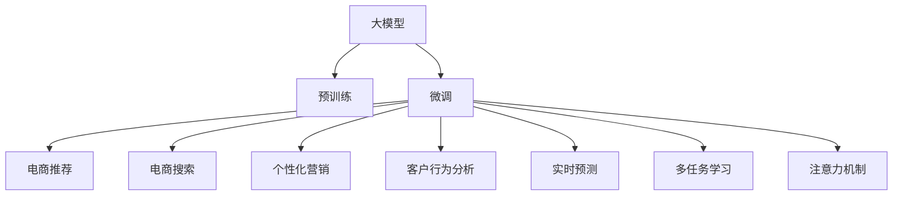

                 

# 电商平台中的AI大模型：从单一推荐到全场景智能化

> 关键词：AI大模型, 电商推荐, 全场景智能化, 电商搜索, 商品相关性匹配, 营销个性化, 客户行为分析, 实时预测

## 1. 背景介绍

### 1.1 问题由来

在电商平台中，AI大模型被广泛应用在推荐、搜索、营销、客户分析等各个环节。随着消费者行为模式的不断变化和数据量的激增，单一的推荐系统已无法满足用户的多样化需求。为应对这一挑战，电商平台开始引入AI大模型，实现全场景智能化，提升用户体验和销售转化。

近年来，大模型在电商场景中的应用不断深入，从最初的单一推荐，发展到全场景的搜索、个性化营销、客户行为分析等多个方面，展示了其在处理复杂电商数据和提升用户体验方面的巨大潜力。然而，大模型在电商中的全面应用仍面临诸多挑战，如多任务间的协调、算力资源的优化、数据隐私保护等，这些问题亟需解决。

### 1.2 问题核心关键点

大模型在电商场景中的应用主要集中在以下几个方面：

1. **电商推荐系统**：通过分析用户历史行为和实时数据，生成个性化推荐。
2. **电商搜索系统**：通过语义理解，精确匹配商品和搜索意图。
3. **个性化营销**：根据用户画像，定制个性化广告和促销信息。
4. **客户行为分析**：分析用户行为数据，挖掘潜在需求。
5. **实时预测**：通过预测模型，预判用户行为和市场趋势。

### 1.3 问题研究意义

大模型在电商中的全场景智能化应用，能够显著提升平台的运营效率和用户体验。具体来说，其研究意义主要体现在：

1. **提升用户满意度**：通过个性化推荐和搜索优化，满足用户多样化需求，提升购买体验。
2. **提高转化率**：精准匹配商品和广告，增加用户购买决策的可能性。
3. **优化库存管理**：通过需求预测，减少库存积压和缺货情况。
4. **增强用户忠诚度**：通过个性化服务和精准营销，增强用户粘性。
5. **数据驱动决策**：依托用户行为数据，实现业务决策的数据驱动化。

本文将从核心概念、算法原理、项目实践、应用场景、工具推荐、总结展望等方面，全面系统地介绍AI大模型在电商平台中的应用，希望能为电商平台的智能化转型提供有价值的参考。

## 2. 核心概念与联系

### 2.1 核心概念概述

为了更好地理解AI大模型在电商平台中的应用，我们先介绍几个关键概念：

1. **大模型（Large Model）**：指具有海量参数的深度神经网络模型，通过在大规模无标签数据上进行预训练，学习到丰富的知识表示。
2. **预训练（Pre-training）**：在大规模无标签数据上，通过自监督学习任务训练模型，使其具备通用的特征提取能力。
3. **微调（Fine-tuning）**：在预训练模型的基础上，通过有监督学习任务优化模型，使其适应特定任务。
4. **迁移学习（Transfer Learning）**：将一个领域学到的知识迁移到另一个相关领域的策略，如将预训练模型的特征提取能力应用于电商推荐系统。
5. **多任务学习（Multi-task Learning）**：在同一模型中，同时学习多个任务，共享底层特征提取器，提高模型的泛化能力和效率。
6. **注意力机制（Attention Mechanism）**：通过计算不同输入之间的相关性，提高模型对输入的关注度，增强特征提取能力。

这些概念相互关联，共同构成了AI大模型在电商中的应用框架。以下是一个简化的Mermaid流程图，展示了这些概念之间的联系：



### 2.2 核心概念原理和架构

#### 大模型

大模型通过在大规模无标签数据上进行预训练，学习到丰富的知识表示。常见的预训练模型包括BERT、GPT系列、T5等。

- **BERT**：通过掩码语言模型（Masked Language Modeling, MLM）和下一句预测（Next Sentence Prediction, NSP）任务，学习到词汇和句子的语义表示。
- **GPT系列**：采用自回归生成模型，通过自回归的方式预测下一个词汇，学习到语言序列的生成能力。
- **T5**：基于Transformer结构，可以执行多种自然语言处理任务，如问答、翻译、摘要等。

#### 预训练

预训练过程通常在大规模语料库上进行，如Web数据、新闻、书籍等。常见的预训练任务包括：

- 掩码语言模型（MLM）：在输入序列中随机遮盖部分词汇，让模型预测被遮盖的词汇。
- 下一句预测（NSP）：判断两个句子是否连续。
- 句子分类（Sentence Classification）：对句子进行情感、主题等分类。
- 语言模型（LM）：预测下一个词汇或序列。

通过预训练，模型学习到丰富的语言表示，能够用于多种下游任务。

#### 微调

微调是在预训练模型的基础上，通过有监督学习任务优化模型，使其适应特定任务。常见的微调任务包括：

- 电商推荐：根据用户历史行为和实时数据，生成个性化推荐。
- 电商搜索：通过语义理解，精确匹配商品和搜索意图。
- 个性化营销：根据用户画像，定制个性化广告和促销信息。
- 客户行为分析：分析用户行为数据，挖掘潜在需求。
- 实时预测：通过预测模型，预判用户行为和市场趋势。

微调过程一般包括以下步骤：

1. 准备预训练模型和数据集：选择合适的预训练模型，准备下游任务的标注数据集。
2. 添加任务适配层：根据任务类型，设计合适的输出层和损失函数。
3. 设置微调超参数：选择合适的优化算法及其参数，如学习率、批大小、迭代轮数等。
4. 执行梯度训练：将训练集数据分批次输入模型，前向传播计算损失函数。
5. 周期性在验证集上评估模型性能：根据性能指标决定是否触发Early Stopping。
6. 重复上述步骤直至满足预设的迭代轮数或Early Stopping条件。
7. 测试和部署：在测试集上评估微调后模型性能，使用微调后的模型对新样本进行推理预测，集成到实际应用系统中。

#### 迁移学习

迁移学习是将预训练模型的特征提取能力应用于下游任务的策略。电商场景中的迁移学习主要体现在以下几个方面：

1. 跨领域迁移：将通用大模型在多个电商领域中应用，提升模型的泛化能力和适应性。
2. 多任务迁移：在同一模型中同时学习多个电商任务，共享底层特征提取器，提高模型的效率和性能。
3. 多维度迁移：将用户画像、行为数据、产品信息等多个维度的数据进行联合分析，提升模型的准确性和全面性。

#### 多任务学习

多任务学习是一种在同一个模型中同时学习多个任务的方法，共享底层特征提取器，提升模型的泛化能力和效率。电商场景中的多任务学习主要体现在以下几个方面：

1. 推荐-搜索协同：推荐系统和搜索系统共享底层特征提取器，提升系统的协同性和效率。
2. 推荐-营销协同：推荐系统和个性化营销系统共享底层特征提取器，提升广告的精准度和转化率。
3. 推荐-预测协同：推荐系统和需求预测模型共享底层特征提取器，提升库存管理的效率和准确性。

#### 注意力机制

注意力机制是一种通过计算输入之间的相关性，提高模型对输入的关注度的技术。电商场景中的注意力机制主要体现在以下几个方面：

1. 用户行为注意力：根据用户的行为轨迹，计算不同行为之间的相关性，提升推荐系统的个性化程度。
2. 商品特征注意力：根据商品的描述、属性、评价等信息，计算商品之间的相关性，提升搜索系统的准确性。
3. 广告点击注意力：根据用户的点击行为，计算广告和用户之间的相关性，提升广告的转化率。

## 3. 核心算法原理 & 具体操作步骤

### 3.1 算法原理概述

基于大模型的电商应用，本质上是一种多任务的特征学习和模型优化过程。其核心思想是：将大模型作为一个强大的特征提取器，通过有监督学习任务对特征进行优化，使其适应特定的电商场景。

假设预训练模型为 $M_{\theta}$，其中 $\theta$ 为预训练得到的模型参数。给定电商场景中的多任务 $T=\{T_1, T_2, \cdots, T_n\}$ 的标注数据集 $D=\{(x_i, y_i)\}_{i=1}^N$，微调的目标是找到新的模型参数 $\hat{\theta}$，使得：

$$
\hat{\theta}=\mathop{\arg\min}_{\theta} \mathcal{L}(M_{\theta}, D)
$$

其中 $\mathcal{L}$ 为针对任务 $T$ 设计的损失函数，用于衡量模型预测输出与真实标签之间的差异。常见的损失函数包括交叉熵损失、均方误差损失等。

通过梯度下降等优化算法，微调过程不断更新模型参数 $\theta$，最小化损失函数 $\mathcal{L}$，使得模型输出逼近真实标签。由于 $\theta$ 已经通过预训练获得了较好的初始化，因此即便在多个任务上，微调模型也能较快收敛到理想的模型参数 $\hat{\theta}$。

### 3.2 算法步骤详解

基于大模型的电商应用，一般包括以下关键步骤：

**Step 1: 准备预训练模型和数据集**
- 选择合适的预训练模型 $M_{\theta}$ 作为初始化参数，如 BERT、GPT系列、T5等。
- 准备电商场景中的多任务 $T=\{T_1, T_2, \cdots, T_n\}$ 的标注数据集 $D=\{(x_i, y_i)\}_{i=1}^N$，划分为训练集、验证集和测试集。一般要求标注数据与预训练数据的分布不要差异过大。

**Step 2: 添加任务适配层**
- 根据电商任务类型，设计合适的输出层和损失函数。
- 对于推荐任务，通常在顶层添加线性分类器，并使用交叉熵损失。
- 对于搜索任务，通常使用语义匹配模块，并使用分类损失或序列匹配损失。
- 对于个性化营销任务，通常使用CTC损失或序列生成损失。
- 对于客户行为分析任务，通常使用回归损失或序列生成损失。
- 对于实时预测任务，通常使用回归损失或分类损失。

**Step 3: 设置微调超参数**
- 选择合适的优化算法及其参数，如 AdamW、SGD 等，设置学习率、批大小、迭代轮数等。
- 设置正则化技术及强度，包括权重衰减、Dropout、Early Stopping 等。
- 确定冻结预训练参数的策略，如仅微调顶层，或全部参数都参与微调。

**Step 4: 执行梯度训练**
- 将训练集数据分批次输入模型，前向传播计算损失函数。
- 反向传播计算参数梯度，根据设定的优化算法和学习率更新模型参数。
- 周期性在验证集上评估模型性能，根据性能指标决定是否触发 Early Stopping。
- 重复上述步骤直至满足预设的迭代轮数或 Early Stopping 条件。

**Step 5: 测试和部署**
- 在测试集上评估微调后模型性能，对比微调前后的精度提升。
- 使用微调后的模型对新样本进行推理预测，集成到实际应用系统中。
- 持续收集新的数据，定期重新微调模型，以适应数据分布的变化。

### 3.3 算法优缺点

基于大模型的电商应用具有以下优点：

1. **简单高效**：只需准备少量标注数据，即可对预训练模型进行快速适配，获得较大的性能提升。
2. **通用适用**：适用于电商场景中的多种任务，如推荐、搜索、个性化营销等，设计简单的任务适配层即可实现微调。
3. **参数高效**：利用参数高效微调技术，在固定大部分预训练参数的情况下，仍可取得不错的提升。
4. **效果显著**：在学术界和工业界的诸多电商任务上，基于微调的方法已经刷新了最先进的性能指标。

同时，该方法也存在一定的局限性：

1. **依赖标注数据**：微调的效果很大程度上取决于标注数据的质量和数量，获取高质量标注数据的成本较高。
2. **迁移能力有限**：当目标任务与预训练数据的分布差异较大时，微调的性能提升有限。
3. **负面效果传递**：预训练模型的固有偏见、有害信息等，可能通过微调传递到下游任务，造成负面影响。
4. **可解释性不足**：微调模型的决策过程通常缺乏可解释性，难以对其推理逻辑进行分析和调试。

尽管存在这些局限性，但就目前而言，基于监督学习的微调方法仍是大模型应用的最主流范式。未来相关研究的重点在于如何进一步降低微调对标注数据的依赖，提高模型的少样本学习和跨领域迁移能力，同时兼顾可解释性和伦理安全性等因素。

### 3.4 算法应用领域

基于大模型的电商应用，已经广泛应用于多个电商领域，例如：

1. **推荐系统**：通过分析用户历史行为和实时数据，生成个性化推荐。
2. **搜索系统**：通过语义理解，精确匹配商品和搜索意图。
3. **个性化营销**：根据用户画像，定制个性化广告和促销信息。
4. **客户行为分析**：分析用户行为数据，挖掘潜在需求。
5. **实时预测**：通过预测模型，预判用户行为和市场趋势。

除了上述这些经典任务外，大模型在电商中的创新应用还包括：

- **商品推荐与搜索协同**：推荐系统和搜索系统共享底层特征提取器，提升系统的协同性和效率。
- **广告点击率预测**：利用大模型进行广告点击率预测，提升广告投放的精准度和效果。
- **库存管理优化**：利用大模型进行需求预测，优化库存管理，减少库存积压和缺货情况。
- **用户行为分析与预测**：利用大模型进行用户行为分析，预测用户行为和潜在需求，提升个性化服务。
- **跨平台推荐**：利用大模型进行跨平台推荐，提升不同平台之间的用户粘性和交易转化率。

## 4. 数学模型和公式 & 详细讲解 & 举例说明

### 4.1 数学模型构建

假设电商场景中的推荐任务 $T_1$ 的标注数据集为 $D_1=\{(x_i, y_i)\}_{i=1}^N$，其中 $x_i$ 为输入的推荐请求，$y_i$ 为推荐的商品 ID。微调的目标是找到新的模型参数 $\hat{\theta}$，使得推荐系统能够最大化预测准确率：

$$
\hat{\theta}=\mathop{\arg\min}_{\theta} \mathcal{L}(M_{\theta}, D_1)
$$

其中 $\mathcal{L}$ 为推荐任务的损失函数。假设推荐系统使用线性分类器进行预测，则损失函数为：

$$
\mathcal{L}(M_{\theta}, D_1) = \frac{1}{N} \sum_{i=1}^N \ell(M_{\theta}(x_i), y_i)
$$

其中 $\ell$ 为交叉熵损失函数。

### 4.2 公式推导过程

以下我们以推荐任务为例，推导交叉熵损失函数及其梯度的计算公式。

假设推荐系统在输入 $x_i$ 上的输出为 $\hat{y}=M_{\theta}(x_i) \in [0,1]$，表示模型预测推荐商品的ID的概率。真实标签 $y_i \in [1, C]$，其中 $C$ 为商品总数。则交叉熵损失函数定义为：

$$
\ell(M_{\theta}(x_i), y_i) = -\sum_{j=1}^C y_{ij}\log M_{\theta}(j|x_i) + (1-y_{ij})\log(1-M_{\theta}(j|x_i))
$$

将其代入经验风险公式，得：

$$
\mathcal{L}(\theta) = -\frac{1}{N}\sum_{i=1}^N \sum_{j=1}^C y_{ij}\log M_{\theta}(j|x_i) + (1-y_{ij})\log(1-M_{\theta}(j|x_i))
$$

根据链式法则，损失函数对参数 $\theta_k$ 的梯度为：

$$
\frac{\partial \mathcal{L}(\theta)}{\partial \theta_k} = -\frac{1}{N}\sum_{i=1}^N \sum_{j=1}^C y_{ij}\frac{\partial M_{\theta}(j|x_i)}{\partial \theta_k} - (1-y_{ij})\frac{\partial M_{\theta}(j|x_i)}{\partial \theta_k}
$$

其中 $\frac{\partial M_{\theta}(j|x_i)}{\partial \theta_k}$ 可进一步递归展开，利用自动微分技术完成计算。

在得到损失函数的梯度后，即可带入参数更新公式，完成模型的迭代优化。重复上述过程直至收敛，最终得到适应电商推荐任务的最优模型参数 $\hat{\theta}$。

## 5. 项目实践：代码实例和详细解释说明

### 5.1 开发环境搭建

在进行电商应用的微调实践前，我们需要准备好开发环境。以下是使用Python进行PyTorch开发的环境配置流程：

1. 安装Anaconda：从官网下载并安装Anaconda，用于创建独立的Python环境。

2. 创建并激活虚拟环境：
```bash
conda create -n pytorch-env python=3.8 
conda activate pytorch-env
```

3. 安装PyTorch：根据CUDA版本，从官网获取对应的安装命令。例如：
```bash
conda install pytorch torchvision torchaudio cudatoolkit=11.1 -c pytorch -c conda-forge
```

4. 安装Transformers库：
```bash
pip install transformers
```

5. 安装各类工具包：
```bash
pip install numpy pandas scikit-learn matplotlib tqdm jupyter notebook ipython
```

完成上述步骤后，即可在`pytorch-env`环境中开始微调实践。

### 5.2 源代码详细实现

这里我们以电商推荐任务为例，给出使用Transformers库对BERT模型进行微调的PyTorch代码实现。

首先，定义推荐任务的数据处理函数：

```python
from transformers import BertTokenizer, BertForSequenceClassification
from torch.utils.data import Dataset, DataLoader
import torch

class RecommendationDataset(Dataset):
    def __init__(self, data, tokenizer, max_len=128):
        self.data = data
        self.tokenizer = tokenizer
        self.max_len = max_len
        
    def __len__(self):
        return len(self.data)
    
    def __getitem__(self, item):
        user_item = self.data[item]
        user_id, item_id = user_item[0], user_item[1]
        user_tokens = self.tokenizer([str(user_id)], return_tensors='pt', max_length=self.max_len, padding='max_length', truncation=True)
        item_tokens = self.tokenizer([str(item_id)], return_tensors='pt', max_length=self.max_len, padding='max_length', truncation=True)
        user_input_ids = user_tokens['input_ids'].flatten()
        item_input_ids = item_tokens['input_ids'].flatten()
        attention_mask = torch.ones_like(user_input_ids)
        return {'user_input_ids': user_input_ids, 'item_input_ids': item_input_ids, 'attention_mask': attention_mask}
```

然后，定义模型和优化器：

```python
from transformers import AdamW

model = BertForSequenceClassification.from_pretrained('bert-base-cased', num_labels=1)

optimizer = AdamW(model.parameters(), lr=2e-5)
```

接着，定义训练和评估函数：

```python
from sklearn.metrics import accuracy_score

device = torch.device('cuda') if torch.cuda.is_available() else torch.device('cpu')
model.to(device)

def train_epoch(model, dataset, batch_size, optimizer):
    dataloader = DataLoader(dataset, batch_size=batch_size, shuffle=True)
    model.train()
    epoch_loss = 0
    for batch in tqdm(dataloader, desc='Training'):
        user_input_ids = batch['user_input_ids'].to(device)
        item_input_ids = batch['item_input_ids'].to(device)
        attention_mask = batch['attention_mask'].to(device)
        model.zero_grad()
        outputs = model(user_input_ids, item_input_ids, attention_mask=attention_mask)
        loss = outputs.loss
        epoch_loss += loss.item()
        loss.backward()
        optimizer.step()
    return epoch_loss / len(dataloader)

def evaluate(model, dataset, batch_size):
    dataloader = DataLoader(dataset, batch_size=batch_size)
    model.eval()
    preds, labels = [], []
    with torch.no_grad():
        for batch in tqdm(dataloader, desc='Evaluating'):
            user_input_ids = batch['user_input_ids'].to(device)
            item_input_ids = batch['item_input_ids'].to(device)
            attention_mask = batch['attention_mask'].to(device)
            batch_labels = torch.tensor([1.0] * len(batch)).to(device)
            outputs = model(user_input_ids, item_input_ids, attention_mask=attention_mask)
            batch_preds = outputs.logits.sigmoid().flatten().tolist()
            batch_labels = batch_labels.flatten().tolist()
            for pred, label in zip(batch_preds, batch_labels):
                preds.append(pred)
                labels.append(label)
                
    return accuracy_score(labels, preds)
```

最后，启动训练流程并在测试集上评估：

```python
epochs = 5
batch_size = 16

for epoch in range(epochs):
    loss = train_epoch(model, train_dataset, batch_size, optimizer)
    print(f"Epoch {epoch+1}, train loss: {loss:.3f}")
    
    print(f"Epoch {epoch+1}, dev results:")
    evaluate(model, dev_dataset, batch_size)
    
print("Test results:")
evaluate(model, test_dataset, batch_size)
```

以上就是使用PyTorch对BERT进行电商推荐任务微调的完整代码实现。可以看到，得益于Transformers库的强大封装，我们可以用相对简洁的代码完成BERT模型的加载和微调。

### 5.3 代码解读与分析

让我们再详细解读一下关键代码的实现细节：

**RecommendationDataset类**：
- `__init__`方法：初始化用户ID、商品ID、分词器等关键组件。
- `__len__`方法：返回数据集的样本数量。
- `__getitem__`方法：对单个样本进行处理，将用户ID和商品ID输入编码为token ids，并对其进行定长padding，最终返回模型所需的输入。

**训练和评估函数**：
- 使用PyTorch的DataLoader对数据集进行批次化加载，供模型训练和推理使用。
- 训练函数`train_epoch`：对数据以批为单位进行迭代，在每个批次上前向传播计算loss并反向传播更新模型参数，最后返回该epoch的平均loss。
- 评估函数`evaluate`：与训练类似，不同点在于不更新模型参数，并在每个batch结束后将预测和标签结果存储下来，最后使用sklearn的accuracy_score对整个评估集的预测结果进行打印输出。

**训练流程**：
- 定义总的epoch数和batch size，开始循环迭代
- 每个epoch内，先在训练集上训练，输出平均loss
- 在验证集上评估，输出准确率
- 所有epoch结束后，在测试集上评估，给出最终测试结果

可以看到，PyTorch配合Transformers库使得BERT微调的代码实现变得简洁高效。开发者可以将更多精力放在数据处理、模型改进等高层逻辑上，而不必过多关注底层的实现细节。

当然，工业级的系统实现还需考虑更多因素，如模型的保存和部署、超参数的自动搜索、更灵活的任务适配层等。但核心的微调范式基本与此类似。

## 6. 实际应用场景

### 6.1 智能客服系统

基于大模型的电商搜索和推荐技术，可以广泛应用于智能客服系统的构建。传统客服往往需要配备大量人力，高峰期响应缓慢，且一致性和专业性难以保证。而使用微调后的搜索和推荐模型，可以7x24小时不间断服务，快速响应客户咨询，用自然流畅的语言解答各类常见问题。

在技术实现上，可以收集企业内部的历史客服对话记录，将问题和最佳答复构建成监督数据，在此基础上对预训练搜索和推荐模型进行微调。微调后的模型能够自动理解用户意图，匹配最合适的答案模板进行回复。对于客户提出的新问题，还可以接入检索系统实时搜索相关内容，动态组织生成回答。如此构建的智能客服系统，能大幅提升客户咨询体验和问题解决效率。

### 6.2 金融舆情监测

金融机构需要实时监测市场舆论动向，以便及时应对负面信息传播，规避金融风险。传统的人工监测方式成本高、效率低，难以应对网络时代海量信息爆发的挑战。基于大模型进行文本分类和情感分析技术，为金融舆情监测提供了新的解决方案。

具体而言，可以收集金融领域相关的新闻、报道、评论等文本数据，并对其进行主题标注和情感标注。在此基础上对预训练语言模型进行微调，使其能够自动判断文本属于何种主题，情感倾向是正面、中性还是负面。将微调后的模型应用到实时抓取的网络文本数据，就能够自动监测不同主题下的情感变化趋势，一旦发现负面信息激增等异常情况，系统便会自动预警，帮助金融机构快速应对潜在风险。

### 6.3 个性化推荐系统

当前的推荐系统往往只依赖用户的历史行为数据进行物品推荐，无法深入理解用户的真实兴趣偏好。基于大模型进行个性化推荐系统，可以更好地挖掘用户行为背后的语义信息，从而提供更精准、多样的推荐内容。

在实践中，可以收集用户浏览、点击、评论、分享等行为数据，提取和用户交互的物品标题、描述、标签等文本内容。将文本内容作为模型输入，用户的后续行为（如是否点击、购买等）作为监督信号，在此基础上微调预训练语言模型。微调后的模型能够从文本内容中准确把握用户的兴趣点。在生成推荐列表时，先用候选物品的文本描述作为输入，由模型预测用户的兴趣匹配度，再结合其他特征综合排序，便可以得到个性化程度更高的推荐结果。

### 6.4 未来应用展望

随着大模型和微调方法的不断发展，基于微调范式将在更多领域得到应用，为传统行业带来变革性影响。

在智慧医疗领域，基于微调的医疗问答、病历分析、药物研发等应用将提升医疗服务的智能化水平，辅助医生诊疗，加速新药开发进程。

在智能教育领域，微调技术可应用于作业批改、学情分析、知识推荐等方面，因材施教，促进教育公平，提高教学质量。

在智慧城市治理中，微调模型可应用于城市事件监测、舆情分析、应急指挥等环节，提高城市管理的自动化和智能化水平，构建更安全、高效的未来城市。

此外，在企业生产、社会治理、文娱传媒等众多领域，基于大模型微调的人工智能应用也将不断涌现，为经济社会发展注入新的动力。相信随着技术的日益成熟，微调方法将成为人工智能落地应用的重要范式，推动人工智能技术向更广阔的领域加速渗透。

## 7. 工具和资源推荐

### 7.1 学习资源推荐

为了帮助开发者系统掌握大模型在电商中的应用，这里推荐一些优质的学习资源：

1. 《Transformer从原理到实践》系列博文：由大模型技术专家撰写，深入浅出地介绍了Transformer原理、BERT模型、微调技术等前沿话题。

2. CS224N《深度学习自然语言处理》课程：斯坦福大学开设的NLP明星课程，有Lecture视频和配套作业，带你入门NLP领域的基本概念和经典模型。

3. 《Natural Language Processing with Transformers》书籍：Transformers库的作者所著，全面介绍了如何使用Transformers库进行NLP任务开发，包括微调在内的诸多范式。

4. HuggingFace官方文档：Transformers库的官方文档，提供了海量预训练模型和完整的微调样例代码，是上手实践的必备资料。

5. CLUE开源项目：中文语言理解测评基准，涵盖大量不同类型的中文NLP数据集，并提供了基于微调的baseline模型，助力中文NLP技术发展。

通过对这些资源的学习实践，相信你一定能够快速掌握大模型在电商中的应用精髓，并用于解决实际的电商问题。

### 7.2 开发工具推荐

高效的开发离不开优秀的工具支持。以下是几款用于大模型电商应用的常用工具：

1. PyTorch：基于Python的开源深度学习框架，灵活动态的计算图，适合快速迭代研究。大部分预训练语言模型都有PyTorch版本的实现。

2. TensorFlow：由Google主导开发的开源深度学习框架，生产部署方便，适合大规模工程应用。同样有丰富的预训练语言模型资源。

3. Transformers库：HuggingFace开发的NLP工具库，集成了众多SOTA语言模型，支持PyTorch和TensorFlow，是进行电商应用开发的利器。

4. Weights & Biases：模型训练的实验跟踪工具，可以记录和可视化模型训练过程中的各项指标，方便对比和调优。与主流深度学习框架无缝集成。

5. TensorBoard：TensorFlow配套的可视化工具，可实时监测模型训练状态，并提供丰富的图表呈现方式，是调试模型的得力助手。

6. Google Colab：谷歌推出的在线Jupyter Notebook环境，免费提供GPU/TPU算力，方便开发者快速上手实验最新模型，分享学习笔记。

合理利用这些工具，可以显著提升电商应用的开发效率，加快创新迭代的步伐。

### 7.3 相关论文推荐

大模型在电商中的应用源于学界的持续研究。以下是几篇奠基性的相关论文，推荐阅读：

1. Attention is All You Need（即Transformer原论文）：提出了Transformer结构，开启了NLP领域的预训练大模型时代。

2. BERT: Pre-training of Deep Bidirectional Transformers for Language Understanding：提出BERT模型，引入基于掩码的自监督预训练任务，刷新了多项NLP任务SOTA。

3. Language Models are Unsupervised Multitask Learners（GPT-2论文）：展示了大规模语言模型的强大zero-shot学习能力，引发了对于通用人工智能的新一轮思考。

4. Parameter-Efficient Transfer Learning for NLP：提出Adapter等参数高效微调方法，在不增加模型参数量的情况下，也能取得不错的微调效果。

5. Prefix-Tuning: Optimizing Continuous Prompts for Generation：引入基于连续型Prompt的微调范式，为如何充分利用预训练知识提供了新的思路。

6. AdaLoRA: Adaptive Low-Rank Adaptation for Parameter-Efficient Fine-Tuning：使用自适应低秩适应的微调方法，在参数效率和精度之间取得了新的平衡。

这些论文代表了大模型在电商中的应用发展脉络。通过学习这些前沿成果，可以帮助研究者把握学科前进方向，激发更多的创新灵感。

## 8. 总结：未来发展趋势与挑战

### 8.1 总结

本文对基于大模型的电商应用进行了全面系统的介绍。首先阐述了电商应用的大模型背景和意义，明确了电商应用中的微调在提升用户体验和销售转化方面的独特价值。其次，从核心概念、算法原理、项目实践、应用场景、工具推荐、总结展望等方面，详细讲解了AI大模型在电商中的应用。

通过本文的系统梳理，可以看到，基于大模型的电商应用正在成为电商智能化转型的重要手段，显著提升了平台的运营效率和用户体验。未来，伴随大模型和微调方法的不断演进，基于微调范式将在更多领域得到应用，为电商平台的智能化转型提供更强大的技术支持。

### 8.2 未来发展趋势

展望未来，大模型的电商应用将呈现以下几个发展趋势：

1. **多任务协同**：电商推荐、搜索、个性化营销等任务将更加协同，通过共享底层特征提取器，提升系统的整体性能。
2. **跨平台融合**：大模型将在不同平台间进行跨域融合，提升用户的跨平台体验和粘性。
3. **数据联邦学习**：通过数据联邦学习技术，在不泄露用户隐私的情况下，进行多平台数据的联合分析。
4. **实时决策优化**：利用实时预测技术，优化库存管理、促销策略等决策，提升运营效率。
5. **生成式对话**：利用生成式对话模型，提升客户服务质量和响应速度。
6. **零样本和少样本学习**：利用大模型的零样本和少样本学习能力，提升新场景下的推荐效果。

以上趋势凸显了大模型在电商中的应用前景。这些方向的探索发展，必将进一步提升电商系统的智能化水平，为电商平台的运营带来新的突破。

### 8.3 面临的挑战

尽管大模型在电商中的应用已经取得了显著进展，但在迈向更加智能化、普适化应用的过程中，它仍面临诸多挑战：

1. **算力资源**：电商应用涉及大规模数据和复杂模型，对算力资源提出了较高的要求。如何高效利用算力，降低资源成本，是大模型应用面临的主要挑战之一。
2. **数据隐私**：电商应用中涉及大量用户数据，如何保护用户隐私，防止数据泄露，是大模型应用的重要安全问题。
3. **模型鲁棒性**：电商数据复杂多变，大模型在应对新数据和新场景时，需要具备较高的鲁棒性和泛化能力。
4. **用户体验**：电商应用的用户体验直接影响到用户粘性和购买决策。如何提升用户体验，是大模型应用的关键目标之一。
5. **多任务协同**：电商中的推荐、搜索、个性化营销等任务相互依赖，如何实现多任务的协同优化，是大模型应用的重要难点。

面对这些挑战，电商平台需要不断优化大模型应用的技术和架构，提升系统的智能化水平和用户体验。

### 8.4 研究展望

未来，在大模型电商应用的研究方向上，可以从以下几个方面进行探讨：

1. **高效算力优化**：开发高效的大模型训练和推理算法，降低资源成本，提高系统效率。
2. **隐私保护技术**：研究基于差分隐私、联邦学习等技术，保护用户隐私。
3. **多任务协同优化**：研究多任务协同优化算法，提升系统的整体性能。
4. **零样本和少样本学习**：研究零样本和少样本学习算法，提升新场景下的推荐效果。
5. **生成式对话技术**：研究生成式对话模型，提升客户服务质量。
6. **实时决策优化**：研究实时预测技术，优化库存管理、促销策略等决策。

这些研究方向将为大模型在电商中的深入应用提供有力支持，推动电商平台的智能化转型。

## 9. 附录：常见问题与解答

**Q1：大模型在电商中的应用主要体现在哪些方面？**

A: 大模型在电商中的应用主要体现在以下几个方面：

1. **电商推荐系统**：通过分析用户历史行为和实时数据，生成个性化推荐。
2. **电商搜索系统**：通过语义理解，精确匹配商品和搜索意图。
3. **个性化营销**：根据用户画像，定制个性化广告和促销信息。
4. **客户行为分析**：分析用户行为数据，挖掘潜在需求。
5. **实时预测**：通过预测模型，预判用户行为和市场趋势。

**Q2：大模型在电商应用中如何实现多任务协同？**

A: 大模型在电商应用中实现多任务协同，主要通过以下方式：

1. **共享特征提取器**：将电商推荐、搜索、个性化营销等任务的特征提取器共享，提升系统的整体性能。
2. **多任务联合训练**：在训练过程中，同时优化多个任务，使模型在不同任务间能够互相协作。
3. **注意力机制**：在模型中加入注意力机制，提升模型对不同任务的关注度。
4. **交叉任务优化**：在推荐系统中加入搜索意图的信息，提升推荐系统的个性化程度。

**Q3：大模型在电商应用中如何提升用户体验？**

A: 大模型在电商应用中提升用户体验，主要通过以下方式：

1. **个性化推荐**：根据用户历史行为和实时数据，生成个性化推荐，提升用户体验。
2. **智能搜索**：通过语义理解，精确匹配商品和搜索意图，提升搜索的准确性和速度。
3. **智能客服**：通过智能客服系统，快速响应客户咨询，提升用户体验。
4. **实时预测**：通过实时预测，优化库存管理和促销策略，提升用户体验。

**Q4：大模型在电商应用中如何保护用户隐私？**

A: 大模型在电商应用中保护用户隐私，主要通过以下方式：

1. **差分隐私**：通过添加噪声，保护用户数据的隐私性。
2. **联邦学习**：在保护用户隐私的前提下，进行多平台数据的联合分析。
3. **数据加密**：对用户数据进行加密处理，保护用户隐私。
4. **隐私计算**：利用隐私计算技术，保护用户数据隐私。

**Q5：大模型在电商应用中如何提升推荐效果？**

A: 大模型在电商应用中提升推荐效果，主要通过以下方式：

1. **用户画像构建**：通过分析用户历史行为数据，构建用户画像，提升推荐系统的个性化程度。
2. **商品特征抽取**：通过分析商品描述、属性、评价等信息，抽取商品特征，提升推荐系统的准确性。
3. **实时数据融合**：将实时数据与历史数据进行融合，提升推荐系统的时效性和准确性。
4. **多任务协同**：通过电商推荐、搜索、个性化营销等任务的协同，提升推荐系统的整体效果。

通过以上问题的解答，希望能为你提供关于大模型在电商应用中的更多理解。

