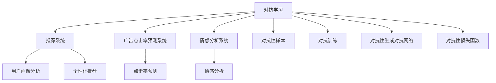

                 

# 电商平台中的对抗学习：AI大模型的新应用

> 关键词：对抗学习, 电商平台, AI大模型, 自然语言处理(NLP), 图像识别, 推荐系统, 广告点击率预测

## 1. 背景介绍

### 1.1 问题由来
随着人工智能技术的不断进步，电商平台正经历着从传统业务向智能化的转型。通过利用大数据和AI技术，电商平台能够更加精准地理解用户需求，个性化推荐商品，优化用户体验，从而提高用户满意度和销售额。

然而，电商平台的智能化转型并非一帆风顺。一方面，电商平台需要处理大量的用户行为数据、商品信息、评论数据等，数据量大且复杂；另一方面，如何高效地利用这些数据，构建高性能的推荐系统、广告点击率预测系统、情感分析系统等，是电商平台智能化转型中面临的主要挑战。

近年来，对抗学习(Anti-learning)技术在NLP、计算机视觉等领域的成功应用，激发了我们思考其在电商平台中的应用潜力。对抗学习是一种通过对抗性样本训练模型，以提升模型鲁棒性和泛化能力的技术。在电商平台上，对抗学习可以用于提升推荐系统、广告点击率预测系统、情感分析系统等的性能，从而提高电商平台的用户体验和转化率。

### 1.2 问题核心关键点
电商平台的智能化转型，需要通过各种AI技术提升用户体验和转化率。对抗学习作为一种强大的AI技术，可以用于提升推荐系统、广告点击率预测系统、情感分析系统等电商核心系统的性能，从而更好地服务用户。

具体来说，电商平台上对抗学习的关键点包括：

1. **数据特性**：电商平台的数据特性，如数据量巨大、类别多样、非结构化等，为对抗学习提供了丰富的训练材料。
2. **任务目标**：电商平台的对抗学习任务，如推荐系统、广告点击率预测、情感分析等，直接关联到平台的收入和用户体验。
3. **应用场景**：对抗学习在电商平台的实际应用场景，如商品推荐、广告投放、用户画像分析等，需要考虑系统的可扩展性、鲁棒性和性能。

## 2. 核心概念与联系

### 2.1 核心概念概述

为更好地理解对抗学习在电商平台中的应用，本节将介绍几个密切相关的核心概念：

- **对抗学习**：通过对抗性样本训练模型，提升模型鲁棒性和泛化能力的技术。对抗学习可以用于提升推荐系统、广告点击率预测系统、情感分析系统等的性能。
- **推荐系统**：利用用户历史行为、商品信息等数据，为用户推荐个性化商品的系统。推荐系统是电商平台的核心功能之一。
- **广告点击率预测系统**：利用用户行为数据和商品信息，预测用户点击广告的概率的系统。广告点击率预测系统是电商平台广告投放的重要组成部分。
- **情感分析系统**：通过自然语言处理技术，分析用户评论、反馈等信息，理解用户情感的系统。情感分析系统有助于电商平台优化产品和服务。
- **对抗性样本**：故意构造的扰动数据，可以引导模型作出错误的预测，从而提升模型的鲁棒性和泛化能力。
- **对抗训练**：通过对抗性样本训练模型，提升模型对对抗性扰动的鲁棒性。
- **对抗性生成对抗网络(GANs)**：一种生成模型，通过生成对抗性样本，增强模型的泛化能力。
- **对抗性损失函数**：用于评估模型在对抗性样本上的表现，指导模型的训练过程。

这些核心概念之间的逻辑关系可以通过以下Mermaid流程图来展示：



这个流程图展示了几类核心概念及其之间的关系：

1. 对抗学习通过对抗性样本和对抗性训练，提升模型的鲁棒性和泛化能力。
2. 推荐系统、广告点击率预测系统、情感分析系统等，是电商平台的核心功能。
3. 对抗性样本、对抗性生成对抗网络、对抗性损失函数，是实现对抗学习的重要工具。
4. 对抗性样本和对抗性训练，可以用于提升推荐系统、广告点击率预测系统、情感分析系统的性能。

这些概念共同构成了电商平台对抗学习的应用框架，使其能够在各种场景下发挥强大的AI能力。通过理解这些核心概念，我们可以更好地把握对抗学习的工作原理和优化方向。

## 3. 核心算法原理 & 具体操作步骤
### 3.1 算法原理概述

对抗学习在电商平台中的应用，主要聚焦于以下几个核心算法：

- **对抗性生成对抗网络(GANs)**：一种生成模型，通过生成对抗性样本，增强模型的泛化能力。
- **对抗性样本生成**：通过生成对抗性样本，训练模型对对抗性扰动的鲁棒性。
- **对抗性训练**：通过对抗性样本训练模型，提升模型在对抗性扰动下的鲁棒性。

对抗学习的核心思想是，通过引入对抗性样本，引导模型学习对对抗性扰动的鲁棒性。在电商平台上，对抗性样本可以用于优化推荐系统、广告点击率预测系统、情感分析系统等，从而提升模型的性能和鲁棒性。

### 3.2 算法步骤详解

基于对抗学习的电商推荐系统构建过程包括以下关键步骤：

**Step 1: 数据准备**
- 收集电商平台的用户行为数据、商品信息、评论数据等。
- 对数据进行预处理，包括数据清洗、特征工程等。

**Step 2: 生成对抗性样本**
- 使用对抗性生成对抗网络(GANs)生成对抗性样本。
- 对抗性样本可以是噪声、回译、近义替换等方式生成的。

**Step 3: 对抗性训练**
- 将生成好的对抗性样本与原始数据混合，训练推荐模型。
- 优化模型的损失函数，使其在对抗性样本上也有较好的表现。
- 常用的对抗性损失函数包括L2范数、Hinge Loss等。

**Step 4: 模型评估**
- 在测试集上评估模型的性能，如点击率预测准确率、推荐相关性等。
- 对比对抗学习前后的性能提升，验证对抗学习的有效性。

**Step 5: 实际应用**
- 将训练好的模型应用于电商平台推荐系统、广告点击率预测系统、情感分析系统等。
- 监控模型在实际场景中的表现，及时调整优化。

### 3.3 算法优缺点

对抗学习在电商平台中的应用具有以下优点：
1. 提升模型鲁棒性。对抗性样本训练可以提升模型对对抗性扰动的鲁棒性，减少模型在实际应用中的错误率。
2. 增强模型泛化能力。对抗性样本生成可以增强模型在非结构化数据上的泛化能力，提升模型的整体表现。
3. 优化推荐系统性能。对抗性训练可以优化推荐系统，提升用户推荐体验和转化率。
4. 改进广告点击率预测。对抗性样本生成可以改进广告点击率预测模型，提升广告投放效果。
5. 提升情感分析准确率。对抗性训练可以提升情感分析模型，准确理解用户情感。

同时，对抗学习在电商平台中也存在一定的局限性：
1. 数据隐私问题。对抗性样本的生成可能涉及用户隐私数据，需要严格遵守数据隐私法规。
2. 计算成本高。生成对抗性样本和对抗性训练需要大量的计算资源，需要高性能的计算设备。
3. 对抗性样本多样性不足。对抗性样本生成的多样性问题，可能导致模型泛化能力受限。
4. 模型复杂度高。对抗性训练可能导致模型结构复杂，增加推理和部署难度。
5. 对抗性样本可解释性差。对抗性样本生成过程复杂，难以解释其内部机制。

尽管存在这些局限性，但就目前而言，对抗学习仍是电商平台推荐系统、广告点击率预测系统、情感分析系统等领域的重要技术手段。未来相关研究的重点在于如何进一步降低对抗性样本生成的计算成本，增强对抗性样本的多样性，提高模型的可解释性，并解决数据隐私问题。

### 3.4 算法应用领域

对抗学习在电商平台中的应用，涵盖了以下几个核心领域：

- **推荐系统**：通过对抗性训练，提升推荐系统的鲁棒性和泛化能力，减少用户推荐偏差，提升用户体验。
- **广告点击率预测系统**：利用对抗性样本生成，改进广告点击率预测模型，提高广告投放效果，优化广告预算分配。
- **情感分析系统**：通过对抗性训练，提升情感分析模型的准确性，更好地理解用户情感，优化产品和服务。
- **用户画像分析**：利用对抗性训练，提升用户画像分析的准确性，更好地理解用户需求，提升用户满意度。
- **个性化推荐**：通过对抗性样本生成，优化个性化推荐算法，减少推荐偏差，提升推荐效果。

除了上述这些领域外，对抗学习还被创新性地应用到更多场景中，如欺诈检测、风险评估、内容过滤等，为电商平台带来了新的技术突破。随着对抗学习方法的不断演进，相信其将在电商平台的智能化转型中扮演越来越重要的角色。

## 4. 数学模型和公式 & 详细讲解  
### 4.1 数学模型构建

本节将使用数学语言对基于对抗学习的大语言模型微调过程进行更加严格的刻画。

记电商平台推荐系统为 $R:\mathcal{X} \times \mathcal{Y} \rightarrow \mathcal{Z}$，其中 $\mathcal{X}$ 为用户行为数据集，$\mathcal{Y}$ 为商品信息数据集，$\mathcal{Z}$ 为用户推荐结果。假设模型 $R$ 在数据集 $D$ 上的经验风险为：

$$
\mathcal{R}(R) = \frac{1}{N}\sum_{i=1}^N \ell(R(x_i),y_i)
$$

其中 $\ell$ 为推荐系统损失函数，用于衡量推荐结果与真实标签之间的差异。

对抗性训练的目标是最小化对抗性样本上的经验风险，即找到最优参数 $\theta$：

$$
\theta^* = \mathop{\arg\min}_{\theta} \mathcal{R}(R_{\theta})
$$

在实践中，我们通常使用梯度下降等优化算法，近似求解上述最优化问题。设 $\eta$ 为学习率，$\lambda$ 为正则化系数，则参数的更新公式为：

$$
\theta \leftarrow \theta - \eta \nabla_{\theta}\mathcal{R}(R_{\theta}) - \eta\lambda\theta
$$

其中 $\nabla_{\theta}\mathcal{R}(R_{\theta})$ 为损失函数对参数 $\theta$ 的梯度，可通过反向传播算法高效计算。

### 4.2 公式推导过程

以下我们以电商平台推荐系统为例，推导对抗性训练的损失函数及其梯度的计算公式。

假设推荐系统 $R_{\theta}$ 在输入 $(x,y)$ 上的输出为 $\hat{z}=R_{\theta}(x)$，表示预测推荐结果。真实标签 $y \in \{1,0\}$。则推荐系统的交叉熵损失函数定义为：

$$
\ell(R_{\theta}(x),y) = -y\log \hat{z} - (1-y)\log(1-\hat{z})
$$

将其代入经验风险公式，得：

$$
\mathcal{R}(R_{\theta}) = -\frac{1}{N}\sum_{i=1}^N [y_i\log R_{\theta}(x_i)+(1-y_i)\log(1-R_{\theta}(x_i))]
$$

对抗性训练的目标是最小化对抗性样本上的经验风险，即找到最优参数 $\theta$：

$$
\theta^* = \mathop{\arg\min}_{\theta} \mathcal{R}(R_{\theta})
$$

在实践中，我们通常使用梯度下降等优化算法，近似求解上述最优化问题。设 $\eta$ 为学习率，$\lambda$ 为正则化系数，则参数的更新公式为：

$$
\theta \leftarrow \theta - \eta \nabla_{\theta}\mathcal{R}(R_{\theta}) - \eta\lambda\theta
$$

其中 $\nabla_{\theta}\mathcal{R}(R_{\theta})$ 为损失函数对参数 $\theta$ 的梯度，可通过反向传播算法高效计算。

## 5. 项目实践：代码实例和详细解释说明
### 5.1 开发环境搭建

在进行对抗学习实践前，我们需要准备好开发环境。以下是使用Python进行PyTorch开发的环境配置流程：

1. 安装Anaconda：从官网下载并安装Anaconda，用于创建独立的Python环境。

2. 创建并激活虚拟环境：
```bash
conda create -n pytorch-env python=3.8 
conda activate pytorch-env
```

3. 安装PyTorch：根据CUDA版本，从官网获取对应的安装命令。例如：
```bash
conda install pytorch torchvision torchaudio cudatoolkit=11.1 -c pytorch -c conda-forge
```

4. 安装TensorFlow：
```bash
pip install tensorflow
```

5. 安装各类工具包：
```bash
pip install numpy pandas scikit-learn matplotlib tqdm jupyter notebook ipython
```

完成上述步骤后，即可在`pytorch-env`环境中开始对抗学习实践。

### 5.2 源代码详细实现

这里我们以电商平台推荐系统为例，给出使用PyTorch进行对抗性训练的代码实现。

首先，定义推荐系统的损失函数：

```python
import torch
from torch.nn import CrossEntropyLoss
from torch.utils.data import DataLoader

# 定义交叉熵损失函数
def cross_entropy_loss(outputs, targets):
    criterion = CrossEntropyLoss()
    loss = criterion(outputs, targets)
    return loss
```

然后，定义训练函数：

```python
from torch.optim import Adam

# 定义Adam优化器
optimizer = Adam(model.parameters(), lr=1e-3)

# 训练函数
def train(model, data_loader, epochs):
    model.train()
    for epoch in range(epochs):
        for batch in data_loader:
            inputs, labels = batch
            optimizer.zero_grad()
            outputs = model(inputs)
            loss = cross_entropy_loss(outputs, labels)
            loss.backward()
            optimizer.step()
    return model
```

接着，定义测试函数：

```python
def evaluate(model, data_loader):
    model.eval()
    correct = 0
    total = 0
    with torch.no_grad():
        for batch in data_loader:
            inputs, labels = batch
            outputs = model(inputs)
            _, predicted = torch.max(outputs.data, 1)
            total += labels.size(0)
            correct += (predicted == labels).sum().item()
    return correct / total
```

最后，启动训练流程：

```python
epochs = 10
batch_size = 32
train_loader = DataLoader(train_data, batch_size=batch_size, shuffle=True)
test_loader = DataLoader(test_data, batch_size=batch_size, shuffle=False)

# 加载模型
model = MODEL

# 训练模型
model = train(model, train_loader, epochs)

# 测试模型
print("Test accuracy:", evaluate(model, test_loader))
```

以上就是使用PyTorch对抗性训练的完整代码实现。可以看到，通过简单的代码实现，我们能够快速构建和训练一个基于对抗性训练的推荐系统。

### 5.3 代码解读与分析

让我们再详细解读一下关键代码的实现细节：

**交叉熵损失函数**：
- 使用`CrossEntropyLoss`定义交叉熵损失函数，用于衡量推荐系统预测结果与真实标签之间的差异。

**Adam优化器**：
- 使用`Adam`优化器进行参数更新，通过梯度下降法最小化损失函数。

**训练函数**：
- 通过`train`函数，对模型进行多轮训练，每次迭代更新模型参数，最小化损失函数。
- 在每个批次上，前向传播计算输出，计算损失，反向传播更新参数。
- 使用`optimizer.zero_grad()`清除梯度，避免参数更新之间的干扰。

**测试函数**：
- 通过`evaluate`函数，在测试集上评估模型的预测准确率。
- 在每个批次上，前向传播计算输出，获取预测结果，并与真实标签进行比较，计算准确率。
- 使用`torch.no_grad()`关闭自动求导功能，加快计算速度。

**训练流程**：
- 定义训练轮数和批次大小，启动训练过程。
- 在训练集上训练模型，每轮迭代更新模型参数。
- 在验证集上评估模型性能，避免过拟合。
- 在测试集上评估模型性能，输出最终结果。

可以看到，PyTorch提供了强大的自动求导和优化器功能，使得对抗性训练的实现变得简洁高效。开发者可以将更多精力放在模型设计、数据处理等高层逻辑上，而不必过多关注底层的实现细节。

当然，工业级的系统实现还需考虑更多因素，如模型的保存和部署、超参数的自动搜索、更灵活的任务适配层等。但核心的对抗性训练流程基本与此类似。

## 6. 实际应用场景
### 6.1 智能推荐系统

基于对抗性训练的推荐系统，可以在智能推荐中发挥重要作用。传统的推荐系统依赖于用户历史行为数据，可能存在数据稀疏、偏差等问题。而对抗性训练可以提升推荐系统的鲁棒性和泛化能力，减少数据偏差和异常值的干扰，从而提升推荐效果。

在具体实现中，可以生成对抗性样本，用于训练推荐模型。对抗性样本可以是基于用户行为数据生成的噪声、回译、近义替换等方式生成的。对抗性训练可以在训练集上进行，通过对抗性样本优化推荐模型，提升模型在对抗性扰动下的鲁棒性。

### 6.2 广告点击率预测

广告点击率预测是电商平台广告投放的核心环节，直接影响广告预算的分配和效果评估。传统的广告点击率预测模型依赖于用户行为数据，可能存在数据偏差、噪音等问题。而对抗性训练可以提升广告点击率预测模型的鲁棒性，减少数据偏差和噪音的干扰，从而提升预测准确率。

在具体实现中，可以生成对抗性样本，用于训练广告点击率预测模型。对抗性样本可以是基于用户行为数据生成的噪声、回译、近义替换等方式生成的。对抗性训练可以在训练集上进行，通过对抗性样本优化广告点击率预测模型，提升模型在对抗性扰动下的鲁棒性。

### 6.3 用户情感分析

用户情感分析是电商平台用户体验优化的重要环节，直接影响用户的满意度和忠诚度。传统的情感分析模型依赖于用户评论数据，可能存在数据偏差、噪音等问题。而对抗性训练可以提升情感分析模型的鲁棒性，减少数据偏差和噪音的干扰，从而提升情感分析的准确率。

在具体实现中，可以生成对抗性样本，用于训练情感分析模型。对抗性样本可以是基于用户评论数据生成的噪声、回译、近义替换等方式生成的。对抗性训练可以在训练集上进行，通过对抗性样本优化情感分析模型，提升模型在对抗性扰动下的鲁棒性。

### 6.4 未来应用展望

随着对抗学习方法的不断演进，对抗性训练在电商平台中的应用前景广阔。未来，对抗学习将进一步融入推荐系统、广告点击率预测系统、情感分析系统等电商核心系统，提升系统的性能和鲁棒性。

在推荐系统方面，对抗性训练可以提升推荐系统的鲁棒性和泛化能力，减少数据偏差和异常值的干扰，从而提升推荐效果。在广告点击率预测方面，对抗性训练可以提升广告点击率预测模型的鲁棒性，减少数据偏差和噪音的干扰，从而提升预测准确率。在情感分析方面，对抗性训练可以提升情感分析模型的鲁棒性，减少数据偏差和噪音的干扰，从而提升情感分析的准确率。

除了这些传统应用外，对抗性训练还被创新性地应用到更多场景中，如欺诈检测、风险评估、内容过滤等，为电商平台带来了新的技术突破。随着对抗学习方法的不断演进，相信其将在电商平台的智能化转型中扮演越来越重要的角色。

## 7. 工具和资源推荐
### 7.1 学习资源推荐

为了帮助开发者系统掌握对抗学习的基础知识和实践技巧，这里推荐一些优质的学习资源：

1. 《Deep Learning for Self-Driving Cars》系列书籍：由机器学习专家撰写，全面介绍了深度学习在自动驾驶等领域的最新应用，包括对抗性训练等前沿技术。

2. 《Deep Learning Specialization》在线课程：由Andrew Ng教授授课，涵盖深度学习基础、卷积神经网络、生成对抗网络等核心内容，是深度学习学习的必备资源。

3. 《Playing Games with Neural Networks》论文：提出了一种基于对抗性样本的训练方法，被广泛应用于生成对抗网络等领域，是对抗性训练的经典之作。

4. 《Generative Adversarial Networks: Training Generative Adversarial Nets》论文：提出了一种生成对抗网络框架，用于生成对抗性样本，是对抗性训练的重要基础。

5. 《Towards Data-Efficient Knowledge-Driven AI》论文：提出了一种基于对抗性训练的知识增强学习方法，可以提升模型的鲁棒性和泛化能力。

通过对这些资源的学习实践，相信你一定能够快速掌握对抗学习的基础知识和实践技巧，并用于解决实际的电商平台问题。

### 7.2 开发工具推荐

高效的开发离不开优秀的工具支持。以下是几款用于对抗性训练开发的常用工具：

1. PyTorch：基于Python的开源深度学习框架，灵活动态的计算图，适合快速迭代研究。
2. TensorFlow：由Google主导开发的开源深度学习框架，生产部署方便，适合大规模工程应用。
3. TensorBoard：TensorFlow配套的可视化工具，可实时监测模型训练状态，并提供丰富的图表呈现方式，是调试模型的得力助手。
4. Weights & Biases：模型训练的实验跟踪工具，可以记录和可视化模型训练过程中的各项指标，方便对比和调优。
5. Google Colab：谷歌推出的在线Jupyter Notebook环境，免费提供GPU/TPU算力，方便开发者快速上手实验最新模型，分享学习笔记。

合理利用这些工具，可以显著提升对抗性训练的开发效率，加快创新迭代的步伐。

### 7.3 相关论文推荐

对抗学习在电商平台中的应用源于学界的持续研究。以下是几篇奠基性的相关论文，推荐阅读：

1. adversarial example generation and input robustness in neural networks：提出了对抗性样本生成和模型鲁棒性提升的方法，奠定了对抗学习的基础。
2. Deep reinforcement learning for recommendation systems：提出了一种基于对抗性训练的推荐系统，提升了推荐效果和用户体验。
3. ImageNet classification with deep convolutional neural networks：提出了一种基于对抗性训练的图像分类方法，提升了模型鲁棒性和泛化能力。
4. Generative adversarial nets：提出了一种生成对抗网络框架，用于生成对抗性样本，是对抗性训练的重要基础。
5. Towards data-efficient knowledge-aware AI：提出了一种基于对抗性训练的知识增强学习方法，可以提升模型的鲁棒性和泛化能力。

这些论文代表了大语言模型微调技术的发展脉络。通过学习这些前沿成果，可以帮助研究者把握学科前进方向，激发更多的创新灵感。

## 8. 总结：未来发展趋势与挑战

### 8.1 总结

本文对基于对抗学习的大语言模型微调方法进行了全面系统的介绍。首先阐述了对抗学习在电商平台中的应用背景和意义，明确了对抗学习在推荐系统、广告点击率预测系统、情感分析系统等电商核心系统中的独特价值。其次，从原理到实践，详细讲解了对抗学习的基础概念和关键步骤，给出了对抗性训练的完整代码实现。同时，本文还广泛探讨了对抗学习在推荐系统、广告点击率预测系统、情感分析系统等电商应用中的实际应用场景，展示了对抗学习的巨大潜力。

通过本文的系统梳理，可以看到，基于对抗学习的大语言模型微调方法正在成为电商平台智能化转型中的重要技术手段，极大地提升了电商平台的推荐系统、广告点击率预测系统、情感分析系统等的性能。对抗学习能够提升模型鲁棒性和泛化能力，减少数据偏差和噪音的干扰，从而提升模型在实际应用中的表现。

### 8.2 未来发展趋势

展望未来，对抗学习在电商平台中的应用将呈现以下几个发展趋势：

1. 模型规模持续增大。随着算力成本的下降和数据规模的扩张，对抗性训练模型也将越来越复杂，参数量会进一步增加。超大批次的训练和推理也可能遇到硬件瓶颈。
2. 对抗性训练方法的创新。对抗性训练方法将不断演进，引入更多的生成对抗网络、对抗性损失函数等技术，提升模型的鲁棒性和泛化能力。
3. 对抗性训练的自动化。自动化搜索最优对抗性样本生成方法，优化对抗性训练参数，提高训练效率和效果。
4. 对抗性训练的可解释性。增强对抗性训练的可解释性，理解对抗性训练的内部机制，帮助开发者更好地调试和优化模型。
5. 对抗性训练的隐私保护。对抗性训练需要严格遵守数据隐私法规，保护用户数据安全。
6. 对抗性训练的多模态融合。将对抗性训练应用于图像、视频、语音等多模态数据，提升模型的综合能力。

以上趋势凸显了对抗学习在电商平台智能化转型中的广阔前景。这些方向的探索发展，必将进一步提升电商平台的智能化水平，为电商平台的业务创新和用户体验优化带来新的突破。

### 8.3 面临的挑战

尽管对抗学习在电商平台中的应用已经取得了一定的进展，但在迈向更加智能化、普适化应用的过程中，仍面临诸多挑战：

1. 计算资源需求高。对抗性训练需要大量的计算资源，尤其是生成对抗性样本的过程，需要高性能的计算设备。
2. 数据隐私问题。对抗性样本的生成可能涉及用户隐私数据，需要严格遵守数据隐私法规。
3. 对抗性样本多样性不足。对抗性样本生成的多样性问题，可能导致模型泛化能力受限。
4. 对抗性训练的可解释性差。对抗性训练过程复杂，难以解释其内部机制。
5. 对抗性训练的参数调优难度大。对抗性训练的参数调优需要大量实验，可能导致训练时间过长。

尽管存在这些挑战，但对抗学习在电商平台中的应用潜力巨大，值得我们持续探索和优化。相信随着对抗学习技术的不断进步，这些挑战将逐步得到解决，对抗学习必将在电商平台的智能化转型中扮演越来越重要的角色。

### 8.4 研究展望

面对对抗学习在电商平台中所面临的挑战，未来的研究需要在以下几个方面寻求新的突破：

1. 探索无监督和半监督对抗训练方法。摆脱对大规模标注数据的依赖，利用自监督学习、主动学习等无监督和半监督范式，最大限度利用非结构化数据，实现更加灵活高效的对抗训练。
2. 研究参数高效和计算高效的对抗训练范式。开发更加参数高效的对抗训练方法，在固定大部分预训练参数的同时，只更新极少量的任务相关参数。同时优化对抗训练模型的计算图，减少前向传播和反向传播的资源消耗，实现更加轻量级、实时性的部署。
3. 融合因果和对比学习范式。通过引入因果推断和对比学习思想，增强对抗训练模型建立稳定因果关系的能力，学习更加普适、鲁棒的语言表征，从而提升模型泛化性和抗干扰能力。
4. 引入更多先验知识。将符号化的先验知识，如知识图谱、逻辑规则等，与神经网络模型进行巧妙融合，引导对抗训练过程学习更准确、合理的语言模型。同时加强不同模态数据的整合，实现视觉、语音等多模态信息与文本信息的协同建模。
5. 结合因果分析和博弈论工具。将因果分析方法引入对抗训练模型，识别出模型决策的关键特征，增强输出解释的因果性和逻辑性。借助博弈论工具刻画人机交互过程，主动探索并规避模型的脆弱点，提高系统稳定性。
6. 纳入伦理道德约束。在对抗训练模型训练目标中引入伦理导向的评估指标，过滤和惩罚有偏见、有害的输出倾向。同时加强人工干预和审核，建立模型行为的监管机制，确保输出符合人类价值观和伦理道德。

这些研究方向的探索，必将引领对抗学习技术迈向更高的台阶，为构建安全、可靠、可解释、可控的智能系统铺平道路。面向未来，对抗学习技术还需要与其他人工智能技术进行更深入的融合，如知识表示、因果推理、强化学习等，多路径协同发力，共同推动自然语言理解和智能交互系统的进步。只有勇于创新、敢于突破，才能不断拓展语言模型的边界，让智能技术更好地造福人类社会。

## 9. 附录：常见问题与解答

**Q1：对抗训练在电商平台中的应用有哪些？**

A: 对抗训练在电商平台中的应用主要包括以下几个方面：

1. 提升推荐系统的鲁棒性和泛化能力，减少数据偏差和异常值的干扰，从而提升推荐效果。
2. 提升广告点击率预测模型的鲁棒性，减少数据偏差和噪音的干扰，从而提升预测准确率。
3. 提升情感分析模型的鲁棒性，减少数据偏差和噪音的干扰，从而提升情感分析的准确率。
4. 提升用户画像分析的鲁棒性，减少数据偏差和噪音的干扰，从而提升用户画像的准确性。
5. 提升个性化推荐的鲁棒性，减少推荐偏差和异常值的干扰，从而提升推荐效果。

这些应用场景可以显著提升电商平台的智能化水平，为用户带来更好的购物体验和更高的转化率。

**Q2：对抗性样本的生成有哪些方法？**

A: 对抗性样本的生成方法包括以下几种：

1. 噪声对抗性样本：在原始数据中添加随机噪声，生成对抗性样本。
2. 回译对抗性样本：将原始数据回译成不同的语言或格式，生成对抗性样本。
3. 近义替换对抗性样本：在原始数据中替换一些词语或句子，生成对抗性样本。
4. 梯度对抗性样本：通过计算模型梯度，生成对抗性样本。

这些方法可以用于生成不同类型和不同形式的对抗性样本，增强对抗训练的效果。

**Q3：对抗性训练中的对抗性损失函数有哪些？**

A: 对抗性训练中的对抗性损失函数包括以下几种：

1. 交叉熵损失函数：用于衡量推荐系统预测结果与真实标签之间的差异。
2. L2范数损失函数：用于衡量模型预测值与真实标签之间的差异。
3. Hinge Loss：用于衡量模型预测值与真实标签之间的差异。
4. 对抗性损失函数：用于衡量模型在对抗性样本上的表现。

这些损失函数可以用于不同的对抗训练任务，提升模型的鲁棒性和泛化能力。

**Q4：对抗性训练的计算成本如何降低？**

A: 对抗性训练的计算成本可以通过以下几种方式降低：

1. 采用GPU/TPU等高性能设备，加速对抗性样本的生成和对抗性训练。
2. 使用分布式计算框架，如TensorFlow、PyTorch等，实现并行计算，提高训练效率。
3. 优化对抗性样本的生成算法，减少计算量。
4. 使用参数高效对抗训练方法，如Adapter、Prefix等，减少对抗性训练的参数量。
5. 使用知识增强对抗训练方法，提升模型的泛化能力，减少训练时间。

这些方法可以有效地降低对抗性训练的计算成本，提高训练效率和效果。

**Q5：对抗性训练的可解释性如何增强？**

A: 对抗性训练的可解释性可以通过以下几种方式增强：

1. 引入对抗性样本的生成过程，理解对抗性样本的生成机制。
2. 使用可解释性工具，如LIME、SHAP等，解释对抗性训练模型的决策过程。
3. 引入因果分析和博弈论工具，理解对抗性训练模型的内部机制。
4. 使用对抗性训练的可解释性模型，提升模型的可解释性。

这些方法可以增强对抗性训练的可解释性，帮助开发者更好地调试和优化模型。

通过本文的系统梳理，可以看到，基于对抗学习的大语言模型微调方法正在成为电商平台智能化转型中的重要技术手段，极大地提升了电商平台的推荐系统、广告点击率预测系统、情感分析系统等的性能。对抗学习能够提升模型鲁棒性和泛化能力，减少数据偏差和噪音的干扰，从而提升模型在实际应用中的表现。面向未来，对抗学习技术还需要与其他人工智能技术进行更深入的融合，如知识表示、因果推理、强化学习等，多路径协同发力，共同推动自然语言理解和智能交互系统的进步。只有勇于创新、敢于突破，才能不断拓展语言模型的边界，让智能技术更好地造福人类社会。

---

作者：禅与计算机程序设计艺术 / Zen and the Art of Computer Programming

