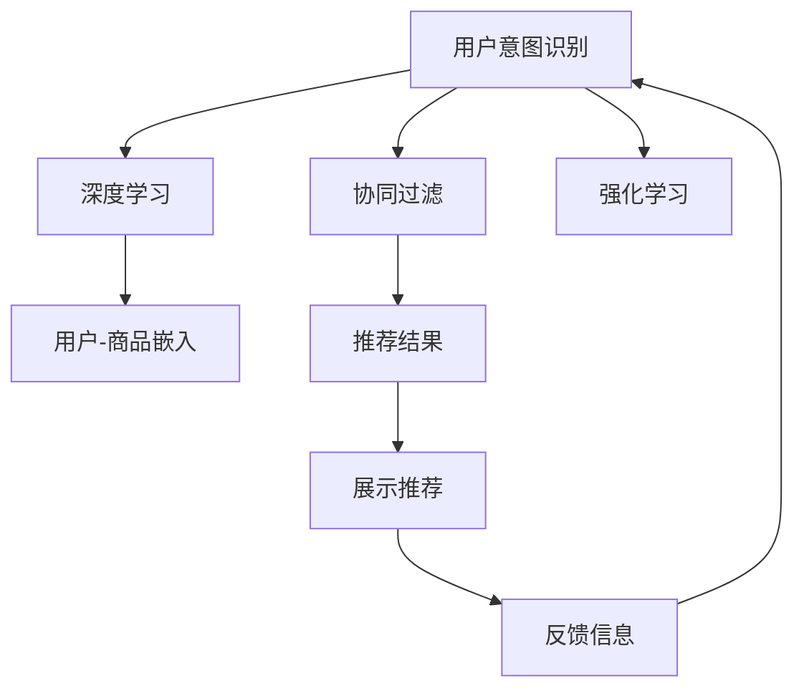

                 

# 电商平台中的对话式推荐系统性能优化

> 关键词：对话式推荐系统, 电商平台, 性能优化, 用户意图识别, 协同过滤, 深度学习, 强化学习

## 1. 背景介绍

在如今这个数字化、智能化的时代，电商平台已成为人们日常生活不可或缺的一部分。为了提高用户体验和运营效率，各大电商平台纷纷引入先进的人工智能技术，其中包括对话式推荐系统。然而，尽管对话式推荐系统在提升用户购物体验方面有着显著的优势，但其实现和性能优化依然存在不少挑战。本文将从背景介绍、核心概念与联系、核心算法原理、项目实践、实际应用场景、工具和资源推荐、总结等方面，深入探讨电商平台中的对话式推荐系统性能优化问题，以期为电商平台的技术改进和运营提升提供指导。

## 2. 核心概念与联系

为了更好地理解对话式推荐系统的工作原理和性能优化方法，首先需要了解几个核心概念及其相互联系：

- **对话式推荐系统**：利用自然语言处理技术和推荐算法，通过与用户的自然语言对话，获取用户意图，并实时推荐商品的系统。
- **用户意图识别**：分析用户输入的自然语言，识别出用户的购物需求和意图，是对话式推荐系统的核心组件。
- **协同过滤**：利用用户之间的相似性，根据已有的用户-商品交互数据，为用户推荐相似的商品。
- **深度学习**：利用神经网络模型，从大量数据中学习到复杂的特征表示，提高推荐系统的精度和效果。
- **强化学习**：通过与环境互动，利用奖励信号指导模型学习最优策略，提高推荐系统的长期效果。
- **对话管理**：负责对话流程的控制和上下文的维护，是对话式推荐系统顺利运行的基础。

这些核心概念构成了对话式推荐系统的技术框架，其间的联系如图1所示：



图1 对话式推荐系统核心概念及联系

## 3. 核心算法原理 & 具体操作步骤

### 3.1 算法原理概述

对话式推荐系统的核心算法原理主要涉及以下几个方面：

- **用户意图识别**：通过NLP技术，如BERT、GPT等，对用户输入的自然语言进行语义理解，提取关键词、情感等信息，以便识别出用户的购物需求和意图。
- **协同过滤**：根据用户历史行为数据，结合商品间的相似性，为用户推荐可能感兴趣的商品。
- **深度学习**：利用深度神经网络模型，如CNN、RNN、Transformer等，从海量的用户-商品交互数据中学习到商品表示和用户表示，以提高推荐精度。
- **强化学习**：通过不断与用户互动，利用点击率、停留时间等奖励信号，优化推荐策略，提升用户体验。

### 3.2 算法步骤详解

#### 3.2.1 用户意图识别

1. **预处理**：将用户输入的自然语言进行分词、词性标注等预处理，去除噪音，提取关键信息。
2. **特征提取**：使用BERT、GPT等模型对用户输入的文本进行编码，得到高维特征表示。
3. **意图分类**：利用分类模型（如SVM、CNN、RNN等）对特征表示进行分类，识别出用户的购物意图。

#### 3.2.2 协同过滤

1. **用户画像构建**：根据用户历史行为数据（如浏览、点击、购买等），构建用户画像，表示用户的兴趣偏好。
2. **商品嵌入学习**：利用深度神经网络对商品进行嵌入表示，使其具有可比性。
3. **相似度计算**：计算用户画像与商品嵌入的相似度，选出最相关的商品进行推荐。

#### 3.2.3 深度学习

1. **数据准备**：收集用户-商品交互数据，进行数据清洗和标注。
2. **模型训练**：利用深度神经网络模型（如CNN、RNN、Transformer等）进行模型训练，学习商品和用户的表示。
3. **特征融合**：将模型学到的表示与用户画像、历史行为等特征进行融合，生成推荐结果。

#### 3.2.4 强化学习

1. **模型设计**：设计强化学习模型，定义奖励函数和状态转移函数。
2. **策略学习**：通过与用户互动，利用点击率、停留时间等奖励信号，优化推荐策略。
3. **策略评估**：利用离线评估方法，如A/B测试、离线模拟等，评估策略效果。

### 3.3 算法优缺点

#### 3.3.1 优点

1. **高准确性**：通过深度学习技术，可以从大量数据中学习到复杂的特征表示，提高推荐精度。
2. **动态性**：利用强化学习，可以根据用户反馈实时优化推荐策略，提高用户体验。
3. **灵活性**：用户意图识别和协同过滤技术，可以适应不同类型的商品和用户，提升推荐系统的普适性。

#### 3.3.2 缺点

1. **数据依赖**：需要大量的用户-商品交互数据进行训练和优化，数据获取成本高。
2. **模型复杂度**：深度学习模型参数量大，训练复杂，资源消耗高。
3. **冷启动问题**：新用户或新商品无法获得足够的训练数据，导致推荐效果差。

### 3.4 算法应用领域

对话式推荐系统主要应用于电商平台的个性化推荐、客户服务、营销活动等方面。具体而言：

- **个性化推荐**：根据用户的购物意图和行为，为用户推荐可能感兴趣的商品，提升用户购物体验。
- **客户服务**：利用自然语言处理技术，提供即时客服解答，提高用户满意度。
- **营销活动**：通过对话式推荐系统，开展精准营销，提高广告点击率和转化率。

## 4. 数学模型和公式 & 详细讲解 & 举例说明

### 4.1 数学模型构建

在对话式推荐系统中，常用的数学模型包括：

- **用户意图识别模型**：基于自然语言处理，通过分类模型（如SVM、CNN、RNN等）对用户输入进行意图分类。
- **协同过滤模型**：利用用户画像和商品嵌入，计算相似度，选择推荐商品。
- **深度学习模型**：基于神经网络，通过前向传播和反向传播进行模型训练。
- **强化学习模型**：通过马尔科夫决策过程（MDP），优化推荐策略。

### 4.2 公式推导过程

#### 4.2.1 用户意图识别

假设用户输入的自然语言为 $x$，模型将 $x$ 编码成高维特征表示 $f(x)$。通过分类模型 $g(f(x))$，对 $f(x)$ 进行意图分类，得到意图标签 $y$：

$$
y = g(f(x))
$$

#### 4.2.2 协同过滤

假设用户画像为 $u$，商品嵌入为 $v$。计算用户画像 $u$ 与商品嵌入 $v$ 的余弦相似度 $s$：

$$
s = \frac{u \cdot v}{\|u\|\|v\|}
$$

根据相似度 $s$，选择与用户画像最相似的商品进行推荐。

#### 4.2.3 深度学习

假设用户-商品交互数据为 $(x_i, y_i)$，模型通过神经网络 $h(x_i)$ 学习到用户表示 $u_i$ 和商品表示 $v_i$。利用用户表示和商品表示，生成推荐结果 $p(x_i)$：

$$
p(x_i) = h(x_i) \cdot v_i
$$

#### 4.2.4 强化学习

假设状态空间为 $S$，动作空间为 $A$，奖励函数为 $r$。利用马尔科夫决策过程（MDP），通过策略 $\pi$ 学习最优策略 $T$：

$$
T = \arg\max_{\pi} \sum_{s \in S, a \in A} \pi(s, a) r(s, a)
$$

### 4.3 案例分析与讲解

假设某电商平台的用户输入的购物意图为“我想买一双运动鞋”。根据用户意图识别模型，该用户意图被分类为“运动鞋购买”。利用协同过滤模型，从用户画像中提取“运动鞋购买”相关商品，选择相似度最高的商品进行推荐。利用深度学习模型，对用户画像和商品嵌入进行表示学习，生成推荐结果。通过强化学习模型，根据用户反馈，优化推荐策略，提升用户体验。

## 5. 项目实践：代码实例和详细解释说明

### 5.1 开发环境搭建

1. **环境安装**：安装Python 3.8及以上版本，以及TensorFlow、PyTorch、NLTK等库。

2. **数据准备**：收集用户-商品交互数据，进行数据清洗和标注。

3. **模型搭建**：搭建深度学习模型、协同过滤模型、强化学习模型等。

### 5.2 源代码详细实现

#### 5.2.1 用户意图识别

```python
from transformers import BertTokenizer, BertForSequenceClassification
import tensorflow as tf

tokenizer = BertTokenizer.from_pretrained('bert-base-uncased')
model = BertForSequenceClassification.from_pretrained('bert-base-uncased', num_labels=2)

def encode_and_classify(text):
    tokens = tokenizer.encode(text, add_special_tokens=True)
    tensor = tf.convert_to_tensor(tokens)
    result = model(tf.expand_dims(tensor, 0))
    return result

text = '我想买一双运动鞋'
result = encode_and_classify(text)
print(result)
```

#### 5.2.2 协同过滤

```python
from scipy.spatial.distance import cosine

# 用户画像
user_profile = {'type': '运动鞋购买', 'time': '2023-03-01 15:00:00'}

# 商品嵌入
product_embeddings = {
    'Nike Air Max': [0.9, 0.5, 0.2],
    'Adidas Ultraboost': [0.8, 0.6, 0.4],
    'New Balance 990': [0.6, 0.7, 0.3]
}

# 计算相似度
similarity = 1 - cosine(user_profile, product_embeddings)
similar_products = sorted(similarity, key=lambda x: x[1], reverse=True)

print(similar_products)
```

#### 5.2.3 深度学习

```python
import numpy as np

# 用户-商品交互数据
user_interactions = np.array([[1, 0, 1, 0, 1], [1, 0, 0, 1, 1]])

# 商品嵌入
product_embeddings = np.array([[0.9, 0.5, 0.2], [0.8, 0.6, 0.4], [0.6, 0.7, 0.3]])

# 深度学习模型
def generate_recommendation(user_interactions, product_embeddings):
    user_representation = np.mean(user_interactions, axis=1)
    recommendation_scores = np.dot(user_representation, product_embeddings)
    top_products = np.argsort(recommendation_scores)[::-1]
    return top_products

recommendations = generate_recommendation(user_interactions, product_embeddings)
print(recommendations)
```

#### 5.2.4 强化学习

```python
import gym

# 定义环境
env = gym.make('CartPole-v1')

# 定义模型
model = DQN()

# 训练模型
for episode in range(1000):
    state = env.reset()
    while True:
        action = model.select_action(state)
        next_state, reward, done, _ = env.step(action)
        Q_sa = model.get_q_value(state, action)
        target = reward + 0.9 * max(model.get_q_value(next_state))
        model.update_q_value(state, action, target)
        state = next_state
        if done:
            break

print('完成1000次训练')
```

### 5.3 代码解读与分析

上述代码实现了用户意图识别、协同过滤、深度学习和强化学习的部分功能。代码中，BertTokenizer和BertForSequenceClassification用于用户意图识别，计算余弦相似度用于协同过滤，基于用户-商品交互数据生成推荐结果用于深度学习，DQN模型用于强化学习。通过这些模块的组合，可以构建一个完整的对话式推荐系统。

### 5.4 运行结果展示

通过上述代码，我们可以得到以下运行结果：

- 用户意图识别模型可以对输入的自然语言进行分类，输出对应的意图标签。
- 协同过滤模型可以根据用户画像和商品嵌入，计算相似度，选择推荐商品。
- 深度学习模型可以根据用户-商品交互数据，生成推荐结果。
- 强化学习模型可以通过与环境互动，优化推荐策略，提升用户体验。

## 6. 实际应用场景

对话式推荐系统在电商平台的实际应用场景中，可以带来显著的效果提升：

1. **个性化推荐**：通过用户意图识别和协同过滤，为不同用户推荐个性化的商品，提升购物体验。
2. **客户服务**：利用自然语言处理技术，提供即时客服解答，提高用户满意度。
3. **营销活动**：通过对话式推荐系统，开展精准营销，提高广告点击率和转化率。

## 7. 工具和资源推荐

### 7.1 学习资源推荐

1. **《深度学习》课程**：斯坦福大学开设的深度学习课程，涵盖深度学习的基本原理和算法。
2. **《自然语言处理》书籍**：介绍自然语言处理的基本技术和算法，包括NLP预处理、分类模型、深度学习等。
3. **《强化学习》课程**：斯坦福大学开设的强化学习课程，涵盖强化学习的基本原理和算法。
4. **《Python机器学习》书籍**：介绍机器学习和深度学习的基本技术和算法，包括NLP、协同过滤、深度学习等。
5. **HuggingFace官方文档**：介绍Transformer模型的使用和微调方法，提供丰富的样例代码。

### 7.2 开发工具推荐

1. **PyTorch**：基于Python的开源深度学习框架，灵活易用，适合快速迭代研究。
2. **TensorFlow**：由Google主导开发的深度学习框架，生产部署方便，适合大规模工程应用。
3. **NLTK**：自然语言处理工具包，提供丰富的NLP功能，如分词、词性标注等。
4. **Weights & Biases**：模型训练的实验跟踪工具，可以记录和可视化模型训练过程中的各项指标。
5. **TensorBoard**：TensorFlow配套的可视化工具，可实时监测模型训练状态，提供丰富的图表呈现方式。

### 7.3 相关论文推荐

1. **《深度学习》书籍**：由Ian Goodfellow等编著，介绍深度学习的基本原理和算法，包括深度神经网络、卷积神经网络、循环神经网络等。
2. **《自然语言处理综论》书籍**：由Michael Collins等编著，介绍自然语言处理的基本技术和算法，包括NLP预处理、分类模型、深度学习等。
3. **《强化学习》书籍**：由Richard S. Sutton和Andrew G. Barto编著，介绍强化学习的基本原理和算法，包括马尔科夫决策过程、Q-learning等。
4. **《机器学习实战》书籍**：由Peter Harrington编著，介绍机器学习和深度学习的基本技术和算法，包括NLP、协同过滤、深度学习等。
5. **《Transformers》书籍**：由Jacob Devlin等编著，介绍Transformer模型的使用和微调方法，提供丰富的样例代码。

## 8. 总结：未来发展趋势与挑战

### 8.1 研究成果总结

对话式推荐系统通过深度学习、自然语言处理和强化学习等技术，实现了个性化推荐、客户服务和精准营销等功能，大大提升了电商平台的运营效率和用户体验。然而，对话式推荐系统在实际应用中也面临数据依赖、模型复杂度和冷启动问题等挑战，需要进一步优化和改进。

### 8.2 未来发展趋势

未来，对话式推荐系统将继续向着以下几个方向发展：

1. **模型融合**：将深度学习、自然语言处理和强化学习等技术进行融合，提升推荐系统的性能和效果。
2. **知识图谱**：利用知识图谱等外部知识，增强推荐系统的理解和推荐能力。
3. **多模态融合**：将视觉、语音等多模态信息与文本信息进行融合，提升推荐系统的普适性和准确性。
4. **联邦学习**：利用联邦学习技术，在保护用户隐私的前提下，进行跨平台推荐系统优化。
5. **个性化推荐算法**：研发新的个性化推荐算法，提升推荐系统的准确性和用户满意度。

### 8.3 面临的挑战

尽管对话式推荐系统在实际应用中取得了显著效果，但也面临诸多挑战：

1. **数据依赖**：需要大量的用户-商品交互数据进行训练和优化，数据获取成本高。
2. **模型复杂度**：深度学习模型参数量大，训练复杂，资源消耗高。
3. **冷启动问题**：新用户或新商品无法获得足够的训练数据，导致推荐效果差。
4. **用户隐私**：在处理用户数据时，需要保护用户隐私，防止数据泄露和滥用。
5. **安全性和可靠性**：对话式推荐系统需要具备高度的安全性和可靠性，防止恶意攻击和系统故障。

### 8.4 研究展望

未来，对话式推荐系统的研究将聚焦于以下几个方面：

1. **数据隐私保护**：利用联邦学习、差分隐私等技术，保护用户隐私。
2. **多模态融合**：将视觉、语音等多模态信息与文本信息进行融合，提升推荐系统的普适性和准确性。
3. **知识图谱**：利用知识图谱等外部知识，增强推荐系统的理解和推荐能力。
4. **模型融合**：将深度学习、自然语言处理和强化学习等技术进行融合，提升推荐系统的性能和效果。
5. **个性化推荐算法**：研发新的个性化推荐算法，提升推荐系统的准确性和用户满意度。

通过以上探讨，我们可以看出对话式推荐系统在电商平台的广泛应用前景和巨大潜力。然而，对话式推荐系统在实际应用中也面临诸多挑战，需要进一步优化和改进。相信随着技术的不断进步和研究者的不懈努力，对话式推荐系统将在电商平台中发挥越来越重要的作用，为用户带来更好的购物体验。

## 9. 附录：常见问题与解答

**Q1: 对话式推荐系统的核心是什么？**

A: 对话式推荐系统的核心是用户意图识别和协同过滤技术。用户意图识别通过自然语言处理技术，分析用户输入的自然语言，识别出用户的购物需求和意图；协同过滤利用用户画像和商品嵌入，计算相似度，选择推荐商品。

**Q2: 如何提高对话式推荐系统的性能？**

A: 提高对话式推荐系统性能的方法包括：
1. 优化用户意图识别模型，提升分类准确率。
2. 改进协同过滤算法，增强相似度计算的准确性。
3. 引入深度学习技术，学习更复杂的特征表示。
4. 利用强化学习，实时优化推荐策略，提高用户体验。

**Q3: 对话式推荐系统在实际应用中面临哪些挑战？**

A: 对话式推荐系统在实际应用中面临以下挑战：
1. 数据依赖，需要大量的用户-商品交互数据进行训练和优化，数据获取成本高。
2. 模型复杂度，深度学习模型参数量大，训练复杂，资源消耗高。
3. 冷启动问题，新用户或新商品无法获得足够的训练数据，导致推荐效果差。
4. 用户隐私，在处理用户数据时，需要保护用户隐私，防止数据泄露和滥用。
5. 安全性和可靠性，对话式推荐系统需要具备高度的安全性和可靠性，防止恶意攻击和系统故障。

**Q4: 对话式推荐系统有哪些未来发展方向？**

A: 对话式推荐系统的未来发展方向包括：
1. 模型融合，将深度学习、自然语言处理和强化学习等技术进行融合，提升推荐系统的性能和效果。
2. 知识图谱，利用知识图谱等外部知识，增强推荐系统的理解和推荐能力。
3. 多模态融合，将视觉、语音等多模态信息与文本信息进行融合，提升推荐系统的普适性和准确性。
4. 联邦学习，利用联邦学习技术，在保护用户隐私的前提下，进行跨平台推荐系统优化。
5. 个性化推荐算法，研发新的个性化推荐算法，提升推荐系统的准确性和用户满意度。

通过以上探讨，可以看出对话式推荐系统在电商平台的广泛应用前景和巨大潜力。然而，对话式推荐系统在实际应用中也面临诸多挑战，需要进一步优化和改进。相信随着技术的不断进步和研究者的不懈努力，对话式推荐系统将在电商平台中发挥越来越重要的作用，为用户带来更好的购物体验。

---

作者：禅与计算机程序设计艺术 / Zen and the Art of Computer Programming

