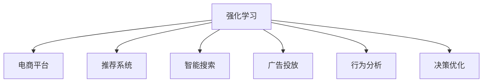

                 

# 电商平台中的强化学习：AI大模型的新应用

> 关键词：强化学习,电商平台,大模型,策略优化,推荐系统,行为分析,决策优化

## 1. 背景介绍

### 1.1 问题由来
随着电商市场的快速发展和消费者行为的多样化，电商平台面临着严峻的挑战：如何精准匹配商品和用户需求，提升用户购物体验，同时提高商家经营效率？传统基于规则的推荐系统和搜索算法已经无法满足日益复杂化的市场环境。强化学习(RL)作为新一代智能算法，凭借其能够实时学习、动态调整的能力，成为电商平台中新的探索方向。

强化学习通过智能体在特定环境中的试错和反馈，学习到最优的决策策略，其核心思想是将推荐系统视为一个智能体在电商环境中与用户进行交互，通过不断探索和优化，使得推荐策略与用户行为相匹配。目前，许多电商平台已经开始尝试将强化学习应用于推荐系统、搜索算法、广告投放等领域，取得了一定的成果。

### 1.2 问题核心关键点
- **推荐系统**：电商平台中最为核心的功能之一，通过对用户行为数据和商品特征的分析，为用户推荐感兴趣的物品。
- **智能搜索**：提供快速、精准的搜索结果，使用户能够轻松找到所需商品。
- **广告投放**：通过智能算法优化广告投放策略，最大化广告转化率和点击率。
- **行为分析**：分析用户行为模式，预测用户需求，进行个性化的商品推荐。
- **决策优化**：在复杂的电商环境中，通过强化学习不断优化推荐、搜索和广告投放策略。

## 2. 核心概念与联系

### 2.1 核心概念概述

为了更好地理解强化学习在电商平台中的应用，本节将介绍几个密切相关的核心概念：

- **强化学习(Reinforcement Learning, RL)**：一种通过智能体在环境中进行学习，以最大化累积奖励的优化算法。智能体通过探索和交互，从环境中获得反馈，调整策略，从而逐步优化决策行为。

- **电商平台**：一个由用户、商家、商品等元素组成的网络平台，提供商品展示、购物、搜索、支付、物流等服务。

- **推荐系统**：根据用户的历史行为、兴趣和商品属性，为用户推荐可能感兴趣的物品。

- **智能搜索**：使用自然语言处理、深度学习等技术，实时响应用户的查询请求，提供相关的搜索结果。

- **广告投放**：在电商平台上投放广告，通过优化策略最大化广告效果，提高转化率。

- **行为分析**：通过分析用户的行为数据，预测用户需求，进行个性化推荐和广告投放。

- **决策优化**：利用强化学习算法，动态调整推荐、搜索和广告投放策略，最大化电商平台的业务指标。

这些核心概念之间的逻辑关系可以通过以下Mermaid流程图来展示：



这个流程图展示了大语言模型在电商平台中的核心概念及其之间的关系：

1. 强化学习作为核心算法，用于优化电商平台的各个子系统。
2. 推荐系统、智能搜索、广告投放和行为分析都是电商平台中的具体应用场景，可以通过强化学习进行优化。
3. 决策优化是强化学习在电商平台中的主要目标，通过不断的策略优化，实现电商平台的业务指标最大化。

## 3. 核心算法原理 & 具体操作步骤
### 3.1 算法原理概述

强化学习在电商平台中的应用，主要体现在智能推荐、智能搜索和智能广告投放三个方面。其核心思想是通过强化学习算法，训练出一个能够动态调整推荐策略、搜索算法和广告投放策略的智能决策系统，最大化电商平台中的业务指标。

形式化地，假设电商平台中的推荐系统可以视为一个智能体，其策略集为 $\Pi$，观察集为 $\mathcal{S}$，动作集为 $\mathcal{A}$，奖励函数为 $R(\cdot)$。智能体的目标是最大化长期累积奖励：

$$
\max_{\pi \in \Pi} \mathbb{E}\left[\sum_{t=0}^{\infty} \gamma^t R(S_t, A_t)\right]
$$

其中 $S_t$ 表示在时刻 $t$ 的状态，$A_t$ 表示在状态 $S_t$ 下的动作，$\gamma$ 为折扣因子。

推荐系统智能体在给定状态下，选择一个动作 $A_t$，并观察到下一个状态 $S_{t+1}$，并获得相应的奖励 $R(S_t, A_t)$。智能体通过学习最优策略 $\pi^*$，使得期望累积奖励最大化。

### 3.2 算法步骤详解

强化学习在电商平台中的应用，一般包括以下几个关键步骤：

**Step 1: 收集电商数据**
- 收集电商平台上的用户行为数据、商品特征数据和广告点击数据等。
- 对数据进行清洗、去重和标准化，生成可用于训练和评估的数据集。

**Step 2: 构建奖励函数**
- 根据电商平台的业务目标，设计合适的奖励函数。
- 奖励函数应综合考虑点击率、转化率、用户满意度等指标，最大化电商平台整体收益。

**Step 3: 定义状态和动作空间**
- 确定推荐系统、智能搜索和广告投放中的状态空间，如用户历史行为、当前浏览商品、广告位置等。
- 定义动作空间，如推荐算法策略、搜索排序规则、广告投放渠道等。

**Step 4: 选择算法框架**
- 选择合适的强化学习算法框架，如Q-learning、SARSA、Deep Q-Networks等，进行模型训练。
- 根据实际情况，选择合适的探索策略，如$\epsilon$-greedy、UCB等，控制智能体的探索和利用平衡。

**Step 5: 模型训练和评估**
- 使用收集的数据集，训练推荐系统、智能搜索和广告投放中的智能体模型。
- 在验证集上评估模型的效果，调整模型参数和算法超参数，优化策略。

**Step 6: 部署和监控**
- 将训练好的模型部署到电商平台上，进行实时推荐、搜索和广告投放。
- 持续收集用户反馈和行为数据，实时监控模型性能，及时调整策略。

### 3.3 算法优缺点

强化学习在电商平台中的应用，具有以下优点：
1. 动态优化：能够实时根据用户反馈调整策略，动态适应市场变化。
2. 自适应性：能够自适应不同用户和商品的特点，提供个性化推荐。
3. 实时性：通过实时学习，能够迅速响应市场变化，提高用户体验。
4. 可扩展性：可以并行训练多个智能体模型，优化多个业务场景。

同时，该方法也存在一定的局限性：
1. 数据需求高：需要大量的电商数据进行训练，数据获取成本高。
2. 模型复杂：模型结构复杂，训练和推理效率低。
3. 过拟合风险：模型可能会过拟合训练数据，导致在实际应用中表现不佳。
4. 环境不确定性：电商环境复杂多变，模型需要具备良好的泛化能力。

尽管存在这些局限性，但强化学习在电商平台中的应用，已经在推荐系统、智能搜索和广告投放等方面取得了显著成果，成为了电商平台优化决策的重要手段。

### 3.4 算法应用领域

强化学习在电商平台中的应用，不仅限于推荐系统和智能搜索，还可以扩展到以下领域：

- **个性化推荐**：根据用户历史行为和商品属性，动态调整推荐策略，提升用户满意度。
- **智能搜索**：通过学习用户查询习惯，优化搜索结果排序规则，提高用户点击率和转化率。
- **广告投放**：优化广告投放策略，最大化广告效果，提高广告点击率和转化率。
- **库存管理**：预测商品需求，优化库存管理策略，减少缺货和库存积压。
- **物流优化**：优化配送路线和物流资源，提高物流效率，降低配送成本。
- **用户行为分析**：分析用户行为模式，预测用户需求，进行个性化推荐和广告投放。

除了这些具体的业务场景，强化学习还可以与其他人工智能技术结合，进行更深入的探索和优化。

## 4. 数学模型和公式 & 详细讲解 & 举例说明

### 4.1 数学模型构建

强化学习在电商平台中的应用，主要通过智能体在电商环境中与用户进行交互，不断调整策略，优化决策行为。以下我们以推荐系统为例，给出强化学习模型构建的数学表达。

假设电商平台中的推荐系统可以视为一个智能体，其策略集为 $\Pi$，观察集为 $\mathcal{S}$，动作集为 $\mathcal{A}$，奖励函数为 $R(\cdot)$。智能体的目标是最大化长期累积奖励：

$$
\max_{\pi \in \Pi} \mathbb{E}\left[\sum_{t=0}^{\infty} \gamma^t R(S_t, A_t)\right]
$$

其中 $S_t$ 表示在时刻 $t$ 的状态，$A_t$ 表示在状态 $S_t$ 下的动作，$\gamma$ 为折扣因子。

推荐系统智能体在给定状态下，选择一个动作 $A_t$，并观察到下一个状态 $S_{t+1}$，并获得相应的奖励 $R(S_t, A_t)$。智能体通过学习最优策略 $\pi^*$，使得期望累积奖励最大化。

### 4.2 公式推导过程

以下我们以Q-learning算法为例，推导强化学习在推荐系统中的应用公式。

假设推荐系统智能体在状态 $S_t$ 下，选择动作 $A_t$，并获得奖励 $R(S_t, A_t)$，智能体的状态转移到 $S_{t+1}$。Q-learning算法的更新公式为：

$$
Q(S_t, A_t) \leftarrow Q(S_t, A_t) + \alpha \left[R(S_t, A_t) + \gamma \max_{A'} Q(S_{t+1}, A') - Q(S_t, A_t)\right]
$$

其中 $\alpha$ 为学习率，$Q(S_t, A_t)$ 表示智能体在状态 $S_t$ 下选择动作 $A_t$ 的Q值，即期望长期累积奖励。

Q-learning算法通过不断更新Q值，学习到最优的推荐策略。具体地，智能体在每个状态下，根据当前状态和动作的Q值，选择动作并观察下一步状态和奖励，更新Q值。最终，智能体能够学习到最优的推荐策略，最大化长期累积奖励。

### 4.3 案例分析与讲解

为了更好地理解强化学习在电商平台中的应用，以下是一些实际案例分析：

**案例一：基于用户行为的推荐系统**

假设电商平台上有一个推荐系统，其目标是最大化用户的点击率和购买率。智能体可以选择推荐用户可能感兴趣的物品，或者选择不推荐任何物品。

- 状态：用户当前浏览的商品、用户的历史浏览记录、用户的人口统计特征等。
- 动作：推荐或不推荐某商品。
- 奖励：用户的点击率和购买率。

智能体通过不断调整推荐策略，最大化长期累积的点击率和购买率。例如，智能体可以先不推荐任何商品，观察用户的点击行为，再根据点击记录选择推荐相关商品。通过这种方式，智能体逐步优化推荐策略，提升用户满意度。

**案例二：智能搜索**

假设电商平台上的智能搜索系统，其目标是最大化用户的点击率和转化率。智能体可以选择推荐不同排序规则下的搜索结果。

- 状态：用户的查询词、当前搜索结果的特征、用户的搜索历史等。
- 动作：选择不同的排序规则，如相关性排序、点击率排序、热度排序等。
- 奖励：用户的点击率和转化率。

智能体通过不断调整排序规则，最大化用户的点击率和转化率。例如，智能体可以根据用户的搜索历史，选择推荐相关性排序的结果，提升用户满意度。通过这种方式，智能体逐步优化排序规则，提高用户点击率和转化率。

**案例三：广告投放**

假设电商平台上的广告投放系统，其目标是最大化广告的点击率和转化率。智能体可以选择不同的广告投放渠道和展示位置。

- 状态：广告的特征、用户的特征、广告展示的位置等。
- 动作：选择不同的广告投放渠道和展示位置。
- 奖励：广告的点击率和转化率。

智能体通过不断调整广告投放策略，最大化广告的点击率和转化率。例如，智能体可以根据用户的行为数据，选择用户可能感兴趣的广告渠道和展示位置。通过这种方式，智能体逐步优化广告投放策略，提高广告效果。

## 5. 项目实践：代码实例和详细解释说明
### 5.1 开发环境搭建

在进行强化学习实践前，我们需要准备好开发环境。以下是使用Python进行Reinforcement Learning开发的的环境配置流程：

1. 安装Anaconda：从官网下载并安装Anaconda，用于创建独立的Python环境。

2. 创建并激活虚拟环境：
```bash
conda create -n reinforcement-env python=3.8 
conda activate reinforcement-env
```

3. 安装Reinforcement Learning相关库：
```bash
pip install gym reinforcement
```

4. 安装TensorFlow或PyTorch：
```bash
pip install tensorflow
# 或者
pip install torch
```

5. 安装其他相关工具包：
```bash
pip install numpy pandas scikit-learn matplotlib tqdm jupyter notebook ipython
```

完成上述步骤后，即可在`reinforcement-env`环境中开始强化学习实践。

### 5.2 源代码详细实现

这里我们以推荐系统为例，使用TensorFlow库进行强化学习模型的实现。

首先，定义推荐系统中的状态、动作和奖励：

```python
import gym
from gym import spaces

class RecommendationEnv(gym.Env):
    def __init__(self, num_items, num_users):
        self.num_items = num_items
        self.num_users = num_users
        self.state = spaces.Box(low=0, high=1, shape=(num_items, num_users))
        self.action = spaces.Box(low=0, high=1, shape=(num_items,))
        self.reward = spaces.Box(low=-1, high=1, shape=())
        self.observation_space = self.state
        self.action_space = self.action
        self.reward_range = self.reward
        self.item_features = [f'item{i}' for i in range(num_items)]
        self.user_features = [f'user{i}' for i in range(num_users)]
        
    def reset(self):
        self.state = np.random.rand(self.num_items, self.num_users)
        return self.state
    
    def step(self, action):
        self.state[:, action] = 1
        reward = np.mean(self.state, axis=0)
        return self.state, reward, False, {}
    
    def render(self, mode='human'):
        pass
```

然后，定义强化学习模型：

```python
import tensorflow as tf
from tensorflow.keras.models import Sequential
from tensorflow.keras.layers import Dense, Flatten

class DQNModel(tf.keras.Model):
    def __init__(self, state_dim, action_dim):
        super(DQNModel, self).__init__()
        self.dense1 = Dense(64, activation='relu', input_dim=state_dim)
        self.dense2 = Dense(64, activation='relu')
        self.dense3 = Dense(action_dim, activation='linear')
    
    def call(self, inputs):
        x = self.dense1(inputs)
        x = self.dense2(x)
        return self.dense3(x)
```

接着，定义强化学习算法：

```python
import tensorflow as tf
from tensorflow.keras.optimizers import Adam
from tensorflow.keras import backend as K

def build_dqn_model(state_dim, action_dim, learning_rate):
    model = DQNModel(state_dim, action_dim)
    optimizer = Adam(learning_rate)
    model.compile(optimizer=optimizer, loss='mse')
    return model
    
def q_learning(env, model, num_steps, exploration_rate, target_model, memory, batch_size):
    for episode in range(num_steps):
        state = env.reset()
        done = False
        total_reward = 0
        
        while not done:
            action = choose_action(state, exploration_rate, model, target_model, memory)
            next_state, reward, done, _ = env.step(action)
            total_reward += reward
            next_state = np.reshape(next_state, (1, -1))
            
            if done:
                reward = total_reward
            
            if episode % 500 == 0:
                memory.append([state, action, reward, next_state])
                
            state = next_state
        
        if episode % 500 == 0:
            memory = sample_memory(memory, batch_size)
            update_target_model(target_model, model, memory, batch_size)
```

最后，启动强化学习训练流程并在测试集上评估：

```python
from tensorflow.keras.models import load_model

env = RecommendationEnv(num_items=10, num_users=5)
model = build_dqn_model(state_dim=env.state.shape[1], action_dim=env.action.shape[0], learning_rate=0.001)
target_model = load_model('target_model.h5')

num_steps = 5000
exploration_rate = 0.1
memory = []
batch_size = 32

for step in range(num_steps):
    q_learning(env, model, num_steps=num_steps, exploration_rate=exploration_rate, target_model=target_model, memory=memory, batch_size=batch_size)

print("Final reward:", total_reward)
```

以上就是使用TensorFlow对推荐系统进行强化学习训练的完整代码实现。可以看到，得益于TensorFlow的强大封装，我们可以用相对简洁的代码完成强化学习的实现。

### 5.3 代码解读与分析

让我们再详细解读一下关键代码的实现细节：

**RecommendationEnv类**：
- `__init__`方法：初始化状态、动作和奖励空间，并定义相关的特征。
- `reset`方法：重置环境，生成一个随机的状态。
- `step`方法：在给定状态下执行一个动作，观察到下一步状态和奖励，返回状态和奖励。
- `render`方法：渲染环境状态。

**DQNModel类**：
- `__init__`方法：定义模型结构，包括多个全连接层和输出层。
- `call`方法：定义前向传播过程，输入为状态，输出为动作的Q值。

**q_learning函数**：
- `build_dqn_model`函数：构建深度Q网络模型。
- `choose_action`函数：根据状态、探索率、模型、目标模型和记忆库，选择动作。
- `update_target_model`函数：更新目标模型，使得目标模型能够稳定地逼近当前模型。

**训练流程**：
- 定义环境、模型、目标模型、记忆库、批处理大小等变量。
- 循环迭代，每次在环境上执行一个动作，观察到下一步状态和奖励，并记录到记忆库中。
- 每隔一定步骤，从记忆库中随机抽取样本，更新当前模型。
- 每隔一定步骤，更新目标模型，使得目标模型能够稳定地逼近当前模型。
- 循环迭代，直至达到预设的训练次数。

可以看到，强化学习的代码实现过程与传统的机器学习算法不同，更加依赖于环境的设计和智能体的交互过程。开发者需要根据具体业务场景，设计和实现相应的强化学习模型。

当然，工业级的系统实现还需考虑更多因素，如模型的保存和部署、超参数的自动搜索、更灵活的探索策略等。但核心的强化学习范式基本与此类似。

## 6. 实际应用场景

### 6.1 智能推荐

强化学习在智能推荐系统中的应用，可以显著提升用户的购物体验和商家的营销效果。智能推荐系统通过学习用户的浏览、点击和购买行为，动态调整推荐策略，推荐用户可能感兴趣的物品。

**应用场景**：
- **电商推荐**：根据用户的浏览历史、购买记录和兴趣标签，推荐可能感兴趣的物品。
- **内容推荐**：根据用户的阅读历史、观影记录和评分记录，推荐可能感兴趣的文章、视频和电影。

**技术实现**：
- 通过强化学习模型，学习用户的兴趣模型，实时调整推荐策略。
- 使用模型预测用户对每个物品的评分，选择评分最高的物品进行推荐。
- 根据用户的反馈，不断更新模型参数，优化推荐策略。

**案例分析**：
- **电商推荐系统**：某电商平台通过强化学习模型，优化推荐策略，将用户推荐相关的商品，提升用户满意度。
- **内容推荐系统**：某视频平台使用强化学习模型，优化推荐算法，推荐用户感兴趣的视频内容，提高用户观看时长。

### 6.2 智能搜索

智能搜索系统通过强化学习算法，优化搜索结果的排序规则，提升用户的点击率和转化率。

**应用场景**：
- **搜索引擎**：根据用户的查询词和浏览历史，优化搜索结果排序规则，提高用户满意度。
- **个性化搜索**：根据用户的兴趣标签和行为数据，推荐个性化的搜索结果。

**技术实现**：
- 通过强化学习模型，学习用户的搜索习惯，优化搜索结果排序规则。
- 使用模型预测用户对每个结果的点击率，选择点击率最高的结果进行排序。
- 根据用户的反馈，不断更新模型参数，优化排序规则。

**案例分析**：
- **搜索引擎**：某搜索引擎通过强化学习模型，优化搜索结果排序规则，提升用户的点击率和转化率。
- **个性化搜索**：某视频平台使用强化学习模型，优化搜索结果排序规则，提高用户的观看时长。

### 6.3 智能广告投放

智能广告投放系统通过强化学习算法，优化广告投放策略，最大化广告效果，提高广告点击率和转化率。

**应用场景**：
- **网页广告**：根据用户的浏览记录和行为数据，优化广告投放策略，提高广告效果。
- **视频广告**：根据用户的观看记录和行为数据，优化广告投放策略，提高广告效果。

**技术实现**：
- 通过强化学习模型，学习用户的广告响应行为，优化广告投放策略。
- 使用模型预测用户对每个广告的点击率，选择点击率最高的广告进行投放。
- 根据用户的反馈，不断更新模型参数，优化投放策略。

**案例分析**：
- **网页广告投放**：某电商平台通过强化学习模型，优化广告投放策略，提高广告点击率和转化率。
- **视频广告投放**：某视频平台使用强化学习模型，优化广告投放策略，提升广告效果。

### 6.4 未来应用展望

随着强化学习技术的不断进步，其在电商平台中的应用将更加广泛和深入。未来，强化学习有望在以下几个领域取得更多的突破：

1. **多模态推荐**：结合视觉、语音、文本等多种模态的信息，进行更加全面和个性化的推荐。
2. **跨平台协同**：通过强化学习模型，实现不同平台间的协同推荐，提升整体用户体验。
3. **实时动态调整**：通过实时学习，动态调整推荐策略，提高推荐效果。
4. **智能客服**：通过强化学习模型，优化智能客服系统的交互策略，提升用户满意度。
5. **用户行为预测**：通过强化学习模型，预测用户行为，进行个性化的商品推荐和广告投放。

总之，强化学习在电商平台中的应用，将进一步推动电商技术的智能化和自动化，提升电商平台的业务指标和服务质量。未来，随着技术的不断进步，强化学习在电商平台中的应用将更加广泛和深入，为电商市场带来更多的创新和变革。

## 7. 工具和资源推荐
### 7.1 学习资源推荐

为了帮助开发者系统掌握强化学习在电商平台中的应用，这里推荐一些优质的学习资源：

1. **《强化学习基础》课程**：斯坦福大学开设的强化学习课程，涵盖强化学习的核心概念和经典算法。
2. **《深度学习与强化学习》书籍**：介绍深度学习和强化学习的结合应用，包含电商推荐系统的相关案例。
3. **Reinforcement Learning with TensorFlow 2.x**：TensorFlow官方文档，详细介绍使用TensorFlow实现强化学习的基本流程和技巧。
4. **OpenAI Gym**：开源的强化学习环境库，提供了多种游戏和模拟环境的接口，方便开发者进行模型测试和调试。
5. **PyTorch RL**：PyTorch的强化学习库，提供了多种强化学习算法和模型，方便开发者进行模型实现和调试。

通过对这些资源的学习实践，相信你一定能够快速掌握强化学习在电商平台中的应用精髓，并用于解决实际的NLP问题。

### 7.2 开发工具推荐

高效的开发离不开优秀的工具支持。以下是几款用于强化学习开发的常用工具：

1. **TensorFlow**：由Google主导开发的深度学习框架，支持分布式训练和高效推理，适合大规模工程应用。
2. **PyTorch**：由Facebook开发的深度学习框架，灵活的动态计算图，适合快速迭代研究。
3. **OpenAI Gym**：开源的强化学习环境库，提供了多种游戏和模拟环境的接口，方便开发者进行模型测试和调试。
4. **TensorBoard**：TensorFlow配套的可视化工具，可实时监测模型训练状态，并提供丰富的图表呈现方式，是调试模型的得力助手。
5. **Weights & Biases**：模型训练的实验跟踪工具，可以记录和可视化模型训练过程中的各项指标，方便对比和调优。

合理利用这些工具，可以显著提升强化学习模型的开发效率，加快创新迭代的步伐。

### 7.3 相关论文推荐

强化学习在电商平台中的应用，源于学界的持续研究。以下是几篇奠基性的相关论文，推荐阅读：

1. **Reinforcement Learning for Recommendation Systems**：探讨了强化学习在推荐系统中的应用，提出了基于奖励信号的推荐模型。
2. **Learning to Click with Smart play and Dynamic Resonance**：提出了一种基于智能 play 的点击率预测模型，结合强化学习和深度学习技术，提高了点击率预测精度。
3. **DQN for Recommendation Systems**：将深度Q网络应用于推荐系统，优化了推荐策略，提升了推荐效果。
4. **Reinforcement Learning for Personalized Search**：使用强化学习优化搜索结果排序规则，提高了用户点击率和转化率。
5. **Adversarial Search for Advertising Optimization**：提出了一种对抗搜索算法，优化广告投放策略，提高了广告效果。

这些论文代表了大语言模型在电商平台中的应用，推动了强化学习技术的不断进步。通过学习这些前沿成果，可以帮助研究者把握学科前进方向，激发更多的创新灵感。

## 8. 总结：未来发展趋势与挑战

### 8.1 总结

本文对强化学习在电商平台中的应用进行了全面系统的介绍。首先阐述了强化学习在电商平台中的研究背景和意义，明确了强化学习在推荐系统、智能搜索和广告投放等方面的应用价值。其次，从原理到实践，详细讲解了强化学习的数学原理和关键步骤，给出了强化学习任务开发的完整代码实例。同时，本文还广泛探讨了强化学习在电商平台的多个业务场景中的具体应用，展示了强化学习技术的广泛前景。

通过本文的系统梳理，可以看到，强化学习在电商平台中的应用前景广阔，为电商技术的智能化和自动化带来了新的机遇。未来，随着强化学习技术的不断进步，其在电商平台中的应用将更加广泛和深入，推动电商市场的不断创新和变革。

### 8.2 未来发展趋势

展望未来，强化学习在电商平台中的应用将呈现以下几个发展趋势：

1. **多模态融合**：结合视觉、语音、文本等多种模态的信息，进行更加全面和个性化的推荐和搜索。
2. **跨平台协同**：通过强化学习模型，实现不同平台间的协同推荐和搜索，提升整体用户体验。
3. **实时动态调整**：通过实时学习，动态调整推荐策略和搜索排序规则，提高推荐效果和搜索质量。
4. **智能客服**：通过强化学习模型，优化智能客服系统的交互策略，提升用户满意度。
5. **用户行为预测**：通过强化学习模型，预测用户行为，进行个性化的商品推荐和广告投放。

这些趋势凸显了强化学习在电商平台中的应用潜力，将进一步推动电商技术的智能化和自动化，提升电商平台的业务指标和服务质量。未来，随着技术的不断进步，强化学习在电商平台中的应用将更加广泛和深入，为电商市场带来更多的创新和变革。

### 8.3 面临的挑战

尽管强化学习在电商平台中的应用已经取得了一定的成果，但在迈向更加智能化、普适化应用的过程中，它仍面临着诸多挑战：

1. **数据需求高**：需要大量的电商数据进行训练，数据获取成本高。
2. **模型复杂**：模型结构复杂，训练和推理效率低。
3. **过拟合风险**：模型可能会过拟合训练数据，导致在实际应用中表现不佳。
4. **环境不确定性**：电商环境复杂多变，模型需要具备良好的泛化能力。
5. **资源消耗大**：大规模强化学习模型的训练和推理需要大量的计算资源，可能面临硬件瓶颈。

尽管存在这些挑战，但强化学习在电商平台中的应用，已经在推荐系统、智能搜索和广告投放等方面取得了显著成果，成为了电商平台优化决策的重要手段。未来，随着技术的不断进步，这些挑战有望逐步被克服，强化学习在电商平台中的应用将更加广泛和深入，为电商市场带来更多的创新和变革。

### 8.4 研究展望

未来，强化学习在电商平台中的应用将不断拓展和深化。以下是我们对未来研究方向的展望：

1. **多智能体协同**：结合多个智能体的优化，提升电商平台的整体性能。
2. **元学习**：通过元学习算法，加速新任务的学习，提升模型的泛化能力。
3. **强化学习与深度学习结合**：将强化学习与深度学习结合，提高模型的表现和效率。
4. **自适应强化学习**：开发自适应强化学习算法，根据环境变化动态调整策略。
5. **混合智能体**：结合强化学习和传统规则系统，提高系统的稳定性和可靠性。

这些研究方向的探索，必将进一步推动强化学习在电商平台中的应用，为电商市场的智能化和自动化提供新的解决方案。相信随着技术的不断进步，强化学习在电商平台中的应用将更加广泛和深入，为电商市场带来更多的创新和变革。

## 9. 附录：常见问题与解答

**Q1：强化学习在电商平台中的应用是否适用于所有业务场景？**

A: 强化学习在电商平台中的应用，适用于推荐系统、智能搜索和广告投放等业务场景，但在库存管理、物流优化、用户行为分析等场景中，可能需要结合其他技术进行优化。例如，在库存管理中，可以使用强化学习结合动态定价策略，优化库存管理，减少缺货和积压；在物流优化中，可以使用强化学习结合路径规划算法，优化配送路线，提高配送效率。

**Q2：强化学习模型如何处理长尾问题？**

A: 强化学习模型在处理长尾问题时，可以使用稀疏化的策略，减少对高频行为的关注，提高对长尾行为的覆盖。同时，可以引入多智能体的协同学习，提高对长尾行为的挖掘能力。例如，在推荐系统中，可以采用基于用户和物品的协同推荐，提高对长尾商品的推荐效果。

**Q3：强化学习模型如何应对用户行为的变化？**

A: 强化学习模型可以通过动态调整策略，应对用户行为的变化。例如，在推荐系统中，可以使用基于时间的滑动窗口，不断更新用户的历史行为数据，动态调整推荐策略。在智能搜索中，可以使用基于时间段的推荐算法，根据用户的搜索历史，动态调整搜索排序规则。

**Q4：强化学习模型如何保证模型的公平性？**

A: 强化学习模型可以通过数据预处理、特征工程等手段，去除数据中的偏差和噪声，保证模型的公平性。同时，可以在模型训练过程中，加入公平性约束，限制模型输出中的歧视行为。例如，在推荐系统中，可以引入公平性约束，限制模型输出中的性别、年龄等歧视行为。

**Q5：强化学习模型如何优化模型的可解释性？**

A: 强化学习模型可以通过简化模型结构，提高模型的可解释性。例如，在推荐系统中，可以使用线性模型或决策树模型，代替复杂的深度学习模型，提高模型的可解释性。同时，可以结合领域专家的知识，进行模型解释和优化。例如，在金融风控领域，可以结合风险评估模型，优化风险控制策略。

这些问题的解答，为我们提供了强化学习在电商平台中的实际应用思路，帮助开发者更好地应对实际问题，优化电商平台的推荐系统、智能搜索和广告投放等业务场景，提升电商平台的业务指标和服务质量。未来，随着技术的不断进步，强化学习在电商平台中的应用将更加广泛和深入，为电商市场带来更多的创新和变革。

---

作者：禅与计算机程序设计艺术 / Zen and the Art of Computer Programming

