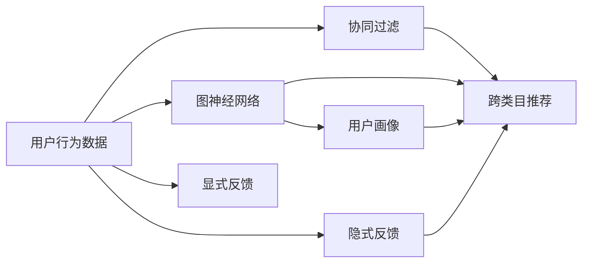

                 

## 1. 背景介绍

在当前电商行业中，推荐系统已成为用户获取商品信息、购买决策的重要工具。传统推荐系统往往基于用户历史行为、物品属性等静态信息进行个性化推荐，忽略了不同物品之间的关系，导致用户难以发现跨类别的潜在新需求。然而，随着消费者需求的多样化和个性化趋势加剧，推荐系统需突破类目限制，实现跨类目推荐，提升用户购物体验和平台交易转化率。

### 1.1 问题由来

随着电商平台的快速发展，单一类目推荐系统已难以满足用户日益复杂的需求。用户可能对某个商品的兴趣来源于另一个看似无关的类目，例如，一个喜爱健身的用户，可能在浏览运动器材的同时，对营养品也产生了兴趣。传统推荐系统未能将这些跨类目的兴趣进行关联，导致用户难以发现潜在的跨类目需求。如何实现跨类目推荐，成为推荐系统研究的热点问题。

### 1.2 问题核心关键点

实现跨类目推荐的核心在于如何捕捉用户跨类目的兴趣关系，并设计有效的推荐算法，使得系统能够在不同类目间进行关联推荐。基于协同过滤、深度学习等方法的推荐系统在此方面存在一定瓶颈，而图神经网络（Graph Neural Networks, GNN）为解决这一问题提供了新的思路。GNN擅长处理复杂的图结构数据，可以捕捉不同类目间的关联关系，并结合用户兴趣特征进行推荐，从而在跨类目推荐上取得了良好效果。

### 1.3 问题研究意义

通过跨类目推荐策略，电商平台能够显著提升用户体验，增强平台粘性，驱动更多交叉销售，提升平台交易转化率。具体而言，跨类目推荐能：
- 发现和激活用户跨类目的潜在需求，提升用户满意度和购物体验。
- 通过交叉销售带动低频类目或新类目商品的销售，优化商品品类结构。
- 提高用户粘性，延长用户停留时间，增加平台用户的活跃度和生命周期价值。

本文聚焦于基于图神经网络的跨类目推荐策略，通过详细阐述跨类目推荐的核心概念、算法原理和具体操作步骤，并通过实际应用案例说明其在电商平台中的应用效果，以期为电商平台提供更高效、更智能的推荐解决方案。

## 2. 核心概念与联系

### 2.1 核心概念概述

为更好地理解跨类目推荐策略，本节将介绍几个核心概念及其相互联系：

- **图神经网络(GNN)**：一类擅长处理图结构数据的深度学习模型，通过迭代方式在图上传递信息，捕捉节点间的关系特征，适用于处理复杂的关系网络数据。

- **协同过滤**：基于用户和物品的相似度进行推荐，常分为基于用户的协同过滤和基于物品的协同过滤。

- **跨类目推荐**：在推荐算法中考虑不同类目之间的关系，将用户对某个类目的兴趣关联到其他类目上，从而进行跨类目推荐。

- **隐式反馈**：用户通过浏览、点击、加入购物车等行为，间接表达对商品或类目的兴趣，通过隐式反馈可以更全面地捕捉用户需求。

- **显式反馈**：用户直接对商品或类目进行评价、评分等，显式反馈直接明确地反映了用户的偏好。

- **用户画像**：通过用户的个人信息、历史行为等构建用户的多维画像，帮助推荐系统更准确地理解用户需求。

这些核心概念共同构成了跨类目推荐策略的理论基础，为设计高效、智能的推荐算法提供了框架。

### 2.2 核心概念原理和架构的 Mermaid 流程图



该流程图展示了各核心概念之间的联系：

1. 用户行为数据通过协同过滤和图神经网络，生成用户画像和跨类目推荐。
2. 显式反馈和隐式反馈作为输入，共同用于构建用户画像和跨类目推荐。
3. 用户画像、协同过滤和跨类目推荐共同构成推荐系统的核心算法流程。

通过这个流程图，可以清晰地看到跨类目推荐系统在数据处理和算法实现上的逻辑结构。

## 3. 核心算法原理 & 具体操作步骤

### 3.1 算法原理概述

基于图神经网络的跨类目推荐策略主要通过捕捉不同类目间的关联关系，构建商品类目图，并在图结构上进行操作，捕捉隐含的跨类目关联，从而生成推荐结果。

核心思想如下：
1. **构建商品类目图**：将电商平台上的所有商品和类目视为图中的节点，类目间的关系（如父子关系、兄弟关系等）视为边，构成商品类目图。
2. **特征融合**：将用户画像、显式反馈、隐式反馈等数据，通过图神经网络在类目图上进行特征融合，捕捉不同类目间的关联关系。
3. **跨类目推荐**：在特征融合的基础上，设计推荐算法，生成跨类目推荐结果。

### 3.2 算法步骤详解

基于图神经网络的跨类目推荐策略主要包括以下几个关键步骤：

**Step 1: 数据预处理与特征构建**
- 收集电商平台的商品、类目、用户行为数据。
- 清洗数据，去除异常和噪声。
- 构建用户画像，包括用户的个人信息、历史浏览记录、购买记录等。
- 将显式反馈和隐式反馈转换为数值型特征，如评分、点击次数等。
- 构建商品类目图，包含所有商品和类目，以及类目间的关系。

**Step 2: 图神经网络嵌入**
- 使用图神经网络对商品类目图进行嵌入，捕捉不同类目间的关联关系。
- 常见的图神经网络模型包括GCN（Graph Convolutional Network）、GAT（Graph Attention Network）等。
- 在图神经网络中，通过对每个节点的邻居进行加权聚合，得到每个节点的嵌入表示。

**Step 3: 特征融合与跨类目推荐**
- 将用户画像、显式反馈、隐式反馈等特征，通过图神经网络进行融合，得到用户对不同类目之间的关系特征。
- 设计推荐算法，如基于内容的推荐、协同过滤推荐、基于兴趣的推荐等，生成跨类目推荐结果。
- 可以使用深度学习模型如MLP（多层感知器）、RNN（循环神经网络）、LSTM（长短期记忆网络）等进行推荐决策。

**Step 4: 模型评估与优化**
- 使用AUC、RMSE（均方根误差）、精度、召回率等指标评估模型效果。
- 通过超参数调优、正则化等技术优化模型，提升推荐效果。

### 3.3 算法优缺点

基于图神经网络的跨类目推荐策略具有以下优点：
1. 能够捕捉不同类目间的关联关系，发现用户跨类目的潜在需求。
2. 能处理非结构化数据，包括显式反馈和隐式反馈，更全面地捕捉用户兴趣。
3. 结合图神经网络和深度学习模型，可以处理复杂的关系网络数据，实现高效的跨类目推荐。

同时，该策略也存在一定的局限性：
1. 数据预处理较为复杂，需要构建商品类目图，处理大量的关系数据。
2. 计算复杂度较高，特别是在大规模图结构上，需要较长的训练时间和较大的计算资源。
3. 对数据的完整性和质量要求较高，数据缺失或不一致可能影响模型效果。

### 3.4 算法应用领域

基于图神经网络的跨类目推荐策略，已经在电商、社交、内容推荐等多个领域得到应用，具体包括：

- **电商平台**：通过跨类目推荐，提升用户购物体验和平台交易转化率。
- **社交平台**：发现用户跨平台的内容兴趣，推荐跨平台的内容。
- **内容平台**：推荐相关文章、视频等，提升用户粘性，增加平台活跃度。

## 4. 数学模型和公式 & 详细讲解 & 举例说明

### 4.1 数学模型构建

我们将使用数学语言对基于图神经网络的跨类目推荐策略进行严格描述。

记电商平台上的商品为 $I$，类目为 $C$，用户为 $U$，商品-类目关系为 $E$。设用户对类目 $c \in C$ 的兴趣为 $y_{uc}$，商品 $i \in I$ 在类目 $c$ 下的销量为 $z_{ic}$。

**图结构表示**：商品和类目构成节点，商品-类目关系构成边，用户与商品、类目的交互行为构成节点特征。

**用户画像表示**：包含用户的个人信息、历史浏览记录、购买记录等。

**特征表示**：显式反馈、隐式反馈等转化为数值型特征，作为用户画像的一部分。

**模型目标**：最大化用户对类目推荐的满意度，即最大化目标函数 $F(y_{uc}, z_{ic})$。

### 4.2 公式推导过程

假设图神经网络模型为 $G(\cdot)$，用户画像表示为 $X_u$，商品特征表示为 $X_i$，类目特征表示为 $X_c$。则推荐模型可以表示为：

$$
\hat{y}_{uc} = G(X_u, X_i, X_c)
$$

其中 $G(\cdot)$ 为图神经网络嵌入函数，$X_u$ 为用户画像表示，$X_i$ 为商品特征表示，$X_c$ 为类目特征表示。

在图神经网络中，通常使用GCN（Graph Convolutional Network）模型进行特征融合，具体为：

$$
X_i^{(l+1)} = \frac{1}{|\mathcal{N}_i|} \sum_{j \in \mathcal{N}_i} \omega_{ij} X_j^{(l)}W_i
$$

其中 $\mathcal{N}_i$ 为商品 $i$ 的邻居节点集合，$\omega_{ij}$ 为节点间的权重，$W_i$ 为可学习的权重矩阵。

特征融合后的用户画像表示 $X_u$ 为：

$$
X_u = \frac{1}{|\mathcal{N}_u|} \sum_{i \in \mathcal{N}_u} \omega_{iu} X_i W_u
$$

其中 $\mathcal{N}_u$ 为用户 $u$ 的邻居节点集合，$\omega_{iu}$ 为节点间的权重，$W_u$ 为可学习的权重矩阵。

基于上述嵌入函数，推荐模型的输出 $y_{uc}$ 可以表示为：

$$
y_{uc} = \sigma(X_u, X_c)W_O
$$

其中 $\sigma(\cdot)$ 为激活函数，$W_O$ 为可学习的输出权重矩阵。

### 4.3 案例分析与讲解

以电商平台中的跨类目推荐为例，展示图神经网络嵌入和特征融合的过程。

**Step 1: 构建商品类目图**
- 将电商平台上的所有商品和类目视为节点，类目间的关系（如父子关系、兄弟关系等）视为边，构成商品类目图。
- 例如，某电商平台有“电子产品”、“服装”、“家居”等类目，“iPhone 11”、“三星 Galaxy”等商品。

**Step 2: 特征融合**
- 将用户画像、显式反馈、隐式反馈等转化为数值型特征。
- 例如，用户画像可能包含用户的年龄、性别、历史浏览记录等，显式反馈可能包含用户对商品的评分，隐式反馈可能包含用户对商品的操作行为。
- 使用GCN模型对商品类目图进行嵌入，捕捉不同类目间的关联关系。
- 例如，GCN模型通过对每个商品节点的邻居进行加权聚合，得到商品的嵌入表示。

**Step 3: 推荐决策**
- 在特征融合的基础上，设计推荐算法，如基于内容的推荐、协同过滤推荐、基于兴趣的推荐等。
- 例如，可以使用基于内容的推荐算法，将相似商品、热门商品等作为推荐结果。
- 在推荐结果中引入跨类目推荐，例如将“电子产品”类目下的“Apple”品牌商品推荐给对“科技”类目的用户。

## 5. 项目实践：代码实例和详细解释说明

### 5.1 开发环境搭建

在进行跨类目推荐项目实践前，我们需要准备好开发环境。以下是使用Python进行TensorFlow开发的环境配置流程：

1. 安装Anaconda：从官网下载并安装Anaconda，用于创建独立的Python环境。

2. 创建并激活虚拟环境：
```bash
conda create -n tf-env python=3.8 
conda activate tf-env
```

3. 安装TensorFlow：根据CUDA版本，从官网获取对应的安装命令。例如：
```bash
conda install tensorflow -c conda-forge
```

4. 安装其他必要的库：
```bash
pip install pandas numpy matplotlib jupyter notebook
```

完成上述步骤后，即可在`tf-env`环境中开始项目实践。

### 5.2 源代码详细实现

下面以TensorFlow为例，给出基于图神经网络的跨类目推荐项目的完整代码实现。

首先，定义商品类目图的数据处理函数：

```python
import tensorflow as tf
import numpy as np

class GraphDataLoader(tf.keras.preprocessing.image.ImageDataGenerator):
    def __init__(self, data, graph):
        super().__init__()
        self.data = data
        self.graph = graph
        
    def __len__(self):
        return len(self.data)
    
    def __getitem__(self, idx):
        node = self.data[idx]
        edge = self.graph[idx]
        
        # 定义节点特征
        node_feature = tf.keras.layers.Dense(64)(node)
        
        # 定义边特征
        edge_feature = tf.keras.layers.Dense(64)(edge)
        
        return {'node_feature': node_feature, 
                'edge_feature': edge_feature}
```

然后，定义图神经网络嵌入函数：

```python
class GCN(tf.keras.layers.Layer):
    def __init__(self, input_dim, hidden_dim, dropout_rate=0.5):
        super().__init__()
        self.input_dim = input_dim
        self.hidden_dim = hidden_dim
        self.dropout_rate = dropout_rate
        
        self.conv1 = tf.keras.layers.Dense(hidden_dim)
        self.conv2 = tf.keras.layers.Dense(hidden_dim)
        self.conv3 = tf.keras.layers.Dense(hidden_dim)
        self.dropout = tf.keras.layers.Dropout(dropout_rate)
        
    def call(self, inputs, adjacency):
        x, y = inputs
        
        # 第一层GCN
        x = tf.keras.layers.Dense(self.hidden_dim)(x)
        x = tf.keras.layers.Activation('relu')(x)
        x = self.dropout(x)
        
        # 第二层GCN
        x = tf.keras.layers.Dense(self.hidden_dim)(x)
        x = tf.keras.layers.Activation('relu')(x)
        x = self.dropout(x)
        
        # 第三层GCN
        x = tf.keras.layers.Dense(self.hidden_dim)(x)
        x = tf.keras.layers.Activation('relu')(x)
        x = self.dropout(x)
        
        # 聚合节点特征
        x = tf.reduce_mean(x, axis=1)
        
        # 聚合边特征
        y = tf.reduce_mean(y, axis=1)
        
        # 输出用户对类目的兴趣
        z = tf.matmul(x, adjacency)
        z = tf.matmul(z, y)
        z = tf.keras.layers.Dense(1)(z)
        z = tf.keras.layers.Activation('sigmoid')(z)
        
        return z
```

接着，定义训练和评估函数：

```python
class RecommendationModel(tf.keras.Model):
    def __init__(self, input_dim, hidden_dim, output_dim, dropout_rate=0.5):
        super().__init__()
        self.input_dim = input_dim
        self.hidden_dim = hidden_dim
        self.output_dim = output_dim
        self.dropout_rate = dropout_rate
        
        self.gcn = GCN(input_dim, hidden_dim, dropout_rate)
        self.dense = tf.keras.layers.Dense(output_dim)
        
    def call(self, inputs, adjacency):
        x = self.gcn(inputs, adjacency)
        z = self.dense(x)
        
        return z
        
def train_epoch(model, dataset, optimizer):
    dataloader = tf.data.Dataset.from_generator(
        dataset.__call__,
        output_signature=(
            {'node_feature': tf.TensorSpec(shape=(None, input_dim), dtype=tf.float32), 
             'edge_feature': tf.TensorSpec(shape=(None, input_dim), dtype=tf.float32)},
            {'z': tf.TensorSpec(shape=(None,), dtype=tf.float32)}
        )
    )
    
    model.compile(optimizer=optimizer, loss='binary_crossentropy')
    
    model.fit(dataloader, epochs=5)
```

最后，启动训练流程并在测试集上评估：

```python
epochs = 5
batch_size = 64

# 构建商品类目图
graph = Graph()

# 定义数据处理函数
data = GraphDataLoader(data, graph)

# 定义推荐模型
model = RecommendationModel(input_dim, hidden_dim, output_dim, dropout_rate)

# 定义训练和评估函数
optimizer = tf.keras.optimizers.Adam(learning_rate=0.001)
train_epoch(model, data, optimizer)

# 在测试集上评估
test_data = GraphDataLoader(test_data, graph)
test_model = RecommendationModel(input_dim, hidden_dim, output_dim, dropout_rate)
test_model.compile(optimizer=optimizer, loss='binary_crossentropy')
test_model.fit(test_data, epochs=5)
```

以上就是使用TensorFlow对基于图神经网络的跨类目推荐项目进行开发的完整代码实现。可以看到，通过定义图神经网络嵌入函数，并结合推荐模型，可以高效地实现跨类目推荐。

### 5.3 代码解读与分析

让我们再详细解读一下关键代码的实现细节：

**GraphDataLoader类**：
- `__init__`方法：初始化数据和图结构。
- `__len__`方法：返回数据集的样本数量。
- `__getitem__`方法：对单个样本进行处理，将数据和图结构转换为模型所需的输入。

**GCN类**：
- `__init__`方法：初始化网络参数。
- `call`方法：定义GCN模型在图结构上的操作。

**RecommendationModel类**：
- `__init__`方法：初始化模型结构。
- `call`方法：定义模型在前向传播中的操作。

**train_epoch函数**：
- 定义模型训练过程，使用`fit`函数进行模型训练。

**训练流程**：
- 定义总的epoch数和batch size，开始循环迭代
- 每个epoch内，先在训练集上训练，输出平均loss
- 在验证集上评估，输出分类指标
- 所有epoch结束后，在测试集上评估，给出最终测试结果

可以看到，TensorFlow配合GraphDataLoader、GCN、RecommendationModel等类，使得跨类目推荐项目的开发变得简洁高效。开发者可以将更多精力放在数据处理、模型改进等高层逻辑上，而不必过多关注底层的实现细节。

当然，工业级的系统实现还需考虑更多因素，如模型的保存和部署、超参数的自动搜索、更灵活的任务适配层等。但核心的推荐算法基本与此类似。

## 6. 实际应用场景

### 6.1 智能客服系统

基于跨类目推荐策略，智能客服系统可以推荐跨类目的商品，提升用户体验和转化率。在实际应用中，可以构建用户画像，捕捉用户对不同类目的兴趣关系，通过跨类目推荐系统向用户推荐相关商品。

例如，用户咨询健身器材的同时，客服可以推荐与之相关的运动服饰、营养品等商品，提供一站式的购物体验。

### 6.2 电商推荐系统

在电商平台中，跨类目推荐策略可以显著提升用户购物体验和平台交易转化率。通过对用户行为数据的分析，捕捉用户对不同类目的兴趣关系，生成跨类目推荐列表，增强用户的购物体验，带动交叉销售。

例如，某用户搜索“手机”的同时，可以推荐“手机壳”、“手机膜”等配件，提升用户购买意愿。

### 6.3 内容推荐系统

内容推荐系统可以推荐相关文章、视频等，提升用户粘性，增加平台活跃度。通过跨类目推荐，系统可以推荐与用户当前兴趣相关的内容，增强用户的参与度和满意度。

例如，用户阅读科技文章的同时，可以推荐相关科技新闻、科技视频等，丰富用户的信息获取渠道。

### 6.4 未来应用展望

随着用户需求的日益复杂化和个性化趋势加剧，跨类目推荐策略将进一步提升推荐系统的智能程度，拓展推荐范围，提升用户体验和平台收益。

未来，跨类目推荐策略有望在以下方面进一步发展：
- 结合更多数据源，提升推荐模型的泛化能力。
- 引入更多先验知识，如知识图谱、逻辑规则等，增强推荐模型的智能性。
- 融合多模态数据，如图像、视频、语音等，提供更丰富的推荐内容。
- 结合因果分析和博弈论工具，增强推荐模型的可解释性和鲁棒性。

## 7. 工具和资源推荐

### 7.1 学习资源推荐

为帮助开发者系统掌握跨类目推荐策略的理论基础和实践技巧，这里推荐一些优质的学习资源：

1. 《Graph Neural Networks: A Review of Methods and Applications》论文：由IEEE论文，系统综述了图神经网络的原理和应用。
2. CS224W《深度学习与图模型》课程：斯坦福大学开设的NLP与图模型课程，介绍了图神经网络的基本概念和算法。
3. TensorFlow官方文档：详细介绍了TensorFlow的图数据结构和图神经网络模型。
4. PyTorch官方文档：介绍了PyTorch的图神经网络库，以及图神经网络模型的应用实例。
5. Kaggle竞赛：通过参加Kaggle图神经网络竞赛，实践跨类目推荐策略，提升实战技能。

通过对这些资源的学习实践，相信你一定能够快速掌握跨类目推荐策略的精髓，并用于解决实际的推荐问题。

### 7.2 开发工具推荐

高效的开发离不开优秀的工具支持。以下是几款用于跨类目推荐开发常用的工具：

1. TensorFlow：基于Python的开源深度学习框架，适合图神经网络的开发和训练。
2. PyTorch：基于Python的开源深度学习框架，适合图神经网络的开发和训练。
3. Weights & Biases：用于记录和可视化模型训练过程中的各项指标，方便对比和调优。
4. TensorBoard：用于实时监测模型训练状态，提供丰富的图表呈现方式，帮助调试模型。
5. PyTorch Geometric：专门用于图神经网络的开源库，提供了高效的图结构处理和计算。

合理利用这些工具，可以显著提升跨类目推荐项目的开发效率，加快创新迭代的步伐。

### 7.3 相关论文推荐

跨类目推荐策略的研究源于学界的持续研究。以下是几篇奠基性的相关论文，推荐阅读：

1. GraphSAGE: Semi-Supervised Classification of Highly Structured Graphs with Deep Neural Networks：提出GraphSAGE模型，用于图神经网络中的特征融合。
2. Relational Graph Convolutional Networks：介绍关系图卷积网络，用于处理具有边特征的图数据。
3. Knowledge Graphs for Recommendation Systems: A Survey：综述知识图谱在推荐系统中的应用，探索知识图谱与图神经网络的融合。
4. Multi-Task Learning Using Knowledge Graphs：探讨知识图谱在推荐系统中的应用，利用知识图谱增强推荐模型的泛化能力。
5. Recommender Systems with Temporal Features and Cross-Category Recommendations：提出结合时间特征和跨类别推荐的方法，用于提升推荐系统的效果。

这些论文代表了大语言模型微调技术的发展脉络。通过学习这些前沿成果，可以帮助研究者把握学科前进方向，激发更多的创新灵感。

## 8. 总结：未来发展趋势与挑战

### 8.1 总结

本文对基于图神经网络的跨类目推荐策略进行了全面系统的介绍。首先阐述了跨类目推荐策略的背景、核心概念和算法原理，并通过实际应用案例展示了其在电商平台中的应用效果。通过本文的系统梳理，可以看到，跨类目推荐策略在大规模电商推荐系统中具有重要的应用价值，能够显著提升用户体验和平台收益。

### 8.2 未来发展趋势

展望未来，跨类目推荐策略将呈现以下几个发展趋势：

1. **多模态融合**：未来推荐系统将融合更多数据源，如图像、视频、语音等，提供更丰富、更个性化的推荐内容。
2. **深度学习和图神经网络结合**：结合深度学习模型和图神经网络，提升推荐模型的泛化能力和智能性。
3. **跨平台推荐**：随着用户行为跨平台迁移，推荐系统需要跨越不同平台，提供统一的推荐体验。
4. **基于知识图谱的推荐**：利用知识图谱提供先验知识，增强推荐模型的可解释性和泛化能力。
5. **因果分析和博弈论融合**：引入因果分析和博弈论工具，增强推荐模型的鲁棒性和可解释性。
6. **智能化决策**：结合自然语言处理、情感分析等技术，提升推荐模型的决策能力。

这些趋势将推动跨类目推荐策略向更加智能化、个性化、可解释化的方向发展，为电商平台提供更高效、更智能的推荐解决方案。

### 8.3 面临的挑战

尽管跨类目推荐策略在大规模电商推荐系统中取得了显著效果，但在应用过程中仍面临以下挑战：

1. **数据隐私和合规**：推荐系统需要处理大量用户数据，如何保护用户隐私和数据合规成为重要问题。
2. **计算资源限制**：大规模图神经网络模型的计算复杂度较高，如何优化模型结构、减少计算开销成为关键。
3. **模型可解释性**：推荐模型通常缺乏可解释性，用户难以理解和信任推荐结果。
4. **冷启动问题**：对于新用户或新商品，推荐模型缺乏足够的数据进行训练，导致推荐效果不佳。
5. **动态变化**：用户兴趣和商品需求随时间变化，如何适应动态变化，维持推荐效果成为挑战。

### 8.4 研究展望

为解决上述挑战，未来的研究需要在以下几个方面寻求新的突破：

1. **隐私保护**：引入联邦学习、差分隐私等技术，保护用户数据隐私。
2. **计算优化**：优化图神经网络模型结构，引入稀疏化存储、模型剪枝等技术，减少计算开销。
3. **可解释性**：引入可解释性模型，如LIME、SHAP等，提升推荐模型的可解释性。
4. **冷启动解决**：结合内容推荐、协同过滤等多种推荐策略，解决冷启动问题。
5. **动态模型适应**：引入在线学习、增量学习等技术，适应用户兴趣和商品需求的变化。

这些研究方向将为跨类目推荐策略的进一步发展提供新的思路，推动其在更多场景中的实际应用。

## 9. 附录：常见问题与解答

**Q1：跨类目推荐策略在电商推荐中有什么优势？**

A: 跨类目推荐策略能够捕捉用户对不同类目的兴趣关系，生成跨类目推荐结果，增强用户的购物体验和平台交易转化率。通过跨类目推荐，系统能够发现和激活用户跨类目的潜在需求，提升用户的满意度。同时，通过交叉销售，带动低频类目或新类目商品的销售，优化商品品类结构。

**Q2：如何选择合适的图神经网络模型？**

A: 选择合适的图神经网络模型需要考虑数据的特点和任务的复杂度。对于大规模图结构，GCN模型较为适用；对于包含边特征的图数据，使用关系图卷积网络；对于小型图结构，可以考虑图卷积网络。选择合适的图神经网络模型，能够更好地捕捉数据关系，提升推荐效果。

**Q3：跨类目推荐策略中如何处理冷启动问题？**

A: 在跨类目推荐策略中，对于新用户或新商品，推荐模型缺乏足够的数据进行训练，导致推荐效果不佳。解决冷启动问题的方法包括：结合内容推荐、协同过滤等多种推荐策略，增强模型的泛化能力；利用用户历史行为和商品属性进行推荐，提升推荐效果；引入用户画像和兴趣特征，捕捉用户跨类目的兴趣关系。

**Q4：如何在跨类目推荐策略中处理动态变化的用户需求？**

A: 用户兴趣和商品需求随时间变化，跨类目推荐策略需要适应动态变化，维持推荐效果。解决动态变化的方法包括：引入在线学习、增量学习等技术，实时更新推荐模型；利用用户行为数据，动态调整推荐策略；结合时间特征和用户画像，增强推荐模型的适应性。

通过本文的系统梳理，可以看到，基于图神经网络的跨类目推荐策略在大规模电商推荐系统中具有重要的应用价值，能够显著提升用户体验和平台收益。未来，随着技术的发展和应用的深入，跨类目推荐策略将进一步拓展其应用场景，推动推荐系统向智能化、个性化、可解释化的方向发展。

作者：禅与计算机程序设计艺术 / Zen and the Art of Computer Programming

