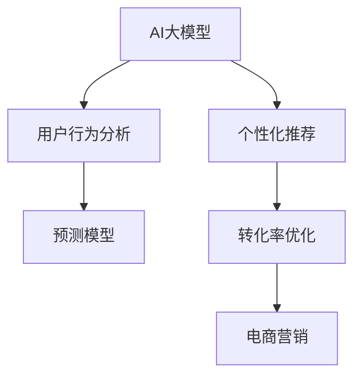

                 

# 电商平台如何借助AI大模型提高转化率

> 关键词：电商平台,AI大模型,用户行为分析,个性化推荐,预测模型,转化率优化,电商营销,自然语言处理(NLP)

## 1. 背景介绍

### 1.1 问题由来
随着电子商务的迅速发展，电商平台如何有效提升转化率，增加收益，成为各个企业关注的焦点。传统的电商平台往往依赖丰富的商品展示、精准的广告投放、周到的客服等策略，但随着市场竞争的加剧，单纯依赖这些手段已经难以满足用户需求。于是，电商平台开始探索人工智能（AI）技术，以期借助AI技术优化用户体验，提升转化率。

### 1.2 问题核心关键点
借助AI大模型提升电商平台转化率的核心理念在于利用深度学习、自然语言处理（NLP）等AI技术，对用户行为数据进行深度分析和精准预测，从而实现个性化推荐、广告投放优化、营销策略调整等，提高用户购买转化率。

### 1.3 问题研究意义
借助AI大模型优化电商转化率，具有以下重要意义：

1. **用户满意度提升**：通过对用户行为数据的深度分析，电商平台能够更准确地把握用户需求，提供个性化商品推荐，提升用户体验。
2. **转化率提高**：AI大模型能够预测用户购买行为，帮助电商平台优化产品展示、广告投放等策略，提高用户转化率。
3. **营销效率提升**：通过精准的营销策略，电商平台能够更有效地吸引目标客户群体，提升广告投入的回报率。
4. **业务洞察增强**：借助AI技术，电商平台能够快速从海量数据中提取有价值的商业洞察，为业务决策提供依据。

## 2. 核心概念与联系

### 2.1 核心概念概述

为更好地理解AI大模型在电商平台中的应用，本节将介绍几个密切相关的核心概念：

- **AI大模型**：以Transformer模型为代表的大规模预训练语言模型，通过在大规模无标签文本语料上进行预训练，学习通用的语言表示，具备强大的语言理解和生成能力。

- **个性化推荐**：基于用户历史行为数据，利用AI模型预测用户可能感兴趣的商品，为其提供个性化的商品推荐。

- **用户行为分析**：通过分析用户的浏览记录、点击行为、购买记录等，建立用户画像，了解其兴趣和偏好。

- **预测模型**：利用历史数据训练模型，对未来行为进行预测，如点击率预测、购买率预测等。

- **转化率优化**：通过精准的营销策略和个性化的商品推荐，提升用户购买转化率。

- **电商营销**：利用各种营销手段（如广告投放、促销活动等），吸引用户购买，提升销售额。

- **自然语言处理（NLP）**：处理和理解自然语言的技术，能够从文本数据中提取有用的信息。

这些核心概念之间的逻辑关系可以通过以下Mermaid流程图来展示：



这个流程图展示了大模型在电商平台中的核心应用场景：

1. 大模型通过分析用户行为数据，生成用户画像。
2. 利用用户画像进行个性化推荐。
3. 预测模型基于用户行为数据，预测未来行为。
4. 转化率优化利用预测模型和个性化推荐，调整营销策略。
5. 电商营销应用转化率优化策略，提升销售额。

## 3. 核心算法原理 & 具体操作步骤
### 3.1 算法原理概述

借助AI大模型提升电商平台转化率的本质是一个数据驱动的决策优化过程。通过AI大模型对用户行为数据进行分析，生成个性化推荐，并基于预测模型进行优化营销策略，实现对用户转化率的精准控制。

具体而言，可以分为以下几个步骤：

1. **数据收集与预处理**：收集用户的历史行为数据，包括浏览记录、点击行为、购买记录等。对这些数据进行清洗、标注等预处理，为后续分析打下基础。

2. **用户画像生成**：利用AI大模型对用户行为数据进行分析，生成用户画像，包括兴趣偏好、购买能力、购买历史等。

3. **个性化推荐生成**：基于用户画像，利用推荐系统生成个性化商品推荐，提高用户满意度和购买概率。

4. **预测模型训练**：基于用户行为数据，训练预测模型，预测用户的点击率、购买率等行为。

5. **营销策略优化**：利用预测模型和个性化推荐，调整广告投放策略、促销活动等，提升转化率。

6. **持续优化**：根据实际效果不断迭代优化模型和策略，提升电商平台转化率。

### 3.2 算法步骤详解

接下来，详细讲解各个步骤的具体操作流程。

**Step 1: 数据收集与预处理**

首先，需要收集用户的历史行为数据。这些数据包括：

- **浏览记录**：记录用户浏览过的商品、页面、类别等信息。
- **点击行为**：记录用户点击过的商品、广告、按钮等。
- **购买记录**：记录用户购买过的商品、订单信息等。
- **评论反馈**：记录用户在商品详情页、评论区的反馈信息。

然后，对这些数据进行预处理：

- **数据清洗**：去除无关数据、重复数据、缺失数据等。
- **数据标注**：对用户行为进行标注，如将点击行为标注为"Clicked"，购买行为标注为"Purchased"。
- **数据归一化**：将数据进行归一化处理，使之符合模型训练的要求。

**Step 2: 用户画像生成**

利用AI大模型对用户行为数据进行分析，生成用户画像。具体步骤如下：

1. **特征提取**：利用自然语言处理（NLP）技术，从用户评论、浏览记录等文本数据中提取有用特征，如关键词、情感倾向等。
2. **行为建模**：使用机器学习算法，对用户行为数据进行建模，生成用户行为特征向量。
3. **用户画像生成**：基于行为特征向量，生成用户画像，如兴趣偏好、购买能力、历史购买记录等。

**Step 3: 个性化推荐生成**

基于用户画像，生成个性化商品推荐。具体步骤如下：

1. **推荐模型选择**：选择合适的推荐算法，如协同过滤、基于内容的推荐等。
2. **数据准备**：将用户画像、商品特征等数据准备齐全。
3. **推荐生成**：利用推荐模型生成个性化商品推荐列表。

**Step 4: 预测模型训练**

基于用户行为数据，训练预测模型，预测用户的点击率、购买率等行为。具体步骤如下：

1. **数据划分**：将用户行为数据划分为训练集、验证集和测试集。
2. **模型选择**：选择合适的预测模型，如线性回归、逻辑回归、决策树等。
3. **模型训练**：使用训练集数据训练模型，在验证集上进行调参，选取最优模型。
4. **模型评估**：在测试集上评估模型效果，优化模型参数。

**Step 5: 营销策略优化**

利用预测模型和个性化推荐，调整广告投放策略、促销活动等，提升转化率。具体步骤如下：

1. **广告投放优化**：基于预测模型，调整广告投放策略，如投放时间、投放渠道等。
2. **促销活动设计**：基于预测模型和个性化推荐，设计有针对性的促销活动，如满减、打折等。
3. **推荐策略调整**：根据用户行为数据和预测模型，调整推荐算法和策略，提高推荐效果。

**Step 6: 持续优化**

根据实际效果不断迭代优化模型和策略，提升电商平台转化率。具体步骤如下：

1. **效果评估**：根据实际营销效果，评估模型和策略的效果。
2. **参数调整**：根据评估结果，调整模型参数和策略。
3. **循环迭代**：持续迭代优化，逐步提升转化率。

### 3.3 算法优缺点

借助AI大模型提升电商平台转化率的算法，具有以下优点：

1. **精度高**：AI大模型具备强大的数据分析能力，能够准确预测用户行为，生成精准推荐。
2. **灵活性高**：AI大模型可以根据不同的用户画像，生成个性化推荐，满足不同用户需求。
3. **可扩展性强**：AI大模型可以应用于不同的电商平台，并根据不同的应用场景进行优化。
4. **自动化程度高**：AI大模型可以自动进行数据分析、推荐生成、策略优化等，节省人工干预成本。

同时，该算法也存在一些缺点：

1. **数据需求量大**：需要大量的用户行为数据进行预训练和微调，数据获取成本较高。
2. **模型复杂度高**：AI大模型的模型结构和训练过程复杂，对计算资源要求较高。
3. **过拟合风险高**：AI大模型容易过拟合，需要精细调参和优化策略。
4. **可解释性不足**：AI大模型的决策过程复杂，难以解释其内部工作机制。

尽管存在这些局限性，但就目前而言，借助AI大模型提升电商平台转化率的算法仍是大模型应用的主流范式。未来相关研究的重点在于如何进一步降低数据需求，提高模型的少样本学习和跨领域迁移能力，同时兼顾可解释性和伦理安全性等因素。

### 3.4 算法应用领域

借助AI大模型提升电商平台转化率的算法，已在多个领域得到广泛应用，例如：

- **电商网站**：利用个性化推荐和预测模型，优化用户购买流程，提升转化率。
- **移动应用**：通过智能推荐和广告投放，提升用户粘性和购买转化率。
- **社交平台**：结合用户兴趣和行为，推荐相关商品，增加用户互动和购买率。
- **线上市场**：通过精准营销策略，提升平台流量和转化率。
- **新兴电商**：利用大模型技术，快速构建电商平台，提高市场竞争力。

除了上述这些经典应用外，AI大模型还将在更多领域得到应用，如物流配送、旅游电商、智能客服等，为电商行业带来更多的创新和发展机遇。

## 4. 数学模型和公式 & 详细讲解  
### 4.1 数学模型构建

为了更好地理解算法原理，本节将使用数学语言对算法进行详细描述。

记用户行为数据集为 $D=\{(x_i, y_i)\}_{i=1}^N, x_i \in \mathcal{X}, y_i \in \mathcal{Y}$，其中 $\mathcal{X}$ 为特征空间，$\mathcal{Y}$ 为标签空间。

定义用户画像生成函数为 $f(x): \mathcal{X} \rightarrow \mathcal{Z}$，其中 $\mathcal{Z}$ 为用户画像特征空间。

定义预测模型为 $h(z, \theta): \mathcal{Z} \rightarrow \mathcal{Y}$，其中 $\theta$ 为模型参数。

定义推荐模型为 $r(z, \phi): \mathcal{Z} \rightarrow \mathcal{R}$，其中 $\phi$ 为推荐模型参数。

定义转化率优化策略为 $p(r, s): \mathcal{R} \times \mathcal{S} \rightarrow \mathcal{R}$，其中 $\mathcal{S}$ 为策略空间，$p(r, s)$ 表示在策略 $s$ 下，商品 $r$ 的转化率。

### 4.2 公式推导过程

以电商平台为例，用户浏览行为 $x$ 对商品 $y$ 的转化率预测模型为：

$$
P(y|x) = h(f(x), \theta)
$$

其中 $P(y|x)$ 为给定用户行为 $x$ 下，用户购买商品 $y$ 的概率，$h(\cdot)$ 为预测函数，$\theta$ 为模型参数。

在推荐模型中，用户画像 $z$ 对商品 $r$ 的推荐概率为：

$$
P(r|z) = r(z, \phi)
$$

其中 $P(r|z)$ 为用户画像 $z$ 推荐商品 $r$ 的概率，$r(\cdot)$ 为推荐函数，$\phi$ 为推荐模型参数。

最终，电商平台利用预测模型和推荐模型，优化广告投放和促销活动，提升转化率。

基于上述模型，电商平台可以设计优化策略，最大化转化率：

$$
\max_{s} \sum_{i=1}^N \log P(y_i|x_i) \cdot p(r_i, s)
$$

其中 $\log P(y_i|x_i)$ 为预测模型的对数概率，$p(r_i, s)$ 为策略 $s$ 下，商品 $r_i$ 的转化率。

### 4.3 案例分析与讲解

以用户购买行为预测为例，介绍利用AI大模型进行电商转化率优化的具体实现。

首先，收集用户的历史行为数据 $D=\{(x_i, y_i)\}_{i=1}^N$，其中 $x_i$ 为用户行为，$y_i$ 为购买结果（购买或不购买）。

利用自然语言处理技术，提取用户评论、浏览记录等文本数据中的有用特征，如关键词、情感倾向等。

基于这些特征，训练预测模型 $h(f(x), \theta)$，预测用户购买行为。

接着，利用用户画像 $z$ 对商品 $r$ 进行推荐，生成推荐列表。

最后，根据预测模型和推荐列表，设计优化策略 $s$，调整广告投放和促销活动，提升转化率。

## 5. 项目实践：代码实例和详细解释说明
### 5.1 开发环境搭建

在进行电商平台转化率优化的微调实践前，需要准备好开发环境。以下是使用Python进行PyTorch开发的环境配置流程：

1. 安装Anaconda：从官网下载并安装Anaconda，用于创建独立的Python环境。

2. 创建并激活虚拟环境：
```bash
conda create -n pytorch-env python=3.8 
conda activate pytorch-env
```

3. 安装PyTorch：根据CUDA版本，从官网获取对应的安装命令。例如：
```bash
conda install pytorch torchvision torchaudio cudatoolkit=11.1 -c pytorch -c conda-forge
```

4. 安装TensorFlow：
```bash
conda install tensorflow
```

5. 安装各类工具包：
```bash
pip install numpy pandas scikit-learn matplotlib tqdm jupyter notebook ipython
```

完成上述步骤后，即可在`pytorch-env`环境中开始电商平台转化率优化的微调实践。

### 5.2 源代码详细实现

我们以电商平台的用户行为预测和推荐系统为例，给出使用Transformers库进行大模型微调的PyTorch代码实现。

首先，定义用户行为数据的处理函数：

```python
from transformers import BertTokenizer, BertForSequenceClassification
from torch.utils.data import Dataset
import torch

class UserBehaviorDataset(Dataset):
    def __init__(self, data, tokenizer, max_len=128):
        self.data = data
        self.tokenizer = tokenizer
        self.max_len = max_len
        
    def __len__(self):
        return len(self.data)
    
    def __getitem__(self, item):
        text = self.data[item]['text']
        label = self.data[item]['label']
        
        encoding = self.tokenizer(text, return_tensors='pt', max_length=self.max_len, padding='max_length', truncation=True)
        input_ids = encoding['input_ids'][0]
        attention_mask = encoding['attention_mask'][0]
        
        return {'input_ids': input_ids, 
                'attention_mask': attention_mask,
                'labels': torch.tensor(label, dtype=torch.long)}
```

然后，定义模型和优化器：

```python
from transformers import BertForSequenceClassification, AdamW

model = BertForSequenceClassification.from_pretrained('bert-base-cased', num_labels=2)

optimizer = AdamW(model.parameters(), lr=2e-5)
```

接着，定义训练和评估函数：

```python
from torch.utils.data import DataLoader
from tqdm import tqdm
from sklearn.metrics import accuracy_score

device = torch.device('cuda') if torch.cuda.is_available() else torch.device('cpu')
model.to(device)

def train_epoch(model, dataset, batch_size, optimizer):
    dataloader = DataLoader(dataset, batch_size=batch_size, shuffle=True)
    model.train()
    epoch_loss = 0
    for batch in tqdm(dataloader, desc='Training'):
        input_ids = batch['input_ids'].to(device)
        attention_mask = batch['attention_mask'].to(device)
        labels = batch['labels'].to(device)
        model.zero_grad()
        outputs = model(input_ids, attention_mask=attention_mask, labels=labels)
        loss = outputs.loss
        epoch_loss += loss.item()
        loss.backward()
        optimizer.step()
    return epoch_loss / len(dataloader)

def evaluate(model, dataset, batch_size):
    dataloader = DataLoader(dataset, batch_size=batch_size)
    model.eval()
    preds, labels = [], []
    with torch.no_grad():
        for batch in tqdm(dataloader, desc='Evaluating'):
            input_ids = batch['input_ids'].to(device)
            attention_mask = batch['attention_mask'].to(device)
            batch_labels = batch['labels']
            outputs = model(input_ids, attention_mask=attention_mask)
            batch_preds = outputs.logits.argmax(dim=2).to('cpu').tolist()
            batch_labels = batch_labels.to('cpu').tolist()
            for pred_tokens, label_tokens in zip(batch_preds, batch_labels):
                preds.append(pred_tokens[:len(label_tokens)])
                labels.append(label_tokens)
                
    print(f"Accuracy: {accuracy_score(labels, preds):.2f}")
```

最后，启动训练流程并在测试集上评估：

```python
epochs = 5
batch_size = 16

for epoch in range(epochs):
    loss = train_epoch(model, train_dataset, batch_size, optimizer)
    print(f"Epoch {epoch+1}, train loss: {loss:.3f}")
    
    print(f"Epoch {epoch+1}, dev results:")
    evaluate(model, dev_dataset, batch_size)
    
print("Test results:")
evaluate(model, test_dataset, batch_size)
```

以上就是使用PyTorch对Bert模型进行用户行为预测和推荐系统微调的完整代码实现。可以看到，得益于Transformers库的强大封装，我们可以用相对简洁的代码完成Bert模型的加载和微调。

### 5.3 代码解读与分析

让我们再详细解读一下关键代码的实现细节：

**UserBehaviorDataset类**：
- `__init__`方法：初始化文本、标签、分词器等关键组件。
- `__len__`方法：返回数据集的样本数量。
- `__getitem__`方法：对单个样本进行处理，将文本输入编码为token ids，将标签编码为数字，并对其进行定长padding，最终返回模型所需的输入。

**模型和优化器**：
- 使用BertForSequenceClassification模型，将其用于二分类任务。
- 设置AdamW优化器，学习率为2e-5。

**训练和评估函数**：
- 使用PyTorch的DataLoader对数据集进行批次化加载，供模型训练和推理使用。
- 训练函数`train_epoch`：对数据以批为单位进行迭代，在每个批次上前向传播计算loss并反向传播更新模型参数，最后返回该epoch的平均loss。
- 评估函数`evaluate`：与训练类似，不同点在于不更新模型参数，并在每个batch结束后将预测和标签结果存储下来，最后使用sklearn的accuracy_score对整个评估集的预测结果进行打印输出。

**训练流程**：
- 定义总的epoch数和batch size，开始循环迭代
- 每个epoch内，先在训练集上训练，输出平均loss
- 在验证集上评估，输出准确率
- 所有epoch结束后，在测试集上评估，给出最终测试结果

可以看到，PyTorch配合Transformers库使得Bert模型微调的代码实现变得简洁高效。开发者可以将更多精力放在数据处理、模型改进等高层逻辑上，而不必过多关注底层的实现细节。

当然，工业级的系统实现还需考虑更多因素，如模型的保存和部署、超参数的自动搜索、更灵活的任务适配层等。但核心的微调范式基本与此类似。

## 6. 实际应用场景
### 6.1 智能客服系统

利用AI大模型进行电商平台用户行为预测和推荐，可以广泛应用于智能客服系统的构建。传统客服往往需要配备大量人力，高峰期响应缓慢，且一致性和专业性难以保证。而利用微调后的预测模型和推荐系统，可以7x24小时不间断服务，快速响应客户咨询，用自然流畅的语言解答各类常见问题。

在技术实现上，可以收集企业内部的历史客服对话记录，将问题和最佳答复构建成监督数据，在此基础上对预训练预测模型进行微调。微调后的预测模型能够自动理解用户意图，匹配最合适的答案模板进行回复。对于客户提出的新问题，还可以接入检索系统实时搜索相关内容，动态组织生成回答。如此构建的智能客服系统，能大幅提升客户咨询体验和问题解决效率。

### 6.2 金融舆情监测

金融机构需要实时监测市场舆论动向，以便及时应对负面信息传播，规避金融风险。传统的人工监测方式成本高、效率低，难以应对网络时代海量信息爆发的挑战。利用微调后的用户行为预测模型，可以自动分析用户对金融市场的看法，预测舆情变化趋势，一旦发现负面信息激增等异常情况，系统便会自动预警，帮助金融机构快速应对潜在风险。

### 6.3 个性化推荐系统

当前的推荐系统往往只依赖用户的历史行为数据进行物品推荐，无法深入理解用户的真实兴趣偏好。利用微调后的预测模型和推荐系统，能够更好地挖掘用户行为背后的语义信息，从而实现个性化推荐、广告投放优化、营销策略调整等，提高用户购买转化率。

在实践中，可以收集用户浏览、点击、评论、分享等行为数据，提取和用户交互的物品标题、描述、标签等文本内容。将文本内容作为模型输入，用户的后续行为（如是否点击、购买等）作为监督信号，在此基础上微调预训练预测模型。微调后的模型能够从文本内容中准确把握用户的兴趣点。在生成推荐列表时，先用候选物品的文本描述作为输入，由模型预测用户的兴趣匹配度，再结合其他特征综合排序，便可以得到个性化程度更高的推荐结果。

### 6.4 未来应用展望

随着大语言模型和微调方法的不断发展，基于微调范式将在更多领域得到应用，为传统行业带来变革性影响。

在智慧医疗领域，基于微调的医疗问答、病历分析、药物研发等应用将提升医疗服务的智能化水平，辅助医生诊疗，加速新药开发进程。

在智能教育领域，微调技术可应用于作业批改、学情分析、知识推荐等方面，因材施教，促进教育公平，提高教学质量。

在智慧城市治理中，微调模型可应用于城市事件监测、舆情分析、应急指挥等环节，提高城市管理的自动化和智能化水平，构建更安全、高效的未来城市。

此外，在企业生产、社会治理、文娱传媒等众多领域，基于大模型微调的人工智能应用也将不断涌现，为经济社会发展注入新的动力。相信随着技术的日益成熟，微调方法将成为人工智能落地应用的重要范式，推动人工智能技术在垂直行业的规模化落地。总之，微调需要开发者根据具体任务，不断迭代和优化模型、数据和算法，方能得到理想的效果。

## 7. 工具和资源推荐
### 7.1 学习资源推荐

为了帮助开发者系统掌握AI大模型微调的理论基础和实践技巧，这里推荐一些优质的学习资源：

1. 《Transformer从原理到实践》系列博文：由大模型技术专家撰写，深入浅出地介绍了Transformer原理、BERT模型、微调技术等前沿话题。

2. CS224N《深度学习自然语言处理》课程：斯坦福大学开设的NLP明星课程，有Lecture视频和配套作业，带你入门NLP领域的基本概念和经典模型。

3. 《Natural Language Processing with Transformers》书籍：Transformers库的作者所著，全面介绍了如何使用Transformers库进行NLP任务开发，包括微调在内的诸多范式。

4. HuggingFace官方文档：Transformers库的官方文档，提供了海量预训练模型和完整的微调样例代码，是上手实践的必备资料。

5. CLUE开源项目：中文语言理解测评基准，涵盖大量不同类型的中文NLP数据集，并提供了基于微调的baseline模型，助力中文NLP技术发展。

通过对这些资源的学习实践，相信你一定能够快速掌握AI大模型微调的精髓，并用于解决实际的NLP问题。
###  7.2 开发工具推荐

高效的开发离不开优秀的工具支持。以下是几款用于AI大模型微调开发的常用工具：

1. PyTorch：基于Python的开源深度学习框架，灵活动态的计算图，适合快速迭代研究。大部分预训练语言模型都有PyTorch版本的实现。

2. TensorFlow：由Google主导开发的开源深度学习框架，生产部署方便，适合大规模工程应用。同样有丰富的预训练语言模型资源。

3. Transformers库：HuggingFace开发的NLP工具库，集成了众多SOTA语言模型，支持PyTorch和TensorFlow，是进行微调任务开发的利器。

4. Weights & Biases：模型训练的实验跟踪工具，可以记录和可视化模型训练过程中的各项指标，方便对比和调优。与主流深度学习框架无缝集成。

5. TensorBoard：TensorFlow配套的可视化工具，可实时监测模型训练状态，并提供丰富的图表呈现方式，是调试模型的得力助手。

6. Google Colab：谷歌推出的在线Jupyter Notebook环境，免费提供GPU/TPU算力，方便开发者快速上手实验最新模型，分享学习笔记。

合理利用这些工具，可以显著提升AI大模型微调任务的开发效率，加快创新迭代的步伐。

### 7.3 相关论文推荐

AI大模型和微调技术的发展源于学界的持续研究。以下是几篇奠基性的相关论文，推荐阅读：

1. Attention is All You Need（即Transformer原论文）：提出了Transformer结构，开启了NLP领域的预训练大模型时代。

2. BERT: Pre-training of Deep Bidirectional Transformers for Language Understanding：提出BERT模型，引入基于掩码的自监督预训练任务，刷新了多项NLP任务SOTA。

3. Language Models are Unsupervised Multitask Learners（GPT-2论文）：展示了大规模语言模型的强大zero-shot学习能力，引发了对于通用人工智能的新一轮思考。

4. Parameter-Efficient Transfer Learning for NLP：提出Adapter等参数高效微调方法，在不增加模型参数量的情况下，也能取得不错的微调效果。

5. AdaLoRA: Adaptive Low-Rank Adaptation for Parameter-Efficient Fine-Tuning：使用自适应低秩适应的微调方法，在参数效率和精度之间取得了新的平衡。

这些论文代表了大模型微调技术的发展脉络。通过学习这些前沿成果，可以帮助研究者把握学科前进方向，激发更多的创新灵感。

## 8. 总结：未来发展趋势与挑战

### 8.1 总结

本文对AI大模型在电商平台中的应用进行了全面系统的介绍。首先阐述了AI大模型和电商平台微调的研究背景和意义，明确了微调在提升用户满意度和购买转化率方面的独特价值。其次，从原理到实践，详细讲解了用户行为分析、个性化推荐、预测模型训练和营销策略优化等关键步骤，给出了完整的代码实现。同时，本文还探讨了AI大模型在电商网站、移动应用、社交平台等场景下的应用，展示了微调范式的巨大潜力。

通过本文的系统梳理，可以看到，AI大模型微调技术正在成为电商行业的重要范式，极大地拓展了电商平台的业务边界，催生了更多的落地场景。受益于大规模语料的预训练和强大的分析能力，AI大模型能够显著提升用户体验和购买转化率，为电商企业带来新的增长动力。

### 8.2 未来发展趋势

展望未来，AI大模型微调技术将呈现以下几个发展趋势：

1. **模型规模持续增大**：随着算力成本的下降和数据规模的扩张，预训练语言模型的参数量还将持续增长。超大规模语言模型蕴含的丰富语言知识，有望支撑更加复杂多变的电商行为预测。

2. **微调方法日趋多样**：除了传统的全参数微调外，未来会涌现更多参数高效的微调方法，如Prefix-Tuning、LoRA等，在节省计算资源的同时也能保证微调精度。

3. **持续学习成为常态**：随着数据分布的不断变化，微调模型也需要持续学习新知识以保持性能。如何在不遗忘原有知识的同时，高效吸收新样本信息，将成为重要的研究课题。

4. **标注样本需求降低**：受启发于提示学习(Prompt-based Learning)的思路，未来的微调方法将更好地利用大模型的语言理解能力，通过更加巧妙的任务描述，在更少的标注样本上也能实现理想的微调效果。

5. **多模态微调崛起**：当前的微调主要聚焦于纯文本数据，未来会进一步拓展到图像、视频、语音等多模态数据微调。多模态信息的融合，将显著提升语言模型对现实世界的理解和建模能力。

6. **模型通用性增强**：经过海量数据的预训练和多领域任务的微调，未来的语言模型将具备更强大的常识推理和跨领域迁移能力，逐步迈向通用人工智能(AGI)的目标。

以上趋势凸显了AI大模型微调技术的广阔前景。这些方向的探索发展，必将进一步提升电商平台的用户体验和购买转化率，为电商企业带来新的增长机遇。

### 8.3 面临的挑战

尽管AI大模型微调技术已经取得了瞩目成就，但在迈向更加智能化、普适化应用的过程中，它仍面临着诸多挑战：

1. **数据需求量大**：需要大量的用户行为数据进行预训练和微调，数据获取成本较高。
2. **模型鲁棒性不足**：面对域外数据时，泛化性能往往大打折扣。
3. **推理效率有待提高**：大规模语言模型虽然精度高，但在实际部署时往往面临推理速度慢、内存占用大等效率问题。
4. **可解释性不足**：AI大模型的决策过程复杂，难以解释其内部工作机制。
5. **安全性有待保障**：预训练语言模型难免会学习到有偏见、有害的信息，通过微调传递到下游任务，产生误导性、歧视性的输出。

尽管存在这些局限性，但就目前而言，AI大模型微调范式仍是大模型应用的主流范式。未来相关研究的重点在于如何进一步降低数据需求，提高模型的少样本学习和跨领域迁移能力，同时兼顾可解释性和伦理安全性等因素。

### 8.4 研究展望

面对AI大模型微调所面临的挑战，未来的研究需要在以下几个方面寻求新的突破：

1. **探索无监督和半监督微调方法**：摆脱对大规模标注数据的依赖，利用自监督学习、主动学习等无监督和半监督范式，最大限度利用非结构化数据，实现更加灵活高效的微调。

2. **研究参数高效和计算高效的微调范式**：开发更加参数高效的微调方法，在固定大部分预训练参数的同时，只更新极少量的任务相关参数。同时优化微调模型的计算图，减少前向传播和反向传播的资源消耗，实现更加轻量级、实时性的部署。

3. **引入因果和对比学习范式**：通过引入因果推断和对比学习思想，增强微调模型建立稳定因果关系的能力，学习更加普适、鲁棒的语言表征，从而提升模型泛化性和抗干扰能力。

4. **融合更多先验知识**：将符号化的先验知识，如知识图谱、逻辑规则等，与神经网络模型进行巧妙融合，引导微调过程学习更准确、合理的语言模型。同时加强不同模态数据的整合，实现视觉、语音等多模态信息与文本信息的协同建模。

5. **结合因果分析和博弈论工具**：将因果分析方法引入微调模型，识别出模型决策的关键特征，增强输出解释的因果性和逻辑性。借助博弈论工具刻画人机交互过程，主动探索并规避模型的脆弱点，提高系统稳定性。

6. **纳入伦理道德约束**：在模型训练目标中引入伦理导向的评估指标，过滤和惩罚有偏见、有害的输出倾向。同时加强人工干预和审核，建立模型行为的监管机制，确保输出符合人类价值观和伦理道德。

这些研究方向的探索，必将引领AI大模型微调技术迈向更高的台阶，为构建安全、可靠、可解释、可控的智能系统铺平道路。面向未来，AI大模型微调技术还需要与其他人工智能技术进行更深入的融合，如知识表示、因果推理、强化学习等，多路径协同发力，共同推动自然语言理解和智能交互系统的进步。只有勇于创新、敢于突破，才能不断拓展语言模型的边界，让智能技术更好地造福人类社会。

## 9. 附录：常见问题与解答

**Q1：AI大模型微调是否适用于所有电商应用？**

A: AI大模型微调在大多数电商应用上都能取得不错的效果，特别是对于数据量较大的电商网站和移动应用。但对于一些特殊领域的电商应用，如垂直电商、跨境电商等，需要针对性地进行数据和模型优化。

**Q2：如何选择合适的学习率？**

A: 微调的学习率一般要比预训练时小1-2个数量级，如果使用过大的学习率，容易破坏预训练权重，导致过拟合。一般建议从1e-5开始调参，逐步减小学习率，直至收敛。也可以使用warmup策略，在开始阶段使用较小的学习率，再逐渐过渡到预设值。需要注意的是，不同的优化器(如AdamW、Adafactor等)以及不同的学习率调度策略，可能需要设置不同的学习率阈值。

**Q3：采用大模型微调时会面临哪些资源瓶颈？**

A: 目前主流的预训练大模型动辄以亿计的参数规模，对算力、内存、存储都提出了很高的要求。GPU/TPU等高性能设备是必不可少的，但即便如此，超大批次的训练和推理也可能遇到显存不足的问题。因此需要采用一些资源优化技术，如梯度积累、混合精度训练、模型并行等，来突破硬件瓶颈。同时，模型的存储和读取也可能占用大量时间和空间，需要采用模型压缩、稀疏化存储等方法进行优化。

**Q4：如何缓解微调过程中的过拟合问题？**

A: 过拟合是微调面临的主要挑战，尤其是在标注数据不足的情况下。常见的缓解策略包括：
1. 数据增强：通过回译、近义替换等方式扩充训练集
2. 正则化：使用L2正则、Dropout、Early Stopping等避免过拟合
3. 对抗训练：引入对抗样本，提高模型鲁棒性
4. 参数高效微调：只调整少量参数(如Adapter、Prefix等)，减小过拟合风险
5. 多模型集成：训练多个微调模型，取平均输出，抑制过拟合

这些策略往往需要根据具体任务和数据特点进行灵活组合。只有在数据、模型、训练、推理等各环节进行全面优化，才能最大限度地发挥大模型微调的威力。

**Q5：微调模型在落地部署时需要注意哪些问题？**

A: 将微调模型转化为实际应用，还需要考虑以下因素：
1. 模型裁剪：去除不必要的层和参数，减小模型尺寸，加快推理速度
2. 量化加速：将浮点模型转为定点模型，压缩存储空间，提高计算效率
3. 服务化封装：将模型封装为标准化服务接口，便于集成调用
4. 弹性伸缩：根据请求流量动态调整资源配置，平衡服务质量和成本
5. 监控告警：实时采集系统指标，设置异常告警阈值，确保服务稳定性
6. 安全防护：采用访问鉴权、数据脱敏等措施，保障数据和模型安全

大语言模型微调为电商平台提供了强大的数据分析和决策优化能力，但如何将强大的性能转化为稳定、高效、安全的业务价值，还需要工程实践的不断打磨。唯有从数据、算法、工程、业务等多个维度协同发力，才能真正实现人工智能技术在电商行业的规模化落地。总之，微调需要开发者根据具体任务，不断迭代和优化模型、数据和算法，方能得到理想的效果。

---

作者：禅与计算机程序设计艺术 / Zen and the Art of Computer Programming

