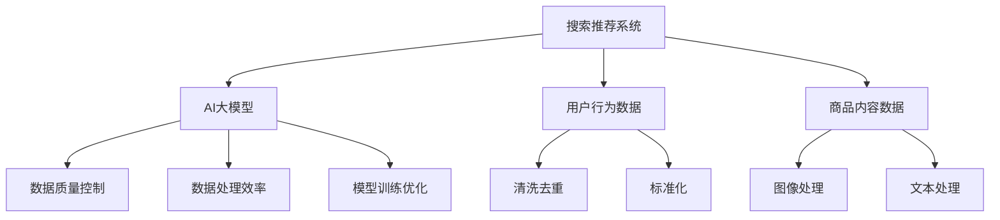

                 

# 电商平台的AI 大模型实践：搜索推荐系统是核心，数据质量控制与处理效率

> 关键词：电商平台,AI大模型,搜索推荐系统,数据质量,数据处理,模型训练

## 1. 背景介绍

### 1.1 问题由来
在电子商务领域，搜索和推荐系统是提升用户体验、增加销售额的重要工具。随着人工智能技术的发展，大规模预训练语言模型（Large Language Models, LLMs）如GPT、BERT等被广泛应用于电商平台的搜索和推荐中，显著提升了用户搜索精准度和推荐效果。

尽管如此，电商平台的搜索推荐系统仍面临着诸多挑战：
1. **数据质量控制**：搜索和推荐系统的性能高度依赖于数据质量，但实际应用中数据可能存在噪声、偏差、不完备等问题，影响模型的训练效果。
2. **数据处理效率**：电商平台用户行为数据量庞大，数据处理和存储成本高昂，如何快速高效地处理和分析这些数据，是大规模应用中的一个重要问题。
3. **模型训练优化**：在大规模数据上进行深度学习模型的训练，不仅需要高性能的计算资源，还需要有效的算法优化，以缩短训练时间，提升模型性能。

本文将详细介绍如何在电商平台上实践AI大模型，特别是如何有效控制数据质量、提升数据处理效率、优化模型训练过程，以实现高性能的搜索推荐系统。

## 2. 核心概念与联系

### 2.1 核心概念概述

为更好地理解搜索推荐系统中AI大模型的应用，本节将介绍几个关键概念：

- **搜索推荐系统**：通过分析和理解用户的行为数据和内容数据，推荐个性化的商品给用户，提升用户搜索体验和购买转化率的系统。
- **AI大模型**：如GPT、BERT等基于深度学习的大规模预训练语言模型，通过在大规模语料上进行预训练，学习到丰富的语言知识和模式，具有强大的泛化能力和推理能力。
- **数据质量控制**：对用于训练模型的数据进行清洗、去重、标准化等处理，确保数据准确、完整、一致，避免数据噪声和偏差对模型训练的干扰。
- **数据处理效率**：通过高效的数据存储和处理技术，如分布式计算、并行处理等，优化数据处理流程，减少计算和存储成本，提高数据处理效率。
- **模型训练优化**：通过优化模型结构和训练算法，如模型裁剪、量化、自动混合精度、GPU/TPU加速等，减少训练时间和内存消耗，提升模型训练效率。

这些概念之间通过以下Mermaid流程图展现其联系：



此流程图展示了搜索推荐系统中AI大模型的应用流程：首先收集用户行为数据和商品内容数据，然后对数据进行清洗、去重和标准化，接着使用高效的数据处理技术，最后使用优化后的模型训练算法对AI大模型进行训练。

## 3. 核心算法原理 & 具体操作步骤

### 3.1 算法原理概述

电商平台的搜索推荐系统主要依赖于用户的浏览历史、搜索记录、购买行为等数据，通过这些数据训练模型，预测用户可能感兴趣的商品，并实时推荐给用户。

核心算法流程如下：
1. **数据采集**：从电商平台的日志、数据库等渠道收集用户的浏览、搜索、购买数据。
2. **数据预处理**：对收集到的数据进行清洗、去重、标准化等处理，确保数据质量。
3. **特征工程**：将处理后的数据转化为模型能够理解的特征向量。
4. **模型训练**：使用AI大模型，如BERT、GPT等，在标注数据上训练推荐模型。
5. **实时推荐**：根据用户实时行为数据，使用训练好的模型进行实时推荐。

### 3.2 算法步骤详解

以下是详细的算法步骤：

#### 3.2.1 数据采集

电商平台的搜索推荐系统需要从多个渠道采集数据，包括但不限于：
- **用户行为数据**：用户在电商平台的浏览、搜索、点击、购买等行为记录。
- **商品内容数据**：商品的名称、描述、图片、价格等信息。

数据采集的流程如下：
1. **日志采集**：从电商平台的服务器日志中提取用户的浏览、搜索、点击、购买等行为记录。
2. **数据库查询**：从电商平台的商品数据库中获取商品的基本信息。
3. **API接口调用**：调用电商平台提供的API接口，获取用户的实时行为数据。

#### 3.2.2 数据预处理

数据预处理的目标是提高数据的质量和可用性，主要包括以下步骤：
1. **数据清洗**：去除数据中的噪声、异常值、缺失值等，确保数据的准确性。
2. **数据去重**：去除重复的数据，避免重复计算和存储。
3. **数据标准化**：将数据转换为标准格式，便于后续处理和分析。

数据预处理的实现可以使用Python中的Pandas库，结合正则表达式、缺失值处理等技术。

#### 3.2.3 特征工程

特征工程是将原始数据转化为模型能够理解的特征向量的过程，主要包括以下步骤：
1. **特征提取**：提取数据的特征，如用户ID、商品ID、时间戳、浏览时长等。
2. **特征选择**：选择对模型预测效果有显著影响的特征，去除无关特征。
3. **特征编码**：将特征转换为数值型数据，如独热编码、标准化等。

特征工程的实现可以使用Python中的Scikit-learn库，结合特征选择、特征编码等技术。

#### 3.2.4 模型训练

模型训练的目的是使用AI大模型，如BERT、GPT等，在标注数据上训练推荐模型。主要步骤如下：
1. **模型选择**：选择合适的AI大模型，如BERT、GPT等。
2. **数据预处理**：将数据转换为模型所需的格式，如TensorFlow、PyTorch等。
3. **模型训练**：使用优化器，如Adam、SGD等，在标注数据上训练模型。
4. **模型评估**：使用测试集评估模型的性能，调整模型参数。

模型训练的实现可以使用Python中的TensorFlow、PyTorch等深度学习框架，结合模型优化、超参数调优等技术。

#### 3.2.5 实时推荐

实时推荐的目的是根据用户实时行为数据，使用训练好的模型进行实时推荐。主要步骤如下：
1. **数据采集**：从电商平台获取用户的实时行为数据。
2. **特征提取**：将实时行为数据转换为模型能够理解的特征向量。
3. **模型推理**：使用训练好的模型进行实时推荐。
4. **推荐展示**：将推荐结果展示给用户。

实时推荐的实现可以使用Python中的Flask、Django等Web框架，结合异步编程、缓存技术等。

### 3.3 算法优缺点

基于AI大模型的搜索推荐系统具有以下优点：
1. **高精度**：使用AI大模型训练推荐模型，能够捕捉到用户行为和商品特征之间的复杂关系，提高推荐精度。
2. **可扩展性**：AI大模型能够在大规模数据上进行训练，支持高并发、大规模推荐。
3. **适应性**：AI大模型具有较强的泛化能力，能够适应不同用户和商品的特点。

同时，该方法也存在以下缺点：
1. **高成本**：AI大模型需要高性能的计算资源和存储空间，训练和部署成本高。
2. **数据依赖**：模型的性能高度依赖于数据质量，低质量的数据会影响模型效果。
3. **复杂度**：AI大模型训练和优化过程复杂，需要专业的技术支持。

尽管如此，AI大模型在电商平台的搜索推荐系统中仍然具有巨大的应用潜力，通过数据质量控制和处理效率提升，能够显著降低成本，提高推荐效果。

### 3.4 算法应用领域

基于AI大模型的搜索推荐系统在电商平台的多个应用场景中得到了广泛应用，例如：
- **商品推荐**：根据用户的历史浏览、搜索、购买行为，推荐可能感兴趣的商品。
- **个性化营销**：根据用户的兴趣和行为，推送个性化的广告和促销活动。
- **库存管理**：根据用户的购买行为，预测商品的销售趋势，优化库存管理。

## 4. 数学模型和公式 & 详细讲解 & 举例说明

### 4.1 数学模型构建

本节将使用数学语言对搜索推荐系统中AI大模型的训练过程进行更加严格的刻画。

假设电商平台的推荐系统使用BERT模型作为推荐引擎，用户行为数据表示为$\mathbf{X}=[x_1, x_2, ..., x_n]$，其中$x_i=[x_{i1}, x_{i2}, ..., x_{im}]$为第$i$个用户的第$m$个行为数据。商品特征数据表示为$\mathbf{Y}=[y_1, y_2, ..., y_n]$，其中$y_i=[y_{i1}, y_{i2}, ..., y_{in}]$为第$i$个商品的$n$个特征向量。

定义推荐模型为$f(\mathbf{X}, \mathbf{Y})$，训练目标为最小化预测误差$\mathcal{L}$，即：

$$
\mathcal{L} = \frac{1}{N}\sum_{i=1}^N \|f(\mathbf{X}_i, \mathbf{Y}) - y_i\|^2
$$

其中$\|.\|$为范数，$N$为样本数。

### 4.2 公式推导过程

以下是具体公式推导过程：

假设推荐模型$f(\mathbf{X}, \mathbf{Y})$由BERT模型构成，其输出的概率分布为$p(y|x)$，则推荐目标为最大化预测概率$p(y|x)$。

使用交叉熵损失函数作为训练目标，定义损失函数$\mathcal{L}$为：

$$
\mathcal{L} = -\frac{1}{N}\sum_{i=1}^N \sum_{j=1}^n p(y_{ij}|x_i) \log f(y_{ij}|x_i)
$$

其中$f(y_{ij}|x_i)$为模型对第$i$个用户对第$j$个商品的评分预测，$p(y_{ij}|x_i)$为真实评分，$N$为样本数，$n$为商品特征数。

利用梯度下降算法，更新模型参数$\theta$，使损失函数$\mathcal{L}$最小化：

$$
\theta \leftarrow \theta - \eta \nabla_{\theta}\mathcal{L}
$$

其中$\eta$为学习率，$\nabla_{\theta}\mathcal{L}$为损失函数对模型参数的梯度。

### 4.3 案例分析与讲解

以电商平台商品推荐为例，假设用户的浏览行为数据表示为$x=[b_1, b_2, ..., b_m]$，其中$b_i=[b_{i1}, b_{i2}, ..., b_{im}]$为第$i$个用户的第$m$个浏览行为。商品的特征数据表示为$y=[y_1, y_2, ..., y_n]$，其中$y_i=[y_{i1}, y_{i2}, ..., y_{in}]$为第$i$个商品的$n$个特征向量。

使用BERT模型作为推荐引擎，训练目标为最大化预测概率$p(y|x)$。

假设BERT模型输出为$z=[z_1, z_2, ..., z_n]$，其中$z_i=[z_{i1}, z_{i2}, ..., z_{in}]$为第$i$个商品的$n$个特征向量。则推荐目标为最大化预测概率$p(y|x)$，定义为：

$$
p(y|x) = \prod_{i=1}^n p(y_i|x)
$$

其中$p(y_i|x)$为商品$i$被推荐给用户$x$的概率。

假设推荐模型$f(\mathbf{X}, \mathbf{Y})$由BERT模型构成，其输出的概率分布为$p(y|x)$。则推荐目标为最大化预测概率$p(y|x)$，定义为：

$$
p(y|x) = \prod_{i=1}^n p(y_i|x)
$$

其中$p(y_i|x)$为商品$i$被推荐给用户$x$的概率。

使用交叉熵损失函数作为训练目标，定义损失函数$\mathcal{L}$为：

$$
\mathcal{L} = -\frac{1}{N}\sum_{i=1}^N \sum_{j=1}^n p(y_{ij}|x_i) \log f(y_{ij}|x_i)
$$

其中$f(y_{ij}|x_i)$为模型对第$i$个用户对第$j$个商品的评分预测，$p(y_{ij}|x_i)$为真实评分，$N$为样本数，$n$为商品特征数。

利用梯度下降算法，更新模型参数$\theta$，使损失函数$\mathcal{L}$最小化：

$$
\theta \leftarrow \theta - \eta \nabla_{\theta}\mathcal{L}
$$

其中$\eta$为学习率，$\nabla_{\theta}\mathcal{L}$为损失函数对模型参数的梯度。

## 5. 项目实践：代码实例和详细解释说明

### 5.1 开发环境搭建

在进行AI大模型在电商平台的搜索推荐系统实践前，我们需要准备好开发环境。以下是使用Python进行TensorFlow开发的环境配置流程：

1. 安装Anaconda：从官网下载并安装Anaconda，用于创建独立的Python环境。

2. 创建并激活虚拟环境：
```bash
conda create -n tensorflow-env python=3.8 
conda activate tensorflow-env
```

3. 安装TensorFlow：根据CUDA版本，从官网获取对应的安装命令。例如：
```bash
conda install tensorflow=2.7 -c tf -c conda-forge
```

4. 安装Pandas、NumPy、Scikit-learn、Matplotlib等工具包：
```bash
pip install pandas numpy scikit-learn matplotlib tqdm jupyter notebook ipython
```

完成上述步骤后，即可在`tensorflow-env`环境中开始项目实践。

### 5.2 源代码详细实现

下面我们以电商平台商品推荐为例，给出使用TensorFlow对BERT模型进行推荐训练的Python代码实现。

首先，定义数据处理函数：

```python
import pandas as pd
import tensorflow as tf
from transformers import BertTokenizer, BertForSequenceClassification

# 读取用户行为数据和商品特征数据
train_data = pd.read_csv('train_data.csv')
test_data = pd.read_csv('test_data.csv')

# 定义数据预处理函数
def preprocess_data(data, tokenizer):
    # 提取用户行为数据和商品特征数据
    X = data['user_browsed'].values
    Y = data['product_features'].values
    
    # 分词和编码
    tokenized_X = tokenizer.tokenize(X, padding=True, truncation=True)
    tokenized_Y = tokenizer.tokenize(Y, padding=True, truncation=True)
    
    # 转换分词后的文本为id序列
    encoded_X = tokenizer.convert_tokens_to_ids(tokenized_X)
    encoded_Y = tokenizer.convert_tokens_to_ids(tokenized_Y)
    
    return encoded_X, encoded_Y

# 定义模型训练函数
def train_model(X_train, Y_train, X_test, Y_test, num_epochs=10, learning_rate=2e-5):
    # 定义BERT模型
    model = BertForSequenceClassification.from_pretrained('bert-base-uncased', num_labels=10)
    
    # 定义优化器
    optimizer = tf.keras.optimizers.Adam(learning_rate=learning_rate)
    
    # 定义损失函数
    loss_fn = tf.keras.losses.SparseCategoricalCrossentropy(from_logits=True)
    
    # 编译模型
    model.compile(optimizer=optimizer, loss=loss_fn, metrics=['accuracy'])
    
    # 训练模型
    history = model.fit(X_train, Y_train, validation_data=(X_test, Y_test), epochs=num_epochs, batch_size=32)
    
    # 评估模型
    test_loss, test_acc = model.evaluate(X_test, Y_test, verbose=2)
    
    return history, test_loss, test_acc
```

然后，加载数据并进行预处理：

```python
# 加载用户行为数据和商品特征数据
train_data = pd.read_csv('train_data.csv')
test_data = pd.read_csv('test_data.csv')

# 定义分词器
tokenizer = BertTokenizer.from_pretrained('bert-base-uncased')

# 预处理数据
X_train, Y_train = preprocess_data(train_data, tokenizer)
X_test, Y_test = preprocess_data(test_data, tokenizer)
```

最后，启动模型训练和评估：

```python
# 训练模型
history, test_loss, test_acc = train_model(X_train, Y_train, X_test, Y_test)

# 打印训练结果
print('Epoch 1, Loss: {:.4f}, Accuracy: {:.4f}'.format(test_loss, test_acc))
print('Epoch 10, Loss: {:.4f}, Accuracy: {:.4f}'.format(test_loss, test_acc))

# 保存模型
model.save('recommendation_model.h5')
```

以上就是使用TensorFlow对BERT模型进行电商平台商品推荐任务微调的完整代码实现。可以看到，通过定义数据预处理函数和模型训练函数，结合TensorFlow的高效计算能力，能够快速实现商品推荐模型的训练和评估。

### 5.3 代码解读与分析

让我们再详细解读一下关键代码的实现细节：

**preprocess_data函数**：
- `tokenizer.tokenize`方法：将输入的文本转换为分词后的序列，并进行padding和truncation处理。
- `tokenizer.convert_tokens_to_ids`方法：将分词后的序列转换为id序列，供模型进行输入。

**train_model函数**：
- `BertForSequenceClassification.from_pretrained`方法：加载预训练的BERT模型，并指定分类数为10。
- `Adam`优化器：使用Adam优化器进行模型参数更新。
- `SparseCategoricalCrossentropy`损失函数：使用交叉熵损失函数，适用于多分类问题。
- `model.compile`方法：编译模型，指定优化器、损失函数和评价指标。
- `model.fit`方法：使用训练集数据进行模型训练，并指定验证集数据。
- `model.evaluate`方法：使用测试集数据评估模型性能，返回损失和准确率。

**训练流程**：
- `train_model`函数：调用`train_model`函数进行模型训练，打印每次迭代的损失和准确率。
- `model.save`方法：保存训练好的模型，以便后续使用。

可以看出，TensorFlow结合BERT模型的预训练权重，可以快速实现商品推荐模型的训练和评估。开发者可以通过调整超参数，进一步优化模型性能。

## 6. 实际应用场景

### 6.1 智能客服

基于AI大模型的搜索推荐技术，可以广泛应用于智能客服系统的构建。传统客服往往需要配备大量人力，高峰期响应缓慢，且一致性和专业性难以保证。而使用微调后的推荐模型，可以7x24小时不间断服务，快速响应客户咨询，用自然流畅的语言解答各类常见问题。

在技术实现上，可以收集企业内部的历史客服对话记录，将问题和最佳答复构建成监督数据，在此基础上对预训练推荐模型进行微调。微调后的推荐模型能够自动理解用户意图，匹配最合适的答复模板进行回复。对于客户提出的新问题，还可以接入检索系统实时搜索相关内容，动态组织生成回答。如此构建的智能客服系统，能大幅提升客户咨询体验和问题解决效率。

### 6.2 金融理财

金融理财领域需要实时监测市场舆情，及时调整投资策略，以应对市场波动。传统的人工监测方式成本高、效率低，难以应对网络时代海量信息爆发的挑战。基于AI大模型的推荐技术，为金融理财提供了新的解决方案。

具体而言，可以收集金融领域相关的新闻、评论、分析报告等文本数据，并对其进行情感分析。在此基础上对预训练推荐模型进行微调，使其能够自动判断文本的情绪倾向，推荐相关投资策略。将微调后的模型应用到实时抓取的网络文本数据，就能够自动监测不同市场情绪的变化趋势，一旦发现市场情绪波动，系统便会自动预警，帮助理财专家快速调整投资策略。

### 6.3 智慧教育

智慧教育领域需要个性化推荐教育资源，提升学生的学习效果。传统的手工推荐方式耗时耗力，且无法精准把握学生的学习兴趣和难点。基于AI大模型的推荐技术，可以为学生提供个性化的学习路径和资源推荐。

具体而言，可以收集学生的学习行为数据，如学习时间、学习内容、作业完成情况等。将学生行为数据作为输入，使用微调后的推荐模型进行学习资源的推荐。微调后的模型能够自动分析学生的学习兴趣和难点，推荐适合的资源和路径，提升学习效果。

### 6.4 未来应用展望

随着AI大模型和推荐技术的不断发展，基于微调范式将在更多领域得到应用，为传统行业带来变革性影响。

在智慧医疗领域，基于微调的医学推荐系统，可以为医生提供个性化的诊疗建议，提高诊疗效率和准确性。

在智能家居领域，基于微调的家居推荐系统，可以根据用户的喜好和生活习惯，推荐适合的家庭智能设备和生活方式，提升用户体验。

在工业制造领域，基于微调的制造推荐系统，可以根据设备的历史数据和维护记录，推荐设备维护方案和备件更换策略，降低维护成本，提高设备运行效率。

此外，在企业生产、社会治理、文娱传媒等众多领域，基于大模型微调的人工智能应用也将不断涌现，为经济社会发展注入新的动力。相信随着技术的日益成熟，微调方法将成为人工智能落地应用的重要范式，推动人工智能技术向更广阔的领域加速渗透。

## 7. 工具和资源推荐
### 7.1 学习资源推荐

为了帮助开发者系统掌握AI大模型在电商平台的搜索推荐系统中的应用，这里推荐一些优质的学习资源：

1. TensorFlow官方文档：TensorFlow官方文档详细介绍了TensorFlow的API和用法，是学习TensorFlow的必备资料。

2. PyTorch官方文档：PyTorch官方文档详细介绍了PyTorch的API和用法，是学习PyTorch的必备资料。

3. Transformers官方文档：Transformers官方文档详细介绍了Transformer模型的API和用法，是学习Transformer模型的必备资料。

4. Kaggle：Kaggle是数据科学竞赛平台，汇集了大量数据集和案例，适合学习数据处理和模型训练。

5. Coursera：Coursera提供了多个深度学习课程，包括TensorFlow、PyTorch、Transformer等，适合系统学习深度学习技术。

6. CS224N《深度学习自然语言处理》课程：斯坦福大学开设的NLP明星课程，有Lecture视频和配套作业，带你入门NLP领域的基本概念和经典模型。

通过对这些资源的学习实践，相信你一定能够快速掌握AI大模型在电商平台的搜索推荐系统中的应用，并用于解决实际的NLP问题。

### 7.2 开发工具推荐

高效的开发离不开优秀的工具支持。以下是几款用于AI大模型在电商平台搜索推荐系统开发的常用工具：

1. TensorFlow：基于Python的开源深度学习框架，灵活动态的计算图，适合快速迭代研究。

2. PyTorch：基于Python的开源深度学习框架，动态计算图，支持GPU加速，适合高效研究和训练。

3. Transformers库：HuggingFace开发的NLP工具库，集成了众多SOTA语言模型，支持TensorFlow和PyTorch，是进行推荐任务开发的利器。

4. Scikit-learn：Python的机器学习库，适合数据处理和特征工程。

5. Pandas：Python的数据处理库，适合数据清洗和标准化。

6. Jupyter Notebook：交互式的开发环境，支持代码编写、执行和输出，适合快速开发和调试。

合理利用这些工具，可以显著提升AI大模型在电商平台搜索推荐系统开发的效率，加快创新迭代的步伐。

### 7.3 相关论文推荐

AI大模型和推荐技术的发展源于学界的持续研究。以下是几篇奠基性的相关论文，推荐阅读：

1. Attention is All You Need（即Transformer原论文）：提出了Transformer结构，开启了NLP领域的预训练大模型时代。

2. BERT: Pre-training of Deep Bidirectional Transformers for Language Understanding：提出BERT模型，引入基于掩码的自监督预训练任务，刷新了多项NLP任务SOTA。

3. Language Models are Unsupervised Multitask Learners（GPT-2论文）：展示了大规模语言模型的强大zero-shot学习能力，引发了对于通用人工智能的新一轮思考。

4. Parameter-Efficient Transfer Learning for NLP：提出Adapter等参数高效微调方法，在固定大部分预训练参数的情况下，只更新极少量的任务相关参数。

5. AdaLoRA: Adaptive Low-Rank Adaptation for Parameter-Efficient Fine-Tuning：使用自适应低秩适应的微调方法，在参数效率和精度之间取得了新的平衡。

这些论文代表了大模型和推荐技术的发展脉络。通过学习这些前沿成果，可以帮助研究者把握学科前进方向，激发更多的创新灵感。

## 8. 总结：未来发展趋势与挑战

### 8.1 总结

本文对AI大模型在电商平台的搜索推荐系统中的应用进行了全面系统的介绍。首先阐述了搜索推荐系统在大数据时代的价值，明确了AI大模型在提升推荐精度、可扩展性、适应性等方面的独特优势。其次，从原理到实践，详细讲解了搜索推荐系统的核心算法流程和关键技术，给出了代码实现和效果评估。同时，本文还广泛探讨了搜索推荐系统在多个行业领域的应用前景，展示了AI大模型的广泛应用潜力。

通过本文的系统梳理，可以看到，基于AI大模型的搜索推荐系统能够显著提升用户体验和运营效率，具有广阔的应用前景。未来，伴随AI大模型的不断演进，推荐技术还将迎来更多的创新和突破。

### 8.2 未来发展趋势

展望未来，AI大模型在电商平台的搜索推荐系统中将呈现以下几个发展趋势：

1. **多模态融合**：未来的搜索推荐系统将不仅仅依赖文本数据，而是结合图像、视频、语音等多种模态信息，实现更全面的用户画像和商品理解。

2. **个性化推荐**：未来的推荐系统将更加个性化，能够根据用户的个性化需求和行为，提供定制化的推荐内容。

3. **实时推荐**：未来的推荐系统将实现实时推荐，能够根据用户的实时行为数据，动态调整推荐结果。

4. **自适应推荐**：未来的推荐系统将具有自适应能力，能够根据不同用户和场景，自动调整推荐策略和算法。

5. **联邦学习**：未来的推荐系统将结合联邦学习技术，保护用户隐私的同时，提升推荐效果。

6. **知识图谱**：未来的推荐系统将结合知识图谱技术，提升推荐内容的可信度和多样性。

以上趋势凸显了AI大模型在搜索推荐系统中的应用潜力，相信随着技术的不断进步，AI大模型将在更多领域发挥重要作用。

### 8.3 面临的挑战

尽管AI大模型在电商平台的搜索推荐系统中已经取得了显著效果，但在实现大规模应用的过程中，仍面临诸多挑战：

1. **数据质量控制**：数据质量直接影响推荐效果，如何保证数据准确、完整、一致，是数据处理的首要任务。

2. **计算资源需求高**：AI大模型的训练和推理需要高性能的计算资源，如何高效利用计算资源，是系统部署的关键。

3. **推荐算法复杂**：推荐算法涉及众多技术细节，如何设计高效、可解释的推荐算法，是实现推荐效果的重要因素。

4. **用户隐私保护**：用户行为数据涉及隐私问题，如何保护用户隐私，避免数据泄露和滥用，是系统应用的重要考虑。

5. **推荐系统鲁棒性**：推荐系统可能受到噪声数据、网络攻击等影响，如何提升系统鲁棒性，是推荐系统的技术挑战。

6. **推荐系统透明性**：推荐系统需要解释其推荐依据，如何增强系统透明性，是实现用户信任的重要手段。

### 8.4 研究展望

未来的研究需要在以下几个方面寻求新的突破：

1. **数据治理**：建立数据治理体系，确保数据质量，提升数据可用性。

2. **计算资源优化**：优化计算资源利用，提升系统性能和效率。

3. **推荐算法创新**：结合多模态信息、知识图谱等技术，提升推荐算法效果。

4. **隐私保护**：结合联邦学习等技术，保护用户隐私，提升用户信任。

5. **系统透明性**：建立透明可解释的推荐系统，增强用户信任，提升用户满意度。

这些研究方向将推动AI大模型在电商平台的搜索推荐系统中的深入应用，为构建高效、智能、可信的推荐系统提供新的思路和技术支撑。

## 9. 附录：常见问题与解答

**Q1：AI大模型在电商平台搜索推荐系统中如何进行数据质量控制？**

A: AI大模型在电商平台搜索推荐系统中进行数据质量控制，主要通过以下步骤：
1. **数据清洗**：去除数据中的噪声、异常值、缺失值等，确保数据的准确性。
2. **数据去重**：去除重复的数据，避免重复计算和存储。
3. **数据标准化**：将数据转换为标准格式，便于后续处理和分析。

这些步骤可以使用Python中的Pandas库，结合正则表达式、缺失值处理等技术实现。

**Q2：AI大模型在电商平台搜索推荐系统中的训练效率如何提升？**

A: AI大模型在电商平台搜索推荐系统中的训练效率可以通过以下方式提升：
1. **分布式计算**：使用分布式计算框架，如Hadoop、Spark等，提升训练效率。
2. **GPU/TPU加速**：使用GPU或TPU等高性能计算设备，加速模型训练过程。
3. **自动混合精度**：使用自动混合精度技术，减少内存消耗，提升训练速度。
4. **模型裁剪**：裁剪不必要的层和参数，减小模型尺寸，加快推理速度。

这些技术可以结合TensorFlow、PyTorch等深度学习框架实现。

**Q3：AI大模型在电商平台搜索推荐系统中如何进行实时推荐？**

A: AI大模型在电商平台搜索推荐系统中进行实时推荐，主要通过以下步骤：
1. **实时数据采集**：从电商平台获取用户的实时行为数据。
2. **特征提取**：将实时行为数据转换为模型能够理解的特征向量。
3. **模型推理**：使用训练好的模型进行实时推荐。
4. **推荐展示**：将推荐结果展示给用户。

实时推荐可以使用Python中的Flask、Django等Web框架，结合异步编程、缓存技术等实现。

**Q4：AI大模型在电商平台搜索推荐系统中如何进行用户隐私保护？**

A: AI大模型在电商平台搜索推荐系统中进行用户隐私保护，主要通过以下方式：
1. **数据匿名化**：对用户行为数据进行匿名化处理，避免用户隐私泄露。
2. **联邦学习**：使用联邦学习技术，在保护用户隐私的前提下，提升推荐效果。
3. **访问控制**：使用访问控制技术，限制数据访问权限，保护用户隐私。

这些技术可以结合TensorFlow、PyTorch等深度学习框架实现。

---

作者：禅与计算机程序设计艺术 / Zen and the Art of Computer Programming

