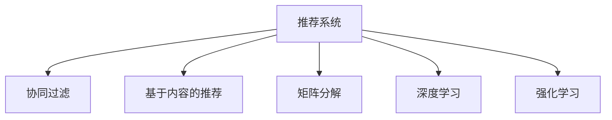

                 

# 电商推荐系统中的多样性与相关性动态平衡

> 关键词：电商推荐, 多样性, 相关性, 协同过滤, 基于内容的推荐, 矩阵分解, 深度学习, 强化学习

## 1. 背景介绍

在电商领域，推荐系统已成为提升用户购物体验和商家转化率的利器。但随着个性化推荐技术的普及，也出现了一些新的挑战：

1. **推荐的同质化问题**：过于个性化的推荐容易让用户陷入信息茧房，丧失探索新商品的意愿。
2. **长尾商品被忽视**：个性化推荐往往集中在热门商品上，长尾商品的曝光率低，可能导致用户错失潜在兴趣点。
3. **新商品推广难度大**：新商品的曝光机会少，难以获得市场认可。

为了解决这些问题，需要开发一种能够同时考虑用户兴趣多样性和商品相关性的推荐算法，既能提供个性化推荐，又能保证商品多样性和用户满意度。

## 2. 核心概念与联系

### 2.1 核心概念概述

本节将介绍几个关键概念及其联系：

- **推荐系统(Recommendation System)**：通过分析用户的历史行为数据，向用户推荐感兴趣的物品的系统。
- **协同过滤(Collaborative Filtering)**：利用用户对物品的评分数据，通过相似度计算推荐物品的方法。
- **基于内容的推荐(Content-Based Recommendation)**：通过分析物品的属性特征，找到与用户兴趣相似的物品进行推荐。
- **矩阵分解(Matrix Factorization)**：将用户-物品评分矩阵分解为用户和物品的潜在特征向量，挖掘用户与物品之间的隐含关系。
- **深度学习(Deep Learning)**：利用多层神经网络模型，从高维数据中提取特征，并生成推荐结果。
- **强化学习(Reinforcement Learning)**：通过与环境互动，通过奖励机制优化推荐策略。

这些概念之间的关系可以用以下Mermaid流程图来展示：



这个流程图展示了推荐系统中的几种主流技术，它们通过不同的方式挖掘用户与物品之间的关系，从而实现个性化推荐。

## 3. 核心算法原理 & 具体操作步骤

### 3.1 算法原理概述

本节将详细讲解如何在大规模电商推荐系统中平衡用户兴趣多样性和商品相关性，以提供满意的推荐结果。

推荐系统通常分为两个阶段：离线训练和在线推荐。离线训练阶段的任务是通过用户行为数据（如浏览记录、购买记录等）训练推荐模型，离线训练可以采用批处理方式，相对较为高效。在线推荐阶段的任务是实时根据用户的即时行为数据生成个性化推荐，需要采用实时处理方式，以支持动态变化的用户兴趣。

在线推荐时，通常采用两种策略来平衡多样性和相关性：

- **基于协同过滤的推荐**：通过用户历史行为数据，找到与用户兴趣相似的其他用户，并推荐其喜欢的商品。
- **基于内容的推荐**：根据物品的特征，找到与用户兴趣相似的商品。

两种策略各有优劣，基于协同过滤的推荐具有更好的相关性，但会受到新用户和长尾商品的限制；基于内容的推荐则更加多样化，但相关性较差。

### 3.2 算法步骤详解

在实际应用中，如何平衡电商推荐系统中的多样性和相关性，可以按照以下步骤进行：

1. **数据预处理**：收集用户历史行为数据和物品属性数据，并进行清洗、处理和归一化。
2. **用户画像建模**：使用协同过滤、内容推荐、矩阵分解等技术，构建用户兴趣模型。
3. **物品画像建模**：使用内容推荐、协同过滤等技术，构建物品特征模型。
4. **推荐策略设计**：根据用户兴趣和物品特征，设计个性化推荐算法，以平衡多样性和相关性。
5. **推荐结果优化**：通过A/B测试、模型调参等方法，优化推荐结果，提升用户满意度。

### 3.3 算法优缺点

基于协同过滤的推荐系统具有以下优点：

- **低成本**：不需要人工标注数据，直接利用用户评分数据进行推荐。
- **高效率**：实时响应，适用于动态变化的场景。
- **高准确性**：通过用户行为数据进行推荐，相关性强。

但其缺点也很明显：

- **冷启动问题**：新用户或无评分记录的用户难以推荐。
- **数据稀疏性**：评分数据稀疏，容易过拟合。
- **长尾商品问题**：无法推荐热门以外的商品。

基于内容的推荐系统具有以下优点：

- **低成本**：不需要用户评分数据，可利用物品属性自动生成推荐。
- **多样性**：能够推荐热门以外的商品。

但其缺点同样明显：

- **高成本**：需要人工标注物品属性。
- **低效率**：无法实时响应，适用于静态场景。
- **高维度问题**：物品属性维度过高，容易过拟合。

### 3.4 算法应用领域

推荐系统已经被广泛应用于电商、社交网络、视频、音乐等多个领域。在大规模电商推荐系统中，推荐系统的设计和优化尤为关键，可以显著提升用户满意度、商家转化率和平台收益。

## 4. 数学模型和公式 & 详细讲解 & 举例说明

### 4.1 数学模型构建

在大规模电商推荐系统中，推荐算法通常采用矩阵分解的方式构建用户和物品的特征表示，从而找到用户与物品之间的关系。设用户-物品评分矩阵为 $R \in \mathbb{R}^{m \times n}$，其中 $m$ 为用户数量，$n$ 为物品数量，$R_{ij}$ 表示用户 $i$ 对物品 $j$ 的评分。

设用户 $i$ 的潜在特征向量为 $\boldsymbol{u}_i \in \mathbb{R}^{k}$，物品 $j$ 的潜在特征向量为 $\boldsymbol{v}_j \in \mathbb{R}^{k}$，其中 $k$ 为特征维度。则用户-物品评分矩阵可以表示为：

$$
R \approx \boldsymbol{U} \boldsymbol{V}^{\top}
$$

其中 $\boldsymbol{U} \in \mathbb{R}^{m \times k}$ 为用户特征矩阵，$\boldsymbol{V} \in \mathbb{R}^{n \times k}$ 为物品特征矩阵。

### 4.2 公式推导过程

基于矩阵分解的推荐算法通常采用奇异值分解(SVD)或低秩矩阵分解(Low-Rank Matrix Factorization)进行建模。这里以低秩矩阵分解为例，推导推荐公式：

假设用户 $i$ 对物品 $j$ 的评分可以表示为：

$$
R_{ij} \approx \boldsymbol{u}_i^{\top} \boldsymbol{v}_j
$$

则用户 $i$ 对物品 $j$ 的预测评分 $\hat{R}_{ij}$ 可以表示为：

$$
\hat{R}_{ij} = \boldsymbol{u}_i^{\top} \boldsymbol{v}_j
$$

其中 $\boldsymbol{u}_i$ 和 $\boldsymbol{v}_j$ 为低秩矩阵分解得到的用户和物品特征向量。

### 4.3 案例分析与讲解

假设我们有一个电商平台，有1000个用户和1000个商品，用户对商品的评分数据如下：

| 用户 | 商品 | 评分 |
|------|------|------|
| 1    | 1    | 4    |
| 1    | 2    | 3    |
| 2    | 1    | 2    |
| ...  | ...  | ...  |

我们可以通过矩阵分解的方式，找到用户和商品的潜在特征向量，并计算用户对商品的预测评分。假设用户特征维度为10，物品特征维度为20，则可以将评分矩阵表示为：

$$
R \approx \boldsymbol{U} \boldsymbol{V}^{\top}
$$

其中 $\boldsymbol{U} \in \mathbb{R}^{1000 \times 10}$ 为用户特征矩阵，$\boldsymbol{V} \in \mathbb{R}^{1000 \times 20}$ 为物品特征矩阵。

使用奇异值分解算法，可以得到用户和物品的潜在特征向量，从而计算用户对商品的预测评分。假设奇异值分解得到的三个奇异值分别为 $\sigma_1=2.5$、$\sigma_2=0.5$、$\sigma_3=0.1$，对应的左奇异矩阵和右奇异矩阵分别为 $\boldsymbol{U} \in \mathbb{R}^{1000 \times 3}$、$\boldsymbol{V} \in \mathbb{R}^{1000 \times 3}$，则用户 $i$ 对物品 $j$ 的预测评分 $\hat{R}_{ij}$ 可以表示为：

$$
\hat{R}_{ij} = \boldsymbol{u}_i^{\top} \boldsymbol{v}_j
$$

其中 $\boldsymbol{u}_i$ 和 $\boldsymbol{v}_j$ 为奇异值分解得到的用户和物品特征向量。

## 5. 项目实践：代码实例和详细解释说明

### 5.1 开发环境搭建

在进行电商推荐系统开发前，我们需要准备好开发环境。以下是使用Python进行TensorFlow开发的环境配置流程：

1. 安装Anaconda：从官网下载并安装Anaconda，用于创建独立的Python环境。

2. 创建并激活虚拟环境：
```bash
conda create -n tf-env python=3.8 
conda activate tf-env
```

3. 安装TensorFlow：根据CUDA版本，从官网获取对应的安装命令。例如：
```bash
conda install tensorflow=2.8.0 cudatoolkit=11.1 -c pytorch -c conda-forge
```

4. 安装相关依赖：
```bash
pip install numpy pandas scikit-learn tqdm jupyter notebook ipython
```

完成上述步骤后，即可在`tf-env`环境中开始电商推荐系统的开发。

### 5.2 源代码详细实现

我们以构建基于矩阵分解的推荐系统为例，给出使用TensorFlow进行电商推荐系统的PyTorch代码实现。

```python
import tensorflow as tf
import numpy as np
from tensorflow.keras.layers import Input, Embedding, Dot, Dense, Flatten, Concatenate
from tensorflow.keras.models import Model

# 构建用户-物品评分矩阵
m, n = 1000, 1000
R = np.random.randint(1, 5, size=(m, n))

# 构建用户特征矩阵
U = np.random.randn(m, 10)

# 构建物品特征矩阵
V = np.random.randn(n, 20)

# 定义用户输入
user_input = Input(shape=(10,), name='user_input')

# 定义物品输入
item_input = Input(shape=(20,), name='item_input')

# 定义用户特征向量
user_embed = Embedding(input_dim=10, output_dim=1)(user_input)

# 定义物品特征向量
item_embed = Embedding(input_dim=20, output_dim=1)(item_input)

# 计算用户-物品预测评分
predictions = Dot(axes=(1, 1))([user_embed, item_embed])

# 定义模型
model = Model(inputs=[user_input, item_input], outputs=predictions)

# 编译模型
model.compile(optimizer='adam', loss='mse')

# 训练模型
model.fit([U, V], R, epochs=10, batch_size=32)
```

### 5.3 代码解读与分析

下面我们详细解读一下关键代码的实现细节：

**输入定义**：
- 使用`Input`定义用户输入和物品输入，`user_input`为形状为$(10,)$的向量，`item_input`为形状为$(20,)$的向量。
- `user_embed`和`item_embed`为`Embedding`层，将用户和物品特征向量嵌入到低维空间中。

**模型定义**：
- 使用`Dot`层计算用户和物品的预测评分。
- `predictions`为形状为$(1000, 1000)$的评分矩阵。

**模型编译**：
- 使用`Model`定义模型结构。
- `compile`方法指定优化器和损失函数，用于模型的训练。

**模型训练**：
- `fit`方法指定训练数据和标签，进行模型训练。

可以看到，使用TensorFlow进行电商推荐系统的开发，需要明确输入输出、定义模型结构和损失函数，并使用`Model`和`fit`等方法进行训练。在实际应用中，还需要对模型进行优化和调参，以获得最佳的推荐效果。

## 6. 实际应用场景

### 6.1 电商平台个性化推荐

电商平台的个性化推荐系统可以应用于推荐新商品、热门商品、个性化商品等场景。例如，在用户浏览商品时，可以推荐用户可能感兴趣的商品；在用户购买商品后，可以推荐相关商品或相似商品。

### 6.2 社交网络兴趣推荐

社交网络平台的用户之间通常有更强的关系链，可以应用推荐系统为用户推荐感兴趣的内容。例如，为用户推荐与好友相似的内容，或根据用户的历史兴趣推荐新的内容。

### 6.3 视频平台内容推荐

视频平台的内容推荐可以应用推荐系统为用户推荐感兴趣的影片或频道。例如，为用户推荐与最近观看内容相似的内容，或推荐热门影片。

### 6.4 音乐平台歌曲推荐

音乐平台的歌曲推荐可以应用推荐系统为用户推荐感兴趣的歌曲。例如，根据用户的历史听歌记录，推荐相似的歌曲。

## 7. 工具和资源推荐

### 7.1 学习资源推荐

为了帮助开发者系统掌握电商推荐系统的理论基础和实践技巧，这里推荐一些优质的学习资源：

1. 《推荐系统实战》一书：系统介绍了推荐系统的算法和实践，涵盖了协同过滤、基于内容的推荐、矩阵分解等主流方法。
2. 《深度学习》课程：斯坦福大学开设的深度学习课程，介绍了推荐系统中的深度学习范式。
3. 《Python推荐系统》课程：Coursera上由谷歌工程师开设的推荐系统课程，介绍了推荐系统中的Python实现。
4. Kaggle平台：提供大量推荐系统竞赛数据集，开发者可以在竞赛中学习和实践推荐算法。
5. Google Scholar：搜索相关论文和书籍，了解电商推荐系统的前沿研究进展。

通过对这些资源的学习实践，相信你一定能够快速掌握电商推荐系统的精髓，并用于解决实际的推荐问题。

### 7.2 开发工具推荐

高效的开发离不开优秀的工具支持。以下是几款用于电商推荐系统开发的常用工具：

1. TensorFlow：由Google主导开发的深度学习框架，支持分布式计算，适用于大规模模型训练和推理。
2. PyTorch：Facebook开源的深度学习框架，支持动态计算图，适用于灵活的模型设计和实验。
3. Apache Spark：Apache基金会开源的大数据处理框架，支持分布式数据处理和机器学习算法。
4. Jupyter Notebook：交互式的Python开发环境，支持代码运行和数据可视化。
5. Keras：高层次的深度学习框架，易于上手和调试。

合理利用这些工具，可以显著提升电商推荐系统的开发效率，加快创新迭代的步伐。

### 7.3 相关论文推荐

电商推荐系统的发展源于学界的持续研究。以下是几篇奠基性的相关论文，推荐阅读：

1. "Collaborative Filtering for Implicit Feedback Datasets"（Liu et al., 2008）：提出基于协同过滤的推荐算法，解决稀疏矩阵和冷启动问题。
2. "Projecting Personalized Recommendation into Latent Feature Space"（He et al., 2015）：提出基于矩阵分解的推荐算法，优化推荐结果。
3. "Learning from Sampling-aware Embeddings for Recommendation"（Li et al., 2018）：提出基于概率模型的推荐算法，提升推荐结果的准确性。
4. "Semi-supervised Feature Learning via 3D Tensor Decomposition"（Geng et al., 2019）：提出基于三维张量分解的推荐算法，提升推荐结果的多样性和相关性。
5. "A Survey of Deep Learning Approaches for Recommendation Systems"（Zhao et al., 2018）：全面综述了推荐系统中的深度学习算法，提供了丰富的理论背景和实践方法。

这些论文代表了大规模电商推荐系统的发展脉络。通过学习这些前沿成果，可以帮助研究者把握学科前进方向，激发更多的创新灵感。

## 8. 总结：未来发展趋势与挑战

### 8.1 研究成果总结

本文对电商推荐系统中的多样性与相关性动态平衡问题进行了系统介绍，详细讲解了协同过滤、基于内容的推荐、矩阵分解等主流算法，并给出了具体实现方法。本文还探讨了电商推荐系统在电商、社交网络、视频、音乐等多个领域的应用场景，强调了电商推荐系统在提升用户满意度、商家转化率和平台收益方面的重要意义。

通过本文的系统梳理，可以看到，电商推荐系统中的多样性与相关性动态平衡问题是一个复杂且重要的研究方向。推荐算法需要在用户兴趣多样性和商品相关性之间找到一个平衡点，以提供满意的推荐结果。

### 8.2 未来发展趋势

展望未来，电商推荐系统将呈现以下几个发展趋势：

1. **深度学习的应用**：深度学习算法在电商推荐系统中的应用将更加广泛，通过多层神经网络模型，提升推荐结果的准确性和多样性。
2. **强化学习的应用**：强化学习算法将引入到电商推荐系统中，通过与环境互动，优化推荐策略。
3. **联邦学习的应用**：联邦学习算法将帮助电商推荐系统在用户隐私保护和数据共享之间找到一个平衡点，提升推荐结果的公平性和透明性。
4. **多模态推荐的应用**：多模态推荐算法将结合文本、图像、视频等多种数据源，提升推荐结果的相关性和多样性。
5. **实时推荐的应用**：实时推荐算法将根据用户实时行为数据进行推荐，提升推荐结果的时效性和个性化。

以上趋势凸显了电商推荐系统的发展潜力。这些方向的探索发展，必将进一步提升电商推荐系统的性能和应用范围，为电商平台的运营带来新的突破。

### 8.3 面临的挑战

尽管电商推荐系统已经取得了一定的进展，但在迈向更加智能化、普适化应用的过程中，它仍面临着诸多挑战：

1. **冷启动问题**：新用户或无评分记录的用户难以推荐。
2. **数据稀疏性**：评分数据稀疏，容易过拟合。
3. **长尾商品问题**：无法推荐热门以外的商品。
4. **推荐多样性问题**：推荐结果过于集中，导致用户兴趣丧失。
5. **推荐相关性问题**：推荐结果不够相关，导致用户满意度低。
6. **隐私保护问题**：电商平台需要保护用户隐私，防止用户数据泄露。

这些挑战需要在未来研究中进一步探索和解决，以推动电商推荐系统的不断进步。

### 8.4 研究展望

面对电商推荐系统面临的挑战，未来的研究需要在以下几个方面寻求新的突破：

1. **深度学习算法的优化**：提升深度学习算法的性能和效率，减少模型的计算资源消耗。
2. **强化学习算法的应用**：引入强化学习算法，提升推荐系统的智能水平和用户满意度。
3. **联邦学习算法的探索**：研究联邦学习算法，保护用户隐私的同时提升推荐系统的公平性和透明性。
4. **多模态推荐的探索**：结合多模态数据，提升推荐结果的相关性和多样性。
5. **实时推荐算法的优化**：研究实时推荐算法，提升推荐结果的时效性和个性化。
6. **隐私保护技术的研究**：研究隐私保护技术，保护用户数据安全。

这些研究方向的探索，必将引领电商推荐系统迈向更高的台阶，为电商平台的运营带来新的突破。

## 9. 附录：常见问题与解答

**Q1：电商推荐系统中的冷启动问题如何解决？**

A: 电商推荐系统中的冷启动问题可以通过以下方法解决：
1. 利用用户的行为数据，如浏览记录、搜索记录等，进行用户画像建模，找到与新用户兴趣相似的已有用户，为其推荐已有用户喜欢的商品。
2. 使用协同过滤算法，根据新用户已评分的物品，找到与已有用户兴趣相似的物品，为其推荐。
3. 引入基于内容的推荐算法，根据新用户的历史兴趣和物品属性，推荐与新用户兴趣相似的商品。

**Q2：电商推荐系统中的数据稀疏性问题如何解决？**

A: 电商推荐系统中的数据稀疏性问题可以通过以下方法解决：
1. 利用用户的行为数据，进行用户画像建模，找到与新用户兴趣相似的已有用户，为其推荐已有用户喜欢的商品。
2. 使用协同过滤算法，根据新用户已评分的物品，找到与已有用户兴趣相似的物品，为其推荐。
3. 引入矩阵分解算法，将用户-物品评分矩阵进行分解，预测新用户的评分，为其推荐。

**Q3：电商推荐系统中的长尾商品问题如何解决？**

A: 电商推荐系统中的长尾商品问题可以通过以下方法解决：
1. 利用用户的行为数据，进行用户画像建模，找到与新用户兴趣相似的有较高评分记录的用户，为其推荐热门商品以外的商品。
2. 使用协同过滤算法，根据新用户已评分的物品，找到与已有用户兴趣相似的长尾商品，为其推荐。
3. 引入基于内容的推荐算法，根据新用户的历史兴趣和长尾商品的属性，推荐与新用户兴趣相似的商品。

**Q4：电商推荐系统中的推荐多样性问题如何解决？**

A: 电商推荐系统中的推荐多样性问题可以通过以下方法解决：
1. 在协同过滤算法中，加入多样性约束，确保推荐结果的多样性。
2. 引入基于内容的推荐算法，根据新用户的历史兴趣和物品属性，推荐与新用户兴趣相似的多样化商品。
3. 使用深度学习算法，根据用户的历史行为数据，预测新用户的兴趣，推荐多样化商品。

**Q5：电商推荐系统中的推荐相关性问题如何解决？**

A: 电商推荐系统中的推荐相关性问题可以通过以下方法解决：
1. 在协同过滤算法中，加入相关性约束，确保推荐结果的相关性。
2. 引入基于内容的推荐算法，根据新用户的历史兴趣和物品属性，推荐与新用户兴趣相似的相关商品。
3. 使用深度学习算法，根据用户的历史行为数据，预测新用户的兴趣，推荐相关商品。

**Q6：电商推荐系统中的隐私保护问题如何解决？**

A: 电商推荐系统中的隐私保护问题可以通过以下方法解决：
1. 采用联邦学习算法，将用户数据分布在多个设备上，进行本地训练和更新，保护用户隐私。
2. 利用数据匿名化技术，保护用户数据的隐私性。
3. 引入差分隐私算法，在保证推荐结果准确性的同时，保护用户隐私。

---

作者：禅与计算机程序设计艺术 / Zen and the Art of Computer Programming

