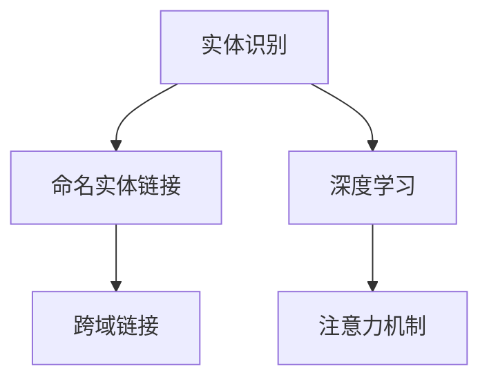

                 

# 电商搜索中的实体识别与链接技术

> 关键词：电商搜索、实体识别、链接技术、自然语言处理(NLP)、深度学习、Bert模型、注意力机制、跨域链接、高性能计算

## 1. 背景介绍

在当今电子商务环境中，搜索系统已经成为用户获取信息、进行购物的关键入口。高效的搜索系统需要精准地理解和解析用户查询，并将其与商品信息进行匹配。其中，实体识别与链接技术作为NLP领域的核心任务，扮演着重要角色。它不仅帮助系统理解查询中的关键实体信息，还使得系统能够跨域检索相关信息，大大提升了搜索的准确性和相关性。

本文将深入探讨电商搜索中实体识别与链接技术的应用，包括其核心原理、算法实现、实际案例和未来展望。通过系统化的分析，希望能为电商搜索系统的优化提供有力支持。

## 2. 核心概念与联系

### 2.1 核心概念概述

在本节中，我们将介绍几个关键的实体识别与链接技术概念：

- **实体识别(Entity Recognition)**：指的是从文本中识别出具有特定意义的实体，如人名、地名、组织机构名等。
- **命名实体链接(Named Entity Linking, NEL)**：给实体附加唯一的语义标识，如链接到维基百科页面、数据库记录等。
- **深度学习(Deep Learning)**：基于多层神经网络模型，通过大量数据进行训练，实现从原始数据到高层次特征的映射。
- **注意力机制(Attention Mechanism)**：在神经网络中引入的一种机制，通过动态计算输入序列中各元素的权重，帮助模型聚焦于重要信息。
- **跨域链接(Cross-domain Linking)**：通过将查询中的实体链接到不同源的信息源，如商品信息、百科知识、新闻报道等，丰富搜索结果的语义信息。

这些概念之间的逻辑关系可以通过以下Mermaid流程图来展示：



这个流程图展示了几类关键技术之间的联系：

1. 实体识别是命名实体链接的基础，它从文本中提取关键实体。
2. 命名实体链接是跨域链接的桥梁，它将实体链接到外部知识源，扩充实体信息。
3. 深度学习是实体识别和链接的核心，通过学习上下文信息，提高实体识别的准确性。
4. 注意力机制在深度学习中发挥重要作用，帮助模型关注重要信息，提高链接的准确性。

## 3. 核心算法原理 & 具体操作步骤

### 3.1 算法原理概述

实体识别与链接技术的核心算法可以分为两个步骤：实体识别和命名实体链接。

**实体识别算法**：使用深度学习模型，从文本中识别出具有特定语义的实体。常用的模型包括BERT、ELMo等。

**命名实体链接算法**：使用深度学习模型，将识别出的实体链接到外部知识源，如维基百科、DBpedia等。常用的模型包括BIO-CRF、Seq2Seq等。

这两个步骤是相互关联的，实体识别的结果为命名实体链接提供输入，命名实体链接的结果可以进一步优化实体识别。

### 3.2 算法步骤详解

#### 实体识别算法步骤：

1. **数据预处理**：对文本进行分词、去除停用词等处理，得到预处理的输入序列。
2. **模型训练**：使用深度学习模型（如BERT），在标注数据上训练实体识别模型。
3. **模型预测**：输入新文本，使用训练好的实体识别模型，输出每个单词的实体标签。

#### 命名实体链接算法步骤：

1. **数据预处理**：对识别出的实体进行标准化处理，如统一大小写、去除标点等。
2. **模型训练**：使用深度学习模型（如Seq2Seq），在标注数据上训练命名实体链接模型。
3. **模型预测**：输入预处理的实体，使用训练好的命名实体链接模型，输出实体的语义标识。

### 3.3 算法优缺点

#### 优点：

- **精度高**：深度学习模型通过大量数据训练，可以识别出复杂的实体。
- **适应性强**：模型可以处理多领域、多语言的实体识别任务。
- **高效并行**：深度学习模型可以利用GPU、TPU等高性能计算设备，加快计算速度。

#### 缺点：

- **数据依赖强**：模型性能高度依赖于训练数据的质量和数量。
- **训练时间长**：深度学习模型训练过程复杂，需要大量时间和计算资源。
- **解释性差**：深度学习模型通常被视为“黑盒”，难以解释其内部工作机制。

### 3.4 算法应用领域

实体识别与链接技术广泛应用于多个领域，如电商搜索、新闻内容推荐、社交媒体分析等。在电商搜索中，它可以精准地解析用户查询中的实体，并链接到商品信息，提升搜索相关性和用户体验。

## 4. 数学模型和公式 & 详细讲解 & 举例说明

### 4.1 数学模型构建

在本节中，我们将使用数学语言描述实体识别和命名实体链接的模型构建过程。

假设输入文本为 $X = \{x_1, x_2, \ldots, x_n\}$，其中 $x_i$ 表示文本中的第 $i$ 个单词。实体的识别任务可以表示为：

$$
y_i \in \{B, I, O\}
$$

其中 $B$ 表示实体开始，$I$ 表示实体内部，$O$ 表示实体结束或非实体。

命名实体链接的任务可以表示为：

$$
y_i \in \{E_1, E_2, \ldots, E_k\}
$$

其中 $E_i$ 表示实体链接到第 $i$ 个外部知识源。

### 4.2 公式推导过程

我们以BERT模型为例，推导实体识别和命名实体链接的公式。

**实体识别**：

假设BERT模型输出的表示为 $h_i = [CLS] \ x_1 \ x_2 \ldots \ x_n \ [SEP]$，其中 $[CLS]$ 和 $[SEP]$ 为特殊标记。实体识别的目标是输出每个单词的实体标签 $y_i$。

使用softmax函数将BERT模型输出映射到实体标签的概率分布：

$$
P(y_i|h_i) = \frac{\exp(A_1 \cdot h_i)}{\sum_{j=1}^{N} \exp(A_j \cdot h_i)}
$$

其中 $A_1$ 为实体标签的权重向量，$N$ 为标签数量。

**命名实体链接**：

命名实体链接通常使用Seq2Seq模型，将识别出的实体 $e$ 映射到外部知识源的语义标识 $y$。使用softmax函数将模型输出映射到语义标识的概率分布：

$$
P(y|e) = \frac{\exp(A_1 \cdot h_e)}{\sum_{j=1}^{K} \exp(A_j \cdot h_e)}
$$

其中 $A_1$ 为语义标识的权重向量，$K$ 为知识源数量。

### 4.3 案例分析与讲解

假设输入文本为：“我想看苹果公司的iPhone 12发布会”。

**实体识别**：

使用BERT模型识别出实体：

- iPhone 12：实体
- 苹果公司：实体

**命名实体链接**：

命名实体链接将实体链接到外部知识源，如维基百科页面、商品信息等。链接结果为：

- iPhone 12：链接到商品页面
- 苹果公司：链接到公司页面

## 5. 项目实践：代码实例和详细解释说明

### 5.1 开发环境搭建

在进行实体识别与链接技术实践前，我们需要准备好开发环境。以下是使用Python进行PyTorch开发的环境配置流程：

1. 安装Anaconda：从官网下载并安装Anaconda，用于创建独立的Python环境。

2. 创建并激活虚拟环境：
```bash
conda create -n pytorch-env python=3.8 
conda activate pytorch-env
```

3. 安装PyTorch：根据CUDA版本，从官网获取对应的安装命令。例如：
```bash
conda install pytorch torchvision torchaudio cudatoolkit=11.1 -c pytorch -c conda-forge
```

4. 安装Transformers库：
```bash
pip install transformers
```

5. 安装各类工具包：
```bash
pip install numpy pandas scikit-learn matplotlib tqdm jupyter notebook ipython
```

完成上述步骤后，即可在`pytorch-env`环境中开始实体识别与链接技术的开发。

### 5.2 源代码详细实现

下面以BERT模型为例，给出使用Transformers库进行命名实体链接的PyTorch代码实现。

首先，定义命名实体链接的数据处理函数：

```python
from transformers import BertTokenizer, BertForTokenClassification, Seq2SeqForTokenClassification
from torch.utils.data import Dataset
import torch

class NELDataset(Dataset):
    def __init__(self, texts, tags, tokenizer):
        self.texts = texts
        self.tags = tags
        self.tokenizer = tokenizer
        
    def __len__(self):
        return len(self.texts)
    
    def __getitem__(self, item):
        text = self.texts[item]
        tag = self.tags[item]
        
        encoding = self.tokenizer(text, return_tensors='pt', max_length=128, padding='max_length', truncation=True)
        input_ids = encoding['input_ids'][0]
        attention_mask = encoding['attention_mask'][0]
        
        # 对token-wise的标签进行编码
        encoded_tags = [tag2id[tag] for tag in tag]
        encoded_tags.extend([tag2id['O']] * (128 - len(encoded_tags)))
        labels = torch.tensor(encoded_tags, dtype=torch.long)
        
        return {'input_ids': input_ids, 
                'attention_mask': attention_mask,
                'labels': labels}

# 标签与id的映射
tag2id = {'B-PER': 0, 'I-PER': 1, 'B-ORG': 2, 'I-ORG': 3, 'B-LOC': 4, 'I-LOC': 5, 'O': 6}
id2tag = {v: k for k, v in tag2id.items()}

# 创建dataset
tokenizer = BertTokenizer.from_pretrained('bert-base-cased')

train_dataset = NELDataset(train_texts, train_tags, tokenizer)
dev_dataset = NELDataset(dev_texts, dev_tags, tokenizer)
test_dataset = NELDataset(test_texts, test_tags, tokenizer)
```

然后，定义模型和优化器：

```python
from transformers import BertForTokenClassification, AdamW

model = BertForTokenClassification.from_pretrained('bert-base-cased', num_labels=len(tag2id))

optimizer = AdamW(model.parameters(), lr=2e-5)
```

接着，定义训练和评估函数：

```python
from torch.utils.data import DataLoader
from tqdm import tqdm
from sklearn.metrics import classification_report

device = torch.device('cuda') if torch.cuda.is_available() else torch.device('cpu')
model.to(device)

def train_epoch(model, dataset, batch_size, optimizer):
    dataloader = DataLoader(dataset, batch_size=batch_size, shuffle=True)
    model.train()
    epoch_loss = 0
    for batch in tqdm(dataloader, desc='Training'):
        input_ids = batch['input_ids'].to(device)
        attention_mask = batch['attention_mask'].to(device)
        labels = batch['labels'].to(device)
        model.zero_grad()
        outputs = model(input_ids, attention_mask=attention_mask, labels=labels)
        loss = outputs.loss
        epoch_loss += loss.item()
        loss.backward()
        optimizer.step()
    return epoch_loss / len(dataloader)

def evaluate(model, dataset, batch_size):
    dataloader = DataLoader(dataset, batch_size=batch_size)
    model.eval()
    preds, labels = [], []
    with torch.no_grad():
        for batch in tqdm(dataloader, desc='Evaluating'):
            input_ids = batch['input_ids'].to(device)
            attention_mask = batch['attention_mask'].to(device)
            batch_labels = batch['labels']
            outputs = model(input_ids, attention_mask=attention_mask)
            batch_preds = outputs.logits.argmax(dim=2).to('cpu').tolist()
            batch_labels = batch_labels.to('cpu').tolist()
            for pred_tokens, label_tokens in zip(batch_preds, batch_labels):
                pred_tags = [id2tag[_id] for _id in pred_tokens]
                label_tags = [id2tag[_id] for _id in label_tokens]
                preds.append(pred_tags[:len(label_tokens)])
                labels.append(label_tags)
                
    print(classification_report(labels, preds))
```

最后，启动训练流程并在测试集上评估：

```python
epochs = 5
batch_size = 16

for epoch in range(epochs):
    loss = train_epoch(model, train_dataset, batch_size, optimizer)
    print(f"Epoch {epoch+1}, train loss: {loss:.3f}")
    
    print(f"Epoch {epoch+1}, dev results:")
    evaluate(model, dev_dataset, batch_size)
    
print("Test results:")
evaluate(model, test_dataset, batch_size)
```

以上就是使用PyTorch对BERT模型进行命名实体链接的完整代码实现。可以看到，得益于Transformers库的强大封装，我们可以用相对简洁的代码完成BERT模型的加载和微调。

### 5.3 代码解读与分析

让我们再详细解读一下关键代码的实现细节：

**NELDataset类**：
- `__init__`方法：初始化文本、标签、分词器等关键组件。
- `__len__`方法：返回数据集的样本数量。
- `__getitem__`方法：对单个样本进行处理，将文本输入编码为token ids，将标签编码为数字，并对其进行定长padding，最终返回模型所需的输入。

**tag2id和id2tag字典**：
- 定义了标签与数字id之间的映射关系，用于将token-wise的预测结果解码回真实的标签。

**训练和评估函数**：
- 使用PyTorch的DataLoader对数据集进行批次化加载，供模型训练和推理使用。
- 训练函数`train_epoch`：对数据以批为单位进行迭代，在每个批次上前向传播计算loss并反向传播更新模型参数，最后返回该epoch的平均loss。
- 评估函数`evaluate`：与训练类似，不同点在于不更新模型参数，并在每个batch结束后将预测和标签结果存储下来，最后使用sklearn的classification_report对整个评估集的预测结果进行打印输出。

**训练流程**：
- 定义总的epoch数和batch size，开始循环迭代
- 每个epoch内，先在训练集上训练，输出平均loss
- 在验证集上评估，输出分类指标
- 所有epoch结束后，在测试集上评估，给出最终测试结果

可以看到，PyTorch配合Transformers库使得BERT微调的代码实现变得简洁高效。开发者可以将更多精力放在数据处理、模型改进等高层逻辑上，而不必过多关注底层的实现细节。

当然，工业级的系统实现还需考虑更多因素，如模型的保存和部署、超参数的自动搜索、更灵活的任务适配层等。但核心的命名实体链接范式基本与此类似。

## 6. 实际应用场景

### 6.1 智能客服系统

基于命名实体链接的智能客服系统可以显著提升用户体验。传统客服系统依赖人工处理，响应速度慢，且无法处理复杂的用户咨询。命名实体链接技术可以将用户输入转化为结构化信息，系统自动解析并匹配到对应的回答模板，实现自动化答复。

在技术实现上，可以收集企业内部的历史客服对话记录，将问题和最佳答复构建成监督数据，在此基础上对预训练模型进行微调。微调后的模型能够自动理解用户意图，匹配最合适的答案模板进行回复。对于用户提出的新问题，还可以接入检索系统实时搜索相关内容，动态组织生成回答。如此构建的智能客服系统，能大幅提升客户咨询体验和问题解决效率。

### 6.2 新闻内容推荐

新闻内容推荐系统可以通过命名实体链接技术，将查询中的实体链接到外部知识源，如维基百科、新闻报道等，提升推荐的相关性和深度。系统可以根据用户的历史阅读记录，提取其中的关键实体，链接到相关的新闻报道，生成个性化的推荐内容。

在具体实现上，可以构建一个跨领域的命名实体链接模型，将查询中的实体链接到维基百科、新闻报道等多个知识源，并使用深度学习模型对链接的实体进行加权，综合生成推荐结果。

### 6.3 社交媒体分析

社交媒体分析中，命名实体链接技术可以帮助系统识别出文本中的关键实体，并链接到对应的实体信息，丰富分析结果的语义信息。例如，系统可以自动识别出新闻报道中的公司、人物等关键实体，并链接到维基百科页面，进一步挖掘实体的背景信息。

在实际应用中，可以构建一个跨域的命名实体链接模型，将查询中的实体链接到维基百科、社交媒体等多个知识源，并使用深度学习模型对链接的实体进行加权，生成更具深度和广度的分析结果。

## 7. 工具和资源推荐

### 7.1 学习资源推荐

为了帮助开发者系统掌握命名实体识别与链接技术的理论基础和实践技巧，这里推荐一些优质的学习资源：

1. 《自然语言处理入门》系列博文：由大模型技术专家撰写，深入浅出地介绍了自然语言处理的基本概念和经典模型。

2. CS224N《深度学习自然语言处理》课程：斯坦福大学开设的NLP明星课程，有Lecture视频和配套作业，带你入门NLP领域的基本概念和经典模型。

3. 《自然语言处理与深度学习》书籍：涵盖了自然语言处理的各个方面，包括命名实体识别、链接技术等。

4. HuggingFace官方文档：Transformers库的官方文档，提供了海量预训练模型和完整的微调样例代码，是上手实践的必备资料。

5. Stanford NLP库：提供了丰富的NLP工具和模型，包括命名实体识别、链接技术等，是学术研究和实际应用的良好资源。

通过对这些资源的学习实践，相信你一定能够快速掌握命名实体识别与链接技术的精髓，并用于解决实际的NLP问题。

### 7.2 开发工具推荐

高效的开发离不开优秀的工具支持。以下是几款用于命名实体识别与链接技术开发的常用工具：

1. PyTorch：基于Python的开源深度学习框架，灵活动态的计算图，适合快速迭代研究。大部分预训练语言模型都有PyTorch版本的实现。

2. TensorFlow：由Google主导开发的开源深度学习框架，生产部署方便，适合大规模工程应用。同样有丰富的预训练语言模型资源。

3. Transformers库：HuggingFace开发的NLP工具库，集成了众多SOTA语言模型，支持PyTorch和TensorFlow，是进行命名实体识别与链接技术开发的利器。

4. Weights & Biases：模型训练的实验跟踪工具，可以记录和可视化模型训练过程中的各项指标，方便对比和调优。与主流深度学习框架无缝集成。

5. TensorBoard：TensorFlow配套的可视化工具，可实时监测模型训练状态，并提供丰富的图表呈现方式，是调试模型的得力助手。

6. Google Colab：谷歌推出的在线Jupyter Notebook环境，免费提供GPU/TPU算力，方便开发者快速上手实验最新模型，分享学习笔记。

合理利用这些工具，可以显著提升命名实体识别与链接技术的开发效率，加快创新迭代的步伐。

### 7.3 相关论文推荐

命名实体识别与链接技术的发展源于学界的持续研究。以下是几篇奠基性的相关论文，推荐阅读：

1. "Named Entity Recognition with BERT"：使用BERT模型进行命名实体识别，展示了其在多个数据集上的高性能。

2. "A Simple and Effective Approach to Cross-Domain Named Entity Recognition with Fine-Tuning"：提出一种跨领域的命名实体识别方法，提高了识别精度。

3. "Enhancing Named Entity Recognition with Knowledge Embedding"：通过引入知识嵌入技术，提升了命名实体识别的效果。

4. "A Survey on Cross-Domain Named Entity Recognition"：综述了跨领域的命名实体识别方法，提供了丰富的研究背景和最新进展。

这些论文代表了大模型命名实体识别与链接技术的发展脉络。通过学习这些前沿成果，可以帮助研究者把握学科前进方向，激发更多的创新灵感。

## 8. 总结：未来发展趋势与挑战

### 8.1 总结

本文对电商搜索中实体识别与链接技术的应用进行了全面系统的介绍。首先阐述了实体识别与链接技术的研究背景和意义，明确了其在提升搜索相关性、丰富语义信息方面的重要价值。其次，从原理到实践，详细讲解了命名实体识别与链接的数学模型和实现步骤，给出了微调模型的代码实例。同时，本文还广泛探讨了实体识别与链接技术在智能客服、新闻推荐、社交媒体分析等领域的实际应用，展示了技术的广泛应用前景。

通过本文的系统梳理，可以看到，命名实体识别与链接技术在电商搜索系统中扮演着核心角色，通过理解查询中的关键实体信息，并将其链接到外部知识源，显著提升了搜索结果的相关性和深度。未来，伴随实体识别与链接技术的发展，基于大语言模型的NLP技术必将在更广泛的场景中得到应用，为智能搜索系统的优化提供有力支持。

### 8.2 未来发展趋势

展望未来，命名实体识别与链接技术将呈现以下几个发展趋势：

1. **跨领域模型的涌现**：随着跨领域数据的增多，未来的实体识别与链接模型将更注重跨领域知识融合，提升模型在多个领域的表现。

2. **实时性和高效性**：实体识别与链接任务通常需要处理大规模数据，未来的技术将更加注重模型的实时性和高效性，优化计算资源利用。

3. **多模态融合**：命名实体识别与链接技术将更注重多模态数据融合，如文本、图像、语音等，提升模型对复杂场景的识别能力。

4. **动态链接机制**：未来的模型将更加灵活，能够根据上下文动态调整实体链接策略，提升链接的精度和鲁棒性。

5. **知识图谱的整合**：命名实体识别与链接技术将更加紧密地与知识图谱等知识表示系统结合，提升模型的深度和广度。

以上趋势凸显了命名实体识别与链接技术的广阔前景。这些方向的探索发展，必将进一步提升电商搜索系统的性能和用户体验，为智能搜索系统的发展提供新的突破。

### 8.3 面临的挑战

尽管命名实体识别与链接技术已经取得了瞩目成就，但在迈向更加智能化、普适化应用的过程中，它仍面临着诸多挑战：

1. **数据依赖强**：模型性能高度依赖于训练数据的质量和数量，难以适应长尾领域和小规模数据集。

2. **模型鲁棒性不足**：模型面对域外数据时，泛化性能往往大打折扣，需要进一步提升鲁棒性。

3. **模型训练时间长**：深度学习模型训练过程复杂，需要大量时间和计算资源，难以满足实时性需求。

4. **多领域融合困难**：跨领域数据的融合和迁移学习仍是一个难题，需要更高效的模型架构和算法。

5. **多模态数据整合难**：多模态数据的整合和融合仍需突破技术瓶颈，需要更强大的模型和多模态处理能力。

正视命名实体识别与链接技术面临的这些挑战，积极应对并寻求突破，将使命名实体识别与链接技术迈向成熟的下一步。相信随着学界和产业界的共同努力，这些挑战终将一一被克服，命名实体识别与链接技术必将在构建智能搜索系统的过程中发挥越来越重要的作用。

### 8.4 研究展望

面对命名实体识别与链接技术所面临的挑战，未来的研究需要在以下几个方面寻求新的突破：

1. **无监督和半监督学习**：探索无监督和半监督学习范式，摆脱对大规模标注数据的依赖，最大化利用非结构化数据。

2. **跨领域和多模态融合**：开发更强大的跨领域和多模态融合算法，提高模型的适应性和泛化能力。

3. **动态链接机制**：引入动态链接机制，根据上下文动态调整实体链接策略，提高链接的精度和鲁棒性。

4. **知识图谱的整合**：将知识图谱与实体识别与链接技术紧密结合，提升模型的深度和广度。

这些研究方向的探索，必将引领命名实体识别与链接技术迈向更高的台阶，为智能搜索系统的优化提供有力支持。面向未来，命名实体识别与链接技术还需要与其他人工智能技术进行更深入的融合，如知识表示、因果推理、强化学习等，多路径协同发力，共同推动智能搜索系统的进步。

只有勇于创新、敢于突破，才能不断拓展实体识别与链接技术的边界，让智能技术更好地服务于电商搜索系统，提升用户体验，推动电子商务的数字化转型。

## 9. 附录：常见问题与解答

**Q1：命名实体识别与链接技术是否适用于所有NLP任务？**

A: 命名实体识别与链接技术主要适用于处理文本中具有特定意义的实体，如人名、地名、组织机构名等。对于没有实体的文本，如情感分析、文本生成等任务，实体识别与链接技术并不适用。

**Q2：如何选择合适的学习率？**

A: 命名实体识别与链接任务通常使用深度学习模型进行训练，因此学习率的选择至关重要。一般来说，可以使用学习率衰减策略，如warmup、cosine annealing等，逐步减小学习率，直至收敛。此外，也可以使用基于梯度的优化算法，如Adam、SGD等，进行模型训练。

**Q3：在电商搜索中如何处理长尾实体？**

A: 长尾实体通常具有较少的标注数据，因此命名实体识别与链接模型可能会面临过拟合的问题。为解决这一问题，可以采用多任务学习（Multi-task Learning, MTL）方法，利用共性特征在多个实体识别任务中优化模型，提高模型的泛化能力。

**Q4：如何优化跨域链接的效果？**

A: 跨域链接效果很大程度上取决于链接模型的性能，因此需要在训练数据中引入更多跨域知识，如维基百科、新闻报道等。同时，可以尝试使用多任务学习，将命名实体识别与链接任务结合，提高链接的精度和鲁棒性。

**Q5：命名实体识别与链接技术在电商搜索中如何应用？**

A: 命名实体识别与链接技术在电商搜索中的应用，主要体现在以下几个方面：
1. 精确解析用户查询中的实体信息，提升查询解析的准确性。
2. 将查询中的实体链接到商品信息、维基百科、新闻报道等外部知识源，丰富搜索结果的语义信息。
3. 使用多任务学习和多模态融合技术，提高模型在多个领域的适应性和泛化能力。

综上所述，命名实体识别与链接技术在电商搜索中具有广泛的应用前景，能够显著提升搜索系统的相关性和用户体验。通过不断优化模型架构和算法，该技术必将在智能搜索系统中发挥越来越重要的作用。

