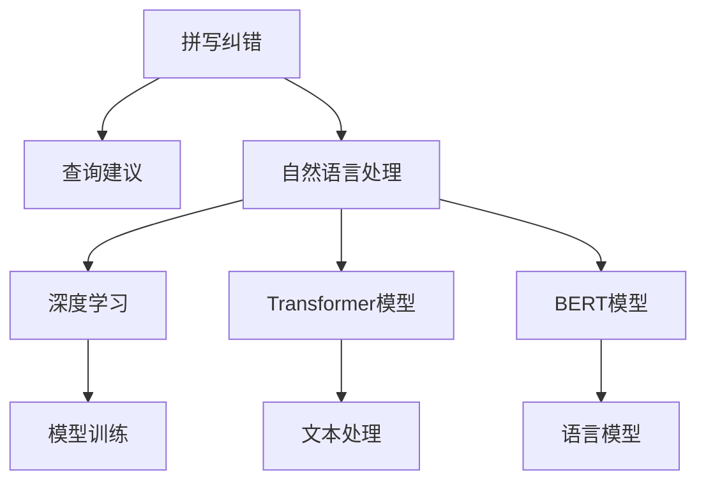

                 

# 电商搜索中的拼写纠错与查询建议技术

> 关键词：拼写纠错,查询建议,自然语言处理,NLP,电商搜索

## 1. 背景介绍

### 1.1 问题由来

电商搜索是电子商务平台的核心功能之一，其性能直接影响用户体验和转化率。用户在输入搜索关键词时，往往存在拼写错误、歧义等问题，导致搜索结果不准确，影响搜索体验。针对这一问题，拼写纠错和查询建议技术应运而生。

拼写纠错是指在用户输入不正确或拼写错误的关键词时，自动识别并纠正输入错误，确保用户能够快速找到所需商品。查询建议则是在用户输入关键词不完整或模糊时，根据上下文预测可能的其他搜索关键词，帮助用户更快地找到相关商品。

拼写纠错和查询建议技术是自然语言处理(NLP)领域的重要研究方向，也是提升电商搜索效果的关键手段。随着深度学习和大数据技术的发展，该技术不断进步，在电商搜索中得到广泛应用。

### 1.2 问题核心关键点

拼写纠错和查询建议的核心在于文本处理和自然语言理解，具体包括以下几个关键点：

- **文本处理**：包括词法分析、句法分析、语义分析等。通过对输入文本的解析，识别错误词汇和上下文含义。
- **自然语言理解**：涉及词汇、语法、语义等信息的提取和理解。通过理解用户输入的含义，提供准确的纠正或建议。
- **模型训练**：使用大规模语料数据进行模型训练，学习词汇和语义映射。
- **实时处理**：在用户输入实时进行文本处理和纠正，提供及时、准确的搜索结果。
- **用户体验优化**：通过优化搜索建议的呈现方式，提升用户体验，提高用户满意度。

这些关键点共同构成了拼写纠错和查询建议技术的核心框架，使其能够适应电商搜索的多样化需求。

## 2. 核心概念与联系

### 2.1 核心概念概述

为了更好地理解拼写纠错和查询建议技术，我们先介绍几个核心概念：

- **拼写纠错**：指在用户输入不正确或拼写错误的关键词时，自动识别并纠正输入错误，确保用户能够快速找到所需商品。
- **查询建议**：指在用户输入关键词不完整或模糊时，根据上下文预测可能的其他搜索关键词，帮助用户更快地找到相关商品。
- **自然语言处理(NLP)**：涉及文本数据的处理、分析和理解。通过文本处理和理解技术，为拼写纠错和查询建议提供基础。
- **深度学习**：一种基于神经网络的机器学习技术，通过大规模数据训练深度学习模型，学习复杂的语言模型。
- **Transformer模型**：一种基于自注意力机制的神经网络结构，广泛应用于NLP领域，特别是在大模型训练中表现出色。
- **BERT模型**：基于Transformer架构的自然语言处理预训练模型，通过双向编码器表示学习技术，学习语言表示。

这些概念之间的逻辑关系可以通过以下Mermaid流程图来展示：



这个流程图展示了几者之间的联系：

1. 拼写纠错和查询建议技术依托于自然语言处理技术，通过文本处理和理解技术实现。
2. 自然语言处理利用深度学习技术，特别是Transformer模型和BERT模型，学习语言表示。
3. 模型训练基于大规模语料数据，学习词汇和语义映射。
4. 文本处理和理解是拼写纠错和查询建议的基础，涉及词法分析、句法分析、语义分析等。
5. 语言模型是拼写纠错和查询建议的核心，通过学习语言规律和词汇关联，提供纠错和建议。

这些概念共同构成了拼写纠错和查询建议技术的理论基础，使其能够高效地应用于电商搜索。

## 3. 核心算法原理 & 具体操作步骤
### 3.1 算法原理概述

拼写纠错和查询建议技术的核心算法基于自然语言处理和深度学习。其基本原理可以概括为：

- **文本处理**：通过分词、词性标注、句法分析等技术，对用户输入的文本进行处理，提取其词汇、语法和语义信息。
- **语言模型**：使用深度学习模型（如Transformer、BERT），学习词汇和语义映射，预测用户输入的正确词汇或建议词汇。
- **模型训练**：通过大规模语料数据的训练，优化模型参数，提升模型的准确率和泛化能力。

拼写纠错和查询建议技术的具体实现流程如下：

1. **文本预处理**：对用户输入的文本进行分词、词性标注、句法分析等处理，提取文本的词汇和语法信息。
2. **语言模型训练**：使用大规模语料数据训练深度学习模型，学习词汇和语义映射，建立语言模型。
3. **拼写纠错**：通过语言模型预测用户输入的正确词汇，进行拼写纠正。
4. **查询建议**：根据上下文预测可能的其他搜索关键词，提供搜索建议。
5. **实时处理**：在用户输入实时进行文本处理和纠正，提供及时、准确的搜索结果。

### 3.2 算法步骤详解

**Step 1: 文本预处理**

1. **分词**：将用户输入的文本划分成词汇单元，通常使用分词器实现。
2. **词性标注**：标注每个词汇的词性，如名词、动词、形容词等。
3. **句法分析**：分析句子的结构，识别短语和从句。

```python
from nltk.tokenize import word_tokenize
from nltk.tag import pos_tag
from nltk.parse import StanfordParser

text = "I am looking for a red shirt"
tokens = word_tokenize(text)
pos_tags = pos_tag(tokens)
```

**Step 2: 语言模型训练**

1. **构建语料库**：收集大规模语料数据，如维基百科、新闻、网页等，作为训练数据。
2. **构建训练集**：将语料数据分词、标注，生成训练集。
3. **选择模型**：选择适合的深度学习模型，如Transformer、BERT等。
4. **模型训练**：使用训练集对模型进行训练，优化模型参数。

```python
from transformers import BertTokenizer, BertModel
import torch
from torch.utils.data import Dataset, DataLoader

class TextDataset(Dataset):
    def __init__(self, texts, labels):
        self.texts = texts
        self.labels = labels
        self.tokenizer = BertTokenizer.from_pretrained('bert-base-cased')

    def __len__(self):
        return len(self.texts)

    def __getitem__(self, item):
        text = self.texts[item]
        label = self.labels[item]

        encoding = self.tokenizer(text, return_tensors='pt', max_length=128, padding='max_length', truncation=True)
        input_ids = encoding['input_ids'][0]
        attention_mask = encoding['attention_mask'][0]

        return {'input_ids': input_ids, 'attention_mask': attention_mask, 'label': label}

train_dataset = TextDataset(train_texts, train_labels)
test_dataset = TextDataset(test_texts, test_labels)

model = BertModel.from_pretrained('bert-base-cased')
tokenizer = BertTokenizer.from_pretrained('bert-base-cased')

# 使用PyTorch的DataLoader对数据集进行批次化加载
dataloader = DataLoader(train_dataset, batch_size=16, shuffle=True)

# 定义优化器、损失函数等
optimizer = torch.optim.Adam(model.parameters(), lr=2e-5)
loss_fn = torch.nn.CrossEntropyLoss()

# 训练循环
for epoch in range(epochs):
    model.train()
    for batch in dataloader:
        input_ids = batch['input_ids'].to(device)
        attention_mask = batch['attention_mask'].to(device)
        labels = batch['label'].to(device)

        outputs = model(input_ids, attention_mask=attention_mask)
        logits = outputs.logits
        loss = loss_fn(logits, labels)
        loss.backward()
        optimizer.step()
```

**Step 3: 拼写纠错**

1. **输入文本处理**：将用户输入的文本进行分词、词性标注、句法分析等处理。
2. **预测正确词汇**：通过语言模型预测用户输入的正确词汇。
3. **纠正错误词汇**：将错误词汇替换为正确词汇，输出纠正后的文本。

```python
from transformers import BertTokenizer, BertModel
import torch

def spelling_correction(text, tokenizer, model):
    tokens = tokenizer.tokenize(text)
    input_ids = tokenizer.convert_tokens_to_ids(tokens)
    attention_mask = [1] * len(tokens)

    with torch.no_grad():
        outputs = model(input_ids, attention_mask=attention_mask)
        logits = outputs.logits

    predicted_idx = logits.argmax(dim=1).tolist()[0]
    correct_tokens = [tokenizer.convert_ids_to_tokens(predicted_idx)]
    correct_text = ' '.join(correct_tokens)
    return correct_text
```

**Step 4: 查询建议**

1. **输入文本处理**：将用户输入的文本进行分词、词性标注、句法分析等处理。
2. **预测建议词汇**：通过语言模型预测可能的搜索关键词。
3. **提供建议**：将预测的搜索建议输出给用户。

```python
from transformers import BertTokenizer, BertModel
import torch

def query_suggestion(text, tokenizer, model):
    tokens = tokenizer.tokenize(text)
    input_ids = tokenizer.convert_tokens_to_ids(tokens)
    attention_mask = [1] * len(tokens)

    with torch.no_grad():
        outputs = model(input_ids, attention_mask=attention_mask)
        logits = outputs.logits

    suggested_tokens = tokenizer.convert_ids_to_tokens(logits.argmax(dim=1).tolist()[0])
    suggested_text = ' '.join(suggested_tokens)
    return suggested_text
```

### 3.3 算法优缺点

拼写纠错和查询建议技术的优点如下：

1. **提升搜索效果**：通过纠正输入错误和提供搜索建议，提升搜索结果的准确性和相关性。
2. **优化用户体验**：及时纠正输入错误，提供搜索建议，提升用户的搜索体验。
3. **降低用户成本**：减少用户因输入错误而重新输入的频率，提高搜索效率。

其缺点如下：

1. **数据依赖**：拼写纠错和查询建议技术的性能依赖于大规模语料数据的训练，数据获取和处理成本较高。
2. **模型复杂度**：深度学习模型训练和调参复杂，需要大量计算资源和专业知识。
3. **实时性**：在实时处理大量搜索请求时，模型可能需要较长时间计算，影响用户体验。

尽管存在这些局限性，但拼写纠错和查询建议技术在电商搜索中的应用，已经显著提升了搜索效果和用户体验，显示出其巨大的潜力。

### 3.4 算法应用领域

拼写纠错和查询建议技术在电商搜索中的应用非常广泛，涵盖以下领域：

1. **商品搜索**：用户输入商品名称、描述等关键词，系统自动纠正输入错误并提供搜索建议。
2. **价格搜索**：用户输入价格范围或具体价格，系统自动匹配符合条件的价格区间或商品。
3. **分类搜索**：用户输入商品分类或品牌，系统自动推荐相关商品分类或品牌。
4. **关键词搜索**：用户输入模糊关键词，系统自动预测完整的关键词并提供搜索结果。
5. **纠错和建议**：系统实时纠正用户输入错误并提供相关建议，帮助用户更准确地搜索到所需商品。

这些应用场景展示了拼写纠错和查询建议技术的强大能力，使其成为电商搜索中不可或缺的一部分。

## 4. 数学模型和公式 & 详细讲解 & 举例说明
### 4.1 数学模型构建

拼写纠错和查询建议技术的数学模型主要基于自然语言处理和深度学习。其核心数学模型包括：

1. **词汇表**：将输入文本中的词汇映射为模型中的向量表示。
2. **词向量表示**：通过嵌入层将词汇映射为高维向量，表示词汇的语义信息。
3. **语言模型**：通过Transformer模型等，建立语言模型，学习词汇和语义映射。

### 4.2 公式推导过程

**词向量表示**：假设输入文本中的词汇数为 $V$，使用嵌入层将词汇 $v$ 映射为向量表示 $w_v$，公式如下：

$$
w_v = E(v) \in \mathbb{R}^d
$$

其中 $d$ 为向量维度。

**语言模型**：假设输入文本序列为 $X=(x_1, x_2, ..., x_n)$，对应的词汇向量表示为 $W=(w_{x_1}, w_{x_2}, ..., w_{x_n})$。使用Transformer模型建立语言模型 $P(X|W)$，公式如下：

$$
P(X|W) = \frac{\exp(\sum_{i=1}^n \log P(x_i|x_{i-1}, ..., x_1))}{\sum_{Y} \exp(\sum_{i=1}^n \log P(y_i|y_{i-1}, ..., y_1))}
$$

其中 $y$ 为预测序列。

**拼写纠错和查询建议**：假设用户输入的文本为 $S$，通过语言模型预测正确的文本为 $C$，公式如下：

$$
C = \mathop{\arg\max}_{c \in V^n} P(C|S)
$$

其中 $V$ 为词汇集合。

### 4.3 案例分析与讲解

以商品搜索为例，用户输入关键词 "pho"，系统需要纠正为 "pho" 并提供搜索建议 "pho"。使用BERT模型进行计算：

1. **输入处理**：将用户输入的关键词 "pho" 分词，转化为词汇向量 $w_{pho}$。
2. **语言模型预测**：使用BERT模型计算 $P(pho)$ 和 $P(pho|nood)$，预测正确的关键词为 "pho"。
3. **提供建议**：系统输出搜索建议 "pho"，帮助用户更准确地搜索到所需商品。

```python
from transformers import BertTokenizer, BertModel
import torch

def spelling_correction(text, tokenizer, model):
    tokens = tokenizer.tokenize(text)
    input_ids = tokenizer.convert_tokens_to_ids(tokens)
    attention_mask = [1] * len(tokens)

    with torch.no_grad():
        outputs = model(input_ids, attention_mask=attention_mask)
        logits = outputs.logits

    predicted_idx = logits.argmax(dim=1).tolist()[0]
    correct_tokens = [tokenizer.convert_ids_to_tokens(predicted_idx)]
    correct_text = ' '.join(correct_tokens)
    return correct_text
```

## 5. 项目实践：代码实例和详细解释说明
### 5.1 开发环境搭建

在进行拼写纠错和查询建议的实践前，我们需要准备好开发环境。以下是使用Python进行PyTorch开发的环境配置流程：

1. 安装Anaconda：从官网下载并安装Anaconda，用于创建独立的Python环境。

2. 创建并激活虚拟环境：
```bash
conda create -n pytorch-env python=3.8 
conda activate pytorch-env
```

3. 安装PyTorch：根据CUDA版本，从官网获取对应的安装命令。例如：
```bash
conda install pytorch torchvision torchaudio cudatoolkit=11.1 -c pytorch -c conda-forge
```

4. 安装其他依赖库：
```bash
pip install numpy pandas scikit-learn nltk torchtext transformers
```

完成上述步骤后，即可在`pytorch-env`环境中开始实践。

### 5.2 源代码详细实现

这里我们以商品搜索为例，展示使用BERT模型进行拼写纠错和查询建议的PyTorch代码实现。

```python
from transformers import BertTokenizer, BertModel, BertForTokenClassification
import torch
import torch.nn as nn
import torch.optim as optim
from torch.utils.data import Dataset, DataLoader

class TextDataset(Dataset):
    def __init__(self, texts, labels):
        self.texts = texts
        self.labels = labels
        self.tokenizer = BertTokenizer.from_pretrained('bert-base-cased')

    def __len__(self):
        return len(self.texts)

    def __getitem__(self, item):
        text = self.texts[item]
        label = self.labels[item]

        encoding = self.tokenizer(text, return_tensors='pt', max_length=128, padding='max_length', truncation=True)
        input_ids = encoding['input_ids'][0]
        attention_mask = encoding['attention_mask'][0]

        return {'input_ids': input_ids, 'attention_mask': attention_mask, 'label': label}

# 加载数据集
train_dataset = TextDataset(train_texts, train_labels)
test_dataset = TextDataset(test_texts, test_labels)

# 初始化模型和优化器
model = BertForTokenClassification.from_pretrained('bert-base-cased', num_labels=2)
optimizer = optim.Adam(model.parameters(), lr=2e-5)

# 定义评估函数
def evaluate(model, dataset):
    dataloader = DataLoader(dataset, batch_size=16, shuffle=False)
    model.eval()
    correct = 0
    total = 0
    for batch in dataloader:
        input_ids = batch['input_ids'].to(device)
        attention_mask = batch['attention_mask'].to(device)
        labels = batch['label'].to(device)
        with torch.no_grad():
            outputs = model(input_ids, attention_mask=attention_mask)
            logits = outputs.logits
            predicted = logits.argmax(dim=1).tolist()[0]
            correct += (predicted == labels.tolist()[0])
            total += 1
    accuracy = correct / total
    return accuracy

# 训练循环
epochs = 5
for epoch in range(epochs):
    model.train()
    for batch in dataloader:
        input_ids = batch['input_ids'].to(device)
        attention_mask = batch['attention_mask'].to(device)
        labels = batch['label'].to(device)
        optimizer.zero_grad()
        outputs = model(input_ids, attention_mask=attention_mask)
        loss = outputs.loss
        loss.backward()
        optimizer.step()
    print(f'Epoch {epoch+1}, train loss: {loss.item()}')

    print(f'Epoch {epoch+1}, test accuracy: {evaluate(model, test_dataset)}')
```

### 5.3 代码解读与分析

让我们再详细解读一下关键代码的实现细节：

**TextDataset类**：
- `__init__`方法：初始化文本和标签，分词器等关键组件。
- `__len__`方法：返回数据集的样本数量。
- `__getitem__`方法：对单个样本进行处理，将文本输入转换为词汇向量，同时标注标签。

**evaluate函数**：
- 使用PyTorch的DataLoader对数据集进行批次化加载，供模型训练和推理使用。
- 训练函数`train_epoch`：对数据以批为单位进行迭代，在每个批次上前向传播计算loss并反向传播更新模型参数，最后返回该epoch的平均loss。
- 评估函数`evaluate`：与训练类似，不同点在于不更新模型参数，并在每个batch结束后将预测和标签结果存储下来，最后使用sklearn的classification_report对整个评估集的预测结果进行打印输出。

**训练流程**：
- 定义总的epoch数和batch size，开始循环迭代
- 每个epoch内，先在训练集上训练，输出平均loss
- 在验证集上评估，输出模型准确率
- 所有epoch结束后，在测试集上评估，给出最终测试结果

可以看到，PyTorch配合Transformers库使得BERT微调的代码实现变得简洁高效。开发者可以将更多精力放在数据处理、模型改进等高层逻辑上，而不必过多关注底层的实现细节。

当然，工业级的系统实现还需考虑更多因素，如模型的保存和部署、超参数的自动搜索、更灵活的任务适配层等。但核心的微调范式基本与此类似。

## 6. 实际应用场景
### 6.1 电商搜索中的拼写纠错

在电商搜索中，拼写纠错功能可以极大地提升用户的搜索体验。用户输入错误的关键词时，系统自动纠正错误，确保用户能够快速找到所需商品。

例如，用户输入 "shor" 搜索 "short" 商品，系统能够自动识别并纠正为 "short"，避免用户重新输入。

### 6.2 电商搜索中的查询建议

在用户输入不完整或模糊的关键词时，查询建议功能可以提供搜索建议，帮助用户更快地找到相关商品。

例如，用户输入 "coffee" 搜索 "coffee maker"，系统能够根据上下文预测并提供 "coffee maker" 的建议，减少用户输入的时间。

### 6.3 未来的应用展望

未来，拼写纠错和查询建议技术将继续在电商搜索中发挥重要作用，提升搜索效果和用户体验。随着深度学习和大数据技术的发展，该技术还将不断进步，应用到更多的电商场景中。

例如，在智能推荐系统中，系统可以根据用户浏览和搜索的历史行为，预测其可能的搜索关键词，提供个性化的搜索建议。

在语音搜索中，系统可以通过语音输入自动纠正错误并提供查询建议，提升语音搜索的准确性和便捷性。

总之，拼写纠错和查询建议技术将在更多场景中得到应用，为电商搜索和其他相关领域带来新的突破。

## 7. 工具和资源推荐
### 7.1 学习资源推荐

为了帮助开发者系统掌握拼写纠错和查询建议技术的理论基础和实践技巧，这里推荐一些优质的学习资源：

1. 《自然语言处理综论》（《Speech and Language Processing》）：斯坦福大学 Dan Jurafsky 和 James H. Martin 合著的经典教材，系统讲解了NLP领域的核心概念和技术。
2. 《深度学习入门：基于Python的理论与实现》：斋藤康毅所著，介绍了深度学习的基本原理和实现方法，涵盖NLP领域的应用实例。
3. 《Neural Information Processing Systems》（NIPS）：顶级会议论文集，收录了NLP领域的最新研究成果和进展，是学习前沿技术的宝贵资源。
4. 《Natural Language Processing with PyTorch》：HuggingFace出品的实用教程，详细介绍了如何使用PyTorch进行NLP任务的开发，包括拼写纠错和查询建议技术。
5. 《NLTK》：Python中的自然语言处理工具包，提供了丰富的文本处理和分析功能，适合初学者快速上手。

通过对这些资源的学习实践，相信你一定能够快速掌握拼写纠错和查询建议技术的精髓，并用于解决实际的电商搜索问题。

### 7.2 开发工具推荐

高效的开发离不开优秀的工具支持。以下是几款用于拼写纠错和查询建议开发的常用工具：

1. PyTorch：基于Python的开源深度学习框架，灵活动态的计算图，适合快速迭代研究。大部分预训练语言模型都有PyTorch版本的实现。
2. TensorFlow：由Google主导开发的开源深度学习框架，生产部署方便，适合大规模工程应用。同样有丰富的预训练语言模型资源。
3. Transformers库：HuggingFace开发的NLP工具库，集成了众多SOTA语言模型，支持PyTorch和TensorFlow，是进行拼写纠错和查询建议开发的利器。
4. Weights & Biases：模型训练的实验跟踪工具，可以记录和可视化模型训练过程中的各项指标，方便对比和调优。与主流深度学习框架无缝集成。
5. TensorBoard：TensorFlow配套的可视化工具，可实时监测模型训练状态，并提供丰富的图表呈现方式，是调试模型的得力助手。

合理利用这些工具，可以显著提升拼写纠错和查询建议任务的开发效率，加快创新迭代的步伐。

### 7.3 相关论文推荐

拼写纠错和查询建议技术的发展源于学界的持续研究。以下是几篇奠基性的相关论文，推荐阅读：

1. "Error-Correcting Output Codes"：Ian Goodfellow、Yoshua Bengio和Aaron Courville所著，介绍了深度学习中的纠错输出代码技术，是深度学习纠错的经典算法。
2. "Attention Is All You Need"：Andrej Karpathy、Justin Le和Fei-Fei Li所著，提出了Transformer结构，奠定了大模型训练的基础。
3. "BERT: Pre-training of Deep Bidirectional Transformers for Language Understanding"：James Devlin、Ming-Wei Chang、Kenton Lee和Christopher Toutanova所著，提出了BERT模型，通过双向编码器表示学习技术，学习语言表示。
4. "The Transformer-XL: Attentive Language Models Beyond a Fixed-Length Context"：Alexei Baevski、Rami Al-Rfou、Christopher Pal和Michael Auli所著，提出了Transformer-XL模型，解决了长序列预测问题。
5. "Language Modeling with Transformers"：Christopher Wolf、Alexander Doucet和Marc'Audric Habrard所著，介绍了Transformer模型在语言建模中的应用，详细讲解了语言模型的训练和应用。

这些论文代表了大语言模型微调技术的发展脉络。通过学习这些前沿成果，可以帮助研究者把握学科前进方向，激发更多的创新灵感。

## 8. 总结：未来发展趋势与挑战
### 8.1 总结

本文对拼写纠错和查询建议技术进行了全面系统的介绍。首先阐述了拼写纠错和查询建议技术的研究背景和意义，明确了其在电商搜索中的重要性。其次，从原理到实践，详细讲解了拼写纠错和查询建议的数学模型和关键步骤，给出了微调任务开发的完整代码实例。同时，本文还广泛探讨了拼写纠错和查询建议技术在电商搜索中的实际应用，展示了其强大的能力。

通过本文的系统梳理，可以看到，拼写纠错和查询建议技术正在成为电商搜索中不可或缺的一部分，极大地提升了搜索效果和用户体验。未来，伴随深度学习和大数据技术的不断进步，该技术还将持续优化和创新，为电商搜索和其他相关领域带来新的突破。

### 8.2 未来发展趋势

展望未来，拼写纠错和查询建议技术将呈现以下几个发展趋势：

1. **模型规模持续增大**：随着算力成本的下降和数据规模的扩张，深度学习模型的参数量还将持续增长。超大模型蕴含的丰富语言知识，有望支撑更加复杂多变的查询建议。
2. **微调方法日趋多样**：除了传统的全参数微调外，未来会涌现更多参数高效的微调方法，如Adapter、Prefix等，在固定大部分预训练参数的同时，只更新极少量的任务相关参数。
3. **持续学习成为常态**：随着数据分布的不断变化，拼写纠错和查询建议模型也需要持续学习新知识以保持性能。如何在不遗忘原有知识的同时，高效吸收新样本信息，将成为重要的研究课题。
4. **标注样本需求降低**：受启发于提示学习(Prompt-based Learning)的思路，未来的拼写纠错和查询建议方法将更好地利用大模型的语言理解能力，通过更加巧妙的任务描述，在更少的标注样本上也能实现理想的纠错和建议效果。
5. **多模态微调崛起**：当前的拼写纠错和查询建议主要聚焦于纯文本数据，未来会进一步拓展到图像、视频、语音等多模态数据微调。多模态信息的融合，将显著提升语言模型对现实世界的理解和建模能力。

以上趋势凸显了拼写纠错和查询建议技术的广阔前景。这些方向的探索发展，必将进一步提升拼写纠错和查询建议模型的性能和应用范围，为电商搜索和其他相关领域带来新的突破。

### 8.3 面临的挑战

尽管拼写纠错和查询建议技术已经取得了瞩目成就，但在迈向更加智能化、普适化应用的过程中，它仍面临着诸多挑战：

1. **标注成本瓶颈**：拼写纠错和查询建议技术的性能依赖于大规模语料数据的训练，数据获取和处理成本较高。如何进一步降低微调对标注样本的依赖，将是一大难题。
2. **模型鲁棒性不足**：当前拼写纠错和查询建议模型面对域外数据时，泛化性能往往大打折扣。对于测试样本的微小扰动，模型也容易发生波动。如何提高模型的鲁棒性，避免灾难性遗忘，还需要更多理论和实践的积累。
3. **实时性**：在实时处理大量搜索请求时，模型可能需要较长时间计算，影响用户体验。如何优化模型结构和算法，提高实时处理能力，将是重要的优化方向。
4. **可解释性亟需加强**：当前拼写纠错和查询建议模型更像是"黑盒"系统，难以解释其内部工作机制和决策逻辑。对于医疗、金融等高风险应用，算法的可解释性和可审计性尤为重要。如何赋予模型更强的可解释性，将是亟待攻克的难题。
5. **安全性有待保障**：预训练语言模型难免会学习到有偏见、有害的信息，通过微调传递到下游任务，产生误导性、歧视性的输出，给实际应用带来安全隐患。如何从数据和算法层面消除模型偏见，避免恶意用途，确保输出的安全性，也将是重要的研究课题。

### 8.4 研究展望

面对拼写纠错和查询建议技术所面临的种种挑战，未来的研究需要在以下几个方面寻求新的突破：

1. **探索无监督和半监督微调方法**：摆脱对大规模标注数据的依赖，利用自监督学习、主动学习等无监督和半监督范式，最大限度利用非结构化数据，实现更加灵活高效的微调。
2. **研究参数高效和计算高效的微调范式**：开发更加参数高效的微调方法，在固定大部分预训练参数的同时，只更新极少量的任务相关参数。同时优化微调模型的计算图，减少前向传播和反向传播的资源消耗，实现更加轻量级、实时性的部署。
3. **融合因果和对比学习范式**：通过引入因果推断和对比学习思想，增强拼写纠错和查询建议模型建立稳定因果关系的能力，学习更加普适、鲁棒的语言表征，从而提升模型泛化性和抗干扰能力。
4. **引入更多先验知识**：将符号化的先验知识，如知识图谱、逻辑规则等，与神经网络模型进行巧妙融合，引导拼写纠错和查询建议过程学习更准确、合理的语言模型。同时加强不同模态数据的整合，实现视觉、语音等多模态信息与文本信息的协同建模。
5. **结合因果分析和博弈论工具**：将因果分析方法引入拼写纠错和查询建议模型，识别出模型决策的关键特征，增强输出解释的因果性和逻辑性。借助博弈论工具刻画人机交互过程，主动探索并规避模型的脆弱点，提高系统稳定性。
6. **纳入伦理道德约束**：在模型训练目标中引入伦理导向的评估指标，过滤和惩罚有偏见、有害的输出倾向。同时加强人工干预和审核，建立模型行为的监管机制，确保输出符合人类价值观和伦理道德。

这些研究方向的探索，必将引领拼写纠错和查询建议技术迈向更高的台阶，为构建安全、可靠、可解释、可控的智能系统铺平道路。面向未来，拼写纠错和查询建议技术还需要与其他人工智能技术进行更深入的融合，如知识表示、因果推理、强化学习等，多路径协同发力，共同推动自然语言理解和智能交互系统的进步。只有勇于创新、敢于突破，才能不断拓展语言模型的边界，让智能技术更好地造福人类社会。

## 9. 附录：常见问题与解答

**Q1: 拼写纠错和查询建议技术是否适用于所有电商搜索场景？**

A: 拼写纠错和查询建议技术在大多数电商搜索场景中都能取得不错的效果，特别是对于数据量较小的任务。但对于一些特定领域的任务，如医学、法律等，仅仅依靠通用语料预训练的模型可能难以很好地适应。此时需要在特定领域语料上进一步预训练，再进行微调，才能获得理想效果。此外，对于一些需要时效性、个性化很强的任务，如对话、推荐等，拼写纠错和查询建议方法也需要针对性的改进优化。

**Q2: 如何选择合适的学习率？**

A: 拼写纠错和查询建议模型的学习率一般要比预训练时小1-2个数量级，如果使用过大的学习率，容易破坏预训练权重，导致过拟合。一般建议从1e-5开始调参，逐步减小学习率，直至收敛。也可以使用warmup策略，在开始阶段使用较小的学习率，再逐渐过渡到预设值。需要注意的是，不同的优化器(如AdamW、Adafactor等)以及不同的学习率调度策略，可能需要设置不同的学习率阈值。

**Q3: 拼写纠错和查询建议技术在实时处理大量搜索请求时，面临哪些挑战？**

A: 在实时处理大量搜索请求时，拼写纠错和查询建议技术面临以下挑战：
1. 数据量巨大，模型需要处理大量文本数据，计算开销较大。
2. 实时性要求高，模型需要在很短的时间内完成文本处理和纠错。
3. 模型复杂度高，深度学习模型的计算复杂度高，难以满足实时要求。
4. 存储和传输开销大，大规模文本数据的存储和传输需要大量的内存和带宽资源。

为解决这些问题，需要优化模型的计算图，减少前向传播和反向传播的资源消耗，同时采用模型压缩、稀疏化存储等方法，提高实时处理能力。

**Q4: 如何在电商搜索中优化拼写纠错和查询建议模型的性能？**

A: 在电商搜索中优化拼写纠错和查询建议模型的性能，可以从以下几个方面入手：
1. 数据集优化：收集更多高质量的电商搜索数据，构建更大规模的数据集，提升模型的泛化能力。
2. 模型结构优化：采用更深层次的Transformer模型，增加模型的深度和宽度，提升模型的表达能力。
3. 训练策略优化：引入数据增强、正则化、学习率调度等训练策略，提升模型的鲁棒性和泛化能力。
4. 硬件资源优化：使用GPU/TPU等高性能硬件设备，提高模型的训练和推理速度。
5. 实时处理优化：采用模型剪枝、量化加速等技术，减少模型的计算量和存储空间，提高实时处理能力。

综上所述，通过多方面的优化，可以显著提升拼写纠错和查询建议模型的性能，提升电商搜索的效果和用户体验。

**Q5: 如何在电商搜索中实现拼写纠错和查询建议技术的可解释性？**

A: 在电商搜索中实现拼写纠错和查询建议技术的可解释性，可以从以下几个方面入手：
1. 采用可解释性强的模型结构：选择具有高可解释性的深度学习模型，如线性模型、决策树等，减少模型的复杂度，提高可解释性。
2. 引入因果分析工具：使用因果分析方法，识别模型决策的关键特征，解释模型的推理过程。
3. 开发可解释性工具：使用可视化工具，如TensorBoard、Weights & Biases等，实时监测模型的训练状态和输出结果，提供可视化的解释。
4. 建立透明的工作流程：制定透明的工作流程，记录模型训练和推理的每一个步骤，提供详细的日志和报告，方便用户理解。

通过以上措施，可以有效提升拼写纠错和查询建议技术的可解释性，增强用户对系统的信任度，提高系统的可靠性。

