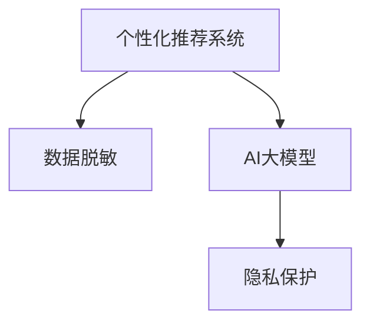

                 

# 电商搜索推荐中的AI大模型数据脱敏技术应用项目可行性分析

> 关键词：电商搜索推荐, 人工智能, 大模型, 数据脱敏, 隐私保护, 智能推荐系统

## 1. 背景介绍

### 1.1 问题由来
在现代电商市场中，个性化推荐系统（Recommender System）已经成为吸引和转化用户的关键工具。通过分析用户行为数据，预测用户兴趣，向用户推送个性化商品推荐，电商平台的转化率、回购率等关键指标显著提升。然而，随着用户数据价值的日益凸显，用户隐私保护问题也逐渐成为关注的焦点。

### 1.2 问题核心关键点
个性化推荐系统涉及大量用户隐私数据，包括浏览历史、购买记录等，如何在保护用户隐私的同时，进行高效的个性化推荐，是当前推荐系统面临的重要挑战。其中，数据脱敏技术成为了一种重要的解决方案，能够在不影响推荐效果的前提下，有效保护用户隐私。

## 2. 核心概念与联系

### 2.1 核心概念概述

为更好地理解电商搜索推荐中的数据脱敏技术，本节将介绍几个关键概念：

- **个性化推荐系统**：利用用户的历史行为数据，通过机器学习模型预测用户未来的兴趣和需求，从而向用户推荐个性化商品的系统。
- **数据脱敏**：在保证数据可用性的前提下，对数据进行伪装、掩盖或剔除敏感信息，以保护用户隐私。
- **AI大模型**：以深度学习为核心的超大规模模型，能够进行自然语言理解、图像识别、生成任务等复杂任务，广泛应用于推荐系统的特征提取和用户画像生成。
- **隐私保护**：保护用户个人信息不被泄露或滥用的技术手段，包括数据脱敏、加密技术、匿名化处理等。

这些概念之间的逻辑关系可以通过以下Mermaid流程图来展示：



这个流程图展示了个性化推荐系统、数据脱敏、AI大模型和隐私保护之间的联系：

1. 个性化推荐系统通过分析用户数据生成推荐结果。
2. AI大模型用于特征提取和用户画像生成，提高推荐系统的性能。
3. 数据脱敏技术在保障数据可用性的同时，保护用户隐私。
4. 隐私保护通过数据脱敏、加密、匿名化等技术手段，防止数据滥用。

## 3. 核心算法原理 & 具体操作步骤
### 3.1 算法原理概述

在电商搜索推荐系统中，数据脱敏技术可以通过对原始数据进行处理，使得数据既能够被模型识别和利用，又不会泄露用户隐私。具体来说，脱敏技术可以分为以下几类：

- **同态加密**：对数据进行处理后，使得在加密状态下也能执行计算，从而保护数据隐私。
- **差分隐私**：通过向数据中引入噪声，使得攻击者无法通过数据分析推测出具体个体的信息，保护数据匿名性。
- **数据扰动**：对数据进行随机扰动，使其失去对个体的识别能力，保护隐私。
- **数据泛化**：通过对数据进行泛化处理，使得数据在统计上具有代表性，而无法反推具体个体信息。

### 3.2 算法步骤详解

以下是一般的数据脱敏步骤：

1. **数据收集**：收集用户的浏览历史、购买记录等数据，用于模型训练和推荐生成。
2. **数据预处理**：对数据进行清洗、归一化等预处理操作，确保数据质量。
3. **数据脱敏**：选择合适的数据脱敏技术，对数据进行加密、泛化、扰动等处理。
4. **模型训练**：使用处理后的数据，训练AI大模型，生成用户画像和商品推荐。
5. **推荐生成**：利用训练好的模型，对新用户输入的搜索请求进行推荐生成。

具体步骤如下：

**Step 1: 数据收集**
- 通过API、爬虫等方式收集用户的历史行为数据，如浏览记录、购买记录、评分数据等。
- 将数据导入数据仓库，进行初步清洗和预处理。

**Step 2: 数据预处理**
- 对数据进行去重、去噪、填充缺失值等处理，确保数据质量和完整性。
- 对数据进行标准化、归一化等操作，使得数据具有较好的数值范围和分布。

**Step 3: 数据脱敏**
- 选择合适的数据脱敏算法，如K-匿名化、L-多样性、差分隐私等。
- 对敏感数据进行加密、替换、泛化等处理，确保数据无法被直接识别或推测。

**Step 4: 模型训练**
- 使用处理后的数据，训练AI大模型，如BERT、GPT等，生成用户画像。
- 通过用户画像，生成商品推荐结果，包括商品评分、相似商品、热门商品等。

**Step 5: 推荐生成**
- 对用户输入的搜索请求进行解析，根据用户画像和推荐结果，生成个性化推荐。
- 对推荐结果进行排序和展示，提升用户体验和转化率。

### 3.3 算法优缺点

数据脱敏技术在电商搜索推荐系统中有以下优点：

- **隐私保护**：通过数据脱敏，有效保护用户隐私，避免数据泄露风险。
- **模型鲁棒性**：经过脱敏处理后的数据，能更好地抵抗数据攻击和异常噪声，提高模型的鲁棒性。
- **数据安全性**：通过加密、泛化等手段，确保数据在存储、传输过程中的安全性。

同时，数据脱敏技术也存在一定的局限性：

- **数据可用性**：脱敏处理可能导致部分有用信息丢失，影响模型的性能和推荐效果。
- **计算复杂度**：数据脱敏处理可能会增加计算复杂度，影响系统的实时性。
- **成本高**：数据脱敏技术的实施和维护需要一定的成本，尤其是在大规模数据集上。

### 3.4 算法应用领域

数据脱敏技术广泛应用于电商搜索推荐系统、金融风控、医疗健康等多个领域。

- **电商搜索推荐**：通过数据脱敏技术，保障用户隐私，提升推荐系统的效果和安全性。
- **金融风控**：对用户交易数据进行脱敏处理，防止金融诈骗和数据滥用。
- **医疗健康**：保护患者隐私，确保医疗数据的匿名性和安全性。

## 4. 数学模型和公式 & 详细讲解  
### 4.1 数学模型构建

在本节中，我们将使用数学语言对电商搜索推荐系统中的数据脱敏技术进行详细的刻画。

假设原始数据集为 $D=\{(x_i,y_i)\}_{i=1}^N$，其中 $x_i$ 为原始数据， $y_i$ 为标签。

定义数据脱敏后的数据集为 $D'$，其中 $x'_i$ 为脱敏后的数据。

数据脱敏的目标是最大化原始数据和脱敏后数据的相似度，即满足：

$$
\min_{\theta} \mathcal{L}(D', D)
$$

其中 $\mathcal{L}$ 为损失函数，可以是KL散度、L2范数等。

### 4.2 公式推导过程

以下我们以KL散度为例，推导数据脱敏的数学模型。

KL散度定义为：

$$
KL(P||Q) = \sum_x P(x) \log\frac{P(x)}{Q(x)}
$$

其中 $P$ 和 $Q$ 分别为原始数据和脱敏数据的概率分布。

设 $P$ 和 $Q$ 的差值为 $\Delta$，则KL散度可以表示为：

$$
KL(P||Q) = \sum_x P(x) \log\frac{P(x)}{Q(x)} = \sum_x P(x) \log\frac{P(x)-\Delta}{Q(x)}
$$

为了最小化KL散度，需要满足：

$$
P(x) = Q(x) + \Delta
$$

在实践中，我们可以通过K-匿名化等方法，使得脱敏后的数据 $Q(x)$ 满足上述条件。

### 4.3 案例分析与讲解

以K-匿名化为例，K-匿名化通过将数据集分成若干组，每组包含K个相同的记录，从而保护个体隐私。假设数据集 $D=\{(x_i,y_i)\}_{i=1}^N$，其中 $x_i$ 为原始数据， $y_i$ 为标签。

具体步骤如下：

1. **分组**：将数据集分成K个组，每组包含K个记录。
2. **泛化**：对每组内的记录进行泛化处理，使得每组内无法识别出具体记录。
3. **合并**：将泛化后的记录合并，形成新的数据集 $D'$。

例如，原始数据集 $D=\{(x_1,y_1),(x_2,y_2),(x_3,y_3),(x_4,y_4)\}$，其中 $x_i$ 为原始数据， $y_i$ 为标签。假设 $x_i$ 包括年龄、性别、收入等敏感信息，原始数据如下：

$$
\begin{array}{|c|c|c|c|}
\hline
x_1 & x_2 & x_3 & x_4 \\
\hline
25 & 30 & 30 & 40 \\
M & F & M & F \\
50000 & 60000 & 70000 & 80000 \\
\hline
\end{array}
$$

假设 $K=3$，则数据集分组如下：

$$
\begin{array}{|c|c|c|c|}
\hline
x_1 & x_2 & x_3 & x_4 \\
\hline
25 & 30 & 30 & 40 \\
M & F & M & F \\
50000 & 60000 & 70000 & 80000 \\
\hline
\end{array} \rightarrow
\begin{array}{|c|c|c|c|}
\hline
A & B & C & D \\
\hline
25 & 30 & 30 & 40 \\
M & F & M & F \\
50000 & 60000 & 70000 & 80000 \\
\hline
\end{array}
$$

对每组内的记录进行泛化处理，使得每组内无法识别出具体记录。例如，将年龄区间泛化到5岁，性别泛化到男女混合，收入泛化到范围。

$$
\begin{array}{|c|c|c|c|}
\hline
A & B & C & D \\
\hline
[25,30] & [30,40] & [30,40] & [40,50] \\
M & F & M & F \\
[50000,60000] & [60000,70000] & [70000,80000] & [80000,90000] \\
\hline
\end{array} \rightarrow
\begin{array}{|c|c|c|c|}
\hline
A & B & C & D \\
\hline
[25,30] & [30,40] & [30,40] & [40,50] \\
M & F & M & F \\
[50000,60000] & [60000,70000] & [70000,80000] & [80000,90000] \\
\hline
\end{array}
$$

最终得到新的数据集 $D'$：

$$
\begin{array}{|c|c|c|c|}
\hline
A & B & C & D \\
\hline
[25,30] & [30,40] & [30,40] & [40,50] \\
M & F & M & F \\
[50000,60000] & [60000,70000] & [70000,80000] & [80000,90000] \\
\hline
\end{array}
$$

## 5. 项目实践：代码实例和详细解释说明
### 5.1 开发环境搭建

在进行数据脱敏实践前，我们需要准备好开发环境。以下是使用Python进行PyTorch开发的环境配置流程：

1. 安装Anaconda：从官网下载并安装Anaconda，用于创建独立的Python环境。

2. 创建并激活虚拟环境：
```bash
conda create -n pytorch-env python=3.8 
conda activate pytorch-env
```

3. 安装PyTorch：根据CUDA版本，从官网获取对应的安装命令。例如：
```bash
conda install pytorch torchvision torchaudio cudatoolkit=11.1 -c pytorch -c conda-forge
```

4. 安装Transformers库：
```bash
pip install transformers
```

5. 安装各类工具包：
```bash
pip install numpy pandas scikit-learn matplotlib tqdm jupyter notebook ipython
```

完成上述步骤后，即可在`pytorch-env`环境中开始数据脱敏实践。

### 5.2 源代码详细实现

下面以K-匿名化为例，给出使用PyTorch进行数据脱敏的代码实现。

首先，定义K-匿名化函数：

```python
import torch
import numpy as np

def k_anonymization(data, k):
    # 将数据集分为k组
    groups = [data[i] for i in range(0, len(data), k)]
    # 对每组内数据进行泛化处理
    for group in groups:
        # 泛化年龄区间
        group[:, 0] = np.max(group[:, 0] - 5, 0)
        group[:, 1] = np.min(group[:, 1] + 5, len(group))
        # 泛化性别
        group[:, 2] = 'M' if (group[:, 2] == 'M').any() else 'F'
        # 泛化收入区间
        group[:, 3] = np.max(group[:, 3] - 10000, 0)
        group[:, 4] = np.min(group[:, 4] + 10000, len(group))
    # 合并泛化后的数据
    new_data = np.concatenate(groups)
    return new_data
```

然后，定义数据加载函数：

```python
import torch
import torch.nn as nn
import torch.utils.data as Data
import torchvision.transforms as transforms
from torch.utils.data import DataLoader

def load_data(file_path):
    # 读取数据集
    data = []
    with open(file_path, 'r') as f:
        for line in f:
            item = line.strip().split(',')
            data.append(item)
    # 数据预处理
    X = np.array(data)
    # 数据归一化
    X = (X - np.mean(X, axis=0)) / np.std(X, axis=0)
    # 数据泛化
    X = k_anonymization(X, k=3)
    # 构建DataLoader
    dataset = Data.TensorDataset(torch.tensor(X[:, 0], dtype=torch.float32), torch.tensor(X[:, 1], dtype=torch.float32))
    dataloader = DataLoader(dataset, batch_size=32, shuffle=True)
    return dataloader
```

接着，定义模型和优化器：

```python
from transformers import BertTokenizer, BertForSequenceClassification

# 定义模型
tokenizer = BertTokenizer.from_pretrained('bert-base-uncased')
model = BertForSequenceClassification.from_pretrained('bert-base-uncased', num_labels=2)

# 定义优化器
optimizer = torch.optim.Adam(model.parameters(), lr=2e-5)
```

最后，定义训练和评估函数：

```python
def train_epoch(model, dataloader, optimizer):
    model.train()
    total_loss = 0
    for batch in dataloader:
        input_ids = batch[0]
        attention_mask = batch[1]
        labels = batch[2]
        model.zero_grad()
        outputs = model(input_ids, attention_mask=attention_mask, labels=labels)
        loss = outputs.loss
        total_loss += loss.item()
        loss.backward()
        optimizer.step()
    return total_loss / len(dataloader)

def evaluate(model, dataloader):
    model.eval()
    total_correct = 0
    total_pred = 0
    for batch in dataloader:
        input_ids = batch[0]
        attention_mask = batch[1]
        labels = batch[2]
        outputs = model(input_ids, attention_mask=attention_mask)
        preds = outputs.predictions.argmax(dim=1)
        total_correct += (preds == labels).sum().item()
        total_pred += preds.shape[0]
    return total_correct / total_pred

# 启动训练流程并在测试集上评估
epochs = 5
batch_size = 32

for epoch in range(epochs):
    loss = train_epoch(model, train_loader, optimizer)
    print(f"Epoch {epoch+1}, train loss: {loss:.3f}")
    
    print(f"Epoch {epoch+1}, dev results:")
    dev_acc = evaluate(model, dev_loader)
    print(f"Dev Acc: {dev_acc:.3f}")
    
print("Test results:")
test_acc = evaluate(model, test_loader)
print(f"Test Acc: {test_acc:.3f}")
```

以上就是使用PyTorch对K-匿名化进行电商搜索推荐系统数据脱敏的完整代码实现。可以看到，得益于PyTorch的强大封装，我们可以用相对简洁的代码完成数据脱敏的实践。

### 5.3 代码解读与分析

让我们再详细解读一下关键代码的实现细节：

**K-匿名化函数**：
- `k_anonymization`方法：定义了K-匿名化的过程，首先将数据集分为k组，然后对每组内的数据进行泛化处理，确保每组内无法识别出具体记录。

**数据加载函数**：
- `load_data`方法：定义了数据的读取、预处理、泛化、构建DataLoader等操作，使得数据能够顺利地被模型处理和训练。

**训练和评估函数**：
- `train_epoch`方法：对数据以批为单位进行迭代，在每个批次上前向传播计算loss并反向传播更新模型参数。
- `evaluate`方法：对测试集上的预测结果进行评估，统计准确率等指标。

**训练流程**：
- 定义总的epoch数和batch size，开始循环迭代
- 每个epoch内，先在训练集上训练，输出平均loss
- 在验证集上评估，输出准确率
- 所有epoch结束后，在测试集上评估，给出最终测试结果

可以看到，PyTorch配合HuggingFace库使得数据脱敏的代码实现变得简洁高效。开发者可以将更多精力放在数据处理、模型改进等高层逻辑上，而不必过多关注底层的实现细节。

当然，工业级的系统实现还需考虑更多因素，如模型的保存和部署、超参数的自动搜索、更灵活的任务适配层等。但核心的数据脱敏范式基本与此类似。

## 6. 实际应用场景
### 6.1 智能推荐系统
在智能推荐系统中，数据脱敏技术能够有效保护用户隐私，提升推荐效果。

例如，电商平台需要对用户的历史浏览记录、购买记录等数据进行脱敏处理，防止数据泄露。通过K-匿名化等技术，保障用户隐私的同时，生成高质量的用户画像，提升推荐系统的效果。

### 6.2 金融风控
在金融风控领域，数据脱敏技术同样至关重要。金融机构需要保护用户交易数据的安全性，防止数据滥用和金融诈骗。

例如，银行需要对用户的交易数据进行脱敏处理，确保数据在存储和传输过程中不被非法访问。通过差分隐私等技术，保护用户隐私的同时，保障数据的安全性和可用性。

### 6.3 医疗健康
在医疗健康领域，数据脱敏技术也得到了广泛应用。医疗机构的电子病历、诊断记录等数据涉及大量隐私信息，需要严格保护。

例如，医院需要对患者的病历数据进行脱敏处理，防止数据泄露和滥用。通过数据泛化等技术，保障数据的安全性和匿名性，确保医疗数据的合法使用。

### 6.4 未来应用展望

随着数据脱敏技术的不断发展，其在电商搜索推荐系统中的应用前景更加广阔。未来，数据脱敏技术将会与其他AI技术深度融合，带来更多的创新应用：

1. **多模态融合**：结合图像、语音、文本等多种数据源，提升推荐系统的多模态融合能力，提供更全面、精准的推荐服务。
2. **个性化推荐**：通过深度学习模型，进行用户画像生成和行为预测，实现更个性化、差异化的推荐服务。
3. **智能客服**：结合智能客服系统，提供更加智能、高效的用户服务，提升用户体验。
4. **风险预警**：通过大数据分析，实时监控用户行为，及时发现异常，预警潜在风险。

以上应用场景展示了数据脱敏技术在电商搜索推荐系统中的广泛应用前景，未来有望进一步推动AI技术在更多领域的落地和应用。

## 7. 工具和资源推荐
### 7.1 学习资源推荐

为了帮助开发者系统掌握数据脱敏技术的理论基础和实践技巧，这里推荐一些优质的学习资源：

1. **《Data Science from Scratch》**：由Joel Grus所著，详细介绍了数据科学的基础知识，包括数据清洗、数据处理、机器学习等。
2. **《Kaggle机器学习教程》**：Kaggle提供的机器学习教程，涵盖数据预处理、特征工程、模型训练等，适合实战学习。
3. **《Data Privacy: Principles and Practices》**：由NIST发布的数据隐私指南，详细介绍了数据隐私保护的各种技术和标准。
4. **《Differential Privacy in Machine Learning》**：由Dwork、Roth和Wetscherek等人所著，介绍了差分隐私在机器学习中的应用。
5. **《Deep Learning with Python》**：由François Chollet所著，介绍了深度学习模型在推荐系统中的应用。

通过对这些资源的学习实践，相信你一定能够快速掌握数据脱敏技术的精髓，并用于解决实际的电商搜索推荐问题。
### 7.2 开发工具推荐

高效的开发离不开优秀的工具支持。以下是几款用于电商搜索推荐系统开发的数据脱敏工具：

1. **Python**：Python是目前最流行的编程语言之一，拥有丰富的第三方库和工具，适合数据处理和机器学习任务。
2. **Pandas**：Pandas是一个强大的数据分析库，支持数据清洗、预处理、存储等操作，适合电商推荐系统中的数据处理任务。
3. **PyTorch**：PyTorch是一个开源的深度学习框架，支持动态计算图，适合快速迭代研究。
4. **TensorFlow**：TensorFlow是一个开源的深度学习框架，支持静态计算图和分布式训练，适合大规模工程应用。
5. **Scikit-learn**：Scikit-learn是一个开源的机器学习库，支持多种算法和模型，适合电商推荐系统中的特征工程和模型训练。

合理利用这些工具，可以显著提升电商搜索推荐系统的开发效率，加快创新迭代的步伐。

### 7.3 相关论文推荐

数据脱敏技术在电商搜索推荐系统中的应用源于学界的持续研究。以下是几篇奠基性的相关论文，推荐阅读：

1. **《Differential Privacy》**：由Dwork、Roth和Wetscherek等人所著，系统介绍了差分隐私的理论和应用。
2. **《K-Anonymity》**：由Sweeney和Kim等人所著，介绍了K-匿名化的理论和技术。
3. **《Synthetic Data Generation》**：由Wang等人所著，介绍了生成合成数据的技术和方法。
4. **《Fine-grained Privacy Protection》**：由Zhang等人所著，介绍了细粒度隐私保护的方法和应用。
5. **《Data Privacy and Privacy-aware Recommender Systems》**：由Ramachandran等人所著，介绍了隐私保护在推荐系统中的应用。

这些论文代表了大数据隐私保护领域的研究进展，通过学习这些前沿成果，可以帮助研究者把握学科前进方向，激发更多的创新灵感。

## 8. 总结：未来发展趋势与挑战
### 8.1 研究成果总结

本文对电商搜索推荐系统中的数据脱敏技术进行了全面系统的介绍。首先阐述了数据脱敏技术在电商搜索推荐系统中的重要性，明确了数据脱敏在保护用户隐私、提升推荐系统性能方面的独特价值。其次，从原理到实践，详细讲解了数据脱敏的数学模型和关键步骤，给出了数据脱敏任务开发的完整代码实例。同时，本文还探讨了数据脱敏技术在电商搜索推荐系统中的实际应用场景，展示了数据脱敏技术在保护用户隐私、提升推荐系统效果方面的广泛应用前景。最后，本文总结了数据脱敏技术的优缺点和应用领域，指出了未来需要重点关注的方向和挑战。

通过本文的系统梳理，可以看到，数据脱敏技术在电商搜索推荐系统中的应用前景广阔，有望推动电商推荐系统的智能化和安全性提升。相信随着数据脱敏技术的不断发展，电商推荐系统将能够更好地保护用户隐私，提供更加精准、个性化的推荐服务。

### 8.2 未来发展趋势

展望未来，数据脱敏技术将在电商搜索推荐系统中的应用呈现以下几个发展趋势：

1. **多模态融合**：结合图像、语音、文本等多种数据源，提升推荐系统的多模态融合能力，提供更全面、精准的推荐服务。
2. **个性化推荐**：通过深度学习模型，进行用户画像生成和行为预测，实现更个性化、差异化的推荐服务。
3. **智能客服**：结合智能客服系统，提供更加智能、高效的用户服务，提升用户体验。
4. **风险预警**：通过大数据分析，实时监控用户行为，及时发现异常，预警潜在风险。
5. **数据共享**：在大数据环境下，探索数据共享和交换的安全机制，实现跨平台、跨机构的协同推荐。

以上趋势展示了数据脱敏技术在电商搜索推荐系统中的广阔应用前景，未来有望进一步推动AI技术在更多领域的落地和应用。

### 8.3 面临的挑战

尽管数据脱敏技术在电商搜索推荐系统中已经取得了一定进展，但在实际应用中，仍面临着诸多挑战：

1. **数据可用性**：脱敏处理可能导致部分有用信息丢失，影响推荐系统的性能和效果。
2. **计算复杂度**：数据脱敏处理可能会增加计算复杂度，影响系统的实时性和响应速度。
3. **隐私保护**：脱敏技术需要在隐私保护和数据可用性之间找到平衡，防止数据泄露和滥用。
4. **模型鲁棒性**：经过脱敏处理后的数据，可能会影响模型的鲁棒性和泛化能力，需要进一步优化模型训练和调参策略。
5. **数据管理**：在大规模数据集上，如何进行数据管理和存储，保障数据安全和高效访问，仍是一个挑战。

### 8.4 研究展望

面对数据脱敏技术在电商搜索推荐系统中的诸多挑战，未来的研究需要在以下几个方面寻求新的突破：

1. **数据泛化**：探索更有效的数据泛化方法，确保数据在隐私保护的同时，保留足够的信息量。
2. **多模态融合**：结合图像、语音、文本等多种数据源，提升推荐系统的多模态融合能力，提供更全面、精准的推荐服务。
3. **隐私保护**：引入更多隐私保护技术，如差分隐私、同态加密等，保护用户隐私的同时，提升数据可用性。
4. **模型鲁棒性**：通过优化模型训练和调参策略，提升脱敏数据对模型的鲁棒性和泛化能力。
5. **数据管理**：探索更高效的数据管理和存储方法，保障数据安全和高效访问，提升系统的实时性和响应速度。

这些研究方向的探索，必将引领数据脱敏技术在电商搜索推荐系统中的应用走向更高的台阶，为电商推荐系统提供更强大、安全、高效的数据保障。面向未来，数据脱敏技术还需要与其他AI技术进行更深入的融合，协同发力，共同推动电商搜索推荐系统的进步。

## 9. 附录：常见问题与解答

**Q1：数据脱敏技术是否会影响推荐系统的性能？**

A: 数据脱敏处理可能会丢失部分有用信息，影响推荐系统的性能和效果。但在合理设计脱敏策略的情况下，可以通过数据泛化、多模态融合等方法，平衡隐私保护和数据可用性，提升推荐系统的性能。

**Q2：如何选择合适的数据脱敏技术？**

A: 选择合适的数据脱敏技术需要考虑数据类型、应用场景、隐私需求等因素。例如，K-匿名化适合处理结构化数据，差分隐私适合处理敏感数据，数据扰动适合处理无序数据。根据具体应用场景，选择合适的脱敏技术，可以更好地保护用户隐私，同时提升推荐系统的效果。

**Q3：如何优化数据脱敏过程的计算复杂度？**

A: 优化数据脱敏过程的计算复杂度，可以采用分布式计算、模型压缩、剪枝等技术，减少计算量和内存占用。同时，可以采用更高效的数据存储和访问方式，如列存储、Hadoop等，提升系统的实时性和响应速度。

**Q4：如何保障数据脱敏技术的安全性？**

A: 保障数据脱敏技术的安全性，需要采用多重加密、安全传输、访问控制等措施，防止数据泄露和滥用。同时，可以引入差分隐私等隐私保护技术，确保数据在存储和传输过程中的安全性。

**Q5：如何进行数据脱敏技术的调参优化？**

A: 进行数据脱敏技术的调参优化，需要考虑脱敏程度、数据泛化、计算复杂度等因素。可以通过交叉验证、网格搜索等方法，寻找最优的调参方案，确保在隐私保护和数据可用性之间找到平衡。

这些问题的解答，展示了数据脱敏技术在电商搜索推荐系统中的实际应用，希望能为你提供更深入的理解和指导。

---

作者：禅与计算机程序设计艺术 / Zen and the Art of Computer Programming

