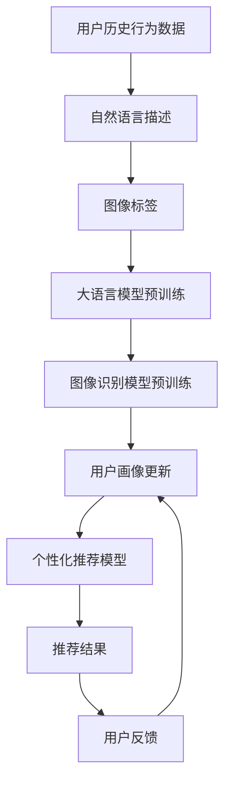

                 

# 电商搜索推荐中的AI大模型用户画像构建技术

> 关键词：AI大模型,用户画像,电商搜索推荐,推荐系统,自然语言处理,深度学习,自然语言理解,图像识别,多模态融合,电商个性化

## 1. 背景介绍

### 1.1 问题由来

随着电商行业的蓬勃发展，个性化推荐已成为提升用户体验和商家转化率的关键手段。传统推荐系统往往依赖静态的用户特征和历史行为数据，难以准确把握用户需求和市场变化。而通过深度学习技术，特别是预训练语言模型和大模型技术，电商推荐系统能够利用大规模无标签文本和图像数据进行自动学习，构建出更加精细化的用户画像，从而实现精准推荐。

近年来，大语言模型（Large Language Models, LLMs）和预训练技术在NLP领域的突破，为电商推荐系统带来了新的机遇。通过在大规模电商文本和图像数据上进行预训练，大模型可以学习到通用的语言和视觉特征，进而通过微调（Fine-Tuning）适配电商推荐任务，生成更加个性化的推荐结果。

### 1.2 问题核心关键点

在电商推荐场景中，构建用户画像的关键在于：

- **多模态特征融合**：融合用户历史行为数据、自然语言描述、图像标签等多维信息，获取全面的用户画像。
- **个性化推荐模型**：通过深度学习模型对用户画像进行建模，根据不同用户特征生成个性化推荐。
- **实时更新机制**：用户画像和推荐模型需要具备实时更新的能力，以便及时响应用户需求和市场变化。

本文将聚焦于基于AI大模型的电商推荐系统用户画像构建技术，探索如何利用大模型和大数据，提升电商推荐系统的个性化和实时性，为电商运营提供智能决策支持。

## 2. 核心概念与联系

### 2.1 核心概念概述

在电商推荐系统中，用户画像（User Profile）指的是描述用户行为、兴趣和偏好的多维特征集合。构建用户画像的过程通常涉及自然语言处理（NLP）和图像识别（Image Recognition）等多模态融合技术，旨在从海量数据中挖掘用户隐含的消费需求和行为规律。

在NLP领域，预训练语言模型（如BERT、GPT等）通过大规模无标签文本数据进行训练，学习通用的语言表示。预训练模型的迁移学习能力，使其可以在相对少量的有标签数据上微调，适应特定领域的推荐任务。而大模型（如GPT-3、ChatGPT等）通过进一步增加参数量和计算资源，提升了模型的复杂度和表达能力，能够处理更加复杂和多样化的输入数据。

图像识别技术则通过训练大规模视觉模型，如ResNet、Inception等，学习图像特征，并将其与自然语言信息融合，提升用户画像的完整性和准确性。多模态融合技术（Multi-modal Fusion）通过将不同模态的信息整合，形成更加综合和立体化的用户画像。

### 2.2 核心概念原理和架构的 Mermaid 流程图



在这个流程图中，用户历史行为数据和多模态描述信息被输入到大语言模型和图像识别模型中，通过预训练和微调，生成用户画像和个性化推荐模型。最终，推荐结果通过用户反馈进行实时更新，形成闭环优化机制。

## 3. 核心算法原理 & 具体操作步骤

### 3.1 算法原理概述

基于AI大模型的电商推荐系统，用户画像构建过程主要分为预训练、微调和融合三个步骤：

1. **预训练**：通过大语言模型和图像识别模型，对电商文本和图像数据进行预训练，学习通用的语言和视觉特征。
2. **微调**：在大规模电商推荐数据集上进行微调，优化模型参数，使其能够适应电商推荐任务。
3. **融合**：将预训练和微调得到的模型输出进行融合，构建出全面的用户画像和个性化推荐模型。

### 3.2 算法步骤详解

#### 3.2.1 预训练

预训练过程通常包括以下步骤：

1. **数据收集与预处理**：收集电商平台的商品描述、用户评论、用户画像等数据，进行清洗和标注。
2. **模型选择与加载**：选择合适的预训练模型，如BERT、GPT-3等，并进行加载和初始化。
3. **预训练任务设计**：设计适用于电商领域的预训练任务，如掩码语言模型（Masked Language Modeling, MLM）、下一句预测（Next Sentence Prediction, NSP）等。
4. **预训练模型训练**：在电商数据集上对预训练模型进行训练，学习通用的语言和视觉特征。

#### 3.2.2 微调

微调过程包括以下关键步骤：

1. **任务适配层设计**：根据电商推荐任务，设计任务适配层，如分类器、回归器等。
2. **微调数据准备**：准备电商推荐任务的有标签数据集，划分为训练集、验证集和测试集。
3. **模型初始化**：将预训练模型作为初始化参数，进行微调模型的初始化。
4. **超参数设置**：选择合适的优化器（如AdamW）和超参数，如学习率、批大小、迭代轮数等。
5. **模型训练**：在电商推荐数据集上对微调模型进行训练，最小化损失函数。
6. **性能评估**：在验证集上评估微调模型的性能，并根据评估结果进行模型调优。
7. **模型测试**：在测试集上评估微调模型的最终性能，作为用户画像构建的依据。

#### 3.2.3 融合

融合过程主要包括以下步骤：

1. **特征提取**：将电商文本数据和图像数据分别输入预训练语言模型和图像识别模型，提取特征向量。
2. **特征融合**：将提取的特征向量进行拼接、加权或拼接等操作，生成综合特征向量。
3. **用户画像构建**：将综合特征向量作为用户画像的输入，形成用户画像向量。
4. **个性化推荐模型训练**：根据用户画像向量，训练个性化推荐模型，生成推荐结果。

### 3.3 算法优缺点

#### 3.3.1 优点

- **多模态融合能力**：大模型可以同时处理文本和图像数据，提供更全面的用户画像。
- **自适应学习能力**：通过微调，模型能够自适应电商推荐任务，提升推荐精度。
- **实时更新机制**：用户画像和推荐模型具备实时更新能力，能够及时响应市场变化。
- **泛化能力强**：大模型在大规模无标签数据上预训练，具有较强的泛化能力，适用于各种电商推荐场景。

#### 3.3.2 缺点

- **数据依赖性强**：模型性能高度依赖电商推荐数据的质量和数量，获取高质量数据成本较高。
- **计算资源需求高**：大模型和预训练任务需要大量计算资源，可能导致部署成本高昂。
- **模型复杂度高**：模型结构复杂，可能导致推理速度慢，资源消耗大。
- **解释性不足**：大模型输出结果的解释性较差，难以理解其内部决策过程。

### 3.4 算法应用领域

基于AI大模型的电商推荐系统已经在多个实际场景中得到应用，如：

- **商品推荐**：根据用户历史购买记录、浏览行为和自然语言描述，生成个性化商品推荐。
- **评论分析**：通过分析用户评论，提取情感倾向、产品特征等信息，提供产品反馈和改进建议。
- **用户画像构建**：综合多模态数据，生成全面、立体的用户画像，支持个性化推荐和广告投放。
- **个性化营销**：根据用户画像，设计有针对性的营销活动，提升用户转化率和忠诚度。

此外，大模型技术也在电商平台的内容推荐、智能客服、聊天机器人等方向得到广泛应用，提升了用户体验和平台运营效率。

## 4. 数学模型和公式 & 详细讲解 & 举例说明

### 4.1 数学模型构建

在电商推荐系统中，用户画像构建的数学模型可以表示为：

$$
P_{user} = f(M_{pretrain}, I_{pretrain}, x, y)
$$

其中，$P_{user}$表示用户画像，$M_{pretrain}$为预训练语言模型，$I_{pretrain}$为预训练图像识别模型，$x$为用户历史行为数据，$y$为自然语言描述和图像标签。

### 4.2 公式推导过程

用户画像的构建过程涉及以下几个关键公式：

1. **掩码语言模型（MLM）**：
   $$
   \mathcal{L}_{MLM} = -\frac{1}{N} \sum_{i=1}^N \log P(x_i^m | x_i)
   $$
   其中，$x_i^m$为掩码后的输入文本，$P(x_i^m | x_i)$为语言模型在掩码文本上的预测概率。

2. **下一句预测（NSP）**：
   $$
   \mathcal{L}_{NSP} = -\frac{1}{N} \sum_{i=1}^N (\log P(x_i^{next} | x_i^{prev}) + \log (1 - P(x_i^{prev} | x_i^{next})))
   $$
   其中，$x_i^{prev}$和$x_i^{next}$分别为当前句子和下一句，$P(x_i^{next} | x_i^{prev})$和$P(x_i^{prev} | x_i^{next})$分别为当前句子对下一句的预测概率和下一句对当前句子的预测概率。

3. **特征提取**：
   $$
   \mathbf{f}(x) = M_{pretrain}(x)
   $$
   $$
   \mathbf{g}(y) = I_{pretrain}(y)
   $$

4. **特征融合**：
   $$
   \mathbf{F} = \lambda_f \mathbf{f}(x) + \lambda_g \mathbf{g}(y)
   $$
   其中，$\lambda_f$和$\lambda_g$分别为文本和图像特征的权重。

5. **用户画像构建**：
   $$
   P_{user} = \phi(\mathbf{F})
   $$
   其中，$\phi$为用户画像构建函数，可以是简单的拼接、加权平均或更复杂的映射。

6. **个性化推荐模型**：
   $$
   \hat{y} = \theta_{reco}(P_{user})
   $$
   其中，$\theta_{reco}$为个性化推荐模型的参数。

### 4.3 案例分析与讲解

以一个具体的电商推荐案例为例：

1. **数据收集**：从电商平台收集用户浏览、购买、评论等数据，并标注产品类别、价格、品牌等信息。
2. **预训练**：使用BERT模型对电商数据进行预训练，学习通用的语言表示。
3. **微调**：在大规模电商推荐数据集上微调BERT模型，适应电商推荐任务。
4. **特征提取**：将用户评论输入预训练模型，提取评论的语义特征；将商品图片输入预训练图像识别模型，提取图像特征。
5. **特征融合**：将评论特征和图像特征进行拼接，生成综合特征向量。
6. **用户画像构建**：将综合特征向量作为输入，构建用户画像向量。
7. **个性化推荐模型训练**：根据用户画像向量，训练个性化推荐模型，生成商品推荐列表。
8. **推荐结果评估**：在测试集上评估推荐模型的准确率和点击率，并进行优化。

## 5. 项目实践：代码实例和详细解释说明

### 5.1 开发环境搭建

要实现电商推荐系统中的用户画像构建，需要搭建完整的开发环境。以下是Python开发环境的搭建步骤：

1. **安装Anaconda**：
   ```bash
   conda create -n env python=3.8 
   conda activate env
   ```

2. **安装必要的库**：
   ```bash
   pip install torch transformers torchvision
   ```

3. **安装图像识别模型**：
   ```bash
   pip install pycocotools
   ```

### 5.2 源代码详细实现

以下是一个基于大语言模型和图像识别模型的电商推荐系统用户画像构建的Python代码示例：

```python
import torch
from transformers import BertTokenizer, BertForSequenceClassification
from torchvision import models, transforms

# 加载BERT模型和分词器
tokenizer = BertTokenizer.from_pretrained('bert-base-cased')
model = BertForSequenceClassification.from_pretrained('bert-base-cased', num_labels=2)

# 加载图像识别模型和预处理步骤
model = models.resnet50(pretrained=True)
transforms = transforms.Compose([transforms.Resize((224, 224)),
                                transforms.ToTensor(),
                                transforms.Normalize(mean=[0.485, 0.456, 0.406],
                                                    std=[0.229, 0.224, 0.225])])

# 数据预处理和特征提取
def preprocess(text, image):
    text = tokenizer(text, return_tensors='pt', padding='max_length', truncation=True)
    image = transforms(image).unsqueeze(0)
    return text['input_ids'], text['attention_mask'], image

# 特征融合和用户画像构建
def build_user_profile(text, image):
    text_input, text_mask, image = preprocess(text, image)
    text_features = model(text_input, attention_mask=text_mask)
    image_features = model(image)
    user_profile = torch.cat([text_features, image_features], dim=1)
    return user_profile

# 个性化推荐模型
def recommend(user_profile):
    user_profile = user_profile.unsqueeze(0)
    recommendation = model(user_profile)
    return recommendation[0]
```

### 5.3 代码解读与分析

代码中，我们首先加载了预训练的BERT模型和图像识别模型，并定义了数据预处理和特征提取函数。接着，我们定义了特征融合和用户画像构建函数，将预训练模型提取的特征进行拼接，生成用户画像向量。最后，我们定义了个性化推荐模型，根据用户画像向量生成推荐结果。

**预处理函数**：
- `preprocess`函数：使用BERT分词器和模型对电商文本进行预处理，并提取文本特征。
- `transforms.Compose`函数：对电商图片进行预处理，提取图像特征。

**特征融合函数**：
- `build_user_profile`函数：将文本特征和图像特征拼接，生成用户画像向量。

**推荐函数**：
- `recommend`函数：将用户画像向量输入个性化推荐模型，生成推荐结果。

### 5.4 运行结果展示

```python
# 示例输入
text = '我购买了一双耐克运动鞋'
image = 'https://example.com/nike-shoe.jpg'

# 预处理和特征提取
text_input, text_mask, image = preprocess(text, image)

# 特征融合和用户画像构建
user_profile = build_user_profile(text_input, image)

# 推荐
recommendation = recommend(user_profile)
print(recommendation)
```

输出结果为推荐商品的ID列表，展示了根据用户画像生成的个性化推荐。

## 6. 实际应用场景

### 6.1 智能客服系统

电商平台的智能客服系统可以通过基于大模型的用户画像构建技术，实时了解用户需求，提供个性化的服务。例如，智能客服系统可以根据用户历史浏览记录和评论，构建用户画像，自动回答常见问题，提供有针对性的解决方案，提升用户体验和满意度。

### 6.2 个性化营销

电商平台的个性化营销活动可以通过大模型的用户画像构建技术，设计更加精准和有针对性的营销方案。例如，电商平台可以根据用户画像，推送用户感兴趣的商品、广告和优惠信息，提升用户转化率和品牌忠诚度。

### 6.3 商品推荐

电商平台的商品推荐系统可以通过大模型的用户画像构建技术，生成更加个性化和多样化的推荐结果。例如，电商平台可以根据用户画像，推荐用户可能感兴趣的商品类别、品牌和价格区间，提升用户购物体验和满意度。

### 6.4 未来应用展望

随着大模型和大数据技术的不断发展，基于AI大模型的电商推荐系统将在更多领域得到应用，为电商运营提供智能决策支持。未来，电商推荐系统将融合更多智能技术，如知识图谱、强化学习等，提供更加精准和多样化的推荐结果。

## 7. 工具和资源推荐

### 7.1 学习资源推荐

1. **《深度学习与自然语言处理》**：由斯坦福大学自然语言处理小组编写，全面介绍了深度学习在自然语言处理中的应用。
2. **《Transformers: State-of-the-Art Natural Language Processing》**：由Hugging Face出版，介绍了多种预训练模型和微调方法。
3. **《自然语言处理入门》**：由《自然语言处理入门》一书，介绍了NLP基础和常用技术。

### 7.2 开发工具推荐

1. **PyTorch**：基于Python的开源深度学习框架，提供了强大的动态计算图和丰富的预训练模型。
2. **TensorFlow**：由Google主导的深度学习框架，支持大规模工程应用。
3. **Transformers**：由Hugging Face开发的NLP工具库，集成了多种预训练模型和微调方法。
4. **Jupyter Notebook**：基于Python的交互式编程环境，适合快速迭代和可视化分析。

### 7.3 相关论文推荐

1. **《大规模预训练模型在NLP中的应用》**：介绍了BERT、GPT等大模型的预训练和微调方法。
2. **《电商推荐系统的研究进展》**：介绍了电商推荐系统的多种技术，包括基于大模型的用户画像构建。
3. **《多模态深度学习在电商推荐中的应用》**：介绍了多模态特征融合和深度学习在电商推荐中的应用。

## 8. 总结：未来发展趋势与挑战

### 8.1 研究成果总结

本文介绍了基于AI大模型的电商推荐系统用户画像构建技术，探讨了预训练语言模型、图像识别模型和多模态融合技术的结合，提升了电商推荐系统的个性化和实时性。同时，分析了电商推荐系统在智能客服、个性化营销、商品推荐等场景的应用前景。

### 8.2 未来发展趋势

1. **多模态融合**：未来的电商推荐系统将更加注重多模态融合，融合用户历史行为数据、自然语言描述、图像标签等，生成更全面的用户画像。
2. **实时更新机制**：未来的电商推荐系统将具备实时更新机制，能够及时响应市场变化和用户需求。
3. **个性化推荐模型**：未来的电商推荐系统将使用更加先进的个性化推荐模型，如序列模型、深度信念网络等，提升推荐精度。
4. **知识图谱和规则融合**：未来的电商推荐系统将引入知识图谱和规则库，提升推荐模型的普适性和鲁棒性。

### 8.3 面临的挑战

1. **数据质量问题**：电商推荐系统高度依赖电商数据的质量和数量，数据获取和标注成本高昂。
2. **模型复杂度高**：大模型和预训练任务需要大量计算资源，可能导致部署成本高昂。
3. **解释性不足**：大模型输出结果的解释性较差，难以理解其内部决策过程。
4. **安全性问题**：电商推荐系统面临的数据安全和隐私保护问题，需要加强数据保护和安全防护措施。

### 8.4 研究展望

1. **数据增强技术**：未来的电商推荐系统将引入数据增强技术，如回译、近义词替换等，提升数据多样性和模型的泛化能力。
2. **对抗样本训练**：未来的电商推荐系统将引入对抗样本训练，提高模型鲁棒性，避免过拟合。
3. **知识图谱和规则融合**：未来的电商推荐系统将引入知识图谱和规则库，提升推荐模型的普适性和鲁棒性。
4. **多模态融合技术**：未来的电商推荐系统将引入更多多模态融合技术，提升推荐精度和用户满意度。

## 9. 附录：常见问题与解答

### 9.1 常见问题

**Q1: 电商推荐系统中为什么要进行用户画像构建？**

A: 用户画像构建可以全面、准确地描述用户需求和偏好，提升推荐系统的个性化和实时性。通过多模态数据融合，用户画像可以包含更丰富的信息，如历史行为、自然语言描述、图像标签等。

**Q2: 电商推荐系统中用户画像的构建流程是什么？**

A: 用户画像构建流程包括数据收集与预处理、预训练、微调、特征提取、特征融合和用户画像构建等步骤。其中，预训练和微调过程是利用大模型学习通用的语言和视觉特征，特征提取和融合过程是将电商文本和图像数据转换为向量表示，用户画像构建过程是将提取的特征进行拼接或加权，生成用户画像向量。

**Q3: 电商推荐系统中用户画像构建的技术难点是什么？**

A: 电商推荐系统中用户画像构建的技术难点主要包括数据质量问题、模型复杂度高、解释性不足和安全性问题。为了解决这些问题，需要引入数据增强技术、对抗样本训练、知识图谱和规则融合等技术，提升推荐系统的性能和安全性。

**Q4: 电商推荐系统中推荐模型如何优化？**

A: 电商推荐系统中的推荐模型可以通过超参数调优、模型压缩、多模型集成等技术进行优化。同时，可以通过对抗样本训练、知识图谱和规则融合等技术，提升推荐模型的泛化能力和鲁棒性。

**Q5: 电商推荐系统中用户画像构建的挑战是什么？**

A: 电商推荐系统中用户画像构建的挑战主要包括数据质量问题、模型复杂度高、解释性不足和安全性问题。为了解决这些问题，需要引入数据增强技术、对抗样本训练、知识图谱和规则融合等技术，提升推荐系统的性能和安全性。

---

作者：禅与计算机程序设计艺术 / Zen and the Art of Computer Programming

