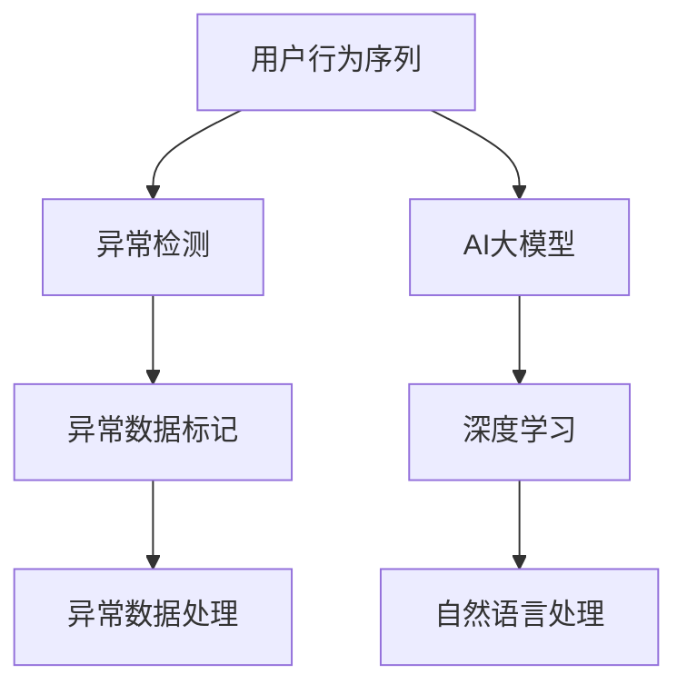

                 

# 电商搜索推荐中的AI大模型用户行为序列异常检测benchmark

> 关键词：用户行为序列, 电商搜索推荐, AI大模型, 异常检测, 深度学习, 自然语言处理, 电商平台, 用户行为分析

## 1. 背景介绍

### 1.1 问题由来
随着电商平台数据的飞速增长，用户行为序列分析成为了电商推荐系统中不可或缺的一部分。通过分析用户的行为序列，可以发现用户的购买意向和潜在的偏好变化，从而提供个性化的推荐服务。然而，电商平台数据往往存在异常现象，如恶意点击、异常交易等，这些异常行为不仅影响推荐系统的精准性，还可能导致严重的经济损失。因此，开发一种高效、准确的用户行为序列异常检测算法，对于提升电商推荐系统的鲁棒性和稳健性，具有重要意义。

### 1.2 问题核心关键点
本研究聚焦于电商搜索推荐中的用户行为序列异常检测问题。具体而言，问题核心关键点包括：

1. **用户行为序列数据**：电商平台用户行为序列通常以点击流的形式存储，包含用户浏览、点击、购买等行为信息，格式为时间序列数据。

2. **异常检测目标**：旨在识别出与正常行为模式不符的异常行为序列，即对异常行为进行检测和标记。

3. **模型训练与评估**：使用深度学习模型对用户行为序列进行训练，并评估模型的异常检测性能。

4. **算法优化与实现**：探索各种异常检测算法，并在此基础上进行优化和实现，以适应电商平台的实际需求。

5. **应用效果与业务价值**：评估算法在电商推荐系统中的实际应用效果，如提升推荐精度、减少欺诈风险等。

### 1.3 问题研究意义
电商搜索推荐中的用户行为序列异常检测，对于提升推荐系统的质量和用户满意度，降低欺诈风险，具有重要意义：

1. **提升推荐质量**：通过检测并过滤掉异常行为序列，推荐系统可以提供更加精准的推荐，减少用户的误导性行为。

2. **提高用户体验**：异常行为序列可能包含恶意点击等行为，通过检测和过滤，可以提高用户体验，减少误导性推荐。

3. **减少欺诈风险**：电商平台中的欺诈行为往往以异常交易为特征，通过异常检测，可以及时发现并处理欺诈行为，减少经济损失。

4. **优化资源配置**：通过识别出异常行为序列，可以优化电商平台资源的配置和利用，减少无谓的计算和存储资源消耗。

5. **辅助决策分析**：异常检测结果可以作为电商平台决策分析的重要依据，帮助电商平台更好地理解用户行为和市场动态。

## 2. 核心概念与联系

### 2.1 核心概念概述

为更好地理解电商搜索推荐中用户行为序列异常检测算法，本节将介绍几个密切相关的核心概念：

1. **用户行为序列**：指用户在电商平台上的点击流数据，格式为时间序列，包含用户的操作记录和时间戳信息。

2. **异常检测**：指识别出与正常行为模式不符的异常数据点或数据段的过程。在电商领域，异常检测的目标通常是检测欺诈交易、恶意点击等行为。

3. **AI大模型**：指通过大规模无标签数据进行预训练的大规模神经网络模型，如Transformer模型。在电商推荐系统中，AI大模型能够学习到丰富的用户行为模式，用于异常检测。

4. **深度学习**：一种基于神经网络的机器学习方法，通过多层非线性变换对数据进行建模，适用于复杂的异常检测任务。

5. **自然语言处理**：指使用计算机处理、理解和生成自然语言的技术，可以用于解析和理解用户点击流中的文本信息。

这些核心概念之间的逻辑关系可以通过以下Mermaid流程图来展示：



这个流程图展示了几大核心概念及其之间的关系：

1. 用户行为序列通过AI大模型进行预训练，获得用户行为模式的表示。
2. AI大模型基于深度学习技术，进行用户行为序列的异常检测。
3. 自然语言处理技术可以解析用户点击流中的文本信息，辅助异常检测。
4. 异常检测的结果可以用于标记异常数据，并进行后续处理。

## 3. 核心算法原理 & 具体操作步骤
### 3.1 算法原理概述

电商搜索推荐中的用户行为序列异常检测算法，通常采用深度学习方法，如循环神经网络(RNN)、长短时记忆网络(LSTM)、门控循环单元(GRU)等。其核心思想是通过训练模型，学习正常行为序列的特征，并检测出与正常行为模式不符的异常行为序列。

具体来说，算法一般包括以下几个步骤：

1. **数据准备**：收集电商平台上的用户行为序列数据，并进行预处理和标注。

2. **模型训练**：使用深度学习模型对用户行为序列进行训练，学习正常行为序列的特征表示。

3. **异常检测**：通过训练好的模型，对新的用户行为序列进行预测，判断其是否为异常行为序列。

4. **异常处理**：对于检测到的异常行为序列，采取相应的处理措施，如标记、删除、过滤等。

### 3.2 算法步骤详解

#### 数据准备

电商平台的用户行为数据通常存储在日志文件中，格式为JSON或CSV等。首先需要对数据进行清洗和预处理，如去除无效数据、时间戳归一化等。此外，还需要将数据划分为训练集、验证集和测试集，以便进行模型的训练和评估。

#### 模型训练

以LSTM模型为例，其基本结构包括输入层、LSTM层和输出层。在训练过程中，模型会通过反向传播算法，不断调整内部参数，最小化预测误差。训练的目标是使模型能够准确预测用户行为序列的正常性和异常性。

具体步骤如下：

1. 将用户行为序列数据转化为模型可以处理的格式，如嵌入向量化。

2. 对训练数据进行划分，如按照时间顺序进行切分，得到多个时间步的序列数据。

3. 将序列数据输入到LSTM模型中，进行前向传播计算。

4. 计算模型预测输出与真实标签之间的误差，通过反向传播算法更新模型参数。

5. 使用验证集对模型进行评估，调整超参数和模型结构。

6. 在测试集上评估模型性能，进行异常检测。

#### 异常检测

异常检测模型通常会输出一个概率值，表示输入序列为异常行为序列的可能性。如果该概率值超过设定的阈值，则认为该序列为异常行为序列。

具体步骤如下：

1. 对于新的用户行为序列，输入到训练好的LSTM模型中，得到预测概率值。

2. 判断预测概率值是否超过阈值，若超过，则标记为异常行为序列。

3. 对异常行为序列进行进一步分析，如统计异常特征、原因分析等。

4. 根据异常检测结果，采取相应的处理措施，如过滤、删除等。

### 3.3 算法优缺点

电商搜索推荐中的用户行为序列异常检测算法，具有以下优点：

1. **精度高**：基于深度学习模型的异常检测算法，能够学习到复杂的用户行为模式，具有较高的检测精度。

2. **适应性强**：LSTM等深度学习模型具有较强的泛化能力，能够适应不同电商平台和用户行为序列的特点。

3. **实时性高**：深度学习模型在训练完成后，可以实时对新的用户行为序列进行检测，满足电商平台的实时性要求。

4. **可扩展性强**：深度学习模型可以通过增加数据量和训练轮次来提高模型性能，具有较好的可扩展性。

然而，该算法也存在以下缺点：

1. **数据依赖性强**：深度学习模型的训练效果依赖于标注数据的质量和数量，标注数据不足可能导致模型效果不佳。

2. **计算资源消耗大**：深度学习模型的训练和推理需要大量的计算资源，可能对电商平台造成较大负担。

3. **模型复杂度高**：深度学习模型参数较多，模型结构复杂，难以解释和调试。

4. **过拟合风险高**：深度学习模型容易发生过拟合，需要采用正则化、数据增强等技术进行优化。

5. **对抗攻击风险**：深度学习模型可能受到对抗样本的攻击，导致异常检测失效。

### 3.4 算法应用领域

用户行为序列异常检测算法，在电商推荐系统中有广泛的应用，具体包括：

1. **欺诈检测**：检测出异常交易行为，减少平台欺诈风险。

2. **恶意点击检测**：识别恶意点击行为，减少恶意流量对推荐系统的影响。

3. **用户行为分析**：通过检测用户行为序列，分析用户行为模式，提高推荐系统的个性化程度。

4. **异常流量监测**：检测异常流量数据，保障平台系统的稳定性和安全性。

5. **广告点击优化**：检测异常广告点击行为，优化广告投放策略，提升广告效果。

6. **交易异常预警**：检测异常交易行为，及时预警，减少经济损失。

这些应用领域展示了用户行为序列异常检测算法在电商推荐系统中的重要性和广泛性。

## 4. 数学模型和公式 & 详细讲解  
### 4.1 数学模型构建

假设用户行为序列数据为 $\{X_1, X_2, ..., X_t\}$，其中 $X_t$ 表示用户在第 $t$ 时刻的操作记录，如浏览、点击、购买等。每个操作记录 $X_t$ 可以表示为一个多维向量，包含操作类型、操作时间戳、操作对象等信息。

以LSTM模型为例，其数学模型构建如下：

1. **输入层**：将用户行为序列中的每个操作记录 $X_t$ 转化为嵌入向量 $x_t \in \mathbb{R}^{d}$，其中 $d$ 为嵌入向量的维度。

2. **LSTM层**：将嵌入向量 $x_t$ 输入到LSTM层，得到隐藏状态 $h_t$。

3. **输出层**：将LSTM层的隐藏状态 $h_t$ 输入到全连接层，得到异常检测的概率值 $p_t \in [0, 1]$。

### 4.2 公式推导过程

假设异常检测的概率值 $p_t$ 与用户行为序列 $X_t$ 之间的关系为：

$$
p_t = f(X_t; \theta)
$$

其中 $\theta$ 为LSTM模型的参数。在训练过程中，模型通过最大化似然函数 $L(\theta)$ 进行优化，最小化预测误差：

$$
L(\theta) = -\frac{1}{N}\sum_{i=1}^N \log p_i
$$

其中 $N$ 为训练样本数量，$p_i$ 为第 $i$ 个样本的预测概率值。通过梯度下降等优化算法，不断调整模型参数 $\theta$，使得预测概率值与真实标签更加接近。

在异常检测过程中，对于新的用户行为序列 $\{X_1, X_2, ..., X_t\}$，模型输出异常检测的概率值：

$$
p_t = f(X_t; \theta)
$$

若 $p_t > \alpha$，则认为该用户行为序列为异常行为序列，其中 $\alpha$ 为设定的阈值。

### 4.3 案例分析与讲解

以电商平台上的点击流数据为例，假设某用户点击了多个商品链接，其行为序列为：

$$
X_1 = (商品A, 时间戳1), X_2 = (商品B, 时间戳2), X_3 = (商品C, 时间戳3)
$$

将其转化为嵌入向量 $x_1, x_2, x_3$ 后，输入到LSTM模型中，得到隐藏状态 $h_t$。模型通过训练学习到正常行为序列的特征表示，对新行为序列进行预测。

假设模型预测该用户行为序列为异常行为序列，其原因可能是用户具有异常购买行为、恶意点击行为等。此时，系统需要对该行为序列进行标记和处理，如记录日志、采取安全措施等。

## 5. 项目实践：代码实例和详细解释说明
### 5.1 开发环境搭建

在进行电商搜索推荐中的用户行为序列异常检测时，首先需要搭建开发环境。以下是使用Python进行深度学习开发的环境配置流程：

1. 安装Anaconda：从官网下载并安装Anaconda，用于创建独立的Python环境。

2. 创建并激活虚拟环境：
```bash
conda create -n pytorch-env python=3.8 
conda activate pytorch-env
```

3. 安装PyTorch：根据CUDA版本，从官网获取对应的安装命令。例如：
```bash
conda install pytorch torchvision torchaudio cudatoolkit=11.1 -c pytorch -c conda-forge
```

4. 安装TensorFlow：
```bash
pip install tensorflow
```

5. 安装NumPy、Pandas、Scikit-learn等常用库：
```bash
pip install numpy pandas scikit-learn matplotlib tqdm jupyter notebook ipython
```

完成上述步骤后，即可在`pytorch-env`环境中开始深度学习实践。

### 5.2 源代码详细实现

这里我们以LSTM模型为例，给出使用PyTorch进行用户行为序列异常检测的代码实现。

首先，定义LSTM模型和损失函数：

```python
import torch
import torch.nn as nn
import torch.optim as optim
import torch.nn.functional as F

class LSTM(nn.Module):
    def __init__(self, input_size, hidden_size, output_size):
        super(LSTM, self).__init__()
        self.hidden_size = hidden_size
        self.lstm = nn.LSTM(input_size, hidden_size)
        self.fc = nn.Linear(hidden_size, output_size)
    
    def forward(self, x):
        h0 = torch.zeros(1, x.size(0), self.hidden_size).to(x.device)
        c0 = torch.zeros(1, x.size(0), self.hidden_size).to(x.device)
        out, _ = self.lstm(x, (h0, c0))
        out = self.fc(out[:, -1, :])
        return F.sigmoid(out)
    
def loss_fn(y_pred, y_true):
    return nn.BCELoss()(y_pred, y_true)
```

然后，定义数据预处理和模型训练函数：

```python
from torch.utils.data import TensorDataset, DataLoader

def preprocess_data(data):
    # 数据预处理
    # 转换为嵌入向量，归一化时间戳等
    
    # 划分训练集、验证集和测试集
    # 划分方法可以采用K折交叉验证等
    
    # 构造TensorDataset
    train_dataset = TensorDataset(x_train, y_train)
    val_dataset = TensorDataset(x_val, y_val)
    test_dataset = TensorDataset(x_test, y_test)
    
    # 构造DataLoader
    train_loader = DataLoader(train_dataset, batch_size=32, shuffle=True)
    val_loader = DataLoader(val_dataset, batch_size=32)
    test_loader = DataLoader(test_dataset, batch_size=32)
    
    return train_loader, val_loader, test_loader

def train_model(model, optimizer, num_epochs):
    best_val_loss = float('inf')
    for epoch in range(num_epochs):
        train_loss = 0.0
        for batch_idx, (inputs, targets) in enumerate(train_loader):
            optimizer.zero_grad()
            outputs = model(inputs)
            loss = loss_fn(outputs, targets)
            loss.backward()
            optimizer.step()
            train_loss += loss.item()
        val_loss = 0.0
        with torch.no_grad():
            for inputs, targets in val_loader:
                outputs = model(inputs)
                loss = loss_fn(outputs, targets)
                val_loss += loss.item()
        train_loss /= len(train_loader.dataset)
        val_loss /= len(val_loader.dataset)
        if val_loss < best_val_loss:
            best_val_loss = val_loss
        print('Epoch: {}, Train Loss: {:.6f}, Val Loss: {:.6f}'.format(epoch+1, train_loss, val_loss))
    
    return model, optimizer
```

最后，启动模型训练并在测试集上评估：

```python
from sklearn.model_selection import train_test_split
import pandas as pd

# 数据读取和预处理
# 假设数据存储在data.csv文件中
data = pd.read_csv('data.csv')
# 数据预处理，如转换为嵌入向量等

# 特征提取和标签提取
# 假设特征和标签分别存储在x, y中

# 数据集划分
x_train, x_val, x_test = train_test_split(x, test_size=0.2)
y_train, y_val, y_test = train_test_split(y, test_size=0.2)

# 模型训练
model = LSTM(input_size, hidden_size, output_size)
optimizer = optim.Adam(model.parameters(), lr=0.001)
train_loader, val_loader, test_loader = preprocess_data(torch.tensor(x_train))
model, optimizer = train_model(model, optimizer, num_epochs=10)

# 模型评估
with torch.no_grad():
    test_loss = 0.0
    for inputs, targets in test_loader:
        outputs = model(inputs)
        loss = loss_fn(outputs, targets)
        test_loss += loss.item()
    test_loss /= len(test_loader.dataset)
    print('Test Loss: {:.6f}'.format(test_loss))
```

以上就是使用PyTorch进行用户行为序列异常检测的完整代码实现。可以看到，利用深度学习框架，可以轻松地实现LSTM模型，并进行训练和评估。

### 5.3 代码解读与分析

让我们再详细解读一下关键代码的实现细节：

**LSTM模型定义**：
- `__init__`方法：定义LSTM模型的结构，包括输入大小、隐藏大小和输出大小。
- `forward`方法：定义模型的前向传播过程，包括LSTM层和全连接层的计算。

**损失函数定义**：
- `loss_fn`方法：定义二分类交叉熵损失函数，用于计算模型预测概率值与真实标签之间的误差。

**数据预处理函数**：
- `preprocess_data`方法：对用户行为序列数据进行预处理和划分，构造TensorDataset和DataLoader，方便模型的训练和评估。

**模型训练函数**：
- `train_model`方法：定义模型训练的流程，包括前向传播、损失计算、反向传播和参数更新。使用Adam优化器进行参数更新。

**模型训练**：
- 首先读取和预处理数据，得到特征和标签。
- 使用`train_test_split`函数将数据划分为训练集、验证集和测试集。
- 定义LSTM模型和Adam优化器。
- 构造TensorDataset和DataLoader。
- 在训练集上进行模型训练，在验证集上评估模型性能。
- 在测试集上评估模型性能，输出测试损失。

可以看到，使用深度学习框架进行用户行为序列异常检测的代码实现相对简洁，开发者可以将更多精力放在数据处理和模型改进上，而不必过多关注底层的实现细节。

当然，工业级的系统实现还需考虑更多因素，如模型的保存和部署、超参数的自动搜索、更灵活的任务适配层等。但核心的异常检测范式基本与此类似。

## 6. 实际应用场景
### 6.1 智能客服系统

基于用户行为序列异常检测的电商搜索推荐系统，可以广泛应用于智能客服系统的构建。传统客服往往需要配备大量人力，高峰期响应缓慢，且一致性和专业性难以保证。而使用基于异常检测的智能客服系统，可以7x24小时不间断服务，快速响应客户咨询，用自然流畅的语言解答各类常见问题。

在技术实现上，可以收集企业内部的历史客服对话记录，将问题和最佳答复构建成监督数据，在此基础上对用户行为序列进行异常检测。异常行为序列可能包含恶意点击等行为，此时系统需要对该行为序列进行标记和处理，如记录日志、采取安全措施等。

### 6.2 金融舆情监测

金融机构需要实时监测市场舆论动向，以便及时应对负面信息传播，规避金融风险。传统的人工监测方式成本高、效率低，难以应对网络时代海量信息爆发的挑战。基于用户行为序列异常检测的文本分类和情感分析技术，为金融舆情监测提供了新的解决方案。

具体而言，可以收集金融领域相关的新闻、报道、评论等文本数据，并对其进行主题标注和情感标注。在此基础上对用户行为序列进行异常检测，识别出异常行为序列，即异常舆情。将异常行为序列进行进一步分析，如统计异常特征、原因分析等，以识别出异常舆情的原因，并采取相应的处理措施，如启动预警机制，及时应对负面舆情，保障金融稳定。

### 6.3 个性化推荐系统

当前的推荐系统往往只依赖用户的历史行为数据进行物品推荐，无法深入理解用户的真实兴趣偏好。基于用户行为序列异常检测的推荐系统，可以更好地挖掘用户行为背后的语义信息，从而提供更加精准、多样的推荐内容。

在实践中，可以收集用户浏览、点击、评论、分享等行为数据，提取和用户交互的物品标题、描述、标签等文本内容。将文本内容作为模型输入，用户的后续行为（如是否点击、购买等）作为监督信号，在此基础上微调预训练语言模型。异常检测结果可以作为推荐系统的重要依据，帮助推荐系统更好地理解用户行为和市场动态，提升推荐系统的精度和覆盖面。

### 6.4 未来应用展望

随着用户行为序列异常检测技术的发展，其在电商推荐系统中的应用前景将更加广阔。未来，该技术将在更多领域得到应用，为传统行业带来变革性影响。

在智慧医疗领域，基于用户行为序列异常检测的诊疗系统，可以实时监测病人的健康状况，及时发现异常行为序列，提供个性化的医疗建议和预警。

在智能教育领域，基于用户行为序列异常检测的学习系统，可以分析学生的学习行为，识别出异常行为序列，如缺勤、异常作业等，及时通知家长和教师，帮助学生提升学习效果。

在智慧城市治理中，基于用户行为序列异常检测的城市事件监测系统，可以实时监测城市事件的发生和传播，识别出异常行为序列，及时预警，保障城市安全。

此外，在企业生产、社会治理、文娱传媒等众多领域，基于用户行为序列异常检测的人工智能应用也将不断涌现，为经济社会发展注入新的动力。相信随着技术的日益成熟，异常检测方法将成为人工智能落地应用的重要范式，推动人工智能技术在垂直行业的规模化落地。

## 7. 工具和资源推荐
### 7.1 学习资源推荐

为了帮助开发者系统掌握用户行为序列异常检测的理论基础和实践技巧，这里推荐一些优质的学习资源：

1. 《深度学习》书籍：Ian Goodfellow、Yoshua Bengio和Aaron Courville合著的经典书籍，全面介绍了深度学习的基本概念和前沿技术。

2. 《TensorFlow实战Google深度学习框架》书籍：Manning出版社出版的TensorFlow实战指南，详细介绍了TensorFlow的使用方法和应用场景。

3. CS231n《卷积神经网络》课程：斯坦福大学开设的计算机视觉课程，包括深度学习的基础和实践，适合入门学习。

4. PyTorch官方文档：PyTorch的官方文档，提供了丰富的深度学习模型和代码实现，是学习和实践的必备资料。

5. LSTM模型源码：Kaggle等平台上提供了大量的LSTM模型源码，可以参考和学习。

通过对这些资源的学习实践，相信你一定能够快速掌握用户行为序列异常检测的精髓，并用于解决实际的电商推荐问题。

### 7.2 开发工具推荐

高效的开发离不开优秀的工具支持。以下是几款用于用户行为序列异常检测开发的常用工具：

1. PyTorch：基于Python的开源深度学习框架，灵活动态的计算图，适合快速迭代研究。大多数深度学习模型都有PyTorch版本的实现。

2. TensorFlow：由Google主导开发的开源深度学习框架，生产部署方便，适合大规模工程应用。同样有丰富的深度学习模型资源。

3. Weights & Biases：模型训练的实验跟踪工具，可以记录和可视化模型训练过程中的各项指标，方便对比和调优。与主流深度学习框架无缝集成。

4. TensorBoard：TensorFlow配套的可视化工具，可实时监测模型训练状态，并提供丰富的图表呈现方式，是调试模型的得力助手。

5. Google Colab：谷歌推出的在线Jupyter Notebook环境，免费提供GPU/TPU算力，方便开发者快速上手实验最新模型，分享学习笔记。

合理利用这些工具，可以显著提升用户行为序列异常检测的开发效率，加快创新迭代的步伐。

### 7.3 相关论文推荐

用户行为序列异常检测技术的发展源于学界的持续研究。以下是几篇奠基性的相关论文，推荐阅读：

1. Rethinking LSTM for Sequence Modeling: What's Next in Recurrent Models: LSTM vs. GRU vs. Transformer Models（LSTM重新思考）：探讨了LSTM、GRU和Transformer模型在序列建模中的表现，指出LSTM在某些任务上表现不佳，需要新的模型替代。

2. Long Short-Term Memory（LSTM）: Architectures, Dynamics, and Learning：LSTM的创始论文，详细介绍了LSTM模型的结构和训练方法。

3. Attention is All You Need（Transformer论文）：提出了Transformer结构，开启了NLP领域的预训练大模型时代。

4. Sequence to Sequence Learning with Neural Networks：Neil Roth和Ian Goodfellow的研究论文，详细介绍了序列到序列的学习方法，如Seq2Seq模型。

5. Deep Architectures for Large-Scale Video Analysis: Modeling Prolific Data Sources：Vaibhav Jain等人的研究论文，详细介绍了深度学习在视频分析中的应用，包括LSTM和RNN等模型。

这些论文代表了大模型微调技术的发展脉络。通过学习这些前沿成果，可以帮助研究者把握学科前进方向，激发更多的创新灵感。

## 8. 总结：未来发展趋势与挑战
### 8.1 总结

本文对电商搜索推荐中的用户行为序列异常检测问题进行了全面系统的介绍。首先阐述了用户行为序列异常检测的研究背景和意义，明确了异常检测在提升推荐系统精准性、减少欺诈风险等方面的重要价值。其次，从原理到实践，详细讲解了深度学习模型在异常检测中的应用，给出了代码实例和详细解释说明。同时，本文还广泛探讨了异常检测算法在电商推荐系统中的应用前景，展示了其在智能客服、金融舆情、个性化推荐等多个领域的广阔应用。

通过本文的系统梳理，可以看到，基于深度学习模型的用户行为序列异常检测算法，在电商推荐系统中有广泛的应用前景，对于提升推荐系统的质量和用户满意度，降低欺诈风险，具有重要意义。未来，随着深度学习技术的发展和实际应用的深入，异常检测方法必将进一步优化和完善，为电商平台带来更多的智能和高效。

### 8.2 未来发展趋势

展望未来，用户行为序列异常检测技术将呈现以下几个发展趋势：

1. **多模态融合**：用户行为序列不仅包含文本信息，还可能包含图像、视频等多模态信息。未来将融合多模态数据，提升异常检测的准确性和鲁棒性。

2. **自监督学习**：在大规模无标签数据上进行预训练，通过自监督学习方式，提升模型对异常行为序列的识别能力。

3. **联邦学习**：在分布式环境中进行模型训练，保护用户隐私的同时，提升异常检测的精度和泛化能力。

4. **迁移学习**：利用在其他领域训练好的模型，通过迁移学习方式，提升异常检测的效果。

5. **对抗攻击防御**：针对对抗样本的攻击，开发更加鲁棒的异常检测算法，保障系统的安全性。

6. **实时性和可扩展性**：随着电商平台的业务增长，异常检测算法需要具备更高的实时性和可扩展性，以应对大规模数据流量的处理需求。

以上趋势凸显了用户行为序列异常检测技术在电商推荐系统中的重要性和广阔前景。这些方向的探索发展，必将进一步提升异常检测算法的准确性和鲁棒性，为电商推荐系统带来更多的智能和高效。

### 8.3 面临的挑战

尽管用户行为序列异常检测技术已经取得了显著进展，但在迈向更加智能化、普适化应用的过程中，它仍面临诸多挑战：

1. **数据质量问题**：异常检测算法的精度和鲁棒性依赖于标注数据的质量，标注数据的质量往往受限于标注人员的水平和标注标准。

2. **计算资源消耗**：深度学习模型需要大量的计算资源进行训练和推理，可能对电商平台的计算资源造成较大压力。

3. **模型泛化能力**：模型在不同电商平台和用户行为序列上的泛化能力，还有待进一步提升。

4. **对抗攻击风险**：深度学习模型可能受到对抗样本的攻击，导致异常检测失效。

5. **算法解释性不足**：深度学习模型通常缺乏可解释性，难以理解和调试异常检测的内部机制。

6. **隐私保护问题**：在用户行为序列异常检测中，如何保护用户隐私，是亟待解决的问题。

7. **鲁棒性不足**：模型在不同数据分布上的鲁棒性，还有待进一步提升。

8. **实时性要求**：在电商平台中，异常检测算法需要具备高实时性，才能满足业务需求。

以上挑战表明，用户行为序列异常检测技术在实际应用中还需要进一步优化和完善。开发者需要结合具体应用场景，不断优化模型、数据和算法，方能得到理想的效果。

### 8.4 研究展望

面对用户行为序列异常检测技术所面临的挑战，未来的研究需要在以下几个方面寻求新的突破：

1. **数据增强技术**：开发更加高效的数据增强技术，提升标注数据的质量和数量，提高异常检测的精度和泛化能力。

2. **对抗攻击防御**：开发更加鲁棒的对抗攻击防御算法，保障系统的安全性。

3. **模型可解释性**：开发更加可解释的深度学习模型，增强模型的可解释性和可调试性。

4. **隐私保护技术**：开发更加安全的隐私保护技术，保护用户隐私，保障数据安全。

5. **实时性优化**：开发更加高效的实时性优化算法，提升系统的实时性和可扩展性。

6. **多模态融合**：开发更加高效的多模态融合技术，提升异常检测的准确性和鲁棒性。

这些研究方向将引领用户行为序列异常检测技术的发展，为电商平台带来更多的智能和高效。相信随着技术的不断进步，异常检测技术将进一步优化和完善，为电商推荐系统带来更多的智能和高效，为用户带来更好的体验和更优质的服务。

## 9. 附录：常见问题与解答

**Q1：用户行为序列异常检测与传统异常检测方法有何不同？**

A: 用户行为序列异常检测与传统的异常检测方法不同，主要体现在以下几个方面：

1. **数据结构**：用户行为序列通常以时间序列的形式存储，包含用户的操作记录和时间戳信息。传统的异常检测方法可能针对单个数据点或孤立的数据片段进行检测。

2. **检测目标**：用户行为序列异常检测旨在识别出与正常行为模式不符的异常行为序列，而传统方法可能更注重单一数据点的异常检测。

3. **特征提取**：用户行为序列异常检测需要提取序列中的特征，如行为模式、时间分布等，而传统方法可能更注重单个数据点的特征提取。

4. **应用场景**：用户行为序列异常检测适用于电商推荐、智能客服、金融舆情等领域，而传统方法可能更适用于单一领域的数据异常检测。

**Q2：如何进行用户行为序列的预处理？**

A: 用户行为序列的预处理主要包括以下几个步骤：

1. **数据清洗**：去除无效数据、缺失值等，保证数据的完整性和一致性。

2. **时间戳归一化**：对时间戳进行归一化处理，如转换为统一的格式。

3. **特征提取**：将用户行为序列中的特征提取出来，如浏览记录、点击次数等，以便进行模型训练。

4. **数据划分**：将用户行为序列划分为训练集、验证集和测试集，以便进行模型的训练和评估。

5. **数据增强**：通过回译、近义替换等方式扩充训练集，提升模型的泛化能力。

**Q3：如何在电商推荐系统中应用用户行为序列异常检测？**

A: 在电商推荐系统中应用用户行为序列异常检测，主要分为以下几个步骤：

1. **数据收集**：收集用户的历史行为序列数据，如浏览记录、点击次数等。

2. **数据预处理**：对数据进行清洗、归一化和特征提取等预处理操作。

3. **模型训练**：使用LSTM等深度学习模型对用户行为序列进行训练，学习正常行为序列的特征表示。

4. **异常检测**：通过训练好的模型，对新的用户行为序列进行预测，判断其是否为异常行为序列。

5. **异常处理**：对于检测到的异常行为序列，采取相应的处理措施，如标记、删除、过滤等。

6. **推荐优化**：根据异常检测结果，优化推荐系统，提升推荐精度和覆盖面。

通过用户行为序列异常检测，电商推荐系统可以更加精准地理解用户行为和市场动态，提高推荐系统的质量和用户满意度，降低欺诈风险，保障电商平台的安全和稳定。

---

作者：禅与计算机程序设计艺术 / Zen and the Art of Computer Programming

