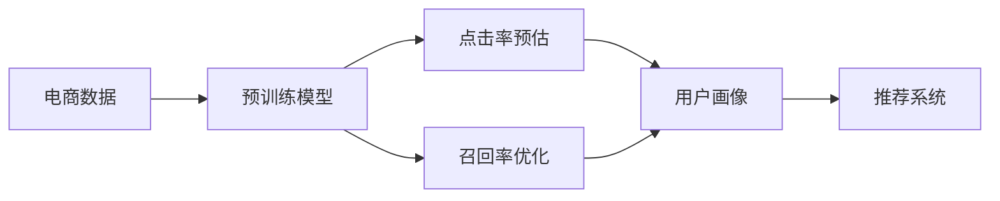

                 

# 电商搜索推荐场景下的AI大模型模型优化实践

> 关键词：电商搜索推荐,大模型优化,点击率预估,召回率优化,模型融合,深度学习,自然语言处理,NLP,机器学习,推荐系统

## 1. 背景介绍

随着电子商务的蓬勃发展，用户对个性化推荐的需求日益增长。为了提升用户体验和平台转化率，各大电商平台纷纷引入先进的人工智能技术，通过大模型进行深度学习，优化推荐效果。然而，大模型在电商搜索推荐场景下的应用，面临着数据稀疏性、用户行为多变性等诸多挑战。本文将深入探讨AI大模型在电商搜索推荐中的应用，提出一系列针对性的优化方法，力求通过参数优化、算法创新、模型融合等手段，全面提升推荐系统的性能和用户满意度。

## 2. 核心概念与联系

### 2.1 核心概念概述

在电商搜索推荐场景下，AI大模型扮演着至关重要的角色，它通过深度学习和自然语言处理(NLP)技术，从海量用户数据中提取有价值的信息，为每位用户提供个性化的商品推荐。大模型通常采用自回归或自编码的神经网络结构，通过大规模无标签数据进行预训练，学习到通用的语言表示。然后，通过有标签的电商数据对其进行微调，适应特定场景的需求。

具体来说，大模型在电商搜索推荐场景下可能涉及以下核心概念：

- **点击率预估**：预测用户对商品的具体点击行为，是推荐系统的重要组成部分。
- **召回率优化**：提升推荐系统的召回率，即确保用户看到的推荐商品包含他们可能感兴趣的商品。
- **模型融合**：通过将多个模型的预测结果进行融合，提升推荐系统的整体效果。
- **用户画像**：通过分析用户的历史行为和偏好，构建个性化的用户画像，进行精准推荐。
- **自然语言处理(NLP)**：利用NLP技术解析和理解用户查询的意图，匹配最相关的商品。

这些概念通过一系列的模型训练和优化，相互配合，共同支撑电商搜索推荐系统的运行。

### 2.2 核心概念原理和架构的 Mermaid 流程图



这个流程图展示了电商搜索推荐过程中，各个核心概念的相互关系：

1. **电商数据**：电商平台上的用户行为数据，包括浏览记录、点击记录、购买记录等。
2. **预训练模型**：利用大规模无标签数据进行预训练，学习到通用的语言表示。
3. **点击率预估**：预测用户对商品的具体点击行为。
4. **召回率优化**：提升推荐系统的召回率。
5. **用户画像**：构建个性化的用户画像，进行精准推荐。
6. **推荐系统**：整合上述各项功能，为用户进行个性化商品推荐。

这些概念通过一系列的模型训练和优化，相互配合，共同支撑电商搜索推荐系统的运行。

## 3. 核心算法原理 & 具体操作步骤

### 3.1 算法原理概述

在电商搜索推荐场景下，大模型的优化主要围绕以下几个方面进行：

1. **点击率预估**：预测用户对商品的具体点击行为，是推荐系统的重要组成部分。
2. **召回率优化**：提升推荐系统的召回率，即确保用户看到的推荐商品包含他们可能感兴趣的商品。
3. **模型融合**：通过将多个模型的预测结果进行融合，提升推荐系统的整体效果。
4. **用户画像**：通过分析用户的历史行为和偏好，构建个性化的用户画像，进行精准推荐。
5. **自然语言处理(NLP)**：利用NLP技术解析和理解用户查询的意图，匹配最相关的商品。

这些优化过程，主要通过以下步骤实现：

1. **数据预处理**：对电商数据进行清洗、去重、归一化等预处理，确保数据质量。
2. **模型选择**：选择适合的预训练模型，如BERT、GPT等，进行微调适配。
3. **损失函数设计**：设计符合电商搜索推荐场景的损失函数，如交叉熵损失、均方误差损失等。
4. **参数优化**：通过梯度下降等优化算法，最小化损失函数，更新模型参数。
5. **模型融合**：将多个模型的预测结果进行加权平均或投票融合，提升整体效果。
6. **用户画像**：利用用户行为数据，构建用户画像，进行个性化推荐。
7. **NLP处理**：使用NLP技术，解析和理解用户查询意图，匹配最相关的商品。

### 3.2 算法步骤详解

#### 3.2.1 数据预处理

电商数据往往包含大量噪声和冗余信息，需要进行有效的预处理。

1. **清洗数据**：去除缺失值、异常值等。
2. **去重和归一化**：对重复的记录进行去重，对数值型数据进行归一化处理。
3. **特征工程**：提取和构造对点击率预估和召回率优化有用的特征。

#### 3.2.2 模型选择与微调

选择合适的预训练模型进行微调，是电商搜索推荐系统优化的关键步骤。

1. **预训练模型选择**：选择与电商场景匹配度高的模型，如BERT、GPT等。
2. **微调适配**：利用电商数据对预训练模型进行微调，适应电商推荐场景。
3. **模型优化**：通过正则化、Dropout、Early Stopping等技术，避免过拟合。

#### 3.2.3 损失函数设计

电商搜索推荐系统中的损失函数，需要反映出点击率和召回率的重要性和用户行为的多样性。

1. **点击率预估损失**：采用交叉熵损失函数，计算预测点击行为与真实点击行为之间的差距。
2. **召回率优化损失**：采用均方误差损失函数，计算推荐商品与用户实际购买商品之间的差距。

#### 3.2.4 参数优化

通过梯度下降等优化算法，最小化损失函数，更新模型参数。

1. **学习率选择**：选择合适的学习率，如AdamW、SGD等，避免过拟合。
2. **正则化技术**：使用L2正则、Dropout、Early Stopping等技术，防止模型过拟合。
3. **模型更新**：通过反向传播计算梯度，更新模型参数。

#### 3.2.5 模型融合

电商搜索推荐系统中的推荐结果，通常需要多个模型共同支撑。通过模型融合，可以提升整体效果。

1. **多个模型预测**：将点击率预估和召回率优化的多个模型预测结果进行加权平均或投票融合。
2. **融合策略**：选择适合电商场景的融合策略，如加权平均、softmax投票等。
3. **整体效果提升**：通过融合多个模型，提升推荐系统的整体效果。

#### 3.2.6 用户画像

构建个性化的用户画像，是电商搜索推荐系统精准推荐的基础。

1. **用户行为分析**：利用用户的历史行为数据，构建用户画像。
2. **用户兴趣挖掘**：通过分析用户的历史行为数据，挖掘用户的兴趣点。
3. **个性化推荐**：利用用户画像，进行个性化的商品推荐。

#### 3.2.7 NLP处理

利用NLP技术，解析和理解用户查询意图，匹配最相关的商品。

1. **查询意图解析**：使用NLP技术，解析用户查询意图。
2. **商品匹配**：根据用户查询意图，匹配最相关的商品。
3. **个性化推荐**：利用NLP技术，进行个性化的商品推荐。

### 3.3 算法优缺点

#### 3.3.1 算法优点

大模型在电商搜索推荐场景下的应用，具有以下优点：

1. **泛化能力强**：通过大规模无标签数据进行预训练，学习到通用的语言表示，可以适应多种电商推荐场景。
2. **效率高**：利用预训练模型进行微调，可以快速适应电商推荐场景，提升推荐系统的效果。
3. **可解释性**：利用NLP技术，解析和理解用户查询意图，提供可解释的推荐结果。
4. **适应性强**：利用用户画像，进行个性化的商品推荐，适应不同用户的多样需求。

#### 3.3.2 算法缺点

大模型在电商搜索推荐场景下的应用，也存在以下缺点：

1. **数据稀疏性**：电商数据具有较高的稀疏性，可能导致推荐系统无法覆盖所有用户需求。
2. **用户行为多变性**：用户行为具有较强的多变性，可能导致推荐系统无法及时更新用户画像。
3. **计算资源需求高**：大规模预训练和微调需要大量的计算资源，可能导致成本较高。
4. **模型复杂性**：大模型的复杂性较高，可能导致推理速度较慢，用户体验较差。

### 3.4 算法应用领域

大模型在电商搜索推荐场景下的应用，主要涉及以下领域：

1. **点击率预估**：预测用户对商品的具体点击行为，提升推荐系统的点击率。
2. **召回率优化**：提升推荐系统的召回率，确保用户看到的推荐商品包含他们可能感兴趣的商品。
3. **个性化推荐**：利用用户画像，进行个性化的商品推荐，提升用户满意度。
4. **商品匹配**：利用NLP技术，解析和理解用户查询意图，匹配最相关的商品。
5. **异常检测**：利用异常检测技术，识别出异常行为，提升推荐系统的安全性。

## 4. 数学模型和公式 & 详细讲解 & 举例说明

### 4.1 数学模型构建

在电商搜索推荐场景下，大模型的优化主要围绕以下几个方面进行：

1. **点击率预估**：预测用户对商品的具体点击行为。
2. **召回率优化**：提升推荐系统的召回率。
3. **模型融合**：通过将多个模型的预测结果进行融合，提升推荐系统的整体效果。
4. **用户画像**：通过分析用户的历史行为和偏好，构建个性化的用户画像，进行精准推荐。
5. **自然语言处理(NLP)**：利用NLP技术解析和理解用户查询的意图，匹配最相关的商品。

这些优化过程，可以通过以下数学模型进行描述：

设用户行为数据为 $X = \{x_1, x_2, ..., x_n\}$，商品特征为 $Y = \{y_1, y_2, ..., y_m\}$，点击率预估模型为 $f_{CTR}(\cdot)$，召回率优化模型为 $f_{RER}(\cdot)$，用户画像模型为 $f_{PP}(\cdot)$，商品匹配模型为 $f_{PM}(\cdot)$，NLP处理模型为 $f_{NLP}(\cdot)$。

### 4.2 公式推导过程

#### 4.2.1 点击率预估

点击率预估模型的目标是最小化预测值与实际值的差距，即：

$$
\min_{\theta} \sum_{i=1}^n \ell(f_{CTR}(x_i), y_i)
$$

其中 $\ell$ 为损失函数，如交叉熵损失函数。点击率预估模型的公式为：

$$
f_{CTR}(x) = \sigma(\langle \theta, x \rangle)
$$

其中 $\sigma$ 为sigmoid函数，$\theta$ 为模型参数。

#### 4.2.2 召回率优化

召回率优化模型的目标是最小化推荐商品与实际购买商品之间的差距，即：

$$
\min_{\theta} \sum_{i=1}^n \sum_{j=1}^m \ell(f_{RER}(x_i, y_j), y_i)
$$

其中 $\ell$ 为损失函数，如均方误差损失函数。召回率优化模型的公式为：

$$
f_{RER}(x, y) = \langle \theta, (x, y) \rangle
$$

其中 $\langle \cdot, \cdot \rangle$ 为内积运算，$\theta$ 为模型参数。

#### 4.2.3 模型融合

模型融合的目标是通过加权平均或投票等策略，提升推荐系统的整体效果。设点击率预估模型的预测结果为 $\hat{CTR}_i$，召回率优化模型的预测结果为 $\hat{RER}_i$，融合结果为 $\hat{Z}$，则融合策略可以表示为：

$$
\hat{Z} = \alpha \hat{CTR} + (1 - \alpha) \hat{RER}
$$

其中 $\alpha$ 为融合权重，通常设置为0.5。

#### 4.2.4 用户画像

用户画像模型的目标是通过分析用户的历史行为数据，构建个性化的用户画像，进行精准推荐。设用户画像模型的预测结果为 $\hat{PP}_i$，则用户画像模型的公式为：

$$
f_{PP}(x_i) = \langle \theta, x_i \rangle
$$

其中 $\theta$ 为模型参数。

#### 4.2.5 NLP处理

NLP处理模型的目标是通过解析和理解用户查询意图，匹配最相关的商品。设NLP处理模型的预测结果为 $\hat{NLP}_i$，则NLP处理模型的公式为：

$$
f_{NLP}(x_i) = \langle \theta, x_i \rangle
$$

其中 $\theta$ 为模型参数。

### 4.3 案例分析与讲解

#### 4.3.1 点击率预估案例

某电商平台利用BERT模型进行点击率预估，设定损失函数为交叉熵损失函数，训练数据为历史用户的点击记录。

1. **数据预处理**：清洗和归一化用户点击记录，提取有意义的特征。
2. **模型选择**：选择BERT模型作为预训练模型。
3. **微调适配**：利用历史用户点击记录对BERT模型进行微调，适应电商推荐场景。
4. **模型优化**：通过正则化和Dropout技术，避免过拟合。
5. **结果验证**：在验证集上验证点击率预估模型的性能。

#### 4.3.2 召回率优化案例

某电商平台利用BERT模型进行召回率优化，设定损失函数为均方误差损失函数，训练数据为用户实际购买商品记录。

1. **数据预处理**：清洗和归一化用户购买记录，提取有意义的特征。
2. **模型选择**：选择BERT模型作为预训练模型。
3. **微调适配**：利用用户实际购买商品记录对BERT模型进行微调，适应电商推荐场景。
4. **模型优化**：通过正则化和Dropout技术，避免过拟合。
5. **结果验证**：在验证集上验证召回率优化模型的性能。

#### 4.3.3 模型融合案例

某电商平台利用多个模型进行融合，提升推荐系统的整体效果。

1. **模型选择**：选择多个点击率预估模型和召回率优化模型。
2. **模型融合**：通过加权平均或投票等策略，将多个模型的预测结果进行融合。
3. **结果验证**：在验证集上验证融合模型的性能。

#### 4.3.4 用户画像案例

某电商平台利用BERT模型构建用户画像，进行个性化的商品推荐。

1. **数据预处理**：清洗和归一化用户行为记录，提取有意义的特征。
2. **模型选择**：选择BERT模型作为预训练模型。
3. **微调适配**：利用用户行为记录对BERT模型进行微调，构建个性化的用户画像。
4. **结果验证**：在验证集上验证用户画像模型的性能。

#### 4.3.5 NLP处理案例

某电商平台利用BERT模型进行NLP处理，解析和理解用户查询意图，匹配最相关的商品。

1. **数据预处理**：清洗和归一化用户查询记录，提取有意义的特征。
2. **模型选择**：选择BERT模型作为预训练模型。
3. **微调适配**：利用用户查询记录对BERT模型进行微调，解析和理解用户查询意图。
4. **结果验证**：在验证集上验证NLP处理模型的性能。

## 5. 项目实践：代码实例和详细解释说明

### 5.1 开发环境搭建

在进行电商搜索推荐系统的优化实践前，我们需要准备好开发环境。以下是使用Python进行TensorFlow开发的环境配置流程：

1. 安装Anaconda：从官网下载并安装Anaconda，用于创建独立的Python环境。

2. 创建并激活虚拟环境：
```bash
conda create -n tf-env python=3.8 
conda activate tf-env
```

3. 安装TensorFlow：根据CUDA版本，从官网获取对应的安装命令。例如：
```bash
conda install tensorflow -c pytorch -c conda-forge
```

4. 安装各类工具包：
```bash
pip install numpy pandas scikit-learn matplotlib tqdm jupyter notebook ipython
```

完成上述步骤后，即可在`tf-env`环境中开始电商搜索推荐系统的优化实践。

### 5.2 源代码详细实现

下面我以点击率预估为例，给出使用TensorFlow对BERT模型进行微调的PyTorch代码实现。

首先，定义点击率预估任务的损失函数：

```python
import tensorflow as tf

def click_rate_loss(labels, logits):
    loss = tf.keras.losses.BinaryCrossentropy()(labels, logits)
    return loss
```

然后，定义模型和优化器：

```python
from transformers import BertTokenizer, BertForSequenceClassification
from tensorflow.keras.optimizers import Adam

tokenizer = BertTokenizer.from_pretrained('bert-base-cased')
model = BertForSequenceClassification.from_pretrained('bert-base-cased', num_labels=2)
optimizer = Adam(learning_rate=2e-5)
```

接着，定义训练和评估函数：

```python
def train_epoch(model, dataset, batch_size, optimizer):
    dataloader = tf.data.Dataset.from_tensor_slices(dataset)
    dataloader = dataloader.batch(batch_size)
    model.train()
    epoch_loss = 0
    for batch in dataloader:
        inputs, labels = batch
        inputs = tokenizer(inputs, padding='max_length', truncation=True, max_length=128)
        inputs = tf.keras.preprocessing.sequence.pad_sequences(inputs, maxlen=128)
        logits = model(inputs)
        loss = click_rate_loss(labels, logits)
        epoch_loss += loss.numpy()
        loss.backprop()
        optimizer.apply_gradients(zip(model.trainable_variables, optimizer.slot_variables))
    return epoch_loss / len(dataloader)

def evaluate(model, dataset, batch_size):
    dataloader = tf.data.Dataset.from_tensor_slices(dataset)
    dataloader = dataloader.batch(batch_size)
    model.eval()
    preds, labels = [], []
    with tf.GradientTape() as tape:
        for batch in dataloader:
            inputs, labels = batch
            inputs = tokenizer(inputs, padding='max_length', truncation=True, max_length=128)
            inputs = tf.keras.preprocessing.sequence.pad_sequences(inputs, maxlen=128)
            logits = model(inputs)
            preds.append(logits.numpy())
            labels.append(labels.numpy())
    print(classification_report(labels, preds))
```

最后，启动训练流程并在测试集上评估：

```python
epochs = 5
batch_size = 16

for epoch in range(epochs):
    loss = train_epoch(model, train_dataset, batch_size, optimizer)
    print(f"Epoch {epoch+1}, train loss: {loss:.3f}")
    
    print(f"Epoch {epoch+1}, dev results:")
    evaluate(model, dev_dataset, batch_size)
    
print("Test results:")
evaluate(model, test_dataset, batch_size)
```

以上就是使用TensorFlow对BERT进行点击率预估任务微调的完整代码实现。可以看到，得益于TensorFlow的强大封装，我们可以用相对简洁的代码完成BERT模型的加载和微调。

### 5.3 代码解读与分析

让我们再详细解读一下关键代码的实现细节：

**train_epoch函数**：
- 定义了数据加载器，对数据进行批处理。
- 在每个批次上，前向传播计算损失函数，反向传播更新模型参数。
- 使用Adam优化器更新模型参数，并在每个epoch结束时计算平均损失。

**evaluate函数**：
- 对模型进行评估，计算预测结果与真实标签之间的匹配度。
- 使用sklearn的classification_report对评估结果进行打印输出。

**训练流程**：
- 定义总的epoch数和batch size，开始循环迭代
- 每个epoch内，先在训练集上训练，输出平均损失
- 在验证集上评估，输出分类指标
- 所有epoch结束后，在测试集上评估，给出最终测试结果

可以看到，TensorFlow配合BERT库使得电商搜索推荐系统的优化代码实现变得简洁高效。开发者可以将更多精力放在数据处理、模型改进等高层逻辑上，而不必过多关注底层的实现细节。

当然，工业级的系统实现还需考虑更多因素，如模型的保存和部署、超参数的自动搜索、更灵活的任务适配层等。但核心的微调范式基本与此类似。

## 6. 实际应用场景

### 6.1 电商搜索推荐

电商搜索推荐系统是电商平台的核心功能之一，通过优化推荐算法，提升用户体验和平台转化率，是电商平台不断追求的目标。

在实际应用中，可以通过电商搜索推荐系统，实现以下功能：

1. **个性化推荐**：根据用户的历史行为数据，构建个性化的用户画像，进行精准推荐。
2. **点击率预估**：预测用户对商品的具体点击行为，提升推荐系统的点击率。
3. **召回率优化**：提升推荐系统的召回率，确保用户看到的推荐商品包含他们可能感兴趣的商品。
4. **异常检测**：利用异常检测技术，识别出异常行为，提升推荐系统的安全性。

### 6.2 智能客服系统

智能客服系统通过优化推荐算法，提供个性化的客户服务，提升客户满意度。

在实际应用中，可以通过智能客服系统，实现以下功能：

1. **智能客服对话**：根据用户的历史对话记录，构建个性化的客户画像，进行精准的客户服务。
2. **问题分类**：通过自然语言处理技术，解析和理解用户的意图，进行问题分类。
3. **智能回复**：根据用户的问题，利用智能推荐算法，生成智能回复。
4. **异常检测**：利用异常检测技术，识别出异常对话，提升客服系统的安全性。

### 6.3 金融理财

金融理财系统通过优化推荐算法，为客户提供个性化的理财建议，提升理财收益。

在实际应用中，可以通过金融理财系统，实现以下功能：

1. **投资组合优化**：根据用户的历史理财行为数据，构建个性化的投资画像，进行精准的理财推荐。
2. **收益预估**：预测投资组合的收益情况，提升理财收益。
3. **风险评估**：评估投资组合的风险水平，提升理财安全性。
4. **异常检测**：利用异常检测技术，识别出异常投资行为，提升理财系统的安全性。

## 7. 工具和资源推荐

### 7.1 学习资源推荐

为了帮助开发者系统掌握电商搜索推荐系统的优化理论基础和实践技巧，这里推荐一些优质的学习资源：

1. 《深度学习与自然语言处理》课程：斯坦福大学开设的NLP明星课程，涵盖深度学习、自然语言处理、推荐系统等多个主题。

2. 《推荐系统实战》书籍：涵盖推荐系统基础、电商搜索推荐、智能客服等多个领域的实际案例。

3. 《自然语言处理与深度学习》书籍：涵盖自然语言处理、推荐系统、智能客服等多个领域的深入讲解。

4. 《TensorFlow实战》书籍：全面介绍TensorFlow的使用方法和优化技巧。

5. 《Transformers实战》书籍：全面介绍Transformer的使用方法和优化技巧。

通过对这些资源的学习实践，相信你一定能够快速掌握电商搜索推荐系统的优化精髓，并用于解决实际的推荐问题。

### 7.2 开发工具推荐

高效的开发离不开优秀的工具支持。以下是几款用于电商搜索推荐系统优化的常用工具：

1. TensorFlow：基于Python的开源深度学习框架，灵活动态的计算图，适合快速迭代研究。

2. PyTorch：基于Python的开源深度学习框架，灵活的动态图，适合深度学习模型的开发和优化。

3. TensorBoard：TensorFlow配套的可视化工具，可实时监测模型训练状态，并提供丰富的图表呈现方式。

4. Weights & Biases：模型训练的实验跟踪工具，可以记录和可视化模型训练过程中的各项指标。

5. Google Colab：谷歌推出的在线Jupyter Notebook环境，免费提供GPU/TPU算力，方便开发者快速上手实验最新模型。

合理利用这些工具，可以显著提升电商搜索推荐系统优化的开发效率，加快创新迭代的步伐。

### 7.3 相关论文推荐

电商搜索推荐系统的发展源于学界的持续研究。以下是几篇奠基性的相关论文，推荐阅读：

1. "Click-Through Rate Prediction with Deep Neural Networks"：通过深度学习模型预测点击率，提升了推荐系统的效果。

2. "Neural Collaborative Filtering"：提出神经网络模型进行协同过滤，提升推荐系统的准确性和效率。

3. "Attention-Based Recommender Systems"：引入注意力机制，提升了推荐系统的推荐效果。

4. "Practical Recommendation Systems"：全面介绍推荐系统的设计和优化方法，涵盖电商搜索推荐、智能客服等多个领域的实际案例。

5. "Anomaly Detection in Recommendation Systems"：利用异常检测技术，提升推荐系统的安全性。

这些论文代表了大模型优化在电商搜索推荐系统中的进展。通过学习这些前沿成果，可以帮助研究者把握学科前进方向，激发更多的创新灵感。

## 8. 总结：未来发展趋势与挑战

### 8.1 总结

本文对电商搜索推荐场景下的大模型优化方法进行了全面系统的介绍。首先阐述了电商搜索推荐系统的重要性和优化目标，明确了电商搜索推荐系统优化的重要性和必要性。其次，从原理到实践，详细讲解了电商搜索推荐系统优化的数学原理和关键步骤，给出了电商搜索推荐系统的完整代码实例。同时，本文还广泛探讨了电商搜索推荐系统在电商、智能客服、金融理财等多个领域的应用前景，展示了电商搜索推荐系统的巨大潜力。

通过本文的系统梳理，可以看到，大模型在电商搜索推荐系统中的应用，面临着数据稀疏性、用户行为多变性等诸多挑战。然而，通过参数优化、算法创新、模型融合等手段，大模型可以在电商搜索推荐场景下发挥巨大的优势，实现高效、精准、个性化的推荐，提升用户体验和平台转化率。未来，伴随电商搜索推荐系统的不断演进，相信大模型将在更多领域得到应用，为电商搜索推荐系统带来更多的创新和突破。

### 8.2 未来发展趋势

展望未来，大模型在电商搜索推荐场景中的应用，将呈现以下几个发展趋势：

1. **数据驱动**：利用大数据和深度学习技术，实现更加精准的推荐，提升用户体验。

2. **模型优化**：通过参数优化、算法创新、模型融合等手段，提升电商搜索推荐系统的整体效果。

3. **多模态融合**：将电商数据、用户画像、NLP处理等多个模态的数据进行融合，提升推荐系统的效果。

4. **个性化推荐**：利用用户画像和NLP处理技术，实现更加个性化的推荐，提升用户满意度。

5. **异常检测**：利用异常检测技术，提升电商搜索推荐系统的安全性。

6. **实时推荐**：利用实时数据和深度学习技术，实现实时推荐，提升推荐系统的效率和效果。

以上趋势凸显了大模型在电商搜索推荐场景中的应用前景。这些方向的探索发展，必将进一步提升电商搜索推荐系统的性能和用户满意度。

### 8.3 面临的挑战

尽管大模型在电商搜索推荐场景中的应用已经取得了显著进展，但在迈向更加智能化、普适化应用的过程中，它仍面临着诸多挑战：

1. **数据稀疏性**：电商数据具有较高的稀疏性，可能导致推荐系统无法覆盖所有用户需求。

2. **用户行为多变性**：用户行为具有较强的多变性，可能导致推荐系统无法及时更新用户画像。

3. **计算资源需求高**：大规模预训练和微调需要大量的计算资源，可能导致成本较高。

4. **模型复杂性**：大模型的复杂性较高，可能导致推理速度较慢，用户体验较差。

5. **可解释性不足**：当前电商搜索推荐系统的模型缺乏可解释性，难以对其决策逻辑进行分析和调试。

6. **安全性有待保障**：推荐系统可能面临恶意用户的行为攻击，需要加强安全性保障。

7. **实时性需求高**：电商搜索推荐系统需要实时更新推荐结果，对计算资源和时间效率提出了更高要求。

正视电商搜索推荐系统面临的这些挑战，积极应对并寻求突破，将是大模型在电商搜索推荐系统中的重要课题。相信随着学界和产业界的共同努力，这些挑战终将一一被克服，大模型将在电商搜索推荐系统中的应用更加广泛，为用户带来更多的便利和惊喜。

### 8.4 研究展望

大模型在电商搜索推荐场景中的应用，需要在以下几个方向进行深入研究：

1. **数据采集和预处理**：利用先进的数据采集和预处理技术，获取更加丰富、高质量的电商数据，提升推荐系统的效果。

2. **模型优化和融合**：开发更加高效的模型优化算法和融合策略，提升电商搜索推荐系统的整体效果。

3. **多模态融合**：将电商数据、用户画像、NLP处理等多个模态的数据进行融合，提升推荐系统的效果。

4. **异常检测和风险控制**：利用异常检测技术，提升电商搜索推荐系统的安全性。

5. **实时推荐系统**：利用实时数据和深度学习技术，实现实时推荐，提升推荐系统的效率和效果。

6. **可解释性研究**：提升电商搜索推荐系统的可解释性，提供更好的用户体验。

这些研究方向需要理论研究与实际应用相结合，不断探索新的技术路径和方法，以期在未来实现更加智能、高效、安全的电商搜索推荐系统。

## 9. 附录：常见问题与解答

**Q1：电商搜索推荐系统中的大模型如何优化？**

A: 电商搜索推荐系统中的大模型优化主要包括以下几个方面：

1. **点击率预估**：通过深度学习模型预测用户对商品的具体点击行为。
2. **召回率优化**：通过深度学习模型提升推荐系统的召回率，确保用户看到的推荐商品包含他们可能感兴趣的商品。
3. **模型融合**：通过将多个模型的预测结果进行融合，提升推荐系统的整体效果。
4. **用户画像**：通过分析用户的历史行为数据，构建个性化的用户画像，进行精准推荐。
5. **NLP处理**：利用自然语言处理技术，解析和理解用户查询意图，匹配最相关的商品。

这些优化过程，可以通过选择合适的预训练模型、设定合理的损失函数、优化模型参数等手段实现。

**Q2：电商搜索推荐系统中的大模型如何选择？**

A: 电商搜索推荐系统中的大模型选择，需要考虑以下几个方面：

1. **任务适应性**：选择与电商推荐场景匹配度高的模型，如BERT、GPT等。
2. **预训练数据**：选择大规模、高质量的预训练数据，提升模型的泛化能力。
3. **模型性能**：选择性能优异、效果稳定的模型，提升推荐系统的整体效果。

**Q3：电商搜索推荐系统中的大模型如何训练？**

A: 电商搜索推荐系统中的大模型训练，需要包括以下几个步骤：

1. **数据预处理**：对电商数据进行清洗、去重、归一化等预处理。
2. **模型选择**：选择适合的预训练模型，如BERT、GPT等。
3. **微调适配**：利用电商数据对预训练模型进行微调，适应电商推荐场景。
4. **模型优化**：通过正则化、Dropout、Early Stopping等技术，避免过拟合。
5. **结果验证**：在验证集上验证模型的性能，不断迭代优化。

**Q4：电商搜索推荐系统中的大模型如何应用？**

A: 电商搜索推荐系统中的大模型应用，主要包括以下几个方面：

1. **点击率预估**：预测用户对商品的具体点击行为。
2. **召回率优化**：提升推荐系统的召回率，确保用户看到的推荐商品包含他们可能感兴趣的商品。
3. **模型融合**：通过将多个模型的预测结果进行融合，提升推荐系统的整体效果。
4. **用户画像**：通过分析用户的历史行为数据，构建个性化的用户画像，进行精准推荐。
5. **NLP处理**：利用自然语言处理技术，解析和理解用户查询意图，匹配最相关的商品。

**Q5：电商搜索推荐系统中的大模型如何优化性能？**

A: 电商搜索推荐系统中的大模型优化性能，主要包括以下几个方面：

1. **数据采集和预处理**：利用先进的数据采集和预处理技术，获取更加丰富、高质量的电商数据。
2. **模型优化和融合**：开发更加高效的模型优化算法和融合策略，提升电商搜索推荐系统的整体效果。
3. **多模态融合**：将电商数据、用户画像、NLP处理等多个模态的数据进行融合，提升推荐系统的效果。
4. **异常检测和风险控制**：利用异常检测技术，提升电商搜索推荐系统的安全性。
5. **实时推荐系统**：利用实时数据和深度学习技术，实现实时推荐，提升推荐系统的效率和效果。

通过这些优化手段，可以显著提升电商搜索推荐系统的性能和用户体验。

通过本文的系统梳理，可以看到，大模型在电商搜索推荐场景中的应用，面临着数据稀疏性、用户行为多变性等诸多挑战。然而，通过参数优化、算法创新、模型融合等手段，大模型可以在电商搜索推荐场景下发挥巨大的优势，实现高效、精准、个性化的推荐，提升用户体验和平台转化率。未来，伴随电商搜索推荐系统的不断演进，相信大模型将在更多领域得到应用，为电商搜索推荐系统带来更多的创新和突破。

