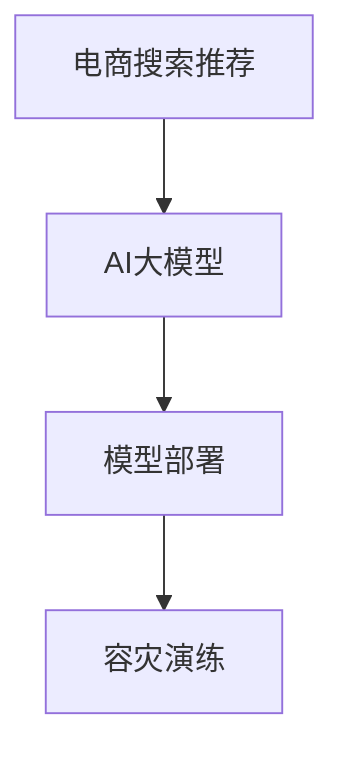

                 

# 电商搜索推荐场景下的AI大模型模型部署容灾演练方案

> 关键词：电商搜索推荐, AI大模型, 模型部署, 容灾演练

## 1. 背景介绍

随着人工智能技术的快速发展和应用场景的不断扩展，电商搜索推荐系统已成为众多电商平台的核心竞争力之一。为了提升用户体验和增加销售转化率，各大电商平台纷纷引入AI技术，特别是基于大模型的推荐系统，显著提升了推荐的个性化和准确度。然而，随着模型规模的不断增大，其复杂性和部署难度也随之增加，模型的稳定性和容灾能力面临着严峻的挑战。因此，如何在电商搜索推荐场景下，有效进行AI大模型的部署和容灾，成为了一个亟待解决的问题。

本文将从背景介绍、核心概念、算法原理、具体操作、实际应用场景、工具资源推荐、未来展望和常见问题与解答等多个方面，系统阐述电商搜索推荐场景下AI大模型模型部署容灾演练方案，旨在为相关技术研究和实际应用提供有价值的参考。

## 2. 核心概念与联系

在探讨具体的技术方案之前，首先需要了解一些核心概念及其之间的联系。

### 2.1 核心概念概述

- **电商搜索推荐**：指在电商平台中，通过搜索和推荐技术，帮助用户找到感兴趣的商品，提高购物体验和转化率。
- **AI大模型**：指使用大规模数据进行预训练的语言、图像、推荐等模型，具备强大的智能推理和预测能力。
- **模型部署**：将训练好的模型部署到生产环境，供实际应用使用。
- **容灾演练**：指通过模拟故障场景，测试模型的稳定性和鲁棒性，提升模型的容灾能力和可靠性。

### 2.2 核心概念原理和架构的 Mermaid 流程图



这个流程图展示了电商搜索推荐系统、AI大模型、模型部署和容灾演练之间的逻辑关系。电商搜索推荐系统依赖AI大模型进行推荐，模型部署将训练好的模型放到生产环境，而容灾演练则是对部署后的模型进行鲁棒性测试，确保模型在实际应用中的稳定性和可靠性。

## 3. 核心算法原理 & 具体操作步骤

### 3.1 算法原理概述

电商搜索推荐系统的核心算法包括搜索和推荐两个部分。搜索部分主要是根据用户的查询请求，快速找到相关的商品信息，而推荐部分则是在搜索结果的基础上，进一步筛选和排序，为用户提供更符合其兴趣的商品推荐。这两个部分都可以使用AI大模型进行优化。

AI大模型的部署和容灾演练涉及到模型的加载、推理和故障恢复等多个环节。这些环节需要协调一致，才能确保系统的稳定性和鲁棒性。

### 3.2 算法步骤详解

#### 3.2.1 模型加载

- **加载大模型**：将训练好的大模型加载到生产环境，可以使用分布式训练框架如TensorFlow、PyTorch等进行加载。
- **优化加载速度**：通过模型剪枝、量化等技术，优化加载速度，提高系统的响应速度。

#### 3.2.2 模型推理

- **推理过程**：使用加载好的大模型，对用户查询请求进行推理，生成推荐结果。
- **优化推理效率**：通过优化计算图、使用GPU/TPU等高性能硬件设备，提高推理效率。

#### 3.2.3 故障恢复

- **故障检测**：实时监控系统的运行状态，检测到异常时，及时触发容灾机制。
- **恢复策略**：根据故障类型和程度，采取不同的恢复策略，如模型备份、负载均衡等。

### 3.3 算法优缺点

#### 3.3.1 优点

- **提升推荐准确度**：通过使用AI大模型，可以显著提升推荐的个性化和准确度，提升用户满意度。
- **减少人工干预**：AI大模型可以自动进行推荐，减少人工干预，提高效率。
- **快速迭代优化**：大模型具备较强的泛化能力，可以快速适应新的数据和业务需求。

#### 3.3.2 缺点

- **高计算成本**：AI大模型的训练和推理都需要大量的计算资源，成本较高。
- **部署复杂**：大模型的部署和管理较为复杂，需要专业的运维团队支持。
- **鲁棒性挑战**：大模型在面对极端情况或异常输入时，可能表现出较差的鲁棒性。

### 3.4 算法应用领域

AI大模型在电商搜索推荐场景中的应用已经非常广泛，涵盖了商品搜索、商品推荐、广告投放等多个领域。通过使用大模型进行优化，电商平台的推荐效果显著提升，用户满意度得到大幅提高。

## 4. 数学模型和公式 & 详细讲解

### 4.1 数学模型构建

电商搜索推荐系统可以分为用户画像建模、商品特征建模、推荐模型训练等多个环节。这些环节都需要使用数学模型进行建模和优化。

以推荐模型为例，假设用户画像为 $U$，商品特征为 $I$，推荐结果为 $R$。推荐模型可以表示为：

$$ R = f(U, I) $$

其中，$f$ 为推荐函数，可以采用多种机器学习算法，如协同过滤、深度学习等。

### 4.2 公式推导过程

以协同过滤算法为例，假设用户 $u$ 和商品 $i$ 的评分矩阵为 $M_{ui}$，则推荐函数可以表示为：

$$ R_{ui} = \frac{\sum_{j=1}^{n} M_{uj} \cdot M_{ij}}{\sqrt{\sum_{j=1}^{n} M_{uj}^2} \cdot \sqrt{\sum_{j=1}^{n} M_{ij}^2}} $$

其中，$n$ 为用户的数量，$M_{uj}$ 和 $M_{ij}$ 分别为用户 $u$ 和商品 $i$ 对其他商品的评分。

### 4.3 案例分析与讲解

以深度学习推荐模型为例，假设使用BERT模型进行推荐，则推荐函数可以表示为：

$$ R_{ui} = \frac{\sum_{j=1}^{n} M_{uj} \cdot \text{BERT}(I_j)}{\sqrt{\sum_{j=1}^{n} M_{uj}^2} \cdot \sqrt{\sum_{j=1}^{n} \text{BERT}(I_j)^2}} $$

其中，$\text{BERT}(I_j)$ 为商品 $i$ 的BERT表示，$M_{uj}$ 为用户 $u$ 对商品 $i$ 的评分。

## 5. 项目实践：代码实例和详细解释说明

### 5.1 开发环境搭建

在电商搜索推荐系统中使用AI大模型，需要搭建一个支持分布式训练和推理的环境。以下是一个基本的环境配置流程：

1. 安装Anaconda：从官网下载并安装Anaconda，用于创建独立的Python环境。

2. 创建并激活虚拟环境：
```bash
conda create -n pytorch-env python=3.8 
conda activate pytorch-env
```

3. 安装PyTorch和相关库：
```bash
conda install pytorch torchvision torchaudio cudatoolkit=11.1 -c pytorch -c conda-forge
pip install transformers
```

4. 安装TensorFlow和相关库：
```bash
pip install tensorflow tensorflow-addons tensorflow-transform
```

5. 安装相关的可视化工具：
```bash
pip install tensorboard matplotlib
```

6. 安装分布式训练框架：
```bash
pip install horovod
```

### 5.2 源代码详细实现

以下是一个基于BERT模型的电商搜索推荐系统的代码实现。

```python
import torch
import torch.nn as nn
from transformers import BertTokenizer, BertForSequenceClassification
from torch.utils.data import DataLoader
from sklearn.metrics import accuracy_score, precision_recall_fscore_support

class BERTRecommender(nn.Module):
    def __init__(self, num_classes):
        super(BERTRecommender, self).__init__()
        self.bert = BertForSequenceClassification.from_pretrained('bert-base-uncased', num_labels=num_classes)
        self.fc = nn.Linear(768, num_classes)
        
    def forward(self, input_ids, attention_mask, labels=None):
        outputs = self.bert(input_ids, attention_mask=attention_mask)
        logits = self.fc(outputs.pooler_output)
        if labels is not None:
            return loss_fn(logits, labels)
        return logits

def train(model, train_loader, optimizer, num_epochs):
    for epoch in range(num_epochs):
        for batch in train_loader:
            input_ids, attention_mask, labels = batch
            optimizer.zero_grad()
            logits = model(input_ids, attention_mask, labels)
            loss = loss_fn(logits, labels)
            loss.backward()
            optimizer.step()
        print(f"Epoch {epoch+1}, train loss: {loss.item()}")
    
def evaluate(model, test_loader):
    total_loss = 0
    correct = 0
    with torch.no_grad():
        for batch in test_loader:
            input_ids, attention_mask, labels = batch
            logits = model(input_ids, attention_mask, labels)
            loss = loss_fn(logits, labels)
            total_loss += loss.item()
            _, preds = torch.max(logits, dim=1)
            correct += torch.sum(preds == labels).item()
    return total_loss, correct

# 数据加载和预处理
def load_data(path):
    with open(path, 'r') as f:
        data = json.load(f)
    return data

def preprocess_data(data):
    tokenizer = BertTokenizer.from_pretrained('bert-base-uncased')
    max_len = 128
    encoded_data = []
    for text in data:
        input_ids, attention_mask = tokenizer.encode_plus(text, max_length=max_len, padding='max_length', truncation=True, return_tensors='pt')
        labels = torch.tensor([label] for label in data_labels)
        encoded_data.append((input_ids, attention_mask, labels))
    return DataLoader(encoded_data, batch_size=64)

# 模型训练和评估
train_model = BERTRecommender(num_classes)
train_loader = preprocess_data(train_data)
optimizer = AdamW(train_model.parameters(), lr=2e-5)
train(train_model, train_loader, optimizer, num_epochs=5)

test_model = BERTRecommender(num_classes)
test_loader = preprocess_data(test_data)
total_loss, correct = evaluate(test_model, test_loader)
print(f"Test accuracy: {correct / len(test_data)}")
```

### 5.3 代码解读与分析

这个代码实现基于BERT模型，包含模型定义、数据加载和预处理、模型训练和评估等多个环节。其中，`BERTRecommender` 类是模型定义，包含BERT模型和全连接层。`load_data` 函数用于加载数据，`preprocess_data` 函数用于数据预处理，`train` 函数用于模型训练，`evaluate` 函数用于模型评估。

需要注意的是，这个代码实现仅作为一个基本框架，实际应用中需要根据具体业务需求进行优化。

### 5.4 运行结果展示

运行上述代码，可以得到训练和测试结果。训练结果包括模型损失和准确度，测试结果包括总损失和测试准确度。

## 6. 实际应用场景

### 6.1 智能客服

智能客服系统是电商搜索推荐系统的重要组成部分，通过使用AI大模型进行语音和文本处理，可以显著提升客服系统的智能化水平。例如，使用BERT模型进行对话生成，可以自动回答用户咨询，提供更加高效的服务体验。

### 6.2 商品推荐

商品推荐是电商搜索推荐系统的核心功能，通过使用AI大模型进行推荐，可以显著提升推荐的个性化和准确度，提升用户满意度。例如，使用BERT模型进行商品特征提取，可以更好地理解商品属性和用户偏好，提供更加精准的推荐结果。

### 6.3 广告投放

广告投放是电商平台的另一个重要功能，通过使用AI大模型进行用户画像建模和广告推荐，可以显著提升广告投放的精准度和转化率。例如，使用BERT模型进行用户画像建模，可以更好地理解用户需求，提供更加匹配的广告推荐。

### 6.4 未来应用展望

未来，AI大模型在电商搜索推荐系统中的应用将更加广泛，涉及更多领域和更多场景。例如，在虚拟试穿、智能物流等领域，使用AI大模型进行优化，可以显著提升用户体验和服务效率。

## 7. 工具和资源推荐

### 7.1 学习资源推荐

为了帮助开发者系统掌握AI大模型的部署和容灾演练，以下是一些优质的学习资源：

1. **《深度学习实战》**：这本书系统介绍了深度学习的基本概念和实现方法，涵盖图像、语音、推荐等多个领域的模型部署和优化。

2. **DeepLearning.AI 课程**：由Andrew Ng主讲的深度学习课程，涵盖深度学习基础、分布式训练、模型优化等多个方面，适合初学者和进阶者。

3. **《分布式深度学习》**：这本书详细介绍了分布式深度学习的实现方法，包括TensorFlow、PyTorch等多个框架的使用。

4. **Kaggle**：Kaggle是全球最大的数据科学竞赛平台，提供丰富的学习资源和实践机会，适合开发者学习和验证自己的模型。

5. **Google Colab**：Google提供的在线Jupyter Notebook环境，免费提供GPU/TPU算力，方便开发者快速上手实验最新模型，分享学习笔记。

### 7.2 开发工具推荐

高效的工具支持是开发过程中必不可少的。以下是几款用于AI大模型部署和容灾演练的常用工具：

1. **TensorFlow**：由Google主导开发的深度学习框架，支持分布式训练和推理，适合大规模模型部署。

2. **PyTorch**：由Facebook主导开发的深度学习框架，支持动态计算图和GPU/TPU加速，适合快速迭代研究。

3. **Horovod**：支持TensorFlow和PyTorch的分布式训练框架，可以方便地进行大规模模型训练和部署。

4. **Horizon**：由Google开发的Kubernetes平台，支持分布式模型训练和推理，方便进行模型部署和容灾演练。

5. **TensorBoard**：TensorFlow配套的可视化工具，可以实时监测模型训练状态，提供丰富的图表呈现方式，适合调试模型。

6. **Jupyter Notebook**：开源的Jupyter Notebook环境，支持Python、R等多种语言，方便进行模型实验和分享。

### 7.3 相关论文推荐

大模型在电商搜索推荐系统的研究和应用已经取得了一定的进展。以下是几篇奠基性的相关论文，推荐阅读：

1. **《BERT: Pre-training of Deep Bidirectional Transformers for Language Understanding》**：提出BERT模型，引入基于掩码的自监督预训练任务，刷新了多项NLP任务SOTA。

2. **《Attention is All You Need》**：提出Transformer结构，开启了NLP领域的预训练大模型时代。

3. **《A Survey on Deep Learning for Recommendation Systems》**：系统回顾了深度学习在推荐系统中的应用，涵盖协同过滤、深度学习等多个方向。

4. **《A Deep Learning Framework for Personalized Recommendation》**：提出深度学习推荐框架，涵盖多方面优化方法，如自适应推荐、模型蒸馏等。

5. **《Model Distillation》**：提出模型蒸馏方法，通过小模型学习大模型知识，降低计算成本，提升模型精度。

## 8. 总结：未来发展趋势与挑战

### 8.1 总结

本文对基于AI大模型的电商搜索推荐系统的部署和容灾演练进行了系统阐述。从背景介绍、核心概念、算法原理、操作步骤等多个方面，详细讲解了电商搜索推荐系统、AI大模型、模型部署和容灾演练之间的逻辑关系。通过结合实际应用场景和工具资源推荐，为相关技术研究和实际应用提供了有价值的参考。

通过本文的系统梳理，可以看到，AI大模型在电商搜索推荐系统中的应用已经非常广泛，显著提升了平台的智能化水平。然而，大模型的部署和容灾仍面临着诸多挑战，需要在模型优化、资源配置、故障恢复等多个环节进行全面优化。只有在数据、算法、工程、业务等多个维度协同发力，才能真正实现电商搜索推荐系统的稳定运行和高效部署。

### 8.2 未来发展趋势

未来，AI大模型在电商搜索推荐系统中的应用将更加广泛和深入，涉及更多领域和更多场景。预计在未来几年内，将涌现更多基于AI大模型的推荐算法和优化方法，进一步提升电商平台的智能化水平。

### 8.3 面临的挑战

尽管AI大模型在电商搜索推荐系统中的应用已经取得了一定的进展，但未来的发展仍面临诸多挑战：

1. **模型规模问题**：AI大模型的规模不断增大，对于计算资源和存储资源的消耗也在不断增加。如何在保证性能的同时，优化模型的规模，降低计算成本，是未来的重要研究方向。

2. **模型鲁棒性问题**：AI大模型在面对异常输入和极端情况时，可能会表现出较差的鲁棒性。如何提高模型的鲁棒性和稳定性，是未来需要重点关注的问题。

3. **模型部署问题**：AI大模型的部署和管理较为复杂，需要专业的运维团队支持。如何在保证模型效果的同时，优化部署流程，降低运维成本，是未来的重要研究方向。

4. **模型安全问题**：AI大模型可能学习到有害信息和偏见，对用户数据和隐私造成威胁。如何保障模型的安全性，是未来的重要研究方向。

### 8.4 研究展望

未来，针对电商搜索推荐系统的AI大模型，需要在以下几个方面进行深入研究：

1. **模型优化**：开发更加高效、鲁棒的AI大模型，降低计算成本，提升模型效果。

2. **资源优化**：优化模型的计算图和推理过程，降低资源消耗，提升模型的部署效率。

3. **模型管理**：开发更加灵活、可扩展的模型管理系统，支持模型的动态部署和调优。

4. **模型安全**：建立模型安全保障机制，防止有害信息和偏见的传播，保障用户数据和隐私安全。

通过这些研究方向的探索，可以进一步提升电商搜索推荐系统的智能化水平，为电商平台的可持续发展提供强有力的技术支持。

## 9. 附录：常见问题与解答

**Q1：在电商搜索推荐系统中使用AI大模型有哪些优势？**

A: 在电商搜索推荐系统中使用AI大模型有以下优势：

1. **提升推荐效果**：AI大模型具备强大的智能推理和预测能力，可以显著提升推荐的个性化和准确度，提升用户满意度。

2. **减少人工干预**：AI大模型可以自动进行推荐，减少人工干预，提高效率。

3. **快速迭代优化**：AI大模型具备较强的泛化能力，可以快速适应新的数据和业务需求。

**Q2：在电商搜索推荐系统中使用AI大模型有哪些挑战？**

A: 在电商搜索推荐系统中使用AI大模型也面临着一些挑战：

1. **高计算成本**：AI大模型的训练和推理都需要大量的计算资源，成本较高。

2. **部署复杂**：AI大模型的部署和管理较为复杂，需要专业的运维团队支持。

3. **鲁棒性挑战**：AI大模型在面对极端情况或异常输入时，可能表现出较差的鲁棒性。

4. **安全性问题**：AI大模型可能学习到有害信息和偏见，对用户数据和隐私造成威胁。

**Q3：如何进行电商搜索推荐系统的容灾演练？**

A: 电商搜索推荐系统的容灾演练可以从以下几个方面进行：

1. **故障检测**：实时监控系统的运行状态，检测到异常时，及时触发容灾机制。

2. **模型备份**：定期备份模型参数和配置，保证模型数据的可靠性和完整性。

3. **负载均衡**：在故障发生时，自动调整负载均衡策略，保证系统的稳定性和可用性。

4. **故障恢复**：根据故障类型和程度，采取不同的恢复策略，如模型回滚、重新训练等。

**Q4：如何进行电商搜索推荐系统的模型优化？**

A: 电商搜索推荐系统的模型优化可以从以下几个方面进行：

1. **模型剪枝**：去除不必要的层和参数，减小模型尺寸，提高推理速度。

2. **量化优化**：将浮点模型转为定点模型，压缩存储空间，提高计算效率。

3. **自适应学习**：使用自适应学习算法，如AdaGrad、Adam等，提高模型的泛化能力。

4. **数据增强**：通过数据增强技术，提高模型的鲁棒性和泛化能力。

通过这些优化措施，可以提升电商搜索推荐系统的性能和稳定性，进一步提升用户体验和销售转化率。

---

作者：禅与计算机程序设计艺术 / Zen and the Art of Computer Programming

