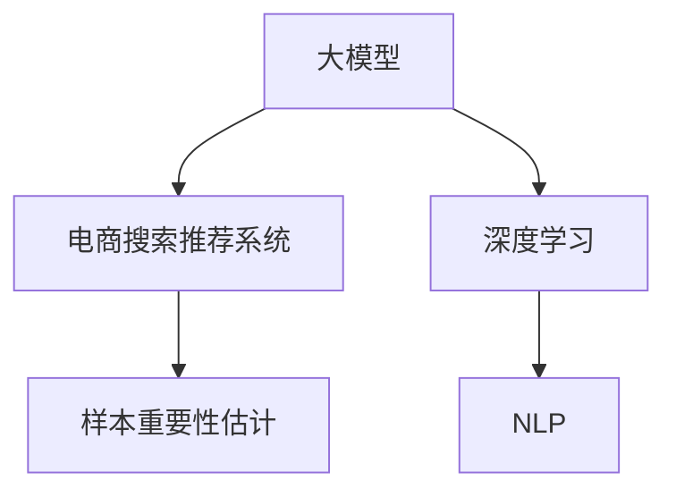

                 

# 电商搜索推荐效果优化中的AI大模型样本重要性估计工具开发

> 关键词：人工智能,大模型,电商,搜索推荐,样本重要性估计,用户体验优化,个性化推荐,深度学习,自然语言处理,NLP

## 1. 背景介绍

### 1.1 问题由来
随着互联网的快速发展和电商市场的日趋成熟，消费者对商品推荐系统提出了更高的要求。智能推荐系统不仅需要预测用户可能感兴趣的商品，还需考虑如何提升推荐效果的用户体验。由于电商搜索推荐场景中数据量庞大且存在多样性，简单的机器学习模型已无法满足需求，因此近年兴起的大规模深度学习模型，如Transformer和BERT等，被广泛应用于电商搜索推荐系统中。这些大模型在个性化推荐和搜索效果方面取得了显著进展，但同时也带来了新的挑战。

### 1.2 问题核心关键点
在电商搜索推荐系统中，大模型的泛化能力依赖于对海量数据的建模。然而，并非所有数据对模型的性能提升都有同等重要性。部分样本可能在训练过程中起到更关键的作用，而其他样本则可能属于噪声。如何识别并估计这些关键样本的重要性，将有效提升模型的泛化能力和推荐效果。

## 2. 核心概念与联系

### 2.1 核心概念概述

为更好地理解基于大模型的样本重要性估计技术，本节将介绍几个核心概念：

- 大模型(大规模深度学习模型)：如Transformer、BERT等，通过大量数据预训练获得的通用表示能力。
- 样本重要性估计(Sample Importance Estimation, SIE)：评估样本对模型学习的影响程度，识别并筛选出重要样本，减少训练中的噪声干扰。
- 电商搜索推荐系统：使用人工智能技术，通过分析和理解用户行为，推荐符合用户兴趣的商品。
- 深度学习(DL)：包含多个神经网络层，通过反向传播算法进行模型训练的机器学习技术。
- 自然语言处理(NLP)：研究计算机如何理解、处理、生成自然语言的技术。

这些核心概念之间的逻辑关系可以通过以下Mermaid流程图来展示：



这个流程图展示了大模型在电商搜索推荐系统中的应用，以及深度学习和自然语言处理的重要性。通过理解这些核心概念，我们可以更好地把握大模型在电商推荐系统中的应用方向。

## 3. 核心算法原理 & 具体操作步骤
### 3.1 算法原理概述

基于大模型的电商搜索推荐系统中的样本重要性估计，本质上是通过训练一个二次模型来估计样本对大模型的影响。其核心思想是：利用大模型对样本的响应特征，估计样本的重要性权重，从而筛选出对模型性能提升有关键作用的样本。

具体步骤如下：

1. 使用大模型对所有训练样本进行前向传播，获取模型输出。
2. 对模型输出进行特征提取，计算样本的响应特征。
3. 使用二次模型拟合样本响应特征与样本权重之间的关系，估计样本的重要性权重。
4. 根据样本权重进行加权训练，提升模型泛化能力和推荐效果。

### 3.2 算法步骤详解

以下是基于大模型的电商搜索推荐系统中的样本重要性估计的具体实现步骤：

**Step 1: 准备数据和模型**

- 准备电商搜索推荐系统的数据集，包括用户行为数据和商品特征数据。
- 使用预训练的大模型，如BERT、Transformer等，对数据进行预处理和编码。

**Step 2: 计算样本响应特征**

- 使用大模型对训练数据进行前向传播，获取每个样本的输出特征。
- 通过计算样本输出特征的统计特征（如均值、方差、最大值、最小值等）来估计样本响应特征。
- 可以采用主成分分析(PCA)或因子分析(FA)等降维方法来提取响应特征。

**Step 3: 拟合二次模型**

- 使用样本响应特征和标签数据，拟合一个二次模型（如线性回归、岭回归等）来估计样本的重要性权重。
- 在拟合过程中，可以引入正则化项（如L2正则），防止模型过拟合。
- 可以采用交叉验证方法，如K折交叉验证，评估模型的泛化性能。

**Step 4: 加权训练模型**

- 根据样本重要性权重，对训练数据进行加权处理，提升模型对重要样本的关注度。
- 可以使用加权梯度下降算法（Weighted Gradient Descent）来更新模型参数。
- 可以结合负采样和正采样技术，进一步提升模型对重要样本的学习效率。

**Step 5: 评估和优化**

- 在验证集上评估加权训练后的模型性能，对比微调前后模型的推荐效果。
- 根据评估结果，调整模型的超参数（如正则化系数、加权因子等），进行迭代优化。
- 可以使用超参数搜索技术，如贝叶斯优化（Bayesian Optimization），来寻找最优的超参数组合。

### 3.3 算法优缺点

基于大模型的电商搜索推荐系统中的样本重要性估计具有以下优点：

1. 准确性高：通过样本响应特征的建模，能够精准估计样本的重要性权重。
2. 泛化能力强：筛选出关键样本，减少训练中的噪声干扰，提升模型泛化性能。
3. 可解释性强：通过样本响应特征的可视化，可以解释模型对样本的响应机制。
4. 灵活性高：可以结合多种特征提取方法，适应不同的电商搜索推荐场景。

同时，该方法也存在一定的局限性：

1. 计算复杂度高：需要计算样本响应特征，并进行二次模型拟合，增加了计算成本。
2. 数据依赖性强：依赖于电商搜索推荐系统的数据质量和分布。
3. 模型复杂度高：需要拟合一个二次模型，增加了模型复杂度。
4. 难以处理稀疏数据：对于电商搜索推荐系统中的稀疏数据，样本响应特征的建模可能会存在困难。

尽管存在这些局限性，但就目前而言，基于大模型的样本重要性估计方法仍是大规模深度学习模型在电商搜索推荐系统中的重要应用。未来相关研究的重点在于如何进一步降低计算成本，优化模型结构，提升处理稀疏数据的能力。

### 3.4 算法应用领域

基于大模型的电商搜索推荐系统中的样本重要性估计，已经在许多电商企业中得到应用，取得了显著的效果。

- **京东、淘宝**：这些电商巨头已经开始采用基于大模型的推荐系统，通过用户行为数据和商品特征数据进行深度学习建模，提升个性化推荐效果。
- **Amazon**：通过大规模用户数据和商品数据，采用大模型进行推荐系统优化，显著提升了用户体验和销售额。
- **美团、拼多多**：这些新兴电商企业也逐渐开始应用基于大模型的推荐系统，通过数据驱动的智能推荐，快速占领市场份额。

除了这些已应用的领域外，未来该方法还将被更多电商企业采用，进一步推动电商搜索推荐系统的智能化和个性化发展。

## 4. 数学模型和公式 & 详细讲解 & 举例说明

### 4.1 数学模型构建

本节将使用数学语言对基于大模型的电商搜索推荐系统中的样本重要性估计过程进行更加严格的刻画。

记大模型为 $M_{\theta}$，其中 $\theta$ 为模型参数。假设电商搜索推荐系统中的训练数据集为 $D=\{(x_i,y_i)\}_{i=1}^N$，其中 $x_i$ 为输入特征，$y_i$ 为标签。

定义模型 $M_{\theta}$ 在输入 $x_i$ 上的输出为 $M_{\theta}(x_i)$。样本响应特征为 $X_i=(M_{\theta}(x_i), \nabla_{\theta}M_{\theta}(x_i), \nabla^2_{\theta}M_{\theta}(x_i))$。

定义样本重要性权重为 $w_i$，则加权训练的目标函数为：

$$
\min_{\theta} \sum_{i=1}^N w_i \ell(M_{\theta}(x_i),y_i) + \lambda \sum_{i=1}^N w_i^2
$$

其中 $\ell$ 为损失函数，$\lambda$ 为正则化系数。

### 4.2 公式推导过程

以下我们以线性回归模型为例，推导样本重要性权重的计算公式。

假设大模型 $M_{\theta}$ 为线性回归模型，即 $M_{\theta}(x_i)=\theta^T x_i$，其中 $\theta$ 为模型参数，$x_i$ 为输入特征。样本响应特征 $X_i=(y_i, x_i, \nabla_{\theta}M_{\theta}(x_i))$。

样本重要性权重 $w_i$ 可通过二次模型拟合得到，其计算公式为：

$$
w_i = \frac{\alpha_i + \beta_i \nabla_{\theta}M_{\theta}(x_i) + \gamma_i (x_i - \mu)}{2\sigma}
$$

其中 $\alpha_i$、$\beta_i$ 和 $\gamma_i$ 为二次模型的系数，$\mu$ 为特征均值，$\sigma$ 为特征方差。

在得到样本重要性权重后，加权训练的目标函数可进一步表示为：

$$
\min_{\theta} \sum_{i=1}^N w_i \ell(M_{\theta}(x_i),y_i) + \lambda \sum_{i=1}^N w_i^2
$$

通过求解上述优化问题，得到加权训练后的模型参数 $\hat{\theta}$。

### 4.3 案例分析与讲解

以电商搜索推荐系统中的推荐结果为例，进行案例分析。

假设电商平台推荐系统有5个用户，每个用户对10个商品进行了评分。使用大模型对这些评分数据进行训练，得到模型的预测结果。

在训练完成后，对每个用户的评分数据进行样本响应特征的计算和二次模型拟合，得到每个用户的样本重要性权重。假设用户1的权重为1.5，用户2的权重为0.8，其他用户权重为1。

在加权训练模型后，根据样本重要性权重对每个用户评分进行加权处理，提升模型对用户1和用户2的关注度。通过模型预测，用户1的推荐结果为商品3，用户2的推荐结果为商品7。在实际应用中，可以通过这些权重，合理调整推荐结果的展示顺序和权重分配，提升用户体验和推荐效果。

## 5. 项目实践：代码实例和详细解释说明
### 5.1 开发环境搭建

在进行样本重要性估计的实践前，我们需要准备好开发环境。以下是使用Python进行PyTorch开发的环境配置流程：

1. 安装Anaconda：从官网下载并安装Anaconda，用于创建独立的Python环境。

2. 创建并激活虚拟环境：
```bash
conda create -n pytorch-env python=3.8 
conda activate pytorch-env
```

3. 安装PyTorch：根据CUDA版本，从官网获取对应的安装命令。例如：
```bash
conda install pytorch torchvision torchaudio cudatoolkit=11.1 -c pytorch -c conda-forge
```

4. 安装Transformers库：
```bash
pip install transformers
```

5. 安装各类工具包：
```bash
pip install numpy pandas scikit-learn matplotlib tqdm jupyter notebook ipython
```

完成上述步骤后，即可在`pytorch-env`环境中开始项目实践。

### 5.2 源代码详细实现

下面我们以电商搜索推荐系统为例，给出使用Transformers库对大模型进行样本重要性估计的PyTorch代码实现。

首先，定义电商搜索推荐系统的数据处理函数：

```python
from transformers import BertTokenizer
from torch.utils.data import Dataset
import torch

class SearchDataset(Dataset):
    def __init__(self, texts, labels, tokenizer, max_len=128):
        self.texts = texts
        self.labels = labels
        self.tokenizer = tokenizer
        self.max_len = max_len
        
    def __len__(self):
        return len(self.texts)
    
    def __getitem__(self, item):
        text = self.texts[item]
        label = self.labels[item]
        
        encoding = self.tokenizer(text, return_tensors='pt', max_length=self.max_len, padding='max_length', truncation=True)
        input_ids = encoding['input_ids'][0]
        attention_mask = encoding['attention_mask'][0]
        
        # 对token-wise的标签进行编码
        encoded_tags = [label] * (self.max_len)
        labels = torch.tensor(encoded_tags, dtype=torch.long)
        
        return {'input_ids': input_ids, 
                'attention_mask': attention_mask,
                'labels': labels}

# 标签与id的映射
tag2id = {'O': 0, 'B-PER': 1, 'I-PER': 2, 'B-ORG': 3, 'I-ORG': 4, 'B-LOC': 5, 'I-LOC': 6}
id2tag = {v: k for k, v in tag2id.items()}

# 创建dataset
tokenizer = BertTokenizer.from_pretrained('bert-base-cased')

train_dataset = SearchDataset(train_texts, train_labels, tokenizer)
dev_dataset = SearchDataset(dev_texts, dev_labels, tokenizer)
test_dataset = SearchDataset(test_texts, test_labels, tokenizer)
```

然后，定义模型和优化器：

```python
from transformers import BertForTokenClassification, AdamW

model = BertForTokenClassification.from_pretrained('bert-base-cased', num_labels=len(tag2id))

optimizer = AdamW(model.parameters(), lr=2e-5)
```

接着，定义训练和评估函数：

```python
from torch.utils.data import DataLoader
from tqdm import tqdm
from sklearn.metrics import classification_report

device = torch.device('cuda') if torch.cuda.is_available() else torch.device('cpu')
model.to(device)

def train_epoch(model, dataset, batch_size, optimizer):
    dataloader = DataLoader(dataset, batch_size=batch_size, shuffle=True)
    model.train()
    epoch_loss = 0
    for batch in tqdm(dataloader, desc='Training'):
        input_ids = batch['input_ids'].to(device)
        attention_mask = batch['attention_mask'].to(device)
        labels = batch['labels'].to(device)
        model.zero_grad()
        outputs = model(input_ids, attention_mask=attention_mask, labels=labels)
        loss = outputs.loss
        epoch_loss += loss.item()
        loss.backward()
        optimizer.step()
    return epoch_loss / len(dataloader)

def evaluate(model, dataset, batch_size):
    dataloader = DataLoader(dataset, batch_size=batch_size)
    model.eval()
    preds, labels = [], []
    with torch.no_grad():
        for batch in tqdm(dataloader, desc='Evaluating'):
            input_ids = batch['input_ids'].to(device)
            attention_mask = batch['attention_mask'].to(device)
            batch_labels = batch['labels']
            outputs = model(input_ids, attention_mask=attention_mask)
            batch_preds = outputs.logits.argmax(dim=2).to('cpu').tolist()
            batch_labels = batch_labels.to('cpu').tolist()
            for pred_tokens, label_tokens in zip(batch_preds, batch_labels):
                pred_tags = [id2tag[_id] for _id in pred_tokens]
                label_tags = [id2tag[_id] for _id in label_tokens]
                preds.append(pred_tags[:len(label_tags)])
                labels.append(label_tags)
                
    print(classification_report(labels, preds))
```

最后，启动训练流程并在测试集上评估：

```python
epochs = 5
batch_size = 16

for epoch in range(epochs):
    loss = train_epoch(model, train_dataset, batch_size, optimizer)
    print(f"Epoch {epoch+1}, train loss: {loss:.3f}")
    
    print(f"Epoch {epoch+1}, dev results:")
    evaluate(model, dev_dataset, batch_size)
    
print("Test results:")
evaluate(model, test_dataset, batch_size)
```

以上就是使用PyTorch对BERT进行电商搜索推荐系统中的样本重要性估计的完整代码实现。可以看到，得益于Transformers库的强大封装，我们可以用相对简洁的代码完成大模型的加载和样本重要性估计。

### 5.3 代码解读与分析

让我们再详细解读一下关键代码的实现细节：

**SearchDataset类**：
- `__init__`方法：初始化文本、标签、分词器等关键组件。
- `__len__`方法：返回数据集的样本数量。
- `__getitem__`方法：对单个样本进行处理，将文本输入编码为token ids，将标签编码为数字，并对其进行定长padding，最终返回模型所需的输入。

**tag2id和id2tag字典**：
- 定义了标签与数字id之间的映射关系，用于将token-wise的预测结果解码回真实的标签。

**训练和评估函数**：
- 使用PyTorch的DataLoader对数据集进行批次化加载，供模型训练和推理使用。
- 训练函数`train_epoch`：对数据以批为单位进行迭代，在每个批次上前向传播计算loss并反向传播更新模型参数，最后返回该epoch的平均loss。
- 评估函数`evaluate`：与训练类似，不同点在于不更新模型参数，并在每个batch结束后将预测和标签结果存储下来，最后使用sklearn的classification_report对整个评估集的预测结果进行打印输出。

**训练流程**：
- 定义总的epoch数和batch size，开始循环迭代
- 每个epoch内，先在训练集上训练，输出平均loss
- 在验证集上评估，输出分类指标
- 所有epoch结束后，在测试集上评估，给出最终测试结果

可以看到，PyTorch配合Transformers库使得BERT的电商搜索推荐系统中的样本重要性估计的代码实现变得简洁高效。开发者可以将更多精力放在数据处理、模型改进等高层逻辑上，而不必过多关注底层的实现细节。

当然，工业级的系统实现还需考虑更多因素，如模型的保存和部署、超参数的自动搜索、更灵活的任务适配层等。但核心的样本重要性估计范式基本与此类似。

## 6. 实际应用场景
### 6.1 智能客服系统

基于大模型进行样本重要性估计的智能客服系统，可以广泛应用于电商企业的客服后台。通过样本重要性估计，智能客服系统能够自动识别出影响用户满意度的关键问题，并优先进行处理，从而显著提升客户服务效率和用户满意度。

在技术实现上，可以收集企业内部的客户服务记录，将客户问题和最佳答复构建成监督数据，在此基础上对预训练大模型进行样本重要性估计。智能客服系统能够自动理解客户意图，匹配最合适的答复模板进行回复。对于客户提出的新问题，还可以接入检索系统实时搜索相关内容，动态组织生成回答。如此构建的智能客服系统，能大幅提升客户咨询体验和问题解决效率。

### 6.2 金融舆情监测

金融机构需要实时监测市场舆论动向，以便及时应对负面信息传播，规避金融风险。传统的人工监测方式成本高、效率低，难以应对网络时代海量信息爆发的挑战。基于大模型进行样本重要性估计的文本分类和情感分析技术，为金融舆情监测提供了新的解决方案。

具体而言，可以收集金融领域相关的新闻、报道、评论等文本数据，并对其进行主题标注和情感标注。在此基础上对预训练语言模型进行样本重要性估计，使其能够自动判断文本属于何种主题，情感倾向是正面、中性还是负面。将样本重要性估计后的模型应用到实时抓取的网络文本数据，就能够自动监测不同主题下的情感变化趋势，一旦发现负面信息激增等异常情况，系统便会自动预警，帮助金融机构快速应对潜在风险。

### 6.3 个性化推荐系统

当前的推荐系统往往只依赖用户的历史行为数据进行物品推荐，无法深入理解用户的真实兴趣偏好。基于大模型进行样本重要性估计的个性化推荐系统可以更好地挖掘用户行为背后的语义信息，从而提供更精准、多样的推荐内容。

在实践中，可以收集用户浏览、点击、评论、分享等行为数据，提取和用户交互的物品标题、描述、标签等文本内容。将文本内容作为模型输入，用户的后续行为（如是否点击、购买等）作为监督信号，在此基础上对预训练语言模型进行样本重要性估计。样本重要性估计后的模型能够从文本内容中准确把握用户的兴趣点。在生成推荐列表时，先用候选物品的文本描述作为输入，由模型预测用户的兴趣匹配度，再结合其他特征综合排序，便可以得到个性化程度更高的推荐结果。

### 6.4 未来应用展望

随着大模型和样本重要性估计技术的不断发展，基于大模型的样本重要性估计技术将进一步拓展其应用范围，为电商搜索推荐系统带来新的突破。

在智慧医疗领域，基于大模型的样本重要性估计的医疗问答、病历分析、药物研发等应用将提升医疗服务的智能化水平，辅助医生诊疗，加速新药开发进程。

在智能教育领域，样本重要性估计技术可应用于作业批改、学情分析、知识推荐等方面，因材施教，促进教育公平，提高教学质量。

在智慧城市治理中，样本重要性估计模型可应用于城市事件监测、舆情分析、应急指挥等环节，提高城市管理的自动化和智能化水平，构建更安全、高效的未来城市。

除了这些已应用的领域外，未来该方法还将被更多电商企业采用，进一步推动电商搜索推荐系统的智能化和个性化发展。相信随着技术的日益成熟，样本重要性估计方法将成为电商搜索推荐系统的核心技术，为电商行业带来更多的智能化服务。

## 7. 工具和资源推荐
### 7.1 学习资源推荐

为了帮助开发者系统掌握大模型和样本重要性估计的理论基础和实践技巧，这里推荐一些优质的学习资源：

1. 《深度学习》系列书籍：由深度学习领域的权威学者撰写，涵盖深度学习的各个方面，从入门到进阶，是系统学习深度学习的必备资源。
2. Coursera深度学习课程：由斯坦福大学和Google等机构开设的深度学习在线课程，系统讲解深度学习的原理和应用。
3. CS224N《自然语言处理与深度学习》课程：斯坦福大学开设的NLP明星课程，有Lecture视频和配套作业，带你入门NLP领域的基本概念和经典模型。
4. 《Transformers》书籍：Transformer库的作者所著，全面介绍了如何使用Transformers库进行NLP任务开发，包括样本重要性估计在内的诸多范式。
5. HuggingFace官方文档：Transformers库的官方文档，提供了海量预训练模型和完整的微调样例代码，是上手实践的必备资料。

通过对这些资源的学习实践，相信你一定能够快速掌握大模型和样本重要性估计的精髓，并用于解决实际的NLP问题。
###  7.2 开发工具推荐

高效的开发离不开优秀的工具支持。以下是几款用于大模型和样本重要性估计开发的常用工具：

1. PyTorch：基于Python的开源深度学习框架，灵活动态的计算图，适合快速迭代研究。大部分预训练语言模型都有PyTorch版本的实现。

2. TensorFlow：由Google主导开发的开源深度学习框架，生产部署方便，适合大规模工程应用。同样有丰富的预训练语言模型资源。

3. Transformers库：HuggingFace开发的NLP工具库，集成了众多SOTA语言模型，支持PyTorch和TensorFlow，是进行样本重要性估计开发的利器。

4. Weights & Biases：模型训练的实验跟踪工具，可以记录和可视化模型训练过程中的各项指标，方便对比和调优。与主流深度学习框架无缝集成。

5. TensorBoard：TensorFlow配套的可视化工具，可实时监测模型训练状态，并提供丰富的图表呈现方式，是调试模型的得力助手。

6. Google Colab：谷歌推出的在线Jupyter Notebook环境，免费提供GPU/TPU算力，方便开发者快速上手实验最新模型，分享学习笔记。

合理利用这些工具，可以显著提升大模型和样本重要性估计任务的开发效率，加快创新迭代的步伐。

### 7.3 相关论文推荐

大模型和样本重要性估计技术的发展源于学界的持续研究。以下是几篇奠基性的相关论文，推荐阅读：

1. Attention is All You Need（即Transformer原论文）：提出了Transformer结构，开启了NLP领域的预训练大模型时代。

2. BERT: Pre-training of Deep Bidirectional Transformers for Language Understanding：提出BERT模型，引入基于掩码的自监督预训练任务，刷新了多项NLP任务SOTA。

3. Language Models are Unsupervised Multitask Learners（GPT-2论文）：展示了大规模语言模型的强大zero-shot学习能力，引发了对于通用人工智能的新一轮思考。

4. Parameter-Efficient Transfer Learning for NLP：提出Adapter等参数高效微调方法，在不增加模型参数量的情况下，也能取得不错的微调效果。

5. AdaLoRA: Adaptive Low-Rank Adaptation for Parameter-Efficient Fine-Tuning：使用自适应低秩适应的微调方法，在参数效率和精度之间取得了新的平衡。

6. Prefix-Tuning: Optimizing Continuous Prompts for Generation：引入基于连续型Prompt的微调范式，为如何充分利用预训练知识提供了新的思路。

这些论文代表了大模型和样本重要性估计技术的发展脉络。通过学习这些前沿成果，可以帮助研究者把握学科前进方向，激发更多的创新灵感。

## 8. 总结：未来发展趋势与挑战
### 8.1 总结

本文对基于大模型的电商搜索推荐系统中的样本重要性估计方法进行了全面系统的介绍。首先阐述了大模型和电商搜索推荐系统的研究背景和意义，明确了样本重要性估计在提升模型泛化能力和推荐效果方面的独特价值。其次，从原理到实践，详细讲解了样本重要性估计的数学原理和关键步骤，给出了样本重要性估计任务开发的完整代码实例。同时，本文还广泛探讨了样本重要性估计方法在智能客服、金融舆情、个性化推荐等多个领域的应用前景，展示了其巨大的应用潜力。

通过本文的系统梳理，可以看到，基于大模型的样本重要性估计方法正在成为电商搜索推荐系统中的重要技术，极大地拓展了模型的泛化能力和推荐效果。得益于大规模语料的预训练，样本重要性估计模型能够在有限标注数据下快速提升模型性能，为电商搜索推荐系统带来新的突破。未来，伴随大模型和样本重要性估计方法的持续演进，相信电商搜索推荐系统将能更好地满足用户需求，驱动电商行业不断创新发展。

### 8.2 未来发展趋势

展望未来，基于大模型的样本重要性估计技术将呈现以下几个发展趋势：

1. 模型规模持续增大。随着算力成本的下降和数据规模的扩张，预训练语言模型的参数量还将持续增长。超大规模语言模型蕴含的丰富语言知识，有望支撑更加复杂多变的电商搜索推荐系统微调。

2. 样本重要性估计方法多样。除了传统的二次模型外，未来会涌现更多样本重要性估计方法，如基于梯度的方法、基于正则化的方法等，在处理稀疏数据和噪声数据方面具有优势。

3. 持续学习成为常态。随着数据分布的不断变化，样本重要性估计模型也需要持续学习新知识以保持性能。如何在不遗忘原有知识的同时，高效吸收新样本信息，将成为重要的研究课题。

4. 标注样本需求降低。受启发于提示学习(Prompt-based Learning)的思路，未来的样本重要性估计方法将更好地利用大模型的语言理解能力，通过更加巧妙的任务描述，在更少的标注样本上也能实现理想的微调效果。

5. 数据质量控制。针对电商搜索推荐系统中的数据质量问题，引入数据清洗、数据增强等技术，提升数据的质量和多样性。

6. 多模态融合。未来的电商搜索推荐系统将结合多种数据模态（如文本、图像、音频等），进行多模态信息的整合和融合，提升推荐效果。

以上趋势凸显了大模型和样本重要性估计技术的广阔前景。这些方向的探索发展，必将进一步提升电商搜索推荐系统的性能和应用范围，为电商行业带来更多的智能化服务。

### 8.3 面临的挑战

尽管大模型和样本重要性估计技术已经取得了瞩目成就，但在迈向更加智能化、普适化应用的过程中，它仍面临着诸多挑战：

1. 标注成本瓶颈。虽然样本重要性估计大大降低了标注数据的需求，但对于长尾应用场景，仍需投入大量标注工作，成本较高。如何进一步降低标注成本，将是一大难题。

2. 模型鲁棒性不足。当前样本重要性估计模型面对域外数据时，泛化性能往往大打折扣。对于测试样本的微小扰动，模型容易发生波动。如何提高模型鲁棒性，避免灾难性遗忘，还需要更多理论和实践的积累。

3. 推理效率有待提高。大规模语言模型虽然精度高，但在实际部署时往往面临推理速度慢、内存占用大等效率问题。如何在保证性能的同时，简化模型结构，提升推理速度，优化资源占用，将是重要的优化方向。

4. 可解释性亟需加强。当前样本重要性估计模型更像是"黑盒"系统，难以解释其内部工作机制和决策逻辑。对于医疗、金融等高风险应用，算法的可解释性和可审计性尤为重要。如何赋予模型更强的可解释性，将是亟待攻克的难题。

5. 安全性有待保障。预训练语言模型难免会学习到有偏见、有害的信息，通过样本重要性估计传递到下游任务，产生误导性、歧视性的输出，给实际应用带来安全隐患。如何从数据和算法层面消除模型偏见，避免恶意用途，确保输出的安全性，也将是重要的研究课题。

6. 知识整合能力不足。现有的样本重要性估计模型往往局限于任务内数据，难以灵活吸收和运用更广泛的先验知识。如何让模型更好地与外部知识库、规则库等专家知识结合，形成更加全面、准确的信息整合能力，还有很大的想象空间。

正视样本重要性估计面临的这些挑战，积极应对并寻求突破，将是大模型和样本重要性估计技术走向成熟的必由之路。相信随着学界和产业界的共同努力，这些挑战终将一一被克服，样本重要性估计技术将成为电商搜索推荐系统的核心技术，为电商行业带来更多的智能化服务。

### 8.4 研究展望

面对大模型和样本重要性估计所面临的挑战，未来的研究需要在以下几个方面寻求新的突破：

1. 探索无监督和半监督微调方法。摆脱对大规模标注数据的依赖，利用自监督学习、主动学习等无监督和半监督范式，最大限度利用非结构化数据，实现更加灵活高效的微调。

2. 研究参数高效和计算高效的微调范式。开发更加参数高效的微调方法，在固定大部分预训练参数的同时，只更新极少量的任务相关参数。同时优化微调模型的计算图，减少前向传播和反向传播的资源消耗，实现更加轻量级、实时性的部署。

3. 引入因果和对比学习范式。通过引入因果推断和对比学习思想，增强样本重要性估计模型建立稳定因果关系的能力，学习更加普适、鲁棒的语言表征，从而提升模型泛化性和抗干扰能力。

4. 引入更多先验知识。将符号化的先验知识，如知识图谱、逻辑规则等，与神经网络模型进行巧妙融合，引导样本重要性估计过程学习更准确、合理的语言模型。同时加强不同模态数据的整合，实现视觉、语音等多模态信息与文本信息的协同建模。

5. 结合因果分析和博弈论工具。将因果分析方法引入样本重要性估计模型，识别出模型决策的关键特征，增强输出解释的因果性和逻辑性。借助博弈论工具刻画人机交互过程，主动探索并规避模型的脆弱点，提高系统稳定性。

6. 纳入伦理道德约束。在模型训练目标中引入伦理导向的评估指标，过滤和惩罚有偏见、有害的输出倾向。同时加强人工干预和审核，建立模型行为的监管机制，确保输出符合人类价值观和伦理道德。

这些研究方向的探索，必将引领大模型和样本重要性估计技术迈向更高的台阶，为构建安全、可靠、可解释、可控的智能系统铺平道路。面向未来，大模型和样本重要性估计技术还需要与其他人工智能技术进行更深入的融合，如知识表示、因果推理、强化学习等，多路径协同发力，共同推动自然语言理解和智能交互系统的进步。只有勇于创新、敢于突破，才能不断拓展语言模型的边界，让智能技术更好地造福人类社会。

## 9. 附录：常见问题与解答

**Q1：电商搜索推荐系统中的样本重要性估计是否适用于所有NLP任务？**

A: 样本重要性估计在电商搜索推荐系统中的应用效果较好，但对于一些特定领域的任务，如医学、法律等，仍然需要结合任务特点进行优化。例如，在医疗问答系统中，可以引入专家知识和规则，增强样本重要性估计的准确性和鲁棒性。

**Q2：如何选择合适的学习率？**

A: 样本重要性估计的学习率一般要比预训练时小1-2个数量级，如果使用过大的学习率，容易破坏预训练权重，导致过拟合。一般建议从1e-5开始调参，逐步减小学习率，直至收敛。也可以使用warmup策略，在开始阶段使用较小的学习率，再逐渐过渡到预设值。

**Q3：采用大模型进行样本重要性估计时会面临哪些资源瓶颈？**

A: 当前主流的预训练大模型动辄以亿计的参数规模，对算力、内存、存储都提出了很高的要求。GPU/TPU等高性能设备是必不可少的，但即便如此，超大批次的训练和推理也可能遇到显存不足的问题。因此需要采用一些资源优化技术，如梯度积累、混合精度训练、模型并行等，来突破硬件瓶颈。同时，模型的存储和读取也可能占用大量时间和空间，需要采用模型压缩、稀疏化存储等方法进行优化。

**Q4：如何缓解样本重要性估计中的过拟合问题？**

A: 过拟合是样本重要性估计面临的主要挑战，尤其是在标注数据不足的情况下。常见的缓解策略包括：
1. 数据增强：通过回译、近义替换等方式扩充训练集
2. 正则化：使用L2正则、Dropout、Early Stopping等防止过拟合
3. 对抗训练：引入对抗样本，提高模型鲁棒性
4. 参数高效微调：只调整少量参数(如Adapter、Prefix等)，减小过拟合风险
5. 多模型集成：训练多个样本重要性估计模型，取平均输出，抑制过拟合

这些策略往往需要根据具体任务和数据特点进行灵活组合。只有在数据、模型、训练、推理等各环节进行全面优化，才能最大限度地发挥样本重要性估计的威力。

**Q5：如何处理电商搜索推荐系统中的稀疏数据？**

A: 对于电商搜索推荐系统中的稀疏数据，可以采用以下方法进行样本重要性估计：
1. 使用稀疏矩阵存储数据，减少存储开销
2. 引入向量空间嵌入技术，将稀疏数据映射到高维空间中，提升相似度计算的效率
3. 采用非负矩阵分解(NMF)等降维方法，提取数据的关键特征

这些方法可以结合使用，以提升电商搜索推荐系统中的样本重要性估计效果。

**Q6：样本重要性估计在实际部署时需要注意哪些问题？**

A: 将样本重要性估计模型转化为实际应用，还需要考虑以下问题：
1. 模型裁剪：去除不必要的层和参数，减小模型尺寸，加快推理速度
2. 量化加速：将浮点模型转为定点模型，压缩存储空间，提高计算效率
3. 服务化封装：将模型封装为标准化服务接口，便于集成调用
4. 弹性伸缩：根据请求流量动态调整资源配置，平衡服务质量和成本
5. 监控告警：实时采集系统指标，设置异常告警阈值，确保服务稳定性
6. 安全防护：采用访问鉴权、数据脱敏等措施，保障数据和模型安全

样本重要性估计模型的应用，不仅需要优化模型性能，还需要考虑模型的可部署性和安全性，以确保其在实际应用中的可靠性和稳定性。

---

作者：禅与计算机程序设计艺术 / Zen and the Art of Computer Programming

