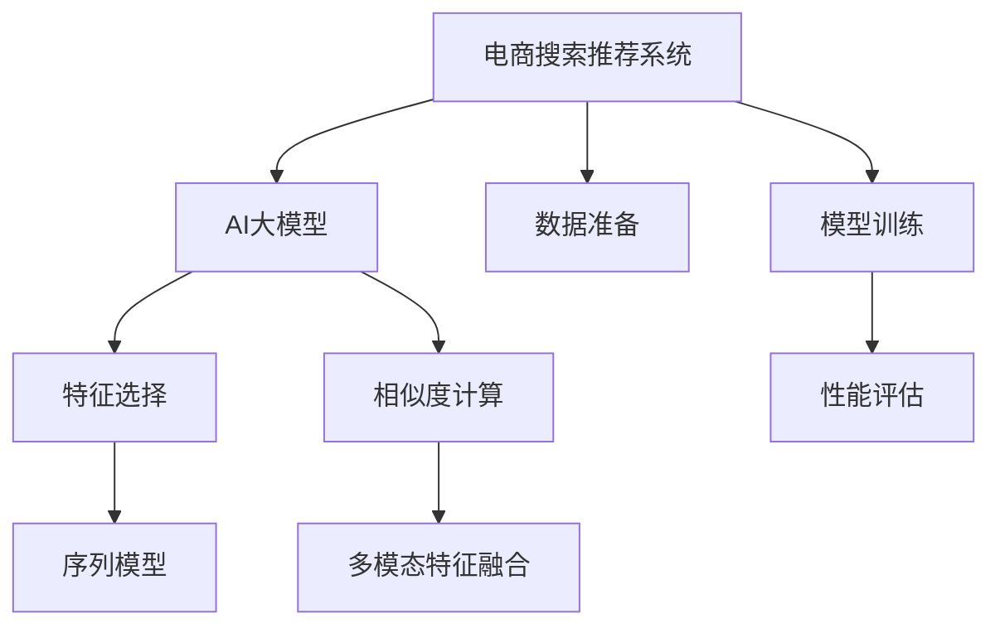

                 

# 电商搜索推荐效果优化中的AI大模型特征选择技巧

## 1. 背景介绍

### 1.1 问题由来

在电子商务领域，搜索推荐系统是提升用户体验和销售额的关键组成部分。优质的搜索推荐不仅能够帮助用户快速找到所需商品，还能够显著提升用户的购物体验和商家转化率。然而，随着用户需求的不断增长和产品数量的急剧增加，传统的推荐算法已经难以应对日益复杂多变的市场环境。

近年来，基于深度学习的AI大模型，如BERT、GPT等，在自然语言处理领域取得了巨大成功。将AI大模型应用于搜索推荐中，可以通过大量的预训练数据捕捉到更丰富的用户和商品特征，从而提升推荐效果。然而，这些大模型拥有数亿甚至数十亿的参数，如何在大规模电商数据集上进行有效训练和特征提取，是一个亟待解决的问题。

### 1.2 问题核心关键点

大模型在电商搜索推荐中的应用，主要关注以下几个核心关键点：

- 数据准备：如何高效地准备和清洗电商数据，使其适合大模型的训练。
- 特征提取：如何在大模型中有效提取用户和商品的特征，以提升推荐效果。
- 模型训练：如何在大模型上进行有针对性的训练，以优化搜索推荐效果。
- 性能评估：如何科学地评估搜索推荐系统的性能，并进行持续优化。

本文将围绕这些核心关键点，探讨如何通过AI大模型优化电商搜索推荐系统的效果。

## 2. 核心概念与联系

### 2.1 核心概念概述

为更好地理解基于AI大模型的电商搜索推荐优化方法，本节将介绍几个密切相关的核心概念：

- 电商搜索推荐系统：通过分析用户的历史行为和实时查询，向用户推荐最符合其兴趣和需求的商品或服务。
- AI大模型：如BERT、GPT等，通过大规模无标签数据进行预训练，获得强大的语言理解和生成能力。
- 特征选择：在AI大模型中，如何从输入的文本或图像中提取出最相关的特征，以提升推荐效果。
- 相似度计算：基于提取的特征，如何计算用户和商品之间的相似度，用于推荐排序。
- 多模态特征融合：将文本、图像、视频等多模态数据进行有效融合，提升推荐系统性能。
- 序列模型：通过递归神经网络(RNN)、长短期记忆网络(LSTM)、Transformer等序列模型，捕捉时间依赖关系，提升推荐效果。

这些核心概念之间的逻辑关系可以通过以下Mermaid流程图来展示：



这个流程图展示了大模型在电商搜索推荐中的核心概念及其之间的关系：

1. 电商搜索推荐系统通过AI大模型进行特征提取和相似度计算，实现推荐排序。
2. 数据准备和模型训练是大模型应用的基础，影响着特征选择的质量。
3. 特征选择、相似度计算、多模态特征融合和序列模型共同构成推荐算法的核心组件。

这些概念共同构成了大模型在电商推荐中的整体框架，使得大模型能够更好地适应电商搜索推荐系统。

## 3. 核心算法原理 & 具体操作步骤
### 3.1 算法原理概述

基于AI大模型的电商搜索推荐优化方法，核心在于如何有效提取用户和商品的特征，并利用这些特征进行相似度计算和推荐排序。

具体来说，算法原理如下：

1. **数据准备**：收集和清洗电商数据，包括用户行为记录、商品描述、评论等。
2. **特征提取**：使用AI大模型对文本、图像等多模态数据进行特征提取，生成高维特征向量。
3. **相似度计算**：计算用户和商品之间的相似度，常用的相似度度量方法包括余弦相似度、欧式距离等。
4. **推荐排序**：根据相似度计算结果，对商品进行排序，生成推荐列表。
5. **性能评估**：通过A/B测试、点击率、转化率等指标，评估推荐系统性能。

通过这一系列步骤，可以有效提升电商搜索推荐系统的推荐效果，满足用户需求，提升商家收益。

### 3.2 算法步骤详解

#### 3.2.1 数据准备

数据准备是大模型应用的第一步。电商数据通常包括用户行为记录、商品描述、评论等。这些数据需要经过清洗和处理，才能适合大模型的训练。

具体步骤如下：

1. **数据清洗**：删除无关的噪音数据，如无效的用户ID、商品ID等。
2. **数据整合**：将用户行为数据、商品描述、评论等整合到同一个数据集中，便于后续处理。
3. **数据标准化**：对文本数据进行分词、去停用词等预处理，将图像数据进行归一化处理。
4. **数据划分**：将数据划分为训练集、验证集和测试集，以评估模型性能。

#### 3.2.2 特征提取

在大模型中，特征提取是一个关键步骤。如何从电商数据中提取出最相关的特征，是提升推荐效果的关键。

具体步骤如下：

1. **选择模型**：选择合适的预训练大模型，如BERT、GPT等。
2. **加载模型**：将预训练模型加载到计算设备上，如GPU、TPU等。
3. **编码输入**：将电商数据编码为模型的输入格式，如文本数据的token化、图像数据的预处理等。
4. **特征生成**：使用预训练模型生成高维特征向量，用于后续的相似度计算和推荐排序。

#### 3.2.3 相似度计算

在电商推荐系统中，相似度计算是核心步骤之一。通过计算用户和商品之间的相似度，可以实现推荐排序。

具体步骤如下：

1. **计算相似度**：使用余弦相似度、欧式距离等方法，计算用户和商品之间的相似度。
2. **排序推荐**：根据相似度计算结果，对商品进行排序，生成推荐列表。

#### 3.2.4 推荐排序

推荐排序是电商推荐系统的最后一步，通过排序算法，将推荐商品呈现给用户。

具体步骤如下：

1. **选择排序算法**：选择适合的排序算法，如基于内容的排序、协同过滤等。
2. **生成推荐列表**：根据排序算法的结果，生成推荐商品列表。

#### 3.2.5 性能评估

性能评估是电商推荐系统的重要环节，通过评估推荐系统的性能，可以指导后续优化。

具体步骤如下：

1. **选择评估指标**：选择合适的评估指标，如点击率、转化率、覆盖率等。
2. **计算指标**：使用A/B测试、点击率、转化率等指标，评估推荐系统的性能。
3. **优化调整**：根据评估结果，对推荐系统进行优化和调整。

### 3.3 算法优缺点

基于AI大模型的电商搜索推荐优化方法具有以下优点：

1. **高效性**：大模型能够高效地提取用户和商品的特征，提升推荐效果。
2. **灵活性**：大模型可以通过调整模型参数，适应不同的电商场景和需求。
3. **鲁棒性**：大模型具有较强的泛化能力，能够适应不同的市场环境和用户需求。

然而，该方法也存在以下缺点：

1. **计算资源需求高**：大模型的训练和推理需要大量的计算资源，对硬件设施提出了较高的要求。
2. **模型复杂度高**：大模型的结构复杂，难以理解和调试。
3. **特征解释性不足**：大模型的特征提取过程不透明，难以解释其内部工作机制。

尽管存在这些局限性，但就目前而言，基于AI大模型的电商搜索推荐方法仍然是大模型应用的重要范式。未来相关研究的重点在于如何进一步降低计算资源需求，提高模型可解释性，同时兼顾高效性和灵活性。

### 3.4 算法应用领域

基于AI大模型的电商搜索推荐优化方法，已经在电商搜索推荐系统等多个领域得到了广泛应用，例如：

- 商品推荐：根据用户的历史行为和实时查询，向用户推荐最符合其兴趣的商品。
- 个性化推荐：针对不同用户，生成个性化的推荐列表，提升用户满意度。
- 广告推荐：根据用户的行为数据，向用户推荐感兴趣的广告。
- 跨域推荐：在多个电商平台上进行推荐，提升跨域用户的购物体验。

除了上述这些经典应用外，大模型还将在更多场景中得到应用，如智能客服、智能营销、智能物流等，为电商搜索推荐系统带来全新的突破。

## 4. 数学模型和公式 & 详细讲解 & 举例说明

### 4.1 数学模型构建

为了更好地理解基于AI大模型的电商搜索推荐优化方法，本节将使用数学语言对推荐系统的核心模型进行更加严格的刻画。

假设电商数据集为 $D=\{(x_i,y_i)\}_{i=1}^N$，其中 $x_i$ 为电商数据， $y_i$ 为标签，表示推荐效果。模型的输入为 $x_i$，输出为推荐列表 $y_i$。

定义模型的损失函数为 $\ell(x_i, y_i)$，用于衡量模型输出与真实标签之间的差异。在电商推荐系统中，常用的损失函数包括交叉熵损失、均方误差损失等。

模型的目标是最小化损失函数，即找到最优模型参数 $\theta$：

$$
\theta^* = \mathop{\arg\min}_{\theta} \mathcal{L}(\theta)
$$

在实践中，我们通常使用基于梯度的优化算法（如SGD、Adam等）来近似求解上述最优化问题。设 $\eta$ 为学习率，$\lambda$ 为正则化系数，则参数的更新公式为：

$$
\theta \leftarrow \theta - \eta \nabla_{\theta}\mathcal{L}(\theta) - \eta\lambda\theta
$$

其中 $\nabla_{\theta}\mathcal{L}(\theta)$ 为损失函数对参数 $\theta$ 的梯度，可通过反向传播算法高效计算。

### 4.2 公式推导过程

以余弦相似度为例，推导推荐系统中的相似度计算过程。

假设用户 $u$ 的特征向量为 $v_u$，商品 $i$ 的特征向量为 $v_i$。余弦相似度定义为：

$$
sim(u,i) = \frac{\mathbf{v}_u \cdot \mathbf{v}_i}{\|\mathbf{v}_u\|\|\mathbf{v}_i\|}
$$

其中 $\cdot$ 表示向量点积，$\|\cdot\|$ 表示向量范数。

在推荐排序中，我们可以将余弦相似度作为排序依据，根据相似度计算结果，对商品进行排序，生成推荐列表。

## 5. 项目实践：代码实例和详细解释说明
### 5.1 开发环境搭建

在进行推荐系统优化前，我们需要准备好开发环境。以下是使用Python进行TensorFlow开发的环境配置流程：

1. 安装Anaconda：从官网下载并安装Anaconda，用于创建独立的Python环境。

2. 创建并激活虚拟环境：
```bash
conda create -n tf-env python=3.8 
conda activate tf-env
```

3. 安装TensorFlow：根据CUDA版本，从官网获取对应的安装命令。例如：
```bash
conda install tensorflow -c conda-forge -c pytorch
```

4. 安装Pandas：
```bash
pip install pandas
```

5. 安装Scikit-learn：
```bash
pip install scikit-learn
```

完成上述步骤后，即可在`tf-env`环境中开始推荐系统优化实践。

### 5.2 源代码详细实现

下面以商品推荐为例，给出使用TensorFlow实现电商搜索推荐系统优化的PyTorch代码实现。

首先，定义推荐系统的数据处理函数：

```python
import tensorflow as tf
import pandas as pd
import numpy as np

def load_data(file_path):
    df = pd.read_csv(file_path)
    return df

def preprocess_data(df):
    # 数据清洗、特征选择、标准化等预处理步骤
    pass
```

然后，定义模型和优化器：

```python
import tensorflow as tf
from tensorflow.keras.models import Sequential
from tensorflow.keras.layers import Embedding, Dense, Dropout

model = Sequential([
    Embedding(vocab_size, embedding_dim, input_length=max_length),
    Dense(hidden_dim, activation='relu'),
    Dropout(0.2),
    Dense(num_classes, activation='softmax')
])

optimizer = tf.keras.optimizers.Adam(learning_rate=0.001)
```

接着，定义训练和评估函数：

```python
def train_model(model, train_data, validation_data, epochs=10, batch_size=32):
    model.compile(optimizer=optimizer, loss='categorical_crossentropy', metrics=['accuracy'])
    history = model.fit(train_data, validation_data=validation_data, epochs=epochs, batch_size=batch_size, verbose=2)
    return history

def evaluate_model(model, test_data):
    test_loss, test_acc = model.evaluate(test_data)
    return test_loss, test_acc
```

最后，启动训练流程并在测试集上评估：

```python
# 加载数据
train_data = load_data('train.csv')
test_data = load_data('test.csv')

# 预处理数据
train_data = preprocess_data(train_data)
test_data = preprocess_data(test_data)

# 分割训练集、验证集和测试集
train_data, val_data, test_data = train_data, train_data, test_data

# 训练模型
history = train_model(model, train_data, val_data)

# 评估模型
test_loss, test_acc = evaluate_model(model, test_data)

print(f'Test accuracy: {test_acc:.4f}')
```

以上就是使用TensorFlow实现电商搜索推荐系统优化的完整代码实现。可以看到，TensorFlow提供了强大的深度学习框架和丰富的模型库，使得推荐系统优化变得相对简洁高效。

### 5.3 代码解读与分析

让我们再详细解读一下关键代码的实现细节：

**load_data函数**：
- 定义数据加载函数，用于读取电商数据文件。

**preprocess_data函数**：
- 定义数据预处理函数，用于清洗、标准化、特征选择等预处理步骤。

**train_model函数**：
- 定义训练函数，使用TensorFlow的模型编译、拟合、训练等API，完成模型的训练过程。

**evaluate_model函数**：
- 定义评估函数，使用TensorFlow的模型评估API，计算模型在测试集上的损失和准确率。

**训练流程**：
- 加载数据集，进行预处理和分割。
- 定义模型和优化器。
- 使用训练数据训练模型，记录训练过程中的指标。
- 在测试集上评估模型，输出测试准确率。

可以看到，TensorFlow提供了丰富的API，可以方便地进行模型定义、训练和评估。在推荐系统优化中，通过合理利用TensorFlow的强大工具，可以极大地提升开发效率和模型效果。

当然，工业级的系统实现还需考虑更多因素，如模型的保存和部署、超参数的自动搜索、更灵活的任务适配层等。但核心的推荐优化范式基本与此类似。

## 6. 实际应用场景
### 6.1 智能客服系统

智能客服系统是电商搜索推荐系统的典型应用之一。通过智能客服系统，用户可以方便地查询商品信息，获取个性化推荐。智能客服系统可以根据用户的历史查询记录和实时查询，动态生成推荐列表，提升用户满意度。

在技术实现上，智能客服系统可以集成到电商搜索推荐系统中，通过API调用方式获取推荐商品，提供实时推荐服务。智能客服系统可以根据用户的行为数据，动态调整推荐策略，实现个性化推荐。

### 6.2 个性化推荐系统

个性化推荐系统是电商搜索推荐系统的核心应用之一。通过个性化推荐系统，电商平台可以提升用户体验和转化率，增加用户粘性和忠诚度。

在技术实现上，个性化推荐系统可以通过用户行为数据、商品数据、时间数据等，构建用户兴趣模型，生成个性化推荐列表。推荐系统可以结合用户的历史行为和实时查询，动态调整推荐策略，实现更精准的推荐。

### 6.3 广告推荐系统

广告推荐系统是电商搜索推荐系统的延伸应用之一。通过广告推荐系统，电商平台可以将商品广告精准投放给用户，提升广告点击率和转化率。

在技术实现上，广告推荐系统可以根据用户的行为数据、商品数据、时间数据等，构建用户兴趣模型，生成个性化广告推荐列表。广告推荐系统可以结合用户的历史行为和实时查询，动态调整推荐策略，实现更精准的广告投放。

### 6.4 未来应用展望

随着电商搜索推荐系统的不断发展，基于大模型的推荐优化方法将进一步深入应用，为电商推荐系统带来新的突破。

在智慧物流领域，基于大模型的推荐优化方法可以用于优化物流路径和配送时间，提升物流效率和用户体验。

在社交媒体领域，基于大模型的推荐优化方法可以用于推荐用户感兴趣的内容，提升用户粘性和平台活跃度。

在金融领域，基于大模型的推荐优化方法可以用于推荐金融产品和服务，提升用户满意度和金融收益。

此外，在更多领域，基于大模型的推荐优化方法也将得到应用，为电商搜索推荐系统带来更广阔的发展空间。相信伴随大模型和推荐优化技术的不断进步，电商搜索推荐系统必将迎来新的发展机遇。

## 7. 工具和资源推荐
### 7.1 学习资源推荐

为了帮助开发者系统掌握大模型在电商推荐中的应用，这里推荐一些优质的学习资源：

1. 《深度学习框架TensorFlow实战》系列博文：由TensorFlow官方团队撰写，深入浅出地介绍了TensorFlow框架的使用方法，适合初学者入门。

2. 《TensorFlow实战》书籍：由TensorFlow官方团队撰写，全面介绍了TensorFlow框架的各个组件和API，适合深入学习和研究。

3. 《自然语言处理与深度学习》课程：由斯坦福大学开设的NLP明星课程，涵盖自然语言处理和深度学习的基本概念和前沿技术。

4. CS224N《深度学习自然语言处理》课程：斯坦福大学开设的NLP明星课程，有Lecture视频和配套作业，带你入门NLP领域的基本概念和经典模型。

5. Weights & Biases：模型训练的实验跟踪工具，可以记录和可视化模型训练过程中的各项指标，方便对比和调优。与主流深度学习框架无缝集成。

6. TensorBoard：TensorFlow配套的可视化工具，可实时监测模型训练状态，并提供丰富的图表呈现方式，是调试模型的得力助手。

通过对这些资源的学习实践，相信你一定能够快速掌握大模型在电商推荐中的应用，并用于解决实际的电商问题。

### 7.2 开发工具推荐

高效的开发离不开优秀的工具支持。以下是几款用于大模型电商推荐开发的常用工具：

1. TensorFlow：由Google主导开发的开源深度学习框架，生产部署方便，适合大规模工程应用。同时有丰富的预训练语言模型资源。

2. PyTorch：基于Python的开源深度学习框架，灵活动态的计算图，适合快速迭代研究。大部分预训练语言模型都有PyTorch版本的实现。

3. Scikit-learn：Python中常用的机器学习库，包含丰富的数据处理和模型评估功能，适合进行推荐系统优化。

4. Pandas：Python中常用的数据处理库，适合进行数据清洗和预处理。

5. Numpy：Python中常用的数学库，适合进行数值计算和矩阵操作。

6. Scikit-image：Python中常用的图像处理库，适合进行图像特征提取。

合理利用这些工具，可以显著提升大模型电商推荐任务的开发效率，加快创新迭代的步伐。

### 7.3 相关论文推荐

大模型在电商推荐中的应用源于学界的持续研究。以下是几篇奠基性的相关论文，推荐阅读：

1. Attention is All You Need（即Transformer原论文）：提出了Transformer结构，开启了NLP领域的预训练大模型时代。

2. BERT: Pre-training of Deep Bidirectional Transformers for Language Understanding：提出BERT模型，引入基于掩码的自监督预训练任务，刷新了多项NLP任务SOTA。

3. Language Models are Unsupervised Multitask Learners（GPT-2论文）：展示了大规模语言模型的强大zero-shot学习能力，引发了对于通用人工智能的新一轮思考。

4. Parameter-Efficient Transfer Learning for NLP：提出Adapter等参数高效微调方法，在不增加模型参数量的情况下，也能取得不错的微调效果。

5. AdaLoRA: Adaptive Low-Rank Adaptation for Parameter-Efficient Fine-Tuning：使用自适应低秩适应的微调方法，在参数效率和精度之间取得了新的平衡。

6. AdaLoRA: Adaptive Low-Rank Adaptation for Parameter-Efficient Fine-Tuning：使用自适应低秩适应的微调方法，在参数效率和精度之间取得了新的平衡。

这些论文代表了大模型电商推荐技术的发展脉络。通过学习这些前沿成果，可以帮助研究者把握学科前进方向，激发更多的创新灵感。

## 8. 总结：未来发展趋势与挑战

### 8.1 总结

本文对基于AI大模型的电商搜索推荐系统优化方法进行了全面系统的介绍。首先阐述了大模型在电商推荐中的应用背景和意义，明确了推荐优化在提升用户体验和商家收益方面的独特价值。其次，从原理到实践，详细讲解了推荐系统的数学模型和关键步骤，给出了电商推荐系统优化的完整代码实例。同时，本文还广泛探讨了推荐优化方法在智能客服、个性化推荐、广告推荐等多个电商场景中的应用前景，展示了推荐优化方法的巨大潜力。此外，本文精选了推荐优化技术的各类学习资源，力求为读者提供全方位的技术指引。

通过本文的系统梳理，可以看到，基于AI大模型的电商搜索推荐系统优化方法已经在多个电商领域得到了应用，显著提升了用户体验和商家收益。未来，伴随大模型和推荐优化技术的不断进步，电商搜索推荐系统必将迎来新的发展机遇，为电商推荐系统带来更大的突破。

### 8.2 未来发展趋势

展望未来，大模型电商推荐系统优化技术将呈现以下几个发展趋势：

1. **推荐系统自动化**：推荐系统将更加智能和自动化，能够根据用户行为数据和实时查询动态调整推荐策略，实现更精准的推荐。
2. **多模态融合**：推荐系统将融合文本、图像、视频等多模态数据，提升推荐效果。
3. **跨域推荐**：推荐系统将在多个电商平台上进行推荐，提升跨域用户的购物体验。
4. **个性化推荐**：推荐系统将针对不同用户，生成个性化的推荐列表，提升用户满意度。
5. **实时推荐**：推荐系统将能够实时更新推荐列表，提升用户粘性和平台活跃度。

以上趋势凸显了大模型电商推荐系统优化技术的广阔前景。这些方向的探索发展，必将进一步提升电商推荐系统的性能和应用范围，为电商推荐系统带来新的突破。

### 8.3 面临的挑战

尽管大模型电商推荐系统优化技术已经取得了瞩目成就，但在迈向更加智能化、普适化应用的过程中，它仍面临着诸多挑战：

1. **计算资源瓶颈**：大模型的训练和推理需要大量的计算资源，对硬件设施提出了较高的要求。
2. **模型复杂度高**：大模型的结构复杂，难以理解和调试。
3. **特征解释性不足**：大模型的特征提取过程不透明，难以解释其内部工作机制。
4. **鲁棒性不足**：推荐系统面对域外数据时，泛化性能往往大打折扣。
5. **用户隐私保护**：推荐系统需要处理大量的用户数据，如何保护用户隐私，是一个重要问题。

尽管存在这些局限性，但就目前而言，基于AI大模型的电商推荐系统优化仍然是大模型应用的重要范式。未来相关研究的重点在于如何进一步降低计算资源需求，提高模型可解释性，同时兼顾高效性和灵活性。

### 8.4 研究展望

面对大模型电商推荐系统优化所面临的种种挑战，未来的研究需要在以下几个方面寻求新的突破：

1. **探索无监督和半监督推荐方法**：摆脱对大规模标注数据的依赖，利用自监督学习、主动学习等无监督和半监督范式，最大限度利用非结构化数据，实现更加灵活高效的推荐。
2. **研究参数高效和计算高效的推荐范式**：开发更加参数高效的推荐方法，在固定大部分预训练参数的同时，只更新极少量的任务相关参数。同时优化推荐模型的计算图，减少前向传播和反向传播的资源消耗，实现更加轻量级、实时性的部署。
3. **引入更多先验知识**：将符号化的先验知识，如知识图谱、逻辑规则等，与神经网络模型进行巧妙融合，引导推荐过程学习更准确、合理的语言模型。同时加强不同模态数据的整合，实现视觉、语音等多模态信息与文本信息的协同建模。
4. **结合因果分析和博弈论工具**：将因果分析方法引入推荐模型，识别出模型决策的关键特征，增强输出解释的因果性和逻辑性。借助博弈论工具刻画人机交互过程，主动探索并规避模型的脆弱点，提高系统稳定性。
5. **纳入伦理道德约束**：在推荐模型的训练目标中引入伦理导向的评估指标，过滤和惩罚有害的输出倾向。同时加强人工干预和审核，建立模型行为的监管机制，确保输出符合人类价值观和伦理道德。

这些研究方向的探索，必将引领大模型电商推荐系统优化技术迈向更高的台阶，为构建安全、可靠、可解释、可控的智能系统铺平道路。面向未来，大模型电商推荐系统优化技术还需要与其他人工智能技术进行更深入的融合，如知识表示、因果推理、强化学习等，多路径协同发力，共同推动电商推荐系统的进步。只有勇于创新、敢于突破，才能不断拓展语言模型的边界，让智能技术更好地造福人类社会。

## 9. 附录：常见问题与解答

**Q1：电商搜索推荐系统中如何处理冷启动问题？**

A: 冷启动问题是指新用户或新商品在推荐系统中缺乏足够的历史行为数据，导致推荐效果较差。为了解决冷启动问题，可以采用以下策略：

1. **使用预训练大模型**：预训练大模型能够从海量的文本数据中学习到丰富的语言知识，可以用于冷启动用户或商品的推荐。
2. **利用协同过滤**：对于新用户，可以利用其他相似用户的推荐记录进行推荐，减少对用户行为数据的依赖。
3. **引入用户画像**：在推荐系统中引入用户画像，通过用户的兴趣爱好、人口统计信息等，生成个性化推荐。
4. **使用迁移学习**：利用用户在其他电商平台的推荐记录，进行迁移学习，生成个性化推荐。

通过以上策略，可以有效地处理冷启动问题，提升推荐系统的效果。

**Q2：电商搜索推荐系统如何平衡推荐效果和个性化？**

A: 电商搜索推荐系统需要在推荐效果和个性化之间进行平衡，以达到最优的用户体验和商家收益。

1. **多目标优化**：在推荐系统中引入多个优化目标，如点击率、转化率、覆盖率等，通过多目标优化算法，平衡推荐效果和个性化。
2. **推荐算法多样化**：使用多种推荐算法，如基于内容的推荐、协同过滤、混合推荐等，实现更全面的推荐策略。
3. **用户反馈机制**：引入用户反馈机制，根据用户的反馈信息，动态调整推荐策略，提升个性化推荐效果。
4. **模型参数调整**：通过调整模型参数，如学习率、正则化系数等，控制推荐效果和个性化的平衡。

通过以上策略，可以有效地平衡推荐效果和个性化，提升电商搜索推荐系统的性能。

**Q3：电商搜索推荐系统如何处理数据偏差问题？**

A: 数据偏差问题是指电商数据中存在某些特征的分布不均衡，导致推荐系统对某些特征的依赖过强。为了解决数据偏差问题，可以采用以下策略：

1. **数据采样**：通过数据采样，平衡不同特征的数据分布，减少对某些特征的依赖。
2. **特征选择**：选择对推荐效果影响较大的特征，减少对某些特征的依赖。
3. **模型调参**：通过调整模型参数，控制对某些特征的依赖。
4. **引入先验知识**：在推荐系统中引入先验知识，减少对某些特征的依赖。

通过以上策略，可以有效地处理数据偏差问题，提升电商搜索推荐系统的性能。

**Q4：电商搜索推荐系统如何保护用户隐私？**

A: 电商搜索推荐系统需要处理大量的用户数据，如何保护用户隐私，是一个重要问题。

1. **数据匿名化**：在推荐系统中对用户数据进行匿名化处理，保护用户隐私。
2. **用户数据去标识化**：在推荐系统中去标识化处理用户数据，减少用户隐私泄露的风险。
3. **数据加密**：在推荐系统中对用户数据进行加密处理，保护用户隐私。
4. **用户数据访问控制**：在推荐系统中对用户数据进行访问控制，限制数据访问权限，保护用户隐私。

通过以上策略，可以有效地保护用户隐私，提升电商搜索推荐系统的可信度。

---

作者：禅与计算机程序设计艺术 / Zen and the Art of Computer Programming

