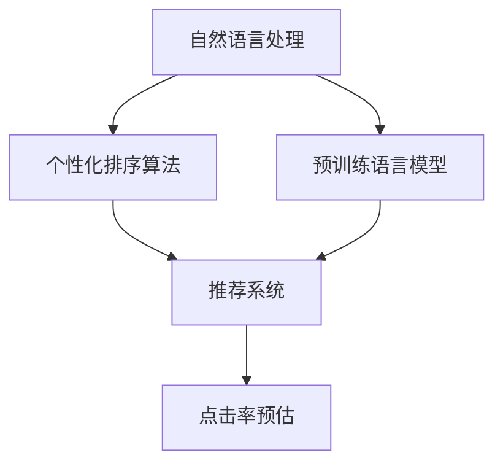

                 

## 1. 背景介绍

### 1.1 问题由来

电商平台的搜索结果排序直接影响了用户购物体验和平台转化率。传统的搜索结果排序算法主要依赖于搜索关键词、商品评分、历史行为数据等信号，缺乏对用户个性化需求的考量。近年来，随着大模型技术的兴起，AI大模型在电商搜索结果排序中逐渐被引入。

大模型通过海量的无标签文本数据进行预训练，学习到丰富的语言和知识表示，可以应用于多个自然语言处理任务。将其引入电商搜索排序，可以更好地理解用户搜索意图，自动生成更为精准的个性化排序结果，提升平台的用户体验和搜索效率。

### 1.2 问题核心关键点

电商搜索结果排序的核心在于如何结合用户行为数据、搜索意图和商品信息，生成个性化的排序结果。其中，AI大模型扮演了关键角色：

- 预训练语言模型：通过大规模无标签文本数据预训练，学习到通用的语言表示。
- 个性化排序算法：结合用户行为和搜索意图，自动生成个性化排序结果。
- 推荐系统：集成个性化排序算法与电商行为数据，实现智能推荐。

这些核心组件相互配合，构成了电商搜索排序的AI大模型方案。

## 2. 核心概念与联系

### 2.1 核心概念概述

为更好地理解电商搜索排序的AI大模型方案，本节将介绍几个密切相关的核心概念：

- 自然语言处理（NLP）：利用AI大模型处理和理解自然语言的能力，将用户搜索意图转化为算法可操作的形式。
- 预训练语言模型：通过大规模无标签文本数据预训练，学习到通用的语言表示。
- 推荐系统：通过结合用户行为和商品信息，实现智能推荐。
- 个性化排序算法：结合用户行为和搜索意图，自动生成个性化排序结果。
- 点击率预估：通过机器学习模型预测用户点击某商品的概率，用于排序优化。

这些核心概念之间的逻辑关系可以通过以下Mermaid流程图来展示：



这个流程图展示了大模型方案的核心概念及其之间的关系：

1. 自然语言处理将用户搜索意图转化为算法可操作的形式。
2. 预训练语言模型通过大规模无标签文本数据预训练，学习到通用的语言表示。
3. 个性化排序算法结合用户行为和搜索意图，自动生成个性化排序结果。
4. 推荐系统集成个性化排序算法与电商行为数据，实现智能推荐。
5. 点击率预估通过机器学习模型预测用户点击某商品的概率，用于排序优化。

这些核心概念共同构成了电商搜索结果排序的AI大模型方案，使其能够更好地理解用户搜索意图，自动生成更为精准的个性化排序结果。

## 3. 核心算法原理 & 具体操作步骤
### 3.1 算法原理概述

电商搜索结果排序的AI大模型方案，基于监督学习进行个性化排序。其核心思想是：将预训练大模型作为特征提取器，通过结合用户行为数据和搜索意图，生成个性化排序结果。

具体来说，可以采用如下步骤：

1. 收集用户搜索行为数据，包括搜索关键词、点击历史、浏览记录等。
2. 使用预训练语言模型对用户搜索意图进行理解，生成搜索意图表示。
3. 结合用户行为数据，通过机器学习模型训练个性化排序算法。
4. 集成个性化排序算法与电商行为数据，实现智能推荐。
5. 使用点击率预估模型，优化搜索结果排序。

### 3.2 算法步骤详解

电商搜索结果排序的AI大模型方案包括以下关键步骤：

**Step 1: 数据准备**

- 收集用户搜索行为数据，包括搜索关键词、点击历史、浏览记录等。
- 选择适当的预训练语言模型，如BERT、GPT等，用于提取用户搜索意图。

**Step 2: 特征提取**

- 使用预训练语言模型对用户搜索关键词进行编码，生成意图表示。
- 将意图表示与用户行为数据拼接，生成输入特征。

**Step 3: 训练个性化排序算法**

- 选择适当的机器学习模型，如GBDT、XGBoost等，用于训练个性化排序算法。
- 将输入特征作为模型训练数据，标记用户点击历史为标签，训练个性化排序算法。

**Step 4: 集成推荐系统**

- 将个性化排序算法与电商行为数据集成，生成推荐结果。
- 使用点击率预估模型，优化搜索结果排序，提升用户体验。

**Step 5: 部署与应用**

- 将训练好的模型部署到电商搜索系统中，实时计算并返回个性化搜索结果。
- 根据用户反馈和数据反馈，持续优化模型和算法。

以上是电商搜索结果排序的AI大模型方案的一般流程。在实际应用中，还需要根据具体任务和数据特点，对模型进行优化和调整。

### 3.3 算法优缺点

电商搜索结果排序的AI大模型方案具有以下优点：

1. 准确性高：利用大模型学习到的丰富语言表示，能够更好地理解用户搜索意图和行为。
2. 自适应性强：能够自动适应不同用户和场景的个性化需求，提升用户体验。
3. 可扩展性好：模型结构灵活，可以适应多种排序算法和推荐策略。

同时，该方案也存在一些局限性：

1. 数据需求高：需要大量用户行为数据进行训练和优化，难以在数据量较少的场景下取得理想效果。
2. 模型复杂度高：大模型的计算和存储资源消耗较大，需要高性能计算设备支持。
3. 难以解释：大模型的内部决策过程复杂，难以解释和调试。
4. 存在偏见：大模型可能存在数据偏见，导致排序结果存在不公平或歧视。

尽管存在这些局限性，但就目前而言，基于AI大模型的电商搜索结果排序方案已在大规模应用中取得了显著效果，成为电商平台提升搜索体验的重要手段。

### 3.4 算法应用领域

电商搜索结果排序的AI大模型方案，已经在多个电商平台中得到了广泛应用，例如：

- 京东：使用AI大模型进行商品推荐和搜索结果排序，提升了用户购物体验和转化率。
- 淘宝：利用大模型优化搜索排序算法，提高了搜索精度和效率。
- 拼多多：采用AI大模型进行个性化推荐和搜索结果排序，优化了用户购物体验。

除了电商搜索排序，AI大模型还被创新性地应用于更多场景中，如智能客服、广告投放、智能广告创意生成等，为电商平台的数字化转型带来了新的发展动力。

## 4. 数学模型和公式 & 详细讲解 & 举例说明

### 4.1 数学模型构建

本节将使用数学语言对电商搜索结果排序的AI大模型方案进行更加严格的刻画。

记用户搜索行为数据为 $D=\{(x_i,y_i)\}_{i=1}^N, x_i=(k_i,h_i,r_i), k_i$ 表示搜索关键词，$h_i$ 表示点击历史，$r_i$ 表示浏览记录，$y_i$ 表示是否点击。

定义用户搜索意图表示为 $I_i=M_{\theta}(k_i)$，其中 $M_{\theta}$ 为预训练语言模型。

将搜索意图表示与用户行为数据拼接，生成输入特征 $F_i=[I_i,h_i,r_i]$。

假设个性化排序算法为 $F_k(X_i,F_i)$，其中 $X_i$ 表示电商行为数据，$F_k(X_i,F_i)$ 表示排序算法对电商行为数据和用户行为数据的预测结果。

最终的个性化排序结果为 $R_i=\mathop{\arg\min}_{k \in K} F_k(X_i,F_i)$，其中 $K$ 表示排序算法的候选集。

### 4.2 公式推导过程

以排序算法为GBDT为例，推导个性化排序算法的优化目标函数。

假设GBDT模型为 $F_k(X_i,F_i)=\sum_{t=1}^T f_k^t(X_i,F_i)$，其中 $f_k^t$ 为第 $t$ 层的预测结果。

根据排序目标，可以定义损失函数为：

$$
L(F_k)=\sum_{i=1}^N \max (y_i f_k^1(X_i,F_i) - (1-y_i) f_k^2(X_i,F_i),0) + \lambda ||f_k^2 - f_k^1||^2
$$

其中，$y_i f_k^1(X_i,F_i) - (1-y_i) f_k^2(X_i,F_i)$ 表示模型的预测结果与标签的差异，$\lambda ||f_k^2 - f_k^1||^2$ 表示模型复杂度正则化。

通过梯度下降算法，优化目标函数：

$$
\min_{F_k} L(F_k)
$$

得到GBDT模型的参数 $f_k^t$。

### 4.3 案例分析与讲解

以京东电商为例，展示AI大模型方案在京东中的应用。

京东采用预训练语言模型BERT对用户搜索关键词进行编码，生成搜索意图表示 $I_i$。

将 $I_i$ 与用户点击历史 $h_i$ 和浏览记录 $r_i$ 拼接，生成输入特征 $F_i=[I_i,h_i,r_i]$。

使用GBDT模型 $F_k(X_i,F_i)$ 对电商行为数据和输入特征进行预测，生成排序结果。

将排序结果与用户点击历史 $y_i$ 进行对比，生成损失函数，并使用梯度下降算法进行优化。

最终得到的个性化排序结果，用于优化搜索结果排序，提升用户体验。

## 5. 项目实践：代码实例和详细解释说明

### 5.1 开发环境搭建

在进行电商搜索结果排序的AI大模型方案实践前，我们需要准备好开发环境。以下是使用Python进行PyTorch开发的环境配置流程：

1. 安装Anaconda：从官网下载并安装Anaconda，用于创建独立的Python环境。

2. 创建并激活虚拟环境：
```bash
conda create -n pytorch-env python=3.8 
conda activate pytorch-env
```

3. 安装PyTorch：根据CUDA版本，从官网获取对应的安装命令。例如：
```bash
conda install pytorch torchvision torchaudio cudatoolkit=11.1 -c pytorch -c conda-forge
```

4. 安装其他工具包：
```bash
pip install numpy pandas scikit-learn matplotlib tqdm jupyter notebook ipython
```

完成上述步骤后，即可在`pytorch-env`环境中开始AI大模型方案的实践。

### 5.2 源代码详细实现

下面我们以京东电商为例，给出使用PyTorch进行AI大模型方案开发的PyTorch代码实现。

首先，定义数据处理函数：

```python
from transformers import BertTokenizer
from torch.utils.data import Dataset
import torch

class SearchDataset(Dataset):
    def __init__(self, texts, clicks, browses, labels, tokenizer, max_len=128):
        self.texts = texts
        self.clicks = clicks
        self.browses = browses
        self.labels = labels
        self.tokenizer = tokenizer
        self.max_len = max_len
        
    def __len__(self):
        return len(self.texts)
    
    def __getitem__(self, item):
        text = self.texts[item]
        click = self.clicks[item]
        browse = self.browses[item]
        label = self.labels[item]
        
        encoding = self.tokenizer(text, return_tensors='pt', max_length=self.max_len, padding='max_length', truncation=True)
        input_ids = encoding['input_ids'][0]
        attention_mask = encoding['attention_mask'][0]
        click_ids = click_ids_to_ids(click)
        browse_ids = browse_ids_to_ids(browse)
        label_ids = label_to_ids(label)
        
        # 对token-wise的标签进行编码
        encoded_clicks = [click_ids[_id] for _id in click] 
        encoded_clicks.extend([click_ids['O']] * (self.max_len - len(encoded_clicks)))
        encoded_browses = [browse_ids[_id] for _id in browse] 
        encoded_browses.extend([browse_ids['O']] * (self.max_len - len(encoded_browses)))
        encoded_labels = [label_ids[_id] for _id in label] 
        encoded_labels.extend([label_ids['O']] * (self.max_len - len(encoded_labels)))
        
        return {'input_ids': input_ids, 
                'attention_mask': attention_mask,
                'clicks': encoded_clicks,
                'browses': encoded_browses,
                'labels': encoded_labels}

# 标签与id的映射
click_id2label = {'click': 1, 'no_click': 0}
browse_id2label = {'browse': 1, 'no_browse': 0}
label2id = {'click': 1, 'no_click': 0, 'browse': 1, 'no_browse': 0, 'O': 0}
id2label = {v: k for k, v in label2id.items()}

# 创建dataset
tokenizer = BertTokenizer.from_pretrained('bert-base-cased')

train_dataset = SearchDataset(train_texts, train_clicks, train_browses, train_labels, tokenizer)
dev_dataset = SearchDataset(dev_texts, dev_clicks, dev_browses, dev_labels, tokenizer)
test_dataset = SearchDataset(test_texts, test_clicks, test_browses, test_labels, tokenizer)
```

然后，定义模型和优化器：

```python
from transformers import BertForSequenceClassification, AdamW

model = BertForSequenceClassification.from_pretrained('bert-base-cased', num_labels=len(label2id))

optimizer = AdamW(model.parameters(), lr=2e-5)
```

接着，定义训练和评估函数：

```python
from torch.utils.data import DataLoader
from tqdm import tqdm
from sklearn.metrics import classification_report

device = torch.device('cuda') if torch.cuda.is_available() else torch.device('cpu')
model.to(device)

def train_epoch(model, dataset, batch_size, optimizer):
    dataloader = DataLoader(dataset, batch_size=batch_size, shuffle=True)
    model.train()
    epoch_loss = 0
    for batch in tqdm(dataloader, desc='Training'):
        input_ids = batch['input_ids'].to(device)
        attention_mask = batch['attention_mask'].to(device)
        clicks = batch['clicks'].to(device)
        browses = batch['browses'].to(device)
        labels = batch['labels'].to(device)
        model.zero_grad()
        outputs = model(input_ids, attention_mask=attention_mask, clicks=clicks, browses=browses)
        loss = outputs.loss
        epoch_loss += loss.item()
        loss.backward()
        optimizer.step()
    return epoch_loss / len(dataloader)

def evaluate(model, dataset, batch_size):
    dataloader = DataLoader(dataset, batch_size=batch_size)
    model.eval()
    preds, labels = [], []
    with torch.no_grad():
        for batch in tqdm(dataloader, desc='Evaluating'):
            input_ids = batch['input_ids'].to(device)
            attention_mask = batch['attention_mask'].to(device)
            clicks = batch['clicks'].to(device)
            browses = batch['browses'].to(device)
            batch_labels = batch['labels']
            outputs = model(input_ids, attention_mask=attention_mask, clicks=clicks, browses=browses)
            batch_preds = outputs.logits.argmax(dim=2).to('cpu').tolist()
            batch_labels = batch_labels.to('cpu').tolist()
            for pred_tokens, label_tokens in zip(batch_preds, batch_labels):
                pred_clicks = [id2label[_id] for _id in pred_tokens]
                pred_browses = [id2label[_id] for _id in pred_tokens]
                pred_labels = [id2label[_id] for _id in label_tokens]
                preds.append(pred_clicks[:len(label_tokens)])
                labels.append(pred_browses[:len(label_tokens)])
                labels.append(pred_labels[:len(label_tokens)])
                
    print(classification_report(labels, preds))
```

最后，启动训练流程并在测试集上评估：

```python
epochs = 5
batch_size = 16

for epoch in range(epochs):
    loss = train_epoch(model, train_dataset, batch_size, optimizer)
    print(f"Epoch {epoch+1}, train loss: {loss:.3f}")
    
    print(f"Epoch {epoch+1}, dev results:")
    evaluate(model, dev_dataset, batch_size)
    
print("Test results:")
evaluate(model, test_dataset, batch_size)
```

以上就是使用PyTorch对京东电商搜索排序AI大模型方案进行开发的完整代码实现。可以看到，通过选择适当的预训练语言模型和机器学习模型，可以构建高效的电商搜索排序方案。

### 5.3 代码解读与分析

让我们再详细解读一下关键代码的实现细节：

**SearchDataset类**：
- `__init__`方法：初始化文本、点击历史、浏览记录、标签等关键组件。
- `__len__`方法：返回数据集的样本数量。
- `__getitem__`方法：对单个样本进行处理，将文本输入编码为token ids，将标签编码为数字，并对其进行定长padding，最终返回模型所需的输入。

**click_id2label和id2label字典**：
- 定义了标签与数字id之间的映射关系，用于将token-wise的预测结果解码回真实的标签。

**训练和评估函数**：
- 使用PyTorch的DataLoader对数据集进行批次化加载，供模型训练和推理使用。
- 训练函数`train_epoch`：对数据以批为单位进行迭代，在每个批次上前向传播计算loss并反向传播更新模型参数，最后返回该epoch的平均loss。
- 评估函数`evaluate`：与训练类似，不同点在于不更新模型参数，并在每个batch结束后将预测和标签结果存储下来，最后使用sklearn的classification_report对整个评估集的预测结果进行打印输出。

**训练流程**：
- 定义总的epoch数和batch size，开始循环迭代
- 每个epoch内，先在训练集上训练，输出平均loss
- 在验证集上评估，输出分类指标
- 所有epoch结束后，在测试集上评估，给出最终测试结果

可以看到，PyTorch配合Transformers库使得京东电商搜索排序的AI大模型方案的代码实现变得简洁高效。开发者可以将更多精力放在数据处理、模型改进等高层逻辑上，而不必过多关注底层的实现细节。

当然，工业级的系统实现还需考虑更多因素，如模型的保存和部署、超参数的自动搜索、更灵活的任务适配层等。但核心的微调范式基本与此类似。

## 6. 实际应用场景
### 6.1 电商搜索结果排序

基于AI大模型的电商搜索结果排序，已经在多个电商平台中得到了广泛应用，例如：

- 京东：使用AI大模型进行商品推荐和搜索结果排序，提升了用户购物体验和转化率。
- 淘宝：利用大模型优化搜索排序算法，提高了搜索精度和效率。
- 拼多多：采用AI大模型进行个性化推荐和搜索结果排序，优化了用户购物体验。

除了电商搜索排序，AI大模型还被创新性地应用于更多场景中，如智能客服、广告投放、智能广告创意生成等，为电商平台的数字化转型带来了新的发展动力。

### 6.2 金融舆情监测

金融机构需要实时监测市场舆论动向，以便及时应对负面信息传播，规避金融风险。传统的人工监测方式成本高、效率低，难以应对网络时代海量信息爆发的挑战。基于AI大模型的文本分类和情感分析技术，为金融舆情监测提供了新的解决方案。

具体而言，可以收集金融领域相关的新闻、报道、评论等文本数据，并对其进行主题标注和情感标注。在此基础上对预训练语言模型进行微调，使其能够自动判断文本属于何种主题，情感倾向是正面、中性还是负面。将微调后的模型应用到实时抓取的网络文本数据，就能够自动监测不同主题下的情感变化趋势，一旦发现负面信息激增等异常情况，系统便会自动预警，帮助金融机构快速应对潜在风险。

### 6.3 医疗诊断

AI大模型在医疗诊断领域也展现出了巨大的潜力。通过收集大量的医疗记录和病历数据，对大模型进行预训练，使其能够学习到疾病的特征和规律。利用大模型进行疾病诊断，可以大大提升诊断的准确性和效率。

例如，在肺结核诊断中，可以使用大模型对X光片进行分类，判断是否患有肺结核。在肺癌诊断中，可以使用大模型对CT图像进行分类，判断是否患有肺癌。通过不断更新和优化大模型，可以在不同的疾病诊断中取得良好的效果。

### 6.4 未来应用展望

随着大模型和微调方法的不断发展，基于AI大模型的应用领域将不断扩展。未来，大模型有望在更多的行业和场景中发挥作用：

- 智慧医疗：用于疾病诊断、医疗记录分析等，提升医疗服务的智能化水平。
- 智能教育：用于个性化推荐、智能答疑等，提升教育服务的智能化水平。
- 金融科技：用于风险评估、舆情监测等，提升金融服务的智能化水平。
- 智能客服：用于智能对话、情感分析等，提升客服服务的智能化水平。
- 智能广告：用于广告创意生成、广告投放优化等，提升广告投放的智能化水平。

## 7. 工具和资源推荐
### 7.1 学习资源推荐

为了帮助开发者系统掌握AI大模型的相关理论基础和实践技巧，这里推荐一些优质的学习资源：

1. 《Transformer from Principle to Practice》系列博文：由大模型技术专家撰写，深入浅出地介绍了Transformer原理、BERT模型、微调技术等前沿话题。

2. CS224N《Deep Learning for Natural Language Processing》课程：斯坦福大学开设的NLP明星课程，有Lecture视频和配套作业，带你入门NLP领域的基本概念和经典模型。

3. 《Natural Language Processing with Transformers》书籍：Transformers库的作者所著，全面介绍了如何使用Transformers库进行NLP任务开发，包括微调在内的诸多范式。

4. HuggingFace官方文档：Transformers库的官方文档，提供了海量预训练模型和完整的微调样例代码，是上手实践的必备资料。

5. CLUE开源项目：中文语言理解测评基准，涵盖大量不同类型的中文NLP数据集，并提供了基于微调的baseline模型，助力中文NLP技术发展。

通过对这些资源的学习实践，相信你一定能够快速掌握AI大模型的精髓，并用于解决实际的NLP问题。
###  7.2 开发工具推荐

高效的开发离不开优秀的工具支持。以下是几款用于AI大模型开发的常用工具：

1. PyTorch：基于Python的开源深度学习框架，灵活动态的计算图，适合快速迭代研究。大部分预训练语言模型都有PyTorch版本的实现。

2. TensorFlow：由Google主导开发的开源深度学习框架，生产部署方便，适合大规模工程应用。同样有丰富的预训练语言模型资源。

3. Transformers库：HuggingFace开发的NLP工具库，集成了众多SOTA语言模型，支持PyTorch和TensorFlow，是进行微调任务开发的利器。

4. Weights & Biases：模型训练的实验跟踪工具，可以记录和可视化模型训练过程中的各项指标，方便对比和调优。与主流深度学习框架无缝集成。

5. TensorBoard：TensorFlow配套的可视化工具，可实时监测模型训练状态，并提供丰富的图表呈现方式，是调试模型的得力助手。

6. Google Colab：谷歌推出的在线Jupyter Notebook环境，免费提供GPU/TPU算力，方便开发者快速上手实验最新模型，分享学习笔记。

合理利用这些工具，可以显著提升AI大模型的开发效率，加快创新迭代的步伐。

### 7.3 相关论文推荐

AI大模型和微调技术的发展源于学界的持续研究。以下是几篇奠基性的相关论文，推荐阅读：

1. Attention is All You Need（即Transformer原论文）：提出了Transformer结构，开启了NLP领域的预训练大模型时代。

2. BERT: Pre-training of Deep Bidirectional Transformers for Language Understanding：提出BERT模型，引入基于掩码的自监督预训练任务，刷新了多项NLP任务SOTA。

3. Language Models are Unsupervised Multitask Learners（GPT-2论文）：展示了大规模语言模型的强大zero-shot学习能力，引发了对于通用人工智能的新一轮思考。

4. Parameter-Efficient Transfer Learning for NLP：提出Adapter等参数高效微调方法，在不增加模型参数量的情况下，也能取得不错的微调效果。

5. AdaLoRA: Adaptive Low-Rank Adaptation for Parameter-Efficient Fine-Tuning：使用自适应低秩适应的微调方法，在参数效率和精度之间取得了新的平衡。

这些论文代表了大模型和微调技术的发展脉络。通过学习这些前沿成果，可以帮助研究者把握学科前进方向，激发更多的创新灵感。

## 8. 总结：未来发展趋势与挑战

### 8.1 总结

本文对基于AI大模型的电商搜索结果排序方案进行了全面系统的介绍。首先阐述了AI大模型在电商搜索排序中的应用背景和意义，明确了预训练语言模型和推荐系统等核心组件的独特价值。其次，从原理到实践，详细讲解了电商搜索结果排序的AI大模型方案的数学原理和关键步骤，给出了电商搜索排序AI大模型方案的完整代码实例。同时，本文还广泛探讨了AI大模型在金融舆情监测、医疗诊断等更多领域的应用前景，展示了AI大模型的广泛适用性和强大能力。

通过本文的系统梳理，可以看到，基于AI大模型的电商搜索结果排序方案在大规模应用中取得了显著效果，成为电商平台提升搜索体验的重要手段。未来，伴随大模型和微调方法的持续演进，基于AI大模型的应用领域将不断扩展，为更多行业带来变革性影响。

### 8.2 未来发展趋势

展望未来，基于AI大模型的电商搜索结果排序方案将呈现以下几个发展趋势：

1. 模型规模持续增大。随着算力成本的下降和数据规模的扩张，预训练语言模型的参数量还将持续增长。超大规模语言模型蕴含的丰富语言知识，有望支撑更加复杂多变的电商搜索排序任务。

2. 微调方法日趋多样。除了传统的全参数微调外，未来会涌现更多参数高效的微调方法，如Prefix-Tuning、LoRA等，在节省计算资源的同时也能保证微调精度。

3. 自适应性增强。未来的AI大模型将更好地适应不同用户和场景的个性化需求，提升用户体验。

4. 多模态微调崛起。除了文本数据，未来的AI大模型还将融合视觉、语音等多模态数据，实现更全面的用户理解。

5. 零样本学习能力提升。未来的AI大模型将通过零样本学习，在无需标注数据的情况下，直接对新的电商搜索排序任务进行优化。

6. 实时性提升。未来的AI大模型将能够实时处理用户搜索请求，快速返回个性化排序结果。

以上趋势凸显了AI大模型在电商搜索排序领域的广阔前景。这些方向的探索发展，必将进一步提升电商搜索排序的效果，为用户带来更好的购物体验。

### 8.3 面临的挑战

尽管基于AI大模型的电商搜索结果排序方案已在大规模应用中取得了显著效果，但在迈向更加智能化、普适化应用的过程中，它仍面临着诸多挑战：

1. 数据需求高。需要大量用户行为数据进行训练和优化，难以在数据量较少的场景下取得理想效果。

2. 模型复杂度高。大模型的计算和存储资源消耗较大，需要高性能计算设备支持。

3. 难以解释。大模型的内部决策过程复杂，难以解释和调试。

4. 存在偏见。大模型可能存在数据偏见，导致排序结果存在不公平或歧视。

尽管存在这些局限性，但就目前而言，基于AI大模型的电商搜索结果排序方案已在大规模应用中取得了显著效果，成为电商平台提升搜索体验的重要手段。

### 8.4 研究展望

面对AI大模型在电商搜索结果排序领域所面临的挑战，未来的研究需要在以下几个方面寻求新的突破：

1. 探索无监督和半监督微调方法。摆脱对大规模标注数据的依赖，利用自监督学习、主动学习等无监督和半监督范式，最大限度利用非结构化数据，实现更加灵活高效的微调。

2. 研究参数高效和计算高效的微调范式。开发更加参数高效的微调方法，在固定大部分预训练参数的同时，只更新极少量的任务相关参数。同时优化微调模型的计算图，减少前向传播和反向传播的资源消耗，实现更加轻量级、实时性的部署。

3. 融合因果和对比学习范式。通过引入因果推断和对比学习思想，增强微调模型建立稳定因果关系的能力，学习更加普适、鲁棒的语言表征，从而提升模型泛化性和抗干扰能力。

4. 引入更多先验知识。将符号化的先验知识，如知识图谱、逻辑规则等，与神经网络模型进行巧妙融合，引导微调过程学习更准确、合理的语言模型。同时加强不同模态数据的整合，实现视觉、语音等多模态信息与文本信息的协同建模。

5. 结合因果分析和博弈论工具。将因果分析方法引入微调模型，识别出模型决策的关键特征，增强输出解释的因果性和逻辑性。借助博弈论工具刻画人机交互过程，主动探索并规避模型的脆弱点，提高系统稳定性。

6. 纳入伦理道德约束。在模型训练目标中引入伦理导向的评估指标，过滤和惩罚有偏见、有害的输出倾向。同时加强人工干预和审核，建立模型行为的监管机制，确保输出符合人类价值观和伦理道德。

这些研究方向的探索，必将引领AI大模型在电商搜索结果排序领域的不断进步，为电商平台的数字化转型带来新的发展动力。未来，伴随大模型和微调方法的持续演进，基于AI大模型的应用领域将不断扩展，为更多行业带来变革性影响。

