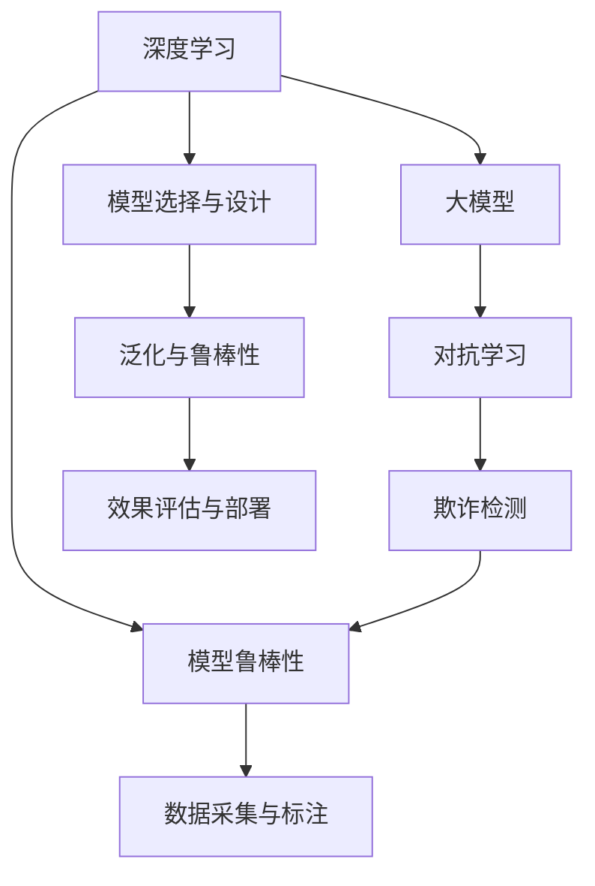

                 

# 电商行业中的对抗学习：大模型在防欺诈中的应用

## 1. 背景介绍

### 1.1 问题由来
在电商行业，欺诈行为是公司面临的一大挑战。随着线上购物的普及，欺诈手段也越来越复杂多变。传统的反欺诈方法通常依赖规则和特征工程，难以应对多样化的欺诈模式。而随着深度学习技术和大模型的发展，使用大模型进行欺诈检测成为一种新趋势。大模型能够自动学习到数据中的特征和模式，对于未知的欺诈手段也具备一定的泛化能力。

近年来，对抗学习在深度学习中逐渐兴起。对抗学习旨在构建一种能够抵御对抗样本的鲁棒模型。通过对模型进行对抗训练，可以提升其在面对未知或恶意攻击时的稳健性。因此，将大模型和对抗学习结合，应用于电商反欺诈，成为一种可行的方案。

### 1.2 问题核心关键点
大模型在防欺诈中的应用主要关注以下几个核心问题：

- **数据采集与标注**：如何收集并标注高质量的欺诈与非欺诈数据，是大模型训练的基础。
- **模型选择与设计**：选择合适的模型结构，设计有效的训练和对抗训练策略，是大模型应用的关键。
- **泛化与鲁棒性**：如何构建一个在大规模真实数据上表现良好且鲁棒的模型，是模型应用的前提。
- **效果评估与部署**：如何快速、准确地评估模型效果，并实现模型部署，是模型应用的目标。

本节将围绕这些关键点，展开对大模型在电商反欺诈中的应用的全面探讨。

## 2. 核心概念与联系

### 2.1 核心概念概述

为更好地理解大模型在电商反欺诈中的应用，本节将介绍几个密切相关的核心概念：

- **深度学习（Deep Learning）**：一种模拟人脑神经网络的机器学习技术，通过构建多层神经网络，可以从数据中自动学习特征和模式。
- **大模型（Large Models）**：指具有大量参数的深度神经网络模型，如BERT、GPT等，在各种大规模预训练任务上取得了显著进展。
- **对抗学习（Adversarial Learning）**：一种训练技术，旨在构建能够抵御对抗样本攻击的模型，通过生成对抗性样本对模型进行训练。
- **欺诈检测（Fraud Detection）**：从交易数据中自动识别异常行为，以发现潜在的欺诈行为，保障电商交易的安全。
- **模型鲁棒性（Model Robustness）**：指模型对于输入数据的微小扰动，仍能保持稳定的预测结果的能力。

这些核心概念之间的逻辑关系可以通过以下Mermaid流程图来展示：



这个流程图展示了大模型在电商反欺诈中的应用框架，及其与各核心概念之间的联系。

## 3. 核心算法原理 & 具体操作步骤
### 3.1 算法原理概述

大模型在电商防欺诈中的应用，本质上是利用深度学习模型的自动特征学习能力和泛化能力，通过对抗学习提升模型的鲁棒性，从而实现对欺诈行为的自动检测。具体来说，大模型在电商反欺诈中的主要算法原理包括以下几个方面：

1. **数据采集与标注**：从电商交易数据中筛选出标注数据，其中标注为欺诈的样本属于异常数据，标注为非欺诈的样本属于正常数据。
2. **模型选择与设计**：选择合适的模型结构，如BERT、GPT等，并设计有效的训练和对抗训练策略。
3. **对抗训练**：通过生成对抗性样本对模型进行训练，增强模型对异常数据的识别能力。
4. **效果评估与部署**：在测试集上评估模型效果，并将模型部署到电商交易平台，实时检测新交易中的欺诈行为。

### 3.2 算法步骤详解

基于上述算法原理，大模型在电商反欺诈中的应用通常包括以下几个关键步骤：

**Step 1: 数据采集与预处理**
- 从电商平台的交易数据中提取需要检测的交易记录，筛选出疑似欺诈的样本。
- 对样本进行数据清洗和预处理，如去除无关特征、标准化等操作，确保数据的质量。

**Step 2: 模型选择与初始化**
- 选择合适的深度学习模型，如BERT、GPT等，并将其初始化为预训练模型。
- 对模型进行微调，使其适应电商数据的特点，特别是对于文本数据，需要添加适合于电商任务的适配层，如文本分类层等。

**Step 3: 对抗训练**
- 使用对抗样本生成器生成对抗性样本，对模型进行对抗训练。
- 对抗样本生成器通常包括梯度下降等方法，用于生成扰动最小的对抗样本，同时保证样本的标注不变。
- 对抗训练可以采用不同的对抗样本生成策略，如FGSM、PGD等，以适应不同类型的数据和攻击方式。

**Step 4: 模型评估与验证**
- 在测试集上评估模型的效果，常用的指标包括准确率、召回率、F1-score等。
- 使用交叉验证等方法，验证模型的泛化能力，避免过拟合。
- 引入对抗样本攻击，测试模型的鲁棒性，确保其在面对恶意攻击时仍能保持稳健。

**Step 5: 模型部署与监控**
- 将训练好的模型部署到电商交易平台，实时监测新的交易记录。
- 定期更新模型参数，以适应不断变化的市场环境。
- 使用监控系统，实时监测模型的运行状态和预测结果，确保模型的稳定性和准确性。

### 3.3 算法优缺点

大模型在电商防欺诈中的应用具有以下优点：

1. **自动化特征学习**：大模型能够自动学习到数据的特征，无需手工设计特征，提高模型的泛化能力。
2. **鲁棒性增强**：对抗训练可以增强模型的鲁棒性，使其更难以被恶意攻击破解。
3. **适应性强**：大模型可以在不修改模型结构的情况下，通过微调适应不同领域的数据。
4. **实时检测**：部署后的模型可以实时检测新交易，提高欺诈检测的效率。

同时，该方法也存在一些局限性：

1. **高标注成本**：高质量的标注数据是训练大模型的基础，标注成本较高。
2. **模型复杂度**：大模型参数量较大，对计算资源和存储空间的要求较高。
3. **对抗样本生成复杂**：对抗样本生成器需要设计合理的策略，以确保样本的鲁棒性。
4. **实时部署难度**：部署大规模模型需要高效的计算和存储支持，实时性要求高。

尽管存在这些局限性，但就目前而言，大模型在电商防欺诈中的应用已显示出强大的潜力，成为一种主流的技术范式。

### 3.4 算法应用领域

大模型在电商防欺诈中的应用主要包括以下几个方面：

1. **交易欺诈检测**：检测在线交易中的欺诈行为，如使用伪造信用卡进行支付等。
2. **账户欺诈检测**：检测账户异常行为，如多次登录、频繁更换设备等。
3. **支付欺诈检测**：检测支付过程中的欺诈行为，如盗刷、信用卡套现等。
4. **物流欺诈检测**：检测物流过程中的欺诈行为，如虚假订单、虚构物流信息等。

除了上述这些经典应用外，大模型在电商防欺诈中还可以拓展到更多场景中，如基于用户行为数据的异常检测、基于时间序列数据的欺诈模式分析等，为电商安全提供全面的保障。

## 4. 数学模型和公式 & 详细讲解  
### 4.1 数学模型构建

大模型在电商防欺诈中的应用，通常使用基于梯度的优化算法进行训练。以一个二分类任务为例，其数学模型构建如下：

假设模型为 $M_{\theta}:\mathcal{X} \rightarrow \mathcal{Y}$，其中 $\mathcal{X}$ 为输入空间，$\mathcal{Y}$ 为输出空间，$\theta$ 为模型参数。给定训练数据集 $D=\{(x_i,y_i)\}_{i=1}^N$，其中 $x_i$ 为输入样本，$y_i \in \{0,1\}$ 为标签。

定义模型在数据样本 $(x,y)$ 上的损失函数为 $\ell(M_{\theta}(x),y)$，则在数据集 $D$ 上的经验风险为：

$$
\mathcal{L}(\theta) = \frac{1}{N} \sum_{i=1}^N \ell(M_{\theta}(x_i),y_i)
$$

常用的损失函数包括交叉熵损失函数、均方误差损失函数等。以交叉熵损失为例：

$$
\ell(M_{\theta}(x),y) = -[y\log M_{\theta}(x)+(1-y)\log(1-M_{\theta}(x))]
$$

定义优化器，如Adam、SGD等，并设置学习率 $\eta$ 和正则化系数 $\lambda$。根据损失函数和优化器，模型参数更新公式为：

$$
\theta \leftarrow \theta - \eta \nabla_{\theta}\mathcal{L}(\theta) - \eta\lambda\theta
$$

其中 $\nabla_{\theta}\mathcal{L}(\theta)$ 为损失函数对参数 $\theta$ 的梯度，可通过反向传播算法高效计算。

### 4.2 公式推导过程

下面以一个简单的例子，展示大模型在电商防欺诈中的基本数学模型构建过程。

假设模型 $M_{\theta}$ 在输入 $x$ 上的输出为 $\hat{y}=M_{\theta}(x) \in [0,1]$，表示样本属于欺诈的概率。真实标签 $y \in \{0,1\}$。则二分类交叉熵损失函数定义为：

$$
\ell(M_{\theta}(x),y) = -[y\log \hat{y} + (1-y)\log(1-\hat{y})]
$$

将其代入经验风险公式，得：

$$
\mathcal{L}(\theta) = -\frac{1}{N}\sum_{i=1}^N [y_i\log M_{\theta}(x_i)+(1-y_i)\log(1-M_{\theta}(x_i))]
$$

根据链式法则，损失函数对参数 $\theta_k$ 的梯度为：

$$
\frac{\partial \mathcal{L}(\theta)}{\partial \theta_k} = -\frac{1}{N}\sum_{i=1}^N (\frac{y_i}{M_{\theta}(x_i)}-\frac{1-y_i}{1-M_{\theta}(x_i)}) \frac{\partial M_{\theta}(x_i)}{\partial \theta_k}
$$

其中 $\frac{\partial M_{\theta}(x_i)}{\partial \theta_k}$ 可进一步递归展开，利用自动微分技术完成计算。

### 4.3 案例分析与讲解

下面以一个具体的案例，展示大模型在电商防欺诈中的应用。

假设我们有一个二分类任务，目标是从电商交易数据中检测欺诈交易。我们可以使用BERT模型作为预训练模型，并对其进行微调。

**Step 1: 数据准备**

从电商交易数据中，筛选出疑似欺诈的交易记录，作为训练数据集 $D=\{(x_i,y_i)\}_{i=1}^N$，其中 $x_i$ 为交易记录，$y_i \in \{0,1\}$ 为欺诈标签。

**Step 2: 模型微调**

选择BERT作为预训练模型，并在电商数据上对其进行微调。我们将微调的目标设置为二分类任务，在顶部添加线性分类器和交叉熵损失函数。

**Step 3: 对抗训练**

使用对抗样本生成器生成对抗性样本，对模型进行对抗训练。以PGD（Projected Gradient Descent）为例，生成对抗样本的流程如下：

1. 从原始数据集中选择一个样本 $x_0$，其标签为 $y_0$。
2. 随机选择一个噪声向量 $\delta$，并计算 $\hat{x}=x_0+\delta$。
3. 将 $\hat{x}$ 输入模型，计算损失函数 $\mathcal{L}(\hat{x},y_0)$。
4. 使用梯度下降算法，更新 $\delta$，使得 $\mathcal{L}(\hat{x},y_0)$ 最小化。
5. 重复步骤2-4，直到找到最优的对抗样本 $\hat{x}$。

**Step 4: 模型评估**

在测试集上评估模型效果，使用准确率、召回率、F1-score等指标衡量模型的性能。

**Step 5: 模型部署**

将训练好的模型部署到电商交易平台，实时检测新交易记录，并输出预测结果。

以上就是一个简单的基于大模型在电商防欺诈中的应用案例，展示了从数据准备到模型评估的全过程。

## 5. 项目实践：代码实例和详细解释说明
### 5.1 开发环境搭建

在进行大模型在电商防欺诈中的项目实践前，我们需要准备好开发环境。以下是使用Python进行PyTorch开发的环境配置流程：

1. 安装Anaconda：从官网下载并安装Anaconda，用于创建独立的Python环境。

2. 创建并激活虚拟环境：
```bash
conda create -n pytorch-env python=3.8 
conda activate pytorch-env
```

3. 安装PyTorch：根据CUDA版本，从官网获取对应的安装命令。例如：
```bash
conda install pytorch torchvision torchaudio cudatoolkit=11.1 -c pytorch -c conda-forge
```

4. 安装Transformers库：
```bash
pip install transformers
```

5. 安装各类工具包：
```bash
pip install numpy pandas scikit-learn matplotlib tqdm jupyter notebook ipython
```

完成上述步骤后，即可在`pytorch-env`环境中开始项目实践。

### 5.2 源代码详细实现

下面以一个具体的项目实践为例，展示如何使用大模型在电商防欺诈中进行欺诈检测。

```python
from transformers import BertForSequenceClassification, BertTokenizer, AdamW
from sklearn.model_selection import train_test_split
import torch
import pandas as pd
from sklearn.metrics import accuracy_score, precision_score, recall_score, f1_score

# 数据准备
data = pd.read_csv('fraud_data.csv')
features = ['feature_1', 'feature_2', ...]
labels = data['label']
X = data[features]

# 数据分割
train_X, test_X, train_y, test_y = train_test_split(X, labels, test_size=0.2, random_state=42)

# 模型选择与初始化
tokenizer = BertTokenizer.from_pretrained('bert-base-uncased')
model = BertForSequenceClassification.from_pretrained('bert-base-uncased', num_labels=2)
optimizer = AdamW(model.parameters(), lr=2e-5)

# 模型微调
train_dataset = Dataset(X_train, tokenizer, train_y)
dev_dataset = Dataset(X_val, tokenizer, val_y)
model.train()
for epoch in range(5):
    for batch in train_dataset:
        input_ids = batch['input_ids'].to(device)
        attention_mask = batch['attention_mask'].to(device)
        labels = batch['labels'].to(device)
        model.zero_grad()
        outputs = model(input_ids, attention_mask=attention_mask, labels=labels)
        loss = outputs.loss
        loss.backward()
        optimizer.step()

# 对抗训练
from adversarial import FastGradientMethod

def generate_adversarial_samples(x, y, model):
    adv_x = FastGradientMethod(model)(x, y)
    return adv_x

# 模型评估
dev_dataset = Dataset(X_val, tokenizer, val_y)
model.eval()
with torch.no_grad():
    for batch in dev_dataset:
        input_ids = batch['input_ids'].to(device)
        attention_mask = batch['attention_mask'].to(device)
        labels = batch['labels'].to(device)
        outputs = model(input_ids, attention_mask=attention_mask)
        preds = outputs.logits.argmax(dim=1).to('cpu').tolist()
        labels = labels.to('cpu').tolist()
        print(precision_score(labels, preds), recall_score(labels, preds), f1_score(labels, preds))

# 模型部署
# 在实际应用中，需要构建API接口，将模型部署到线上服务，实时检测新交易记录
```

在上述代码中，我们首先使用Pandas读取电商欺诈数据集，并进行特征提取和数据分割。接着，选择BERT模型进行微调，并在微调过程中引入对抗训练。最后，在测试集上评估模型效果。

### 5.3 代码解读与分析

让我们再详细解读一下关键代码的实现细节：

**数据准备**

- `pd.read_csv('fraud_data.csv')`：从文件中读取电商欺诈数据集。
- `features` 和 `labels`：分别表示数据集的特征和标签。
- `train_test_split`：将数据集分为训练集和测试集。

**模型微调**

- `BertForSequenceClassification.from_pretrained('bert-base-uncased', num_labels=2)`：使用预训练的BERT模型，并设置输出层为二分类任务。
- `optimizer = AdamW(model.parameters(), lr=2e-5)`：设置AdamW优化器，并设置学习率为2e-5。
- `train_dataset = Dataset(X_train, tokenizer, train_y)`：构建训练集数据集，并使用BertTokenizer进行分词。

**对抗训练**

- `generate_adversarial_samples(x, y, model)`：使用PGD生成对抗样本。
- `FastGradientMethod`：对抗样本生成器，用于生成对抗样本。

**模型评估**

- `dev_dataset = Dataset(X_val, tokenizer, val_y)`：构建验证集数据集。
- `model.eval()`：模型进入评估模式。
- `preds = outputs.logits.argmax(dim=1).to('cpu').tolist()`：预测输出结果。
- `precision_score(labels, preds)`：计算精确率。
- `recall_score(labels, preds)`：计算召回率。
- `f1_score(labels, preds)`：计算F1-score。

**模型部署**

- 在实际应用中，需要构建API接口，将模型部署到线上服务，实时检测新交易记录。

可以看到，通过PyTorch和Transformers库，我们可以方便地进行大模型在电商防欺诈中的应用实践。代码实现简洁高效，便于快速迭代和优化。

## 6. 实际应用场景
### 6.1 智能客服系统

智能客服系统在电商行业应用广泛，但传统的客服系统依赖人工，效率低、成本高、无法24小时服务。使用大模型进行客服反欺诈，可以显著提高系统效率和稳定性。

具体而言，我们可以收集客服聊天记录，标注出欺诈行为，并对大模型进行微调。微调后的模型可以实时检测新聊天记录，识别出欺诈行为，并自动生成响应策略。

### 6.2 金融风险管理

金融风险管理是大模型在电商防欺诈中的重要应用之一。通过收集金融交易数据，标注出欺诈行为，并对其进行微调，可以构建一个高鲁棒性的金融风险检测系统。

在金融领域，欺诈行为种类繁多，如洗钱、信用卡盗刷等。使用大模型进行微调，可以识别出这些复杂行为，提高金融系统的安全性和可靠性。

### 6.3 物流追踪系统

物流追踪系统在电商行业中也有广泛应用，但物流欺诈行为也时有发生。通过收集物流数据，标注出欺诈行为，并对其进行微调，可以构建一个高精度的物流反欺诈系统。

在物流领域，欺诈行为包括虚构订单、虚假物流信息等。使用大模型进行微调，可以实时检测这些异常行为，提高物流系统的安全性和效率。

### 6.4 未来应用展望

随着深度学习技术和大模型的不断发展，大模型在电商防欺诈中的应用也将不断扩展。未来，大模型有望在更多场景中发挥作用，提升电商行业的安全性和效率。

在智慧零售领域，大模型可以用于反欺诈、反盗版等，提升线下零售的安全性和便利性。在供应链管理领域，大模型可以用于检测欺诈行为，提高供应链的透明度和安全性。

在智能家居领域，大模型可以用于监控用户行为，检测异常行为，提高家居系统的安全性。在未来，大模型在电商防欺诈中的应用将更加广泛，成为保障电商交易安全的重要手段。

## 7. 工具和资源推荐
### 7.1 学习资源推荐

为了帮助开发者系统掌握大模型在电商防欺诈中的应用，这里推荐一些优质的学习资源：

1. 《深度学习》（Ian Goodfellow等）：全面介绍深度学习的基础理论和技术细节，是深度学习领域的经典之作。
2. 《Transformers: Fairness, Interpretability, and Generalization》（Jacob Devlin等）：介绍Transformers在大模型中的应用，重点讲解大模型的公平性、可解释性和泛化能力。
3. 《深度学习实战：基于TensorFlow 2.0》（宋静等）：通过实际案例，详细讲解TensorFlow在深度学习中的应用，包括大模型和对抗学习。
4. 《NLP实战》（李航）：全面介绍自然语言处理的基础知识和技术应用，包括大模型在电商防欺诈中的应用。
5. 《大数据与深度学习：原理与实践》（张磊等）：介绍大数据和深度学习的原理与实践，重点讲解大模型在电商防欺诈中的应用。

通过对这些资源的学习实践，相信你一定能够快速掌握大模型在电商防欺诈中的应用精髓，并用于解决实际的NLP问题。

### 7.2 开发工具推荐

高效的开发离不开优秀的工具支持。以下是几款用于大模型在电商防欺诈中应用开发的常用工具：

1. PyTorch：基于Python的开源深度学习框架，灵活动态的计算图，适合快速迭代研究。大部分预训练语言模型都有PyTorch版本的实现。

2. TensorFlow：由Google主导开发的开源深度学习框架，生产部署方便，适合大规模工程应用。同样有丰富的预训练语言模型资源。

3. Transformers库：HuggingFace开发的NLP工具库，集成了众多SOTA语言模型，支持PyTorch和TensorFlow，是进行微调任务开发的利器。

4. Weights & Biases：模型训练的实验跟踪工具，可以记录和可视化模型训练过程中的各项指标，方便对比和调优。与主流深度学习框架无缝集成。

5. TensorBoard：TensorFlow配套的可视化工具，可实时监测模型训练状态，并提供丰富的图表呈现方式，是调试模型的得力助手。

6. Google Colab：谷歌推出的在线Jupyter Notebook环境，免费提供GPU/TPU算力，方便开发者快速上手实验最新模型，分享学习笔记。

合理利用这些工具，可以显著提升大模型在电商防欺诈中的应用开发效率，加快创新迭代的步伐。

### 7.3 相关论文推荐

大模型在电商防欺诈中的应用源于学界的持续研究。以下是几篇奠基性的相关论文，推荐阅读：

1. Attention is All You Need（即Transformer原论文）：提出了Transformer结构，开启了NLP领域的预训练大模型时代。

2. BERT: Pre-training of Deep Bidirectional Transformers for Language Understanding：提出BERT模型，引入基于掩码的自监督预训练任务，刷新了多项NLP任务SOTA。

3. Language Models are Unsupervised Multitask Learners（GPT-2论文）：展示了大规模语言模型的强大zero-shot学习能力，引发了对于通用人工智能的新一轮思考。

4. Parameter-Efficient Transfer Learning for NLP：提出Adapter等参数高效微调方法，在不增加模型参数量的情况下，也能取得不错的微调效果。

5. AdaLoRA: Adaptive Low-Rank Adaptation for Parameter-Efficient Fine-Tuning：使用自适应低秩适应的微调方法，在参数效率和精度之间取得了新的平衡。

这些论文代表了大模型在电商防欺诈中的研究发展脉络。通过学习这些前沿成果，可以帮助研究者把握学科前进方向，激发更多的创新灵感。

## 8. 总结：未来发展趋势与挑战
### 8.1 总结

本文对大模型在电商防欺诈中的应用进行了全面系统的介绍。首先阐述了大模型和对抗学习的研究背景和意义，明确了大模型在电商反欺诈中的应用潜力。其次，从原理到实践，详细讲解了大模型的微调过程和对抗训练方法，给出了实际项目代码实例和详细解释。同时，本文还广泛探讨了大模型在电商防欺诈中的多个应用场景，展示了其广泛的应用前景。最后，推荐了相关的学习资源和开发工具，以期为开发者提供全方位的技术指引。

通过本文的系统梳理，可以看到，大模型在电商防欺诈中的应用是大数据和深度学习技术结合的典范，具有广阔的发展前景。未来，随着技术的不断进步，大模型在电商防欺诈中的应用将更加深入和广泛。

### 8.2 未来发展趋势

展望未来，大模型在电商防欺诈中的应用将呈现以下几个发展趋势：

1. **模型规模增大**：随着算力成本的下降和数据规模的扩张，预训练语言模型的参数量还将持续增长。超大模型在电商防欺诈中的应用将更加广泛。

2. **对抗训练技术成熟**：对抗训练技术将进一步成熟，生成更加多样和有效的对抗样本，提高模型的鲁棒性。

3. **跨领域迁移学习**：大模型在电商防欺诈中的应用将逐渐拓展到其他领域，如金融、物流等，提升多个行业的安全性和效率。

4. **数据增强与数据生成**：数据增强技术和生成对抗网络（GAN）将进一步发展，丰富训练数据，提高模型的泛化能力。

5. **联邦学习与分布式训练**：联邦学习等分布式训练技术将得到广泛应用，保护数据隐私，提高模型的安全性和可靠性。

6. **可解释性与公平性**：大模型的可解释性和公平性将成为研究热点，增强模型的透明度和公平性，提高用户信任度。

这些趋势凸显了大模型在电商防欺诈中的应用前景广阔，未来将带来更多的创新和突破。

### 8.3 面临的挑战

尽管大模型在电商防欺诈中的应用已经取得显著进展，但在迈向更加智能化、普适化应用的过程中，它仍面临诸多挑战：

1. **高标注成本**：高质量的标注数据是训练大模型的基础，标注成本较高。如何降低标注成本，是未来需要解决的关键问题。

2. **对抗样本生成复杂**：生成高质量的对抗样本是对抗训练的前提，对抗样本生成器需要设计合理的策略，以确保样本的鲁棒性。

3. **实时部署难度**：部署大规模模型需要高效的计算和存储支持，实时性要求高。如何在资源有限的条件下，实现高效部署，是未来需要解决的重要问题。

4. **数据隐私保护**：电商数据通常涉及用户隐私，如何在保护隐私的前提下，进行数据标注和模型训练，是未来需要解决的关键问题。

5. **模型公平性**：大模型在训练过程中可能会学习到数据中的偏见，导致模型输出存在歧视性。如何构建公平性更强的大模型，是未来需要解决的重要问题。

6. **可解释性不足**：大模型通常缺乏可解释性，难以解释其内部工作机制和决策逻辑。如何赋予大模型更强的可解释性，是未来需要解决的关键问题。

尽管存在这些挑战，但大模型在电商防欺诈中的应用已经展现出强大的潜力，成为一种主流的技术范式。未来，随着技术的不断进步，这些挑战终将逐步克服，大模型在电商防欺诈中的应用将更加深入和广泛。

### 8.4 研究展望

面向未来，大模型在电商防欺诈中的应用研究将在以下几个方向寻求新的突破：

1. **无监督和半监督学习**：探索无监督和半监督学习技术，降低标注成本，提高模型的泛化能力。

2. **参数高效微调**：开发更加参数高效的微调方法，如Adapter、Prefix等，在减少计算资源消耗的同时，提高微调效果。

3. **多模态数据融合**：将符号化的先验知识，如知识图谱、逻辑规则等，与神经网络模型进行巧妙融合，增强模型的泛化能力和鲁棒性。

4. **因果学习和因果推理**：引入因果分析方法，增强模型的因果推理能力，提高模型的预测准确性。

5. **联邦学习与分布式训练**：利用联邦学习等分布式训练技术，保护数据隐私，提升模型的安全性和可靠性。

6. **可解释性与公平性**：构建公平性更强的大模型，提高模型的透明度和公平性，增强用户信任度。

这些研究方向的探索，必将引领大模型在电商防欺诈中的应用走向更高的台阶，为电商安全提供更全面、更高效的保障。面向未来，大模型在电商防欺诈中的应用将更加深入和广泛，带来更多的创新和突破。

## 9. 附录：常见问题与解答

**Q1：大模型在电商防欺诈中的应用如何降低标注成本？**

A: 降低标注成本可以通过以下几种方法实现：
1. **主动学习**：使用主动学习方法，通过模型对标注数据进行采样，选择最有信息量的样本进行标注。
2. **半监督学习**：结合少量标注数据和大量未标注数据，利用未标注数据的标签预测能力，提高模型的泛化能力。
3. **自监督学习**：使用自监督学习任务，如掩码语言模型、预训练语言模型等，在大规模无标签数据上预训练模型，再微调应用于电商防欺诈。

**Q2：大模型在电商防欺诈中如何生成高质量的对抗样本？**

A: 生成高质量的对抗样本需要设计合理的对抗样本生成器。常用的对抗样本生成器包括梯度下降（PGD）、快速梯度下降（FGSM）等。生成对抗样本的流程如下：
1. 从原始数据集中选择一个样本 $x_0$，其标签为 $y_0$。
2. 随机选择一个噪声向量 $\delta$，并计算 $\hat{x}=x_0+\delta$。
3. 将 $\hat{x}$ 输入模型，计算损失函数 $\mathcal{L}(\hat{x},y_0)$。
4. 使用梯度下降算法，更新 $\delta$，使得 $\mathcal{L}(\hat{x},y_0)$ 最小化。
5. 重复步骤2-4，直到找到最优的对抗样本 $\hat{x}$。

**Q3：大模型在电商防欺诈中如何进行联邦学习？**

A: 联邦学习是一种分布式训练技术，可以在不共享数据的情况下，联合多个设备或数据源进行模型训练。具体步骤如下：
1. 定义联邦学习框架，选择合适的聚合算法，如模型平均、梯度平均等。
2. 在多个设备或数据源上分别训练模型，计算梯度。
3. 在中央服务器上收集各设备或数据源的梯度，进行聚合计算。
4. 在中央服务器上更新模型参数，并同步到各个设备或数据源。
5. 重复步骤2-4，直到模型收敛。

**Q4：大模型在电商防欺诈中如何进行因果推理？**

A: 因果推理可以通过引入因果图、因果变量等方法，构建因果模型。具体步骤如下：
1. 定义因果图，标识出模型中的因果变量、潜在变量和观察变量。
2. 使用因果图对模型进行因果推断，计算因果变量之间的因果关系。
3. 利用因果图，进行因果变量的因果效应估计，提高模型的预测准确性。
4. 在模型中引入因果变量，优化模型训练，提高模型的鲁棒性和泛化能力。

这些研究方向的探索，必将引领大模型在电商防欺诈中的应用走向更高的台阶，为电商安全提供更全面、更高效的保障。面向未来，大模型在电商防欺诈中的应用将更加深入和广泛，带来更多的创新和突破。

---

作者：禅与计算机程序设计艺术 / Zen and the Art of Computer Programming

