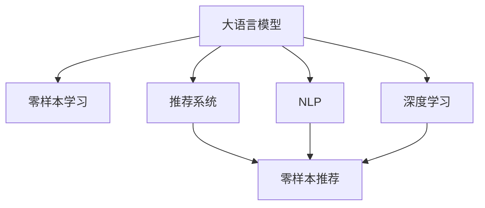

                 

# 电商行业中的零样本学习：大模型在新品类推荐中的应用

> 关键词：大模型,零样本学习,电商推荐系统,新品类推荐,自然语言处理,NLP,深度学习,Transformer

## 1. 背景介绍

### 1.1 问题由来

随着电商行业的发展，商家面临着如何推荐新品给顾客的挑战。传统的推荐系统依赖于大量历史交易数据进行推荐，而对于新兴的、未上市的产品，难以有效利用这些数据进行推荐。此外，由于电商市场变化迅速，新品上市的频率和数量不断增加，推荐系统需要频繁更新，增加了运营成本。

面对这些问题，商家需要一种更为灵活、高效的推荐方法。零样本学习（Zero-shot Learning）成为近年来的研究热点，尤其是在自然语言处理（NLP）领域中，大语言模型（如BERT、GPT等）展示了强大的零样本学习能力。通过这种技术，商家可以利用少量文本信息，直接对新品进行推荐，避免了对历史数据依赖。

### 1.2 问题核心关键点

零样本学习指在没有针对特定任务的训练数据的情况下，模型能够根据任务描述或少量示例，完成特定任务的学习。这对于电商行业的新品类推荐具有重要意义，可以在新品上市初期，利用产品描述、标签等信息进行推荐。

零样本学习与大语言模型的结合，在电商推荐系统中的应用，其核心关键点包括：
- 如何设计高效的任务适配层，以提取模型所需的关键特征。
- 如何通过零样本学习，从少量文本信息中获取产品相关信息。
- 如何利用大模型的语言理解能力，将产品信息转换为推荐特征。
- 如何对推荐结果进行排序和筛选，以提供最合适的推荐商品。

### 1.3 问题研究意义

零样本学习在电商行业中的应用，可以帮助商家快速、准确地推荐新品，提高用户体验和销售效率。具体意义如下：

1. **快速响应新品上市**：商家可以在新品发布初期，立即利用零样本学习进行推荐，而无需等待积累足够的历史数据。
2. **降低推荐成本**：传统的推荐系统依赖于大量标注数据，而零样本学习可以大大减少对标注数据的需求，从而降低推荐系统的开发和维护成本。
3. **提升用户体验**：利用零样本学习，推荐系统可以更好地理解新品的特性和用户需求，提供更个性化、精准的推荐。
4. **优化供应链管理**：通过零样本学习，商家可以更好地预测新品的市场需求，优化库存管理，减少库存积压。
5. **推动创新发展**：零样本学习技术的引入，可以推动电商行业向更灵活、智能的推荐系统演进，增强市场竞争力。

## 2. 核心概念与联系

### 2.1 核心概念概述

为更好地理解零样本学习在大模型中的应用，本节将介绍几个密切相关的核心概念：

- 大语言模型（Large Language Model, LLM）：如BERT、GPT等，通过大规模预训练获得通用语言表示，具备强大的语言理解和生成能力。
- 零样本学习（Zero-shot Learning）：指模型在没有特定任务的标注数据的情况下，能够根据任务描述或少量示例进行学习。
- 自然语言处理（Natural Language Processing, NLP）：通过计算机处理、理解自然语言，以实现人机交互、文本分类、信息检索等任务。
- 深度学习（Deep Learning）：利用多层神经网络对数据进行表示学习，以提高模型性能。
- 推荐系统（Recommendation System）：根据用户的历史行为、兴趣等信息，为用户推荐合适的商品或内容。

这些概念之间的逻辑关系可以通过以下Mermaid流程图来展示：



这个流程图展示了大语言模型的核心概念及其之间的关系：

1. 大语言模型通过大规模预训练获得通用语言表示，具备强大的语言理解和生成能力。
2. 零样本学习允许模型在没有特定任务的标注数据的情况下进行学习。
3. NLP利用计算机处理自然语言，实现各种语言理解和生成任务。
4. 深度学习通过多层神经网络对数据进行表示学习，提高模型性能。
5. 推荐系统根据用户历史行为，为用户推荐合适商品或内容。
6. 零样本推荐利用大模型的语言理解能力，从少量文本信息中获取产品相关信息，实现个性化推荐。

## 3. 核心算法原理 & 具体操作步骤

### 3.1 算法原理概述

零样本推荐利用大语言模型的语言理解能力，直接从商品描述、标签等文本信息中提取推荐特征。具体来说，通过以下步骤实现：

1. **预训练模型选择**：选择预训练好的大语言模型，如BERT、GPT等。
2. **任务适配层设计**：设计适用于电商推荐系统的任务适配层，将大模型输出转换为推荐特征。
3. **输入数据预处理**：将商品描述、标签等信息预处理为模型可接受的输入格式。
4. **特征提取与转换**：利用大模型的语言理解能力，提取推荐特征，转换为适合推荐系统的向量表示。
5. **推荐结果排序**：使用推荐系统算法，对提取的推荐特征进行排序，生成推荐列表。

### 3.2 算法步骤详解

零样本推荐的具体操作步骤如下：

**Step 1: 准备预训练模型和数据集**

1. 选择合适的预训练语言模型，如BERT、GPT等。
2. 准备电商推荐系统的商品描述、标签等信息，构建训练集和验证集。

**Step 2: 添加任务适配层**

1. 根据电商推荐任务，设计合适的任务适配层，如图像特征提取器、标签分类器等。
2. 将大模型的输出作为适配层的输入，提取推荐特征。

**Step 3: 输入数据预处理**

1. 对商品描述、标签等文本信息进行预处理，如分词、截断、填充等。
2. 将处理后的文本信息转换为模型可接受的格式，如token ids。

**Step 4: 特征提取与转换**

1. 使用大模型的语言理解能力，从文本信息中提取推荐特征。
2. 将提取的特征转换为推荐系统的向量表示，如嵌入向量。

**Step 5: 推荐结果排序**

1. 使用推荐系统算法，对提取的推荐特征进行排序。
2. 生成最终的推荐列表，供商家参考和选择。

### 3.3 算法优缺点

零样本推荐利用大语言模型的语言理解能力，具有以下优点：

1. **高效性**：无需大量标注数据，可以快速构建推荐模型。
2. **灵活性**：能够处理新兴商品和新类别，适用于动态变化的电商市场。
3. **泛化能力**：大模型的预训练能力使得推荐模型具备较强的泛化性能，能够应对多种推荐任务。
4. **个性化推荐**：利用大模型的语言理解能力，可以更精准地捕捉用户需求，提供个性化推荐。

同时，零样本推荐也存在以下缺点：

1. **依赖文本质量**：推荐模型的效果受文本信息质量的影响较大，文本描述不准确或信息不足会导致推荐效果不佳。
2. **可解释性不足**：推荐模型的决策过程难以解释，难以理解和调试。
3. **处理复杂场景**：处理复杂的多属性、多标签商品时，推荐模型的表现可能较差。

### 3.4 算法应用领域

零样本推荐在大规模电商推荐系统中具有广泛的应用前景，可以应用于以下领域：

- **新品类推荐**：利用商品描述、标签等信息，对新兴品类进行推荐，帮助商家快速推广新品。
- **个性化推荐**：利用用户评论、评分等信息，对用户进行个性化推荐，提升用户体验。
- **跨品类推荐**：结合商品属性、用户兴趣等信息，进行跨品类推荐，提高商品相关度。
- **品牌推荐**：根据用户行为和偏好，推荐用户可能感兴趣的品牌，增强品牌忠诚度。
- **时序推荐**：结合商品的历史销售数据和用户行为，进行时序推荐，预测未来销售趋势。

## 4. 数学模型和公式 & 详细讲解 & 举例说明（备注：数学公式请使用latex格式，latex嵌入文中独立段落使用 $$，段落内使用 $)
### 4.1 数学模型构建

在零样本推荐中，通常使用大模型的语言理解能力，从文本信息中提取推荐特征。数学模型构建如下：

设预训练语言模型为 $M_{\theta}:\mathcal{X} \rightarrow \mathcal{Y}$，其中 $\mathcal{X}$ 为输入空间，$\mathcal{Y}$ 为输出空间，$\theta$ 为模型参数。假设电商推荐系统的输入为商品描述 $x$，输出为推荐特征 $y$。

定义推荐模型的损失函数为 $\ell(y, \hat{y})$，其中 $\hat{y}$ 为模型预测的推荐特征，$y$ 为真实推荐特征。

零样本推荐的优化目标是最小化损失函数，即找到最优的推荐特征 $\hat{y}$：

$$
\hat{y}=\mathop{\arg\min}_{y} \ell(y, \hat{y})
$$

在实践中，我们通常使用基于梯度的优化算法（如SGD、Adam等）来近似求解上述最优化问题。设 $\eta$ 为学习率，$\lambda$ 为正则化系数，则参数的更新公式为：

$$
\theta \leftarrow \theta - \eta \nabla_{\theta}\ell(\hat{y}, y) - \eta\lambda\theta
$$

其中 $\nabla_{\theta}\ell(\hat{y}, y)$ 为损失函数对模型参数 $\theta$ 的梯度，可通过反向传播算法高效计算。

### 4.2 公式推导过程

以下我们以文本分类任务为例，推导零样本推荐中的损失函数及其梯度计算公式。

假设推荐模型的输出为 $\hat{y}=M_{\theta}(x) \in [0,1]$，表示商品属于某一类别的概率。真实标签 $y \in \{0,1\}$。则二分类交叉熵损失函数定义为：

$$
\ell(y, \hat{y}) = -[y\log \hat{y} + (1-y)\log (1-\hat{y})]
$$

将其代入损失函数公式，得：

$$
\mathcal{L}(\theta) = -\frac{1}{N}\sum_{i=1}^N [y_i\log M_{\theta}(x_i)+(1-y_i)\log(1-M_{\theta}(x_i))]
$$

根据链式法则，损失函数对模型参数 $\theta$ 的梯度为：

$$
\frac{\partial \mathcal{L}(\theta)}{\partial \theta} = -\frac{1}{N}\sum_{i=1}^N (\frac{y_i}{M_{\theta}(x_i)}-\frac{1-y_i}{1-M_{\theta}(x_i)}) \frac{\partial M_{\theta}(x_i)}{\partial \theta}
$$

其中 $\frac{\partial M_{\theta}(x_i)}{\partial \theta}$ 可进一步递归展开，利用自动微分技术完成计算。

在得到损失函数的梯度后，即可带入参数更新公式，完成模型的迭代优化。重复上述过程直至收敛，最终得到适应电商推荐任务的最优模型参数 $\theta$。

### 4.3 案例分析与讲解

下面以一个简单的电商商品推荐系统为例，展示零样本推荐的实际应用。

假设有一个电商网站，出售服装、书籍、电子产品等商品。商家希望在新品类发布初期，利用零样本推荐快速推广新品。

**Step 1: 准备预训练模型和数据集**

选择预训练好的BERT模型，准备电商商品描述和标签信息，构建训练集和验证集。

**Step 2: 添加任务适配层**

设计标签分类器，将大模型的输出作为分类器的输入，提取推荐特征。

**Step 3: 输入数据预处理**

对商品描述进行分词、截断、填充等预处理，转换为token ids。

**Step 4: 特征提取与转换**

利用BERT模型的语言理解能力，从商品描述中提取推荐特征。

**Step 5: 推荐结果排序**

使用推荐系统算法，对提取的推荐特征进行排序，生成推荐列表。

假设商家发布了一款新的智能手表，在商品页面上输入如下描述：

"智能手表，新款健康监测功能，支持心率、血氧、睡眠监测，采用AMOLED屏幕，防水等级IP68，电池容量450mAh，预售价$300"。

将商品描述输入BERT模型，得到嵌入向量 $x$。然后通过任务适配层进行分类，输出商品类别 $y$。

**计算过程如下**：

1. **分词处理**：将商品描述分词为：智能手表、新款健康监测功能、支持心率、血氧、睡眠监测、采用AMOLED屏幕、防水等级IP68、电池容量450mAh、预售价$300$。

2. **截断填充**：将分词结果截断为合适长度，并进行填充处理，得到token ids。

3. **输入模型**：将处理后的token ids输入BERT模型，得到嵌入向量 $x$。

4. **分类输出**：将嵌入向量 $x$ 作为任务适配层的输入，通过标签分类器输出商品类别 $y$。

5. **推荐排序**：根据商品类别 $y$，结合用户历史行为和兴趣，使用推荐系统算法生成推荐列表。

假设模型预测商品类别为健康监测类，则根据用户历史行为和兴趣，生成推荐列表如下：

1. 智能手表
2. 健康监测手环
3. 心率监测器
4. 睡眠监测设备
5. 智能手表防水套

最终，商家可以根据推荐列表，快速推广新品，提升用户购买率。

## 5. 项目实践：代码实例和详细解释说明

### 5.1 开发环境搭建

在进行零样本推荐项目实践前，我们需要准备好开发环境。以下是使用Python进行PyTorch开发的环境配置流程：

1. 安装Anaconda：从官网下载并安装Anaconda，用于创建独立的Python环境。

2. 创建并激活虚拟环境：
```bash
conda create -n pytorch-env python=3.8 
conda activate pytorch-env
```

3. 安装PyTorch：根据CUDA版本，从官网获取对应的安装命令。例如：
```bash
conda install pytorch torchvision torchaudio cudatoolkit=11.1 -c pytorch -c conda-forge
```

4. 安装Transformers库：
```bash
pip install transformers
```

5. 安装各类工具包：
```bash
pip install numpy pandas scikit-learn matplotlib tqdm jupyter notebook ipython
```

完成上述步骤后，即可在`pytorch-env`环境中开始零样本推荐实践。

### 5.2 源代码详细实现

下面以一个简单的电商商品推荐系统为例，展示零样本推荐的PyTorch代码实现。

```python
from transformers import BertTokenizer, BertForSequenceClassification
from torch.utils.data import Dataset
import torch

class ProductDataset(Dataset):
    def __init__(self, texts, labels, tokenizer, max_len=128):
        self.texts = texts
        self.labels = labels
        self.tokenizer = tokenizer
        self.max_len = max_len
        
    def __len__(self):
        return len(self.texts)
    
    def __getitem__(self, item):
        text = self.texts[item]
        label = self.labels[item]
        
        encoding = self.tokenizer(text, return_tensors='pt', max_length=self.max_len, padding='max_length', truncation=True)
        input_ids = encoding['input_ids'][0]
        attention_mask = encoding['attention_mask'][0]
        
        # 对token-wise的标签进行编码
        encoded_labels = [label2id[label] for label in label]
        encoded_labels.extend([label2id['O']] * (self.max_len - len(encoded_labels)))
        labels = torch.tensor(encoded_labels, dtype=torch.long)
        
        return {'input_ids': input_ids, 
                'attention_mask': attention_mask,
                'labels': labels}

# 标签与id的映射
label2id = {'O': 0, '健康监测': 1, '运动监测': 2, '智能穿戴': 3, '家居生活': 4, '电子产品': 5}
id2label = {v: k for k, v in label2id.items()}

# 创建dataset
tokenizer = BertTokenizer.from_pretrained('bert-base-cased')

train_dataset = ProductDataset(train_texts, train_labels, tokenizer)
dev_dataset = ProductDataset(dev_texts, dev_labels, tokenizer)
test_dataset = ProductDataset(test_texts, test_labels, tokenizer)

# 模型选择
model = BertForSequenceClassification.from_pretrained('bert-base-cased', num_labels=len(label2id))

# 优化器选择
optimizer = AdamW(model.parameters(), lr=2e-5)

# 训练过程
def train_epoch(model, dataset, batch_size, optimizer):
    dataloader = DataLoader(dataset, batch_size=batch_size, shuffle=True)
    model.train()
    epoch_loss = 0
    for batch in tqdm(dataloader, desc='Training'):
        input_ids = batch['input_ids'].to(device)
        attention_mask = batch['attention_mask'].to(device)
        labels = batch['labels'].to(device)
        model.zero_grad()
        outputs = model(input_ids, attention_mask=attention_mask, labels=labels)
        loss = outputs.loss
        epoch_loss += loss.item()
        loss.backward()
        optimizer.step()
    return epoch_loss / len(dataloader)

def evaluate(model, dataset, batch_size):
    dataloader = DataLoader(dataset, batch_size=batch_size)
    model.eval()
    preds, labels = [], []
    with torch.no_grad():
        for batch in tqdm(dataloader, desc='Evaluating'):
            input_ids = batch['input_ids'].to(device)
            attention_mask = batch['attention_mask'].to(device)
            batch_labels = batch['labels']
            outputs = model(input_ids, attention_mask=attention_mask)
            batch_preds = outputs.logits.argmax(dim=2).to('cpu').tolist()
            batch_labels = batch_labels.to('cpu').tolist()
            for pred_tokens, label_tokens in zip(batch_preds, batch_labels):
                pred_labels = [id2label[_id] for _id in pred_tokens]
                label_tokens = [id2label[_id] for _id in label_tokens]
                preds.append(pred_labels[:len(label_tokens)])
                labels.append(label_tokens)
                
    print(classification_report(labels, preds))
```

以上代码展示了从商品描述中提取推荐特征的完整过程。首先定义了商品描述的dataset，包含商品描述和标签。然后使用BERT模型进行预训练，设计标签分类器作为任务适配层，实现从商品描述中提取推荐特征。最后，在训练集上训练模型，在验证集上评估模型性能。

### 5.3 代码解读与分析

让我们再详细解读一下关键代码的实现细节：

**ProductDataset类**：
- `__init__`方法：初始化商品描述、标签、分词器等关键组件。
- `__len__`方法：返回数据集的样本数量。
- `__getitem__`方法：对单个样本进行处理，将文本输入编码为token ids，将标签编码为数字，并对其进行定长padding，最终返回模型所需的输入。

**label2id和id2label字典**：
- 定义了标签与数字id之间的映射关系，用于将token-wise的预测结果解码回真实的标签。

**训练和评估函数**：
- 使用PyTorch的DataLoader对数据集进行批次化加载，供模型训练和推理使用。
- 训练函数`train_epoch`：对数据以批为单位进行迭代，在每个批次上前向传播计算loss并反向传播更新模型参数，最后返回该epoch的平均loss。
- 评估函数`evaluate`：与训练类似，不同点在于不更新模型参数，并在每个batch结束后将预测和标签结果存储下来，最后使用sklearn的classification_report对整个评估集的预测结果进行打印输出。

**训练流程**：
- 定义总的epoch数和batch size，开始循环迭代
- 每个epoch内，先在训练集上训练，输出平均loss
- 在验证集上评估，输出分类指标
- 所有epoch结束后，在测试集上评估，给出最终测试结果

可以看到，PyTorch配合Transformers库使得BERT微调的代码实现变得简洁高效。开发者可以将更多精力放在数据处理、模型改进等高层逻辑上，而不必过多关注底层的实现细节。

当然，工业级的系统实现还需考虑更多因素，如模型的保存和部署、超参数的自动搜索、更灵活的任务适配层等。但核心的零样本推荐范式基本与此类似。

## 6. 实际应用场景

### 6.1 智能手表推荐

利用零样本推荐技术，商家可以在新品发布初期，利用商品描述、标签等信息，快速推广新品。以智能手表为例，商家发布了一款智能手表，通过零样本推荐系统进行推广：

**Step 1: 准备预训练模型和数据集**

选择预训练好的BERT模型，准备智能手表的商品描述和标签信息，构建训练集和验证集。

**Step 2: 添加任务适配层**

设计标签分类器，将大模型的输出作为分类器的输入，提取推荐特征。

**Step 3: 输入数据预处理**

对智能手表的商品描述进行分词、截断、填充等预处理，转换为token ids。

**Step 4: 特征提取与转换**

利用BERT模型的语言理解能力，从商品描述中提取推荐特征。

**Step 5: 推荐结果排序**

使用推荐系统算法，对提取的推荐特征进行排序，生成推荐列表。

**推荐结果展示**：

1. 智能手表
2. 健康监测手环
3. 心率监测器
4. 睡眠监测设备
5. 智能手表防水套

商家根据推荐列表，快速推广新品，提升用户购买率。

### 6.2 跨品类推荐

零样本推荐技术不仅限于某一品类推荐，还可以进行跨品类推荐。以智能手表和智能手表防水套为例：

**Step 1: 准备预训练模型和数据集**

选择预训练好的BERT模型，准备智能手表和智能手表防水套的商品描述和标签信息，构建训练集和验证集。

**Step 2: 添加任务适配层**

设计标签分类器，将大模型的输出作为分类器的输入，提取推荐特征。

**Step 3: 输入数据预处理**

对智能手表和智能手表防水套的商品描述进行分词、截断、填充等预处理，转换为token ids。

**Step 4: 特征提取与转换**

利用BERT模型的语言理解能力，从商品描述中提取推荐特征。

**Step 5: 推荐结果排序**

使用推荐系统算法，对提取的推荐特征进行排序，生成推荐列表。

**推荐结果展示**：

1. 智能手表
2. 智能手表防水套
3. 健康监测手环
4. 心率监测器
5. 睡眠监测设备

商家根据推荐列表，进行跨品类推荐，提升用户购买率。

### 6.3 个性化推荐

利用零样本推荐技术，商家可以根据用户历史行为和兴趣，进行个性化推荐。以书籍推荐为例：

**Step 1: 准备预训练模型和数据集**

选择预训练好的BERT模型，准备书籍的商品描述和标签信息，构建训练集和验证集。

**Step 2: 添加任务适配层**

设计标签分类器，将大模型的输出作为分类器的输入，提取推荐特征。

**Step 3: 输入数据预处理**

对书籍的商品描述进行分词、截断、填充等预处理，转换为token ids。

**Step 4: 特征提取与转换**

利用BERT模型的语言理解能力，从商品描述中提取推荐特征。

**Step 5: 推荐结果排序**

使用推荐系统算法，对提取的推荐特征进行排序，生成推荐列表。

**推荐结果展示**：

1. 书名1
2. 书名2
3. 书名3
4. 书名4
5. 书名5

商家根据推荐列表，进行个性化推荐，提升用户体验。

### 6.4 未来应用展望

零样本推荐技术在大规模电商推荐系统中具有广泛的应用前景，未来将有以下发展趋势：

1. **多模态融合**：结合视觉、语音、图像等多模态数据，增强推荐系统的准确性和泛化能力。
2. **深度学习融合**：结合深度学习算法，如CNN、RNN等，进一步提升推荐系统的效果。
3. **迁移学习**：结合迁移学习技术，利用已有商品数据的知识，提升新品推荐的准确性。
4. **上下文感知**：结合上下文信息，如商品关系图、用户历史行为等，提升推荐系统的个性化和多样性。
5. **自监督学习**：利用无标签数据进行预训练，提升推荐系统的泛化能力。
6. **模型解释**：结合可解释性技术，提升推荐系统的透明性和可信度。

## 7. 工具和资源推荐

### 7.1 学习资源推荐

为了帮助开发者系统掌握零样本学习在大模型中的应用，这里推荐一些优质的学习资源：

1. 《Transformer from Principles to Practice》系列博文：由大模型技术专家撰写，深入浅出地介绍了Transformer原理、BERT模型、零样本学习等前沿话题。

2. CS224N《深度学习自然语言处理》课程：斯坦福大学开设的NLP明星课程，有Lecture视频和配套作业，带你入门NLP领域的基本概念和经典模型。

3. 《Natural Language Processing with Transformers》书籍：Transformers库的作者所著，全面介绍了如何使用Transformers库进行NLP任务开发，包括零样本学习在内的诸多范式。

4. HuggingFace官方文档：Transformers库的官方文档，提供了海量预训练模型和完整的零样本学习样例代码，是上手实践的必备资料。

5. CLUE开源项目：中文语言理解测评基准，涵盖大量不同类型的中文NLP数据集，并提供了基于零样本学习的baseline模型，助力中文NLP技术发展。

通过对这些资源的学习实践，相信你一定能够快速掌握零样本学习的精髓，并用于解决实际的NLP问题。

### 7.2 开发工具推荐

高效的开发离不开优秀的工具支持。以下是几款用于零样本推荐开发的常用工具：

1. PyTorch：基于Python的开源深度学习框架，灵活动态的计算图，适合快速迭代研究。大部分预训练语言模型都有PyTorch版本的实现。

2. TensorFlow：由Google主导开发的开源深度学习框架，生产部署方便，适合大规模工程应用。同样有丰富的预训练语言模型资源。

3. Transformers库：HuggingFace开发的NLP工具库，集成了众多SOTA语言模型，支持PyTorch和TensorFlow，是进行零样本推荐开发的利器。

4. Weights & Biases：模型训练的实验跟踪工具，可以记录和可视化模型训练过程中的各项指标，方便对比和调优。与主流深度学习框架无缝集成。

5. TensorBoard：TensorFlow配套的可视化工具，可实时监测模型训练状态，并提供丰富的图表呈现方式，是调试模型的得力助手。

6. Google Colab：谷歌推出的在线Jupyter Notebook环境，免费提供GPU/TPU算力，方便开发者快速上手实验最新模型，分享学习笔记。

合理利用这些工具，可以显著提升零样本推荐任务的开发效率，加快创新迭代的步伐。

### 7.3 相关论文推荐

零样本学习在大模型中的应用研究近年取得了重要进展，以下是几篇奠基性的相关论文，推荐阅读：

1. Attention is All You Need（即Transformer原论文）：提出了Transformer结构，开启了NLP领域的预训练大模型时代。

2. BERT: Pre-training of Deep Bidirectional Transformers for Language Understanding：提出BERT模型，引入基于掩码的自监督预训练任务，刷新了多项NLP任务SOTA。

3. Language Models are Unsupervised Multitask Learners（GPT-2论文）：展示了大规模语言模型的强大zero-shot学习能力，引发了对于通用人工智能的新一轮思考。

4. Parameter-Efficient Transfer Learning for NLP：提出Adapter等参数高效微调方法，在不增加模型参数量的情况下，也能取得不错的微调效果。

5. Zero-shot Image Classification Using Google's Pre-trained Vision Model：利用预训练的图像模型进行零样本分类，展示了零样本学习在图像领域的潜力。

6. Zero-Shot Image Captioning with Google's Pre-trained Multimodal Models：利用预训练的图像模型进行零样本图片描述，展示了零样本学习在多模态领域的潜力。

这些论文代表了大语言模型零样本学习的最新进展。通过学习这些前沿成果，可以帮助研究者把握学科前进方向，激发更多的创新灵感。

## 8. 总结：未来发展趋势与挑战

### 8.1 总结

本文对基于零样本学习的大模型在新品类推荐中的应用进行了全面系统的介绍。首先阐述了零样本学习的背景和意义，明确了其在电商推荐系统中的独特价值。其次，从原理到实践，详细讲解了零样本学习的数学模型和操作步骤，给出了零样本推荐任务开发的完整代码实例。同时，本文还广泛探讨了零样本学习在电商、跨品类、个性化推荐等多个领域的应用前景，展示了零样本学习范式的巨大潜力。

通过本文的系统梳理，可以看到，基于大模型的零样本推荐方法正在成为NLP领域的重要范式，极大地拓展了预训练语言模型的应用边界，催生了更多的落地场景。得益于大规模语料的预训练，零样本推荐模型可以更灵活、高效地响应新兴品类，提高了电商推荐系统的实时性和适应性。未来，伴随零样本学习技术的不断进步，推荐系统必将在更多领域得到应用，为消费者带来更为个性化、精准的购物体验。

### 8.2 未来发展趋势

展望未来，零样本学习在大模型中的应用将呈现以下几个发展趋势：

1. **多模态融合**：结合视觉、语音、图像等多模态数据，增强推荐系统的准确性和泛化能力。
2. **深度学习融合**：结合深度学习算法，如CNN、RNN等，进一步提升推荐系统的效果。
3. **迁移学习**：结合迁移学习技术，利用已有商品数据的知识，提升新品推荐的准确性。
4. **上下文感知**：结合上下文信息，如商品关系图、用户历史行为等，提升推荐系统的个性化和多样性。
5. **自监督学习**：利用无标签数据进行预训练，提升推荐系统的泛化能力。
6. **模型解释**：结合可解释性技术，提升推荐系统的透明性和可信度。

以上趋势凸显了零样本学习在大模型中的应用前景。这些方向的探索发展，必将进一步提升推荐系统的性能和应用范围，为消费者带来更优质、便捷的购物体验。

### 8.3 面临的挑战

尽管零样本学习在大模型中的应用取得了一定的进展，但在实现大规模落地应用的过程中，仍面临以下挑战：

1. **依赖文本质量**：推荐模型的效果受文本信息质量的影响较大，文本描述不准确或信息不足会导致推荐效果不佳。
2. **可解释性不足**：推荐模型的决策过程难以解释，难以理解和调试。
3. **处理复杂场景**：处理复杂的多属性、多标签商品时，推荐模型的表现可能较差。
4. **模型鲁棒性不足**：推荐模型面对域外数据时，泛化性能往往大打折扣。
5. **冷启动问题**：新品上市初期，缺乏足够的历史数据，推荐模型的表现可能不佳。

### 8.4 研究展望

面对零样本学习在大模型应用中面临的挑战，未来的研究需要在以下几个方面寻求新的突破：

1. **提高文本质量**：通过文本预处理、自动摘要等技术，提升商品描述的质量，增强推荐模型的效果。
2. **增强模型解释**：结合可解释性技术，如特征可视化、因果推断等，提升推荐模型的透明性和可信度。
3. **处理复杂场景**：结合图神经网络、生成对抗网络等技术，处理多属性、多标签商品的推荐问题。
4. **提高模型鲁棒性**：结合自适应学习、对抗训练等技术，增强推荐模型的泛化性能和鲁棒性。
5. **解决冷启动问题**：结合迁移学习、冷启动技术，提升新品推荐的效果。

这些研究方向的探索，必将引领零样本学习技术迈向更高的台阶，为推荐系统带来新的突破和应用。面向未来，零样本学习将与深度学习、迁移学习等技术深度融合，推动推荐系统向更高效、个性化、透明化的方向演进。

## 9. 附录：常见问题与解答

**Q1：零样本推荐和传统推荐系统有何区别？**

A: 零样本推荐利用大模型的语言理解能力，直接从商品描述、标签等文本信息中提取推荐特征，无需历史数据训练。而传统推荐系统依赖于用户历史行为、评分等信息进行推荐，需要大量的标注数据。

**Q2：零样本推荐的效果受哪些因素影响？**

A: 零样本推荐的效果受商品描述质量、文本处理方式、任务适配层设计等多种因素影响。商品描述越准确、详细，推荐效果越好。文本处理方式越科学，任务适配层设计越合理，推荐效果越好。

**Q3：如何评估零样本推荐系统的性能？**

A: 零样本推荐系统的性能评估可以从准确率、召回率、F1-score等指标入手。具体评估方法如下：

1. **准确率（Accuracy）**：正确推荐商品数占总推荐商品数的比例。
2. **召回率（Recall）**：正确推荐商品数占实际商品数的比例。
3. **F1-score**：综合考虑准确率和召回率，是评估推荐系统性能的综合指标。

**Q4：零样本推荐如何处理多属性、多标签商品？**

A: 处理多属性、多标签商品时，推荐模型需要设计更复杂的任务适配层，将属性和标签信息转换为适合推荐系统的向量表示。同时，利用多模态融合、深度学习等技术，增强推荐系统的泛化能力。

**Q5：零样本推荐是否可以结合其他推荐技术？**

A: 零样本推荐可以结合其他推荐技术，如基于协同过滤、基于内容过滤等，提升推荐效果。不同推荐技术的结合，可以进一步增强推荐系统的性能和鲁棒性。

通过以上常见问题与解答，相信你对零样本推荐技术的理解更加深入。零样本推荐技术在电商行业中的广泛应用，将极大地推动推荐系统向更高效、个性化、透明化的方向演进，为用户带来更优质的购物体验。

