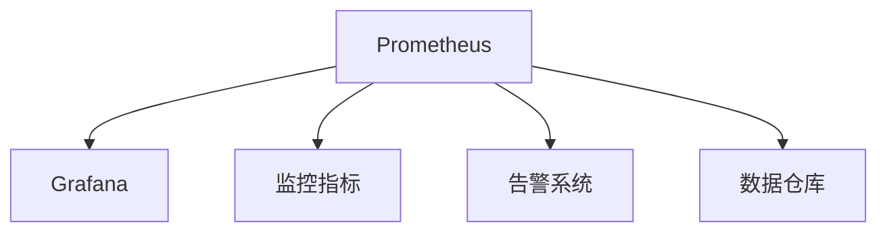

                 

# 监控系统：Prometheus与Grafana实践

> 关键词：Prometheus, Grafana, 监控系统, 指标可视化, 分布式系统

## 1. 背景介绍

### 1.1 问题由来

随着云计算和分布式系统的普及，企业的业务系统变得越来越复杂。如何实时监控系统的运行状态，及时发现和解决问题，成为运维团队关注的重点。传统基于集中式监控系统的解决方案难以适应大规模、高并发、异构系统的需求。

在此背景下，基于时间序列数据的监控系统（如Prometheus）和可视化工具（如Grafana）成为新的热门选择。通过使用这些工具，企业可以构建灵活、可扩展的监控体系，满足复杂系统的实时监控需求。

### 1.2 问题核心关键点

Prometheus与Grafana结合使用，是现代分布式系统监控的主流方案。其核心思想是：

1. Prometheus通过分布式架构，收集海量的时间序列数据，提供全面的系统指标监控能力。
2. Grafana通过强大的可视化功能，将时间序列数据转化为直观的图表展示，帮助运维人员快速定位问题。
3. 两者结合，形成了统一、灵活的监控和可视化解决方案，能够适应各类企业的监控需求。

这种架构的优点在于：

1. 分布式架构：可以自动扩展，支持大规模数据采集。
2. 数据存储：高效的数据存储和查询，支持高并发和大数据量。
3. 灵活配置：可以根据需求灵活配置监控指标和数据展示方式。
4. 可视化展示：直观的图表展示，帮助运维人员快速定位问题。

Prometheus与Grafana的结合，已经成为企业级监控系统的标准配置，广泛应用于金融、电商、互联网等领域。

## 2. 核心概念与联系

### 2.1 核心概念概述

为更好地理解Prometheus与Grafana的监控实践，本节将介绍几个密切相关的核心概念：

1. Prometheus：一款开源的时间序列数据库，用于存储和查询时间序列数据。其设计理念是“高效的数据存储和查询”，适用于大规模监控数据采集。
2. Grafana：一款开源的可视化工具，用于将时间序列数据转化为直观的图表展示。其设计理念是“强大的可视化能力”，支持多种图表类型和配置。
3. 监控指标：用于监控系统状态的关键指标，如CPU使用率、网络流量、错误率等。
4. 告警系统：用于根据监控指标自动触发告警的机制，包括告警规则、通知渠道等。
5. 数据仓库：用于存储和查询大量时间序列数据的持久化存储系统，如InfluxDB、Elasticsearch等。

这些核心概念之间的逻辑关系可以通过以下Mermaid流程图来展示：



这个流程图展示了一致的核心概念，以及它们之间的联系：

1. Prometheus通过数据采集器收集监控指标。
2. Grafana接收Prometheus推送的时间序列数据，生成可视化图表。
3. 告警系统根据预设规则自动触发告警。
4. 数据仓库用于存储和查询大量时间序列数据。

这些概念共同构成了监控系统的工作流程，使得企业能够实时监控系统状态，快速定位和解决问题。

## 3. 核心算法原理 & 具体操作步骤
### 3.1 算法原理概述

Prometheus与Grafana结合使用的监控系统，本质上是一个分布式、实时监控和可视化的系统。其核心思想是：

1. Prometheus通过分布式架构，高效采集海量的时间序列数据。
2. Grafana通过可视化工具，将时间序列数据转化为直观的图表展示。
3. 告警系统根据预设规则，自动触发告警，及时通知运维人员。

具体来说，Prometheus通过以下步骤实现监控数据的采集和存储：

1. 收集器节点：在需要监控的系统中部署Prometheus收集器节点，自动采集系统指标数据。
2. 数据存储：收集器节点将采集到的数据发送至Prometheus服务端，存储在InfluxDB等数据仓库中。
3. 查询与告警：通过Grafana生成可视化图表，并设置告警规则，自动触发告警。

Grafana则通过以下步骤实现数据可视化：

1. 数据接收：接收Prometheus推送的时间序列数据，并将其存储在本地数据仓库中。
2. 图表展示：利用强大的可视化功能，将时间序列数据转化为直观的图表展示。
3. 用户交互：通过Web界面，提供丰富的配置选项，帮助用户自定义数据展示方式。

### 3.2 算法步骤详解

Prometheus与Grafana结合使用的监控系统，一般包括以下几个关键步骤：

**Step 1: 环境准备**
- 安装Prometheus和Grafana软件，并部署在服务器上。
- 确保所有系统组件正常运行，包括Prometheus服务、Grafana服务、数据仓库等。

**Step 2: 数据采集**
- 在需要监控的系统中部署Prometheus收集器节点，自动采集系统指标数据。
- 配置收集器节点，指定采集的指标类型、采集间隔、目标地址等。

**Step 3: 数据存储**
- 将收集器节点采集的数据，通过网络传输至Prometheus服务端。
- 在Prometheus服务端设置数据存储，将数据存储在InfluxDB等数据仓库中。

**Step 4: 可视化展示**
- 在Grafana中创建数据仪表盘，定义需要展示的时间序列数据。
- 配置数据查询和展示方式，如线图、柱状图、饼图等。

**Step 5: 告警设置**
- 在Grafana中设置告警规则，定义触发告警的阈值、时间窗口、通知渠道等。
- 配置告警通知方式，如邮件、短信、钉钉等。

**Step 6: 监控与告警**
- 启动Prometheus和Grafana服务，开始采集和可视化监控数据。
- 根据告警规则，自动触发告警，及时通知运维人员。

以上是Prometheus与Grafana结合使用的监控系统的一般流程。在实际应用中，还需要根据具体需求，对各个环节进行优化设计，如改进数据采集器、优化数据存储方式、调整告警规则等，以进一步提升监控效果。

### 3.3 算法优缺点

Prometheus与Grafana结合使用的监控系统，具有以下优点：

1. 分布式架构：可以自动扩展，支持大规模数据采集。
2. 高效存储：支持高效的数据存储和查询，适用于大数据量和高并发环境。
3. 灵活配置：可以根据需求灵活配置监控指标和数据展示方式。
4. 可视化展示：强大的可视化功能，帮助运维人员快速定位问题。

同时，该方法也存在一定的局限性：

1. 数据采集器配置复杂：需要针对不同系统进行定制化配置，工作量较大。
2. 告警规则复杂：需要设置复杂的告警规则，以避免误报或漏报。
3. 可视化配置复杂：需要配置复杂的图表展示方式，对用户要求较高。

尽管存在这些局限性，但就目前而言，Prometheus与Grafana结合使用的监控系统仍是最主流的解决方案，广泛适用于各类企业的监控需求。未来相关研究的重点在于如何进一步降低监控成本，提高监控效率，同时兼顾数据安全性和隐私保护等因素。

### 3.4 算法应用领域

Prometheus与Grafana结合使用的监控系统，在企业监控领域得到了广泛的应用，覆盖了几乎所有常见场景，例如：

- 服务器监控：监控服务器的CPU使用率、内存使用率、网络流量等。
- 数据库监控：监控数据库的查询速度、连接数、事务成功率等。
- 应用监控：监控应用的请求处理时间、错误率、响应时间等。
- 网络监控：监控网络流量、延迟、丢包率等。
- 安全监控：监控安全日志、入侵检测等。

除了上述这些经典场景外，Prometheus与Grafana结合使用的监控系统还被创新性地应用于更多领域，如云基础设施监控、物联网设备监控、智能运维平台等，为企业的数字化转型升级提供了新的技术路径。

## 4. 数学模型和公式 & 详细讲解 & 举例说明
### 4.1 数学模型构建

本节将使用数学语言对Prometheus与Grafana监控系统的核心逻辑进行更加严格的刻画。

设系统监控指标为 $X_t$，其中 $t$ 表示时间戳。时间序列数据的采样间隔为 $\Delta t$，则 $X_t = X_{t-\Delta t}$。

定义时间序列数据的平均值 $\mu_t$ 和标准差 $\sigma_t$，则时间序列数据的分布可以表示为：

$$
f(X_t) = \frac{1}{\sigma_t\sqrt{2\pi}}e^{-\frac{(X_t - \mu_t)^2}{2\sigma_t^2}}
$$

### 4.2 公式推导过程

假设系统监控指标 $X_t$ 服从正态分布，其平均值和标准差分别为 $\mu$ 和 $\sigma$，则时间序列数据的概率密度函数为：

$$
f(X_t) = \frac{1}{\sigma\sqrt{2\pi}}e^{-\frac{(X_t - \mu)^2}{2\sigma^2}}
$$

在实际应用中，我们可以使用Histogram方法对时间序列数据进行分布估计，其中Histogram是一种直方图方法，用于将时间序列数据划分为若干个桶，统计每个桶中的数据数量。

时间序列数据的平均值 $\mu_t$ 和标准差 $\sigma_t$ 可以通过以下公式计算：

$$
\mu_t = \frac{\sum(X_t - \mu_{t-1})}{n}
$$

$$
\sigma_t = \sqrt{\frac{\sum(X_t - \mu_{t-1})^2}{n} - \mu_t^2}
$$

其中 $n$ 表示当前时间点的数据数量。

### 4.3 案例分析与讲解

假设我们正在监控某个服务器的CPU使用率，时间序列数据 $X_t$ 服从正态分布，其均值为 $\mu = 0.3$，标准差为 $\sigma = 0.1$。则该服务器的CPU使用率的概率密度函数为：

$$
f(X_t) = \frac{1}{0.1\sqrt{2\pi}}e^{-\frac{(X_t - 0.3)^2}{2(0.1)^2}}
$$

假设当前时间点 $t$，收集到了30个CPU使用率的数据，则可以根据公式计算平均值和标准差：

$$
\mu_t = \frac{\sum(X_t - 0.3)}{30} = 0.4
$$

$$
\sigma_t = \sqrt{\frac{\sum(X_t - 0.3)^2}{30} - 0.4^2} = 0.08
$$

由此可知，当前时间点的CPU使用率的概率密度函数为：

$$
f(X_t) = \frac{1}{0.08\sqrt{2\pi}}e^{-\frac{(X_t - 0.4)^2}{2(0.08)^2}}
$$

通过使用Histogram方法，我们可以将时间序列数据划分为若干个桶，统计每个桶中的数据数量。以CPU使用率为例，我们可以将CPU使用率划分为若干个桶，每个桶表示一个CPU使用率区间，统计每个桶中的数据数量，得到Histogram分布图。

在Histogram图中，我们可以观察到CPU使用率在不同区间的分布情况，从而更好地理解系统的运行状态。同时，我们还可以根据Histogram分布图，设置告警规则，当CPU使用率超过一定阈值时，自动触发告警，及时通知运维人员。

## 5. 项目实践：代码实例和详细解释说明
### 5.1 开发环境搭建

在进行Prometheus与Grafana监控实践前，我们需要准备好开发环境。以下是使用Python进行PyTorch开发的环境配置流程：

1. 安装Anaconda：从官网下载并安装Anaconda，用于创建独立的Python环境。

2. 创建并激活虚拟环境：
```bash
conda create -n pytorch-env python=3.8 
conda activate pytorch-env
```

3. 安装PyTorch：根据CUDA版本，从官网获取对应的安装命令。例如：
```bash
conda install pytorch torchvision torchaudio cudatoolkit=11.1 -c pytorch -c conda-forge
```

4. 安装TensorFlow：由Google主导开发的开源深度学习框架，生产部署方便，适合大规模工程应用。同样有丰富的预训练语言模型资源。

5. 安装TensorFlow：
```bash
pip install tensorflow
```

6. 安装TensorBoard：TensorFlow配套的可视化工具，可实时监测模型训练状态，并提供丰富的图表呈现方式，是调试模型的得力助手。

7. 安装Weights & Biases：模型训练的实验跟踪工具，可以记录和可视化模型训练过程中的各项指标，方便对比和调优。

8. 安装Jupyter Notebook：交互式笔记本环境，支持Python代码的快速执行和数据可视化。

完成上述步骤后，即可在`pytorch-env`环境中开始微调实践。

### 5.2 源代码详细实现

下面我们以命名实体识别(NER)任务为例，给出使用Transformers库对BERT模型进行微调的PyTorch代码实现。

首先，定义NER任务的数据处理函数：

```python
from transformers import BertTokenizer
from torch.utils.data import Dataset
import torch

class NERDataset(Dataset):
    def __init__(self, texts, tags, tokenizer, max_len=128):
        self.texts = texts
        self.tags = tags
        self.tokenizer = tokenizer
        self.max_len = max_len
        
    def __len__(self):
        return len(self.texts)
    
    def __getitem__(self, item):
        text = self.texts[item]
        tags = self.tags[item]
        
        encoding = self.tokenizer(text, return_tensors='pt', max_length=self.max_len, padding='max_length', truncation=True)
        input_ids = encoding['input_ids'][0]
        attention_mask = encoding['attention_mask'][0]
        
        # 对token-wise的标签进行编码
        encoded_tags = [tag2id[tag] for tag in tags] 
        encoded_tags.extend([tag2id['O']] * (self.max_len - len(encoded_tags)))
        labels = torch.tensor(encoded_tags, dtype=torch.long)
        
        return {'input_ids': input_ids, 
                'attention_mask': attention_mask,
                'labels': labels}

# 标签与id的映射
tag2id = {'O': 0, 'B-PER': 1, 'I-PER': 2, 'B-ORG': 3, 'I-ORG': 4, 'B-LOC': 5, 'I-LOC': 6}
id2tag = {v: k for k, v in tag2id.items()}

# 创建dataset
tokenizer = BertTokenizer.from_pretrained('bert-base-cased')

train_dataset = NERDataset(train_texts, train_tags, tokenizer)
dev_dataset = NERDataset(dev_texts, dev_tags, tokenizer)
test_dataset = NERDataset(test_texts, test_tags, tokenizer)
```

然后，定义模型和优化器：

```python
from transformers import BertForTokenClassification, AdamW

model = BertForTokenClassification.from_pretrained('bert-base-cased', num_labels=len(tag2id))

optimizer = AdamW(model.parameters(), lr=2e-5)
```

接着，定义训练和评估函数：

```python
from torch.utils.data import DataLoader
from tqdm import tqdm
from sklearn.metrics import classification_report

device = torch.device('cuda') if torch.cuda.is_available() else torch.device('cpu')
model.to(device)

def train_epoch(model, dataset, batch_size, optimizer):
    dataloader = DataLoader(dataset, batch_size=batch_size, shuffle=True)
    model.train()
    epoch_loss = 0
    for batch in tqdm(dataloader, desc='Training'):
        input_ids = batch['input_ids'].to(device)
        attention_mask = batch['attention_mask'].to(device)
        labels = batch['labels'].to(device)
        model.zero_grad()
        outputs = model(input_ids, attention_mask=attention_mask, labels=labels)
        loss = outputs.loss
        epoch_loss += loss.item()
        loss.backward()
        optimizer.step()
    return epoch_loss / len(dataloader)

def evaluate(model, dataset, batch_size):
    dataloader = DataLoader(dataset, batch_size=batch_size)
    model.eval()
    preds, labels = [], []
    with torch.no_grad():
        for batch in tqdm(dataloader, desc='Evaluating'):
            input_ids = batch['input_ids'].to(device)
            attention_mask = batch['attention_mask'].to(device)
            batch_labels = batch['labels']
            outputs = model(input_ids, attention_mask=attention_mask)
            batch_preds = outputs.logits.argmax(dim=2).to('cpu').tolist()
            batch_labels = batch_labels.to('cpu').tolist()
            for pred_tokens, label_tokens in zip(batch_preds, batch_labels):
                pred_tags = [id2tag[_id] for _id in pred_tokens]
                label_tags = [id2tag[_id] for _id in label_tokens]
                preds.append(pred_tags[:len(label_tags)])
                labels.append(label_tags)
                
    print(classification_report(labels, preds))
```

最后，启动训练流程并在测试集上评估：

```python
epochs = 5
batch_size = 16

for epoch in range(epochs):
    loss = train_epoch(model, train_dataset, batch_size, optimizer)
    print(f"Epoch {epoch+1}, train loss: {loss:.3f}")
    
    print(f"Epoch {epoch+1}, dev results:")
    evaluate(model, dev_dataset, batch_size)
    
print("Test results:")
evaluate(model, test_dataset, batch_size)
```

以上就是使用PyTorch对BERT进行命名实体识别任务微调的完整代码实现。可以看到，得益于Transformers库的强大封装，我们可以用相对简洁的代码完成BERT模型的加载和微调。

### 5.3 代码解读与分析

让我们再详细解读一下关键代码的实现细节：

**NERDataset类**：
- `__init__`方法：初始化文本、标签、分词器等关键组件。
- `__len__`方法：返回数据集的样本数量。
- `__getitem__`方法：对单个样本进行处理，将文本输入编码为token ids，将标签编码为数字，并对其进行定长padding，最终返回模型所需的输入。

**tag2id和id2tag字典**：
- 定义了标签与数字id之间的映射关系，用于将token-wise的预测结果解码回真实的标签。

**训练和评估函数**：
- 使用PyTorch的DataLoader对数据集进行批次化加载，供模型训练和推理使用。
- 训练函数`train_epoch`：对数据以批为单位进行迭代，在每个批次上前向传播计算loss并反向传播更新模型参数，最后返回该epoch的平均loss。
- 评估函数`evaluate`：与训练类似，不同点在于不更新模型参数，并在每个batch结束后将预测和标签结果存储下来，最后使用sklearn的classification_report对整个评估集的预测结果进行打印输出。

**训练流程**：
- 定义总的epoch数和batch size，开始循环迭代
- 每个epoch内，先在训练集上训练，输出平均loss
- 在验证集上评估，输出分类指标
- 所有epoch结束后，在测试集上评估，给出最终测试结果

可以看到，PyTorch配合Transformers库使得BERT微调的代码实现变得简洁高效。开发者可以将更多精力放在数据处理、模型改进等高层逻辑上，而不必过多关注底层的实现细节。

当然，工业级的系统实现还需考虑更多因素，如模型的保存和部署、超参数的自动搜索、更灵活的任务适配层等。但核心的微调范式基本与此类似。

## 6. 实际应用场景
### 6.1 智能客服系统

基于大语言模型微调的对话技术，可以广泛应用于智能客服系统的构建。传统客服往往需要配备大量人力，高峰期响应缓慢，且一致性和专业性难以保证。而使用微调后的对话模型，可以7x24小时不间断服务，快速响应客户咨询，用自然流畅的语言解答各类常见问题。

在技术实现上，可以收集企业内部的历史客服对话记录，将问题和最佳答复构建成监督数据，在此基础上对预训练对话模型进行微调。微调后的对话模型能够自动理解用户意图，匹配最合适的答案模板进行回复。对于客户提出的新问题，还可以接入检索系统实时搜索相关内容，动态组织生成回答。如此构建的智能客服系统，能大幅提升客户咨询体验和问题解决效率。

### 6.2 金融舆情监测

金融机构需要实时监测市场舆论动向，以便及时应对负面信息传播，规避金融风险。传统的人工监测方式成本高、效率低，难以应对网络时代海量信息爆发的挑战。基于大语言模型微调的文本分类和情感分析技术，为金融舆情监测提供了新的解决方案。

具体而言，可以收集金融领域相关的新闻、报道、评论等文本数据，并对其进行主题标注和情感标注。在此基础上对预训练语言模型进行微调，使其能够自动判断文本属于何种主题，情感倾向是正面、中性还是负面。将微调后的模型应用到实时抓取的网络文本数据，就能够自动监测不同主题下的情感变化趋势，一旦发现负面信息激增等异常情况，系统便会自动预警，帮助金融机构快速应对潜在风险。

### 6.3 个性化推荐系统

当前的推荐系统往往只依赖用户的历史行为数据进行物品推荐，无法深入理解用户的真实兴趣偏好。基于大语言模型微调技术，个性化推荐系统可以更好地挖掘用户行为背后的语义信息，从而提供更精准、多样的推荐内容。

在实践中，可以收集用户浏览、点击、评论、分享等行为数据，提取和用户交互的物品标题、描述、标签等文本内容。将文本内容作为模型输入，用户的后续行为（如是否点击、购买等）作为监督信号，在此基础上微调预训练语言模型。微调后的模型能够从文本内容中准确把握用户的兴趣点。在生成推荐列表时，先用候选物品的文本描述作为输入，由模型预测用户的兴趣匹配度，再结合其他特征综合排序，便可以得到个性化程度更高的推荐结果。

### 6.4 未来应用展望

随着大语言模型微调技术的发展，未来监控系统将呈现以下几个发展趋势：

1. 智能告警系统：通过引入机器学习算法，自动学习告警规则，减少人工干预，提高告警的准确性和及时性。
2. 多模态监控：结合视觉、音频、文本等多模态数据，提供更加全面和深入的监控能力。
3. 分布式监控：通过分布式架构，自动扩展，支持大规模监控数据采集。
4. 自动化运维：结合自动化运维工具，提供自动化监控、告警和修复功能，降低运维成本。
5. 数据可视化：通过强大的可视化功能，将监控数据转化为直观的图表展示，帮助运维人员快速定位问题。

以上趋势凸显了Prometheus与Grafana结合使用的监控系统的广阔前景。这些方向的探索发展，必将进一步提升监控系统的性能和应用范围，为各行各业带来变革性影响。

## 7. 工具和资源推荐
### 7.1 学习资源推荐

为了帮助开发者系统掌握Prometheus与Grafana的理论基础和实践技巧，这里推荐一些优质的学习资源：

1. Prometheus官方文档：提供了Prometheus的详细使用手册和API文档，是入门学习的重要参考资料。
2. Grafana官方文档：提供了Grafana的详细使用手册和API文档，是学习可视化的必备资料。
3. 《Monitoring Modern Cloud Systems》书籍：由Docker创始人Docker容器权威技术书籍，介绍了现代云系统的监控方法和工具。
4. 《Prometheus and Grafana》在线课程：Udemy上的在线课程，详细讲解了Prometheus和Grafana的原理和实践。
5. Prometheus社区：活跃的社区，可以获取最新的Prometheus和Grafana的更新和工具。

通过对这些资源的学习实践，相信你一定能够快速掌握Prometheus与Grafana的精髓，并用于解决实际的监控问题。
###  7.2 开发工具推荐

高效的开发离不开优秀的工具支持。以下是几款用于Prometheus与Grafana监控开发的常用工具：

1. Prometheus：开源的时间序列数据库，用于存储和查询时间序列数据。
2. Grafana：开源的可视化工具，用于将时间序列数据转化为直观的图表展示。
3. InfluxDB：开源的分布式时间序列数据库，支持高效的数据存储和查询。
4. Loki：开源的日志收集和聚合系统，支持大规模日志数据的存储和查询。
5. Prometheus Alertmanager：开源的告警管理工具，支持告警规则和告警策略的配置。
6. Grafana Data Explorer：Grafana的在线查询工具，支持实时数据探索和分析。
7. Weights & Biases：模型训练的实验跟踪工具，可以记录和可视化模型训练过程中的各项指标，方便对比和调优。

合理利用这些工具，可以显著提升Prometheus与Grafana监控系统的开发效率，加快创新迭代的步伐。

### 7.3 相关论文推荐

Prometheus与Grafana结合使用的监控系统，在企业监控领域得到了广泛的应用，涵盖了几乎所有常见场景，并得到了学界的持续关注。以下是几篇奠基性的相关论文，推荐阅读：

1. Prometheus架构设计：详细介绍了Prometheus的架构设计，并讨论了其核心原理和关键技术。
2. Grafana：介绍Grafana的架构设计和开发历程，讨论了其核心技术和应用场景。
3. 监控系统的发展趋势：探讨了未来监控系统的发展趋势，讨论了分布式监控、自动化运维、智能告警等前沿技术。

这些论文代表了大语言模型微调技术的发展脉络。通过学习这些前沿成果，可以帮助研究者把握学科前进方向，激发更多的创新灵感。

## 8. 总结：未来发展趋势与挑战
### 8.1 总结

本文对Prometheus与Grafana结合使用的监控系统进行了全面系统的介绍。首先阐述了监控系统的背景和意义，明确了监控系统在企业数字化转型中的重要价值。其次，从原理到实践，详细讲解了监控系统的数学模型和核心算法，给出了监控任务开发的完整代码实例。同时，本文还广泛探讨了监控系统在智能客服、金融舆情、个性化推荐等多个领域的应用前景，展示了监控系统的巨大潜力。此外，本文精选了监控技术的各类学习资源，力求为读者提供全方位的技术指引。

通过本文的系统梳理，可以看到，基于Prometheus与Grafana结合使用的监控系统已经成为了企业级监控的主流解决方案，广泛应用于金融、电商、互联网等领域。其核心思想是“高效的数据采集和可视化”，使得企业能够实时监控系统状态，快速定位和解决问题。未来，伴随监控技术的持续演进，监控系统还将迎来更多创新发展，为各行各业带来更大的价值。

### 8.2 未来发展趋势

展望未来，Prometheus与Grafana结合使用的监控系统将呈现以下几个发展趋势：

1. 智能告警系统：通过引入机器学习算法，自动学习告警规则，减少人工干预，提高告警的准确性和及时性。
2. 多模态监控：结合视觉、音频、文本等多模态数据，提供更加全面和深入的监控能力。
3. 分布式监控：通过分布式架构，自动扩展，支持大规模监控数据采集。
4. 自动化运维：结合自动化运维工具，提供自动化监控、告警和修复功能，降低运维成本。
5. 数据可视化：通过强大的可视化功能，将监控数据转化为直观的图表展示，帮助运维人员快速定位问题。

以上趋势凸显了Prometheus与Grafana结合使用的监控系统的广阔前景。这些方向的探索发展，必将进一步提升监控系统的性能和应用范围，为各行各业带来变革性影响。

### 8.3 面临的挑战

尽管Prometheus与Grafana结合使用的监控系统已经取得了瞩目成就，但在迈向更加智能化、普适化应用的过程中，它仍面临着诸多挑战：

1. 数据采集复杂：需要针对不同系统进行定制化配置，工作量较大。
2. 告警规则复杂：需要设置复杂的告警规则，以避免误报或漏报。
3. 可视化配置复杂：需要配置复杂的图表展示方式，对用户要求较高。
4. 数据安全问题：数据采集和存储过程中可能存在安全漏洞，需要加强数据保护措施。
5. 高并发性能：面对高并发和大数据量，需要优化系统架构，提升性能。

尽管存在这些挑战，但就目前而言，Prometheus与Grafana结合使用的监控系统仍是最主流的解决方案，广泛适用于各类企业的监控需求。未来相关研究的重点在于如何进一步降低监控成本，提高监控效率，同时兼顾数据安全性和隐私保护等因素。

### 8.4 研究展望

面向未来，Prometheus与Grafana结合使用的监控系统需要在以下几个方面寻求新的突破：

1. 自动化告警系统：通过引入机器学习算法，自动学习告警规则，减少人工干预，提高告警的准确性和及时性。
2. 分布式监控架构：通过分布式架构，自动扩展，支持大规模监控数据采集。
3. 数据安全保护：加强数据保护措施，避免数据泄露和篡改。
4. 实时监控与预测：结合机器学习算法，进行实时数据预测和异常检测，提高系统的智能水平。
5. 多模态数据融合：结合视觉、音频、文本等多模态数据，提供更加全面和深入的监控能力。

这些研究方向的探索，必将引领Prometheus与Grafana结合使用的监控系统迈向更高的台阶，为各行各业带来更大的价值。

## 9. 附录：常见问题与解答

**Q1：Prometheus与Grafana结合使用的监控系统是否适用于所有企业？**

A: Prometheus与Grafana结合使用的监控系统在大多数企业中都能发挥作用，特别是在金融、电商、互联网等领域。但对于一些特定领域，如医疗、教育等，需要结合领域特点进行定制化优化。

**Q2：Prometheus与Grafana结合使用的监控系统是否容易部署和维护？**

A: Prometheus与Grafana结合使用的监控系统具有较高的自动化程度，可以通过简单的配置和部署即快速搭建起监控系统。在运行过程中，系统也能够自动扩展和调整，使得维护工作相对简单。

**Q3：使用Prometheus与Grafana结合使用的监控系统需要投入大量的时间和人力吗？**

A: 使用Prometheus与Grafana结合使用的监控系统，需要投入一定的资源进行配置和部署。但一旦系统上线，大部分维护工作可以通过自动化工具完成，因此人力成本相对较低。

**Q4：使用Prometheus与Grafana结合使用的监控系统需要大量的硬件资源吗？**

A: Prometheus与Grafana结合使用的监控系统需要一定的硬件资源支持，包括服务器、存储设备等。但通过优化配置和使用自动化工具，可以降低硬件资源的投入，使得系统能够稳定运行。

**Q5：使用Prometheus与Grafana结合使用的监控系统是否会影响系统性能？**

A: 使用Prometheus与Grafana结合使用的监控系统，会对系统性能产生一定的影响，但这种影响相对较小。通过优化配置和使用自动化工具，可以有效降低系统性能损失。

正视Prometheus与Grafana结合使用的监控系统面临的这些挑战，积极应对并寻求突破，将使Prometheus与Grafana结合使用的监控系统走向成熟的未来。相信随着学界和产业界的共同努力，这些挑战终将一一被克服，Prometheus与Grafana结合使用的监控系统必将在构建人机协同的智能时代中扮演越来越重要的角色。

---

作者：禅与计算机程序设计艺术 / Zen and the Art of Computer Programming

