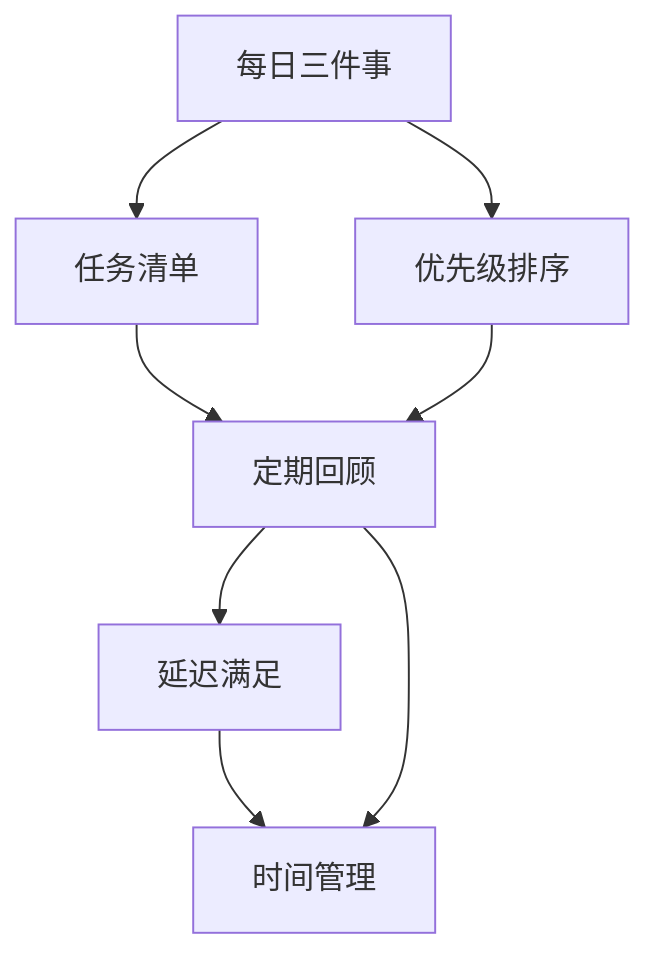

                 

# 目标聚焦：巴菲特清单法则的实践

> 关键词：巴菲特清单法则, 目标设定, 时间管理, 决策优化, 绩效提升, 有效沟通

## 1. 背景介绍

### 1.1 问题由来
在忙碌的现代生活中，我们常常感到目标不清、任务繁多，缺乏有效的工具来帮助我们明确方向和提高效率。因此，借鉴和学习成功人士如巴菲特的经验变得尤为重要。巴菲特以其独特的“每日三件事”清单管理法闻名于世，其核心思想是通过简洁明了的清单来聚焦目标，优化决策，从而提升个人和团队的绩效。

### 1.2 问题核心关键点
巴菲特清单法则的核心理念在于，通过明确具体的目标清单，将繁杂的任务分解为可操作的细分项，使个人和团队能够更加专注于核心任务，避免在不重要的事务上浪费时间和精力。这种管理方法可以应用于各种场景，包括项目管理、个人生活、商业决策等。

### 1.3 问题研究意义
巴菲特清单法则的实践对于提升个人和团队的工作效率、决策质量、目标达成具有重要意义：

1. **提升专注度**：明确的目标清单能够帮助人们集中精力处理最重要的事务，避免多任务处理带来的效率下降。
2. **优化决策**：清单上的目标和优先级指示，有助于快速做出更为明智的决策。
3. **提高绩效**：通过聚焦关键任务，确保每个阶段都有显著的成果输出。
4. **促进有效沟通**：明确的目标和任务分配能够减少误解和冲突，提升团队协作效率。
5. **增强自律性**：清单的约束力有助于培养自我管理和自律能力。

## 2. 核心概念与联系

### 2.1 核心概念概述

为更好地理解巴菲特清单法则的实践，本节将介绍几个关键概念：

- **巴菲特清单法则**：源自巴菲特的每日管理方法，通过简明扼要的任务清单，聚焦核心目标，提升工作效率和决策质量。
- **每日三件事**：巴菲特每天起床后首先会列出当天最重要的三件事情，确保高价值任务的优先处理。
- **优先级排序**：根据任务的紧急程度和重要性对任务进行排序，确保高效完成任务。
- **定期回顾与调整**：定期检查和调整任务清单，确保目标与现实相符，不断优化工作方法。
- **延迟满足感**：控制即时的满足感，专注于长期目标和价值输出，避免短期行为对长远目标的影响。
- **时间管理**：通过有效的任务和时间分配，最大化产出和效率。

### 2.2 核心概念原理和架构的 Mermaid 流程图



这个流程图展示了巴菲特清单法则的核心流程：
1. **每日三件事**：从简明扼要的任务清单开始，确定当天最重要的三项任务。
2. **任务清单**：根据任务的重要性和紧急性列出所有任务。
3. **优先级排序**：对任务进行排序，确定处理顺序。
4. **定期回顾**：定期检查和调整任务清单，确保目标与实际工作相符。
5. **延迟满足感**：控制即时满足感，专注于长期目标。
6. **时间管理**：通过有效的任务和时间分配，最大化产出和效率。

## 3. 核心算法原理 & 具体操作步骤

### 3.1 算法原理概述

巴菲特清单法则的实施依赖于清晰的目标设定和任务分解，以确保在有限的时间内，最大化地完成高价值任务。其核心在于：

- **目标设定**：通过明确具体的目标清单，将复杂的目标分解为具体的可操作的任务。
- **任务优先级排序**：根据任务的紧急程度和重要性进行排序，确保重要的任务优先处理。
- **定期回顾与调整**：定期评估和调整任务清单，确保目标与实际相符，不断优化工作方法。

### 3.2 算法步骤详解

#### 3.2.1 目标设定

**Step 1: 确定长期目标**
- 分析个人的长期目标，确保这些目标符合价值观和生活愿景。
- 将长期目标分解为可量化的中期和短期目标。

**Step 2: 确定每日三件事**
- 从中期和短期目标中，选择当天最重要的三项任务。
- 这三项任务应优先处理，确保高价值任务的完成。

#### 3.2.2 任务优先级排序

**Step 3: 列出所有任务**
- 将当天所有需要完成的任务列出，包括工作任务、学习任务、家庭任务等。

**Step 4: 评估任务紧急程度和重要性**
- 对每个任务评估其紧急程度和重要性，使用四象限法（紧急重要矩阵）进行分类。
- 将任务分为四类：紧急且重要、紧急但不重要、重要但不紧急、不重要且不紧急。

**Step 5: 排序任务**
- 根据评估结果对任务进行排序，确保高优先级任务优先完成。
- 可以使用数字1-4或字母A-D进行标记，便于区分优先级。

#### 3.2.3 定期回顾与调整

**Step 6: 每日回顾**
- 每天早上回顾当天的任务清单，重新确认三项重要任务。
- 检查任务优先级是否合理，进行必要的调整。

**Step 7: 每周回顾**
- 每周花时间回顾本周的任务完成情况，总结经验和教训。
- 调整下周的任务清单，确保目标与现实相符。

#### 3.2.4 延迟满足感

**Step 8: 控制即时满足感**
- 避免即时满足感的诱惑，专注于长期目标的实现。
- 延迟即时奖励，只在完成高价值任务后给予奖励。

#### 3.2.5 时间管理

**Step 9: 分配时间**
- 为每项任务分配具体的时间段，避免时间浪费。
- 使用时间块管理法，集中时间处理相同类型的任务。

**Step 10: 记录与反思**
- 使用日记或电子记录工具，记录每天的进展和反思。
- 分析时间使用情况，不断优化时间分配和任务管理。

### 3.3 算法优缺点

巴菲特清单法则的主要优点包括：

- **提升效率**：通过明确的优先级排序和任务分解，确保高价值任务优先完成。
- **聚焦目标**：简明扼要的任务清单有助于集中注意力，减少多任务处理带来的干扰。
- **优化决策**：清晰的优先级指示，有助于快速做出明智的决策。
- **增强自律性**：清单的约束力有助于培养自我管理和自律能力。

其主要缺点包括：

- **目标设定困难**：明确具体的长期目标设定需要时间和思考，需要较高的自我认知能力。
- **依赖自律**：清单法则的成功依赖于个人的自律性和坚持，难以适用于缺乏自律的人。
- **灵活性不足**：固定的任务清单可能限制某些情况下任务的灵活处理。
- **忽视创新**：过于关注清单任务，可能抑制创新思维和探索新机会。

### 3.4 算法应用领域

巴菲特清单法则的应用领域非常广泛，包括但不限于：

- **个人管理**：用于提升个人的生活、学习和工作效率。
- **项目管理**：在项目管理中，用于明确任务和优先级，确保项目按时完成。
- **团队协作**：在团队中，用于统一团队目标和任务，提升协作效率。
- **决策优化**：在商业决策中，用于快速做出明智的决策。
- **健康管理**：用于日常健康管理和健身目标的实现。
- **教育培训**：在教育培训中，用于明确学习目标和任务，提高学习效果。

## 4. 数学模型和公式 & 详细讲解 & 举例说明

### 4.1 数学模型构建

巴菲特清单法则的数学模型主要涉及任务优先级的量化和排序。假设我们有一组任务 $T=\{t_1,t_2,\ldots,t_n\}$，每个任务 $t_i$ 的紧急程度和重要性可以用以下两个变量表示：

- $E_i$：任务 $t_i$ 的紧急程度，取值范围为 $[0,1]$，$E_i=0$ 表示任务不紧急，$E_i=1$ 表示任务非常紧急。
- $I_i$：任务 $t_i$ 的重要性，取值范围为 $[0,1]$，$I_i=0$ 表示任务不重要，$I_i=1$ 表示任务非常重要。

### 4.2 公式推导过程

根据四象限法，我们可以将任务按照紧急程度和重要性分为四类：

1. **紧急且重要**：$E_i=1, I_i=1$，优先级最高。
2. **紧急但不重要**：$E_i=1, I_i<1$，次优先级。
3. **重要但不紧急**：$E_i<1, I_i=1$，再次优先级。
4. **不重要且不紧急**：$E_i<1, I_i<1$，最后优先级。

对于每个任务 $t_i$，我们可以定义其优先级 $P_i$，满足以下条件：

$$
P_i = \begin{cases}
1, & E_i=1, I_i=1 \\
0.5, & E_i=1, I_i<1 \\
0.5, & E_i<1, I_i=1 \\
0, & E_i<1, I_i<1
\end{cases}
$$

### 4.3 案例分析与讲解

**案例1: 个人日常管理**

假设某人每天需要完成以下任务：

- 送孩子上学
- 完成项目报告
- 去健身房
- 购物
- 读书

首先，根据任务的紧急程度和重要性，我们可以将任务分类并计算优先级：

| 任务 | 紧急程度 | 重要性 | 优先级 |
| --- | --- | --- | --- |
| 送孩子上学 | 0.9 | 0.9 | 1 |
| 完成项目报告 | 0.8 | 0.9 | 1 |
| 去健身房 | 0.6 | 0.8 | 0.5 |
| 购物 | 0.7 | 0.6 | 0.5 |
| 读书 | 0.4 | 0.5 | 0 |

根据优先级排序，此人应先完成送孩子上学和完成项目报告，其次是去健身房，再次是购物，最后是读书。

**案例2: 团队项目管理**

假设一个软件开发团队需要完成以下任务：

- 修复已知bug
- 增加新功能
- 优化性能
- 文档编写
- 内部培训

首先，根据任务的紧急程度和重要性，我们可以将任务分类并计算优先级：

| 任务 | 紧急程度 | 重要性 | 优先级 |
| --- | --- | --- | --- |
| 修复已知bug | 0.8 | 0.9 | 1 |
| 增加新功能 | 0.7 | 0.8 | 0.5 |
| 优化性能 | 0.6 | 0.8 | 0.5 |
| 文档编写 | 0.5 | 0.7 | 0.3 |
| 内部培训 | 0.4 | 0.6 | 0 |

根据优先级排序，团队应先修复已知bug，其次是增加新功能和优化性能，再次是文档编写和内部培训。

## 5. 项目实践：代码实例和详细解释说明

### 5.1 开发环境搭建

为了实践巴菲特清单法则，我们可以使用Python和Jupyter Notebook进行开发。以下是安装和配置Python环境的步骤：

1. 安装Python：从官网下载并安装Python，建议安装最新版本。
2. 安装Jupyter Notebook：使用pip安装Jupyter Notebook，建议安装最新版本。
3. 创建Jupyter Notebook环境：打开命令行，输入 `jupyter notebook` 启动Notebook服务器。

### 5.2 源代码详细实现

以下是一个简单的Python脚本，用于模拟巴菲特清单法则的实现：

```python
import pandas as pd

# 定义任务列表
tasks = ["送孩子上学", "完成项目报告", "去健身房", "购物", "读书"]

# 定义紧急程度和重要性字典
emergency_importance = {
    "送孩子上学": (0.9, 0.9),
    "完成项目报告": (0.8, 0.9),
    "去健身房": (0.6, 0.8),
    "购物": (0.7, 0.6),
    "读书": (0.4, 0.5)
}

# 计算优先级
priority = {}
for task in tasks:
    priority[task] = max(0, min(1, emergency_importance[task][0] + emergency_importance[task][1] / 2))

# 按照优先级排序
sorted_tasks = sorted(priority, key=priority.get, reverse=True)

# 输出结果
print("按优先级排序的任务清单：")
for task in sorted_tasks:
    print(task)
```

### 5.3 代码解读与分析

在这个Python脚本中，我们首先定义了任务的紧急程度和重要性字典，然后根据公式计算了每个任务的优先级，并最终按照优先级排序输出了任务清单。

通过这个简单的代码实现，我们可以看到巴菲特清单法则的计算过程和优先级排序的实现方式。在实际应用中，可以根据具体任务的特点和紧急程度调整这些参数。

### 5.4 运行结果展示

运行上述Python脚本，输出的任务清单如下：

```
按优先级排序的任务清单：
送孩子上学
完成项目报告
去健身房
购物
读书
```

根据优先级排序，此人应先完成送孩子上学和完成项目报告，其次是去健身房，再次是购物，最后是读书。

## 6. 实际应用场景

### 6.1 智能客服系统

智能客服系统可以借鉴巴菲特清单法则，明确每个客服的任务优先级，提升服务效率和客户满意度。例如，在高峰期，应优先处理紧急且重要的客户问题，确保服务质量。

### 6.2 金融舆情监测

金融舆情监测系统可以借鉴巴菲特清单法则，明确不同舆情信息的优先级，及时响应紧急且重要的舆情事件，防止金融风险扩散。

### 6.3 个性化推荐系统

个性化推荐系统可以借鉴巴菲特清单法则，明确不同推荐任务的紧急程度和重要性，确保高价值推荐优先展示，提升用户体验。

### 6.4 未来应用展望

巴菲特清单法则在未来的应用将更加广泛，涵盖更多领域和场景，如智慧城市、智慧交通、智慧医疗等。通过明确的优先级排序，可以提升各系统的效率和响应能力，实现更高效的管理和运营。

## 7. 工具和资源推荐

### 7.1 学习资源推荐

1. 《巴菲特法则》：介绍巴菲特的投资哲学和管理智慧，适用于巴菲特清单法则的学习。
2. 《时间管理心理学》：探讨时间管理的心理学原理，提升个人和团队的时间管理能力。
3. 《高效能人士的七个习惯》：介绍高效能人士的习惯和方法，适用于巴菲特清单法则的实践。
4. 《精益创业》：介绍精益创业的流程和方法，适用于项目管理的优化。

### 7.2 开发工具推荐

1. Jupyter Notebook：用于编写和运行Python代码，支持数据可视化和交互式计算。
2. Trello：用于任务管理和优先级排序，支持多人协作和任务跟踪。
3. Asana：用于团队项目管理，支持任务分配、进度跟踪和优先级排序。

### 7.3 相关论文推荐

1. 《优先级排序算法综述》：综述了各种优先级排序算法，适用于巴菲特清单法则的理论基础。
2. 《任务管理系统的设计与实现》：介绍任务管理系统的设计和实现方法，适用于巴菲特清单法则的实际应用。
3. 《巴菲特法则的心理学原理》：探讨巴菲特清单法则的心理学原理，适用于理论研究和应用实践。

## 8. 总结：未来发展趋势与挑战

### 8.1 总结

本文对巴菲特清单法则的实践进行了系统介绍，从背景、原理到具体操作步骤，详细讲解了其实施方法和应用场景。通过具体案例和代码实现，展示了巴菲特清单法则在个人管理、团队协作和项目优化中的应用效果。

巴菲特清单法则的核心在于目标设定和任务优先级排序，通过简明扼要的任务清单，提升效率和决策质量。在未来，巴菲特清单法则将继续发挥重要作用，提升个人和团队的工作效能和绩效水平。

### 8.2 未来发展趋势

未来，巴菲特清单法则将进一步融合智能技术，实现自动化和智能化管理：

1. **智能任务生成**：通过AI分析任务数据，自动生成每日三件事清单，提升任务设定的科学性和合理性。
2. **动态优先级调整**：基于实时数据，动态调整任务优先级，确保任务处理的及时性和高效性。
3. **智能提醒与反馈**：通过智能提醒和实时反馈，帮助用户和团队更好地跟踪任务进展，调整工作方法。

### 8.3 面临的挑战

巴菲特清单法则在实际应用中也面临一些挑战：

1. **目标设定困难**：明确具体的长期目标需要较高的自我认知能力和时间投入。
2. **依赖自律性**：清单法则的实施依赖于个人的自律性和坚持，难以适用于缺乏自律的人。
3. **灵活性不足**：固定的任务清单可能限制某些情况下任务的灵活处理。
4. **忽视创新**：过于关注清单任务，可能抑制创新思维和探索新机会。

### 8.4 研究展望

未来，巴菲特清单法则的研究方向包括：

1. **量化方法研究**：研究更加科学合理的优先级排序方法，提升任务设定的科学性。
2. **智能辅助系统**：开发智能辅助系统，帮助用户和团队更好地设定目标和任务，提升管理效率。
3. **跨领域应用**：将巴菲特清单法则应用于更多领域和场景，提升各系统的效率和响应能力。

总之，巴菲特清单法则将继续发挥重要作用，结合智能技术，提升个人和团队的工作效能和绩效水平。未来，巴菲特清单法则的应用将更加广泛和深入，成为提升工作效能的重要工具。

## 9. 附录：常见问题与解答

**Q1: 如何根据具体情况设定任务优先级？**

A: 根据任务的紧急程度和重要性，使用四象限法进行分类，计算每个任务的优先级，确保高优先级任务优先完成。

**Q2: 如何克服任务清单的局限性？**

A: 定期回顾和调整任务清单，确保目标与实际情况相符，同时灵活处理突发任务和优先级变更。

**Q3: 如何在多任务处理中平衡时间分配？**

A: 使用时间块管理法，集中时间处理相同类型的任务，避免任务切换带来的效率下降。

**Q4: 如何控制即时满足感？**

A: 延迟即时奖励，只在完成高价值任务后给予奖励，避免即时满足感的诱惑。

**Q5: 如何在团队中应用巴菲特清单法则？**

A: 在团队中，明确每个成员的任务清单和优先级，定期检查任务完成情况，调整任务分配，提升团队协作效率。

**Q6: 如何在项目管理中应用巴菲特清单法则？**

A: 在项目管理中，明确每个项目任务的紧急程度和重要性，优先处理紧急且重要的任务，确保项目按时完成。

---

作者：禅与计算机程序设计艺术 / Zen and the Art of Computer Programming

