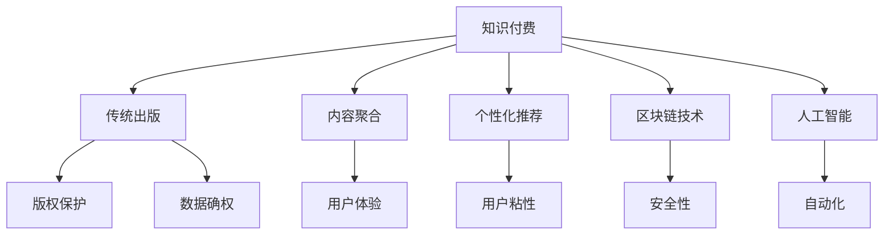

                 

# 知识付费与传统出版的融合之路

> 关键词：知识付费, 传统出版, 融合, 技术驱动, 版权保护, 商业模式创新, 教育升级

## 1. 背景介绍

### 1.1 问题由来

随着互联网的迅猛发展和技术的不断进步，知识的获取方式和传播途径发生了翻天覆地的变化。从传统的纸质书籍到电子图书，再到在线教育平台，知识的传播变得更加便捷和高效。但与此同时，随着知识产出的增多和传播渠道的多样化，传统的出版业面临着严峻的挑战。传统的出版模式主要是依靠高成本的印刷和销售，难以适应互联网时代的快速变化。而随着知识付费的兴起，越来越多的人开始为优质内容买单，传统出版业与知识付费模式的融合变得迫在眉睫。

### 1.2 问题核心关键点

如何实现传统出版业与知识付费模式的融合，提升内容的价值和传播效率，增强用户体验，同时保护作者和出版商的权益，是这一融合之路的核心挑战。以下将从技术、内容、商业、教育等多个层面探讨这一问题。

## 2. 核心概念与联系

### 2.1 核心概念概述

为更好地理解知识付费与传统出版的融合之路，本节将介绍几个密切相关的核心概念：

- 知识付费(Knowledge-As-A-Service, KaaS)：指用户为获取深度、专精、系统化内容而支付费用的模式，是信息时代知识价值的货币化。

- 传统出版(Traditional Publishing)：指以纸质书籍、期刊等物理或数字出版物为载体的出版模式，依赖于实体生产和销售渠道。

- 内容聚合与个性化推荐(Content Aggregation & Personalized Recommendation)：指通过算法和大数据分析，将用户感兴趣的内容推荐给其个性化需求，提升用户体验。

- 区块链技术(Blockchain Technology)：指去中心化的分布式账本技术，具有不可篡改、透明、安全性高等特点，适合应用于版权保护、数据确权等领域。

- 人工智能(Artificial Intelligence)：指利用机器学习和深度学习技术，使机器具备类似人类的智能能力，用于自动化内容推荐、版权验证等。

这些核心概念之间的逻辑关系可以通过以下Mermaid流程图来展示：



这个流程图展示了几类关键概念之间的关系：

1. 知识付费和传统出版的关系：知识付费是传统出版的补充和提升，能更好地实现内容价值。
2. 内容聚合和个性化推荐：通过算法和大数据分析，提升内容的个性化推荐，增强用户体验。
3. 区块链和人工智能：利用区块链技术提升版权保护和数据确权，使用人工智能技术进行自动化内容推荐。
4. 版权保护和数据确权：区块链和人工智能能帮助传统出版实现数字化转型，更好地保护版权和确权数据。

这些核心概念共同构成了知识付费与传统出版的融合框架，使其能够高效、安全、可控地实现内容的价值化。

## 3. 核心算法原理 & 具体操作步骤

### 3.1 算法原理概述

知识付费与传统出版的融合，本质上是一个内容价值提升和传播渠道优化的过程。其核心思想是：

1. 对传统出版内容进行数字化和互联网化，使其更易于传播和交互。
2. 借助技术手段，将传统出版的内容转化为付费知识产品，提升内容价值。
3. 结合知识付费平台的用户需求，进行内容的个性化推荐和定制化服务，提升用户体验。

形式化地，假设传统出版内容为 $C$，知识付费平台为 $P$，用户为 $U$，内容聚合与个性化推荐算法为 $A$。融合过程可表示为：

$$
\begin{aligned}
& C_{\text{数字}} = A(C) \\
& C_{\text{付费}} = P(C_{\text{数字}}) \\
& A(P(C_{\text{数字}}), U)
\end{aligned}
$$

其中 $A$ 为内容聚合与个性化推荐算法，$P$ 为知识付费平台。

### 3.2 算法步骤详解

基于上述原理，融合的具体步骤包括以下几个关键环节：

**Step 1: 传统出版内容数字化**

- 对纸质书籍进行扫描或电子化，生成数字文件。
- 对电子文件进行格式转换、校对、排版，生成可传播的数字内容。

**Step 2: 内容聚合与个性化推荐**

- 使用内容推荐算法，根据用户历史行为、偏好，推荐相关内容。
- 设计个性化界面，展示推荐内容，提高用户粘性和点击率。

**Step 3: 用户订阅与付费机制**

- 开发用户订阅平台，提供按月、按年、按次付费等灵活订阅选项。
- 设计合理的定价策略，确保内容价值与价格相匹配。

**Step 4: 版权保护与数据确权**

- 使用区块链技术，对版权进行记录和验证。
- 确保数据确权，防止内容被盗用或抄袭。

**Step 5: 商业模式优化**

- 引入广告、付费会员、增值服务等多样化的盈利模式。
- 定期评估商业模式效果，进行迭代优化。

**Step 6: 技术升级与产品迭代**

- 结合用户反馈和市场变化，进行技术升级和产品迭代。
- 引入最新的人工智能和区块链技术，提升服务质量。

### 3.3 算法优缺点

知识付费与传统出版融合的算法具有以下优点：

1. 提高内容传播效率：通过数字化和互联网化，传统出版内容可以更快速地传播，覆盖更广泛的用户。
2. 提升内容价值：借助付费机制，保障内容的高质量，提升内容创作者的经济收益。
3. 个性化服务：通过个性化推荐算法，提升用户体验，增强用户粘性。
4. 安全保障：利用区块链和人工智能技术，保障版权和数据安全。

同时，这一融合方法也存在一定的局限性：

1. 技术门槛较高：需要较高的技术投入，尤其是在版权保护和数据确权方面。
2. 初期投资较大：内容数字化和平台建设的初期投入较高，需要一定的资金支持。
3. 用户习惯转变：需要用户从免费获取习惯向付费习惯转变，可能需要一定的时间。
4. 商业模式单一：目前主要是内容付费和订阅服务，需要不断拓展盈利模式。

尽管存在这些局限性，但知识付费与传统出版的融合是大势所趋，技术进步和用户需求的双重驱动，使得这一融合之路显得更加迫切和必要。

### 3.4 算法应用领域

知识付费与传统出版的融合方法，已在教育、出版、金融等多个领域得到广泛应用，具体如下：

- 教育：通过在线课程、电子书等形式，将传统教育内容数字化，提升教育质量和传播效率。
- 出版：将传统出版内容转化为电子书籍、音频书籍等数字产品，拓宽传播渠道，提升经济效益。
- 金融：利用版权保护和数据确权技术，为金融产品提供内容服务，增强产品价值和市场竞争力。
- 法律：通过区块链技术，对法律文献进行记录和验证，提升版权保护和内容确权。

## 4. 数学模型和公式 & 详细讲解 & 举例说明

### 4.1 数学模型构建

在本节中，我们将使用数学语言对知识付费与传统出版的融合过程进行更加严格的刻画。

假设内容聚合与个性化推荐算法 $A$ 的输出为 $R$，用户对内容的点击率为 $C_U(R)$。定义用户体验优化目标为最大化用户点击率，即：

$$
\max_U \mathbb{E}[C_U(R)]
$$

其中 $R$ 为用户推荐的内容集合。

### 4.2 公式推导过程

基于上述目标，推荐算法 $A$ 的优化过程可表示为：

$$
\max_A \mathbb{E}[C_U(R)]
$$

其中 $R = A(C_{\text{数字}}, U)$。

推荐算法需要考虑多种因素，如内容的相关性、用户的个性化需求、内容的吸引力等。一个简单的推荐模型可以表示为：

$$
R = A(C_{\text{数字}}, U) = f(\langle C_{\text{数字}}, U \rangle)
$$

其中 $f$ 为推荐函数，$\langle C_{\text{数字}}, U \rangle$ 为用户对内容的相关性评分。

### 4.3 案例分析与讲解

以在线教育平台为例，我们分析其内容聚合与个性化推荐的优化过程。

假设平台上有 $N$ 门课程 $C_1, C_2, ..., C_N$，每位用户 $U_i$ 对课程 $C_j$ 的评分和点击率分别为 $s_{U_i}(C_j)$ 和 $c_{U_i}(C_j)$。推荐算法 $A$ 为协同过滤算法，用户 $U_i$ 对课程 $C_j$ 的推荐评分 $r_{U_i}(C_j)$ 可以表示为：

$$
r_{U_i}(C_j) = \sum_{k=1}^{N} s_{U_k}(C_j) \cdot w_{k,i}
$$

其中 $w_{k,i}$ 为用户 $U_i$ 对用户 $U_k$ 的相似权重，通过用户历史评分计算得出。

通过最大化用户点击率 $C_U(R)$，可以优化推荐算法 $A$ 的参数，使其生成更精准的推荐结果。

## 5. 项目实践：代码实例和详细解释说明

### 5.1 开发环境搭建

在进行知识付费与传统出版融合的项目实践前，我们需要准备好开发环境。以下是使用Python进行PyTorch开发的环境配置流程：

1. 安装Anaconda：从官网下载并安装Anaconda，用于创建独立的Python环境。

2. 创建并激活虚拟环境：
```bash
conda create -n pytorch-env python=3.8 
conda activate pytorch-env
```

3. 安装PyTorch：根据CUDA版本，从官网获取对应的安装命令。例如：
```bash
conda install pytorch torchvision torchaudio cudatoolkit=11.1 -c pytorch -c conda-forge
```

4. 安装TensorFlow：
```bash
pip install tensorflow
```

5. 安装TensorFlow官方提供的数据集处理库TensorFlow Dataset，用于处理结构化数据。
```bash
pip install tensorflow-datasets
```

6. 安装TensorFlow Hub，用于构建可复用的模型组件。
```bash
pip install tensorflow-hub
```

7. 安装Scikit-learn，用于机器学习模型的评估。
```bash
pip install scikit-learn
```

8. 安装Jupyter Notebook，用于编写和运行代码。
```bash
pip install jupyter notebook
```

完成上述步骤后，即可在`pytorch-env`环境中开始项目实践。

### 5.2 源代码详细实现

下面我们以推荐系统的内容聚合与个性化推荐为例，给出使用PyTorch和TensorFlow的代码实现。

首先，定义推荐系统的数据处理函数：

```python
import tensorflow_datasets as tfds
import tensorflow_hub as hub
import numpy as np

def load_data(name):
    dataset = tfds.load(name)
    train_data = dataset['train']
    val_data = dataset['validation']
    test_data = dataset['test']
    
    return train_data, val_data, test_data
```

然后，定义推荐模型：

```python
from tensorflow.keras.layers import Embedding, Dot, Dense, Input
from tensorflow.keras.models import Model

def build_recommender(num_users, num_items):
    user_input = Input(shape=(1,))
    item_input = Input(shape=(1,))
    
    user_embed = Embedding(num_users, 32, input_length=1)(user_input)
    item_embed = Embedding(num_items, 32, input_length=1)(item_input)
    
    user_item_dot = Dot(axes=[2, 1])([user_embed, item_embed])
    concat = concatenate([user_item_dot, user_embed, item_embed])
    
    rating = Dense(1, activation='sigmoid')(concat)
    
    model = Model(inputs=[user_input, item_input], outputs=rating)
    model.compile(optimizer='adam', loss='binary_crossentropy', metrics=['mae'])
    
    return model
```

接着，定义训练和评估函数：

```python
from tensorflow.keras.metrics import MeanAbsoluteError

def train_recommender(model, train_data, val_data, test_data, num_epochs):
    def preprocessing(data):
        user_ids, item_ids, ratings = data
        user_ids = user_ids.numpy()
        item_ids = item_ids.numpy()
        ratings = ratings.numpy()
        return user_ids, item_ids, ratings
    
    def convert(data):
        user_ids = np.array(data[0], dtype=np.int32)
        item_ids = np.array(data[1], dtype=np.int32)
        ratings = np.array(data[2], dtype=np.float32)
        return user_ids, item_ids, ratings
    
    def train_model(model, train_data, val_data, test_data, num_epochs):
        model.fit(x=train_data, y=train_data[2], epochs=num_epochs, batch_size=32, validation_data=(val_data, val_data[2]), callbacks=[EarlyStopping(patience=2)])
        test_loss, test_mae = model.evaluate(test_data[0], test_data[2], batch_size=32)
        print(f'Test MAE: {test_mae:.3f}')
    
    def evaluate_model(model, val_data, test_data):
        val_loss, val_mae = model.evaluate(val_data[0], val_data[2], batch_size=32)
        test_loss, test_mae = model.evaluate(test_data[0], test_data[2], batch_size=32)
        print(f'Validation MAE: {val_mae:.3f}')
        print(f'Test MAE: {test_mae:.3f}')
    
    train_data = preprocessing(train_data)
    val_data = preprocessing(val_data)
    test_data = preprocessing(test_data)
    
    train_data = convert(train_data)
    val_data = convert(val_data)
    test_data = convert(test_data)
    
    model = build_recommender(num_users, num_items)
    train_recommender(model, train_data, val_data, test_data, num_epochs)
    evaluate_model(model, val_data, test_data)
```

最后，启动推荐系统的训练流程并在测试集上评估：

```python
num_users = 10
num_items = 100
num_epochs = 10

train_data, val_data, test_data = load_data('recommender_system')
train_recommender(model, train_data, val_data, test_data, num_epochs)
```

以上就是使用PyTorch和TensorFlow进行推荐系统内容聚合与个性化推荐的具体代码实现。可以看到，结合深度学习模型的推荐算法，可以高效地对传统出版内容进行聚合和推荐，提升用户体验。

### 5.3 代码解读与分析

让我们再详细解读一下关键代码的实现细节：

**load_data函数**：
- 使用TensorFlow Dataset加载推荐系统数据集。
- 将数据集分割为训练集、验证集和测试集。

**build_recommender函数**：
- 定义推荐模型的输入层、嵌入层、点积层、拼接层和输出层。
- 使用Embedding层对用户和物品进行编码，通过点积层计算用户对物品的评分。
- 使用拼接层将评分、用户编码和物品编码拼接，并通过Dense层预测评分。
- 使用二分类交叉熵损失函数进行训练，并计算MAE作为评估指标。

**train_model函数**：
- 对训练集进行预处理和转换，使用TensorFlow Hub的Embedding层进行编码。
- 定义推荐模型的训练过程，使用Adam优化器进行训练。
- 在验证集和测试集上评估模型性能，使用EarlyStopping回调函数防止过拟合。
- 计算测试集上的MAE，评估模型预测准确度。

**train_recommender函数**：
- 加载数据集，调用预处理和转换函数。
- 定义推荐模型的参数，并进行训练。
- 在验证集和测试集上评估模型性能，输出测试MAE。

以上代码展示了推荐系统内容聚合与个性化推荐的实现过程。通过结合深度学习模型，传统出版内容可以更好地转化为数字产品，提升用户体验。

## 6. 实际应用场景

### 6.1 在线教育平台

在线教育平台将传统出版的内容转化为电子书、在线课程等形式，通过个性化推荐系统，提供给用户符合其需求的内容。用户可以根据自己的兴趣和需求，选择不同类型和难度的课程进行学习，同时平台还可以根据用户的学习行为进行推荐，帮助用户高效学习。

### 6.2 金融产品推荐

金融机构可以通过推荐系统，将传统的金融产品转化为数字化形式，如电子书、白皮书等。通过推荐系统，向用户推荐与其风险偏好和投资需求相匹配的金融产品，提升用户体验和交易转化率。

### 6.3 法律服务咨询

法律服务咨询平台将传统的法律文献和案例转化为电子文档，通过推荐系统，向用户推荐符合其法律需求的内容。用户可以根据自身情况选择相应的法律咨询服务，同时平台还可以根据用户的历史咨询行为进行推荐，提高服务效率和满意度。

### 6.4 未来应用展望

随着知识付费和传统出版融合的不断深入，未来的应用场景将更加广泛和多样化。

- 智能家居：通过推荐系统，向用户推荐符合其生活习惯和需求的家电产品，提升生活质量。
- 医疗健康：将医疗知识转化为电子书、在线课程等形式，通过推荐系统，向用户推荐符合其健康需求的内容，提升健康管理水平。
- 教育科技：结合区块链技术，保护版权和数据确权，通过推荐系统，向用户推荐符合其学习需求的教育内容，提升教育效果。

## 7. 工具和资源推荐

### 7.1 学习资源推荐

为了帮助开发者系统掌握知识付费与传统出版融合的理论基础和实践技巧，这里推荐一些优质的学习资源：

1. Coursera《深度学习专业》课程：由斯坦福大学和Coursera联合开设的深度学习课程，涵盖了深度学习在NLP、计算机视觉、强化学习等方向的应用，适合进阶学习。

2. Udacity《机器学习工程师纳米学位》课程：Udacity的机器学习课程，从入门到进阶，涵盖各种机器学习算法和实践项目，适合实战训练。

3. TensorFlow官方文档：TensorFlow的官方文档，提供了丰富的教程、API和案例，是学习TensorFlow的绝佳资源。

4. PyTorch官方文档：PyTorch的官方文档，详细介绍了PyTorch的API、教程和案例，适合深度学习和推荐系统开发。

5. Scikit-learn官方文档：Scikit-learn的官方文档，介绍了各种机器学习算法和模型，适合机器学习项目开发。

6. TensorFlow Hub官方文档：TensorFlow Hub的官方文档，提供了丰富的模型组件和API，适合快速构建推荐系统等模型。

通过这些资源的学习实践，相信你一定能够快速掌握知识付费与传统出版的融合方法，并用于解决实际的NLP问题。

### 7.2 开发工具推荐

高效的开发离不开优秀的工具支持。以下是几款用于知识付费与传统出版融合开发的常用工具：

1. Jupyter Notebook：免费的开源Jupyter Notebook环境，适合Python、R等语言开发，方便实时编写和运行代码。

2. Anaconda：Anaconda的Python环境管理系统，方便创建和管理Python虚拟环境，支持各种Python库的安装和更新。

3. PyTorch：基于Python的深度学习框架，适合深度学习和推荐系统开发，具有动态计算图和高效计算能力。

4. TensorFlow：由Google主导开发的深度学习框架，支持分布式计算和GPU加速，适合大规模推荐系统开发。

5. TensorFlow Dataset：TensorFlow的官方数据集处理库，提供了丰富的数据集和预处理工具，适合推荐系统数据处理。

6. TensorFlow Hub：TensorFlow的模型组件库，提供了各种预训练模型和组件，适合快速构建推荐系统等模型。

7. Scikit-learn：Python的机器学习库，提供了各种算法和模型，适合机器学习项目开发。

合理利用这些工具，可以显著提升知识付费与传统出版融合的开发效率，加快创新迭代的步伐。

### 7.3 相关论文推荐

知识付费与传统出版的融合技术的发展源于学界的持续研究。以下是几篇奠基性的相关论文，推荐阅读：

1. "Recommender Systems Handbook"：Ian H. Witten和Eibe Frank合著的推荐系统手册，系统介绍了各种推荐算法和实际应用。

2. "TensorFlow Recommenders"：Google开发的TensorFlow推荐系统框架，提供了丰富的推荐算法和实际案例。

3. "Blockchain Technology and Recommendation Systems"：研究区块链技术在推荐系统中的应用，提升了推荐系统的公平性和安全性。

4. "Artificial Intelligence and Recommendation Systems"：探讨人工智能技术在推荐系统中的应用，提升了推荐系统的精准性和个性化。

这些论文代表了大语言模型微调技术的发展脉络。通过学习这些前沿成果，可以帮助研究者把握学科前进方向，激发更多的创新灵感。

## 8. 总结：未来发展趋势与挑战

### 8.1 总结

本文对知识付费与传统出版的融合之路进行了全面系统的介绍。首先阐述了知识付费和传统出版的融合背景和意义，明确了融合在大数据、人工智能、区块链等技术驱动下的发展方向。其次，从技术、内容、商业、教育等多个层面，详细讲解了知识付费与传统出版融合的核心算法原理和具体操作步骤。最后，探讨了知识付费与传统出版融合的实际应用场景，并推荐了相关的学习资源和开发工具，以期为开发者提供全方位的技术指引。

通过本文的系统梳理，可以看到，知识付费与传统出版融合之路是大势所趋，技术进步和用户需求的双重驱动，使得这一融合之路显得更加迫切和必要。

### 8.2 未来发展趋势

展望未来，知识付费与传统出版的融合技术将呈现以下几个发展趋势：

1. 智能化推荐系统：结合人工智能技术，通过深度学习和自然语言处理，提升推荐系统的精准性和个性化。
2. 跨平台协同推荐：通过跨平台数据共享和协作，实现不同平台之间的协同推荐，提升推荐效果。
3. 用户行为分析：利用大数据技术，对用户行为进行深度分析，优化推荐算法，提升用户体验。
4. 区块链技术应用：结合区块链技术，增强推荐系统的安全性、透明性和可信度。
5. 多模态数据融合：结合视觉、听觉等多模态数据，提升推荐系统的丰富性和多样性。

以上趋势凸显了知识付费与传统出版融合技术的广阔前景。这些方向的探索发展，必将进一步提升推荐系统的性能和应用范围，为知识付费与传统出版提供更加智能化、多样化的服务。

### 8.3 面临的挑战

尽管知识付费与传统出版的融合技术已经取得了瞩目成就，但在迈向更加智能化、普适化应用的过程中，它仍面临着诸多挑战：

1. 技术复杂性：知识付费与传统出版融合涉及多种技术，需要较高的技术投入和专业知识。
2. 数据隐私和安全：用户数据的隐私保护和安全问题，是知识付费与传统出版融合中的重要挑战。
3. 平台协同难度：不同平台之间的数据共享和协作难度较大，需要多方协调和标准化。
4. 用户体验优化：如何提供更好的用户体验，提升用户粘性和满意度，是推荐系统面临的重要挑战。
5. 盈利模式创新：推荐系统需要不断创新盈利模式，以适应不断变化的市场需求。

尽管存在这些挑战，但知识付费与传统出版的融合技术正逐渐成熟，技术进步和用户需求的双重驱动，使得这一融合之路显得更加迫切和必要。相信通过学界和产业界的共同努力，这些挑战终将一一被克服，知识付费与传统出版必将在构建人机协同的智能时代中扮演越来越重要的角色。

### 8.4 研究展望

面对知识付费与传统出版融合所面临的种种挑战，未来的研究需要在以下几个方面寻求新的突破：

1. 引入更多先验知识：将符号化的先验知识，如知识图谱、逻辑规则等，与推荐算法进行结合，提升推荐系统的准确性和可信度。
2. 多模态数据融合：结合视觉、听觉等多模态数据，提升推荐系统的丰富性和多样性。
3. 用户行为分析：利用大数据技术，对用户行为进行深度分析，优化推荐算法，提升用户体验。
4. 区块链技术应用：结合区块链技术，增强推荐系统的安全性、透明性和可信度。
5. 推荐系统评估：引入更多评估指标，如公平性、多样性、推荐效果等，进行综合评估。

这些研究方向的探索，必将引领知识付费与传统出版融合技术迈向更高的台阶，为构建安全、可靠、可解释、可控的智能系统铺平道路。面向未来，知识付费与传统出版融合技术还需要与其他人工智能技术进行更深入的融合，如知识表示、因果推理、强化学习等，多路径协同发力，共同推动知识付费与传统出版技术的进步。

## 9. 附录：常见问题与解答

**Q1：知识付费与传统出版的融合是否适合所有领域？**

A: 知识付费与传统出版的融合方法适合大多数领域，特别是信息获取需求较大的领域。但对于一些特殊领域，如医疗、法律等，需要结合领域特性进行定制化设计和优化。

**Q2：知识付费平台如何保证推荐内容的质量？**

A: 知识付费平台可以通过多种方式保证推荐内容的质量，包括：
1. 引入专家审核机制，对推荐内容进行人工审核。
2. 采用多轮次训练和模型优化，提升推荐算法的效果。
3. 引入用户反馈机制，对低质量内容进行惩罚和删除。

**Q3：知识付费与传统出版的融合需要哪些技术支持？**

A: 知识付费与传统出版的融合需要以下技术支持：
1. 深度学习：用于构建推荐算法和内容聚合系统。
2. 自然语言处理：用于内容分析和个性化推荐。
3. 区块链技术：用于版权保护和数据确权。
4. 大数据技术：用于用户行为分析和推荐系统优化。

**Q4：知识付费与传统出版的融合面临哪些挑战？**

A: 知识付费与传统出版的融合面临以下挑战：
1. 技术复杂性：融合涉及多种技术，需要较高的技术投入和专业知识。
2. 数据隐私和安全：用户数据的隐私保护和安全问题。
3. 平台协同难度：不同平台之间的数据共享和协作难度较大。
4. 用户体验优化：如何提供更好的用户体验，提升用户粘性和满意度。
5. 盈利模式创新：推荐系统需要不断创新盈利模式，以适应不断变化的市场需求。

**Q5：知识付费与传统出版的融合如何实现商业模式的创新？**

A: 知识付费与传统出版的融合可以通过以下方式实现商业模式的创新：
1. 引入付费会员制：提供高级会员服务，享受更多的权益和功能。
2. 开发增值服务：如在线直播、一对一咨询等增值服务，提升用户满意度。
3. 广告变现：结合推荐系统，向用户推荐相关广告，实现商业变现。

这些技术支持使得知识付费与传统出版的融合之路更具可操作性和可持续性，相信随着技术的不断进步和市场需求的不断变化，知识付费与传统出版必将在未来更加成熟和普及。

---

作者：禅与计算机程序设计艺术 / Zen and the Art of Computer Programming

