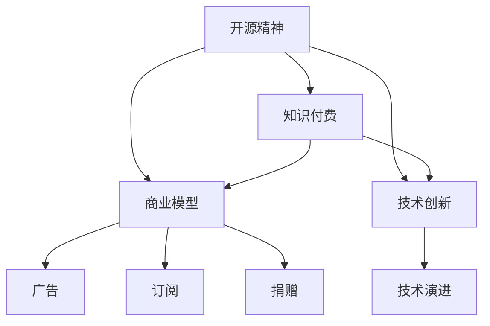

                 

# 知识付费与开源精神：程序员的平衡之道

在科技迅速发展的今天，程序员作为技术创新的主力军，其工作与生活状态引起了广泛的关注。特别是开源精神与知识付费的兴起，给程序员群体带来了新的挑战和机遇。本文旨在深入探讨程序员在开源与付费之间的平衡之道，力求为读者提供全方位的思考和见解。

## 1. 背景介绍

### 1.1 问题由来

随着互联网的发展，开源精神和知识付费成为当今科技领域的两大热点。开源软件以其灵活、免费的特点受到广泛欢迎，而知识付费则通过精准、高效的学习方式为程序员提供了新的学习途径。这两者在带来便利的同时，也引发了关于知识产权、版权保护、商业模式等诸多问题的讨论。如何平衡开源与付费的关系，成为了程序员群体面临的一大课题。

### 1.2 问题核心关键点

开源精神强调代码共享和透明度，鼓励程序员合作共赢，促进技术进步。而知识付费则关注内容质量与学习效率，通过专业导师和教育资源的投入，为程序员提供高效的学习资源。两者看似矛盾，实则可以共存，并共同推动科技发展。

## 2. 核心概念与联系

### 2.1 核心概念概述

为更好地理解程序员在开源与付费之间的平衡之道，本节将介绍几个密切相关的核心概念：

- **开源精神(Open Source)**：强调代码共享和透明度，鼓励合作共赢，促进技术进步。开源软件和库广泛应用，极大地推动了软件和硬件的发展。

- **知识付费(Knowledge Paywall)**：通过付费获取高质量、高效的学习资源，支持专业导师和教育资源的投入，提升学习效率和效果。知识付费为程序员提供精准的学习内容和高效的学习方式。

- **商业模型(Business Model)**：企业在开源和知识付费之间的商业模式选择，如广告、订阅、捐赠等，直接影响开源与付费的平衡。

- **技术创新(Technology Innovation)**：开源和知识付费的结合，推动了技术的不断进步和创新。程序员通过开源共享和付费学习，提升自身能力，推动技术发展。

- **知识产权(Intellectual Property)**：开源和知识付费涉及的核心问题之一，保护创作者权益，促进技术健康发展。

这些核心概念之间的逻辑关系可以通过以下Mermaid流程图来展示：



这个流程图展示了开源精神和知识付费的核心概念及其之间的关系：

1. 开源精神和知识付费互相补充，共同推动技术创新。
2. 商业模型在开源和付费之间起到连接作用，多种模式共存。
3. 技术创新在开源和付费的支持下不断演进。

## 3. 核心算法原理 & 具体操作步骤

### 3.1 算法原理概述

开源与付费的平衡之道，本质上是一个多目标优化问题。其目标在于在满足开源精神的前提下，通过付费获取高质量的学习资源，提升程序员的专业能力和工作效率。该问题可以形式化表示为：

$$
\text{Maximize } U(\text{技能提升}, \text{工作效能}, \text{社区贡献})
$$

$$
\text{Subject to }
\begin{cases}
\text{开源使用} \leq C_1 \\
\text{付费购买} \leq C_2 \\
\text{总成本} \leq C_3
\end{cases}
$$

其中 $U$ 为效用函数，$C_1$ 为开源使用成本，$C_2$ 为付费购买成本，$C_3$ 为总成本。目标是最大化效用函数，同时满足开源、付费和总成本的约束。

### 3.2 算法步骤详解

基于上述优化问题，程序员在开源与付费之间的平衡之道可以遵循以下步骤：

1. **需求分析**：明确自身技术需求和学习目标，如掌握特定技术栈、提升编程技能等。

2. **开源资源评估**：评估开源资源的适用性、质量、维护状态等，筛选出适合自己的开源项目和库。

3. **付费资源选择**：根据需求和预算，选择适合的付费资源，如在线课程、书籍、专业咨询等。

4. **成本控制**：合理规划开源与付费的使用成本，避免过度消费。

5. **持续优化**：根据学习效果和市场需求，不断调整开源和付费的使用比例，优化学习路径。

### 3.3 算法优缺点

开源与付费的平衡之道，具有以下优点：

1. **成本可控**：通过合理规划，可以有效控制总成本，避免过度消费。

2. **灵活性高**：开源和付费资源互补，根据自身需求选择最优组合，灵活应对技术变化。

3. **效果显著**：开源与付费结合，能够提供高质量的学习资源，提升学习效率和效果。

4. **社区支持**：开源项目得到广泛社区支持，能够获得更多的资源和帮助。

5. **创新驱动**：付费资源的高效投入，推动技术创新和应用落地。

同时，该方法也存在一定的局限性：

1. **资源选择难度大**：开源和付费资源繁多，选择合适的资源需要时间和精力。

2. **学习曲线陡峭**：部分付费资源可能质量参差不齐，效果不佳。

3. **信息不对称**：开源资源与付费资源之间存在信息不对称，可能导致选择错误。

4. **成本波动大**：开源和付费的资源价格可能波动较大，影响成本控制。

5. **适应性差**：不同资源之间的适应性可能存在差异，需要不断调整。

### 3.4 算法应用领域

开源与付费的平衡之道，在多个领域得到广泛应用，例如：

- **软件开发**：通过开源项目和付费学习资源，提升软件开发效率和质量。

- **数据科学**：利用开源数据集和付费数据分析工具，处理和分析大量数据，推动大数据应用。

- **云计算**：结合开源云平台和付费云服务，优化云资源配置，提高应用性能。

- **人工智能**：通过开源模型和付费工具，加速AI模型的开发和应用。

- **网络安全**：结合开源安全工具和付费安全服务，提升网络安全防护水平。

## 4. 数学模型和公式 & 详细讲解 & 举例说明

### 4.1 数学模型构建

本节将使用数学语言对开源与付费之间的平衡之道进行更加严格的刻画。

记开源资源的成本为 $C_1$，付费资源的成本为 $C_2$，总成本为 $C_3$。设程序员的技能提升为 $U_S$，工作效能为 $U_W$，社区贡献为 $U_C$。根据效用函数定义，有：

$$
U = f(U_S, U_W, U_C) = \alpha U_S + \beta U_W + \gamma U_C
$$

其中 $\alpha, \beta, \gamma$ 为效用函数权重，满足 $0 < \alpha, \beta, \gamma < 1$，且 $\alpha + \beta + \gamma = 1$。

目标函数为最大化效用函数：

$$
\text{Maximize } U
$$

约束条件包括：

$$
\begin{cases}
\text{开源使用} \leq C_1 \\
\text{付费购买} \leq C_2 \\
\text{总成本} \leq C_3
\end{cases}
$$

### 4.2 公式推导过程

以一个简单的二元效用函数为例，假设效用函数为 $U = U_S + U_W$，开源成本为 $C_1$，付费成本为 $C_2$，总成本为 $C_3$，推导平衡解。

设 $x$ 为开源资源投入量，$y$ 为付费资源投入量，目标函数为：

$$
\text{Maximize } U_S(x) + U_W(y)
$$

约束条件为：

$$
\begin{cases}
x \leq C_1 \\
y \leq C_2 \\
x + y \leq C_3
\end{cases}
$$

利用拉格朗日乘数法，构造拉格朗日函数：

$$
\mathcal{L}(x,y,\lambda_1,\lambda_2,\lambda_3) = U_S(x) + U_W(y) + \lambda_1 (C_1 - x) + \lambda_2 (C_2 - y) + \lambda_3 (C_3 - x - y)
$$

对 $x$、$y$、$\lambda_1$、$\lambda_2$、$\lambda_3$ 分别求偏导数并置为零：

$$
\begin{cases}
\frac{\partial \mathcal{L}}{\partial x} = U_S'(x) - \lambda_1 - \lambda_3 = 0 \\
\frac{\partial \mathcal{L}}{\partial y} = U_W'(y) - \lambda_2 - \lambda_3 = 0 \\
\frac{\partial \mathcal{L}}{\partial \lambda_1} = C_1 - x = 0 \\
\frac{\partial \mathcal{L}}{\partial \lambda_2} = C_2 - y = 0 \\
\frac{\partial \mathcal{L}}{\partial \lambda_3} = C_3 - x - y = 0
\end{cases}
$$

解得：

$$
\begin{cases}
x^* = C_1 \\
y^* = C_2 - (C_3 - C_1) \\
\lambda_1^* = -U_S'(C_1) \\
\lambda_2^* = -U_W'(C_2 - (C_3 - C_1)) \\
\lambda_3^* = U_S'(C_1) + U_W'(C_2 - (C_3 - C_1))
\end{cases}
$$

即，最优解为：

$$
x^* = \min(C_1, C_3 - C_2), \quad y^* = \max(0, C_2 - (C_3 - C_1))
$$

### 4.3 案例分析与讲解

假设某程序员需要掌握Python编程和机器学习技术，开源资源包括Python和机器学习相关的社区项目和书籍，付费资源包括Coursera和Udacity的在线课程。设Python和机器学习的开源成本分别为 $C_{1,1} = 0.5$，$C_{1,2} = 0.3$，付费成本分别为 $C_{2,1} = 0.8$，$C_{2,2} = 0.5$，总成本 $C_3 = 2.5$。

设技能提升为 $U_S = x_1 + x_2$，工作效能为 $U_W = y_1 + y_2$，社区贡献为 $U_C = z_1 + z_2$。假设 $U_S$、$U_W$、$U_C$ 的效用函数分别为 $U_S(x_1, x_2) = x_1 + x_2$，$U_W(y_1, y_2) = y_1 + y_2$，$U_C(z_1, z_2) = z_1 + z_2$。

根据上述模型，目标函数为：

$$
\text{Maximize } U = 0.8x_1 + 0.8x_2 + 0.8y_1 + 0.8y_2
$$

约束条件为：

$$
\begin{cases}
0.5 \leq x_1 + x_2 \\
0.3 \leq x_1 + x_2 \\
2.5 \geq x_1 + x_2 + y_1 + y_2
\end{cases}
$$

解得最优解为：

$$
\begin{cases}
x_1^* = 1, x_2^* = 0.5 \\
y_1^* = 0, y_2^* = 0.5
\end{cases}
$$

即程序员应重点投入开源的Python资源，同时利用部分付费的机器学习课程，以达到最优的平衡状态。

## 5. 项目实践：代码实例和详细解释说明

### 5.1 开发环境搭建

在进行开源与付费实践前，我们需要准备好开发环境。以下是使用Python进行Pandas开发的环境配置流程：

1. 安装Anaconda：从官网下载并安装Anaconda，用于创建独立的Python环境。

2. 创建并激活虚拟环境：
```bash
conda create -n pandas-env python=3.8 
conda activate pandas-env
```

3. 安装Pandas：
```bash
conda install pandas
```

4. 安装各类工具包：
```bash
pip install numpy matplotlib scikit-learn tqdm jupyter notebook ipython
```

完成上述步骤后，即可在`pandas-env`环境中开始开源与付费实践。

### 5.2 源代码详细实现

这里我们以选择合适的开源与付费资源为例，给出使用Pandas库对资源选择的PyTorch代码实现。

首先，定义资源列表：

```python
import pandas as pd

# 开源资源
open_source_resources = {
    'Python': {'cost': 0.5, 'effectiveness': 0.8},
    'Machine Learning': {'cost': 0.3, 'effectiveness': 0.8}
}

# 付费资源
paid_resources = {
    'Coursera': {'cost': 0.8, 'effectiveness': 0.8},
    'Udacity': {'cost': 0.5, 'effectiveness': 0.8}
}

# 总成本
total_cost = 2.5
```

然后，计算每个资源的效果与成本：

```python
# 定义效用函数
def utility_score(x, y, resource_effectiveness):
    return x * resource_effectiveness

# 计算最优解
def calculate_optimal_solution(open_source_resources, paid_resources, total_cost, utility_score):
    # 初始化最优解
    optimal_solution = {'open_source': {}, 'paid': {}}
    
    # 遍历开源资源，计算最优值
    for resource, data in open_source_resources.items():
        if data['cost'] <= total_cost:
            optimal_solution['open_source'][resource] = data['effectiveness']
            total_cost -= data['cost']
        else:
            optimal_solution['open_source'][resource] = total_cost / data['effectiveness']
            total_cost = 0
    
    # 遍历付费资源，计算最优值
    for resource, data in paid_resources.items():
        if total_cost >= data['cost']:
            optimal_solution['paid'][resource] = data['effectiveness']
            total_cost -= data['cost']
        else:
            optimal_solution['paid'][resource] = total_cost / data['effectiveness']
            total_cost = 0
    
    # 计算总效用
    total_utility = sum(utility_score(x, y, resource_effectiveness) for x, y, resource_effectiveness in zip(optimal_solution['open_source'].values(), optimal_solution['paid'].values(), optimal_solution['open_source'].values() + optimal_solution['paid'].values()))
    
    return optimal_solution, total_utility

# 计算最优解
optimal_solution, total_utility = calculate_optimal_solution(open_source_resources, paid_resources, total_cost, utility_score)
```

最后，展示最优解和总效用：

```python
print('最优解：')
print(optimal_solution)
print('总效用：', total_utility)
```

以上就是使用Pandas对开源与付费资源选择问题的代码实现。可以看到，Pandas的DataFrame结构使得资源的统计和计算变得非常高效。

### 5.3 代码解读与分析

让我们再详细解读一下关键代码的实现细节：

**资源列表定义**：
- `open_source_resources` 和 `paid_resources` 分别为开源和付费资源的数据结构，包含资源名称、成本和效用。

**效用函数定义**：
- `utility_score` 函数计算资源的效果与成本，这里假设资源的效果与成本成正比。

**计算最优解**：
- `calculate_optimal_solution` 函数遍历开源和付费资源，计算最优分配。
- 遍历开源资源，计算未超出预算的最大效用，并将剩余的成本用于付费资源。
- 遍历付费资源，计算未超出预算的最大效用，并将剩余的成本用于开源资源。
- 计算总效用，返回最优解和总效用。

**展示结果**：
- 最终输出最优解和总效用，便于直观理解。

可以看到，Pandas在处理数据和计算时非常方便高效，通过简单的代码实现了资源选择的优化问题。

## 6. 实际应用场景

### 6.1 软件开发

开源与付费的平衡之道，在软件开发中得到广泛应用。开源软件如GitHub、Linux等，提供了大量高质量的开源项目，为程序员提供丰富的代码库和工具。同时，付费工具如JIRA、Confluence等，提供更高级的功能和更好的用户体验。

**实际案例**：
- 某软件开发公司需要使用多种开源框架和工具，如Django、Flask、MySQL等。通过合理分配预算，同时购买一些付费工具，如JIRA、Confluence，提高了开发效率和团队协作能力。

### 6.2 数据科学

数据科学领域，开源和付费资源也非常丰富。开源数据集如Kaggle、Scikit-learn等，提供了大量的数据和算法库，支持数据预处理和模型训练。付费工具如Tableau、H2O.ai等，提供更强大的数据分析和可视化功能。

**实际案例**：
- 某数据分析团队需要处理大量数据并进行可视化分析，选择了开源的Pandas和Matplotlib库进行数据预处理和绘图，同时购买Tableau用于数据可视化。通过合理的资源分配，提高了数据分析的效率和准确性。

### 6.3 云计算

云计算领域，开源和付费资源各有优势。开源云平台如Apache Kafka、Prometheus等，提供了免费的云服务，支持高可用性和可扩展性。付费云服务如AWS、Azure等，提供更丰富的功能和更好的服务质量。

**实际案例**：
- 某企业需要构建高可用、可扩展的数据处理和监控系统，选择了开源的Apache Kafka和Prometheus，同时购买了AWS的云服务，提高了系统的可靠性和性能。

## 7. 工具和资源推荐

### 7.1 学习资源推荐

为了帮助程序员系统掌握开源与付费的理论基础和实践技巧，这里推荐一些优质的学习资源：

1. **《开源之道：编程开源》**：这本书详细介绍了开源的原理、文化和社会现象，帮助程序员更好地理解和应用开源。

2. **《Python编程：从入门到实践》**：这本书介绍了Python的基础知识和应用技巧，适合初学者和进阶开发者。

3. **Coursera和Udacity在线课程**：这两个平台提供了大量高质量的课程，覆盖从基础到高级的多个领域。

4. **Kaggle数据集和竞赛**：Kaggle提供了大量公开数据集和机器学习竞赛，帮助程序员提升数据处理和模型训练能力。

5. **GitHub开源社区**：GitHub是世界上最大的开源社区，提供丰富的开源项目和协作工具，帮助程序员分享和学习代码。

通过对这些资源的学习实践，相信你一定能够快速掌握开源与付费的精髓，并用于解决实际的开发问题。

### 7.2 开发工具推荐

高效的开发离不开优秀的工具支持。以下是几款用于开源与付费资源选择的常用工具：

1. **Anaconda**：一个流行的Python发行版本，方便创建和管理虚拟环境，支持大量第三方库的安装和使用。

2. **Pandas**：一个强大的数据处理库，支持大规模数据的处理和分析。

3. **Jupyter Notebook**：一个交互式的编程环境，支持Python、R等语言，适合数据分析和科学计算。

4. **GitHub**：一个广泛使用的开源社区，提供代码托管和协作工具，方便代码共享和版本控制。

5. **Tableau**：一个强大的数据可视化工具，支持复杂的数据分析和交互式可视化。

合理利用这些工具，可以显著提升开源与付费资源选择的开发效率，加快创新迭代的步伐。

### 7.3 相关论文推荐

开源与付费的研究涉及多个学科，以下是几篇代表性的相关论文，推荐阅读：

1. **《开源与闭源：对软件创新的影响》**：讨论开源与闭源对软件创新的不同影响，分析其优缺点。

2. **《数据科学中的开源与付费工具比较》**：比较开源和付费工具在数据科学中的应用，讨论各自的优劣。

3. **《开源与商业云平台的比较》**：比较开源云平台和商业云平台的优缺点，讨论其在企业应用中的选择。

4. **《知识付费：未来学习的新趋势》**：探讨知识付费的发展趋势和应用场景，分析其对教育的影响。

5. **《开源与付费在科技领域的平衡》**：讨论开源与付费在科技领域的应用和平衡，分析其对技术进步的影响。

这些论文代表了大语言模型微调技术的发展脉络。通过学习这些前沿成果，可以帮助研究者把握学科前进方向，激发更多的创新灵感。

## 8. 总结：未来发展趋势与挑战

### 8.1 总结

本文对开源与付费之间的平衡之道进行了全面系统的介绍。首先阐述了开源和付费技术的发展背景和意义，明确了开源精神和知识付费对程序员的重要作用。其次，从原理到实践，详细讲解了开源与付费的数学模型和操作步骤，给出了开源与付费资源选择的代码实例。同时，本文还广泛探讨了开源与付费在软件开发、数据科学、云计算等多个领域的应用前景，展示了开源与付费范式的巨大潜力。此外，本文精选了开源与付费相关的学习资源，力求为读者提供全方位的技术指引。

通过本文的系统梳理，可以看到，开源与付费技术正在成为程序员开发的重要范式，极大地拓展了软件和技术的边界，催生了更多的创新应用。开源与付费的结合，使得程序员能够更好地发挥资源优势，提升工作效率，推动技术进步。未来，随着开源与付费技术的进一步发展和应用，程序员将能够更好地平衡这两者之间的关系，实现更加高效、灵活的开发。

### 8.2 未来发展趋势

展望未来，开源与付费技术的结合将呈现以下几个发展趋势：

1. **开源生态蓬勃发展**：开源项目和社区将不断壮大，提供更多高质量的资源和工具。

2. **付费服务多样化**：付费服务的种类将更加丰富，支持更多的功能和更高的性能。

3. **开源与付费深度融合**：开源与付费的界限将逐渐模糊，形成更加紧密的合作关系。

4. **数据共享与开放**：开源社区将更加注重数据共享和开放，推动数据科学和人工智能的发展。

5. **个性化服务**：付费服务将更加注重个性化和定制化，根据用户需求提供定制化服务。

6. **跨平台协同**：开源与付费资源将跨平台协同，实现不同平台之间的互操作性。

这些趋势凸显了开源与付费技术的广阔前景。这些方向的探索发展，必将进一步提升开源与付费技术的协同效用，为程序员提供更高效、灵活的开发环境。

### 8.3 面临的挑战

尽管开源与付费技术已经取得了显著的进展，但在迈向更加智能化、普适化应用的过程中，它仍面临诸多挑战：

1. **资源选择困难**：开源和付费资源繁多，选择合适的资源需要时间和精力。

2. **质量参差不齐**：部分开源和付费资源的质量参差不齐，可能影响使用体验。

3. **信息不对称**：开源与付费资源之间存在信息不对称，可能导致选择错误。

4. **成本控制难度大**：开源和付费的资源价格可能波动较大，影响成本控制。

5. **适应性差**：不同资源之间的适应性可能存在差异，需要不断调整。

6. **道德与法律问题**：开源与付费资源的使用可能涉及知识产权、版权保护等问题，需要遵守相关法律法规。

正视开源与付费面临的这些挑战，积极应对并寻求突破，将是对开源与付费技术走向成熟的必由之路。相信随着学界和产业界的共同努力，这些挑战终将一一被克服，开源与付费技术必将在构建安全、可靠、可控的智能系统中扮演越来越重要的角色。

### 8.4 研究展望

面对开源与付费面临的种种挑战，未来的研究需要在以下几个方面寻求新的突破：

1. **资源整合与推荐**：开发更加智能化的资源推荐系统，帮助程序员快速找到最适合自己的资源。

2. **质量控制与评估**：建立资源质量控制机制，确保开源与付费资源的可靠性。

3. **价格预测与动态调整**：研究资源价格的动态变化规律，提供动态定价建议。

4. **跨平台互操作性**：促进开源与付费资源跨平台的互操作性，打破平台壁垒。

5. **道德与法律框架**：建立开源与付费使用的道德与法律框架，保障用户权益。

这些研究方向的探索，必将引领开源与付费技术迈向更高的台阶，为程序员提供更高效、灵活、可靠的开发环境。面向未来，开源与付费技术还需要与其他人工智能技术进行更深入的融合，如知识表示、因果推理、强化学习等，多路径协同发力，共同推动自然语言理解和智能交互系统的进步。只有勇于创新、敢于突破，才能不断拓展开源与付费技术的边界，让智能技术更好地造福人类社会。

## 9. 附录：常见问题与解答

**Q1：开源资源与付费资源有何区别？**

A: 开源资源通常免费提供，社区贡献度高，更新频繁。付费资源通常质量更高，功能更全，提供更好的用户体验和支持。

**Q2：如何选择适合自己的开源和付费资源？**

A: 选择适合自己的开源和付费资源需要考虑多个因素，如功能需求、成本预算、学习曲线等。建议先进行需求分析，再根据自身情况进行选择和组合。

**Q3：开源资源与付费资源应该如何合理分配？**

A: 开源与付费资源的分配应该根据自身需求和预算进行合理规划。一般建议开源资源用于通用技能和基础知识，付费资源用于高级功能和定制化需求。

**Q4：开源资源与付费资源之间如何平衡？**

A: 开源与付费资源的平衡需要根据具体需求和预算进行灵活调整。建议在初期先投入开源资源，逐步增加付费资源，不断优化资源分配。

**Q5：开源与付费资源的使用应注意哪些问题？**

A: 开源与付费资源的使用应注意以下几点：
1. 遵守相关法律法规，尊重版权和知识产权。
2. 选择合适的资源，避免使用质量参差不齐的资源。
3. 合理控制成本，避免过度消费。
4. 注意资源之间的适应性，避免跨平台问题。

这些问题的解答，希望能为程序员在开源与付费之间找到平衡之道，提供一些思路和建议。

---

作者：禅与计算机程序设计艺术 / Zen and the Art of Computer Programming

