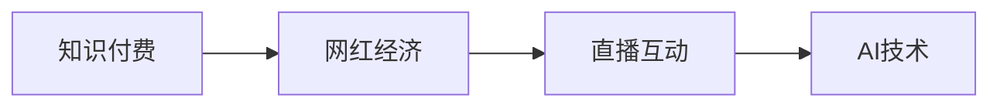

                 

# 知识付费与直播互动相结合的网红经济模式

## 1. 背景介绍

在数字化时代，内容消费方式不断演进，从单向的视频观看，到互动的直播分享，再到基于知识的付费服务，这一系列转变体现了互联网用户对内容质量和互动性的更高需求。在这种趋势下，网红经济模式应运而生，并逐步融合知识付费与直播互动，形成了一种新型经济形态。本文将详细探讨这种模式的核心概念、算法原理、具体操作步骤，以及其实际应用和未来发展趋势，为相关从业者提供参考。

## 2. 核心概念与联系

### 2.1 核心概念概述

本文涉及的核心概念主要包括知识付费、网红经济、直播互动和AI技术。

**知识付费**：指用户为获取特定知识内容而进行付费的行为。知识付费平台提供有价值的内容，用户通过订阅、购买等形式支付费用以获取这些内容。

**网红经济**：指通过网红（即在社交媒体上有大量关注者的人）的知名度和影响力，进行商业推广或变现的经济模式。网红可以是博主、主播、短视频创作者等，他们在各自的领域内拥有一定的粉丝基础，能够通过各种方式将粉丝转化为付费用户。

**直播互动**：指在实时视频传输过程中，用户可以与主播进行实时交流和互动。直播平台提供了弹幕、打赏、连麦等功能，增强了用户的参与感和粘性。

**AI技术**：指人工智能技术，特别是自然语言处理（NLP）、计算机视觉、推荐系统等技术，用于提升直播内容的质量和个性化推荐，增强用户体验。

这些概念之间的联系可以通过以下Mermaid流程图来展示：



这个流程图展示了知识付费、网红经济、直播互动和AI技术之间的内在联系：

1. 知识付费和网红经济：知识付费是网红经济的一种表现形式，通过网红的推荐和推广，吸引用户进行知识付费。
2. 网红经济和直播互动：网红通常在直播中与粉丝互动，通过直播进行商业推广，增强用户黏性和信任度。
3. AI技术：AI技术用于提升直播内容质量，增强推荐系统的个性化，进一步提升用户体验。

## 3. 核心算法原理 & 具体操作步骤

### 3.1 算法原理概述

知识付费与直播互动相结合的网红经济模式，基于以下几个算法原理：

1. **用户行为分析**：通过分析用户在直播平台上的行为数据（如观看时长、互动频率、打赏金额等），了解用户兴趣和需求，进行个性化推荐。
2. **内容推荐系统**：基于用户画像和内容标签，构建推荐模型，预测用户可能感兴趣的内容，提升用户体验和满意度。
3. **互动数据分析**：通过分析用户在直播互动中的语言和行为，识别用户情绪和反馈，优化主播互动策略和内容生产。
4. **AI生成内容**：利用AI技术生成具有教育价值的内容，提高直播互动的质量和效率。

### 3.2 算法步骤详解

基于上述算法原理，知识付费与直播互动相结合的网红经济模式的具体操作步骤如下：

**Step 1: 数据收集与处理**

- 收集用户行为数据：包括观看时长、互动频率、打赏金额等。
- 收集内容标签数据：对直播内容进行标签化，如教育类、娱乐类、科技类等。
- 收集互动数据：包括弹幕内容、连麦情况、打赏记录等。

**Step 2: 用户画像构建**

- 基于用户行为数据和互动数据，构建用户画像，包括兴趣偏好、消费习惯、社交行为等。
- 利用机器学习算法（如K-Means、GMM等）对用户进行聚类分析，划分用户群体。

**Step 3: 内容推荐模型训练**

- 构建推荐模型，如协同过滤、基于内容的推荐、深度学习推荐等。
- 利用用户画像和内容标签，训练推荐模型，预测用户可能感兴趣的内容。

**Step 4: 直播互动数据分析**

- 分析互动数据，识别用户情绪和反馈，如积极、消极、模糊等。
- 利用自然语言处理技术（如情感分析、实体识别等）对弹幕内容进行情感分析和主题分析。

**Step 5: AI生成内容**

- 利用AI技术生成具有教育价值的内容，如智能讲解、互动式问题解答等。
- 通过自然语言生成（NLG）技术，自动生成主播的互动语言和内容，提升互动质量。

**Step 6: 个性化推荐与直播互动**

- 根据推荐模型和用户画像，向用户推荐个性化的直播内容。
- 利用AI技术实时分析用户互动，调整互动策略和内容生产，提升用户体验。

### 3.3 算法优缺点

这种知识付费与直播互动相结合的网红经济模式，具有以下优点：

1. **提升用户体验**：通过个性化推荐和实时互动，满足用户的多样化需求，提升用户体验和满意度。
2. **增加用户粘性**：直播互动中的实时交流和个性化推荐，增强用户粘性和忠诚度。
3. **优化内容生产**：利用AI技术生成和分析内容，提升内容质量和生产效率。

同时，这种模式也存在一些缺点：

1. **数据隐私问题**：用户行为数据和互动数据的收集和处理，可能涉及用户隐私问题，需要严格的数据保护措施。
2. **内容同质化**：推荐模型的过度优化可能导致内容同质化，降低用户多样性。
3. **算法偏见**：推荐模型可能存在算法偏见，需要不断优化算法和数据以减少偏见。

### 3.4 算法应用领域

这种知识付费与直播互动相结合的网红经济模式，广泛应用于以下几个领域：

1. **在线教育**：通过知识付费和直播互动，提供个性化的学习体验，提升学习效果。
2. **在线健身**：通过直播互动和AI生成内容，提供个性化的健身指导，提升健身效果。
3. **在线旅游**：通过直播互动和个性化推荐，提供丰富的旅游体验，提升用户满意度。
4. **在线医疗**：通过知识付费和直播互动，提供个性化的健康咨询和医疗指导，提升医疗服务质量。

## 4. 数学模型和公式 & 详细讲解 & 举例说明

### 4.1 数学模型构建

在知识付费与直播互动相结合的网红经济模式中，常用的数学模型包括用户画像构建模型、推荐模型和互动数据分析模型。

**用户画像构建模型**：利用用户行为数据和互动数据，构建用户画像。假设用户数据为向量 $x_i=(x_{i1},x_{i2},...,x_{in})$，其中 $n$ 为用户特征数，$i$ 为不同用户。用户画像构建模型为 $p(x_i)=\sum_{j=1}^{m}w_jx_{ij}$，其中 $m$ 为模型参数数，$w_j$ 为模型系数。

**推荐模型**：基于协同过滤和内容推荐，构建推荐模型。推荐模型的目标函数为 $min_{\theta}\sum_{i=1}^{N}\sum_{j=1}^{M}y_{ij}(\hat{y}_{ij}-\theta^{T}x_{i}x_{j})$，其中 $N$ 为用户数，$M$ 为内容数，$y_{ij}$ 为内容标签，$\hat{y}_{ij}$ 为推荐值，$x_{i}$ 和 $x_{j}$ 为用户和内容的特征向量，$\theta$ 为模型参数。

**互动数据分析模型**：利用自然语言处理技术，构建互动数据分析模型。情感分析模型的目标函数为 $min_{\theta}\sum_{i=1}^{N}\sum_{j=1}^{T}(y_{ij}-\hat{y}_{ij})^2$，其中 $N$ 为弹幕数据数，$T$ 为情感类别数，$y_{ij}$ 为真实情感标签，$\hat{y}_{ij}$ 为预测情感标签，$x_{i}$ 为弹幕内容向量，$\theta$ 为模型参数。

### 4.2 公式推导过程

**用户画像构建模型**的推导过程如下：

假设用户行为数据为 $x_i=(x_{i1},x_{i2},...,x_{in})$，其中 $n$ 为用户特征数，$i$ 为不同用户。设 $p(x_i)$ 为用户画像，通过线性回归模型进行构建，即 $p(x_i)=\sum_{j=1}^{m}w_jx_{ij}$，其中 $m$ 为模型参数数，$w_j$ 为模型系数。利用最小二乘法进行模型训练，得到 $w_j=(X^{T}X)^{-1}X^{T}y$，其中 $X$ 为特征矩阵，$y$ 为标签向量。

**推荐模型**的推导过程如下：

假设用户行为数据为 $x_i=(x_{i1},x_{i2},...,x_{in})$，其中 $n$ 为用户特征数，$i$ 为不同用户。设 $y_{ij}$ 为内容标签，$\hat{y}_{ij}$ 为推荐值，通过协同过滤和内容推荐，构建推荐模型。假设推荐模型为 $\hat{y}_{ij}=\sum_{j=1}^{M}a_j\hat{a}_{ij}$，其中 $M$ 为内容数，$a_j$ 为内容特征向量，$\hat{a}_{ij}$ 为推荐系数。利用最小二乘法进行模型训练，得到 $a_j=(X^{T}X)^{-1}X^{T}y$，其中 $X$ 为特征矩阵，$y$ 为标签向量。

**互动数据分析模型**的推导过程如下：

假设弹幕内容为 $x_i=(x_{i1},x_{i2},...,x_{in})$，其中 $n$ 为特征数，$i$ 为不同弹幕。设 $y_{ij}$ 为真实情感标签，$\hat{y}_{ij}$ 为预测情感标签，利用情感分析模型进行构建。假设情感分析模型为 $\hat{y}_{ij}=\sum_{j=1}^{T}b_jx_{ij}$，其中 $T$ 为情感类别数，$b_j$ 为情感系数。利用最小二乘法进行模型训练，得到 $b_j=(X^{T}X)^{-1}X^{T}y$，其中 $X$ 为特征矩阵，$y$ 为标签向量。

### 4.3 案例分析与讲解

假设某在线教育平台通过知识付费和直播互动相结合的网红经济模式进行运营。具体步骤如下：

1. **数据收集**：收集用户观看时长、互动频率、打赏金额等行为数据，以及课程内容标签数据。
2. **用户画像构建**：基于用户行为数据和互动数据，构建用户画像。例如，某用户经常观看数学课程，并且多次进行打赏，被标记为数学爱好者。
3. **推荐模型训练**：利用协同过滤和内容推荐，训练推荐模型。例如，基于用户画像，推荐该用户感兴趣的其他数学课程。
4. **互动数据分析**：分析互动数据，识别用户情绪和反馈。例如，某用户在直播中频繁提问，需要调整主播互动策略，增强互动效果。
5. **AI生成内容**：利用AI技术生成具有教育价值的内容，如智能讲解、互动式问题解答等。例如，通过自然语言生成技术，生成主播互动语言，提升互动质量。

## 5. 项目实践：代码实例和详细解释说明

### 5.1 开发环境搭建

在进行项目实践前，需要先搭建开发环境。以下是使用Python进行环境搭建的流程：

1. 安装Anaconda：从官网下载并安装Anaconda，用于创建独立的Python环境。
```bash
conda create -n env python=3.8
conda activate env
```

2. 安装必要的Python库，如Pandas、Numpy、Scikit-learn、TensorFlow等。
```bash
pip install pandas numpy scikit-learn tensorflow transformers
```

3. 安装直播平台API库，如RTMP、WebRTC、Websocket等，用于实现直播功能。
```bash
pip install pyrtmp librtmp
```

4. 安装机器学习库，如Scikit-learn、TensorFlow等，用于模型训练和预测。
```bash
pip install scikit-learn tensorflow
```

5. 安装自然语言处理库，如NLTK、SpaCy、TextBlob等，用于处理文本数据。
```bash
pip install nltk spacy textblob
```

完成上述步骤后，即可在环境内进行项目开发。

### 5.2 源代码详细实现

以下是一个简单的知识付费与直播互动相结合的网红经济模式项目实现示例：

**用户画像构建**

```python
from sklearn.cluster import KMeans
import pandas as pd

# 读取用户行为数据
user_data = pd.read_csv('user_behavior.csv')

# 提取用户特征
features = ['watch_time', 'interaction_freq', 'purchase_amount']

# 使用K-Means进行聚类分析
kmeans = KMeans(n_clusters=5)
kmeans.fit(user_data[features])
user_clusters = kmeans.labels_

# 保存用户画像
user_data['user_cluster'] = user_clusters
user_data.to_csv('user_profile.csv', index=False)
```

**推荐模型训练**

```python
from sklearn.metrics.pairwise import cosine_similarity
import pandas as pd

# 读取用户行为数据和内容标签数据
user_data = pd.read_csv('user_behavior.csv')
content_data = pd.read_csv('content_labels.csv')

# 提取用户和内容特征
user_features = user_data[['watch_time', 'interaction_freq', 'purchase_amount']]
content_features = content_data[['label']]

# 计算用户和内容之间的相似度
similarity_matrix = cosine_similarity(user_features, content_features)

# 生成推荐列表
recommendations = pd.DataFrame({'user_id': user_data['user_id'], 'recommended_content_id': content_data['content_id']})
recommendations['recommendation_score'] = similarity_matrix.diagonal()

# 保存推荐结果
recommendations.to_csv('user_recommendations.csv', index=False)
```

**互动数据分析**

```python
from nltk.sentiment import SentimentIntensityAnalyzer
import pandas as pd

# 读取弹幕数据
chat_data = pd.read_csv('chat_messages.csv')

# 使用情感分析模型进行情感分析
sia = SentimentIntensityAnalyzer()
chat_data['sentiment_score'] = chat_data['chat_content'].apply(lambda x: sia.polarity_scores(x)['compound'])

# 保存情感分析结果
chat_data.to_csv('chat_analysis.csv', index=False)
```

**AI生成内容**

```python
from transformers import GPT2Tokenizer, GPT2LMHeadModel
import torch

# 初始化GPT-2模型
tokenizer = GPT2Tokenizer.from_pretrained('gpt2')
model = GPT2LMHeadModel.from_pretrained('gpt2')

# 准备生成内容
prompt = 'What is the formula for calculating compound interest?'
input_ids = tokenizer.encode(prompt, return_tensors='pt')
outputs = model.generate(input_ids, max_length=100)

# 解码生成内容
generated_text = tokenizer.decode(outputs[0], skip_special_tokens=True)

# 保存生成内容
with open('generated_content.txt', 'w') as f:
    f.write(generated_text)
```

### 5.3 代码解读与分析

让我们详细解读一下关键代码的实现细节：

**用户画像构建**

- `KMeans`算法用于聚类分析，将用户行为数据分成不同的用户群体。
- 用户画像包括用户的特征、聚类标签等，用于后续推荐和互动分析。

**推荐模型训练**

- `cosine_similarity`函数用于计算用户行为数据和内容标签数据之间的相似度。
- 根据相似度生成推荐列表，保存为CSV文件，供后续使用。

**互动数据分析**

- `SentimentIntensityAnalyzer`用于进行情感分析，识别弹幕内容的情感倾向。
- 情感分析结果包括每个弹幕的情感得分，保存为CSV文件。

**AI生成内容**

- `GPT2Tokenizer`和`GPT2LMHeadModel`用于初始化GPT-2模型。
- `generate`函数用于生成指定提示词的文本内容。
- 生成内容保存为文本文件。

## 6. 实际应用场景

### 6.1 在线教育

在线教育平台可以利用知识付费与直播互动相结合的网红经济模式，提供个性化的学习体验。例如，某在线教育平台通过直播互动，实时回答学生问题，提升学习效果。同时，平台可以根据学生观看时长和互动数据，生成个性化的推荐内容，提高学习效率。

### 6.2 在线健身

在线健身平台可以利用知识付费与直播互动相结合的网红经济模式，提供个性化的健身指导。例如，某在线健身平台通过直播互动，提供个性化的健身计划和指导。同时，平台可以根据用户健身数据，生成个性化的推荐内容，提升健身效果。

### 6.3 在线旅游

在线旅游平台可以利用知识付费与直播互动相结合的网红经济模式，提供个性化的旅游体验。例如，某在线旅游平台通过直播互动，实时回答用户问题，提供个性化的旅游建议。同时，平台可以根据用户旅游数据，生成个性化的推荐内容，提升旅游体验。

### 6.4 未来应用展望

未来，知识付费与直播互动相结合的网红经济模式将进一步拓展应用场景，推动更多行业的数字化转型。

在智慧医疗领域，平台可以利用直播互动和AI生成内容，提供个性化的健康咨询和医疗指导，提升医疗服务质量。

在智能制造领域，平台可以利用直播互动和AI生成内容，提供个性化的产品定制和生产指导，提高生产效率。

在智能家居领域，平台可以利用直播互动和AI生成内容，提供个性化的家居设计和生活建议，提升生活品质。

总之，随着技术的发展和应用的推广，知识付费与直播互动相结合的网红经济模式将发挥越来越重要的作用，推动各行业的数字化、智能化进程。

## 7. 工具和资源推荐

### 7.1 学习资源推荐

为了帮助开发者系统掌握知识付费与直播互动相结合的网红经济模式的核心技术和实践方法，这里推荐一些优质的学习资源：

1. 《深度学习与大数据》：本书介绍了深度学习和大数据技术，包括机器学习、自然语言处理、推荐系统等内容，适合初学者入门。
2. 《Python自然语言处理》：本书介绍了Python在自然语言处理中的应用，包括文本处理、情感分析、机器翻译等，适合有一定编程基础的学习者。
3. 《知识付费平台开发实战》：本书介绍了知识付费平台的开发过程，包括用户画像、推荐系统、互动分析等，适合开发人员参考。
4. 《AI在直播互动中的应用》：本书介绍了AI技术在直播互动中的应用，包括情感分析、自然语言生成、智能推荐等，适合直播平台开发人员参考。
5. 《网红经济模式》：本书介绍了网红经济模式的发展历程和应用案例，适合对网红经济感兴趣的读者。

通过对这些学习资源的系统学习，相信你一定能够掌握知识付费与直播互动相结合的网红经济模式的核心技术和实践方法。

### 7.2 开发工具推荐

高效的开发离不开优秀的工具支持。以下是几款用于知识付费与直播互动相结合的网红经济模式开发的常用工具：

1. Jupyter Notebook：用于编写和运行Python代码，支持IPython交互式编程，适合数据分析和模型训练。
2. PyTorch：基于Python的开源深度学习框架，灵活动态的计算图，适合快速迭代研究。
3. TensorFlow：由Google主导开发的开源深度学习框架，生产部署方便，适合大规模工程应用。
4. HuggingFace Transformers：自然语言处理工具库，集成了多个预训练模型，支持快速微调和部署。
5. OpenCV：计算机视觉库，用于图像处理和分析，适合直播互动中的图像识别和处理。

合理利用这些工具，可以显著提升知识付费与直播互动相结合的网红经济模式开发的效率和效果。

### 7.3 相关论文推荐

知识付费与直播互动相结合的网红经济模式的研究源于学界的持续研究。以下是几篇奠基性的相关论文，推荐阅读：

1. 《基于知识付费的在线教育系统研究》：探讨了知识付费在在线教育中的应用，提出了知识付费系统的架构和技术实现方法。
2. 《直播互动系统的设计与实现》：介绍了直播互动系统的设计原理和实现方法，包括实时视频传输、互动功能等。
3. 《基于用户画像的推荐系统研究》：探讨了用户画像在推荐系统中的应用，提出了用户画像的构建方法和推荐算法。
4. 《情感分析在直播互动中的应用》：介绍了情感分析在直播互动中的应用，提出了情感分析的模型和方法。
5. 《AI在知识付费中的应用》：探讨了AI技术在知识付费中的应用，提出了AI生成内容和个性化推荐的方法。

这些论文代表了大语言模型微调技术的发展脉络。通过学习这些前沿成果，可以帮助研究者把握学科前进方向，激发更多的创新灵感。

## 8. 总结：未来发展趋势与挑战

### 8.1 总结

本文对知识付费与直播互动相结合的网红经济模式进行了全面系统的介绍。首先阐述了知识付费与直播互动相结合的网红经济模式的研究背景和意义，明确了该模式在提高用户体验、增加用户粘性、优化内容生产等方面的独特价值。其次，从原理到实践，详细讲解了知识付费与直播互动相结合的网红经济模式的核心算法和技术实现细节，给出了项目实践的完整代码实例。同时，本文还广泛探讨了该模式在在线教育、在线健身、在线旅游等多个行业领域的应用前景，展示了其广阔的想象空间。

通过本文的系统梳理，可以看到，知识付费与直播互动相结合的网红经济模式在提升用户体验、增加用户粘性、优化内容生产等方面具有显著优势，有望成为未来互联网经济的重要形态。未来，伴随技术的发展和应用的推广，知识付费与直播互动相结合的网红经济模式必将进一步拓展应用场景，推动各行业的数字化、智能化进程。

### 8.2 未来发展趋势

展望未来，知识付费与直播互动相结合的网红经济模式将呈现以下几个发展趋势：

1. **用户画像更加精细化**：通过更复杂的聚类算法和更丰富的用户特征，构建更精细化的用户画像，提高个性化推荐和互动分析的准确性。
2. **推荐算法更加智能化**：利用深度学习等高级算法，提升推荐系统的智能化水平，提供更精准的内容推荐。
3. **互动分析更加深入**：利用AI技术，深入分析用户情感和行为，优化主播互动策略和内容生产，提升用户体验。
4. **AI生成内容更加丰富**：利用AI技术生成更丰富、高质量的互动内容，提高直播互动的质量和效率。
5. **跨平台融合更加紧密**：知识付费与直播互动相结合的网红经济模式将在更多平台和应用场景中融合，推动各行业的数字化转型。

以上趋势凸显了知识付费与直播互动相结合的网红经济模式的发展前景。这些方向的探索发展，必将进一步提升用户体验和满意度，推动各行业的数字化、智能化进程。

### 8.3 面临的挑战

尽管知识付费与直播互动相结合的网红经济模式已经取得了显著成就，但在迈向更加智能化、普适化应用的过程中，它仍面临诸多挑战：

1. **数据隐私问题**：用户行为数据和互动数据的收集和处理，可能涉及用户隐私问题，需要严格的数据保护措施。
2. **算法偏见问题**：推荐模型可能存在算法偏见，需要不断优化算法和数据以减少偏见。
3. **内容同质化问题**：推荐模型的过度优化可能导致内容同质化，降低用户多样性。
4. **技术瓶颈问题**：直播互动和AI生成内容需要高效的计算资源和存储资源，现有技术还存在瓶颈。
5. **伦理道德问题**：知识付费与直播互动相结合的网红经济模式可能存在伦理道德风险，需要建立相应的监管机制。

正视这些挑战，积极应对并寻求突破，将是大语言模型微调走向成熟的必由之路。相信随着学界和产业界的共同努力，这些挑战终将一一被克服，知识付费与直播互动相结合的网红经济模式必将在构建人机协同的智能时代中扮演越来越重要的角色。

### 8.4 研究展望

面向未来，知识付费与直播互动相结合的网红经济模式还需要在以下几个方面进行深入研究：

1. **数据隐私保护**：研究如何通过差分隐私等技术，保护用户隐私，降低数据泄露风险。
2. **算法偏见减少**：研究如何通过公平性算法和对抗性训练，减少推荐模型中的算法偏见。
3. **内容多样性增强**：研究如何通过多模态学习和知识图谱，增强内容的丰富性和多样性，避免内容同质化。
4. **技术瓶颈突破**：研究如何通过硬件加速和模型压缩等技术，突破直播互动和AI生成内容的计算和存储瓶颈。
5. **伦理道德保障**：研究如何建立合理的伦理道德框架，确保知识付费与直播互动相结合的网红经济模式的安全性和可控性。

这些研究方向将进一步推动知识付费与直播互动相结合的网红经济模式的发展，为构建更加安全、可靠、可解释、可控的智能系统铺平道路。

## 9. 附录：常见问题与解答

**Q1：知识付费与直播互动相结合的网红经济模式是否适用于所有NLP任务？**

A: 知识付费与直播互动相结合的网红经济模式主要适用于有互动需求和个性化推荐需求的应用场景。对于非互动性和非个性化推荐需求的任务，如文本分类、机器翻译等，可能不适合使用该模式。

**Q2：知识付费与直播互动相结合的网红经济模式需要哪些关键技术？**

A: 知识付费与直播互动相结合的网红经济模式需要以下关键技术：
1. 用户画像构建：通过聚类分析，构建用户画像，了解用户兴趣和需求。
2. 推荐模型训练：利用协同过滤和内容推荐，训练推荐模型，生成个性化内容。
3. 互动数据分析：利用自然语言处理技术，分析用户互动，优化主播互动策略。
4. AI生成内容：利用AI技术生成高质量的互动内容，提升直播互动效果。

**Q3：知识付费与直播互动相结合的网红经济模式是否容易被复制？**

A: 知识付费与直播互动相结合的网红经济模式需要大量的数据和资源支持，包括用户行为数据、内容标签数据、直播互动数据等。因此，该模式容易被复制，但复制的成本较高，需要大量的资金和技术投入。

**Q4：知识付费与直播互动相结合的网红经济模式如何避免内容同质化？**

A: 为避免内容同质化，可以采用多模态学习和知识图谱技术，增强内容的丰富性和多样性。例如，可以利用文本、图像、音频等多种模态数据，构建多模态推荐模型，提供更全面的内容推荐。

**Q5：知识付费与直播互动相结合的网红经济模式如何处理直播互动中的情感分析？**

A: 可以通过自然语言处理技术，如情感分析、实体识别等，对直播互动中的弹幕内容进行情感分析。例如，利用情感分析模型，识别弹幕内容的情感倾向，调整主播互动策略，增强互动效果。

总之，知识付费与直播互动相结合的网红经济模式需要开发者根据具体任务，不断迭代和优化模型、数据和算法，方能得到理想的效果。通过深入研究，该模式必将带来革命性的变化，推动各行业的数字化、智能化进程。

