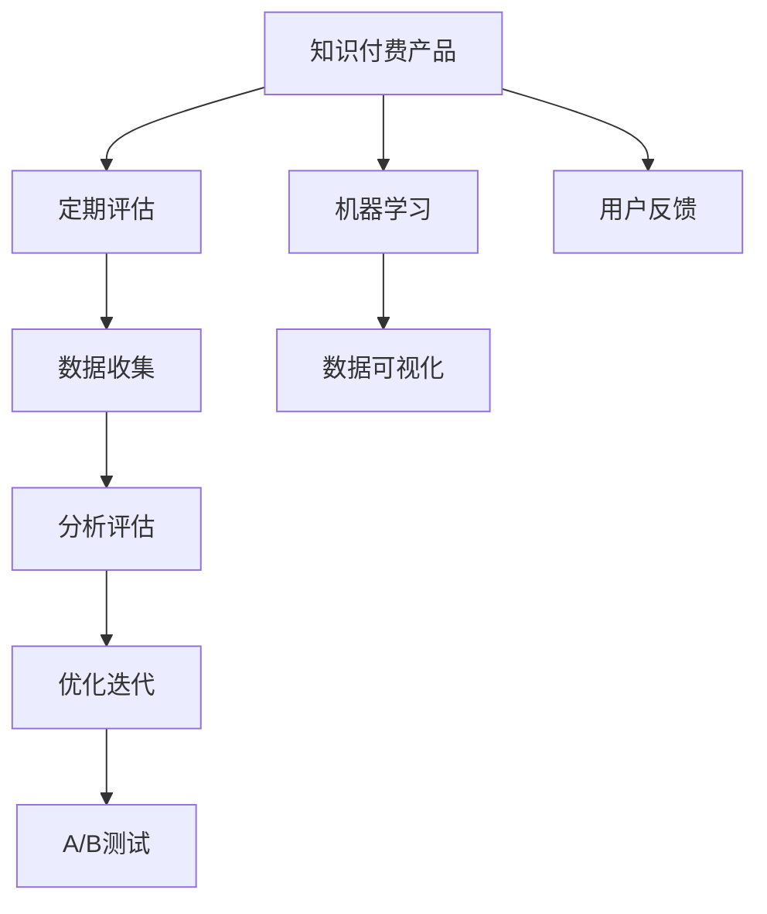

                 

# 知识付费产品的定期评估与迭代

## 1. 背景介绍

随着互联网的普及和信息爆炸，人们越来越渴望获取高效、有价值的知识内容。知识付费作为一种新型服务模式，通过在线平台将优质内容变现，满足了用户的深度学习需求。然而，由于知识付费市场竞争激烈，用户需求多变，持续的定期评估与迭代成为知识付费产品保持竞争力的关键。

### 1.1 问题由来

知识付费产品的成功不仅取决于内容的质量，还取决于产品自身的用户体验、市场定位、运营策略等多方面因素。产品上线后，需要不断地收集用户反馈、监控市场变化，并在此基础上对产品进行优化。定期评估与迭代可以有效地提升产品竞争力，保持市场领先地位。

### 1.2 问题核心关键点

定期评估与迭代的流程包括：

- 数据收集：收集用户的反馈数据、市场反馈数据、竞品数据等。
- 分析评估：使用数据分析工具和技术对收集到的数据进行统计、分析和评估。
- 优化迭代：根据评估结果，调整产品功能、设计、运营策略等，并发布新版本。

该流程的核心在于如何构建有效的数据评估指标体系，以及如何快速、准确地迭代产品，以适应用户需求变化。

### 1.3 问题研究意义

对于知识付费产品而言，定期评估与迭代是其长期保持竞争力的必要手段。该过程有助于：

- 及时发现问题，快速优化，提升用户体验。
- 根据市场趋势调整产品策略，提升市场份额。
- 提升团队敏捷性和响应速度，持续改进产品功能。

本文将系统介绍如何构建知识付费产品的定期评估与迭代框架，重点关注核心算法、操作步骤、数学模型和公式推导，并结合实际案例分析。

## 2. 核心概念与联系

### 2.1 核心概念概述

为更好地理解知识付费产品的定期评估与迭代过程，本节将介绍几个密切相关的核心概念：

- 知识付费产品：通过在线平台向用户提供有价值的知识内容，实现内容变现。常见形式包括付费订阅、单次付费、众筹等。
- 定期评估：通过系统的数据收集和分析，对知识付费产品进行周期性评估，识别出潜在问题和改进空间。
- 迭代改进：在评估基础上，对产品进行功能、设计、运营策略等方面的优化，并发布新版本，以满足用户需求变化。
- A/B测试：一种常用的数据驱动的产品迭代方法，通过对比测试不同版本的用户体验，找出最佳方案。
- 机器学习：一种数据驱动的优化方法，可以通过分析用户数据预测用户行为，指导产品迭代。
- 数据可视化：一种有效的方法，通过图表、仪表盘等方式展示数据结果，帮助产品团队做出决策。
- 用户反馈：指用户在使用产品过程中提出的意见和建议，对产品的改进具有重要参考价值。

这些核心概念之间的逻辑关系可以通过以下Mermaid流程图来展示：



这个流程图展示了大语言模型的核心概念及其之间的关系：

1. 知识付费产品通过数据收集和分析，对产品进行周期性评估。
2. 分析评估过程利用数据可视化、机器学习等技术，识别改进点。
3. 优化迭代过程结合A/B测试等方法，指导产品功能、设计等方面的改进。
4. 用户反馈对产品的迭代改进起到重要的参考作用。

这些概念共同构成了知识付费产品的评估与迭代框架，使其能够持续优化产品功能，提升用户体验和市场竞争力。

## 3. 核心算法原理 & 具体操作步骤
### 3.1 算法原理概述

知识付费产品的定期评估与迭代，本质上是一个数据驱动的优化过程。其核心思想是通过系统化的数据收集、分析和评估，识别产品的优缺点，并对产品进行迭代优化，以提升用户体验和市场竞争力。

形式化地，假设知识付费产品为 $P$，其中 $P$ 包括内容、功能、设计等多个维度。定期评估的目标是找到最优产品参数 $\theta^*$，使得产品在特定指标下达到最佳状态：

$$
\theta^* = \mathop{\arg\min}_{\theta} \mathcal{L}(P,\theta)
$$

其中 $\mathcal{L}$ 为评估指标，用于衡量产品的性能，如用户满意度、活跃度、转化率等。常见的评估指标包括点击率、留存率、复购率、用户评分等。

通过梯度下降等优化算法，评估过程不断更新产品参数 $\theta$，最小化损失函数 $\mathcal{L}$，使得产品性能逼近理想状态。

### 3.2 算法步骤详解

知识付费产品的定期评估与迭代一般包括以下几个关键步骤：

**Step 1: 准备评估指标和数据**
- 选择合适的评估指标，如用户满意度、活跃度、转化率、复购率等。
- 收集相关数据，包括用户反馈数据、市场反馈数据、竞品数据等。

**Step 2: 数据预处理与分析**
- 清洗数据，去除噪音和异常值。
- 进行数据分析，识别数据中的趋势和异常情况。

**Step 3: 构建评估模型**
- 选择合适的模型，如回归模型、分类模型、聚类模型等。
- 训练模型，并使用交叉验证等方法评估模型的泛化能力。

**Step 4: 结果分析和评估**
- 使用统计方法分析评估结果，识别产品的不足之处。
- 识别出影响用户满意度和转化率的关键因素。

**Step 5: 产品优化与迭代**
- 根据评估结果，调整产品功能、设计、运营策略等。
- 发布新版本，并在用户中测试效果。

**Step 6: A/B测试与数据反馈**
- 在产品中进行A/B测试，对比不同版本的用户体验。
- 收集用户反馈，进一步优化产品。

**Step 7: 定期循环**
- 定期进行评估与迭代，确保产品持续优化。

以上是知识付费产品定期评估与迭代的一般流程。在实际应用中，还需要根据具体产品特点和用户需求，对评估和迭代过程的各个环节进行优化设计。

### 3.3 算法优缺点

知识付费产品定期评估与迭代的方法具有以下优点：

- 数据驱动：通过系统的数据收集和分析，能够客观地评估产品性能。
- 持续改进：定期评估与迭代能够持续优化产品功能，提升用户体验。
- 快速响应：能够快速识别产品问题，并及时进行调整，提升市场竞争力。
- 用户导向：通过收集用户反馈，能够更好地满足用户需求。

同时，该方法也存在一些局限性：

- 数据质量要求高：需要高质量的数据来支撑评估过程，否则评估结果可能不准确。
- 成本高：数据收集、分析和评估都需要消耗大量的人力和时间。
- 结果难以解释：复杂的评估模型和分析结果可能难以解释，对产品团队产生困扰。
- 依赖工具：评估与迭代过程需要借助专业的数据分析工具和平台，对于技术要求较高。

尽管存在这些局限性，但就目前而言，数据驱动的定期评估与迭代方法仍然是知识付费产品优化提升的重要手段。未来相关研究的重点在于如何进一步降低评估成本，提高评估效率，同时兼顾结果可解释性和技术可操作性等因素。

### 3.4 算法应用领域

知识付费产品的定期评估与迭代方法在多个行业领域得到了广泛的应用，例如：

- 在线教育：通过学生反馈和测试数据，持续优化课程内容和教学方法。
- 在线阅读：分析用户阅读行为和反馈，优化书籍推荐和个性化内容展示。
- 知识社区：通过用户互动数据，优化社区结构和功能设计。
- 企业培训：通过员工培训效果数据，持续改进培训内容和方式。
- 健身平台：通过用户使用数据，优化课程内容和运动指导。

除了上述这些经典应用外，知识付费产品的定期评估与迭代也被创新性地应用到更多场景中，如智能客服、智能推荐、个性化广告等，为知识付费产品的创新带来了新的方向。

## 4. 数学模型和公式 & 详细讲解 & 举例说明
### 4.1 数学模型构建

本节将使用数学语言对知识付费产品的定期评估与迭代过程进行更加严格的刻画。

记知识付费产品为 $P$，其中 $P$ 包括内容、功能、设计等多个维度。假设产品评估指标为 $T$，产品优化目标为 $G$。则评估模型的构建过程如下：

- 数据集 $D=\{(x_i,y_i)\}_{i=1}^N, x_i \in \mathbb{R}^d, y_i \in \mathbb{R}$，其中 $x_i$ 为产品数据，$y_i$ 为产品评估指标。
- 构建回归模型 $\hat{y} = f(x;\theta)$，其中 $f$ 为模型函数，$\theta$ 为模型参数。
- 最小化损失函数 $\mathcal{L} = \frac{1}{N} \sum_{i=1}^N (y_i - \hat{y}_i)^2$。

### 4.2 公式推导过程

以下我们以用户满意度评估为例，推导回归模型的公式及其梯度的计算过程。

假设用户满意度 $T$ 可以通过多个维度 $x$ 计算得到，模型为线性回归模型：

$$
\hat{y} = \theta_0 + \theta_1 x_1 + \theta_2 x_2 + \cdots + \theta_d x_d
$$

其中 $x_i = (x_{i1}, x_{i2}, \cdots, x_{id})$ 为第 $i$ 个用户的多维度特征。

回归模型的损失函数为：

$$
\mathcal{L} = \frac{1}{N} \sum_{i=1}^N (y_i - \hat{y}_i)^2
$$

通过链式法则，损失函数对参数 $\theta$ 的梯度为：

$$
\frac{\partial \mathcal{L}}{\partial \theta_k} = -\frac{2}{N} \sum_{i=1}^N (y_i - \hat{y}_i) x_{ik}
$$

其中 $x_{ik}$ 为第 $i$ 个用户的第 $k$ 个特征值。

在得到损失函数的梯度后，即可带入梯度下降等优化算法，完成模型的迭代优化。重复上述过程直至收敛，最终得到适应产品性能的最优模型参数 $\theta^*$。

## 5. 项目实践：代码实例和详细解释说明
### 5.1 开发环境搭建

在进行评估与迭代实践前，我们需要准备好开发环境。以下是使用Python进行知识付费产品评估与迭代的开发环境配置流程：

1. 安装Anaconda：从官网下载并安装Anaconda，用于创建独立的Python环境。

2. 创建并激活虚拟环境：
```bash
conda create -n product-dev python=3.8 
conda activate product-dev
```

3. 安装PyTorch：根据CUDA版本，从官网获取对应的安装命令。例如：
```bash
conda install pytorch torchvision torchaudio cudatoolkit=11.1 -c pytorch -c conda-forge
```

4. 安装相关库：
```bash
pip install pandas numpy scikit-learn matplotlib seaborn
```

5. 安装可视化工具：
```bash
pip install matplotlib seaborn
```

完成上述步骤后，即可在`product-dev`环境中开始评估与迭代实践。

### 5.2 源代码详细实现

这里以用户满意度评估为例，给出使用PyTorch进行回归模型评估与迭代的PyTorch代码实现。

```python
import torch
import torch.nn as nn
import torch.optim as optim
import pandas as pd
from sklearn.model_selection import train_test_split

# 加载数据
data = pd.read_csv('user_feedback.csv')

# 特征选择
features = ['feature1', 'feature2', 'feature3', 'feature4', 'feature5']
X = data[features]
y = data['satisfaction']

# 划分训练集和测试集
X_train, X_test, y_train, y_test = train_test_split(X, y, test_size=0.2, random_state=42)

# 构建模型
class LinearRegression(nn.Module):
    def __init__(self, input_size, output_size):
        super(LinearRegression, self).__init__()
        self.linear = nn.Linear(input_size, output_size)
    
    def forward(self, x):
        return self.linear(x)

# 定义训练函数
def train_model(model, optimizer, criterion, X_train, y_train, epochs):
    model.train()
    for epoch in range(epochs):
        optimizer.zero_grad()
        predictions = model(X_train)
        loss = criterion(predictions, y_train)
        loss.backward()
        optimizer.step()
    return model

# 定义评估函数
def evaluate_model(model, X_test, y_test):
    model.eval()
    with torch.no_grad():
        predictions = model(X_test)
        mse = torch.mean((predictions - y_test) ** 2)
    return mse

# 构建并训练模型
input_size = len(features)
output_size = 1
model = LinearRegression(input_size, output_size)
optimizer = optim.Adam(model.parameters(), lr=0.001)
criterion = nn.MSELoss()

epochs = 100
model = train_model(model, optimizer, criterion, X_train, y_train, epochs)

# 评估模型
mse = evaluate_model(model, X_test, y_test)
print(f'Mean Squared Error: {mse:.4f}')
```

### 5.3 代码解读与分析

让我们再详细解读一下关键代码的实现细节：

**用户反馈数据加载**：
- 使用pandas库读取用户反馈数据，选择多个特征和满意度评分。

**特征选择与数据划分**：
- 对特征进行选择，并使用sklearn的train_test_split方法将数据划分为训练集和测试集。

**模型构建与训练**：
- 定义线性回归模型，并使用PyTorch的Adam优化器和MSE损失函数进行训练。

**模型评估**：
- 在测试集上评估模型的均方误差，并输出评估结果。

**运行结果展示**：
- 评估结果以均方误差的形式展示，用于衡量模型预测的准确性。

可以看到，PyTorch配合sklearn等库，使得知识付费产品评估与迭代的代码实现变得简洁高效。开发者可以将更多精力放在特征选择、模型优化等高层逻辑上，而不必过多关注底层的实现细节。

## 6. 实际应用场景
### 6.1 在线教育平台

在线教育平台通过定期评估与迭代，可以不断优化课程内容、教学方法，提升用户体验和学习效果。平台可以收集学生的学习数据、反馈数据、考试数据等，使用评估模型分析数据，识别出影响学生学习效果的关键因素，并进行针对性优化。例如，如果发现某个课程的通过率偏低，平台可以通过迭代改进课程内容、教学方式等，提升学生的学习效果。

### 6.2 在线阅读平台

在线阅读平台通过定期评估与迭代，可以优化内容推荐、个性化展示等功能。平台可以收集用户的阅读行为数据、评分数据、评论数据等，使用评估模型分析数据，识别出用户对不同类型内容的偏好，并进行推荐优化。例如，如果发现用户对某类内容的点击率偏低，平台可以通过迭代优化内容推荐算法，提升用户阅读体验和满意度。

### 6.3 知识社区平台

知识社区平台通过定期评估与迭代，可以优化社区结构和功能设计。平台可以收集用户互动数据、社区活跃度数据等，使用评估模型分析数据，识别出社区结构和功能设计的不足之处，并进行优化。例如，如果发现某个社区的活跃度偏低，平台可以通过迭代改进社区功能和互动方式，提升社区粘性和用户参与度。

### 6.4 未来应用展望

随着大数据和人工智能技术的不断发展，知识付费产品的定期评估与迭代技术将呈现以下几个发展趋势：

1. 实时评估与迭代：通过实时收集用户反馈和行为数据，实现快速迭代，提升用户体验。
2. 多模态数据融合：将文本、图像、视频等多模态数据融合到评估模型中，提升模型的泛化能力和鲁棒性。
3. 个性化推荐优化：基于用户历史行为和偏好，实现更精准的个性化推荐，提升用户满意度。
4. 自适应学习模型：结合机器学习和自适应学习技术，动态调整学习内容和方式，提升学习效果。
5. 多任务学习：将多个评估指标合并到统一模型中，实现多任务优化，提升产品性能。
6. 多渠道数据融合：将不同渠道的数据融合到统一评估模型中，实现全面、系统的评估与迭代。

这些趋势展示了知识付费产品评估与迭代技术的广阔前景。这些方向的探索发展，必将进一步提升知识付费产品的性能和用户体验，推动知识的传播和利用。

## 7. 工具和资源推荐
### 7.1 学习资源推荐

为了帮助开发者系统掌握知识付费产品的定期评估与迭代理论基础和实践技巧，这里推荐一些优质的学习资源：

1. 《机器学习实战》系列书籍：介绍机器学习算法和应用实例，包括数据预处理、模型构建、评估与优化等。

2. 《Python数据分析实战》书籍：介绍使用Python进行数据处理和分析的方法，包括数据清洗、特征选择、模型评估等。

3. Coursera《机器学习》课程：由斯坦福大学提供的机器学习课程，涵盖数据预处理、模型训练、评估与优化等内容，适合初学者。

4. Kaggle机器学习竞赛：通过实际项目锻炼数据分析和模型构建能力，积累评估与迭代经验。

5. DataCamp在线学习平台：提供丰富的数据科学和机器学习课程，涵盖数据处理、模型构建、评估与优化等。

通过对这些资源的学习实践，相信你一定能够快速掌握知识付费产品评估与迭代的精髓，并用于解决实际的业务问题。

### 7.2 开发工具推荐

高效的开发离不开优秀的工具支持。以下是几款用于知识付费产品评估与迭代开发的常用工具：

1. Jupyter Notebook：用于编写和运行Python代码，支持交互式编程和数据可视化。

2. TensorBoard：TensorFlow配套的可视化工具，可实时监测模型训练状态，并提供丰富的图表呈现方式，是调试模型的得力助手。

3. Weights & Biases：模型训练的实验跟踪工具，可以记录和可视化模型训练过程中的各项指标，方便对比和调优。

4. Airflow：开源的工作流管理系统，可用于构建复杂的数据处理和模型训练流程，实现自动化评估与迭代。

5. KubeFlow：开源的机器学习平台，支持多种机器学习框架和工具，实现自动化的模型训练和评估流程。

合理利用这些工具，可以显著提升知识付费产品评估与迭代任务的开发效率，加快创新迭代的步伐。

### 7.3 相关论文推荐

知识付费产品评估与迭代技术的发展源于学界的持续研究。以下是几篇奠基性的相关论文，推荐阅读：

1. "An Overview of Regression Analysis" by Gareth James et al.：介绍回归分析的原理和应用，是理解回归模型评估的基础。

2. "Understanding Machine Learning: From Theory to Algorithms" by Pedro Domingos：介绍机器学习算法的基本原理和评估方法，适合入门学习。

3. "A Survey on Deep Learning for Personalized Recommendation" by Sheng Cai et al.：介绍深度学习在个性化推荐中的应用，涵盖评估与迭代方法。

4. "A Survey on Continuous and Latent Variable Model-based Recommender Systems" by Renato De Mori et al.：介绍基于连续变量和潜在变量模型的推荐系统，涵盖评估与迭代方法。

5. "Hybrid Recommender Systems: A Survey" by A. S. Landat et al.：介绍混合推荐系统，涵盖多种评估与迭代方法。

这些论文代表了大数据和人工智能技术在知识付费产品评估与迭代领域的发展脉络。通过学习这些前沿成果，可以帮助研究者把握学科前进方向，激发更多的创新灵感。

## 8. 总结：未来发展趋势与挑战

### 8.1 总结

本文对知识付费产品的定期评估与迭代方法进行了全面系统的介绍。首先阐述了知识付费产品评估与迭代的研究背景和意义，明确了定期评估与迭代在提升产品性能、用户体验和市场竞争力方面的重要性。其次，从原理到实践，详细讲解了评估与迭代的数据构建、分析评估和优化迭代过程，给出了评估与迭代任务开发的完整代码实例。同时，本文还广泛探讨了评估与迭代方法在在线教育、在线阅读、知识社区等多个行业领域的应用前景，展示了评估与迭代范式的巨大潜力。此外，本文精选了评估与迭代技术的各类学习资源，力求为读者提供全方位的技术指引。

通过本文的系统梳理，可以看到，知识付费产品的定期评估与迭代技术正在成为提升产品竞争力的重要手段。该过程有助于及时发现问题，快速优化，提升用户体验，调整产品策略，持续改进产品功能，保持市场领先地位。未来，伴随大数据和人工智能技术的持续演进，知识付费产品的评估与迭代技术必将进一步优化，为知识付费产品的创新发展注入新的动力。

### 8.2 未来发展趋势

展望未来，知识付费产品评估与迭代技术将呈现以下几个发展趋势：

1. 实时评估与迭代：通过实时收集用户反馈和行为数据，实现快速迭代，提升用户体验。
2. 多模态数据融合：将文本、图像、视频等多模态数据融合到评估模型中，提升模型的泛化能力和鲁棒性。
3. 个性化推荐优化：基于用户历史行为和偏好，实现更精准的个性化推荐，提升用户满意度。
4. 自适应学习模型：结合机器学习和自适应学习技术，动态调整学习内容和方式，提升学习效果。
5. 多任务学习：将多个评估指标合并到统一模型中，实现多任务优化，提升产品性能。
6. 多渠道数据融合：将不同渠道的数据融合到统一评估模型中，实现全面、系统的评估与迭代。

这些趋势展示了知识付费产品评估与迭代技术的广阔前景。这些方向的探索发展，必将进一步提升知识付费产品的性能和用户体验，推动知识的传播和利用。

### 8.3 面临的挑战

尽管知识付费产品评估与迭代技术已经取得了瞩目成就，但在迈向更加智能化、普适化应用的过程中，它仍面临着诸多挑战：

1. 数据质量问题：评估与迭代过程依赖于高质量的数据，数据质量不足可能导致评估结果不准确。
2. 高成本问题：数据收集、分析和评估都需要消耗大量的人力和时间，成本较高。
3. 结果可解释性问题：复杂的评估模型和分析结果可能难以解释，对产品团队产生困扰。
4. 技术依赖问题：评估与迭代过程需要借助专业的数据分析工具和平台，对技术要求较高。
5. 用户隐私问题：评估与迭代过程涉及用户行为数据的收集和分析，需要遵守数据隐私法规。

尽管存在这些挑战，但通过技术创新和规范管理，这些挑战有望逐步被克服。知识付费产品评估与迭代技术将继续发挥其重要的作用，推动知识付费产品向更加智能化、普适化方向发展。

### 8.4 研究展望

面对知识付费产品评估与迭代所面临的种种挑战，未来的研究需要在以下几个方面寻求新的突破：

1. 数据质量提升：研究如何通过自动化数据清洗和异常值检测，提升数据质量。
2. 成本优化：研究如何利用自动化工具和平台，降低数据收集和分析的成本。
3. 结果可解释性：研究如何通过模型解释和可视化技术，提升评估结果的可解释性。
4. 技术集成：研究如何将评估与迭代过程与产品开发流程深度集成，实现全流程自动化。
5. 隐私保护：研究如何在保证数据隐私和安全的前提下，进行评估与迭代。
6. 多场景应用：研究如何将评估与迭代方法应用到更多场景中，如智能客服、智能推荐等。

这些研究方向的探索，必将引领知识付费产品评估与迭代技术迈向更高的台阶，为知识付费产品的创新发展提供新的动力。面向未来，知识付费产品评估与迭代技术还需要与其他人工智能技术进行更深入的融合，如自然语言处理、图像识别等，多路径协同发力，共同推动知识付费产品的进步。

## 9. 附录：常见问题与解答

**Q1：知识付费产品评估与迭代中的数据质量如何保证？**

A: 数据质量是评估与迭代的关键，以下是一些保证数据质量的方法：

1. 数据清洗：通过编写自动化脚本，去除数据中的噪音和异常值。
2. 数据验证：定期进行数据验证，确保数据的完整性和准确性。
3. 数据采集方式改进：采用更可靠的数据采集方式，减少数据缺失和错误。

**Q2：如何选择合适的评估指标？**

A: 选择合适的评估指标对评估与迭代过程至关重要。以下是一些选择评估指标的建议：

1. 用户满意度：衡量用户对产品整体体验的满意度。
2. 留存率和复购率：衡量用户对产品的持续使用和复购情况。
3. 转化率：衡量用户从潜在客户到实际客户的转化情况。
4. 点击率：衡量用户对内容的兴趣程度。
5. 完成率：衡量用户对任务的完成情况。

**Q3：评估模型如何构建？**

A: 评估模型的构建主要包括以下步骤：

1. 数据预处理：对数据进行清洗、归一化等处理。
2. 特征选择：选择对评估指标有重要影响的特征。
3. 模型选择：选择合适的模型，如回归模型、分类模型、聚类模型等。
4. 模型训练：使用训练数据对模型进行训练，并进行交叉验证等评估。

**Q4：如何实现多模态数据融合？**

A: 多模态数据融合可以通过以下步骤实现：

1. 数据采集：采集多种模态的数据，如文本、图像、视频等。
2. 特征提取：对不同模态的数据进行特征提取，得到高维特征向量。
3. 模型构建：将不同模态的特征向量合并到统一模型中。
4. 模型训练：使用训练数据对模型进行训练，并进行多任务优化。

**Q5：知识付费产品评估与迭代过程中的用户隐私如何保护？**

A: 在评估与迭代过程中，用户隐私保护至关重要。以下是一些保护用户隐私的方法：

1. 数据匿名化：对用户数据进行匿名化处理，去除敏感信息。
2. 数据加密：对用户数据进行加密存储和传输，防止数据泄露。
3. 数据访问控制：设置数据访问权限，限制数据访问范围。
4. 数据使用透明：向用户说明数据使用的目的和方式，获得用户同意。

这些问题的解答展示了知识付费产品评估与迭代技术的实施细节和注意事项。通过深入理解这些问题，可以在实践中更好地应用评估与迭代方法，提升产品性能和用户体验。

---

作者：禅与计算机程序设计艺术 / Zen and the Art of Computer Programming

