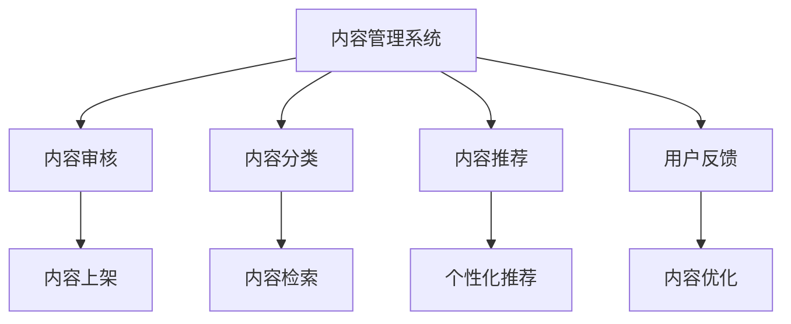

                 

# 知识付费创业中的内容更新策略

> 关键词：知识付费,内容更新,内容管理,用户留存,个性化推荐,数据驱动

## 1. 背景介绍

### 1.1 问题由来

在知识付费浪潮中，内容质量始终是核心竞争力。用户订阅某个知识付费平台，很大程度上是为了获得优质、前沿的知识内容，以提升自我价值。然而，随着用户需求的多样化和技术的发展，内容更新已不再是一劳永逸的事情。如何制定科学、高效的内容更新策略，保证内容持续新鲜、丰富，是知识付费创业中不可回避的挑战。

### 1.2 问题核心关键点

在知识付费平台，内容更新策略的核心在于如何保证内容的时效性、多样性和相关性，同时兼顾用户个性化需求和平台运营效率。具体来说，以下几个方面需要重点关注：

1. **内容时效性**：确保内容能够紧跟最新行业动态，反映最前沿的知识点。
2. **内容多样性**：提供广泛的知识领域和主题，覆盖用户多样化的学习兴趣。
3. **内容相关性**：将内容推荐给对它真正感兴趣的用户，提升用户满意度和留存率。
4. **用户个性化**：通过算法和大数据，根据用户行为和偏好提供定制化的内容推荐。
5. **运营效率**：在保证内容质量的同时，提高内容更新的效率，降低运营成本。

## 2. 核心概念与联系

### 2.1 核心概念概述

为了更好地理解内容更新策略，本节将介绍几个密切相关的核心概念：

- **内容管理系统**：用于管理、更新和分发知识内容的软件系统，支持内容上传、审核、分类、推荐等功能。
- **推荐系统**：通过分析用户行为和偏好，为用户推荐个性化内容的技术系统。
- **数据驱动决策**：利用数据分析和算法模型，辅助决策的过程。
- **A/B测试**：通过对比两个或多个版本的内容更新策略，评估其效果并确定最佳方案。
- **用户留存策略**：通过各种手段，如优惠活动、社区互动、内容召回等，提高用户留存率。

这些核心概念之间相互联系，共同构成了知识付费平台内容更新的整体框架。内容管理系统提供了技术支持，推荐系统用于个性化内容分发，数据驱动决策和A/B测试用于策略优化，用户留存策略则保证内容的长期价值。

### 2.2 核心概念原理和架构的 Mermaid 流程图(Mermaid 流程节点中不要有括号、逗号等特殊字符)



这个流程图展示了这个框架的核心环节：

1. 内容管理系统负责内容的上传、审核和分发。
2. 内容审核通过后，内容管理系统会进行分类和检索，方便推荐系统调用。
3. 推荐系统根据用户行为和偏好，进行个性化内容推荐。
4. 用户反馈环节用于收集用户的满意度、意见和建议，作为内容优化和更新的依据。
5. 内容优化模块根据用户反馈和新数据，对内容进行迭代更新。

这些环节相互配合，形成一个循环更新的机制，不断提升内容的价值和用户满意度。

## 3. 核心算法原理 & 具体操作步骤

### 3.1 算法原理概述

知识付费平台的内容更新策略，本质上是一个数据驱动、个性化推荐的过程。其核心思想是：通过分析用户的行为和偏好，预测其可能感兴趣的内容，并及时进行内容更新和推荐。

形式化地，假设平台用户集为 $U$，内容集为 $C$，每个用户 $u \in U$ 对内容 $c \in C$ 的兴趣度为 $r_{uc}$，内容更新策略的目标是最大化用户满意度 $S$，即：

$$
\max_{r} \sum_{u \in U} \sum_{c \in C} r_{uc} \cdot f_{c}
$$

其中，$f_{c}$ 为内容 $c$ 的价值，可以是内容的时效性、权威性、更新频率等指标。

### 3.2 算法步骤详解

知识付费平台的内容更新策略，一般包括以下几个关键步骤：

**Step 1: 用户行为数据收集**
- 通过API、日志等方式，收集用户在平台上的行为数据，如浏览记录、收藏、评论等。
- 使用数据清洗和处理技术，去除噪声和异常值，确保数据的准确性和完整性。

**Step 2: 特征提取**
- 利用机器学习和数据挖掘技术，从用户行为数据中提取有意义的特征。
- 例如，可以使用TF-IDF、LDA等算法对用户浏览的关键词进行聚类，获取用户的兴趣领域。
- 同时，提取内容的相关特征，如作者、主题、更新时间等。

**Step 3: 用户兴趣建模**
- 使用协同过滤、矩阵分解等算法，构建用户兴趣模型，反映每个用户对不同内容的偏好。
- 例如，可以构建用户-物品矩阵 $\mathbf{R}$，其中 $R_{ui}$ 表示用户 $u$ 对内容 $c_i$ 的兴趣度。

**Step 4: 内容推荐算法**
- 根据用户兴趣模型和内容特征，使用推荐算法为用户推荐个性化内容。
- 常见的推荐算法包括基于内容的推荐、协同过滤、深度学习推荐等。
- 例如，可以基于用户的历史行为，使用召回算法推荐相关内容，或使用神经网络推荐系统预测用户兴趣。

**Step 5: 内容更新与迭代**
- 根据推荐结果和用户反馈，定期更新内容库，优化内容质量。
- 例如，对于用户反馈强烈的内容，可以进一步查找相关资料进行补充；对于热门内容，可以联系作者进行更新。

**Step 6: 策略评估与调整**
- 使用A/B测试等方法，评估不同内容更新策略的效果。
- 例如，可以对比不同推荐算法的效果，选择最优策略。

### 3.3 算法优缺点

知识付费平台的内容更新策略，具有以下优点：

1. **用户满意度提升**：通过个性化推荐，确保用户能够获得对其感兴趣的内容，提升用户满意度。
2. **运营效率提高**：通过数据驱动决策，优化内容推荐，提高内容更新的效率和效果。
3. **市场竞争力增强**：通过持续的内容更新和迭代，保持平台的市场竞争力。

同时，该策略也存在一定的局限性：

1. **数据依赖**：推荐算法的效果依赖于用户行为数据的收集和处理，数据质量不足会影响推荐效果。
2. **算法复杂度**：复杂的推荐算法需要较高的计算资源和时间成本，难以实时更新。
3. **用户隐私问题**：在收集用户行为数据时，需要处理用户隐私问题，确保数据的安全性和合规性。

尽管存在这些局限性，但总体而言，数据驱动、个性化推荐的内容更新策略在知识付费平台中具有广泛应用前景，是提升平台竞争力和用户体验的重要手段。

### 3.4 算法应用领域

基于数据驱动和个性化推荐的内容更新策略，在知识付费平台中有广泛的应用场景，包括：

- **课程推荐**：根据用户的学习进度和偏好，推荐相关课程和专题，提高学习效果。
- **文章推荐**：分析用户阅读习惯，推荐热门文章和深度好文，提升阅读体验。
- **活动推荐**：根据用户参与情况，推荐相关课程活动和讲座，增加用户参与度。
- **专题策划**：根据热点事件和用户兴趣，策划相关专题和系列内容，提升用户粘性。

除了这些常见应用外，内容更新策略还被创新性地应用到更多场景中，如内容创作激励、知识图谱构建等，为知识付费平台提供了更多的创新路径。

## 4. 数学模型和公式 & 详细讲解

### 4.1 数学模型构建

本节将使用数学语言对知识付费平台的内容更新策略进行更加严格的刻画。

假设平台用户集为 $U$，内容集为 $C$，每个用户 $u \in U$ 对内容 $c \in C$ 的兴趣度为 $r_{uc}$，内容更新策略的目标是最大化用户满意度 $S$，即：

$$
\max_{r} \sum_{u \in U} \sum_{c \in C} r_{uc} \cdot f_{c}
$$

其中，$f_{c}$ 为内容 $c$ 的价值，可以是内容的时效性、权威性、更新频率等指标。

### 4.2 公式推导过程

假设平台内容集为 $C=\{c_1, c_2, \ldots, c_m\}$，每个内容 $c_i$ 的特征向量为 $\mathbf{f}_i \in \mathbb{R}^n$。用户 $u$ 的兴趣向量为 $\mathbf{r}_u \in \mathbb{R}^m$，其中 $r_{ui}$ 表示用户 $u$ 对内容 $c_i$ 的兴趣度。

可以构建用户-物品矩阵 $\mathbf{R} \in \mathbb{R}^{n \times m}$，其中 $R_{ui} = r_{ui} \cdot \mathbf{f}_i \cdot \mathbf{r}_u^T$。利用矩阵分解技术，可以将用户兴趣矩阵 $\mathbf{R}$ 分解为用户兴趣向量 $\mathbf{R}_u$ 和内容特征向量 $\mathbf{R}_c$：

$$
\mathbf{R} = \mathbf{R}_u \cdot \mathbf{R}_c^T
$$

其中，$\mathbf{R}_u$ 为用户兴趣矩阵，$\mathbf{R}_c$ 为内容特征矩阵。

基于上述模型，可以设计一个推荐函数 $\hat{y}_{ui} = \langle \mathbf{R}_u, \mathbf{R}_c \rangle$，其中 $\langle \cdot, \cdot \rangle$ 表示向量点积。

### 4.3 案例分析与讲解

以下我们以知识付费平台的课程推荐为例，分析如何通过推荐算法实现个性化内容推荐。

假设平台已收集到用户 $u_1, u_2, \ldots, u_n$ 的行为数据，以及内容 $c_1, c_2, \ldots, c_m$ 的特征数据。我们可以使用协同过滤算法，构建用户兴趣矩阵 $\mathbf{R}$，其中 $R_{ui}$ 表示用户 $u_i$ 对内容 $c_j$ 的兴趣度。

然后，利用矩阵分解技术，将 $\mathbf{R}$ 分解为 $\mathbf{R}_u$ 和 $\mathbf{R}_c$，从而获得用户兴趣向量和内容特征向量。

最后，基于推荐函数 $\hat{y}_{ui} = \langle \mathbf{R}_u, \mathbf{R}_c \rangle$，为用户 $u_i$ 推荐相关课程。具体实现如下：

```python
from scipy.sparse.linalg import svds
from scipy.sparse import csr_matrix

# 构建用户-物品矩阵
R = csr_matrix((r_values, (u_indices, i_indices)), shape=(n, m))

# 矩阵分解
U, S, V = svds(R, k=5, which='LM')

# 计算推荐结果
y_hat = U @ V.T
```

这个案例展示了协同过滤算法的实现过程，通过矩阵分解获得用户兴趣向量和内容特征向量，进而计算推荐结果。在实际应用中，还可以结合其他推荐算法，如基于内容的推荐、深度学习推荐等，实现更复杂的推荐策略。

## 5. 项目实践：代码实例和详细解释说明

### 5.1 开发环境搭建

在进行内容更新策略的开发实践前，我们需要准备好开发环境。以下是使用Python进行内容管理系统开发的流程：

1. 安装Anaconda：从官网下载并安装Anaconda，用于创建独立的Python环境。

2. 创建并激活虚拟环境：
```bash
conda create -n content-env python=3.8 
conda activate content-env
```

3. 安装相关依赖：
```bash
pip install Flask Flask-SQLAlchemy scikit-learn tqdm pandas numpy
```

4. 开发环境搭建完成，可以开始编写代码实现内容更新策略。

### 5.2 源代码详细实现

这里我们以知识付费平台的课程推荐为例，使用Python Flask框架和SQLAlchemy库实现内容更新策略的开发。

首先，定义课程推荐的数据模型：

```python
from flask_sqlalchemy import SQLAlchemy

db = SQLAlchemy()

class Course(db.Model):
    id = db.Column(db.Integer, primary_key=True)
    title = db.Column(db.String(256), unique=True, nullable=False)
    author = db.Column(db.String(256), nullable=False)
    tags = db.Column(db.String(256), nullable=False)
    description = db.Column(db.Text, nullable=False)
    created_at = db.Column(db.DateTime, default=datetime.now())
```

然后，定义推荐系统算法：

```python
import numpy as np
from scipy.sparse.linalg import svds

def recommend_courses(user_id, n_recommend=5):
    # 获取用户历史行为数据
    user_interactions = get_user_interactions(user_id)
    
    # 构建用户-物品矩阵
    R = np.array(user_interactions)
    
    # 矩阵分解
    U, S, V = svds(R, k=5, which='LM')
    
    # 计算推荐结果
    y_hat = U @ V.T
    
    # 选择推荐结果中得分最高的前n_recommend门课程
    recommendations = sorted(range(len(y_hat)), key=lambda i: y_hat[i, 0], reverse=True)[:n_recommend]
    
    return recommendations
```

最后，实现用户行为数据收集和内容更新功能：

```python
def get_user_interactions(user_id):
    # 从数据库中获取用户行为数据
    interactions = db.session.query(Interaction).filter_by(user_id=user_id).all()
    
    # 转换为稀疏矩阵形式
    R = np.array([[0] * len(interactions) for _ in range(len(Course))])
    for interaction in interactions:
        R[interaction.course_id, interaction.timestamp] = 1
    
    return R
```

这个代码片段展示了如何使用SciPy的svds算法进行矩阵分解，计算推荐结果，并从数据库中获取用户行为数据。在实际应用中，还需要加入更多细节，如用户兴趣模型的构建、推荐算法的优化等。

### 5.3 代码解读与分析

让我们再详细解读一下关键代码的实现细节：

**Course类**：
- `id`：课程ID，自增主键。
- `title`：课程标题，唯一且非空。
- `author`：课程作者，非空。
- `tags`：课程标签，非空。
- `description`：课程描述，非空。
- `created_at`：课程创建时间，自动设置为当前时间。

**recommend_courses函数**：
- `user_interactions`：通过`get_user_interactions`函数获取用户历史行为数据。
- `R`：将用户行为数据构建为稀疏矩阵，方便后续计算。
- `svds`：使用SciPy的svds函数进行矩阵分解，获取用户兴趣向量和内容特征向量。
- `y_hat`：计算推荐结果，选择得分最高的课程。

**get_user_interactions函数**：
- 从数据库中获取用户对各个课程的交互记录。
- 将交互记录转换为稀疏矩阵形式，方便后续计算。

这些代码片段展示了内容管理系统和推荐系统的基础实现，通过Flask和SQLAlchemy实现了数据存储和查询，结合SciPy的svds算法实现了矩阵分解和推荐。在实际应用中，还需要加入更多细节，如推荐结果的展示、用户行为的动态更新等。

## 6. 实际应用场景

### 6.1 智能课程推荐

知识付费平台的核心功能之一是课程推荐，通过个性化推荐，帮助用户快速找到适合自己的课程。

在技术实现上，可以收集用户历史学习数据，如学习进度、考试成绩、评论等，作为用户行为数据。同时，收集课程的各类信息，如标题、作者、标签等，构建内容特征矩阵。基于协同过滤算法，对用户兴趣进行建模，使用矩阵分解技术，生成推荐结果。

### 6.2 热点专题策划

知识付费平台经常推出各类专题和系列课程，以吸引用户关注和参与。通过分析用户行为数据，可以发现用户对哪些主题表现出较高的兴趣和参与度，从而策划相关专题。

例如，可以收集用户对某领域文章的浏览和互动数据，统计出高频出现的关键词和标签，确定用户对哪些主题感兴趣。然后，与领域专家合作，策划相关专题，并邀请专家进行内容创作，发布系列课程。

### 6.3 活动推荐

知识付费平台还可以通过活动推荐，增强用户参与度和粘性。例如，可以定期推出各类公开课、讲座和直播，吸引用户参与。

在技术实现上，可以收集用户参与活动的数据，如报名人数、互动次数、评价等，作为用户行为数据。同时，收集活动的各类信息，如主题、时间、讲师等，构建内容特征矩阵。基于协同过滤算法，对用户兴趣进行建模，使用矩阵分解技术，生成推荐结果。

### 6.4 未来应用展望

随着知识付费平台的不断发展，内容更新策略将呈现以下几个发展趋势：

1. **个性化推荐算法优化**：基于深度学习等先进算法，优化推荐模型，提升推荐效果。
2. **多模态数据融合**：将文本、视频、音频等多种模态数据融合，实现更全面、准确的推荐。
3. **实时推荐系统**：通过流式数据处理和在线学习技术，实现实时推荐，提升用户体验。
4. **用户行为预测**：利用时间序列分析和深度学习模型，预测用户行为，优化推荐策略。
5. **动态内容更新**：根据用户反馈和新数据，动态更新内容，保持内容的及时性和多样性。

这些趋势将进一步提升知识付费平台的内容质量和服务水平，为用户提供更优质的学习体验。

## 7. 工具和资源推荐

### 7.1 学习资源推荐

为了帮助开发者系统掌握内容更新策略的理论基础和实践技巧，这里推荐一些优质的学习资源：

1. **《推荐系统基础》**：由知识付费平台的知名专家撰写，系统介绍了推荐系统的基本原理和应用。
2. **Coursera《机器学习》课程**：斯坦福大学开设的经典课程，涵盖推荐系统的基础算法和实战案例。
3. **《深度学习与推荐系统》**：深度学习专家开发的书籍，介绍了深度学习在推荐系统中的应用。
4. **Kaggle推荐系统竞赛**：参与Kaggle的比赛，实践推荐算法的优化和改进，积累实战经验。

通过对这些资源的学习实践，相信你一定能够快速掌握内容更新策略的精髓，并用于解决实际的推荐问题。

### 7.2 开发工具推荐

高效的开发离不开优秀的工具支持。以下是几款用于内容管理系统开发的常用工具：

1. **Flask**：轻量级的Web框架，适合快速开发Web应用。
2. **SQLAlchemy**：Python的ORM框架，支持数据库的CRUD操作和复杂查询。
3. **SciPy**：科学计算库，支持矩阵分解和线性代数等操作。
4. **TensorFlow**：Google开发的深度学习框架，支持分布式计算和模型优化。
5. **Apache Kafka**：分布式流处理平台，适合处理实时数据流。
6. **Elasticsearch**：分布式搜索引擎，适合大规模数据存储和检索。

合理利用这些工具，可以显著提升内容管理系统和推荐系统的开发效率，加快创新迭代的步伐。

### 7.3 相关论文推荐

内容更新策略的研究源于学界的持续研究。以下是几篇奠基性的相关论文，推荐阅读：

1. **《协同过滤推荐系统》**：介绍协同过滤算法的原理和实现，是推荐系统领域的经典之作。
2. **《基于深度学习的推荐系统》**：介绍深度学习在推荐系统中的应用，涵盖多种深度学习架构和算法。
3. **《推荐系统中的多模态数据融合》**：介绍将多种模态数据融合到推荐系统中的方法，提高推荐效果。
4. **《实时推荐系统》**：介绍实时推荐系统的实现方法和技术，提升用户体验。

这些论文代表了大语言模型微调技术的发展脉络。通过学习这些前沿成果，可以帮助研究者把握学科前进方向，激发更多的创新灵感。

## 8. 总结：未来发展趋势与挑战

### 8.1 总结

本文对知识付费平台的内容更新策略进行了全面系统的介绍。首先阐述了内容更新策略的研究背景和意义，明确了内容时效性、多样性和相关性在平台运营中的重要性。其次，从原理到实践，详细讲解了内容更新策略的数学模型和算法步骤，给出了推荐系统开发的完整代码实例。同时，本文还广泛探讨了内容更新策略在课程推荐、专题策划、活动推荐等多个领域的应用前景，展示了内容更新策略的巨大潜力。此外，本文精选了内容更新策略的学习资源、开发工具和相关论文，力求为开发者提供全方位的技术指引。

通过本文的系统梳理，可以看到，基于数据驱动和个性化推荐的内容更新策略在知识付费平台中具有广泛应用前景，是提升平台竞争力和用户体验的重要手段。未来，伴随数据驱动决策和推荐算法的持续演进，内容更新策略将进一步优化，为知识付费平台带来更多的创新应用和发展机遇。

### 8.2 未来发展趋势

展望未来，内容更新策略将呈现以下几个发展趋势：

1. **内容多样化**：随着用户需求的多样化，内容更新策略将更加注重内容的丰富性和多样性，覆盖更多领域和主题。
2. **推荐算法优化**：基于深度学习等先进算法，优化推荐模型，提升推荐效果。
3. **实时推荐系统**：通过流式数据处理和在线学习技术，实现实时推荐，提升用户体验。
4. **用户行为预测**：利用时间序列分析和深度学习模型，预测用户行为，优化推荐策略。
5. **动态内容更新**：根据用户反馈和新数据，动态更新内容，保持内容的及时性和多样性。

这些趋势将进一步提升知识付费平台的内容质量和服务水平，为用户提供更优质的学习体验。

### 8.3 面临的挑战

尽管内容更新策略已经取得了显著成效，但在迈向更加智能化、普适化应用的过程中，它仍面临着诸多挑战：

1. **数据依赖**：推荐算法的效果依赖于用户行为数据的收集和处理，数据质量不足会影响推荐效果。
2. **算法复杂度**：复杂的推荐算法需要较高的计算资源和时间成本，难以实时更新。
3. **用户隐私问题**：在收集用户行为数据时，需要处理用户隐私问题，确保数据的安全性和合规性。
4. **推荐冷启动问题**：对于新用户，由于缺乏历史数据，推荐效果会受到较大影响。
5. **推荐偏见问题**：如果推荐模型存在偏见，可能会输出有误导性的内容，影响用户体验。

尽管存在这些挑战，但总体而言，数据驱动、个性化推荐的内容更新策略在知识付费平台中具有广泛应用前景，是提升平台竞争力和用户体验的重要手段。

### 8.4 研究展望

面对内容更新策略所面临的种种挑战，未来的研究需要在以下几个方面寻求新的突破：

1. **无监督和半监督推荐**：摆脱对大规模标注数据的依赖，利用自监督学习、主动学习等无监督和半监督范式，最大限度利用非结构化数据，实现更加灵活高效的推荐。
2. **动态行为数据收集**：通过流式数据处理和在线学习技术，实时收集用户行为数据，解决推荐冷启动问题。
3. **隐私保护技术**：采用隐私保护技术，如差分隐私、联邦学习等，确保用户隐私数据的安全性和合规性。
4. **公平性优化**：通过算法优化，减少推荐模型的偏见，确保推荐结果的公平性和合理性。
5. **跨模态数据融合**：将文本、视频、音频等多种模态数据融合，实现更全面、准确的推荐。

这些研究方向的探索，将引领内容更新策略迈向更高的台阶，为知识付费平台带来更多的创新应用和发展机遇。

## 9. 附录：常见问题与解答

**Q1：如何保证内容更新策略的推荐效果？**

A: 保证内容更新策略的推荐效果，主要依赖于高质量的数据和高效的算法。具体来说，可以从以下几个方面入手：
1. 数据质量：确保用户行为数据的准确性和完整性，避免噪声和异常值。
2. 特征提取：利用机器学习和数据挖掘技术，从用户行为数据中提取有意义的特征。
3. 算法优化：结合多种推荐算法，如协同过滤、深度学习推荐等，提升推荐效果。
4. 实时更新：通过流式数据处理和在线学习技术，实现实时推荐，提升用户体验。
5. 用户反馈：定期收集用户反馈，动态更新推荐模型，优化推荐效果。

**Q2：如何选择推荐算法？**

A: 选择推荐算法时，需要考虑数据的特点和应用场景。一般来说，可以从以下几个方面入手：
1. 数据规模：如果数据规模较小，推荐算法可以选择简单的协同过滤、基于内容的推荐等。
2. 用户行为：如果用户行为较为多样，可以考虑深度学习推荐系统，如基于序列的RNN、LSTM等。
3. 实时性要求：如果需要实时推荐，可以选择流式数据处理和在线学习技术，如Kafka、TensorFlow等。
4. 预测精度：如果需要高精度的推荐结果，可以选择复杂的深度学习模型，如GAN、自注意力模型等。

**Q3：如何处理用户隐私问题？**

A: 处理用户隐私问题，主要依赖于数据保护技术和法律法规。具体来说，可以从以下几个方面入手：
1. 数据匿名化：在收集用户行为数据时，采用数据匿名化技术，如差分隐私、泛化等。
2. 数据加密：在数据存储和传输过程中，采用数据加密技术，确保数据的安全性。
3. 法律法规：遵守相关的隐私保护法律法规，如GDPR、CCPA等，确保数据处理合规。
4. 用户同意：在收集用户数据前，确保获得用户的明确同意，并提供数据使用透明性。
5. 隐私审计：定期进行隐私审计，确保数据处理流程符合隐私保护要求。

这些措施可以保证用户隐私数据的安全性和合规性，避免数据泄露和滥用。

**Q4：如何处理推荐冷启动问题？**

A: 处理推荐冷启动问题，可以从以下几个方面入手：
1. 基础推荐：对于新用户，可以通过基础推荐算法，如基于内容的推荐、协同过滤等，提供初步推荐。
2. 用户引导：通过引导新用户进行个性化设置和兴趣选择，收集初始行为数据，建立初步兴趣模型。
3. 数据补充：利用用户反馈和新数据，逐步补充用户行为数据，优化推荐模型。
4. 多模态数据：结合多模态数据，如社交网络、历史记录等，提升推荐效果。
5. 动态更新：通过流式数据处理和在线学习技术，实时更新推荐模型，提升推荐效果。

这些措施可以解决推荐冷启动问题，提升新用户的推荐效果，加速用户成长。

**Q5：如何优化推荐算法？**

A: 优化推荐算法，可以从以下几个方面入手：
1. 算法选择：选择适合应用场景的推荐算法，如协同过滤、深度学习推荐、混合推荐等。
2. 特征工程：设计有效的特征工程，提取和利用用户行为数据中的有用信息。
3. 模型调参：通过交叉验证等方法，调整模型超参数，优化模型性能。
4. 模型融合：利用模型融合技术，结合多种推荐算法，提升推荐效果。
5. 动态更新：通过流式数据处理和在线学习技术，实时更新推荐模型，适应数据变化。

这些措施可以提升推荐算法的性能和效果，确保推荐结果的准确性和用户满意度。

**Q6：如何提升内容多样性？**

A: 提升内容多样性，可以从以下几个方面入手：
1. 内容丰富：确保平台内容覆盖广泛领域和主题，增加用户选择空间。
2. 推荐多样：结合多种推荐算法，提升推荐结果的多样性，避免单一内容推荐。
3. 动态更新：通过流式数据处理和在线学习技术，实时更新内容，保持内容新鲜。
4. 用户引导：通过引导用户进行兴趣选择和个性化设置，收集用户多样化需求。
5. 内容策划：定期策划相关专题和系列课程，丰富平台内容。

这些措施可以提升内容多样性，满足用户多样化的学习需求，提升用户粘性和满意度。

---

作者：禅与计算机程序设计艺术 / Zen and the Art of Computer Programming

