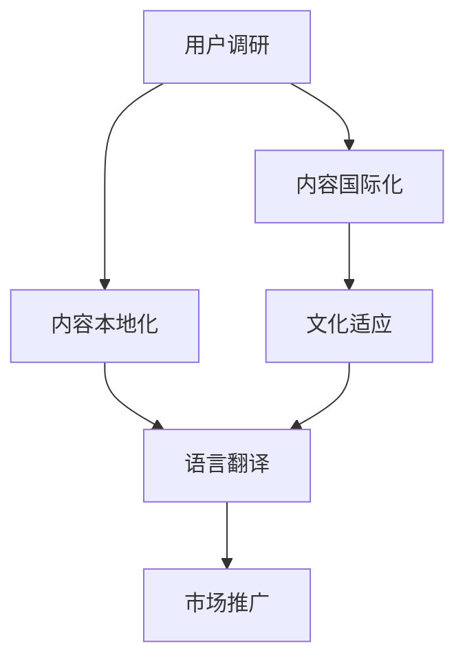

                 

# 知识付费创业中的内容本地化与国际化

> 关键词：知识付费, 内容本地化, 内容国际化, 全球化, 内容运营

## 1. 背景介绍

### 1.1 问题由来
随着互联网的快速发展，知识付费行业迎来了爆发式增长。各种知识付费平台如雨后春笋般涌现，内容覆盖领域广泛，形式也日益多样。如何在全球化背景下，实现内容的本地化与国际化，是知识付费创业中亟待解决的重要问题。

内容本地化与国际化不仅涉及内容的翻译和适应性调整，更涉及到对目标市场文化和消费习惯的理解与尊重。正确的内容本地化能够提升用户体验，增加用户粘性，从而在激烈的市场竞争中脱颖而出。同时，内容国际化能够拓展市场范围，增加用户基数，推动业务增长。

### 1.2 问题核心关键点
内容本地化与国际化的核心在于理解并满足目标市场用户的需求，同时保持内容的文化适应性和商业价值。主要包括以下几个方面：

1. **用户调研**：深入了解目标市场的用户特点、消费偏好和需求痛点。
2. **文化适应**：调整内容表达方式，使其符合目标市场的文化习惯。
3. **语言翻译**：进行高质量的文本翻译，保持原内容的语义准确性和风格一致性。
4. **市场推广**：设计符合目标市场特点的市场推广策略，增加用户曝光和转化。

## 2. 核心概念与联系

### 2.1 核心概念概述

为更好地理解内容本地化与国际化的实施策略，本节将介绍几个关键概念及其相互联系：

- **内容本地化(Content Localization)**：指根据目标市场的文化特点、语言习惯、用户偏好等因素，对原始内容进行定制化修改，使其更符合当地用户的需求和消费习惯。
- **内容国际化(Content Internationalization)**：指将内容产品扩展到全球市场，调整内容和形式以适应不同国家和地区的用户需求，同时保持内容的全球普适性和文化多样性。
- **用户调研(User Research)**：通过问卷调查、用户访谈、行为分析等方式，收集目标市场用户的反馈和需求信息，为内容本地化和国际化提供数据支撑。
- **文化适应(Cultural Adaptation)**：在保持原内容核心价值和风格的前提下，对内容的语言、符号、题材等进行文化适应性调整，以符合目标市场的文化背景。
- **语言翻译(Language Translation)**：将内容从一种语言翻译成另一种语言，同时保持原文的语义和风格，是内容国际化的基础步骤。
- **市场推广(Market Promotion)**：制定符合目标市场特点的市场推广策略，通过各种渠道提升内容的曝光率和用户转化率。

这些核心概念之间的逻辑关系可以通过以下Mermaid流程图来展示：



这个流程图展示了内容本地化与国际化的核心概念及其相互关系：

1. 用户调研是了解目标市场需求的起点。
2. 根据用户调研结果，内容本地化对原始内容进行调整，使其更符合当地市场的需求。
3. 内容国际化则进一步扩展到全球市场，同时进行文化适应性调整。
4. 语言翻译是内容国际化的基础，保持内容的全球普适性。
5. 市场推广则结合内容本地化和国际化的需求，制定符合目标市场特点的推广策略。

这些概念共同构成了内容本地化与国际化的实施框架，有助于企业在全球市场实现内容的有效落地。

## 3. 核心算法原理 & 具体操作步骤
### 3.1 算法原理概述

内容本地化与国际化主要依赖于自然语言处理(NLP)技术和用户行为分析等方法，其核心算法原理包括以下几个方面：

1. **用户行为分析**：通过数据分析和机器学习模型，了解目标市场的用户行为和偏好，为内容定制化提供依据。
2. **内容推荐算法**：结合用户行为和内容特征，构建推荐系统，推荐最适合用户的内容。
3. **自然语言处理**：利用NLP技术进行文本翻译、情感分析、主题建模等，提升内容的可读性和吸引力。
4. **用户生成内容(UGC)**：鼓励用户生成并分享内容，增加内容的丰富性和多样性。

### 3.2 算法步骤详解

内容本地化与国际化的具体实施步骤可以分为以下几个阶段：

**Step 1: 用户调研**
- 设计调查问卷，通过线上或线下渠道收集目标市场的用户数据。
- 使用用户访谈、焦点小组等定性方法，深入了解用户需求和痛点。
- 分析行为数据，如用户浏览记录、购买行为、评论反馈等，获取定量分析结果。

**Step 2: 内容定制化**
- 根据用户调研结果，对原始内容进行定制化调整，如修改语言、调整格式、增加本地化案例等。
- 引入本地化专家进行内容审核和优化，确保内容符合目标市场文化和语言习惯。

**Step 3: 内容翻译**
- 选择合适的翻译工具和团队，进行高质量的文本翻译。
- 对翻译结果进行审核和校对，确保语义准确、风格一致。

**Step 4: 文化适应**
- 结合目标市场的文化背景，对内容进行文化适应性调整，如调整符号、题材等。
- 引入本地化专家和文化顾问，确保内容的文化适应性和可接受性。

**Step 5: 市场推广**
- 结合本地市场特点，制定推广策略，如社交媒体营销、搜索引擎优化(SEO)、合作推广等。
- 通过线上和线下渠道进行内容推广，增加用户曝光和转化。

**Step 6: 反馈与优化**
- 收集用户反馈和行为数据，持续优化内容和推广策略。
- 定期评估内容效果，调整和优化本地化与国际化策略。

### 3.3 算法优缺点

内容本地化与国际化的算法具有以下优点：

1. **提升用户体验**：通过定制化调整，内容和形式更符合当地市场的需求，增加用户粘性。
2. **增加用户基数**：国际化拓展市场范围，吸引更多全球用户，增加用户基数。
3. **提高转化率**：本地化内容和推广策略更符合目标市场特点，提升用户转化率。

同时，该方法也存在一定的局限性：

1. **成本高**：用户调研、内容定制、翻译和推广等环节需要大量资源投入。
2. **风险大**：文化和语言差异可能导致内容误读或误解，影响用户接受度。
3. **技术复杂**：涉及多语言处理和跨文化适应，技术实现复杂度较高。

尽管存在这些局限性，但就目前而言，内容本地化与国际化是知识付费创业中不可或缺的重要环节。未来相关研究的重点在于如何进一步降低成本、提高效果，同时兼顾文化多样性和用户需求。

### 3.4 算法应用领域

内容本地化与国际化的算法在知识付费行业中得到了广泛应用，主要体现在以下几个方面：

- **在线课程**：根据目标市场的用户需求和消费习惯，对课程内容进行本地化调整，提升用户接受度。
- **电子书**：对电子书进行翻译和文化适应性调整，增加国际市场的用户基数。
- **在线咨询**：结合目标市场的用户需求，对咨询内容进行本地化定制，提高服务质量。
- **社区互动**：根据本地市场特点，设计符合用户习惯的社区互动形式，增加用户粘性。
- **广告推广**：结合本地市场特点，制定有针对性的广告推广策略，增加用户曝光和转化。

此外，内容本地化与国际化技术也在其他行业领域，如旅游、电商、金融等，得到了创新应用，推动了业务发展和市场扩展。随着全球化进程的加速，相信内容本地化与国际化将发挥越来越重要的作用，成为企业全球化竞争的关键因素。

## 4. 数学模型和公式 & 详细讲解 & 举例说明

### 4.1 数学模型构建

为更好地理解内容本地化与国际化的算法原理，本节将介绍几个常用的数学模型及其构建方法。

假设内容本地化与国际化的目标是将原始内容 $C$ 翻译为本地化内容 $C_{\text{local}}$，并进行文化适应性调整。其数学模型可以表示为：

$$
C_{\text{local}} = f(C, \lambda)
$$

其中 $f$ 为本地化与国际化算法，$\lambda$ 为本地化与国际化参数，如文化背景、语言习惯等。

### 4.2 公式推导过程

以内容翻译为例，其核心公式为：

$$
T = L(C)
$$

其中 $T$ 为目标语言的翻译文本，$L$ 为翻译函数，$C$ 为原始内容文本。

在实际应用中，翻译函数 $L$ 通常基于机器翻译模型，如神经机器翻译(NMT)。其基本原理是通过训练神经网络模型，将源语言文本映射为目标语言文本。常用的NMT模型包括基于RNN、LSTM、Transformer等架构的模型。

### 4.3 案例分析与讲解

以在线课程的本地化为例，其翻译和文化适应性调整过程如下：

1. **用户调研**：通过在线问卷和用户访谈，了解目标市场的用户需求和消费习惯。
2. **内容定制化**：根据用户调研结果，对课程内容进行本地化调整，如修改课程标题、调整课程难度等。
3. **内容翻译**：使用机器翻译模型，将课程内容翻译为目标语言。
4. **文化适应**：结合目标市场的文化背景，对翻译后的内容进行文化适应性调整，如调整课程结构、调整教学案例等。
5. **市场推广**：结合本地市场特点，设计符合用户习惯的推广策略，如社交媒体营销、搜索引擎优化等。

## 5. 项目实践：代码实例和详细解释说明
### 5.1 开发环境搭建

在进行内容本地化与国际化的项目实践前，我们需要准备好开发环境。以下是使用Python进行Flask开发的实践环境配置流程：

1. 安装Anaconda：从官网下载并安装Anaconda，用于创建独立的Python环境。

2. 创建并激活虚拟环境：
```bash
conda create -n content_localization python=3.8 
conda activate content_localization
```

3. 安装Flask：从官网下载并安装Flask，用于构建Web服务。

```bash
pip install flask
```

4. 安装翻译库：
```bash
pip install googletrans
```

5. 安装数据分析库：
```bash
pip install pandas numpy scikit-learn
```

完成上述步骤后，即可在`content_localization`环境中开始项目实践。

### 5.2 源代码详细实现

这里我们以在线课程的本地化为例，给出使用Flask进行内容本地化的代码实现。

首先，定义Flask应用：

```python
from flask import Flask, request, jsonify
import googletrans
from sklearn.feature_extraction.text import CountVectorizer

app = Flask(__name__)

# 初始化翻译器
translator = googletrans.Translator()

# 初始化内容向量模型
vectorizer = CountVectorizer()

@app.route('/localize', methods=['POST'])
def localize_course():
    course_data = request.json
    title = course_data['title']
    description = course_data['description']
    language = course_data['language']
    
    # 进行内容翻译和文化适应性调整
    translated_title = translator.translate(title, dest=language).text
    translated_description = translator.translate(description, dest=language).text
    
    # 提取关键词
    keywords = vectorizer.fit_transform([translated_title, translated_description]).toarray().sum(axis=0)
    
    # 返回本地化后的课程数据
    localized_course = {
        'title': translated_title,
        'description': translated_description,
        'language': language,
        'keywords': keywords.tolist()
    }
    
    return jsonify(localized_course)

if __name__ == '__main__':
    app.run(debug=True)
```

然后，启动Flask应用：

```bash
python app.py
```

以上代码实现了一个简单的Flask API，用于接收在线课程的原始数据，进行内容翻译和文化适应性调整，并返回本地化后的课程数据。开发者可以根据实际需求，进一步优化和扩展该API，实现更复杂的功能。

### 5.3 代码解读与分析

让我们再详细解读一下关键代码的实现细节：

**Flask应用定义**：
- 初始化Flask应用，并定义一个名为`/localize`的API路由。
- 使用Google Translate API进行内容翻译，确保翻译结果符合目标语言。
- 使用Scikit-learn库中的CountVectorizer模型提取关键词，用于内容定制化调整。

**本地化处理**：
- 根据用户输入的原始课程数据，进行内容翻译和文化适应性调整。
- 通过翻译API将课程标题和描述翻译为目标语言。
- 使用CountVectorizer模型提取关键词，作为内容定制化的依据。

**API返回**：
- 将本地化后的课程数据以JSON格式返回给前端。

可以看到，Flask和Google Translate API的结合，使得内容本地化的实现变得简洁高效。开发者可以根据实际需求，进一步优化API功能和扩展功能模块。

当然，工业级的系统实现还需考虑更多因素，如用户管理、权限控制、数据存储等。但核心的本地化范式基本与此类似。

## 6. 实际应用场景
### 6.1 在线教育平台

在线教育平台是内容本地化与国际化的典型应用场景。不同地区的用户对课程内容和教学方式的需求差异较大，平台通过本地化与国际化技术，能够提供符合本地市场特点的课程内容，提升用户满意度和平台留存率。

以Coursera为例，其课程内容覆盖全球多个国家和地区，根据不同市场的需求和消费习惯，进行内容本地化和国际化调整。如中文课程的本地化调整包括修改课程标题、调整课程难度、增加本地化案例等。通过这些措施，Coursera能够更好地吸引全球用户，提升平台的全球影响力。

### 6.2 跨境电商

跨境电商是内容本地化与国际化的另一大应用场景。不同国家的用户对产品介绍、购物体验、支付方式等的需求差异较大，电商平台通过本地化与国际化技术，能够提供符合本地市场特点的购物体验，增加用户转化率。

以Amazon为例，其国际站和第三方市场覆盖全球多个国家和地区，通过本地化产品页面、优化物流配送、提供本地支付方式等措施，提升全球用户的购物体验。通过这些本地化调整，Amazon能够更好地拓展国际市场，增加用户基数和业务收入。

### 6.3 国际旅游

国际旅游是内容本地化与国际化的典型应用场景。不同国家的游客对旅游信息的需求差异较大，旅游平台通过本地化与国际化技术，能够提供符合本地市场特点的旅游信息，提升游客体验。

以TripAdvisor为例，其旅游信息覆盖全球多个国家和地区，根据不同市场的需求和消费习惯，进行内容本地化和国际化调整。如中文页面的本地化调整包括修改页面语言、调整信息排版、增加本地化评论等。通过这些措施，TripAdvisor能够更好地吸引全球游客，提升平台的全球影响力。

### 6.4 未来应用展望

随着内容本地化与国际化技术的不断发展，未来将在更多领域得到应用，为传统行业带来变革性影响。

在智慧医疗领域，通过本地化与国际化技术，能够提供符合本地市场特点的医疗信息，提升医疗服务的智能化水平，辅助医生诊疗，加速新药开发进程。

在智能教育领域，通过本地化与国际化技术，能够提供符合本地市场特点的教育内容，因材施教，促进教育公平，提高教学质量。

在智慧城市治理中，通过本地化与国际化技术，能够提供符合本地市场特点的城市信息，提高城市管理的自动化和智能化水平，构建更安全、高效的未来城市。

此外，在企业生产、社会治理、文娱传媒等众多领域，基于本地化与国际化的内容产品也将不断涌现，为经济社会发展注入新的动力。相信随着技术的日益成熟，本地化与国际化技术将进一步推动NLP技术的发展和应用，为构建全球化的智能系统提供技术支撑。

## 7. 工具和资源推荐
### 7.1 学习资源推荐

为了帮助开发者系统掌握内容本地化与国际化的理论基础和实践技巧，这里推荐一些优质的学习资源：

1. **《内容本地化与国际化》系列博文**：由内容本地化专家撰写，深入浅出地介绍了内容本地化的原理、方法、工具等，涵盖从用户调研到文化适应等多个环节。

2. **Coursera《Content Localization and Internationalization》课程**：斯坦福大学开设的课程，提供从用户调研到内容定制化、翻译、推广等多个环节的全面讲解，帮助你系统掌握内容本地化的知识体系。

3. **《内容本地化与国际化实践指南》书籍**：一本详细介绍内容本地化与国际化技术和方法的书籍，结合案例和工具，帮助你更好地应用到实际项目中。

4. **Google Translate API官方文档**：提供完整的API使用指南和示例代码，帮助你快速上手内容翻译的实现。

5. **Scikit-learn官方文档**：提供详细的机器学习模型和算法介绍，帮助你进行内容关键词提取和文化适应性调整。

通过对这些资源的学习实践，相信你一定能够快速掌握内容本地化的精髓，并用于解决实际的业务问题。

### 7.2 开发工具推荐

高效的开发离不开优秀的工具支持。以下是几款用于内容本地化与国际化开发的常用工具：

1. **Flask**：基于Python的轻量级Web框架，简单易用，适合快速迭代研究。

2. **Google Translate API**：提供高质量的文本翻译服务，支持多种语言和格式。

3. **Scikit-learn**：基于Python的机器学习库，提供多种算法和工具，适用于文本处理和内容定制化调整。

4. **Jupyter Notebook**：交互式笔记本，支持Python、R等多种语言，适合数据探索和模型验证。

5. **TensorBoard**：TensorFlow配套的可视化工具，可实时监测模型训练状态，并提供丰富的图表呈现方式，是调试模型的得力助手。

合理利用这些工具，可以显著提升内容本地化的开发效率，加快创新迭代的步伐。

### 7.3 相关论文推荐

内容本地化与国际化技术的发展源于学界的持续研究。以下是几篇奠基性的相关论文，推荐阅读：

1. **《内容本地化与国际化综述》**：一篇全面综述论文，介绍了内容本地化的原理、方法和应用场景，提供系统化的知识体系。

2. **《基于机器学习的文本翻译》**：介绍基于机器学习的文本翻译方法，包括神经机器翻译(NMT)和统计机器翻译(SMT)，提供理论基础和实现细节。

3. **《内容本地化与国际化的自动化实现》**：一篇探讨自动化实现内容本地化的论文，介绍了自动机器翻译、文本生成、用户行为分析等技术，提供实践指南。

4. **《用户调研在内容本地化中的应用》**：一篇探讨用户调研在内容本地化中的重要性的论文，介绍了用户调研的方法和工具，提供实际案例。

5. **《内容本地化的文化适应性调整》**：一篇探讨内容本地化中文化适应性调整的论文，介绍了文化适应性调整的方法和策略，提供实证研究。

这些论文代表了大语言模型微调技术的发展脉络。通过学习这些前沿成果，可以帮助研究者把握学科前进方向，激发更多的创新灵感。

## 8. 总结：未来发展趋势与挑战

### 8.1 总结

本文对内容本地化与国际化的算法进行了全面系统的介绍。首先阐述了内容本地化与国际化的研究背景和意义，明确了本地化与国际化的核心目标和实施策略。其次，从原理到实践，详细讲解了内容本地化的数学模型和关键步骤，给出了内容本地化的完整代码实例。同时，本文还广泛探讨了内容本地化在在线教育、跨境电商、国际旅游等多个行业领域的应用前景，展示了本地化与国际化的巨大潜力。此外，本文精选了内容本地化的各类学习资源，力求为读者提供全方位的技术指引。

通过本文的系统梳理，可以看到，内容本地化与国际化技术正在成为知识付费行业的重要范式，极大地拓展了内容产品的应用边界，催生了更多的落地场景。受益于大规模语料的预训练，本地化与国际化模型能够以更低的时间和标注成本，在小样本条件下也能取得理想的本地化效果，有力推动了知识付费技术的产业化进程。未来，伴随预训练语言模型和本地化与国际化方法的持续演进，相信知识付费技术必将在更广阔的应用领域大放异彩，深刻影响人类的生产生活方式。

### 8.2 未来发展趋势

展望未来，内容本地化与国际化技术将呈现以下几个发展趋势：

1. **技术自动化提升**：利用自动化工具和技术，减少本地化过程中的人工干预，提高效率和准确性。
2. **跨文化理解深化**：通过更深入的跨文化研究和理解，实现更精准的内容本地化和文化适应性调整。
3. **多模态融合发展**：将文本、图像、视频等多模态信息融合到内容本地化中，提升用户体验和内容丰富度。
4. **个性化推荐增强**：通过更精细的用户画像和推荐算法，实现个性化内容推荐，提升用户粘性和满意度。
5. **本地化工具完善**：开发更高效、更全面的本地化工具，提供一站式的本地化解决方案，支持更多的语言和文化。
6. **数据驱动决策**：通过大数据分析和机器学习模型，驱动本地化策略的优化和调整，提升决策科学性和效果。

以上趋势凸显了内容本地化与国际化技术的广阔前景。这些方向的探索发展，必将进一步提升内容产品的性能和应用范围，为知识付费行业带来新的突破。

### 8.3 面临的挑战

尽管内容本地化与国际化技术已经取得了瞩目成就，但在迈向更加智能化、普适化应用的过程中，它仍面临着诸多挑战：

1. **成本高昂**：本地化过程中涉及大量人工和资源投入，成本较高。如何降低成本，提高效率，是当前面临的主要挑战。
2. **文化适应性不足**：不同文化的差异可能导致内容误读或误解，影响用户接受度。如何提高文化适应性，增强内容的可接受性，仍需不断探索。
3. **数据隐私问题**：本地化过程中需要收集和处理大量用户数据，如何保护用户隐私，避免数据泄露风险，是必须解决的重要问题。
4. **跨语言一致性**：多语言本地化过程中，如何保持内容的一致性和连贯性，避免跨语言转换带来的信息丢失，是技术实现上的难点。
5. **实时本地化困难**：一些实时应用场景中，如何实现动态本地化调整，提升用户体验，是技术挑战之一。

这些挑战需要在未来不断攻克，以推动内容本地化与国际化的技术进步和应用拓展。

### 8.4 研究展望

面对内容本地化与国际化所面临的种种挑战，未来的研究需要在以下几个方面寻求新的突破：

1. **自动化技术优化**：开发更高效、更全面的自动化工具，减少人工干预，提高本地化效率和准确性。
2. **跨文化理解增强**：通过更深入的跨文化研究和理解，实现更精准的内容本地化和文化适应性调整。
3. **数据隐私保护强化**：利用隐私保护技术，如差分隐私、联邦学习等，保护用户隐私，避免数据泄露风险。
4. **跨语言一致性保持**：利用机器翻译、语言模型等技术，保持内容在不同语言版本之间的一致性和连贯性。
5. **实时本地化技术探索**：开发实时本地化技术，提升动态本地化调整的能力，提升用户体验。

这些研究方向的探索，必将引领内容本地化与国际化技术迈向更高的台阶，为构建全球化的智能系统提供技术支撑。面向未来，内容本地化与国际化技术还需要与其他人工智能技术进行更深入的融合，如知识表示、因果推理、强化学习等，多路径协同发力，共同推动内容本地化与国际化技术的发展和应用。只有勇于创新、敢于突破，才能不断拓展内容产品的边界，让智能技术更好地造福人类社会。

## 9. 附录：常见问题与解答

**Q1：内容本地化与国际化过程中如何确保内容质量？**

A: 内容本地化与国际化过程中，确保内容质量至关重要。以下是几种常见的质量控制方法：

1. **人工审核**：引入专业编辑和本地化专家进行人工审核，确保内容的语义准确性和文化适应性。
2. **机器审核**：使用机器学习模型进行初步审核，筛选出可能存在问题的文本。
3. **用户反馈**：通过用户反馈和行为数据，持续优化本地化内容，提升用户满意度。
4. **多轮迭代**：进行多轮本地化与国际化调整，逐步优化内容质量。

**Q2：如何降低内容本地化与国际化的成本？**

A: 降低内容本地化与国际化的成本，可以从以下几个方面入手：

1. **自动化工具**：利用自动化翻译、文本生成等工具，减少人工干预，提高效率。
2. **批量处理**：采用批量处理的方式，降低单次处理的成本。
3. **共享资源**：利用已有资源进行本地化与国际化调整，避免重复劳动。
4. **外包合作**：与专业的本地化公司合作，共享成本和技术。

**Q3：如何进行多语言内容的管理和维护？**

A: 进行多语言内容的管理和维护，需要构建一个完整的内容管理系统。以下是几种常见的方法：

1. **内容库管理**：将不同语言版本的内容存储在一个统一的内容库中，方便管理。
2. **版本控制**：采用版本控制技术，记录和管理不同版本的内容，便于回溯和修改。
3. **内容发布系统**：开发内容发布系统，方便不同语言版本的自动发布和更新。
4. **用户界面本地化**：将用户界面本地化，提升用户体验。

**Q4：如何保证不同语言版本的内容一致性？**

A: 保证不同语言版本的内容一致性，需要从以下几个方面入手：

1. **机器翻译**：使用高质量的机器翻译工具，确保不同版本的内容一致性。
2. **多语言模型**：利用多语言模型，确保不同语言版本的内容保持一致性。
3. **人工校对**：引入专业编辑进行人工校对，确保不同语言版本的内容一致性。
4. **本地化策略**：制定统一的本地化策略，确保不同语言版本的内容保持一致性。

这些方法可以在不同程度上保证内容的一致性，提升用户体验。

**Q5：如何进行跨文化理解的研究？**

A: 进行跨文化理解的研究，可以从以下几个方面入手：

1. **文化研究**：深入研究不同文化的特点和差异，理解文化背景。
2. **用户调研**：通过问卷调查、用户访谈等方式，了解不同文化用户的需求和偏好。
3. **文化适应性调整**：在保持原内容核心价值和风格的前提下，对内容的语言、符号、题材等进行文化适应性调整。
4. **多文化团队**：组建多文化团队，共同研究和实践跨文化理解。

这些方法可以帮助研究者更好地理解和适应不同文化，提升内容本地化的效果。

---

作者：禅与计算机程序设计艺术 / Zen and the Art of Computer Programming

