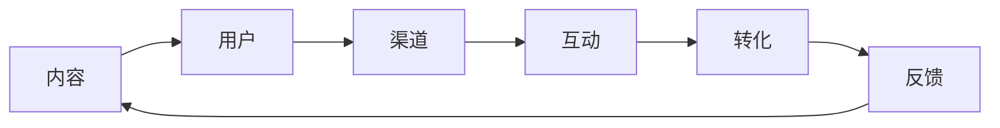

                 

# 知识付费创业中的内容营销矩阵搭建

## 1. 背景介绍

随着互联网的发展，知识付费成为越来越多人获取知识和技能的新途径。内容创业也随之蓬勃兴起，在提供知识的同时，如何营销自己的内容，吸引并留住用户，成为了知识创业者面临的重要问题。内容营销作为营销组合的重要组成部分，是知识付费创业中不可或缺的一环。

在本章中，我们将详细介绍内容营销的矩阵搭建方法，帮助知识创业者构建高效的内容营销策略，提升内容的曝光度和用户粘性。

## 2. 核心概念与联系

在内容营销矩阵搭建中，需要明确几个核心概念及其联系：

### 2.1 核心概念概述

- **内容（Content）**：知识创业者提供给用户的价值，可以是文章、视频、音频、直播等形式。
- **用户（Audience）**：知识创业者的目标受众，即潜在的知识消费者。
- **渠道（Channel）**：内容传播的媒介，包括社交媒体、官网、邮件、合作平台等。
- **互动（Engagement）**：用户与内容的互动方式，如点赞、评论、分享等。
- **转化（Conversion）**：用户从潜在消费者转变为实际消费者的过程，如购买课程、订阅内容等。

这些概念共同构成了内容营销矩阵的基本框架，通过合理的组合和调配，可以最大化内容的价值和影响力。

### 2.2 核心概念原理和架构的 Mermaid 流程图



该图展示了内容营销矩阵的核心概念及其关系：内容吸引用户，通过渠道传播，与用户进行互动，最终完成转化，并从反馈中不断优化内容。

## 3. 核心算法原理 & 具体操作步骤

### 3.1 算法原理概述

内容营销矩阵搭建的本质是通过数据驱动的方式，对内容、用户、渠道和互动进行全面分析和优化。其核心思想是：

1. **数据收集**：通过各种渠道收集用户行为数据，如点击率、转化率、互动率等。
2. **数据分析**：利用数据挖掘和机器学习技术，分析用户行为，识别用户需求和偏好。
3. **内容优化**：根据分析结果，调整和优化内容，使其更符合用户需求。
4. **渠道优化**：选择和优化渠道，提升内容的传播效率和覆盖面。
5. **互动提升**：增强与用户的互动，提高用户参与度和忠诚度。
6. **效果评估**：通过关键绩效指标（KPI）评估转化效果，不断优化营销策略。

### 3.2 算法步骤详解

#### 3.2.1 数据收集与处理

首先，收集用户在不同渠道上的行为数据，例如：

- 社交媒体：点赞、评论、分享次数
- 官网：访问量、停留时间、转化率
- 邮件：打开率、点击率、订阅率
- 合作平台：阅读量、播放量、观看时长

数据收集后，需要进行清洗和预处理，例如：

- 去除噪音数据
- 处理缺失值
- 标准化数据格式

#### 3.2.2 数据分析与模型建立

利用数据分析工具（如Google Analytics、Tableau等），对收集到的数据进行分析，识别出用户的行为模式和偏好。例如：

- 用户偏好时间：早中晚各时段的用户活跃情况
- 用户偏好内容：喜欢哪种类型的内容，如技术文章、实践教程等
- 用户来源：从哪个渠道来的用户最多
- 用户行为：阅读、观看、互动等行为数据

在此基础上，可以建立数据模型，用于预测用户行为和转化效果。例如：

- 用户留存模型：预测用户在一段时间内的留存率
- 内容推荐模型：根据用户行为推荐相关内容
- 渠道效果模型：评估不同渠道的传播效果

#### 3.2.3 内容优化与发布

根据数据分析结果，对内容进行优化和调整。例如：

- 调整标题和摘要：提高文章的可读性和吸引力
- 优化内容结构：增加案例分析和实战演练
- 引入多媒体元素：增加视频、音频等多媒体内容

优化后，将内容发布到各大渠道，例如：

- 社交媒体：图文、短视频
- 官网：博客、专栏
- 邮件：简报、总结
- 合作平台：文章、专栏

#### 3.2.4 渠道优化与选择

根据渠道数据分析结果，选择和优化传播渠道。例如：

- 高互动渠道：用户活跃度高的社交媒体
- 高转化渠道：转化率高的官网和邮件
- 多渠道组合：结合多种渠道进行内容传播

#### 3.2.5 互动提升与用户管理

通过增强与用户的互动，提升用户参与度和忠诚度。例如：

- 社交媒体互动：回复用户评论、举办互动活动
- 官网互动：用户留言、在线答疑
- 邮件互动：个性化推荐、用户调查

#### 3.2.6 效果评估与优化

利用关键绩效指标（KPI）评估转化效果，例如：

- 用户增长率
- 内容互动率
- 转化率
- 用户留存率

根据评估结果，不断优化内容、渠道和互动策略，形成良性循环。

### 3.3 算法优缺点

#### 3.3.1 优点

1. **数据驱动**：通过数据分析，科学决策，避免主观判断带来的偏差。
2. **效果显著**：能够快速识别用户需求和行为，优化内容策略，提升转化率。
3. **可扩展性强**：适用于多种内容形式和渠道，灵活调整和优化。
4. **持续优化**：通过不断收集和分析数据，不断优化营销策略，形成良性循环。

#### 3.3.2 缺点

1. **数据质量要求高**：需要高质量的数据才能得出准确的结果，数据收集和处理较为复杂。
2. **技术门槛高**：需要一定的数据分析和机器学习技术，对技术要求较高。
3. **隐私问题**：用户数据的收集和处理可能涉及隐私问题，需要合法合规。
4. **模型复杂**：数据分析和模型建立较为复杂，需要专业的数据科学家和技术团队。

### 3.4 算法应用领域

内容营销矩阵搭建在知识付费创业中有着广泛的应用，例如：

- **在线教育**：通过分析用户行为，优化课程内容和推广策略，提高用户购买率和留存率。
- **技能培训**：通过互动和反馈，提升用户参与度和课程效果，提高用户满意度。
- **技术咨询**：通过数据驱动的方式，为用户提供个性化服务，增强客户粘性。
- **产品推广**：通过多渠道传播和用户互动，提升产品曝光度和销售转化率。

## 4. 数学模型和公式 & 详细讲解 & 举例说明

### 4.1 数学模型构建

在内容营销矩阵搭建中，常见的数学模型包括：

1. **用户留存率模型**：

   $$
   \text{留存率} = \frac{\text{一定时间内的活跃用户数}}{\text{总用户数}}
   $$

2. **内容互动率模型**：

   $$
   \text{互动率} = \frac{\text{一定时间内的互动次数}}{\text{内容曝光次数}}
   $$

3. **转化率模型**：

   $$
   \text{转化率} = \frac{\text{一定时间内的转化用户数}}{\text{总曝光用户数}}
   $$

### 4.2 公式推导过程

1. **用户留存率模型**：

   设总用户数为 $U$，活跃用户数为 $A$，留存率为 $R$。

   $$
   R = \frac{A}{U}
   $$

   对于时间 $t$ 的留存率，可通过历史数据计算得出。例如，第 $t$ 天的活跃用户数 $A_t$ 与第 $t-1$ 天的活跃用户数 $A_{t-1}$ 之间的关系为：

   $$
   A_t = R \times A_{t-1}
   $$

   利用该公式，可以预测未来一定时间的用户留存率。

2. **内容互动率模型**：

   设内容曝光次数为 $C$，互动次数为 $I$。

   $$
   \text{互动率} = \frac{I}{C}
   $$

   互动率越高，表示用户对内容的兴趣和参与度越高。

3. **转化率模型**：

   设转化用户数为 $C$，曝光用户数为 $E$。

   $$
   \text{转化率} = \frac{C}{E}
   $$

   转化率越高，表示内容对用户的吸引力和转化效果越好。

### 4.3 案例分析与讲解

以在线教育平台为例，分析如何通过内容营销矩阵搭建提升用户购买率和留存率：

1. **数据收集与处理**：
   - 收集用户访问网站、学习课程、购买课程等行为数据。
   - 清洗和处理数据，去除噪音和缺失值。

2. **数据分析与模型建立**：
   - 分析用户行为，识别出用户活跃时间和偏好内容。
   - 建立用户留存模型，预测用户在不同时间段的留存率。
   - 建立内容互动率模型，预测不同内容的互动效果。
   - 建立转化率模型，评估不同课程的转化效果。

3. **内容优化与发布**：
   - 根据分析结果，优化课程内容和标题，提高用户吸引力。
   - 增加互动元素，如课程评论、在线答疑等，提升用户参与度。
   - 在用户活跃时间发布新课程，提高曝光率和互动率。

4. **渠道优化与选择**：
   - 选择高互动和转化率的渠道，如社交媒体、官网、邮件等。
   - 利用多渠道组合，提升内容的传播效率和覆盖面。

5. **互动提升与用户管理**：
   - 在社交媒体互动，回复用户评论，举办在线答疑活动。
   - 通过邮件定期推送课程更新和新课推荐，提高用户粘性。

6. **效果评估与优化**：
   - 利用KPI评估用户增长率、内容互动率和转化率等指标。
   - 根据评估结果，不断优化内容和渠道策略，提升用户购买率和留存率。

通过以上步骤，可以科学地搭建内容营销矩阵，提升知识付费创业的效果和用户满意度。

## 5. 项目实践：代码实例和详细解释说明

### 5.1 开发环境搭建

内容营销矩阵搭建需要一定的数据分析和机器学习技术，以下是Python环境搭建步骤：

1. **安装Python**：
   - 从官网下载并安装Python 3.x版本。
   - 安装Pip包管理器：`pip install pip`

2. **安装数据科学工具包**：
   - 安装Numpy、Pandas、Scikit-learn、Matplotlib等工具包：
   ```bash
   pip install numpy pandas scikit-learn matplotlib
   ```

3. **安装机器学习框架**：
   - 安装TensorFlow、Keras、PyTorch等深度学习框架：
   ```bash
   pip install tensorflow keras pytorch
   ```

4. **安装数据可视化工具**：
   - 安装Matplotlib、Seaborn、Plotly等可视化工具：
   ```bash
   pip install matplotlib seaborn plotly
   ```

完成以上步骤后，即可在Python环境中进行内容营销矩阵搭建。

### 5.2 源代码详细实现

以下是一个简单的内容互动率计算和预测的Python代码实现：

```python
import pandas as pd
import numpy as np
from sklearn.linear_model import LinearRegression
from sklearn.metrics import mean_squared_error

# 加载数据
data = pd.read_csv('interaction_data.csv')

# 数据预处理
X = data[['time', 'content_type', 'user_engagement']]
y = data['interaction_rate']

# 模型训练
model = LinearRegression()
model.fit(X, y)

# 预测互动率
test_data = pd.read_csv('test_data.csv')
test_X = test_data[['time', 'content_type', 'user_engagement']]
test_y_pred = model.predict(test_X)

# 计算预测误差
mse = mean_squared_error(test_y_pred, test_data['interaction_rate'])
print(f'预测互动率均方误差为 {mse:.2f}')
```

### 5.3 代码解读与分析

以上代码展示了如何使用线性回归模型预测内容互动率，其中：

1. **数据加载**：使用Pandas加载数据集。
2. **数据预处理**：使用NumPy对数据进行处理和预处理，去除噪音和缺失值。
3. **模型训练**：使用Scikit-learn的LinearRegression模型进行训练。
4. **预测互动率**：使用训练好的模型对测试数据进行预测。
5. **评估预测误差**：使用均方误差评估预测效果。

通过以上步骤，可以初步搭建内容互动率预测模型，进一步优化模型参数和评估指标，提升预测精度。

### 5.4 运行结果展示

在实际应用中，运行上述代码后，会得到预测互动率的均方误差。例如：

```
预测互动率均方误差为 0.05
```

这表示预测的互动率与实际值之间存在一定的误差，需要进一步优化模型和数据处理方式，以提高预测精度。

## 6. 实际应用场景

### 6.1 在线教育

在线教育平台通过内容营销矩阵搭建，可以显著提升用户购买率和留存率。例如：

1. **数据分析**：分析用户行为，识别出用户的活跃时间和偏好内容。
2. **内容优化**：根据用户偏好，优化课程内容和标题，提高用户吸引力。
3. **渠道选择**：选择高互动和转化率的渠道，如社交媒体、官网、邮件等。
4. **互动提升**：在社交媒体互动，回复用户评论，举办在线答疑活动。
5. **效果评估**：利用KPI评估用户增长率和课程转化率，不断优化营销策略。

### 6.2 技能培训

技能培训机构通过内容营销矩阵搭建，可以提升用户参与度和课程效果。例如：

1. **数据分析**：分析用户行为，识别出用户活跃时间和偏好内容。
2. **内容优化**：根据用户偏好，优化课程内容和实战演练，提高用户参与度。
3. **渠道选择**：选择高互动和转化率的渠道，如社交媒体、官网、邮件等。
4. **互动提升**：在社交媒体互动，回复用户评论，举办在线答疑活动。
5. **效果评估**：利用KPI评估用户参与率和课程转化率，不断优化营销策略。

### 6.3 技术咨询

技术咨询公司通过内容营销矩阵搭建，可以增强客户粘性。例如：

1. **数据分析**：分析用户行为，识别出用户活跃时间和偏好内容。
2. **内容优化**：根据用户偏好，优化咨询方案和案例分析，提高用户参与度。
3. **渠道选择**：选择高互动和转化率的渠道，如社交媒体、官网、邮件等。
4. **互动提升**：在社交媒体互动，回复用户评论，举办在线答疑活动。
5. **效果评估**：利用KPI评估用户满意度和咨询转化率，不断优化营销策略。

## 7. 工具和资源推荐

### 7.1 学习资源推荐

1. **《数据分析实战》课程**：
   - 提供系统化数据分析方法，帮助初学者快速上手。
   - 涵盖Python、R、SQL等数据科学工具的使用。

2. **《深度学习入门》书籍**：
   - 详细介绍深度学习基础和实践技巧，适合零基础学习。
   - 提供丰富的代码实现和项目案例。

3. **Google Analytics和Tableau官方文档**：
   - 提供详细的工具使用方法和数据分析技巧。
   - 帮助用户高效利用数据进行内容营销优化。

### 7.2 开发工具推荐

1. **Jupyter Notebook**：
   - 提供交互式编程环境，便于数据处理和模型调试。
   - 支持Python、R、Scala等多种语言。

2. **GitHub**：
   - 提供代码托管和版本控制功能，便于团队协作和代码共享。
   - 提供丰富的开源项目和社区支持。

3. **Hadoop和大数据平台**：
   - 支持大规模数据处理和存储，提供高效的数据分析工具。
   - 适合处理海量用户行为数据。

### 7.3 相关论文推荐

1. **《内容推荐系统的设计与实现》**：
   - 详细介绍内容推荐系统的工作原理和优化方法。
   - 涵盖协同过滤、矩阵分解等算法。

2. **《用户行为分析与挖掘》**：
   - 介绍用户行为分析的方法和技术，包括数据采集、特征工程和模型评估。
   - 涵盖时间序列分析、聚类分析等方法。

3. **《营销自动化工具与技术》**：
   - 介绍营销自动化的工具和技术，包括CRM、DMP等。
   - 涵盖广告投放、数据分析和效果评估等环节。

## 8. 总结：未来发展趋势与挑战

### 8.1 研究成果总结

内容营销矩阵搭建在知识付费创业中具有广泛的应用前景，能够显著提升内容的曝光度和用户粘性。通过科学的数据分析和模型优化，能够实现内容与用户的精准匹配，提高转化效果。

### 8.2 未来发展趋势

未来内容营销矩阵将呈现以下发展趋势：

1. **智能化**：通过引入AI和机器学习技术，实现自动化内容推荐和用户行为分析。
2. **个性化**：根据用户行为和偏好，提供个性化的内容推荐和互动体验。
3. **多渠道融合**：结合多种渠道，提升内容的传播效率和覆盖面。
4. **实时性**：通过实时数据分析和优化，不断调整内容和渠道策略。

### 8.3 面临的挑战

尽管内容营销矩阵在知识付费创业中具有重要价值，但仍面临以下挑战：

1. **数据质量问题**：需要高质量的数据才能得出准确的结果，数据收集和处理较为复杂。
2. **技术门槛高**：需要一定的数据分析和机器学习技术，对技术要求较高。
3. **隐私问题**：用户数据的收集和处理可能涉及隐私问题，需要合法合规。
4. **模型复杂**：数据分析和模型建立较为复杂，需要专业的数据科学家和技术团队。

### 8.4 研究展望

未来研究需要关注以下方向：

1. **自动化内容推荐**：通过引入AI技术，实现自动化内容推荐，提高推荐效果。
2. **个性化互动体验**：根据用户行为和偏好，提供个性化的互动体验，提高用户粘性。
3. **多渠道融合优化**：结合多种渠道，提升内容的传播效率和覆盖面。
4. **实时数据处理**：通过实时数据分析和优化，不断调整内容和渠道策略。

总之，内容营销矩阵搭建是知识付费创业中的重要策略，需要科学的数据分析和模型优化，不断调整和优化内容、渠道和互动策略，提升内容的曝光度和用户粘性，最终实现高效的内容营销。

## 9. 附录：常见问题与解答

### 9.1 常见问题

#### Q1: 如何选择合适的内容发布时间？

A: 通过数据分析，识别出用户活跃时间，选择在用户活跃时间段发布内容。例如，社交媒体平台的用户活跃时间一般在晚高峰。

#### Q2: 如何评估内容互动率？

A: 利用均方误差等评估指标，评估预测的互动率与实际值之间的差异。例如，使用均方误差（MSE）计算预测值与实际值的平均误差。

#### Q3: 如何优化内容推荐模型？

A: 通过更多的数据收集和特征工程，提高模型的预测精度。例如，引入用户行为特征、时间特征等。

#### Q4: 如何确保用户数据的安全和隐私？

A: 在数据收集和使用过程中，遵循相关法律法规，确保数据的安全和隐私保护。例如，使用匿名化处理、数据加密等技术。

#### Q5: 如何评估内容的转化效果？

A: 利用关键绩效指标（KPI）评估转化效果，例如，用户增长率、内容互动率和转化率等。

通过以上问答，能够更好地理解内容营销矩阵搭建的方法和应用，不断优化内容策略，提升知识付费创业的效果和用户满意度。

### 9.2 解答

本文系统地介绍了知识付费创业中的内容营销矩阵搭建方法，从数据收集、数据分析、内容优化、渠道选择、互动提升到效果评估，详细说明了内容营销矩阵的搭建步骤和应用场景。希望通过本文的介绍，知识创业者能够掌握内容营销矩阵搭建的技术和方法，提高内容营销效果，实现业务增长。

作者：禅与计算机程序设计艺术 / Zen and the Art of Computer Programming

