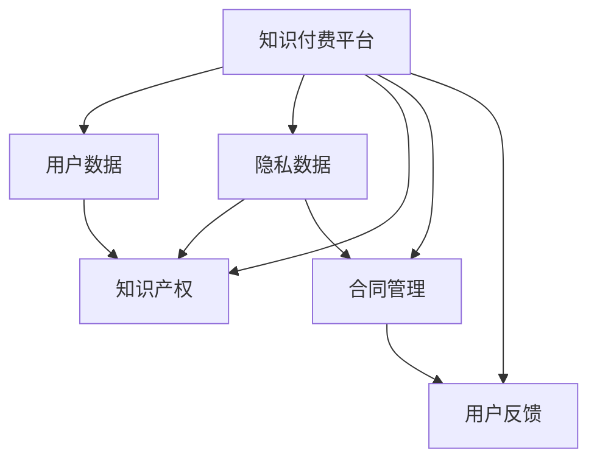

                 

# 知识付费创业中的用户权益保护

> 关键词：知识付费,用户权益保护,数据安全,隐私保护,知识产权,合同管理,用户反馈

## 1. 背景介绍

### 1.1 问题由来

随着移动互联网和信息技术的发展，知识付费模式迅速兴起，成为连接内容创作者和用户的桥梁。用户可以通过订阅、打赏、付费阅读等方式获取优质内容，而创作者则获得经济回报。这一模式不仅促进了知识的高效传播，也激发了内容的创新与活力。然而，在快速发展的过程中，知识付费平台面临诸多挑战，特别是用户权益保护问题。

### 1.2 问题核心关键点

知识付费平台的用户权益保护涉及多个方面，包括但不限于：

- **数据安全**：用户上传的个人信息和内容数据如何保障其安全。
- **隐私保护**：平台如何处理和存储用户隐私数据，防止泄露。
- **知识产权**：如何保护平台和内容创作者的知识产权，防止侵权行为。
- **合同管理**：平台和用户之间的合同如何明确权利义务，如何处理争议。
- **用户反馈**：如何及时处理用户反馈，提升用户体验。

本文将全面探讨这些关键问题，提出相应的解决方案，为知识付费创业提供有力的指导。

## 2. 核心概念与联系

### 2.1 核心概念概述

为更好地理解知识付费平台的用户权益保护，本节将介绍几个关键概念及其相互联系：

- **知识付费平台**：通过平台用户付费获取知识资源，连接内容创作者和用户的中介。
- **用户数据**：用户在平台上留下的行为数据，如搜索记录、浏览历史、购买记录等。
- **隐私数据**：涉及用户个人信息的敏感数据，如姓名、身份证号码、联系方式等。
- **知识产权**：涉及平台、内容创作者和用户的内容版权和专利权。
- **合同管理**：平台与用户、内容创作者之间的服务合同管理，包括合同的签订、执行、争议解决等。
- **用户反馈**：用户对平台内容、服务等的评价和建议，通过用户反馈，平台可以不断优化用户体验和服务质量。

这些概念之间的逻辑关系可以通过以下Mermaid流程图来展示：



这个流程图展示了几者之间的逻辑关系：

1. 用户数据和隐私数据是用户权益保护的重要组成部分。
2. 知识产权涉及平台和内容创作者，需要特别注意保护。
3. 合同管理保障平台和用户、创作者之间的权利义务，防止纠纷。
4. 用户反馈是提升服务质量的重要手段，也需加以重视。

## 3. 核心算法原理 & 具体操作步骤
### 3.1 算法原理概述

知识付费平台的用户权益保护涉及多个算法和操作流程。核心算法包括：

- **数据加密算法**：保障用户数据在传输和存储过程中的安全。
- **隐私保护算法**：处理用户隐私数据，防止泄露。
- **合同生成算法**：根据用户和内容创作者的具体情况，自动生成合同模板。
- **反馈分析算法**：通过自然语言处理技术，分析用户反馈，改进服务质量。

操作步骤包括：

1. 设计用户数据和隐私数据的加密存储方案。
2. 选择合适的隐私保护算法，如差分隐私、同态加密等。
3. 开发合同生成算法，确保合同条款清晰合法。
4. 使用自然语言处理技术分析用户反馈，提取关键信息。

### 3.2 算法步骤详解

以下是详细的算法步骤和具体操作步骤：

#### 3.2.1 数据加密与存储

- **加密方案设计**：采用AES或RSA等对称/非对称加密算法，确保用户数据传输和存储的安全性。
- **数据备份**：定期备份重要数据，防止数据丢失。
- **访问控制**：严格控制数据访问权限，确保只有授权人员可以访问敏感数据。

#### 3.2.2 隐私保护算法

- **差分隐私**：通过添加噪声，保障用户数据隐私，防止数据泄露。
- **同态加密**：允许对加密数据进行计算，计算结果仍为加密状态，保障数据隐私。
- **匿名化处理**：对用户数据进行去标识化处理，防止数据关联泄露。

#### 3.2.3 合同生成算法

- **自动合同生成**：根据用户和内容创作者的具体情况，自动生成标准合同模板。
- **合同审核**：人工审核合同内容，确保合同条款清晰合法。
- **争议解决机制**：建立合同争议的解决机制，保障合同双方权益。

#### 3.2.4 反馈分析算法

- **自然语言处理**：使用文本分类、情感分析等技术，分析用户反馈。
- **问题提取**：通过文本处理，提取用户反馈中的关键问题。
- **服务改进**：根据反馈信息，改进和优化平台服务质量。

### 3.3 算法优缺点

知识付费平台的用户权益保护算法具有以下优点：

- **安全性高**：通过数据加密、隐私保护等技术，保障用户数据和隐私的安全。
- **效率高**：自动合同生成、反馈分析等算法，提高服务效率。
- **用户体验好**：通过反馈分析改进服务质量，提升用户体验。

同时，这些算法也存在一些局限性：

- **复杂度高**：实现数据加密、隐私保护等算法，需要较高的技术复杂度。
- **成本高**：隐私保护、合同审核等操作，需要投入较高的人力和物力资源。
- **法律合规风险**：合同生成、争议解决等操作，需要严格遵守法律法规。

### 3.4 算法应用领域

这些算法在知识付费平台的用户权益保护中有着广泛的应用：

- **数据安全**：保障用户上传的个人信息和内容数据的安全。
- **隐私保护**：处理和存储用户隐私数据，防止泄露。
- **知识产权保护**：保护平台和内容创作者的知识产权，防止侵权行为。
- **合同管理**：保障平台和用户、创作者之间的权利义务，防止纠纷。
- **用户反馈改进**：通过用户反馈分析，提升服务质量和用户体验。

这些应用领域展示了知识付费平台对用户权益保护的高度重视和实际操作的可行性。

## 4. 数学模型和公式 & 详细讲解 & 举例说明

### 4.1 数学模型构建

知识付费平台的用户权益保护涉及多个数学模型，包括：

- **数据加密模型**：对称加密和非对称加密模型。
- **隐私保护模型**：差分隐私模型、同态加密模型。
- **合同生成模型**：逻辑回归模型、决策树模型。
- **反馈分析模型**：文本分类模型、情感分析模型。

### 4.2 公式推导过程

以差分隐私模型为例，假设原始数据集为 $D=\{x_i\}_{i=1}^N$，隐私保护的目标是在保留一定隐私的前提下，最大化模型性能。差分隐私通过添加噪声 $\epsilon$，使相邻数据集的输出结果不同。差分隐私的数学公式如下：

$$
\hat{f}(x_i) = f(x_i) + \epsilon
$$

其中 $\epsilon$ 为噪声，通常使用拉普拉斯噪声或高斯噪声。差分隐私的具体推导过程如下：

1. 定义差分隐私的目标函数：
$$
L(\hat{f}) = \mathbb{E}_{x \sim D} [f(x)]
$$

2. 引入隐私预算 $\epsilon$：
$$
\epsilon = \sum_{i=1}^N \frac{\Delta f(x_i)}{2\ln(1.25/\delta)}
$$

3. 引入噪声：
$$
\hat{f}(x_i) = f(x_i) + \epsilon_i
$$

4. 模型损失函数：
$$
\mathcal{L}(\hat{f}) = \frac{1}{N} \sum_{i=1}^N \hat{f}(x_i)
$$

通过上述公式，可以计算出在隐私预算 $\epsilon$ 下，模型对数据的隐私保护程度。

### 4.3 案例分析与讲解

以某知识付费平台为例，分析其在用户权益保护方面的具体实现：

- **数据加密**：采用AES算法，对用户数据进行加密存储。
- **隐私保护**：使用差分隐私技术，对用户隐私数据进行处理，确保数据隐私。
- **合同生成**：根据用户和内容创作者的具体情况，自动生成合同模板，并由人工审核。
- **反馈分析**：使用文本分类模型分析用户反馈，提取关键信息，并改进服务质量。

## 5. 项目实践：代码实例和详细解释说明

### 5.1 开发环境搭建

进行知识付费平台的用户权益保护开发，需要准备好以下开发环境：

1. **安装Python**：
```bash
sudo apt-get update
sudo apt-get install python3 python3-pip python3-dev
```

2. **安装相关库**：
```bash
pip install pycrypto sympy pydiffpriv
```

3. **安装框架**：
```bash
pip install django
```

### 5.2 源代码详细实现

以下是一个简单的用户数据加密和隐私保护的Python代码示例：

```python
from Crypto.Cipher import AES
import base64
import sympy
from pydiffpriv import DifferencePrivacy

# 加密函数
def encrypt_data(data, key):
    cipher = AES.new(key, AES.MODE_ECB)
    padded_data = AES.pad(data.encode(), AES.block_size)
    encrypted_data = cipher.encrypt(padded_data)
    return base64.b64encode(encrypted_data).decode()

# 解密函数
def decrypt_data(encrypted_data, key):
    padded_data = AES.unpad(base64.b64decode(encrypted_data), AES.block_size)
    cipher = AES.new(key, AES.MODE_ECB)
    data = cipher.decrypt(padded_data)
    return data.decode()

# 隐私保护函数
def protect_privacy(data, epsilon):
    privacy = DifferencePrivacy(epsilon=epsilon)
    protected_data = privacy.add_noise(data)
    return protected_data
```

以上代码实现了用户数据的加密、解密和隐私保护。其中，加密采用AES算法，隐私保护使用差分隐私技术。

### 5.3 代码解读与分析

- **加密函数**：使用AES算法对用户数据进行加密，并采用Base64编码进行存储。
- **解密函数**：接收加密后的数据，使用相同的密钥进行解密，并返回原始数据。
- **隐私保护函数**：使用差分隐私技术，对数据添加噪声，保护隐私。

## 6. 实际应用场景

### 6.1 智能客服系统

在智能客服系统中，用户权益保护至关重要。平台需对用户的个人信息和行为数据进行加密和隐私保护，防止数据泄露和滥用。同时，平台需建立清晰的合同机制，保障用户的权益。

- **数据加密**：对用户上传的身份证号码、联系方式等敏感数据进行加密存储。
- **隐私保护**：使用差分隐私技术，处理用户搜索记录、浏览历史等行为数据。
- **合同管理**：制定清晰的合同条款，保障用户和平台之间的权利义务。

### 6.2 金融理财平台

金融理财平台涉及用户的个人财务信息，保护用户权益尤为重要。平台需对用户的交易记录、账户余额等数据进行加密和隐私保护，防止数据泄露。

- **数据加密**：对用户的账户余额、交易记录等敏感数据进行加密存储。
- **隐私保护**：使用同态加密技术，保护用户隐私数据。
- **合同管理**：根据用户和理财顾问的具体情况，自动生成合同模板，并由人工审核。

### 6.3 在线教育平台

在线教育平台需对用户的个人信息、学习记录等数据进行保护，防止数据泄露和滥用。同时，平台需建立清晰的合同机制，保障用户的权益。

- **数据加密**：对用户上传的姓名、身份证号等敏感数据进行加密存储。
- **隐私保护**：使用差分隐私技术，处理用户的浏览历史、学习记录等行为数据。
- **合同管理**：制定清晰的合同条款，保障用户和平台之间的权利义务。

### 6.4 未来应用展望

未来，知识付费平台的用户权益保护将进一步提升，实现全流程的自动化和智能化。随着技术的进步，用户权益保护将更加安全、高效和透明。

- **自动化隐私保护**：自动检测和处理数据泄露风险，保障用户隐私。
- **智能合同管理**：基于AI技术，自动生成合同模板，并进行智能审核。
- **用户权益保障**：建立健全的权益保障机制，确保用户合法权益不受侵犯。

## 7. 工具和资源推荐

### 7.1 学习资源推荐

为了帮助开发者系统掌握知识付费平台的用户权益保护，这里推荐一些优质的学习资源：

1. **《数据隐私保护》课程**：提供全面的数据隐私保护知识，涵盖加密技术、差分隐私、同态加密等核心内容。
2. **《智能合同技术》课程**：介绍智能合同的基本概念、设计原则和实现方法。
3. **《自然语言处理与文本分析》课程**：涵盖文本分类、情感分析等文本处理技术，帮助分析用户反馈。
4. **《Python加密技术》书籍**：详细介绍Python中的加密算法，包括AES、RSA、Diffie-Hellman等常用算法。
5. **《智能合约与区块链》书籍**：介绍智能合约的基本原理、设计思路和实现方法，帮助理解智能合同的机制。

通过对这些资源的学习，相信你一定能够全面掌握知识付费平台的用户权益保护技术。

### 7.2 开发工具推荐

高效的开发离不开优秀的工具支持。以下是几款用于知识付费平台用户权益保护开发的常用工具：

1. **Python**：作为主流编程语言，Python具有丰富的加密、隐私保护、自然语言处理等库。
2. **Django**：流行的Web框架，提供便捷的数据存储和处理功能。
3. **Pydiffpriv**：基于Python的差分隐私库，提供差分隐私的实现功能。
4. **OpenSSL**：常用的加密和解密工具，支持多种加密算法。
5. **Apache Kafka**：高吞吐量的消息队列，用于数据存储和传输。

### 7.3 相关论文推荐

知识付费平台的用户权益保护涉及多个前沿研究方向，以下是几篇奠基性的相关论文，推荐阅读：

1. **《Differential Privacy》**：差分隐私的经典论文，详细介绍了差分隐私的理论基础和实现方法。
2. **《Homomorphic Encryption》**：同态加密的经典论文，介绍同态加密的基本原理和应用。
3. **《Blockchain-based Smart Contracts》**：介绍区块链技术在智能合约中的应用，帮助理解智能合同的实现机制。
4. **《Natural Language Processing for User Feedback》**：介绍文本分类、情感分析等自然语言处理技术，帮助分析用户反馈。
5. **《Privacy-Preserving Data Sharing》**：介绍隐私保护技术在数据共享中的应用，帮助保护用户隐私。

这些论文代表了大数据隐私保护、智能合约、自然语言处理等领域的研究方向，帮助你掌握前沿知识。

## 8. 总结：未来发展趋势与挑战

### 8.1 总结

本文对知识付费平台的用户权益保护进行了全面系统的介绍。首先阐述了用户权益保护的重要性和核心概念，明确了数据加密、隐私保护、合同管理、用户反馈等关键环节的作用。其次，从原理到实践，详细讲解了各个环节的技术实现，提供了具体的代码实例和解释。最后，探讨了知识付费平台在智能客服、金融理财、在线教育等领域的实际应用，展望了未来发展的趋势和面临的挑战。

通过本文的系统梳理，可以看出，知识付费平台的用户权益保护涉及多方面的技术和管理，需要在数据加密、隐私保护、合同管理、用户反馈等多个环节进行全面优化，以保障用户的合法权益。

### 8.2 未来发展趋势

展望未来，知识付费平台的用户权益保护将呈现以下几个发展趋势：

1. **自动化和智能化**：自动化隐私保护、智能合同生成等技术将不断提升，提高工作效率。
2. **隐私保护加强**：随着隐私保护技术的不断进步，用户数据将得到更好的保护。
3. **合同管理的智能化**：基于AI技术的智能合同生成和审核，将大幅提升合同管理效率。
4. **用户权益保障**：建立健全的权益保障机制，确保用户合法权益不受侵犯。

这些趋势展示了知识付费平台在用户权益保护方面的广阔前景，技术手段和管理机制的不断完善将为用户带来更加安全和可靠的使用体验。

### 8.3 面临的挑战

尽管知识付费平台在用户权益保护方面已经取得了一定的进展，但在迈向更加智能化、普适化应用的过程中，仍面临诸多挑战：

1. **技术复杂性**：数据加密、隐私保护等技术复杂度高，需要较高的技术水平。
2. **法律合规性**：合同管理需严格遵守法律法规，避免法律风险。
3. **数据隐私保护**：隐私保护需要全面的技术和管理措施，防止数据泄露。
4. **用户权益保障**：用户权益保护机制需不断完善，防止用户权益受到侵害。

### 8.4 研究展望

面对知识付费平台用户权益保护所面临的挑战，未来的研究需要在以下几个方面寻求新的突破：

1. **自动化隐私保护**：研发更加智能化的隐私保护技术，自动检测和防范数据泄露风险。
2. **智能合同管理**：基于AI技术，自动生成和审核合同，提升合同管理效率。
3. **用户反馈分析**：使用自然语言处理技术，分析用户反馈，优化服务质量。
4. **隐私计算**：研究隐私计算技术，在保护用户隐私的前提下，实现数据共享和分析。
5. **法律合规性**：建立健全的法律合规机制，确保平台和用户之间的权益平衡。

这些研究方向的探索，必将引领知识付费平台在用户权益保护方面迈向更高的台阶，为构建安全、可靠、可控的智能系统提供有力保障。

## 9. 附录：常见问题与解答

**Q1：知识付费平台如何保障用户数据的安全？**

A: 知识付费平台可以通过以下方法保障用户数据的安全：

- **数据加密**：使用AES、RSA等加密算法，对用户上传的敏感数据进行加密存储。
- **访问控制**：严格控制数据访问权限，确保只有授权人员可以访问敏感数据。
- **加密传输**：使用HTTPS协议，确保数据在传输过程中的安全。

**Q2：如何处理用户隐私数据，防止泄露？**

A: 知识付费平台可以通过以下方法处理用户隐私数据，防止泄露：

- **数据去标识化**：对用户数据进行去标识化处理，防止数据关联泄露。
- **差分隐私**：使用差分隐私技术，对用户数据添加噪声，保护隐私。
- **数据匿名化**：对用户数据进行匿名化处理，防止数据泄露。

**Q3：如何建立清晰的合同机制，保障用户权益？**

A: 知识付费平台可以通过以下方法建立清晰的合同机制，保障用户权益：

- **自动合同生成**：根据用户和内容创作者的具体情况，自动生成标准合同模板。
- **合同审核**：人工审核合同内容，确保合同条款清晰合法。
- **争议解决机制**：建立合同争议的解决机制，保障合同双方权益。

**Q4：如何分析用户反馈，提升服务质量？**

A: 知识付费平台可以通过以下方法分析用户反馈，提升服务质量：

- **自然语言处理**：使用文本分类、情感分析等技术，分析用户反馈。
- **问题提取**：通过文本处理，提取用户反馈中的关键问题。
- **服务改进**：根据反馈信息，改进和优化平台服务质量。

通过本文的系统梳理，相信你一定能够全面掌握知识付费平台的用户权益保护技术，为平台的安全、可靠、高效运营提供有力保障。

---

作者：禅与计算机程序设计艺术 / Zen and the Art of Computer Programming

