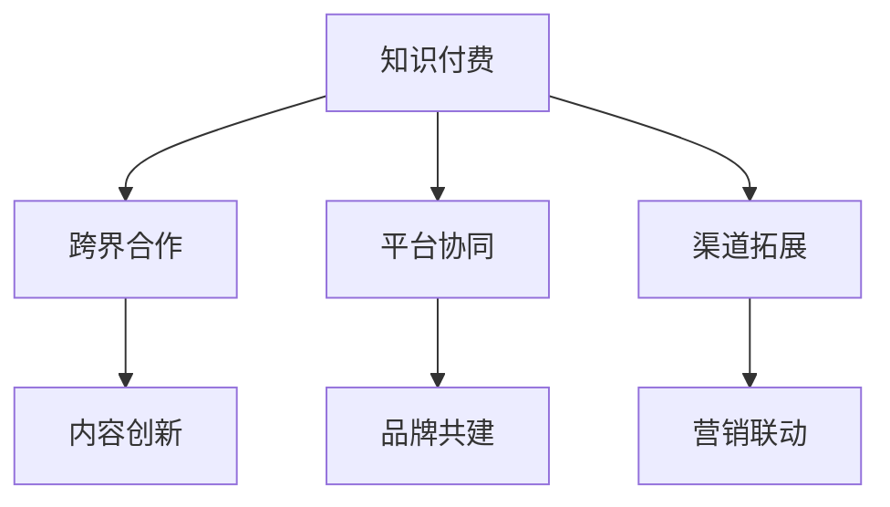

                 

# 知识付费创业中的跨界合作机会

## 1. 背景介绍

### 1.1 问题由来

随着互联网和移动设备的普及，知识付费领域迎来了前所未有的发展机遇。越来越多的用户愿意为高质量的知识内容付费，逐步培养起了一种付费获取优质知识的习惯。从书籍、课程、视频，到音频、专栏、直播，各种形式的付费内容迅速扩张，成为互联网经济的重要组成部分。

然而，尽管知识付费市场蓬勃发展，仍然面临着内容同质化严重、平台竞争激烈、用户留存率低、价格敏感度高、盈利模式单一等挑战。如何打破现有行业困境，拓展知识付费的蓝海市场，成为摆在创业者面前的重要课题。

### 1.2 问题核心关键点

在知识付费创业的征程中，如何寻找到跨界合作的机会，形成多方共赢的合作模式，是关键所在。根据市场调研和行业洞察，以下几点是创业者和投资者在考虑跨界合作时应当重点关注的焦点：

1. **内容创新**：通过跨界合作，引入不同领域的内容和资源，创造出既有深度又有趣味性的新知识产品。

2. **平台协同**：与多个平台建立合作关系，实现内容、用户和资源的互惠互利。

3. **品牌共建**：通过跨界合作提升品牌影响力，建立用户信任，吸引更多用户和流量。

4. **渠道拓展**：拓宽知识内容的传播渠道，增加用户获取知识的途径。

5. **营销联动**：整合营销资源，提升品牌曝光率和市场竞争力。

## 2. 核心概念与联系

### 2.1 核心概念概述

以下是几个核心概念及其相互关系的简要概述：

1. **知识付费**：通过付费方式获取高价值知识内容。形式包括在线课程、图书、音频、视频、直播等。

2. **跨界合作**：不同领域的企业或平台之间进行深度合作，共享资源，共同开发新市场。

3. **内容创新**：结合不同领域专家的知识和经验，创新内容形式，提升用户黏性和满意度。

4. **平台协同**：通过合作机制，实现内容、用户、流量的共享和优化。

5. **品牌共建**：通过合作提升品牌知名度，增加用户信任度。

6. **渠道拓展**：拓宽知识内容传播渠道，扩大用户覆盖范围。

7. **营销联动**：整合营销资源，提升品牌曝光率和市场竞争力。

这些概念通过以下Mermaid流程图直观展示：



## 3. 核心算法原理 & 具体操作步骤

### 3.1 算法原理概述

跨界合作的本质在于资源共享和协同创新，其核心在于如何设计一个合理的利益分配机制和合作模式。

#### 3.1.1 模式设计

- **内容共享模式**：平台之间共享优质内容资源，如课程、书籍、视频等，提升内容丰富度。
- **用户共享模式**：平台之间互认用户账号和会员体系，实现用户互通，提升用户黏性。
- **营销合作模式**：共同策划营销活动，利用对方平台的用户和渠道资源，提升品牌曝光率。
- **技术合作模式**：共享技术和开发资源，实现业务流程的优化和自动化。

#### 3.1.2 利益分配

- **内容分成**：根据内容质量、用户访问量等指标，分配收益。
- **用户奖励**：采用积分、优惠券、会员特权等方式，激励用户参与合作平台。
- **品牌曝光**：通过交叉推广、联合营销等手段，提升品牌知名度。
- **市场份额**：根据市场表现和用户反馈，分配市场份额和资源。

### 3.2 算法步骤详解

#### 3.2.1 需求调研

- **目标分析**：明确合作双方的需求和目标，评估合作的潜在价值。
- **资源评估**：评估双方可提供的资源，如内容、技术、用户等。

#### 3.2.2 模式设计

- **内容合作**：确定合作内容的范围和形式，如课程、书籍、视频等。
- **用户合作**：确定用户互通的方式和机制，如账户互认、会员互认等。
- **营销合作**：确定联合营销的策略和手段，如联合广告、交叉推广等。
- **技术合作**：确定技术共享的方式，如API接口、云服务、数据共享等。

#### 3.2.3 利益分配

- **内容分成**：制定内容分成的规则和标准，如收益比例、分成周期等。
- **用户奖励**：设计用户奖励方案，提升用户参与度。
- **品牌曝光**：制定品牌曝光计划，提升品牌知名度。
- **市场份额**：评估市场份额分配，优化资源配置。

### 3.3 算法优缺点

#### 3.3.1 优点

- **资源互补**：通过跨界合作，各方能共享资源，弥补自身不足。
- **风险分担**：合作能够分散风险，降低单方投资和运营压力。
- **市场拓展**：通过合作能够快速进入新市场，扩大用户覆盖范围。
- **技术提升**：通过技术共享，提升整体技术水平和业务流程效率。

#### 3.3.2 缺点

- **合作复杂**：跨界合作需要协调多个方的需求和资源，操作复杂。
- **利益冲突**：利益分配不当可能导致合作双方产生冲突，影响合作效果。
- **执行难度**：合作涉及多方协调和资源整合，执行难度较大。

### 3.4 算法应用领域

跨界合作在知识付费领域有广泛的应用场景，主要包括以下几个方面：

1. **内容创新**：平台之间合作开发新课程、新书籍等，提升内容多样性和吸引力。
2. **用户互认**：通过平台间的用户互通，提升用户黏性和满意度。
3. **市场拓展**：利用多平台的用户和渠道资源，扩大市场覆盖范围。
4. **营销联动**：通过联合营销活动，提升品牌知名度和市场竞争力。
5. **技术合作**：共享技术资源，提升业务流程效率和用户体验。

## 4. 数学模型和公式 & 详细讲解 & 举例说明

### 4.1 数学模型构建

跨界合作的数学模型构建主要包括以下几个要素：

- **收益模型**：定义各方收益的计算方式，如分成比例、奖励标准等。
- **成本模型**：定义各方的成本支出，如内容开发成本、技术开发成本等。
- **风险模型**：定义各方承担的风险比例，如市场风险、技术风险等。
- **用户模型**：定义用户行为和反馈的计算方式，如访问量、互动率等。

### 4.2 公式推导过程

#### 4.2.1 收益模型推导

设内容A和内容B的收益分别为R_A和R_B，分成比例分别为r_A和r_B，则收益分配公式为：

$$ R = R_A \times r_A + R_B \times r_B $$

#### 4.2.2 成本模型推导

设内容A和内容B的成本分别为C_A和C_B，则总成本公式为：

$$ C = C_A + C_B $$

#### 4.2.3 风险模型推导

设内容A和内容B的风险分别为Risk_A和Risk_B，风险分配比例为p，则风险分配公式为：

$$ Risk = Risk_A \times p + Risk_B \times (1 - p) $$

#### 4.2.4 用户模型推导

设内容A和内容B的访问量分别为V_A和V_B，互动率为I，则用户模型为：

$$ User = V_A + V_B $$

### 4.3 案例分析与讲解

#### 4.3.1 内容创新案例

如网易云课堂和腾讯课堂合作开发新课程，网易云提供优质视频内容，腾讯提供用户体验优化技术，双方按分成比例分配收益。

#### 4.3.2 用户互认案例

如得到App和喜马拉雅合作，用户通过喜马拉雅账户登录得到App，享受VIP会员特权，喜马拉雅平台则通过得到App进行品牌推广。

#### 4.3.3 市场拓展案例

如知乎和B站合作，知乎提供专业知识内容，B站提供流量资源，双方共同推广新课程，拓展知识付费市场。

#### 4.3.4 技术合作案例

如学习宝和百度合作，学习宝提供个性化学习方案，百度提供AI技术和搜索推荐服务，提升整体用户体验。

## 5. 项目实践：代码实例和详细解释说明

### 5.1 开发环境搭建

#### 5.1.1 安装必要的开发环境

1. **Python环境**：使用Anaconda或Miniconda安装Python 3.8及以上版本。
2. **数据库环境**：安装MySQL或PostgreSQL数据库，用于存储用户数据和内容信息。
3. **Web框架**：使用Flask或Django搭建Web服务，实现平台间的用户互通和内容共享。
4. **API接口**：使用RESTful接口，方便平台间的数据交换和调用。

#### 5.1.2 安装必要的库和工具

1. **Web开发库**：安装Flask或Django，用于搭建Web平台。
2. **数据库驱动**：安装PyMySQL或psycopg2，用于与数据库交互。
3. **API库**：安装Flask-RESTful或Django-rest-framework，用于实现API接口。
4. **用户管理库**：安装Flask-Login或Django-User，用于用户管理和认证。

### 5.2 源代码详细实现

#### 5.2.1 用户互认功能

```python
from flask import Flask, request
from flask_login import LoginManager, UserMixin
from models import User, db
from utils import get_user_info

app = Flask(__name__)
login_manager = LoginManager()
login_manager.init_app(app)
login_manager.login_view = 'login'

@login_manager.user_loader
def load_user(user_id):
    return User.get(user_id)

@app.route('/login', methods=['POST'])
def login():
    user_id = request.json.get('user_id')
    user_info = get_user_info(user_id)
    current_user = User.create(user_info)
    current_user.save()
    return jsonify(user_info)

@app.route('/logout')
def logout():
    current_user.logout()
    return jsonify({'success': True})

@app.route('/user_info')
def get_user_info():
    current_user = current_user.get_current_user()
    user_info = current_user.get_info()
    return jsonify(user_info)

if __name__ == '__main__':
    app.run(debug=True)
```

#### 5.2.2 内容共享功能

```python
from flask import Flask, request, jsonify
from models import Content, db

app = Flask(__name__)

@app.route('/content', methods=['POST'])
def create_content():
    content = request.json.get('content')
    user_id = request.json.get('user_id')
    author = request.json.get('author')
    title = request.json.get('title')
    category = request.json.get('category')
    content = Content(content, user_id, author, title, category)
    content.save()
    return jsonify({'success': True})

@app.route('/content', methods=['GET'])
def get_content():
    content_id = request.args.get('content_id')
    content = Content.get(content_id)
    return jsonify(content.to_dict())

if __name__ == '__main__':
    app.run(debug=True)
```

### 5.3 代码解读与分析

#### 5.3.1 用户互认功能

1. **登录接口**：使用Flask-Login实现用户认证，用户通过用户名密码登录后，系统会生成一个session ID，用于标识用户身份。
2. **用户信息接口**：根据session ID获取当前用户信息，包括用户名、头像、积分等。
3. **登出接口**：使用Flask-Login的logout方法，结束用户session，释放资源。

#### 5.3.2 内容共享功能

1. **内容创建接口**：接收用户ID、作者、标题、类别等信息，创建新内容并保存到数据库。
2. **内容获取接口**：根据内容ID获取具体内容，包括标题、作者、类别等信息。

### 5.4 运行结果展示

运行上述代码后，用户可以通过登录接口登录，并通过用户信息接口获取当前用户的信息。同时，内容创建接口可用于创建新内容，内容获取接口可用于获取具体内容信息。

## 6. 实际应用场景

### 6.1 智能教育

跨界合作在智能教育领域有广泛的应用场景，主要包括以下几个方面：

1. **内容创新**：教育平台与科技公司合作，开发新的教育内容和工具，提升教学效果。
2. **用户互认**：教育平台与社交媒体平台合作，实现用户互通，提升用户黏性。
3. **市场拓展**：教育平台与知名专家合作，共同推广新课程，扩大用户覆盖范围。
4. **技术合作**：教育平台与AI公司合作，实现智能推荐和个性化学习方案。

### 6.2 医疗健康

跨界合作在医疗健康领域也有广泛的应用场景，主要包括以下几个方面：

1. **内容创新**：医疗平台与知名专家合作，开发新的健康知识内容和课程，提升用户健康水平。
2. **用户互认**：医疗平台与社交媒体平台合作，实现用户互通，提升用户黏性。
3. **市场拓展**：医疗平台与知名医院合作，共同推广新课程，扩大用户覆盖范围。
4. **技术合作**：医疗平台与AI公司合作，实现智能诊断和个性化治疗方案。

### 6.3 企业培训

跨界合作在企业培训领域也有广泛的应用场景，主要包括以下几个方面：

1. **内容创新**：企业培训平台与知名培训公司合作，开发新的培训课程和内容，提升员工技能水平。
2. **用户互认**：企业培训平台与社交媒体平台合作，实现用户互通，提升用户黏性。
3. **市场拓展**：企业培训平台与知名企业合作，共同推广新课程，扩大用户覆盖范围。
4. **技术合作**：企业培训平台与AI公司合作，实现智能推荐和个性化培训方案。

### 6.4 未来应用展望

随着知识付费市场的进一步发展，跨界合作模式将得到更广泛的应用，带来更多新的机会和挑战。

#### 6.4.1 更多应用场景

跨界合作将拓展到更多领域，如金融、旅游、地产等，形成多样化的合作模式和业务形态。

#### 6.4.2 更高市场价值

跨界合作将提升整体市场价值，通过多方资源整合，形成更大的市场竞争优势。

#### 6.4.3 更多创新模式

跨界合作将带来更多创新的业务模式和盈利方式，提升整体行业效率和竞争力。

#### 6.4.4 更广用户覆盖

跨界合作将扩大用户覆盖范围，提升市场渗透率和用户黏性。

#### 6.4.5 更多技术融合

跨界合作将带来更多技术的融合和创新，提升整体技术水平和业务效率。

## 7. 工具和资源推荐

### 7.1 学习资源推荐

#### 7.1.1 在线课程

1. **《知识付费创业指南》**：全面系统地介绍知识付费创业的各个方面，从市场需求、模式设计到执行策略。
2. **《跨界合作之道》**：介绍跨界合作的成功案例和模式创新，提供实际的借鉴和启示。

#### 7.1.2 书籍

1. **《知识付费：从1到N的创新之路》**：深入探讨知识付费的创新模式和运营策略。
2. **《跨界合作：开启商业增长新引擎》**：详细解析跨界合作的商业价值和实操技巧。

#### 7.1.3 博客和文章

1. **《知识付费创业的成功要素》**：全面剖析知识付费创业成功的关键要素和经验。
2. **《跨界合作中的协同效应》**：分析跨界合作的协同效应和实际案例。

### 7.2 开发工具推荐

#### 7.2.1 开发环境

1. **Anaconda**：提供Python的第三方包管理，方便安装和管理开发工具。
2. **Jupyter Notebook**：提供交互式编程环境，方便调试和测试代码。
3. **MySQL**：提供关系型数据库，用于存储用户数据和内容信息。

#### 7.2.2 开发库和工具

1. **Flask**：轻量级Web框架，方便搭建Web平台。
2. **RESTful API**：提供RESTful接口，方便平台间的数据交换和调用。
3. **Flask-Login**：提供用户认证功能，方便用户管理。

### 7.3 相关论文推荐

#### 7.3.1 跨界合作

1. **《跨界合作的商业价值评估》**：分析跨界合作的商业价值，提出评估方法。
2. **《跨界合作的战略选择与实施》**：探讨跨界合作的战略选择和实施策略。

## 8. 总结：未来发展趋势与挑战

### 8.1 研究成果总结

跨界合作在知识付费领域具有重要的应用价值，通过资源共享和协同创新，能够提升整体市场价值和竞争力。然而，跨界合作也面临着诸多挑战，需要多方协同解决。

### 8.2 未来发展趋势

随着知识付费市场的进一步发展，跨界合作模式将得到更广泛的应用，带来更多新的机会和挑战。

#### 8.2.1 更多应用场景

跨界合作将拓展到更多领域，如金融、旅游、地产等，形成多样化的合作模式和业务形态。

#### 8.2.2 更高市场价值

跨界合作将提升整体市场价值，通过多方资源整合，形成更大的市场竞争优势。

#### 8.2.3 更多创新模式

跨界合作将带来更多创新的业务模式和盈利方式，提升整体行业效率和竞争力。

#### 8.2.4 更广用户覆盖

跨界合作将扩大用户覆盖范围，提升市场渗透率和用户黏性。

#### 8.2.5 更多技术融合

跨界合作将带来更多技术的融合和创新，提升整体技术水平和业务效率。

### 8.3 面临的挑战

尽管跨界合作在知识付费领域具有重要的应用价值，但也面临诸多挑战，需要多方协同解决。

#### 8.3.1 合作复杂性

跨界合作涉及多方协调和资源整合，操作复杂，需要高效的沟通和协调机制。

#### 8.3.2 利益分配难题

利益分配不当可能导致合作双方产生冲突，影响合作效果。

#### 8.3.3 执行难度

跨界合作需要多方协同，涉及资源调配、技术集成等多方面工作，执行难度较大。

#### 8.3.4 市场风险

跨界合作面临市场风险，需要评估和规避潜在风险，确保合作顺利进行。

#### 8.3.5 用户信任

跨界合作需要建立用户信任，提升用户黏性，需要长期的积累和维护。

### 8.4 研究展望

未来，跨界合作将面临更多的挑战和机遇，需要在多个方面进行持续的研究和探索。

#### 8.4.1 创新合作模式

探索更多创新合作模式，如技术合作、市场合作等，提升合作效果。

#### 8.4.2 优化利益分配

优化利益分配机制，建立公平合理的利益分配体系，确保各方利益。

#### 8.4.3 提升技术能力

提升技术能力和水平，推动技术创新和应用。

#### 8.4.4 强化用户管理

强化用户管理和维护，提升用户黏性和满意度。

#### 8.4.5 保障市场安全

保障市场安全和稳定，确保合作顺利进行。

总之，跨界合作在知识付费领域具有广阔的发展前景，需要各方共同努力，克服挑战，实现多方共赢。只有不断地创新和探索，才能推动知识付费领域向更高层次发展，为知识付费市场带来更多新的机遇和价值。

## 9. 附录：常见问题与解答

### 9.1 问题1：如何选择合适的合作对象？

**答**：选择合作对象需要考虑多方面因素，如企业信誉、资源互补性、文化契合度等。可以进行市场调研和案例分析，选择最合适的合作伙伴。

### 9.2 问题2：如何进行利益分配？

**答**：利益分配需要根据各方贡献和资源，制定公平合理的分配方案。可以采用分成比例、奖励标准等方式，确保各方利益。

### 9.3 问题3：如何确保合作顺利进行？

**答**：确保合作顺利进行需要建立高效的沟通和协调机制，建立公平合理的利益分配体系，保障市场安全和稳定。同时需要强化用户管理和维护，提升用户黏性和满意度。

### 9.4 问题4：跨界合作有哪些潜在风险？

**答**：跨界合作面临市场风险、技术风险、利益冲突等潜在风险，需要提前评估和规避。同时需要建立应急预案，确保合作顺利进行。

### 9.5 问题5：如何评估合作效果？

**答**：可以通过用户反馈、市场数据、财务报表等方式评估合作效果。建立定期评估机制，及时调整和优化合作策略。

---

作者：禅与计算机程序设计艺术 / Zen and the Art of Computer Programming

