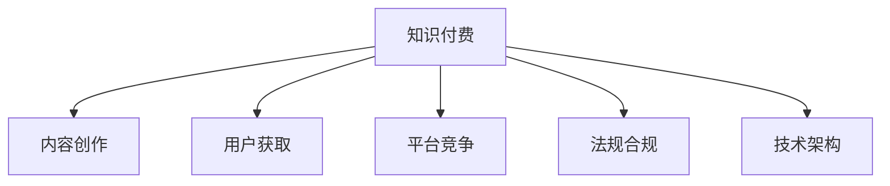

                 

# 知识付费创业中的风险管理

## 1. 背景介绍

### 1.1 问题由来

随着互联网技术的发展，知识付费市场迅速崛起，各类知识付费平台如雨后春笋般涌现。知识付费旨在通过知识变现，打破信息不对称，实现知识共享和价值交换。然而，知识付费创业并非易事，面临诸多风险。

1. 内容质量风险：内容质量是知识付费的核心，但高质量内容创作成本高、周期长，且易被抄袭。

2. 用户获取风险：获客成本高，用户留存率低，平台难以形成规模效应。

3. 竞争风险：市场竞争激烈，新进入者不断涌现，平台易被替代。

4. 监管风险：知识付费内容易涉及时效性、版权性等风险，法规监管严格。

5. 技术风险：平台技术架构复杂，易受攻击，数据安全需严格保障。

如何有效识别和应对这些风险，是知识付费创业成功的关键。本文将从内容质量、用户获取、竞争策略、法规合规、技术架构五个方面，探讨知识付费创业中的风险管理策略。

## 2. 核心概念与联系

### 2.1 核心概念概述

为更好地理解知识付费创业中的风险管理，本节将介绍几个密切相关的核心概念：

- **知识付费**：通过知识变现，将专业领域的知识转化为具有商业价值的平台或产品。
- **内容创作**：创作高质量、有价值的内容，是知识付费平台的核心。
- **用户获取与留存**：通过各种方式吸引用户注册并提升其活跃度，形成稳定的用户基础。
- **平台竞争**：知识付费市场竞争激烈，需制定合理竞争策略，提升竞争力。
- **法规合规**：知识付费平台需遵循相关法律法规，避免涉及时效性、版权性等风险。
- **技术架构**：搭建稳定的技术架构，保障数据安全，提升平台性能。

这些核心概念之间通过以下Mermaid流程图来展示：



该流程图展示了知识付费创业的关键环节，各环节之间紧密联系，共同决定平台的成败。

## 3. 核心算法原理 & 具体操作步骤

### 3.1 算法原理概述

知识付费创业中的风险管理，本质上是多维度风险的识别、评估和控制。其核心思想是通过定量分析和定性判断，确定关键风险点，制定应对策略，确保平台持续稳定运行。

形式化地，假设知识付费平台有$n$个关键风险$R_1, R_2, ..., R_n$，每个风险$R_i$由$p_i$个因子组成，风险影响程度为$W_i$。则平台整体风险$R$可表示为：

$$
R = \sum_{i=1}^n p_iW_i
$$

其中$p_i$和$W_i$可通过专家评估、数据统计等方法得到。目标是通过优化$p_i$和$W_i$，最小化整体风险$R$。

### 3.2 算法步骤详解

**Step 1: 风险识别**
- 建立全面的风险清单，涵盖内容、用户、竞争、法规、技术五个方面。
- 根据风险清单，组织专家和团队成员进行头脑风暴，识别潜在风险点。

**Step 2: 风险评估**
- 使用专家评估法、数据分析法等工具，对各风险点进行定量评估。
- 确定风险严重程度和发生概率，量化风险影响程度$W_i$。
- 结合实际数据和案例，调整$p_i$，确定各风险点的权重。

**Step 3: 风险控制**
- 根据风险评估结果，制定针对性的风险控制策略。
- 对于高风险项，采取严格监控、多重备份等措施。
- 对于低风险项，定期评估，适时调整策略。

**Step 4: 风险监控与调整**
- 建立风险监控系统，实时跟踪各风险点状态。
- 定期组织团队评估风险控制策略效果，调整策略。
- 根据风险变化，及时采取应对措施，确保平台稳定运行。

### 3.3 算法优缺点

知识付费创业中的风险管理方法具有以下优点：
1. 系统全面。通过多维度、多层次的风险识别和评估，确保风险管理的系统性和全面性。
2. 风险量化。通过定量分析和数据支持，使风险管理更科学、更精准。
3. 动态调整。风险管理策略可根据实际情况灵活调整，提升应变能力。
4. 团队协同。通过专家评估和团队讨论，结合多方智慧，制定更合理的策略。

同时，该方法也存在以下局限性：
1. 主观性强。专家评估和定量分析依赖于主观判断，可能导致评估结果偏颇。
2. 数据依赖。风险管理效果依赖于准确、全面的数据支持，数据不足时效果有限。
3. 实施复杂。风险管理需建立完整的监控系统，实施成本较高。
4. 动态变化。外部环境变化快，需持续监控和调整，工作量大。

尽管存在这些局限性，但就目前而言，基于多维度风险评估的风险管理方法仍是最主流的风险管理范式。未来相关研究的重点在于如何进一步提升风险评估的客观性和科学性，降低实施成本，增强风险管理的动态适应能力。

### 3.4 算法应用领域

知识付费创业中的风险管理方法，适用于各种知识付费平台，包括在线课程、电子书、咨询服务等。其主要应用领域包括：

1. **内容质量管理**：通过风险评估和控制，确保内容创作的规范性、创新性，避免低质量内容输出。

2. **用户获取与留存**：通过数据分析，识别潜在用户，制定有针对性的获客策略，提升用户黏性。

3. **平台竞争策略**：通过风险评估，了解市场动态，制定合理的竞争策略，提升平台市场份额。

4. **法规合规管理**：通过风险评估，了解法规变化，及时调整合规策略，避免法律风险。

5. **技术架构优化**：通过风险评估，识别技术瓶颈，优化架构，提升平台性能和安全性。

这些应用领域涵盖了知识付费平台运营的各个方面，展示了风险管理的重要性和实用性。

## 4. 数学模型和公式 & 详细讲解 & 举例说明

### 4.1 数学模型构建

本节将使用数学语言对知识付费创业中的风险管理过程进行更加严格的刻画。

假设知识付费平台面临$n$个风险$R_1, R_2, ..., R_n$，每个风险$R_i$由$p_i$个因子组成，风险影响程度为$W_i$。则平台整体风险$R$可表示为：

$$
R = \sum_{i=1}^n p_iW_i
$$

其中$p_i$和$W_i$可通过专家评估、数据统计等方法得到。

### 4.2 公式推导过程

以内容质量管理为例，假设内容质量风险由内容原创性、内容深度、内容时效性三个因子$p_1, p_2, p_3$组成，各因子风险影响程度分别为$W_1, W_2, W_3$。则内容质量风险$R_{content}$可表示为：

$$
R_{content} = p_1W_1 + p_2W_2 + p_3W_3
$$

其中$p_1 + p_2 + p_3 = 1$，表示各因子对内容质量风险的贡献比例。

### 4.3 案例分析与讲解

假设某知识付费平台面临以下内容质量风险：

- 内容原创性：$p_1 = 0.3, W_1 = 0.8$
- 内容深度：$p_2 = 0.4, W_2 = 0.6$
- 内容时效性：$p_3 = 0.3, W_3 = 0.5$

则整体内容质量风险$R_{content}$为：

$$
R_{content} = 0.3 \times 0.8 + 0.4 \times 0.6 + 0.3 \times 0.5 = 0.936
$$

通过风险评估，平台可制定相应的内容审核和提升策略，确保内容质量达到标准。

## 5. 项目实践：代码实例和详细解释说明

### 5.1 开发环境搭建

在进行风险管理项目实践前，我们需要准备好开发环境。以下是使用Python进行风险管理开发的简单环境配置流程：

1. 安装Anaconda：从官网下载并安装Anaconda，用于创建独立的Python环境。

2. 创建并激活虚拟环境：
```bash
conda create -n risk-management python=3.8 
conda activate risk-management
```

3. 安装Python依赖包：
```bash
pip install numpy pandas sklearn matplotlib seaborn scikit-learn pytorch torchtext
```

完成上述步骤后，即可在`risk-management`环境中开始风险管理项目实践。

### 5.2 源代码详细实现

以下是一个简单的Python代码实例，用于风险管理模型的训练和评估。

```python
import numpy as np
import pandas as pd
from sklearn.model_selection import train_test_split
from sklearn.metrics import mean_squared_error

# 准备数据
data = pd.read_csv('risk_data.csv')
X = data[['p1', 'p2', 'p3']]
y = data['W']

# 划分训练集和测试集
X_train, X_test, y_train, y_test = train_test_split(X, y, test_size=0.2, random_state=42)

# 定义风险模型
class RiskModel:
    def __init__(self):
        self.p1 = 0.3
        self.p2 = 0.4
        self.p3 = 0.3
        self.w1 = 0.8
        self.w2 = 0.6
        self.w3 = 0.5
        
    def predict(self, x):
        return self.p1*x[0]*self.w1 + self.p2*x[1]*self.w2 + self.p3*x[2]*self.w3
    
# 训练模型
model = RiskModel()
y_train_pred = [model.predict(x) for x in X_train.values]
y_test_pred = [model.predict(x) for x in X_test.values]
mse_train = mean_squared_error(y_train, y_train_pred)
mse_test = mean_squared_error(y_test, y_test_pred)

# 输出结果
print(f'训练集MSE: {mse_train:.3f}')
print(f'测试集MSE: {mse_test:.3f}')
```

该代码实例展示了如何使用Python实现风险评估模型的训练和评估。具体步骤如下：

1. 准备数据：从CSV文件中读取风险数据，并将其分为自变量$X$和因变量$y$。
2. 划分训练集和测试集：使用sklearn库的train_test_split方法，将数据集划分为训练集和测试集。
3. 定义风险模型：创建一个简单的线性风险模型，并根据专家评估和数据统计结果，设定各因子的权重。
4. 训练模型：使用训练集数据，计算模型预测值与实际值之间的MSE（均方误差）。
5. 评估模型：使用测试集数据，计算模型预测值与实际值之间的MSE。
6. 输出结果：打印训练集和测试集上的MSE，评估模型效果。

### 5.3 代码解读与分析

让我们再详细解读一下关键代码的实现细节：

**数据准备**：
- 使用pandas库的read_csv方法读取CSV文件，准备数据。
- 将数据分为自变量$X$和因变量$y$，$X$为因子数据，$y$为风险影响程度。

**数据划分**：
- 使用sklearn库的train_test_split方法，将数据集划分为训练集和测试集，测试集占比20%。
- 随机种子设置为42，确保结果可复现。

**风险模型定义**：
- 创建一个简单的线性风险模型，设定各因子权重。
- 定义predict方法，计算模型预测值。

**模型训练与评估**：
- 使用训练集数据，计算模型预测值与实际值之间的MSE。
- 使用测试集数据，计算模型预测值与实际值之间的MSE。
- 打印训练集和测试集上的MSE，评估模型效果。

**结果输出**：
- 打印训练集和测试集上的MSE，评估模型效果。

## 6. 实际应用场景

### 6.1 智能内容推荐

知识付费平台面临的最大挑战之一是如何高效、准确地推荐高质量内容给用户。基于风险管理的方法，可以通过对内容质量、用户偏好、竞争对手等维度的综合评估，制定合理的推荐策略。

具体而言，平台可以收集用户浏览历史、评分反馈、专家评估等数据，构建多维度的风险模型。通过评估各内容的原创性、深度、时效性等指标，筛选出优质内容。结合用户画像和行为数据，制定个性化推荐策略，提升用户满意度和留存率。

### 6.2 平台竞争策略

知识付费市场竞争激烈，平台需通过风险管理，识别竞争对手优势和劣势，制定合理的竞争策略。

通过风险评估，平台可以了解竞争对手的内容质量、用户获取、市场份额等信息，评估自身优劣势。根据评估结果，调整内容策略、获客策略和市场定位，提升平台竞争力。

### 6.3 法规合规管理

知识付费平台需遵循相关法律法规，避免涉及时效性、版权性等风险。通过风险管理，平台可及时识别和调整合规策略，避免法律风险。

具体而言，平台可以构建法规合规风险模型，对内容、用户行为等进行风险评估。根据评估结果，调整内容审核策略、用户协议、数据保护措施，确保平台合规运营。

### 6.4 技术架构优化

知识付费平台的技术架构复杂，需通过风险管理，识别技术瓶颈，优化架构，提升平台性能和安全性。

通过风险评估，平台可了解技术架构的关键风险点，如数据存储、网络安全、系统稳定等。针对各风险点，制定相应的技术策略，如数据备份、网络监控、系统加固等，保障平台稳定运行。

## 7. 工具和资源推荐

### 7.1 学习资源推荐

为了帮助开发者系统掌握风险管理的理论基础和实践技巧，这里推荐一些优质的学习资源：

1. 《风险管理理论与实践》系列博文：由风险管理专家撰写，深入浅出地介绍了风险管理的基本原理和经典方法。

2. 《企业风险管理》课程：哈佛商学院开设的MBA课程，系统讲解了风险管理的理论基础和实际应用。

3. 《企业风险管理与控制》书籍：系统介绍了企业风险管理的方法和案例，适合从业者和学生学习。

4. 《风险管理与量化分析》书籍：介绍风险管理的定量分析方法，适合对量化方法感兴趣的学习者。

5. 风险管理协会（RIMA）官网：提供丰富的风险管理资讯、培训和认证，适合从业者参考。

通过对这些资源的学习实践，相信你一定能够快速掌握风险管理的精髓，并用于解决实际的风险问题。

### 7.2 开发工具推荐

高效的开发离不开优秀的工具支持。以下是几款用于风险管理开发的常用工具：

1. Python：灵活、可扩展，适合处理复杂的数据和算法。
2. R语言：擅长统计分析，适合处理多维数据和模型评估。
3. Microsoft Excel：简单易用，适合初步的数据分析和可视化。
4. Tableau：数据可视化工具，适合直观展示风险评估结果。
5. SQL：数据库查询语言，适合处理大规模数据和报表生成。

合理利用这些工具，可以显著提升风险管理的开发效率，加快创新迭代的步伐。

### 7.3 相关论文推荐

风险管理技术的发展源于学界的持续研究。以下是几篇奠基性的相关论文，推荐阅读：

1. 《企业风险管理与内部控制》：探讨了企业风险管理的基本框架和内部控制方法。

2. 《风险与不确定性管理》：系统介绍了风险管理的理论基础和实践方法。

3. 《风险评估与定量分析》：介绍了风险评估的定量和定性方法，适合系统学习。

4. 《金融风险管理与量化模型》：介绍了金融风险管理的定量模型和方法，适合金融从业者。

5. 《风险管理与治理框架》：探讨了企业风险管理与公司治理的结合方法，适合企业决策者。

这些论文代表了大规模风险管理技术的发展脉络。通过学习这些前沿成果，可以帮助研究者把握学科前进方向，激发更多的创新灵感。

## 8. 总结：未来发展趋势与挑战

### 8.1 总结

本文对知识付费创业中的风险管理方法进行了全面系统的介绍。首先阐述了风险管理的重要性和必要性，明确了风险管理的核心概念和关键步骤。其次，从内容质量、用户获取、竞争策略、法规合规、技术架构五个方面，详细讲解了知识付费创业中的风险管理策略。最后，通过代码实例和实际应用场景，展示了风险管理方法的实操过程和效果。

通过本文的系统梳理，可以看到，风险管理是知识付费创业不可或缺的一部分，对平台持续稳定运营具有重要意义。未来，伴随风险管理技术的发展，知识付费平台将具备更强的风险应对能力，更好地服务于用户和市场。

### 8.2 未来发展趋势

展望未来，知识付费创业中的风险管理技术将呈现以下几个发展趋势：

1. 风险评估自动化。利用人工智能和大数据技术，自动构建风险评估模型，提升评估效率和客观性。

2. 风险管理智能化。引入机器学习和深度学习技术，提升风险评估的精度和动态适应能力。

3. 风险控制实时化。建立实时监控系统，及时识别和应对风险，确保平台稳定运行。

4. 风险管理平台化。构建一体化的风险管理平台，整合风险识别、评估、控制、监控等功能，提升管理效率。

5. 风险管理协同化。引入多方参与，包括专家、用户、运营团队等，形成多维度、多层次的风险管理协同机制。

以上趋势凸显了风险管理技术的广阔前景。这些方向的探索发展，必将进一步提升知识付费平台的运营效率和风险应对能力，为平台稳定发展提供坚实的保障。

### 8.3 面临的挑战

尽管风险管理技术已经取得了显著进展，但在迈向更加智能化、协同化、实时化的过程中，仍面临诸多挑战：

1. 数据质量问题。风险管理依赖于高质量的数据，数据不足或质量低下将严重影响评估效果。

2. 模型复杂度。引入高级算法后，模型复杂度增加，需要更多计算资源和时间成本。

3. 技术门槛高。风险管理技术涉及多学科知识，对从业者技术水平要求高。

4. 实施难度大。构建完整的风险管理平台，需投入大量人力物力，实施难度较大。

5. 动态变化快。外部环境变化快，风险管理需快速调整，对团队灵活性和响应速度要求高。

6. 协同难度大。多方协同需协调一致，沟通成本高。

正视风险管理面临的这些挑战，积极应对并寻求突破，将是大规模风险管理技术走向成熟的必由之路。相信随着学界和产业界的共同努力，这些挑战终将一一被克服，风险管理技术必将在知识付费创业中发挥更大的作用。

### 8.4 研究展望

面向未来，知识付费创业中的风险管理技术还需要在其他领域进行更深入的融合，如市场营销、客户服务、运营管理等，多路径协同发力，共同推动知识付费平台的持续发展。

1. 与市场营销结合。通过风险管理，优化营销策略，提升用户获取和转化率。

2. 与客户服务结合。通过风险管理，提升客户服务质量，减少用户流失。

3. 与运营管理结合。通过风险管理，优化运营流程，提升运营效率。

这些研究方向的探索，必将引领知识付费平台迈向更高的台阶，为平台运营提供全方位的保障。总之，风险管理是知识付费平台稳健运营的重要手段，只有勇于创新、敢于突破，才能不断拓展平台的应用范围和运营能力。

## 9. 附录：常见问题与解答

**Q1：知识付费平台面临的主要风险有哪些？**

A: 知识付费平台面临的主要风险包括内容质量风险、用户获取风险、平台竞争风险、法规合规风险和技术风险。

**Q2：如何有效识别和评估风险？**

A: 通过建立全面的风险清单，组织专家和团队成员进行头脑风暴，识别潜在风险点。使用专家评估法、数据统计法等工具，对各风险点进行定量评估。确定风险严重程度和发生概率，量化风险影响程度$W_i$。

**Q3：如何制定合理的风险控制策略？**

A: 根据风险评估结果，制定针对性的风险控制策略。对于高风险项，采取严格监控、多重备份等措施。对于低风险项，定期评估，适时调整策略。

**Q4：如何建立风险监控系统？**

A: 建立实时监控系统，实时跟踪各风险点状态。定期组织团队评估风险控制策略效果，调整策略。根据风险变化，及时采取应对措施，确保平台稳定运行。

**Q5：如何优化风险管理平台的实施？**

A: 引入多方参与，包括专家、用户、运营团队等，形成多维度、多层次的风险管理协同机制。通过数据质量提升、技术门槛降低、实施难度降低等措施，提升风险管理平台的实施效率。

这些回答可以帮助你更好地理解知识付费创业中的风险管理方法，为平台稳健运营提供坚实保障。

