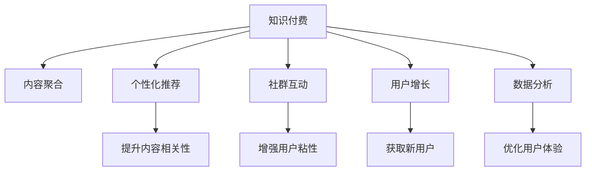

                 

## 1. 背景介绍

### 1.1 问题由来
随着知识经济的发展，知识付费已成为一种重要的商业形态。然而，市场竞争激烈，同质化产品层出不穷，用户选择困难。如何突围重围，打造有竞争力的知识付费产品，成为创业者们面临的共同挑战。本文聚焦于知识付费创业的产品差异化策略，从市场分析、产品设计、运营优化等多个维度，探讨如何构建独特的产品壁垒，吸引并留存用户，最终实现商业成功。

### 1.2 问题核心关键点
知识付费产品的核心在于提供高质量的内容和优质的用户体验。差异化策略的关键在于如何通过独特的产品设计、丰富的内容库、高效的运营机制，实现差异化竞争，打造有市场竞争力的品牌。

## 2. 核心概念与联系

### 2.1 核心概念概述
为了更好地理解知识付费产品的差异化策略，本节将介绍几个密切相关的核心概念：

- 知识付费（Knowledge-based Subscription）：用户支付费用获取知识内容的商业模式。内容形式包括但不限于视频课程、音频讲座、电子书、问答服务等。
- 内容聚合（Content Aggregation）：将分散的、高质量的内容汇集到一个平台，便于用户查找和获取。
- 个性化推荐（Personalized Recommendation）：基于用户行为数据和偏好，推荐符合用户兴趣的内容。
- 社群互动（Community Engagement）：构建用户间的交流互动，增加用户粘性。
- 用户增长（User Acquisition）：通过多渠道推广和运营策略，吸引新用户并提高留存率。
- 数据分析（Data Analytics）：通过用户行为数据、内容消费数据等，深入了解用户需求和内容消费习惯。

这些核心概念之间的逻辑关系可以通过以下Mermaid流程图来展示：



这个流程图展示的知识付费产品的核心概念及其之间的关系：

1. 知识付费以内容为王，聚集优质内容。
2. 个性化推荐提高用户满意度，增加粘性。
3. 社群互动促进用户间的交流，增强互动性。
4. 用户增长通过多渠道推广策略，吸引更多新用户。
5. 数据分析了解用户需求，优化产品策略。

这些概念共同构成了知识付费产品的差异化策略，使其能够在激烈的市场竞争中脱颖而出。

## 3. 核心算法原理 & 具体操作步骤

### 3.1 算法原理概述
知识付费产品的差异化策略，本质上是通过深度学习和数据分析技术，优化用户体验和内容推荐的策略，以实现与同质化产品的差异化竞争。其核心在于：

1. 通过数据分析，了解用户需求，提高内容的相关性和准确性。
2. 利用机器学习算法，实现个性化推荐，提升用户满意度。
3. 通过用户行为数据分析，优化产品策略，提高用户留存率。

### 3.2 算法步骤详解
以知识付费产品的个性化推荐算法为例，其大致步骤如下：

1. **数据收集**：收集用户的行为数据，包括点击、浏览、购买、评分等。
2. **数据预处理**：清洗、归一化数据，去除异常值和噪声。
3. **特征提取**：提取用户和内容的特征，如用户兴趣标签、内容关键词、用户历史消费行为等。
4. **模型训练**：使用协同过滤、深度学习等算法训练推荐模型，预测用户对内容的兴趣。
5. **推荐排序**：将预测结果进行排序，推荐用户最可能感兴趣的内容。

### 3.3 算法优缺点
个性化推荐算法的主要优点在于：

- 提升用户体验：通过精准推荐，提高用户满意度。
- 提高内容销量：增加用户对优质内容的消费，提高平台收益。
- 促进用户粘性：提高用户留存率，延长用户生命周期。

其主要缺点包括：

- 数据隐私问题：收集用户行为数据，需注意隐私保护。
- 数据稀疏性：用户行为数据有限，难以构建完整画像。
- 模型过拟合：个性化推荐模型易受数据偏差影响。

### 3.4 算法应用领域
个性化推荐算法不仅适用于知识付费产品，在电商、新闻推荐、视频娱乐等多个领域都有广泛应用。通过提升推荐质量，优化用户体验，增加用户粘性，个性化推荐算法已成为提高平台竞争力的重要手段。

## 4. 数学模型和公式 & 详细讲解

### 4.1 数学模型构建
个性化推荐算法常用的数学模型包括协同过滤（Collaborative Filtering）和深度学习模型（如FM、DNN、RNN等）。协同过滤模型可以基于用户行为数据和内容元数据，构建用户兴趣图谱。深度学习模型则可以通过神经网络结构，学习用户和内容的潜在表示。

### 4.2 公式推导过程
以协同过滤模型为例，其核心公式如下：

$$
P(u,i) = \frac{1}{1 + \exp(-\sum_{j \in N(u)} \alpha_j \cdot (r(i,j) - \mu_i)}
$$

其中，$P(u,i)$ 表示用户 $u$ 对内容 $i$ 的兴趣度，$N(u)$ 为与用户 $u$ 相似的用户集合，$r(i,j)$ 表示用户 $j$ 对内容 $i$ 的评分，$\mu_i$ 为内容的平均评分。

### 4.3 案例分析与讲解
以某知识付费平台为例，使用协同过滤算法进行个性化推荐。首先，构建用户兴趣图谱，计算用户间的相似度。然后，选择与目标用户 $u$ 相似的用户集合 $N(u)$，对每个用户 $j$ 的评分 $r(i,j)$ 进行加权求和，得到用户 $u$ 对内容 $i$ 的兴趣度。最终，根据兴趣度排序，推荐用户最可能感兴趣的内容。

## 5. 项目实践：代码实例和详细解释说明

### 5.1 开发环境搭建
要进行个性化推荐算法的开发，需要以下开发环境：

1. 安装Python环境，建议使用Anaconda。
2. 安装Python库，包括pandas、numpy、scikit-learn、tensorflow等。
3. 配置计算资源，确保数据处理和模型训练所需的CPU、GPU等硬件资源充足。

### 5.2 源代码详细实现
以下是一个基于协同过滤算法的Python代码示例，用于推荐知识付费平台上的视频课程：

```python
import pandas as pd
from scipy.spatial.distance import cosine

def collaborative_filtering(data, alpha=0.8):
    # 构建用户-内容评分矩阵
    train = pd.pivot_table(data, values='rating', index='user', columns='item')
    
    # 计算用户之间的相似度
    similarities = pd.DataFrame(index=train.index, columns=train.columns)
    for i, user in train.index:
        for j, item in train.columns:
            similarities.at[i, j] = 1 - cosine(train.at[i, j], train.values)
    
    # 计算每个用户对内容的推荐评分
    predictions = pd.DataFrame(index=train.index, columns=train.columns)
    for i, user in train.index:
        for j, item in train.columns:
            if i == j:
                predictions.at[i, j] = train.at[i, j]
            else:
                predictions.at[i, j] = train.at[i, item] * similarities.at[i, j] / (sum(similarities.loc[i, :]))
    
    # 对预测结果进行排序，得到推荐列表
    rankings = predictions.idxmax(axis=1)
    
    return rankings
```

### 5.3 代码解读与分析
以上代码主要实现了协同过滤算法。首先，将用户-内容评分矩阵构建为Pivot表，方便后续计算。然后，计算用户之间的相似度，构建相似度矩阵。最后，基于相似度矩阵计算每个用户对内容的推荐评分，并对结果进行排序，得到推荐列表。

### 5.4 运行结果展示
以某知识付费平台为例，使用上述代码进行个性化推荐。将用户行为数据输入算法，即可得到用户最感兴趣的视频课程列表。通过不断优化算法和数据集，提高推荐效果，实现更高的用户满意度和平台收益。

## 6. 实际应用场景

### 6.1 视频课程推荐
知识付费平台的视频课程推荐是一个典型的应用场景。通过个性化推荐，用户可以更快地找到适合自己的课程，提高学习效率。同时，平台也能够根据用户的行为数据，发现和推荐更多优质的课程内容，提升平台整体价值。

### 6.2 电子书推荐
知识付费平台的电子书推荐，也是差异化策略的重要应用之一。用户可以基于对已购买书籍的评价和兴趣，发现更多感兴趣的电子书。通过优化推荐算法，提高用户满意度和留存率，增加平台的收益。

### 6.3 在线讲座推荐
在线讲座推荐是知识付费产品的另一个重要场景。通过个性化推荐，用户可以获取更多高质量的讲座内容，满足自己的学习需求。平台也能够根据用户行为数据，发现和推荐更多受欢迎的讲座，提升用户粘性和平台收入。

## 7. 工具和资源推荐

### 7.1 学习资源推荐
为了帮助开发者系统掌握知识付费产品的差异化策略，以下是一些优质的学习资源：

1. 《深度学习入门：基于Python的理论与实现》：由深度学习专家李沐撰写，详细介绍了深度学习的基础理论和实践方法。
2. Coursera《推荐系统专项课程》：由斯坦福大学开设，涵盖协同过滤、深度学习等多个推荐系统核心技术。
3. 《推荐系统实战》书籍：由刘禹赫编写，全面介绍了推荐系统在电商、新闻、视频等领域的实际应用。
4. Kaggle推荐系统竞赛：参与实际推荐系统竞赛，实战练习推荐算法，提升技能水平。
5. GitHub上的推荐系统开源项目：如LightFM、TensorFlow推荐系统等，可供学习和参考。

通过对这些资源的学习实践，相信你一定能够快速掌握知识付费产品的差异化策略，并用于解决实际的问题。

### 7.2 开发工具推荐
高效的开发离不开优秀的工具支持。以下是几款用于知识付费产品开发的常用工具：

1. Python：作为知识付费产品开发的主要语言，Python拥有丰富的第三方库和生态系统，适合快速迭代研究。
2. PyTorch：基于Python的开源深度学习框架，灵活动态的计算图，适合快速实验和研究。
3. TensorFlow：由Google主导开发的开源深度学习框架，适合大规模工程应用。
4. Pandas：Python中常用的数据处理库，适合处理和分析大规模数据集。
5. Scikit-learn：Python中常用的机器学习库，适合构建和训练推荐模型。

合理利用这些工具，可以显著提升知识付费产品的开发效率，加快创新迭代的步伐。

### 7.3 相关论文推荐
知识付费产品的差异化策略需要深度学习和大数据技术的支持。以下是几篇奠基性的相关论文，推荐阅读：

1. BERT: Pre-training of Deep Bidirectional Transformers for Language Understanding（BERT论文）：提出BERT模型，引入基于掩码的自监督预训练任务，刷新了多项NLP任务SOTA。
2. Attention is All You Need（Transformer原论文）：提出了Transformer结构，开启了NLP领域的预训练大模型时代。
3. Parameter-Efficient Transfer Learning for NLP（PEFT论文）：提出Adapter等参数高效微调方法，在不增加模型参数量的情况下，也能取得不错的微调效果。
4. Knowledge Graph Embeddings and Recommender Systems（KGE论文）：提出知识图嵌入方法，将知识图谱与推荐系统相结合，提高推荐效果。
5. Dynamic Neural Topic Modeling for Recommendation Systems（DNTM论文）：提出动态神经主题模型，结合用户动态行为数据，提高推荐精度。

这些论文代表了大语言模型微调技术的发展脉络。通过学习这些前沿成果，可以帮助研究者把握学科前进方向，激发更多的创新灵感。

## 8. 总结：未来发展趋势与挑战

### 8.1 总结
本文对知识付费产品的差异化策略进行了全面系统的介绍。首先阐述了知识付费产品的研究背景和意义，明确了差异化策略在提高用户满意度和平台收益方面的独特价值。其次，从原理到实践，详细讲解了协同过滤等推荐算法的数学原理和关键步骤，给出了推荐任务开发的完整代码实例。同时，本文还广泛探讨了推荐算法在视频课程、电子书、讲座推荐等多个领域的应用前景，展示了推荐范式的巨大潜力。此外，本文精选了推荐技术的各类学习资源，力求为读者提供全方位的技术指引。

通过本文的系统梳理，可以看到，推荐算法在知识付费产品中的应用前景广阔，能够显著提升用户满意度和平台收益。未来，伴随推荐算法和大数据的持续演进，知识付费产品的推荐效果将进一步提升，为用户带来更优质的内容体验。

### 8.2 未来发展趋势
知识付费产品的推荐算法将呈现以下几个发展趋势：

1. 算法融合：将深度学习、协同过滤、知识图谱等多种算法进行融合，提高推荐效果和泛化能力。
2. 数据驱动：结合多模态数据，如文本、图片、音频等，提升推荐模型的感知能力。
3. 个性化增强：通过用户动态行为数据和实时反馈，动态调整推荐策略，提高个性化推荐效果。
4. 隐私保护：加强对用户行为数据的保护，确保用户隐私安全。
5. 模型优化：引入模型压缩、稀疏化存储等技术，提高推荐模型的推理速度和效率。
6. 产品协同：将推荐系统与内容创作、版权管理等产品模块深度结合，形成更加闭环的生态系统。

以上趋势凸显了知识付费产品推荐算法的广阔前景。这些方向的探索发展，必将进一步提升推荐系统的性能和应用范围，为知识付费产品的商业成功提供有力支撑。

### 8.3 面临的挑战
尽管推荐算法已经取得了显著的成果，但在迈向更加智能化、普适化应用的过程中，它仍面临着诸多挑战：

1. 数据稀疏性：用户行为数据有限，难以构建完整画像，影响推荐效果。
2. 隐私保护：收集用户行为数据，需注意隐私保护。
3. 算法复杂度：推荐模型通常比较复杂，对计算资源和算法优化有较高要求。
4. 冷启动问题：新用户缺乏行为数据，难以进行有效的推荐。
5. 实时反馈：实时反馈机制和动态调整策略，是提升推荐效果的有效手段，但需要复杂的技术实现。
6. 内容多样性：用户对内容的兴趣多样，如何精准捕捉并推荐，是一大挑战。

### 8.4 研究展望
面对推荐算法面临的种种挑战，未来的研究需要在以下几个方面寻求新的突破：

1. 多模态推荐：结合文本、图片、音频等多模态数据，提升推荐模型的感知能力。
2. 协同过滤增强：通过协同过滤和深度学习融合，提高推荐效果和泛化能力。
3. 动态推荐：利用实时反馈数据，动态调整推荐策略，提高个性化推荐效果。
4. 隐私保护机制：加强对用户行为数据的保护，确保用户隐私安全。
5. 模型压缩优化：引入模型压缩、稀疏化存储等技术，提高推荐模型的推理速度和效率。
6. 产品生态协同：将推荐系统与内容创作、版权管理等产品模块深度结合，形成更加闭环的生态系统。

这些研究方向将引领知识付费产品推荐算法迈向更高的台阶，为构建智能化的知识付费平台提供有力支撑。面向未来，推荐算法需要与其他人工智能技术进行更深入的融合，如知识表示、因果推理、强化学习等，多路径协同发力，共同推动知识付费技术的发展。

## 9. 附录：常见问题与解答

**Q1：如何优化推荐算法的精度？**

A: 推荐算法精度的优化可以从以下几个方面入手：
1. 数据收集：收集更多的用户行为数据，提高数据的丰富性和准确性。
2. 特征工程：对用户和内容进行深入特征提取，提高特征表达能力。
3. 模型选择：选择合适的推荐模型，如协同过滤、深度学习等，根据具体场景选择最优模型。
4. 模型优化：对推荐模型进行调参优化，提高模型精度。
5. 实时反馈：通过实时反馈机制，动态调整推荐策略，提升推荐效果。

**Q2：推荐算法在冷启动场景下如何表现？**

A: 冷启动是指新用户没有足够行为数据，难以进行推荐。解决冷启动问题的方法包括：
1. 利用用户兴趣图谱：通过相似用户进行推荐，弥补新用户行为数据的缺乏。
2. 引入用户初始化：基于用户兴趣和偏好，进行初始化推荐。
3. 采用混合推荐：结合协同过滤和深度学习，提升推荐效果。

**Q3：推荐算法如何处理多样性问题？**

A: 推荐算法需要处理用户兴趣的多样性问题，解决方法包括：
1. 多兴趣模型：通过多兴趣表示，捕捉用户多样化的兴趣点。
2. 多样化推荐：结合不同推荐策略，提供多种选择，满足用户多样性需求。
3. 用户画像：通过多模态数据构建用户画像，更好地了解用户需求。

**Q4：推荐算法在实际应用中如何优化效率？**

A: 推荐算法的效率优化可以从以下几个方面入手：
1. 模型压缩：通过模型压缩技术，减小模型大小，提高推理速度。
2. 多线程并行：利用多线程并行技术，提高计算效率。
3. 缓存机制：利用缓存技术，减少重复计算，提高响应速度。
4. 增量更新：根据用户行为数据，增量更新模型，减少计算量。

**Q5：推荐算法如何保护用户隐私？**

A: 推荐算法在保护用户隐私方面，需要考虑以下几个方面：
1. 数据匿名化：对用户数据进行匿名化处理，保护用户隐私。
2. 差分隐私：通过差分隐私技术，保护用户隐私。
3. 数据访问控制：严格控制数据访问权限，防止数据泄露。

这些建议和技术，可以帮助你解决实际应用中的常见问题，优化推荐算法的精度和效率，提升用户体验和平台收益。希望本文能够对你在知识付费产品的差异化策略上提供有价值的参考和指导。

---

作者：禅与计算机程序设计艺术 / Zen and the Art of Computer Programming

