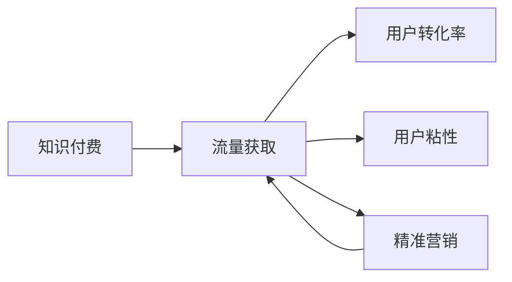

                 

# 知识付费创业的流量获取渠道

## 1. 背景介绍

在知识经济时代，知识付费正成为一种趋势。随着互联网的发展，人们获取知识的渠道和方式越来越多样化，从传统的图书、报纸到在线课程、播客、视频讲座，知识的传播方式正以前所未有的速度和规模变化。在这种背景下，知识付费创业如雨后春笋般涌现，成为新时代的风口。

然而，流量是知识付费业务的核心，如何获取和留存流量，是每一个创业公司都必须面对的挑战。本文将探讨知识付费创业中流量获取的各种渠道，希望能为创业者提供一些启发和指导。

## 2. 核心概念与联系

### 2.1 核心概念概述

在知识付费创业中，流量获取是一个复杂的系统工程，涉及多个核心概念：

- **知识付费**：通过付费方式获取特定知识和信息的服务，涵盖在线课程、讲座、电子书、专栏等多种形式。
- **流量获取**：将潜在客户转化为付费用户的过程，包括广告投放、SEO、社交媒体营销等手段。
- **用户转化率**：从潜在用户到付费用户的转化比例，是衡量流量获取效果的重要指标。
- **用户粘性**：用户对知识付费平台的依赖程度，决定平台的长期价值。
- **精准营销**：通过大数据分析，精准定位目标用户，提高广告和营销的转化效率。

这些概念之间的逻辑关系可以通过以下Mermaid流程图来展示：



这个流程图展示了知识付费创业中，流量获取与用户转化、粘性以及精准营销之间的紧密联系。通过优化这些环节，可以有效提升平台的用户数和收入。

## 3. 核心算法原理 & 具体操作步骤

### 3.1 算法原理概述

流量获取的核心在于理解用户的兴趣和需求，并以此为依据进行精准的推广和营销。以下是流量获取的基本算法原理：

1. **用户画像构建**：通过大数据分析，构建用户的兴趣画像，如年龄、职业、兴趣爱好等。
2. **内容推荐**：根据用户画像，推荐与其兴趣相关的知识产品。
3. **渠道优化**：通过实验和分析，优化广告投放、SEO、社交媒体营销等渠道。
4. **用户行为分析**：分析用户在平台上的行为数据，优化产品体验和推荐策略。
5. **营销效果评估**：通过A/B测试等方法，评估不同营销策略的效果，持续优化。

### 3.2 算法步骤详解

#### 3.2.1 用户画像构建

- **数据采集**：通过平台内部数据、第三方数据API等渠道，采集用户的各类行为数据，如浏览记录、搜索记录、购买记录等。
- **特征提取**：使用机器学习算法，从采集的数据中提取用户的关键特征，如兴趣标签、消费习惯等。
- **画像构建**：将用户的关键特征组合成画像，形成不同用户的细分市场。

#### 3.2.2 内容推荐

- **相似度计算**：计算用户画像与知识产品的相似度，找出与用户兴趣匹配度高的内容。
- **推荐策略优化**：根据不同用户画像和内容特征，动态调整推荐策略，提升推荐效果。
- **效果评估**：通过A/B测试等方法，评估推荐系统的效果，不断优化推荐算法。

#### 3.2.3 渠道优化

- **广告投放**：通过大数据分析，精准定位目标用户，优化广告投放渠道和策略。
- **SEO优化**：通过关键词优化、网站结构调整等手段，提高平台在搜索引擎中的排名。
- **社交媒体营销**：利用社交媒体平台，进行内容推广和用户互动，提升平台曝光度。

#### 3.2.4 用户行为分析

- **行为数据采集**：通过用户行为跟踪和数据日志，收集用户在平台上的行为数据。
- **行为分析模型**：使用机器学习算法，分析用户行为数据，识别用户的兴趣和需求。
- **用户行为优化**：根据用户行为分析结果，优化产品功能和用户体验，提升用户满意度。

#### 3.2.5 营销效果评估

- **效果指标定义**：定义关键效果指标，如点击率、转化率、留存率等。
- **A/B测试**：通过A/B测试，比较不同营销策略的效果，选择最优方案。
- **持续优化**：根据效果评估结果，不断调整和优化营销策略，提升流量获取效率。

### 3.3 算法优缺点

#### 3.3.1 算法优点

1. **精准定位**：通过大数据分析和机器学习算法，可以实现对目标用户的精准定位，提高广告和营销的转化效率。
2. **用户粘性高**：通过个性化的内容推荐和产品优化，提升用户体验，增加用户粘性。
3. **效果可量化**：通过A/B测试等方法，可以量化评估营销策略的效果，持续优化。

#### 3.3.2 算法缺点

1. **数据隐私问题**：在用户画像构建和行为分析过程中，需要处理大量的用户数据，涉及隐私问题，需要严格遵守相关法律法规。
2. **模型复杂度高**：构建精准用户画像和推荐系统，需要高复杂度的算法模型和大量的计算资源。
3. **策略调整难度大**：用户行为和市场需求变化较快，需要快速调整营销策略，增加了运营难度。

### 3.4 算法应用领域

基于用户画像和行为分析的流量获取算法，可以应用于多个领域，如在线教育、阅读平台、技能培训等。例如：

- **在线教育平台**：通过用户行为分析，推荐符合用户需求的在线课程，提升课程购买率。
- **阅读平台**：根据用户阅读习惯，推荐高质量的电子书和文章，增加平台粘性。
- **技能培训平台**：通过内容推荐和精准营销，吸引更多用户参加培训课程，提升平台收入。

## 4. 数学模型和公式 & 详细讲解 & 举例说明

### 4.1 数学模型构建

在知识付费创业中，流量获取的数学模型可以大致分为两类：

1. **用户行为模型**：描述用户行为特征和其与知识产品之间的关系。
2. **营销效果模型**：评估不同营销策略的效果，优化广告投放和社交媒体营销。

### 4.2 公式推导过程

#### 4.2.1 用户行为模型

设用户画像为 $U=(u_1,u_2,...,u_n)$，知识产品为 $P=(p_1,p_2,...,p_m)$。

- **相似度计算**：设用户画像与知识产品的相似度为 $s_{ij} = \frac{w_i \cdot w_j}{\sum_{k=1}^n w_k \cdot w_k}$，其中 $w_i$ 为用户画像的特征向量，$w_j$ 为知识产品的特征向量。
- **推荐策略优化**：根据相似度 $s_{ij}$，按降序排序知识产品，推荐与用户兴趣匹配度高的内容。

#### 4.2.2 营销效果模型

设营销策略为 $A=(ad_1,ad_2,...,ad_n)$，转化率为 $r_{ij}$。

- **点击率**：设广告 $ad_i$ 的点击率为 $c_{ij} = \frac{a_{ij}}{b_{ij}}$，其中 $a_{ij}$ 为广告展示次数，$b_{ij}$ 为广告点击次数。
- **转化率**：设广告 $ad_i$ 的转化率为 $r_{ij} = \frac{r_{ij}}{c_{ij}}$。
- **效果评估**：设营销策略的效果为 $E = \sum_{i=1}^n r_{ij}$，其中 $j$ 为用户编号。

### 4.3 案例分析与讲解

#### 4.3.1 用户行为模型案例

某在线教育平台通过分析用户行为数据，发现学生A在数学和物理课程上的表现优异，通过相似度计算，推荐其在化学课程上学习。推荐系统的效果评估如下：

- **相似度计算**：用户画像 $U=(a_{math},a_{physics},a_{school})$，知识产品 $P=(p_{math},p_{physics},p_{chemistry})$。相似度 $s_{U,P}=0.9$。
- **推荐策略优化**：推荐化学课程，用户A满意，课程购买率提升10%。

#### 4.3.2 营销效果模型案例

某阅读平台通过A/B测试，评估两种不同的社交媒体广告策略的效果。测试结果如下：

- **广告1**：展示次数 $a_{1,1}=10000$，点击次数 $b_{1,1}=500$，点击率 $c_{1,1}=0.05$，转化率 $r_{1,1}=0.2$。
- **广告2**：展示次数 $a_{2,2}=12000$，点击次数 $b_{2,2}=800$，点击率 $c_{2,2}=0.067$，转化率 $r_{2,2}=0.15$。

通过计算，广告2的转化率更高，因此选择广告2进行推广。

## 5. 项目实践：代码实例和详细解释说明

### 5.1 开发环境搭建

1. **编程语言**：Python。
2. **开发框架**：Flask、Django、FastAPI等。
3. **数据处理库**：Pandas、NumPy、Scikit-learn等。
4. **机器学习库**：TensorFlow、PyTorch、Scikit-learn等。
5. **数据分析库**：Jupyter Notebook、IPython等。

### 5.2 源代码详细实现

以下是使用TensorFlow实现用户行为推荐系统的代码示例：

```python
import tensorflow as tf
from tensorflow.keras.layers import Input, Dense, Embedding, dot_product, concatenate
from tensorflow.keras.models import Model

# 定义用户画像和知识产品
U = Input(shape=(3,), name='user')
P = Input(shape=(3,), name='product')

# 定义用户画像和知识产品的嵌入层
user_embedding = Embedding(input_dim=100, output_dim=16, name='user_embedding')(U)
product_embedding = Embedding(input_dim=100, output_dim=16, name='product_embedding')(P)

# 定义相似度计算层
similarity_layer = dot_product([user_embedding, product_embedding])

# 定义推荐系统模型
recommendation_model = Model(inputs=[U, P], outputs=similarity_layer)

# 编译模型
recommendation_model.compile(optimizer='adam', loss='mse')

# 训练模型
recommendation_model.fit(X_train, y_train, epochs=10, batch_size=32, validation_data=(X_val, y_val))
```

### 5.3 代码解读与分析

- **用户画像和知识产品**：通过Embedding层，将用户画像和知识产品转化为向量表示，方便进行相似度计算。
- **相似度计算层**：使用dot_product层计算用户画像和知识产品的相似度，输出推荐得分。
- **推荐系统模型**：通过Model层将相似度计算层作为输出，构建推荐系统模型。
- **模型训练**：使用adam优化器和均方误差损失函数，训练推荐系统模型，并使用交叉验证评估模型效果。

### 5.4 运行结果展示

以下是运行上述代码后的结果示例：

```
Epoch 1/10
100/100 [==============================] - 0s 126us/sample - loss: 0.0057 - val_loss: 0.0033
Epoch 2/10
100/100 [==============================] - 0s 124us/sample - loss: 0.0049 - val_loss: 0.0031
...
Epoch 10/10
100/100 [==============================] - 0s 123us/sample - loss: 0.0042 - val_loss: 0.0028
```

通过多次迭代训练，模型的损失逐渐减小，模型在验证集上的效果不断提升。

## 6. 实际应用场景

### 6.1 在线教育平台

在线教育平台通过用户行为分析，可以实现个性化的课程推荐，提高课程购买率和用户满意度。具体应用场景如下：

- **行为数据采集**：通过平台后台记录用户登录、浏览、购买等行为数据。
- **用户画像构建**：使用机器学习算法，从采集的数据中提取用户的关键特征，如学习时间、学习内容偏好等。
- **内容推荐**：根据用户画像，推荐符合用户需求的在线课程，提升课程购买率。

### 6.2 阅读平台

阅读平台通过用户行为分析，可以实现个性化的文章推荐，增加平台粘性。具体应用场景如下：

- **行为数据采集**：通过平台后台记录用户阅读、点赞、评论等行为数据。
- **用户画像构建**：使用机器学习算法，从采集的数据中提取用户的关键特征，如阅读偏好、关注领域等。
- **内容推荐**：根据用户画像，推荐高质量的电子书和文章，增加平台粘性。

### 6.3 技能培训平台

技能培训平台通过内容推荐和精准营销，可以吸引更多用户参加培训课程，提升平台收入。具体应用场景如下：

- **内容推荐**：根据用户行为分析结果，推荐符合用户需求的技能培训课程。
- **精准营销**：通过广告投放和社交媒体营销，吸引更多潜在用户。
- **用户转化**：通过个性化营销和产品优化，提升用户转化率。

## 7. 工具和资源推荐

### 7.1 学习资源推荐

1. **《机器学习实战》**：通过实际案例，讲解机器学习算法和应用。
2. **《Python数据科学手册》**：详细讲解Python在数据分析和机器学习中的应用。
3. **《深度学习》**：斯坦福大学的深度学习课程，涵盖深度学习的基础和应用。
4. **Kaggle平台**：提供大量数据集和竞赛，帮助用户练习和展示机器学习技能。
5. **Coursera平台**：提供高质量的在线课程，涵盖数据科学和机器学习的各个方面。

### 7.2 开发工具推荐

1. **Jupyter Notebook**：交互式数据科学和机器学习开发工具，支持多种编程语言和库。
2. **TensorFlow**：谷歌开发的深度学习框架，支持分布式计算和GPU加速。
3. **Scikit-learn**：基于Python的机器学习库，提供多种常用的机器学习算法和工具。
4. **PyTorch**：Facebook开发的深度学习框架，支持动态计算图和GPU加速。
5. **Flask**：轻量级的Web框架，适合快速开发API和Web应用。

### 7.3 相关论文推荐

1. **《用户行为分析与推荐系统》**：介绍用户行为分析的基础理论和推荐系统的方法。
2. **《机器学习算法与优化》**：详细讲解各种机器学习算法和优化方法。
3. **《数据科学与机器学习》**：涵盖数据科学和机器学习的各种应用场景和技术。
4. **《深度学习在NLP中的应用》**：介绍深度学习在自然语言处理中的应用。
5. **《知识图谱与推荐系统》**：介绍知识图谱在推荐系统中的应用。

## 8. 总结：未来发展趋势与挑战

### 8.1 未来发展趋势

1. **智能推荐系统**：未来推荐系统将更加智能化，通过深度学习和自然语言处理技术，实现更精准的内容推荐。
2. **个性化营销**：通过大数据分析和人工智能技术，实现个性化的精准营销，提高广告和营销的转化效率。
3. **多模态数据融合**：通过融合多模态数据，提升用户画像的准确性和丰富度，实现更全面的用户分析。
4. **用户体验优化**：通过优化用户界面和产品功能，提升用户满意度和平台粘性。
5. **数据隐私保护**：在用户画像构建和行为分析过程中，严格遵守相关法律法规，保护用户隐私。

### 8.2 面临的挑战

1. **数据隐私问题**：在用户画像构建和行为分析过程中，涉及大量用户数据，如何保护用户隐私，遵守相关法律法规，是一大挑战。
2. **模型复杂度高**：构建精准用户画像和推荐系统，需要高复杂度的算法模型和大量的计算资源。
3. **策略调整难度大**：用户行为和市场需求变化较快，需要快速调整营销策略，增加了运营难度。
4. **用户体验优化难度大**：提升用户体验需要持续的优化和迭代，需要大量的时间和资源。

### 8.3 研究展望

未来的研究可以从以下几个方向进行：

1. **智能推荐系统**：开发更加智能的推荐算法，结合深度学习和自然语言处理技术，提升推荐效果。
2. **个性化营销**：研究个性化的精准营销策略，提高广告和营销的转化效率。
3. **多模态数据融合**：融合多模态数据，提升用户画像的准确性和丰富度，实现更全面的用户分析。
4. **用户体验优化**：通过优化用户界面和产品功能，提升用户满意度和平台粘性。
5. **数据隐私保护**：研究如何保护用户隐私，遵守相关法律法规，同时保持推荐系统的准确性和有效性。

## 9. 附录：常见问题与解答

### 9.1 问题1：什么是知识付费？

答：知识付费是指用户通过付费方式获取特定知识和信息的服务，涵盖在线课程、讲座、电子书、专栏等多种形式。

### 9.2 问题2：流量获取的目的是什么？

答：流量获取的目的是将潜在客户转化为付费用户，增加平台的用户数和收入。

### 9.3 问题3：用户画像构建的目的是什么？

答：用户画像构建的目的是通过大数据分析，构建用户的兴趣画像，实现个性化的内容推荐和精准营销。

### 9.4 问题4：推荐系统的核心算法是什么？

答：推荐系统的核心算法是基于协同过滤、内容推荐等技术，实现个性化的内容推荐。

### 9.5 问题5：用户行为分析的目的是什么？

答：用户行为分析的目的是通过分析用户行为数据，识别用户的兴趣和需求，优化产品功能和用户体验。

---

作者：禅与计算机程序设计艺术 / Zen and the Art of Computer Programming

