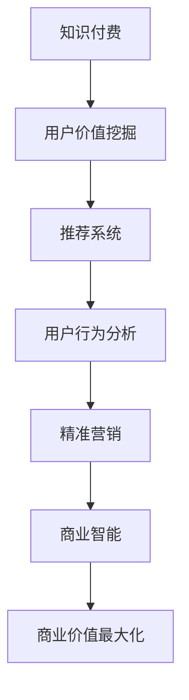

                 

# 知识付费创业的用户价值挖掘

> 关键词：知识付费, 用户价值, 数据挖掘, 推荐系统, 用户行为分析, 精准营销, 商业智能

## 1. 背景介绍

### 1.1 问题由来
随着互联网技术的飞速发展，知识付费产业正逐渐成为内容消费的新趋势。从音频、视频到文字、图鉴，各类知识产品层出不穷，为学习者提供了丰富的学习资源。然而，用户在知识和信息海洋中的选择成本不断增加，如何帮助用户精准识别有价值的内容，成为知识付费创业的关键问题。

### 1.2 问题核心关键点
如何通过数据挖掘和分析，充分理解用户行为特征，精准匹配用户需求，提供个性化的内容推荐，提升用户满意度和粘性，从而实现商业价值最大化，是大数据背景下知识付费创业的根本挑战。

## 2. 核心概念与联系

### 2.1 核心概念概述

为更好地理解用户价值挖掘在知识付费创业中的应用，本节将介绍几个关键概念：

- **知识付费(Knowledge Paywall)**：指用户需支付一定的费用获取知识内容，其本质是知识服务与付费机制的结合。内容创作者通过提供专业、高效、高质量的知识产品，获得用户的付费订阅和支持。

- **用户价值挖掘(User Value Mining)**：通过数据挖掘和分析技术，识别和量化用户的行为特征和需求偏好，为用户提供符合其价值取向的个性化推荐内容，从而提升用户价值和满意度。

- **推荐系统(Recommender System)**：利用用户行为数据、商品属性和用户画像，通过算法预测用户对不同内容的需求，提供精准的内容推荐，从而提升用户转化率和满意度。

- **用户行为分析(User Behavior Analysis)**：对用户在知识付费平台上的浏览、点击、订阅、购买等行为进行深入分析，理解用户需求和偏好，指导推荐算法优化。

- **精准营销(Precision Marketing)**：根据用户行为数据，设计个性化的营销策略，提升用户互动率和购买转化率。

- **商业智能(Business Intelligence, BI)**：将数据分析结果应用到商业决策中，辅助企业进行用户运营、产品优化、市场拓展等战略规划。

这些核心概念之间的逻辑关系可以通过以下Mermaid流程图来展示：



这个流程图展示了几者之间的紧密联系：

1. **知识付费**作为平台和业务形态，通过提供知识产品满足用户需求。
2. **用户价值挖掘**通过数据驱动的方式，深入理解用户需求。
3. **推荐系统**基于用户画像和行为数据，进行精准内容推荐。
4. **用户行为分析**对用户互动行为进行细致分析，为推荐系统优化提供依据。
5. **精准营销**设计个性化的营销策略，提升用户活跃度和购买转化率。
6. **商业智能**通过综合分析，为业务决策提供支持，实现商业价值最大化。

## 3. 核心算法原理 & 具体操作步骤
### 3.1 算法原理概述

基于用户价值挖掘的知识付费创业，实质上是一个以数据为核心的智能推荐系统。其核心思想是：通过收集和分析用户行为数据，构建用户画像和行为模型，进而进行精准推荐，提升用户价值和满意度。

形式化地，假设用户群体为 $U$，内容库为 $C$，用户行为数据为 $D$。推荐系统的目标是为每个用户 $u \in U$，推荐最符合其需求的内容 $c \in C$，使得 $u$ 对推荐内容 $c$ 的评分 $r_{uc}$ 最大化。

具体地，推荐系统的优化目标可以表示为：

$$
\max_{r_{uc}} \sum_{u \in U} \sum_{c \in C} r_{uc}p_{uc}
$$

其中 $p_{uc}$ 表示用户 $u$ 对内容 $c$ 的兴趣程度，通常可以通过用户行为数据进行建模。

### 3.2 算法步骤详解

基于用户价值挖掘的推荐系统，一般包括以下几个关键步骤：

**Step 1: 数据收集与处理**
- 收集用户在平台上的所有行为数据，包括但不限于浏览历史、点击次数、购买记录、评价反馈等。
- 数据清洗和预处理，去除噪声、处理缺失值、归一化处理等，确保数据质量和一致性。

**Step 2: 用户画像建模**
- 利用机器学习算法，从行为数据中提取用户特征，构建用户画像。常用的特征包括兴趣偏好、行为频率、活跃时间等。
- 通过聚类算法，将用户划分为不同兴趣群体，便于进行个性化推荐。

**Step 3: 内容特征提取**
- 提取内容的元数据，如标题、摘要、关键词、标签等，生成内容特征向量。
- 利用文本挖掘技术，对文本内容进行向量化处理，提取关键词、情感倾向等特征。

**Step 4: 推荐模型训练**
- 选择合适的推荐算法，如协同过滤、内容基推荐、深度学习等。
- 在用户画像和内容特征基础上，训练推荐模型，生成用户对内容的评分预测。

**Step 5: 推荐结果排序**
- 将推荐算法生成的评分矩阵进行排序，选择评分最高的内容进行推荐。
- 结合用户行为数据，动态调整推荐策略，优化推荐结果。

**Step 6: 反馈收集与优化**
- 对推荐结果进行实时监控，收集用户反馈数据，如点击率、购买率等。
- 根据反馈数据不断调整推荐模型，提升推荐效果。

### 3.3 算法优缺点

基于用户价值挖掘的推荐系统具有以下优点：
1. **个性化推荐**：通过分析用户行为，提供高度个性化的内容推荐，提升用户满意度。
2. **精准营销**：利用用户画像和行为数据，设计精准的营销策略，提高转化率。
3. **商业智能**：综合分析用户数据，提供业务决策支持，实现商业价值最大化。

同时，该方法也存在一定的局限性：
1. **数据质量要求高**：推荐系统的准确性和效果高度依赖于数据质量，一旦数据不完整、不精确，推荐效果可能大打折扣。
2. **隐私风险**：用户行为数据的收集和分析可能涉及用户隐私问题，需要严格遵守法律法规，保护用户数据安全。
3. **冷启动问题**：对于新用户或新内容，推荐算法可能面临冷启动问题，需要设计更好的策略来缓解。
4. **多样性不足**：过度依赖用户的点击和评价数据，可能导致推荐内容过于单一，无法满足用户的多样性需求。

尽管存在这些局限性，但就目前而言，基于用户价值挖掘的推荐系统是知识付费创业的主要技术支撑，其效果显著，应用广泛。

### 3.4 算法应用领域

基于用户价值挖掘的推荐系统在知识付费创业中有着广泛的应用：

- **内容推荐**：帮助用户从海量内容中筛选出最感兴趣的内容，提升用户活跃度和满意度。
- **用户分析**：分析用户行为，洞察用户需求和偏好，指导内容创作和优化。
- **精准营销**：通过个性化营销策略，提升用户互动率和转化率，实现商业价值增长。
- **数据分析与报告**：利用商业智能工具，生成用户行为分析报告，辅助业务决策。

除了上述这些主要应用，推荐系统还被创新性地应用于新用户激活、个性化订阅、流失用户召回等场景，为知识付费平台的运营和发展提供了重要支持。

## 4. 数学模型和公式 & 详细讲解 & 举例说明

### 4.1 数学模型构建

本节将使用数学语言对基于用户价值挖掘的知识付费推荐系统进行更加严格的刻画。

假设推荐系统包含 $U$ 个用户，$C$ 个内容，每个用户 $u$ 对每个内容 $c$ 的评分 $r_{uc}$ 遵循矩阵 $R$。推荐系统的目标是最小化预测评分与实际评分的差异，即：

$$
\min_{\theta} \| R - \hat{R} \|
$$

其中 $\theta$ 为推荐模型的参数，$\hat{R}$ 为模型预测评分矩阵。

常用的推荐算法包括协同过滤、内容基推荐和深度学习推荐。以协同过滤算法为例，其数学模型可以表示为：

$$
\hat{r}_{uc} = \frac{e^{\hat{p}_{uc}}}{\sum_{c'} e^{\hat{p}_{uc'}}}
$$

其中 $\hat{p}_{uc} = \theta^Tf_u g_c$，$f_u$ 和 $g_c$ 为用户的特征向量和内容的特征向量，$\theta$ 为模型参数。

### 4.2 公式推导过程

以下我们以协同过滤算法为例，推导评分预测公式及其梯度计算。

假设用户 $u$ 对内容 $c$ 的评分 $r_{uc}$ 可以用其他用户对内容 $c$ 的评分 $r_{uc'}$ 和用户 $u$ 的评分 $r_{u'c}$ 进行预测，即：

$$
r_{uc} \approx \alpha \sum_{u' \neq u} w_{u'u} r_{u'c}
$$

其中 $w_{u'u}$ 为相似度系数，$\alpha$ 为归一化系数。

设 $w_{u'u}$ 为皮尔逊相关系数，则：

$$
w_{u'u} = \frac{\text{corr}(u', u)}{\sqrt{\text{var}(u') \text{var}(u)}}
$$

则协同过滤算法可以表示为：

$$
\hat{r}_{uc} = \frac{\alpha \sum_{u' \neq u} w_{u'u} r_{u'c}}{\sum_{u' \neq u} w_{u'u}}
$$

在得到评分预测公式后，可以基于梯度下降等优化算法，最小化预测评分与实际评分的差异，更新模型参数 $\theta$。

在计算梯度时，可以使用反向传播算法，递归计算 $\frac{\partial \hat{r}_{uc}}{\partial \theta}$。

## 5. 项目实践：代码实例和详细解释说明
### 5.1 开发环境搭建

在进行推荐系统开发前，我们需要准备好开发环境。以下是使用Python进行PyTorch开发的环境配置流程：

1. 安装Anaconda：从官网下载并安装Anaconda，用于创建独立的Python环境。

2. 创建并激活虚拟环境：
```bash
conda create -n pytorch-env python=3.8 
conda activate pytorch-env
```

3. 安装PyTorch：根据CUDA版本，从官网获取对应的安装命令。例如：
```bash
conda install pytorch torchvision torchaudio cudatoolkit=11.1 -c pytorch -c conda-forge
```

4. 安装相关依赖：
```bash
pip install pandas numpy sklearn scikit-learn tqdm
```

完成上述步骤后，即可在`pytorch-env`环境中开始推荐系统开发。

### 5.2 源代码详细实现

下面我们以协同过滤算法为例，给出使用PyTorch实现的推荐系统代码。

首先，定义推荐模型的参数和评分预测函数：

```python
import torch
import torch.nn as nn
import torch.nn.functional as F

class Recommender(nn.Module):
    def __init__(self, num_users, num_items, emb_dim=10):
        super().__init__()
        self.num_users = num_users
        self.num_items = num_items
        self.emb = nn.Embedding(num_users + num_items, emb_dim)
        self.w = nn.Parameter(torch.randn(emb_dim, emb_dim))
        self.bias = nn.Parameter(torch.zeros(num_users))

    def forward(self, user, item):
        emb = self.emb(user + item)
        similarity = (torch.dot(emb[0], emb[1]) / (torch.sqrt(torch.sum(emb[0]**2) + torch.sum(emb[1]**2) + 1e-12)).item()
        return similarity * self.w + self.bias
    
    def predict(self, user, item):
        return self.forward(user, item).item()
```

然后，定义评分预测函数，并训练模型：

```python
def train(model, dataset, num_epochs=10, batch_size=64, learning_rate=0.01):
    optimizer = torch.optim.Adam(model.parameters(), lr=learning_rate)
    criterion = nn.MSELoss()

    for epoch in range(num_epochs):
        for user, item, true_r in dataset:
            user, item = torch.tensor(user), torch.tensor(item)
            pred_r = model.predict(user, item)
            loss = criterion(pred_r, true_r)
            optimizer.zero_grad()
            loss.backward()
            optimizer.step()

    return model
```

最后，启动训练流程并在测试集上评估：

```python
model = Recommender(num_users=1000, num_items=1000)
dataset = Dataset(...)

model = train(model, dataset)

# 使用训练好的模型进行预测
user, item = ...
pred_r = model.predict(user, item)
print(pred_r)
```

以上就是使用PyTorch进行协同过滤算法推荐系统的完整代码实现。可以看到，得益于PyTorch的强大封装，我们可以用相对简洁的代码完成推荐系统的搭建和训练。

### 5.3 代码解读与分析

让我们再详细解读一下关键代码的实现细节：

**Recommender类**：
- `__init__`方法：初始化用户和物品的嵌入矩阵，定义相似度计算方式和偏置项。
- `forward`方法：计算用户和物品的相似度，并加入权重和偏置项，返回预测评分。
- `predict`方法：计算用户和物品的预测评分。

**train函数**：
- 定义优化器、损失函数。
- 在每个epoch内，对数据集中的样本进行迭代训练，计算损失并更新模型参数。

**训练流程**：
- 定义总的epoch数和batch size，开始循环迭代
- 每个epoch内，对数据集中的样本进行迭代训练，计算损失并更新模型参数
- 所有epoch结束后，返回训练好的模型

可以看到，PyTorch配合TensorFlow库使得推荐系统的代码实现变得简洁高效。开发者可以将更多精力放在数据处理、模型改进等高层逻辑上，而不必过多关注底层的实现细节。

当然，工业级的系统实现还需考虑更多因素，如模型的保存和部署、超参数的自动搜索、更灵活的任务适配层等。但核心的推荐范式基本与此类似。

## 6. 实际应用场景
### 6.1 在线教育平台

在线教育平台的用户行为数据包括浏览课程、点击广告、学习进度、测试成绩等。通过数据挖掘和分析，可以构建详细的用户画像，从而进行个性化推荐。例如，根据用户的观看历史，推荐与其学习路径匹配的课程，或推荐某门课程的热门章节。

此外，平台还可以通过用户的行为数据，分析出学习偏好和薄弱环节，提供针对性的学习建议和资源推荐。例如，对于某门课程的完成度较低的学生，可以推荐与其学习路径相近的其他课程或资源，以提升其学习效果。

### 6.2 电商平台

电商平台用户的行为数据包括浏览商品、点击详情、加入购物车、完成购买等。通过数据挖掘和分析，可以构建商品和用户的详细画像，从而进行个性化推荐。例如，对于喜欢某类商品的顾客，推荐相关商品、搭配商品或优惠活动。

此外，电商平台还可以通过用户的行为数据，分析出消费偏好和购买历史，提供个性化的营销策略。例如，对于最近购买某类商品的顾客，可以推送类似的商品或优惠信息，提升复购率和客单价。

### 6.3 新闻资讯平台

新闻资讯平台的用户行为数据包括浏览新闻、点击评论、订阅频道等。通过数据挖掘和分析，可以构建用户和内容的详细画像，从而进行个性化推荐。例如，对于喜欢某类新闻的用户，推荐相关主题、作者或频道。

此外，新闻资讯平台还可以通过用户的行为数据，分析出阅读习惯和兴趣偏好，提供新闻稿件的排序优化。例如，对于特定时间段的高频新闻主题，可以优先推荐相关文章，提升用户活跃度和停留时长。

### 6.4 未来应用展望

随着推荐系统和大数据技术的不断发展，基于用户价值挖掘的推荐系统将在更多领域得到应用，为传统行业带来变革性影响。

在智慧医疗领域，推荐系统可以辅助医生推荐患者适合的检查和治疗方案，提高诊疗效率和质量。

在智能教育领域，推荐系统可以辅助教师推荐学生适合的教材和学习资源，提升教学效果和学习质量。

在智慧城市治理中，推荐系统可以辅助政府推荐市民感兴趣的城市服务和公共信息，提升市民满意度和城市管理水平。

此外，在企业生产、社会治理、文娱传媒等众多领域，基于用户价值挖掘的推荐系统也将不断涌现，为传统行业数字化转型升级提供新的技术路径。相信随着技术的日益成熟，推荐系统必将在构建人机协同的智能时代中扮演越来越重要的角色。

## 7. 工具和资源推荐
### 7.1 学习资源推荐

为了帮助开发者系统掌握推荐系统的理论基础和实践技巧，这里推荐一些优质的学习资源：

1. 《推荐系统实战》书籍：详细介绍了推荐系统的工作原理和常用算法，包括协同过滤、内容基推荐、深度学习推荐等。

2. 斯坦福大学《Machine Learning》课程：由机器学习专家Andrew Ng开设的入门课程，涵盖了机器学习的基本概念和常用算法。

3. 《Python推荐系统开发》书籍：介绍如何使用Python和Scikit-learn等工具进行推荐系统开发，适合入门和实践。

4. Kaggle推荐系统竞赛：通过实际数据集进行推荐系统开发竞赛，能够锻炼实践能力，积累实战经验。

5. Weights & Biases：推荐系统的实验跟踪工具，可以记录和可视化模型训练过程中的各项指标，方便对比和调优。

通过这些资源的学习实践，相信你一定能够快速掌握推荐系统的精髓，并用于解决实际的推荐问题。
###  7.2 开发工具推荐

高效的开发离不开优秀的工具支持。以下是几款用于推荐系统开发的常用工具：

1. PyTorch：基于Python的开源深度学习框架，灵活动态的计算图，适合快速迭代研究。大部分推荐系统都有PyTorch版本的实现。

2. TensorFlow：由Google主导开发的开源深度学习框架，生产部署方便，适合大规模工程应用。同样有丰富的推荐系统资源。

3. Surprise：一个流行的Python推荐系统库，包含多种推荐算法实现，适合快速原型开发和模型验证。

4. Mahout：Apache开源的推荐系统框架，支持多种推荐算法和数据格式，适合大规模部署和应用。

5. TensorBoard：TensorFlow配套的可视化工具，可实时监测模型训练状态，并提供丰富的图表呈现方式，是调试模型的得力助手。

6. Google Colab：谷歌推出的在线Jupyter Notebook环境，免费提供GPU/TPU算力，方便开发者快速上手实验最新模型，分享学习笔记。

合理利用这些工具，可以显著提升推荐系统的开发效率，加快创新迭代的步伐。

### 7.3 相关论文推荐

推荐系统的发展源于学界的持续研究。以下是几篇奠基性的相关论文，推荐阅读：

1. CF: Collaborative Filtering for Implicit Feedback Datasets（协同过滤）：提出了协同过滤算法的基本框架，成为推荐系统的经典算法。

2. Matrix Factorization Techniques for Recommender Systems（矩阵分解）：提出基于矩阵分解的推荐算法，广泛应用于协同过滤和内容基推荐中。

3. DeepCF: Deep Collaborative Filtering for Recommendation System（深度协同过滤）：提出基于深度神经网络的协同过滤算法，在推荐精度上取得了显著提升。

4. Content-based Recommendation Using a Multilayer Perceptron with Memory（内容基推荐）：提出基于多层感知器的推荐算法，利用用户和内容的特征进行推荐。

5. Sequence-aware Recommender Systems（序列推荐系统）：提出基于用户行为序列的推荐算法，考虑用户偏好和行为的时序性。

6. Sequence-aware Recommender Systems（序列推荐系统）：提出基于用户行为序列的推荐算法，考虑用户偏好和行为的时序性。

这些论文代表了大数据推荐系统的研究脉络。通过学习这些前沿成果，可以帮助研究者把握学科前进方向，激发更多的创新灵感。

## 8. 总结：未来发展趋势与挑战

### 8.1 总结

本文对基于用户价值挖掘的知识付费推荐系统进行了全面系统的介绍。首先阐述了推荐系统和大数据在知识付费创业中的重要应用价值，明确了推荐系统在提升用户价值和业务价值中的关键作用。其次，从原理到实践，详细讲解了推荐系统的核心算法和操作步骤，给出了推荐系统开发的全流程代码实例。同时，本文还广泛探讨了推荐系统在在线教育、电商平台、新闻资讯等多个行业领域的应用前景，展示了推荐系统的广泛适用性和巨大潜力。此外，本文精选了推荐系统的各类学习资源，力求为读者提供全方位的技术指引。

通过本文的系统梳理，可以看到，基于用户价值挖掘的推荐系统正逐步成为知识付费创业的核心技术，极大地提升了用户体验和平台价值。未来，伴随推荐系统和大数据技术的不断演进，基于用户价值挖掘的推荐系统将在更多领域得到应用，为各行各业带来变革性影响。

### 8.2 未来发展趋势

展望未来，基于用户价值挖掘的推荐系统将呈现以下几个发展趋势：

1. **深度学习推荐**：深度神经网络推荐算法在推荐精度和个性化程度上的显著优势，将进一步推动其在知识付费领域的广泛应用。

2. **实时推荐**：通过实时数据流处理和模型在线更新，实现动态推荐，满足用户的即时需求。

3. **跨平台推荐**：在多个平台之间共享用户画像和行为数据，提供跨平台的用户推荐，提升用户粘性和满意度。

4. **多模态推荐**：融合文本、图像、音频等多模态数据，进行更为全面和精准的推荐，提升用户综合体验。

5. **可解释推荐**：增强推荐模型的可解释性，帮助用户理解推荐结果的依据，提升用户信任度。

6. **元推荐**：设计更为复杂的推荐算法，进行二次或多次推荐，提升推荐效果和用户满意度。

以上趋势凸显了基于用户价值挖掘的推荐系统的广阔前景。这些方向的探索发展，必将进一步提升推荐系统的性能和应用范围，为知识付费平台的运营和发展提供有力支持。

### 8.3 面临的挑战

尽管基于用户价值挖掘的推荐系统已经取得了显著成就，但在迈向更加智能化、普适化应用的过程中，它仍面临诸多挑战：

1. **数据质量瓶颈**：推荐系统的性能高度依赖于数据质量，一旦数据不完整、不精确，推荐效果可能大打折扣。如何更好地处理缺失值、噪声等数据问题，提升数据质量，是推荐系统的一大挑战。

2. **冷启动问题**：对于新用户或新内容，推荐算法可能面临冷启动问题，需要设计更好的策略来缓解。

3. **隐私保护**：用户行为数据的收集和分析可能涉及用户隐私问题，需要严格遵守法律法规，保护用户数据安全。

4. **资源消耗**：深度学习推荐模型往往计算复杂，需要高性能计算资源支持，如何优化推荐模型结构，提升计算效率，是推荐系统面临的另一个挑战。

5. **算法鲁棒性**：推荐系统在面对异常数据和噪声时，可能会出现偏差和误导，如何提升算法的鲁棒性，确保推荐结果的准确性和稳定性，是推荐系统的关键问题。

6. **推荐多样化**：过度依赖用户的点击和评价数据，可能导致推荐内容过于单一，无法满足用户的多样性需求。

这些挑战需要通过技术创新和合理设计来解决，以确保推荐系统的稳定性和高效性。

### 8.4 研究展望

面对推荐系统面临的种种挑战，未来的研究需要在以下几个方面寻求新的突破：

1. **自适应推荐**：开发更加灵活的推荐算法，能够根据用户偏好和行为变化，实时调整推荐策略。

2. **多任务学习**：在推荐过程中，同时考虑多个任务目标，如个性化推荐、内容多样性、商业化效果等，综合优化。

3. **迁移学习**：利用已有推荐模型的知识，快速在新场景下构建推荐系统，提升模型泛化性和适应性。

4. **协同学习**：通过多个用户和模型之间的交互，共享推荐知识和经验，提升推荐效果和多样性。

5. **混合推荐**：结合传统推荐算法和深度学习算法，取长补短，提升推荐系统的综合性能。

6. **推荐评估与监控**：引入新的推荐效果评估指标和监控机制，实时监控推荐系统性能，及时发现和解决问题。

这些研究方向的探索，必将引领推荐系统迈向更高的台阶，为构建人机协同的智能推荐系统铺平道路。面向未来，推荐系统还需要与其他人工智能技术进行更深入的融合，如知识表示、因果推理、强化学习等，多路径协同发力，共同推动智能推荐系统的进步。只有勇于创新、敢于突破，才能不断拓展推荐系统的边界，让智能推荐系统更好地服务用户和业务。

## 9. 附录：常见问题与解答

**Q1：推荐系统在知识付费创业中的作用是什么？**

A: 推荐系统在知识付费创业中具有至关重要的作用。通过分析用户行为数据，构建用户画像和行为模型，能够实现个性化推荐，提升用户价值和满意度。具体作用包括：
- 个性化推荐：根据用户浏览历史和行为偏好，推荐符合其需求的内容，提升用户粘性。
- 精准营销：通过用户画像和行为数据，设计个性化的营销策略，提高用户互动率和购买转化率。
- 商业智能：综合分析用户数据，提供业务决策支持，实现商业价值最大化。

**Q2：推荐系统中如何选择推荐算法？**

A: 推荐算法的选择应根据具体场景和数据特点进行综合评估，常见的推荐算法包括：
- 协同过滤：适合用户评分数据较多的场景，能够高效捕捉用户间的相似性。
- 内容基推荐：适合用户行为数据较为丰富的场景，能够根据内容的属性和特征进行推荐。
- 深度学习推荐：适合数据量大、特征复杂的场景，能够捕捉复杂的用户和内容关系。

推荐算法的选择应综合考虑推荐精度、模型复杂度、计算资源等各方面因素，灵活选择最合适的算法。

**Q3：推荐系统中如何处理冷启动问题？**

A: 冷启动问题是推荐系统面临的一个常见挑战，其解决方法包括：
- 多模态融合：结合用户画像和行为数据，利用多种特征提升推荐效果。
- 基于内容推荐：利用内容的属性和特征，进行推荐，即使没有用户评分数据也能够推荐相关内容。
- 协同学习：通过多用户和模型之间的交互，共享推荐知识和经验，提升推荐效果和多样性。

这些方法可以提升推荐系统的适应性和覆盖率，解决冷启动问题。

**Q4：推荐系统中如何保护用户隐私？**

A: 推荐系统中保护用户隐私应遵循以下原则：
- 数据匿名化：对用户数据进行匿名化处理，去除可识别信息，确保数据匿名性。
- 数据加密：对敏感数据进行加密存储和传输，防止数据泄露和攻击。
- 访问控制：对用户数据进行严格的访问控制，确保只有授权人员能够访问和使用数据。

通过这些措施，可以有效保护用户隐私，确保数据安全。

**Q5：推荐系统中如何提升推荐效果？**

A: 提升推荐效果的方法包括：
- 数据增强：通过回译、近义替换等方式扩充训练集，提升数据质量和多样性。
- 正则化：使用L2正则、Dropout等技术，防止过拟合，提升模型泛化性。
- 模型优化：选择合适的优化算法和超参数，调整模型结构，提升推荐效果。
- 多任务学习：同时考虑多个任务目标，综合优化推荐效果。

这些方法可以提升推荐系统的综合性能，实现更好的推荐效果。

以上是基于用户价值挖掘的知识付费推荐系统的全面介绍和深入分析。通过本文的系统梳理，可以看到，推荐系统正逐步成为知识付费创业的核心技术，极大地提升了用户体验和平台价值。未来，伴随推荐系统和大数据技术的不断演进，推荐系统必将在更多领域得到应用，为各行各业带来变革性影响。面向未来，推荐系统还需要与其他人工智能技术进行更深入的融合，多路径协同发力，共同推动智能推荐系统的进步。只有勇于创新、敢于突破，才能不断拓展推荐系统的边界，让智能推荐系统更好地服务用户和业务。

---

作者：禅与计算机程序设计艺术 / Zen and the Art of Computer Programming

