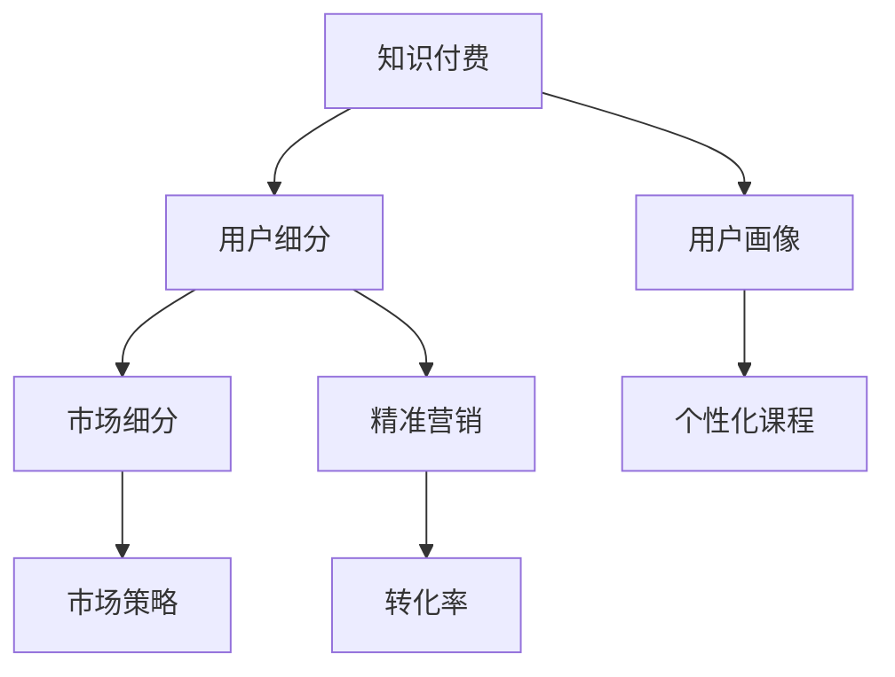

                 

# 知识付费创业的用户细分方法论

> 关键词：知识付费, 用户细分, 用户画像, 市场细分, 精准营销

## 1. 背景介绍

### 1.1 问题由来

在信息爆炸的时代，知识获取变得更为便利，但随之而来的是信息噪音的增多。如何高效、精准地筛选出有价值的信息，成为了用户面临的重要挑战。与此同时，大量知识生产者也面临知识难以变现、用户粘性不足等困境。在这样的背景下，知识付费创业应运而生，通过付费订阅的方式，为用户提供高质量、高价值的知识服务。

然而，如何精准定位目标用户，设计符合用户需求的课程，并制定有效的营销策略，成为知识付费创业者必须解决的难题。本文将深入探讨知识付费创业中的用户细分方法论，从用户画像、市场细分、精准营销等多个维度，提出系统性的策略和方法，为创业者提供有价值的指导。

### 1.2 问题核心关键点

在知识付费创业中，用户细分是基础，用户画像和市场细分是手段，精准营销是结果。这一系列过程相辅相成，共同构成了知识付费创业的核心竞争力。

- **用户画像**：通过数据挖掘和分析，构建目标用户的特征和需求，为个性化课程设计提供依据。
- **市场细分**：根据用户的特征和需求，将市场划分为不同的细分市场，以便更有效地设计针对性策略。
- **精准营销**：结合用户画像和市场细分，设计出精准的营销策略，实现高效转化。

本文将重点阐述用户细分的核心概念、基本方法和应用案例，帮助创业者提升运营效率和市场竞争力。

## 2. 核心概念与联系

### 2.1 核心概念概述

为更好地理解知识付费创业中的用户细分方法论，本节将介绍几个密切相关的核心概念：

- **知识付费**：通过付费方式获取知识内容，支付对价的实体或平台，涵盖了内容创作、平台运营等多个环节。
- **用户细分**：将大规模用户群按照一定标准划分为多个子群体，便于制定个性化策略和提高转化率。
- **用户画像**：基于用户行为数据，构建的典型用户特征和需求描述，便于精准定位和定制化服务。
- **市场细分**：将市场按照用户需求、行为特征等标准划分为不同的细分市场，便于制定针对性强、效果明显的营销策略。
- **精准营销**：基于用户画像和市场细分，设计出精准有效的营销策略，实现目标用户的高效转化。

这些核心概念之间的逻辑关系可以通过以下Mermaid流程图来展示：



这个流程图展示了这个知识付费创业的逻辑流程：

1. 知识付费通过平台和内容创作者，提供高质量的知识服务。
2. 用户细分将用户按需求和特征划分为不同的群体。
3. 用户画像进一步描述每个子群体的特征和需求。
4. 市场细分针对不同群体设计不同的市场策略。
5. 精准营销通过优化策略实现高转化率。
6. 个性化课程和市场策略的结合，满足不同群体的需求，提升用户体验和转化。

## 3. 核心算法原理 & 具体操作步骤
### 3.1 算法原理概述

知识付费创业中的用户细分，本质上是基于用户数据的分类和聚类分析过程。其核心思想是：通过对用户行为、兴趣、支付意愿等数据进行分析，找出用户共性和差异，将用户按照一定标准划分为不同的子群体，以便制定针对性的策略。

形式化地，假设用户集为 $U$，特征集为 $F=\{f_1,f_2,...,f_n\}$，用户分类函数为 $C: U \rightarrow \{C_1, C_2, ..., C_k\}$，其中 $C_i$ 为第 $i$ 个子群体，$k$ 为子群体的数量。

用户细分的优化目标是找到最优的分类函数 $C^*$，使得在满足一定的约束条件（如用户数量、细分标准等）的前提下，最大化子群体的同质性或差异性，从而提升营销策略的有效性。

### 3.2 算法步骤详解

基于用户数据的分类和聚类分析，用户细分可以分为以下几个关键步骤：

**Step 1: 数据收集与处理**
- 收集用户行为数据，包括但不限于浏览记录、购买记录、评论反馈等。
- 对原始数据进行清洗和预处理，如去重、格式转换、缺失值填充等。
- 使用标准化技术（如归一化、标准化）处理数据，以便后续分析。

**Step 2: 用户特征提取**
- 根据用户行为数据，提取有意义的特征。例如，用户购买频次、浏览深度、评论情感等。
- 使用特征工程技术（如特征选择、特征构造）提升特征的区分度和代表性。
- 将用户特征向量表示为高维向量或嵌入向量，以便于模型处理。

**Step 3: 用户分类与聚类**
- 选择合适的分类或聚类算法（如K-means、层次聚类、DBSCAN等）进行用户划分。
- 根据聚类结果和业务需求，调整聚类算法参数，优化聚类效果。
- 将聚类结果可视化，分析每个子群体的特征和需求。

**Step 4: 用户画像构建**
- 根据用户分类和聚类结果，构建每个子群体的用户画像。
- 使用统计分析和文本挖掘技术，提取和描述用户特征和需求。
- 构建用户画像的可视化工具，方便数据分析和展示。

**Step 5: 市场细分与策略制定**
- 根据用户画像和细分标准，将市场划分为不同的细分市场。
- 分析每个细分市场的规模、特点和竞争情况，确定优先级。
- 设计针对性的市场策略，包括内容定位、定价策略、推广渠道等。

**Step 6: 精准营销与评估**
- 根据市场策略，进行精准营销，如定向广告、个性化推荐等。
- 监控营销效果，收集用户反馈，评估转化率和满意度。
- 根据评估结果，不断优化市场策略和用户细分模型。

### 3.3 算法优缺点

基于用户数据的分类和聚类分析，用户细分方法具有以下优点：

- 能够全面分析用户行为和需求，为个性化服务提供依据。
- 通过细分市场，优化资源配置，提高营销策略的针对性。
- 能够发现用户的共性和差异，提升用户满意度。

同时，该方法也存在以下局限性：

- 依赖于高质量的数据，数据偏差可能导致细分结果不准确。
- 数据处理和分析过程复杂，需要较高的技术门槛。
- 子群体的数量和定义可能影响细分效果和策略制定。
- 用户行为和需求的变化可能影响细分结果的有效性。

尽管存在这些局限性，但用户细分方法在知识付费创业中依然具有重要的应用价值，特别是在面对大规模用户群体和复杂市场环境时，能够提供系统性的解决方案。

### 3.4 算法应用领域

用户细分方法在知识付费创业中具有广泛的应用场景，包括但不限于：

- **课程设计**：根据用户画像和市场细分，设计符合不同用户需求和特征的课程内容。
- **推广策略**：针对不同的用户群体，制定精准的推广策略，提高转化率。
- **内容推荐**：基于用户画像和行为数据，进行个性化推荐，提升用户体验。
- **客户服务**：根据用户画像，优化客户服务流程，提高用户粘性和满意度。
- **数据分析**：利用用户细分结果，进行深入的市场分析和预测，指导业务决策。

除了上述这些核心应用场景外，用户细分方法还可以应用于用户行为预测、品牌建设、客户关系管理等多个领域，为知识付费创业提供全面的支持和指导。

## 4. 数学模型和公式 & 详细讲解 & 举例说明
### 4.1 数学模型构建

本节将使用数学语言对知识付费创业中的用户细分方法进行更加严格的刻画。

假设用户集为 $U$，特征集为 $F=\{f_1,f_2,...,f_n\}$，用户分类函数为 $C: U \rightarrow \{C_1, C_2, ..., C_k\}$，其中 $C_i$ 为第 $i$ 个子群体，$k$ 为子群体的数量。

定义用户 $u$ 在特征集 $F$ 上的特征向量为 $\mathbf{u}=\{u_{f_1}, u_{f_2}, ..., u_{f_n}\}$，其中 $u_{f_i}$ 为特征 $f_i$ 的取值。

用户分类的目标是通过训练一个分类函数 $C$，使得 $C(u)$ 能够将用户 $u$ 划分到最合适的子群体 $C_i$ 中。

### 4.2 公式推导过程

以下我们以K-means聚类算法为例，推导用户分类的数学模型。

假设用户集 $U=\{u_1, u_2, ..., u_m\}$，特征集 $F=\{f_1,f_2,...,f_n\}$，用户分类函数 $C: U \rightarrow \{C_1, C_2, ..., C_k\}$。

**目标函数**：最小化用户 $u$ 与其所属子群体的中心点之间的距离。

设每个子群体的中心点为 $\mu_i$，则目标函数为：

$$
\min_{C(u), \mu_1, \mu_2, ..., \mu_k} \sum_{u \in C(u)} ||u - \mu_{C(u)}||^2
$$

其中 $\mu_{C(u)}$ 为子群体 $C(u)$ 的中心点。

**优化算法**：通过迭代优化，求解最小化目标函数。

K-means算法的具体步骤如下：

1. 随机初始化 $k$ 个子群体的中心点 $\mu_1, \mu_2, ..., \mu_k$。
2. 对于每个用户 $u$，计算其到每个子群体的中心点距离，并将其划分到最近的子群体 $C(u)$。
3. 对于每个子群体 $C_i$，重新计算其中心点 $\mu_i$，作为优化目标。
4. 重复步骤2和3，直到中心点不再变化或达到预设的迭代次数。

通过上述推导，我们可以看到，用户细分的数学模型是一个多目标优化问题，其目标是最小化用户与子群体中心点之间的距离，从而实现用户的聚类和分类。

### 4.3 案例分析与讲解

**案例分析**：某在线教育平台根据用户浏览和购买行为数据，使用K-means算法进行用户细分。

**数据收集**：收集用户的历史浏览记录、购买记录和评论反馈。

**特征提取**：提取用户购买频次、浏览深度、评论情感等特征。

**用户分类**：使用K-means算法，将用户分为高价值用户、潜在用户、低价值用户等不同子群体。

**用户画像**：对每个子群体进行分析，构建用户画像。例如，高价值用户通常购买高频、互动性强，低价值用户通常互动少、复购率低。

**市场细分**：根据用户画像和细分标准，将市场分为高价值用户市场、潜在用户市场和低价值用户市场。

**策略制定**：针对不同市场，设计个性化推广策略。例如，针对高价值用户市场，提供高质量课程和优惠活动；针对潜在用户市场，进行定向广告和推荐；针对低价值用户市场，进行离网提醒和再营销。

通过上述分析，我们可以看到，用户细分方法能够帮助在线教育平台更好地了解用户需求，设计个性化服务，提高用户粘性和转化率。

## 5. 项目实践：代码实例和详细解释说明
### 5.1 开发环境搭建

在进行用户细分实践前，我们需要准备好开发环境。以下是使用Python进行K-means算法实现的环境配置流程：

1. 安装Anaconda：从官网下载并安装Anaconda，用于创建独立的Python环境。

2. 创建并激活虚拟环境：
```bash
conda create -n user细分-env python=3.8 
conda activate user细分-env
```

3. 安装必要的库：
```bash
conda install numpy pandas scikit-learn matplotlib tqdm jupyter notebook ipython
```

4. 安装K-means算法库：
```bash
pip install scikit-learn
```

完成上述步骤后，即可在`user细分-env`环境中开始用户细分实践。

### 5.2 源代码详细实现

下面我们以用户细分和个性化推荐为例，给出使用K-means算法和推荐系统的Python代码实现。

首先，定义用户行为数据和特征：

```python
import pandas as pd
from sklearn.preprocessing import StandardScaler
from sklearn.cluster import KMeans

# 读取用户行为数据
user_data = pd.read_csv('user_behavior_data.csv')

# 提取特征
features = ['purchase_frequency', 'view_depth', 'comment_sentiment']

# 标准化特征
scaler = StandardScaler()
scaled_features = scaler.fit_transform(user_data[features])
```

然后，使用K-means算法进行用户分类：

```python
# 设定子群体的数量
k = 3

# 使用K-means算法进行用户分类
kmeans = KMeans(n_clusters=k)
kmeans.fit(scaled_features)
```

接着，根据用户分类结果进行个性化推荐：

```python
# 根据分类结果生成推荐列表
def generate_recommendations(user_id, kmeans, features, user_data):
    # 获取用户特征向量
    user_feature = user_data.loc[user_id, features]
    
    # 计算用户到每个子群体的距离
    distances = kmeans.transform(user_feature.reshape(1, -1))
    
    # 找到最近的子群体
    closest_cluster = kmeans.predict(user_feature.reshape(1, -1))[0]
    
    # 获取该子群体的推荐课程
    recommendations = user_data[user_data['cluster'] == closest_cluster]['course']
    
    return recommendations

# 获取用户推荐
user_id = 12345
recommendations = generate_recommendations(user_id, kmeans, features, user_data)
```

最后，在Jupyter Notebook中展示推荐结果：

```python
# 显示推荐课程
print("推荐课程：", recommendations)
```

以上就是使用Python进行用户细分和个性化推荐的完整代码实现。可以看到，K-means算法在用户分类中扮演了重要角色，通过计算用户到每个子群体的距离，实现个性化推荐。

### 5.3 代码解读与分析

让我们再详细解读一下关键代码的实现细节：

**用户行为数据**：
- `pd.read_csv('user_behavior_data.csv')`：从CSV文件中读取用户行为数据。

**特征提取**：
- `features`：定义用户行为特征，如购买频率、浏览深度、评论情感等。

**数据标准化**：
- `StandardScaler()`：对特征进行标准化处理，避免因特征尺度差异导致的影响。

**K-means算法**：
- `kmeans = KMeans(n_clusters=k)`：设定子群体的数量为3。
- `kmeans.fit(scaled_features)`：使用K-means算法对特征进行聚类，得到每个用户的子群体。

**推荐生成**：
- `generate_recommendations`：根据用户ID和K-means算法结果，生成推荐课程。
- `kmeans.transform(user_feature.reshape(1, -1))`：计算用户特征向量到每个子群体的距离。
- `closest_cluster = kmeans.predict(user_feature.reshape(1, -1))[0]`：找到用户所属的最近子群体。
- `recommendations = user_data[user_data['cluster'] == closest_cluster]['course']`：根据子群体，生成推荐课程列表。

通过上述代码，我们可以看到，K-means算法在用户细分和个性化推荐中起到了关键作用，通过计算用户到每个子群体的距离，实现了对用户的精准分类和个性化服务。

## 6. 实际应用场景

### 6.1 在线教育

在在线教育领域，用户细分方法可以应用于课程设计和推广策略制定。通过用户细分，在线教育平台能够更好地了解用户需求，设计符合不同用户特征的课程内容，制定精准的推广策略，提高用户粘性和转化率。

例如，某在线教育平台根据用户历史学习数据和行为特征，使用K-means算法进行用户细分，将用户分为不同兴趣群体，分别为他们设计了编程、设计、商务等不同类型的课程。通过个性化推荐和精准营销，该平台成功吸引了大量新用户，并提高了用户购买率和复购率。

### 6.2 社交媒体

在社交媒体领域，用户细分方法可以应用于内容推荐和广告投放。通过用户细分，社交媒体平台能够更好地了解用户兴趣和需求，进行个性化内容推荐，提高用户粘性。同时，通过精准的广告投放，平台能够实现更高的广告点击率和转化率。

例如，某社交媒体平台根据用户点赞、评论、分享等行为数据，使用聚类算法进行用户细分，将用户分为不同兴趣群体。通过分析每个群体的兴趣和需求，平台能够为用户推荐更加符合他们喜好的内容，并设计针对性的广告投放策略，大幅提高了广告的点击率和转化率。

### 6.3 电子商务

在电子商务领域，用户细分方法可以应用于个性化推荐和营销策略制定。通过用户细分，电商平台能够更好地了解用户需求，设计符合不同用户特征的推荐策略，提高用户购买率和复购率。

例如，某电商平台根据用户浏览和购买行为数据，使用聚类算法进行用户细分，将用户分为不同兴趣群体。通过分析每个群体的兴趣和需求，平台能够为用户推荐更加符合他们喜好的商品，并设计针对性的营销策略，大幅提高了用户购买率和复购率。

## 7. 工具和资源推荐

### 7.1 学习资源推荐

为了帮助开发者系统掌握用户细分方法论的理论基础和实践技巧，这里推荐一些优质的学习资源：

1. **K-means算法相关书籍**：《K-means算法详解》、《聚类分析与数据挖掘》等书籍，详细介绍了K-means算法的原理和应用方法。
2. **机器学习课程**：如Coursera的《机器学习》课程，深入讲解了聚类分析、特征工程等核心技术。
3. **在线学习平台**：如Kaggle、DataCamp等平台，提供大量用户分类的实践案例和竞赛，帮助开发者提升实战能力。
4. **论文和综述**：如《K-means算法研究综述》、《聚类算法分类与比较》等论文，提供了丰富的理论背景和应用案例。

通过对这些资源的学习实践，相信你一定能够快速掌握用户细分方法的精髓，并用于解决实际的商业问题。

### 7.2 开发工具推荐

高效的开发离不开优秀的工具支持。以下是几款用于用户细分开发的常用工具：

1. **Python**：作为数据科学和机器学习的通用语言，Python拥有丰富的数据分析和机器学习库，如NumPy、Pandas、Scikit-learn等，是进行用户细分开发的首选语言。
2. **Jupyter Notebook**：一个交互式的数据分析工具，方便进行代码实验和结果展示。
3. **DataFrames**：如Pandas，用于高效处理和分析大数据集，便于用户细分数据的存储和处理。
4. **K-means库**：如Scikit-learn，提供了丰富的K-means算法实现，便于快速开发和实验。
5. **可视化工具**：如Matplotlib、Seaborn等，用于数据可视化，帮助分析用户细分结果。

合理利用这些工具，可以显著提升用户细分任务的开发效率，加快创新迭代的步伐。

### 7.3 相关论文推荐

用户细分技术的发展源于学界的持续研究。以下是几篇奠基性的相关论文，推荐阅读：

1. **K-means算法**：《K-means算法及其应用》，详细介绍了K-means算法的原理和应用方法。
2. **聚类分析**：《聚类分析理论与实践》，涵盖了聚类算法的多种方法，并提供了丰富的应用案例。
3. **用户细分**：《基于用户细分的数据挖掘技术》，探讨了用户分类的多种方法，并应用于多个实际场景。
4. **个性化推荐**：《个性化推荐系统综述》，提供了多种推荐算法的比较和应用方法。
5. **机器学习在商业应用中的应用**：《机器学习在零售业的应用》，探讨了机器学习在商业领域的多个应用场景，包括用户细分和推荐系统。

这些论文代表了大数据和人工智能领域的研究方向，通过学习这些前沿成果，可以帮助研究者把握学科前进方向，激发更多的创新灵感。

## 8. 总结：未来发展趋势与挑战

### 8.1 总结

本文对知识付费创业中的用户细分方法论进行了全面系统的介绍。首先阐述了用户细分的核心概念和基本方法，明确了用户细分在知识付费创业中的重要地位和应用价值。其次，从用户画像、市场细分、精准营销等多个维度，详细讲解了用户细分的基本步骤和实现方法。最后，结合实际应用场景，提出了系统化的用户细分策略，为知识付费创业者提供有价值的指导。

通过本文的系统梳理，可以看到，用户细分方法在知识付费创业中具有重要的应用价值，特别是在面对大规模用户群体和复杂市场环境时，能够提供系统性的解决方案。基于用户数据的分类和聚类分析，用户细分方法能够全面分析用户行为和需求，为个性化服务提供依据，提高营销策略的针对性和效果。

### 8.2 未来发展趋势

展望未来，用户细分技术将呈现以下几个发展趋势：

1. **自动化和智能化**：随着深度学习和人工智能技术的发展，用户细分将逐步实现自动化和智能化。机器学习算法能够自动进行用户分类和聚类，提升细分的效率和准确性。
2. **多模态数据融合**：未来的用户细分将不仅仅依赖于用户行为数据，而是能够融合多种数据来源，如社交媒体、物联网等，提升细分的效果和覆盖面。
3. **跨领域应用**：用户细分方法将在更多领域得到应用，如金融、医疗、教育等，为用户提供更精准的服务和更好的体验。
4. **个性化推荐**：结合用户细分和推荐系统，实现更高效、个性化的推荐，提高用户粘性和转化率。
5. **实时分析和反馈**：用户细分将实现实时分析和反馈，及时调整策略，提升用户满意度和平台竞争力。

以上趋势凸显了用户细分技术的广阔前景，这些方向的探索发展，必将进一步提升用户细分的精度和效果，为知识付费创业提供更全面的支持。

### 8.3 面临的挑战

尽管用户细分技术在知识付费创业中已经取得了显著成效，但在迈向更加智能化、普适化应用的过程中，仍面临诸多挑战：

1. **数据隐私和安全**：用户行为数据和个人信息的隐私和安全问题，成为用户细分技术应用的重要障碍。如何保护用户隐私，避免数据泄露，成为亟待解决的问题。
2. **数据质量问题**：用户行为数据存在质量问题，如数据缺失、噪音等，可能影响细分的准确性。如何提高数据质量，确保数据可用性，将是未来的重要研究方向。
3. **算法复杂度**：用户细分算法复杂度高，需要处理大规模数据集，计算资源消耗较大。如何优化算法，提高计算效率，降低资源消耗，是一个重要的挑战。
4. **模型可解释性**：用户细分模型通常是"黑盒"系统，难以解释其内部工作机制和决策逻辑。如何赋予模型更强的可解释性，增强用户信任，将是未来的研究重点。
5. **市场动态变化**：用户需求和市场环境变化快，用户细分模型需要不断更新和优化，以适应变化。如何构建动态用户细分模型，实现持续优化，是一个重要的研究课题。

### 8.4 研究展望

面对用户细分面临的挑战，未来的研究需要在以下几个方面寻求新的突破：

1. **数据隐私保护**：研究新的数据隐私保护技术，如联邦学习、差分隐私等，在保护用户隐私的前提下，实现高效的用户细分。
2. **数据预处理技术**：开发高效的数据预处理技术，如数据清洗、缺失值填充、异常值检测等，提高数据质量和可用性。
3. **高效算法**：研究新的高效算法，如近似聚类算法、分布式聚类算法等，提升细分的效率和可扩展性。
4. **模型可解释性**：引入可解释性技术，如LIME、SHAP等，增强用户细分模型的可解释性，提升用户信任度。
5. **动态用户细分**：研究动态用户细分模型，通过实时分析用户行为数据，实现持续优化和调整。

这些研究方向的探索，必将引领用户细分技术迈向更高的台阶，为知识付费创业提供更全面、高效、安全的解决方案。总之，用户细分技术需要不断地创新和优化，才能满足不断变化的商业需求，提升用户满意度和平台竞争力。

## 9. 附录：常见问题与解答

**Q1：用户细分中的K-means算法有哪些改进？**

A: K-means算法在用户细分中有多种改进，包括：

1. **K-means++**：通过改进初始点选择策略，提高聚类效果。
2. **层次聚类**：通过自底向上的聚类方法，得到多层次的聚类结果，更细致地描述用户特征。
3. **DBSCAN**：通过密度聚类方法，发现任意形状的聚类，避免K-means对数据分布的假设限制。
4. **谱聚类**：通过谱分析方法，实现更高效、更准确的聚类，适合处理大规模数据集。

这些改进算法均基于K-means的基本思想，通过不同的初始化策略、聚类方法或特征表示方式，提升聚类效果和用户细分的准确性。

**Q2：如何进行用户行为数据的预处理？**

A: 用户行为数据的预处理是用户细分的重要步骤，包括以下几个关键步骤：

1. **数据清洗**：去除重复数据、异常值和噪音，确保数据质量。
2. **数据转换**：将原始数据转换为数值型数据，便于后续分析。
3. **特征构造**：通过特征工程技术，构造新的有区分度的特征。
4. **数据标准化**：对数据进行标准化处理，避免特征尺度差异带来的影响。
5. **缺失值处理**：使用均值、中位数等方法填补缺失值，确保数据完整性。

通过这些预处理步骤，可以提升用户细分的数据质量，提高聚类算法的准确性和用户细分的有效性。

**Q3：如何衡量用户细分的质量？**

A: 衡量用户细分的质量通常从以下几个方面考虑：

1. **聚类效果**：通过计算聚类内部的离散度和聚类之间的差异度，衡量聚类效果。
2. **业务指标**：结合业务指标，如用户转化率、复购率等，评估用户细分的实际效果。
3. **用户满意度**：通过问卷调查或用户反馈，评估用户对细分结果的满意度。

通过这些指标的综合评估，可以全面了解用户细分的质量，发现和改进细分的优化点。

---

作者：禅与计算机程序设计艺术 / Zen and the Art of Computer Programming

