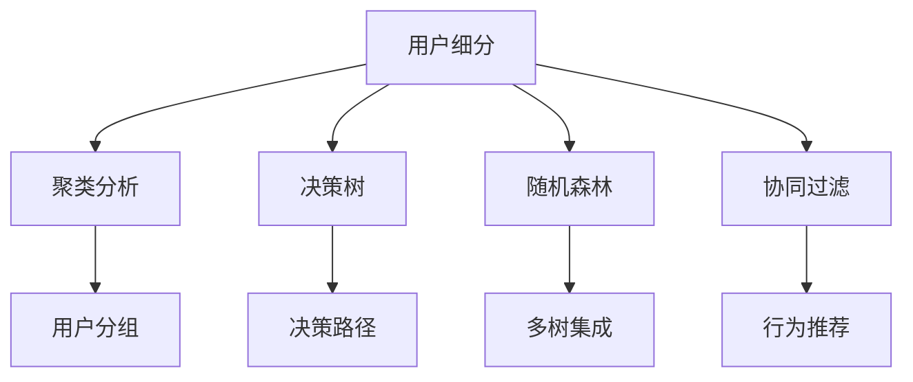

                 

## 1. 背景介绍

### 1.1 问题由来

随着互联网和数字化教育的普及，知识付费成为一种新的学习模式。然而，知识付费市场存在用户留存率低、内容同质化严重、内容质量难以保证等问题。这些问题不仅影响了知识付费平台的发展，也影响了用户的真实学习效果。因此，如何科学地进行用户细分，精准定位用户需求，提升内容的质量与个性化程度，成为知识付费创业的重要课题。

### 1.2 问题核心关键点

用户细分的核心在于通过对用户数据进行深度分析和聚类，找出用户的关键特征，并据此对用户进行分类，以实现精准营销和内容推送。通常包括以下几个关键步骤：

- 数据采集：收集用户行为数据，如浏览记录、购买行为、评价反馈等。
- 数据预处理：对数据进行清洗、归一化等预处理，保证数据质量。
- 特征工程：提取有意义的特征，用于后续的聚类分析。
- 聚类分析：使用机器学习算法，对用户进行分类。
- 细分实施：根据聚类结果，制定相应的营销策略和内容推送方案。

本文聚焦于用户细分方法论，旨在帮助知识付费创业公司科学地进行用户细分，提升用户体验和平台留存率。

### 1.3 问题研究意义

研究用户细分方法论，对于知识付费平台具有重要的实际意义：

- 提升用户留存率。通过细分用户，有针对性地推送个性化内容，提升用户粘性。
- 提高内容质量。基于用户特征，精准定位用户需求，提高内容生产的针对性和质量。
- 优化营销策略。根据用户细分结果，制定更有效的推广和营销策略，提升平台收入。
- 降低运营成本。精细化运营，减少资源浪费，提升运营效率。
- 增强平台竞争力。通过细分用户，实现差异化服务，形成独特的市场竞争优势。

## 2. 核心概念与联系

### 2.1 核心概念概述

为更好地理解用户细分方法论，本节将介绍几个密切相关的核心概念：

- **用户细分（User Segmentation）**：根据用户属性、行为和需求等特征，将用户分为不同的群体，以便进行更精准的营销和内容推送。

- **聚类分析（Clustering Analysis）**：一种无监督学习方法，通过相似性度量将相似数据点归为同一组，形成聚类。聚类分析是用户分细的主要手段。

- **决策树（Decision Tree）**：一种基于树形结构的分类算法，通过对特征进行划分，逐步构建决策路径，实现分类。

- **随机森林（Random Forest）**：一种集成学习算法，通过构建多个决策树并取平均，提升分类准确率和鲁棒性。

- **协同过滤（Collaborative Filtering）**：一种基于用户行为和物品特征进行推荐的方法，常用于个性化推荐系统。

这些核心概念之间的逻辑关系可以通过以下Mermaid流程图来展示：



这个流程图展示了一系列关键概念之间的逻辑关系：

1. 用户细分是整个方法论的起点。
2. 聚类分析、决策树、随机森林和协同过滤等算法，用于对用户进行聚类和分类。
3. 聚类分析通过相似性度量将用户分成不同群体。
4. 决策树和随机森林通过划分特征进行分类。
5. 协同过滤基于用户行为进行推荐，提升个性化程度。
6. 用户分组和决策路径、多树集成等，用于指导具体的营销和内容推送策略。

这些概念共同构成了用户细分方法论的框架，为知识付费平台的精准营销和个性化服务提供科学依据。

## 3. 核心算法原理 & 具体操作步骤

### 3.1 算法原理概述

用户细分的方法论基于机器学习与数据挖掘技术，通过聚类分析等算法对用户进行分组。其核心思想是：通过分析用户的多种属性，如浏览行为、购买记录、反馈评价等，找到用户之间的共性和差异，将其分为不同的群体，从而实现精准营销和内容推送。

### 3.2 算法步骤详解

用户细分的基本步骤如下：

**Step 1: 数据准备**
- 收集用户数据，包括浏览记录、购买行为、评价反馈等。
- 对数据进行清洗和预处理，如去重、缺失值填充、特征归一化等。

**Step 2: 特征提取**
- 提取有意义的特征，如用户活跃度、浏览偏好、购买频率等。
- 对不同特征进行编码，如二值化、标准化等。

**Step 3: 聚类分析**
- 选择合适的聚类算法，如K-means、层次聚类等。
- 设置聚类参数，如簇数、迭代次数等。
- 对数据进行聚类，生成用户分组。

**Step 4: 模型评估**
- 使用评价指标，如轮廓系数、Calinski-Harabasz指数等，评估聚类效果。
- 根据评估结果调整聚类参数，重新聚类。

**Step 5: 用户分组**
- 根据聚类结果，将用户分为不同的群体。
- 为每个用户群体设计针对性的营销策略和内容推送方案。

**Step 6: 结果实施**
- 实施营销策略和内容推送方案。
- 持续监控用户反馈和行为，优化策略。

以上是用户细分的基本步骤。在实际应用中，还需要根据具体场景和需求，对各步骤进行优化和调整。

### 3.3 算法优缺点

用户细分的方法论具有以下优点：

- 科学性：基于数据挖掘和机器学习，有严格的数学依据和算法支撑。
- 可操作性：方法论步骤清晰，易于实施。
- 精准性：通过聚类分析等算法，可以更准确地把握用户需求。

同时，该方法论也存在一定的局限性：

- 依赖数据：聚类分析等算法需要大量高质量的数据，数据获取成本较高。
- 模型复杂：聚类算法等需要调参，模型选择和参数设置较为复杂。
- 解释性差：聚类结果通常缺乏直观解释，难以理解。

尽管存在这些局限性，但就目前而言，用户细分的方法论仍然是用户需求精准定位和个性化服务的重要手段。未来相关研究的方向在于如何进一步降低数据获取成本，提升模型可解释性，并开发更高效、更灵活的用户细分算法。

### 3.4 算法应用领域

用户细分的方法论在多个领域中得到广泛应用，包括但不限于：

- **知识付费平台**：对用户进行细分，推送个性化内容，提升用户粘性和留存率。
- **电商平台**：根据用户行为和购买记录，进行商品推荐，提升转化率和销售额。
- **社交媒体**：通过用户兴趣和互动行为，进行内容推荐，提升用户参与度和活跃度。
- **金融服务**：基于用户财务数据，进行风险评估和个性化理财推荐。
- **健康医疗**：根据用户健康数据，进行疾病诊断和健康管理推荐。

这些领域中，用户细分的应用效果显著，成为了提高服务质量和用户满意度的重要手段。

## 4. 数学模型和公式 & 详细讲解 & 举例说明

### 4.1 数学模型构建

用户细分的数学模型可以基于聚类算法构建，常用的聚类算法包括K-means、层次聚类、DBSCAN等。这里以K-means算法为例，介绍用户分细的数学模型构建过程。

假设用户特征集为 $\mathbf{X} = [\mathbf{x}_1, \mathbf{x}_2, \ldots, \mathbf{x}_n] \in \mathbb{R}^{n \times d}$，其中 $n$ 为样本数，$d$ 为特征数。设聚类中心数为 $k$，初始聚类中心 $\mathbf{C}^{(0)} = [\mathbf{c}_1, \mathbf{c}_2, \ldots, \mathbf{c}_k] \in \mathbb{R}^{k \times d}$。

用户细分的目标是最小化聚类误差函数：

$$
\min_{\mathbf{C}} \sum_{i=1}^n \min_{\mathbf{c}_j \in \mathbf{C}} ||\mathbf{x}_i - \mathbf{c}_j||^2
$$

其中 $\min_{\mathbf{c}_j \in \mathbf{C}} ||\mathbf{x}_i - \mathbf{c}_j||^2$ 表示样本 $\mathbf{x}_i$ 到聚类中心 $\mathbf{c}_j$ 的距离。

### 4.2 公式推导过程

K-means算法的迭代过程分为两个步骤：

**Step 1: 确定聚类中心**
- 随机初始化聚类中心 $\mathbf{C}^{(0)}$。
- 计算每个样本 $\mathbf{x}_i$ 到每个聚类中心的距离 $d_i^j = ||\mathbf{x}_i - \mathbf{c}_j||^2$。

**Step 2: 更新聚类中心**
- 对于每个样本 $\mathbf{x}_i$，将其分配到最近的聚类中心 $\mathbf{c}_k$，更新 $\mathbf{x}_i$ 所属的簇。
- 对每个簇，重新计算聚类中心 $\mathbf{c}_k = \frac{1}{|\mathbf{D}_k|} \sum_{\mathbf{x}_i \in \mathbf{D}_k} \mathbf{x}_i$，其中 $\mathbf{D}_k$ 表示簇 $k$ 中所有样本组成的集合。

迭代进行 Step 1 和 Step 2，直到聚类中心不再变化或达到预设迭代次数。

### 4.3 案例分析与讲解

以一个电商平台的用户数据为例，进行用户细分。设用户特征包括浏览时间、购买频率、评价评分等。

**Step 1: 数据准备**
- 收集用户浏览记录、购买记录、评价反馈等数据。
- 对数据进行清洗和预处理，如去重、缺失值填充、特征归一化等。

**Step 2: 特征提取**
- 提取用户活跃度、浏览偏好、购买频率等特征。
- 对不同特征进行编码，如二值化、标准化等。

**Step 3: 聚类分析**
- 使用K-means算法，设置聚类中心数为3，进行聚类。
- 对聚类结果进行评估，调整聚类中心数，重新聚类。

**Step 4: 用户分组**
- 根据聚类结果，将用户分为3个群体。
- 为每个用户群体设计针对性的营销策略和内容推送方案。

**Step 5: 结果实施**
- 实施营销策略和内容推送方案。
- 持续监控用户反馈和行为，优化策略。

通过上述步骤，可以将用户分为高频购物群体、中等消费群体和低频购物群体，针对不同群体设计不同的营销策略，如对高频购物群体推送优惠活动，对中等消费群体推送个性化推荐，对低频购物群体进行重新触达。

## 5. 项目实践：代码实例和详细解释说明

### 5.1 开发环境搭建

在进行用户细分实践前，我们需要准备好开发环境。以下是使用Python进行Scikit-learn开发的环境配置流程：

1. 安装Anaconda：从官网下载并安装Anaconda，用于创建独立的Python环境。

2. 创建并激活虚拟环境：
```bash
conda create -n sk-env python=3.8 
conda activate sk-env
```

3. 安装Scikit-learn：
```bash
pip install scikit-learn
```

4. 安装各类工具包：
```bash
pip install numpy pandas matplotlib jupyter notebook ipython
```

完成上述步骤后，即可在`sk-env`环境中开始用户细分实践。

### 5.2 源代码详细实现

下面我们以K-means算法为例，给出使用Scikit-learn对电商平台用户数据进行聚类的Python代码实现。

首先，定义数据处理函数：

```python
from sklearn.preprocessing import StandardScaler
from sklearn.cluster import KMeans

def preprocess_data(data):
    scaler = StandardScaler()
    scaled_data = scaler.fit_transform(data)
    return scaled_data
```

然后，定义聚类函数：

```python
def kmeans_clustering(data, n_clusters=3, max_iter=300):
    kmeans = KMeans(n_clusters=n_clusters, max_iter=max_iter)
    kmeans.fit(data)
    return kmeans.labels_, kmeans.cluster_centers_
```

接着，定义数据加载和输出函数：

```python
import pandas as pd
import matplotlib.pyplot as plt

def load_data(file_path):
    data = pd.read_csv(file_path)
    features = data.drop('label', axis=1)
    labels = data['label']
    return features, labels

def visualize_clusters(data, labels, cluster_centers):
    plt.scatter(data[:, 0], data[:, 1], c=labels, cmap='viridis')
    plt.scatter(cluster_centers[:, 0], cluster_centers[:, 1], marker='*', s=200, c='red')
    plt.show()
```

最后，启动K-means聚类流程：

```python
features, labels = load_data('user_data.csv')
scaled_features = preprocess_data(features)
labels_, cluster_centers_ = kmeans_clustering(scaled_features, n_clusters=3, max_iter=300)
visualize_clusters(scaled_features, labels_, cluster_centers_)
```

以上就是使用Scikit-learn对电商平台用户数据进行聚类的完整代码实现。可以看到，借助Scikit-learn库，我们能够用相对简洁的代码完成K-means聚类，实现用户细分。

### 5.3 代码解读与分析

让我们再详细解读一下关键代码的实现细节：

**preprocess_data函数**：
- 使用StandardScaler对特征进行标准化处理，防止不同特征的量纲影响聚类效果。
- 返回标准化后的数据。

**kmeans_clustering函数**：
- 初始化KMeans模型，设置聚类中心数和迭代次数。
- 对数据进行聚类，返回聚类标签和聚类中心。

**load_data函数**：
- 加载用户数据，提取特征和标签。
- 返回特征和标签数据。

**visualize_clusters函数**：
- 对聚类结果进行可视化，展示不同簇的分布和聚类中心。

通过上述函数，我们完成了用户数据的预处理、聚类和可视化，得到了聚类结果。

## 6. 实际应用场景

### 6.1 智能客服系统

在智能客服系统中，用户细分有助于提升服务质量和用户体验。通过对用户进行细分，可以识别出高价值客户和潜在流失客户，实施针对性的服务和营销策略，提高客户满意度和忠诚度。

例如，某电商平台使用用户细分技术，将用户分为高频购物群体、中等消费群体和低频购物群体，对高频购物群体推送个性化推荐和专属优惠活动，对中等消费群体推送优惠券和精准广告，对低频购物群体重新触达，引导其回归购物。通过这种精细化运营，平台用户留存率和转化率显著提升。

### 6.2 个性化推荐系统

个性化推荐系统是用户细分的重要应用场景之一。通过对用户进行细分，可以发现用户对不同类型商品的偏好，实现更加精准的推荐。

例如，某视频平台使用用户细分技术，将用户分为追剧族、综艺族、体育族等不同群体，对追剧族推荐热门剧集，对综艺族推荐最新综艺，对体育族推荐体育赛事直播和精彩瞬间。通过这种个性化推荐，平台用户活跃度和满意度显著提升，平台留存率和收益增长显著。

### 6.3 金融服务

金融服务行业中的用户细分，可以用于风险评估和个性化理财推荐。通过对用户进行细分，可以识别出高风险客户和潜在高收益客户，实施针对性的服务和营销策略。

例如，某金融平台使用用户细分技术，将用户分为高风险客户和低风险客户，对高风险客户加强风控措施，对低风险客户推荐理财产品和金融服务。通过这种精细化运营，平台风险控制能力提升，客户满意度增强。

### 6.4 未来应用展望

未来，随着大数据和人工智能技术的进一步发展，用户细分技术将得到更广泛的应用和提升：

- 更加精准的用户细分：利用更丰富、更高质量的数据，提升用户分细的准确性和可靠性。
- 多模态数据融合：将用户的多模态数据（如浏览行为、购买记录、社交媒体行为等）结合起来，实现更全面的用户画像。
- 实时化用户细分：利用流式数据处理技术，实现对用户行为的实时分析，提升用户分细的动态性和实时性。
- 深度学习增强：利用深度学习技术，提升用户分细算法的精度和泛化能力。
- 联邦学习与隐私保护：利用联邦学习技术，实现用户数据在保护隐私的前提下进行协同分析。

这些趋势将进一步提升用户细分技术的效果和应用范围，为知识付费平台和其他数字化服务行业带来更大的价值。

## 7. 工具和资源推荐

### 7.1 学习资源推荐

为了帮助开发者系统掌握用户细分方法论的理论基础和实践技巧，这里推荐一些优质的学习资源：

1. 《Python数据科学手册》：全面介绍Python数据科学库的使用，包括Numpy、Pandas、Scikit-learn等，是数据科学入门必备。

2. 《机器学习实战》：经典的机器学习入门教材，涵盖K-means等聚类算法的详细实现和应用案例。

3. 《深度学习》（Ian Goodfellow等著）：深度学习领域的经典教材，详细介绍了深度学习算法的原理和应用。

4. Coursera《机器学习》课程：斯坦福大学开设的机器学习课程，有视频和作业，适合系统学习机器学习理论。

5. Kaggle竞赛平台：提供大量数据分析和机器学习竞赛，是提升实践能力的好去处。

通过对这些资源的学习实践，相信你一定能够快速掌握用户细分方法论的精髓，并用于解决实际的NLP问题。

### 7.2 开发工具推荐

高效的开发离不开优秀的工具支持。以下是几款用于用户细分开发的常用工具：

1. Python：Python是数据科学和机器学习领域的主流编程语言，具有强大的数据处理和分析能力。

2. Scikit-learn：Scikit-learn是Python数据科学库，集成了多种机器学习算法，包括K-means等聚类算法。

3. NumPy：NumPy是Python科学计算库，提供高性能数组操作和多维数组计算。

4. Pandas：Pandas是Python数据处理库，支持数据清洗、特征工程等操作。

5. Jupyter Notebook：Jupyter Notebook是一个交互式笔记本环境，支持Python代码的在线编写和执行。

合理利用这些工具，可以显著提升用户细分的开发效率，加快创新迭代的步伐。

### 7.3 相关论文推荐

用户细分技术的发展源于学界的持续研究。以下是几篇奠基性的相关论文，推荐阅读：

1. "A Fast One Pass Algorithm for the k-Means Clustering Problem"（1986年）：提出了K-means算法，开创了聚类分析的先河。

2. "The Hidden Markov Model"（1980年）：介绍了隐马尔可夫模型，用于序列数据建模和分类。

3. "Collaborative Filtering for Implicit Feedback Datasets"（2008年）：提出了协同过滤算法，用于个性化推荐系统。

4. "Decision Trees and Multidimensional Scaling"（1973年）：介绍了决策树算法，用于分类和特征选择。

5. "The Random Forest Algorithm for Multi-Class Classification"（2001年）：介绍了随机森林算法，用于提升分类准确率和鲁棒性。

这些论文代表了大数据和机器学习技术的发展脉络。通过学习这些前沿成果，可以帮助研究者把握学科前进方向，激发更多的创新灵感。

## 8. 总结：未来发展趋势与挑战

### 8.1 研究成果总结

本文对用户细分方法论进行了全面系统的介绍。首先阐述了用户细分在知识付费平台上的重要性和应用场景，明确了用户分细的科学性和可操作性。其次，从原理到实践，详细讲解了K-means等聚类算法和其实现步骤，给出了用户细分任务开发的完整代码实例。同时，本文还广泛探讨了用户细分在多个行业领域的应用前景，展示了用户细分技术的广阔前景。最后，精选了用户细分技术的各类学习资源，力求为读者提供全方位的技术指引。

通过本文的系统梳理，可以看到，用户细分方法论在知识付费平台和其他数字化服务行业中具有重要的实际意义，是提升用户体验和平台留存率的重要手段。未来，伴随大数据和人工智能技术的不断进步，用户细分技术也将迎来更大的突破和发展。

### 8.2 未来发展趋势

展望未来，用户细分技术将呈现以下几个发展趋势：

- 更加精准的用户细分：利用更丰富、更高质量的数据，提升用户分细的准确性和可靠性。
- 多模态数据融合：将用户的多模态数据（如浏览行为、购买记录、社交媒体行为等）结合起来，实现更全面的用户画像。
- 实时化用户细分：利用流式数据处理技术，实现对用户行为的实时分析，提升用户分细的动态性和实时性。
- 深度学习增强：利用深度学习技术，提升用户分细算法的精度和泛化能力。
- 联邦学习与隐私保护：利用联邦学习技术，实现用户数据在保护隐私的前提下进行协同分析。

以上趋势凸显了用户细分技术的广阔前景。这些方向的探索发展，必将进一步提升用户细分的效果和应用范围，为知识付费平台和其他数字化服务行业带来更大的价值。

### 8.3 面临的挑战

尽管用户细分技术已经取得了显著成效，但在迈向更加智能化、普适化应用的过程中，它仍面临着诸多挑战：

- 数据获取瓶颈：用户数据获取成本较高，数据质量难以保证。
- 模型复杂性：聚类算法等需要调参，模型选择和参数设置较为复杂。
- 可解释性差：聚类结果通常缺乏直观解释，难以理解。
- 数据隐私保护：用户数据隐私保护问题，如数据泄露、数据滥用等。

尽管存在这些挑战，但通过技术创新和政策支持，相信用户细分技术能够逐步克服这些难题，实现更加精准、高效的用户细分，为数字化服务行业带来更大的价值。

### 8.4 研究展望

面对用户细分技术所面临的种种挑战，未来的研究需要在以下几个方面寻求新的突破：

- 探索无监督和半监督聚类方法：摆脱对大量标注数据的依赖，利用自监督学习、主动学习等无监督和半监督范式，最大限度利用非结构化数据，实现更加灵活高效的聚类。
- 研究多模态数据融合方法：将用户的多模态数据结合起来，实现更全面的用户画像。
- 引入深度学习技术：利用深度学习技术，提升聚类算法的精度和泛化能力。
- 结合隐私保护技术：利用联邦学习等技术，保护用户隐私，实现数据协同分析。

这些研究方向的探索，必将引领用户细分技术迈向更高的台阶，为知识付费平台和其他数字化服务行业带来更大的价值。面向未来，用户细分技术还需要与其他人工智能技术进行更深入的融合，如知识表示、因果推理、强化学习等，多路径协同发力，共同推动自然语言理解和智能交互系统的进步。只有勇于创新、敢于突破，才能不断拓展用户细分技术的边界，让智能技术更好地造福人类社会。

## 9. 附录：常见问题与解答

**Q1：用户细分是否适用于所有行业？**

A: 用户细分技术适用于大多数行业，特别是数据驱动的数字化服务行业，如电商、金融、教育、医疗等。但需要注意的是，不同行业的用户数据特征不同，需要根据具体情况选择适合的细分方法和技术。

**Q2：用户细分的聚类算法有哪些？**

A: 用户细分的聚类算法主要有K-means、层次聚类、DBSCAN等。每种算法有其适用的场景和优缺点，选择时应根据具体需求和数据特点进行评估。

**Q3：如何评估用户细分的效果？**

A: 用户细分的评估主要通过聚类效果评估指标进行，如轮廓系数、Calinski-Harabasz指数、Davies-Bouldin指数等。这些指标可以帮助评估聚类结果的紧凑性和分离性，从而判断聚类算法的优劣。

**Q4：用户细分的聚类结果如何应用？**

A: 用户细分的聚类结果可以用于个性化推荐、营销策略制定、客户服务优化等。通过对用户进行细分，可以发现不同用户群体的需求和行为特征，制定针对性的服务和营销策略。

**Q5：用户细分对数据的要求有哪些？**

A: 用户细分的聚类算法对数据质量要求较高，需要保证数据的准确性、完整性和一致性。同时，需要避免数据泄露和滥用，保护用户隐私。

通过对这些问题的解答，我们更好地理解了用户细分技术的实际应用场景和挑战，相信在未来的研究和实践中，用户细分技术将更加成熟和高效，为知识付费平台和其他数字化服务行业带来更大的价值。

---

作者：禅与计算机程序设计艺术 / Zen and the Art of Computer Programming

