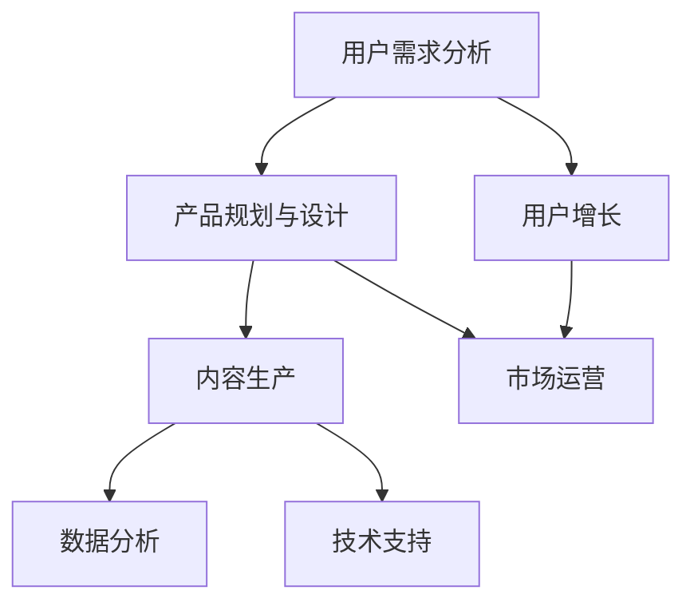

                 

## 1. 背景介绍

随着移动互联网和人工智能技术的迅猛发展，知识付费行业迎来了新的机遇和挑战。创业者的日常工作安排，不仅是产品的开发和迭代，更需要围绕市场趋势、用户需求、业务模式等方面进行全面的思考和布局。本文将从多个维度介绍知识付费创业者的日常工作安排，涵盖产品规划、市场运营、用户增长、内容生产等关键环节。

## 2. 核心概念与联系

### 2.1 核心概念概述

为了帮助读者更好地理解知识付费创业者的工作安排，本文将介绍几个核心概念及其联系：

- **知识付费**：指通过在线平台销售知识产品，如电子书、在线课程、音频讲座等，以获取收益的商业模式。

- **用户需求分析**：通过调研和分析，了解用户对知识产品的需求和使用习惯，以便更好地满足用户需求。

- **产品规划与设计**：根据市场需求和用户画像，规划和设计产品功能、内容形式和用户体验。

- **内容生产**：组织和引导专家学者、行业领袖等，生产高质量的课程、文章、视频等知识内容。

- **市场运营**：通过市场营销、用户增长、客户服务等方式，提升平台知名度和用户留存率。

- **数据分析**：利用数据驱动决策，优化产品功能、内容策略和运营策略。

- **技术支持**：通过技术手段保障平台稳定运行，提升用户体验。

这些核心概念之间相互关联，共同构成了知识付费创业者的工作框架。

### 2.2 核心概念原理和架构的 Mermaid 流程图



这个流程图展示了知识付费创业者的工作流程：

1. 用户需求分析：了解用户需求，作为产品规划和市场运营的依据。
2. 产品规划与设计：根据用户需求设计产品功能，并进行市场调研。
3. 内容生产：组织内容创作者制作高质量内容。
4. 市场运营：通过营销活动吸引新用户，同时提升用户留存率。
5. 数据分析：利用数据反馈优化产品功能和运营策略。
6. 技术支持：保障平台稳定运行，提升用户体验。
7. 用户增长：通过推荐系统、社区活动等方式增加用户量。

## 3. 核心算法原理 & 具体操作步骤

### 3.1 算法原理概述

知识付费平台的核心算法原理主要包括：

- **推荐算法**：根据用户行为和历史数据，推荐个性化内容，提升用户体验和留存率。
- **搜索算法**：通过自然语言处理(NLP)技术，实现精准搜索，快速响应用户查询。
- **内容生成算法**：利用机器学习和生成对抗网络(GAN)技术，自动生成高质量内容，降低生产成本。

这些算法需要结合具体业务场景和数据特点进行优化，以实现最佳效果。

### 3.2 算法步骤详解

以推荐算法为例，其操作步骤如下：

1. **用户行为数据采集**：收集用户在平台上的浏览、点击、购买等行为数据。
2. **特征工程**：提取用户画像、内容标签等特征，构建用户-内容交互矩阵。
3. **模型训练**：选择合适的算法模型（如协同过滤、深度学习等），利用用户行为数据进行训练。
4. **模型评估**：通过A/B测试等方式，评估模型的推荐效果，优化模型参数。
5. **实时推荐**：将训练好的模型部署到线上，实时生成个性化推荐结果。

### 3.3 算法优缺点

推荐算法的优点在于能够提升用户满意度和留存率，但缺点是推荐结果的准确性受限于用户行为数据的数量和质量。

### 3.4 算法应用领域

推荐算法不仅适用于知识付费平台，还可应用于电商平台、社交网络等各类在线平台，通过个性化推荐提升用户体验和平台粘性。

## 4. 数学模型和公式 & 详细讲解 & 举例说明

### 4.1 数学模型构建

以协同过滤算法为例，其数学模型可以表示为：

$$
\hat{y}_{ui} = \alpha (\sum_{j \in N(i)} w_{uj} y_{ij})
$$

其中，$y_{ui}$ 表示用户$u$对物品$i$的预测评分，$w_{uj}$ 为物品$j$对物品$i$的影响权重，$N(i)$ 表示与物品$i$相似的物品集合。

### 4.2 公式推导过程

协同过滤算法包括基于用户的协同过滤和基于物品的协同过滤两种方法。以基于用户的协同过滤为例，其推导过程如下：

1. 设用户$u$对物品$i$的实际评分$y_{ui}$和预测评分$\hat{y}_{ui}$。
2. 假设用户$u$对物品$i$的评分由其对其他物品$j$的评分推导而来，即$y_{ui} = f(\{y_{uj}\}_{j \in N(u)})$。
3. 将$f$函数表示为线性组合，即$y_{ui} = \alpha (\sum_{j \in N(u)} w_{ij} y_{uj})$。
4. 求解权重$w_{ij}$，使得$\hat{y}_{ui}$尽可能接近$y_{ui}$。

### 4.3 案例分析与讲解

以Coursera为例，其推荐系统采用了协同过滤算法和深度学习模型相结合的方式，取得了良好的推荐效果。Coursera通过分析用户行为数据，构建用户-课程相似度矩阵，结合深度学习模型进行训练，生成个性化推荐结果。

## 5. 项目实践：代码实例和详细解释说明

### 5.1 开发环境搭建

搭建开发环境时，需要考虑以下因素：

- **编程语言**：选择Python、Java等常用语言进行开发。
- **框架和库**：选择合适的Web框架和推荐系统库，如Flask、TensorFlow等。
- **数据库**：选择MySQL、MongoDB等数据库存储用户数据和推荐数据。
- **云计算平台**：利用AWS、阿里云等云计算平台进行环境部署和负载均衡。

### 5.2 源代码详细实现

以下是一个简单的基于Python的推荐系统示例代码：

```python
from flask import Flask, request, jsonify
from sklearn.neighbors import NearestNeighbors

app = Flask(__name__)

# 用户-物品评分矩阵
user_item_ratings = {
    'user1': {'item1': 4, 'item2': 3, 'item3': 5},
    'user2': {'item1': 3, 'item2': 4, 'item3': 1},
    'user3': {'item1': 5, 'item2': 2, 'item3': 3}
}

# 物品-物品相似度矩阵
item_similarities = {
    'item1': {'item2': 0.8, 'item3': 0.7},
    'item2': {'item3': 0.5},
    'item3': {}
}

# 推荐系统
class RecommendationSystem:
    def __init__(self, user_item_ratings, item_similarities):
        self.user_item_ratings = user_item_ratings
        self.item_similarities = item_similarities

    def recommend(self, user, k=5):
        similar_user = []
        for u in user_item_ratings:
            if u != user:
                similar_user.append(u)

        if not similar_user:
            return None

        similarity_score = {}
        for u in similar_user:
            for i in user_item_ratings[u]:
                if i in self.item_similarities:
                    if self.item_similarities[i]:
                        if i not in similarity_score:
                            similarity_score[i] = 0
                        similarity_score[i] += self.item_similarities[i] * user_item_ratings[u][i]

        sorted_score = sorted(similarity_score.items(), key=lambda x: x[1], reverse=True)
        return [i[0] for i in sorted_score[:k]]

    def get_recommendation(self, user, k=5):
        return jsonify(recommend(self, user, k))

@app.route('/recommend', methods=['GET'])
def recommend():
    user = request.args.get('user', '')
    return app.recommend(user)

if __name__ == '__main__':
    app.run(debug=True)
```

### 5.3 代码解读与分析

上述代码实现了基本的协同过滤推荐系统，具体分析如下：

1. **用户-物品评分矩阵**：存储用户对物品的评分数据，用于计算推荐结果。
2. **物品-物品相似度矩阵**：存储物品之间的相似度，用于计算用户对物品的评分预测。
3. **推荐系统类**：封装了推荐算法的实现，通过调用`recommend`和`get_recommendation`方法生成推荐结果。
4. **API接口**：通过Flask框架定义推荐系统的API接口，接收用户ID，返回推荐结果。

### 5.4 运行结果展示

运行上述代码，可以在本地启动推荐系统，通过访问API接口获取推荐结果。例如，访问`http://localhost:5000/recommend?user=user1`，可以得到用户1的推荐结果。

## 6. 实际应用场景

### 6.1 在线教育平台

在线教育平台是知识付费领域的重要应用场景之一。通过推荐算法，平台能够根据用户的学习历史和兴趣推荐适合的学习资源，提升用户学习效果和满意度。

### 6.2 企业培训

企业培训平台也需要通过推荐算法，根据员工的学习记录和技能需求，推荐适合的培训课程和资料，提高培训效果和员工满意度。

### 6.3 在线咨询

在线咨询平台可以通过推荐算法，根据用户的咨询记录和偏好，推荐合适的专家和回答内容，提升用户体验和咨询效率。

### 6.4 未来应用展望

未来，知识付费创业者的日常工作安排将更加注重以下方面：

1. **用户画像和行为分析**：利用大数据和机器学习技术，深入分析用户行为，构建详细的用户画像，为产品设计和营销策略提供依据。
2. **内容生产与分发**：通过社交网络、推荐算法等方式，推动高质量内容的生产和分发，提升平台内容和用户粘性。
3. **技术创新与应用**：利用人工智能、区块链等前沿技术，提升平台性能和安全性，保障用户权益。
4. **用户体验优化**：通过UI/UX设计、移动端优化等手段，提升用户使用体验，吸引和保留更多用户。

## 7. 工具和资源推荐

### 7.1 学习资源推荐

1. **在线课程**：Coursera、edX等平台的课程，涵盖知识付费的各个方面。
2. **技术博客**：Medium、CSDN等平台的博客，获取最新的技术和产品资讯。
3. **专业书籍**：《推荐系统实战》、《深度学习》等书籍，深入了解推荐算法和机器学习。

### 7.2 开发工具推荐

1. **IDE**：PyCharm、Visual Studio Code等集成开发环境，提高开发效率。
2. **版本控制**：Git、SVN等版本控制系统，管理代码和协作开发。
3. **自动化测试**：Jest、Selenium等测试工具，保障产品质量。
4. **项目管理**：Jira、Trello等项目管理工具，跟踪任务进度和团队协作。

### 7.3 相关论文推荐

1. **推荐系统经典论文**：《Item-based Collaborative Filtering Recommendation Algorithms》、《Towards the Theory of Collaborative Filtering》。
2. **深度学习经典论文**：《Deep Learning》、《ImageNet Classification with Deep Convolutional Neural Networks》。
3. **自然语言处理经典论文**：《Attention is All You Need》、《BERT: Pre-training of Deep Bidirectional Transformers for Language Understanding》。

## 8. 总结：未来发展趋势与挑战

### 8.1 研究成果总结

知识付费创业者的日常工作安排是一个多维度、多层次的复杂系统，涉及产品规划、内容生产、市场运营等多个方面。通过合理的工作安排，可以有效地提升平台的竞争力和用户体验。

### 8.2 未来发展趋势

未来，知识付费行业将迎来更多技术革新和模式创新：

1. **个性化推荐**：通过深度学习和大数据技术，实现更加精准的个性化推荐，提升用户体验和满意度。
2. **内容生产自动化**：利用AI技术自动生成高质量内容，降低生产成本，提高生产效率。
3. **社交互动**：构建社区和互动功能，促进用户之间的交流和分享，增强用户粘性。
4. **内容付费模式**：探索更多元的内容付费模式，如按需付费、订阅服务等，满足不同用户需求。

### 8.3 面临的挑战

知识付费创业者的日常工作安排也面临着一些挑战：

1. **内容质量控制**：保障内容质量，避免低质量内容对用户的影响。
2. **市场竞争**：在激烈的市场竞争中，如何突出自身优势，吸引更多用户。
3. **用户留存**：提升用户粘性，防止用户流失。
4. **技术挑战**：解决技术难题，提升平台性能和安全性。

### 8.4 研究展望

未来，知识付费创业者的日常工作安排需要在技术、市场、内容等多个方面进行深入探索和创新，通过不断优化和迭代，实现平台的长期发展。

## 9. 附录：常见问题与解答

### Q1: 如何确定知识付费平台的商业模式？

A: 确定商业模式需要考虑市场需求、用户画像、竞争环境等因素。常见模式包括按需付费、订阅制、广告收入等。

### Q2: 知识付费平台如何进行用户增长？

A: 用户增长可以通过内容营销、社交媒体推广、用户推荐等多种方式实现。

### Q3: 如何保障知识付费平台的内容质量？

A: 通过严格的内容审核机制、用户评价系统等方式，保障内容质量。

### Q4: 如何提升知识付费平台的用户体验？

A: 通过UI/UX设计、移动端优化、个性化推荐等手段，提升用户体验。

### Q5: 如何构建知识付费平台的社区功能？

A: 通过论坛、评论、直播等功能，促进用户互动和交流。

---

作者：禅与计算机程序设计艺术 / Zen and the Art of Computer Programming

